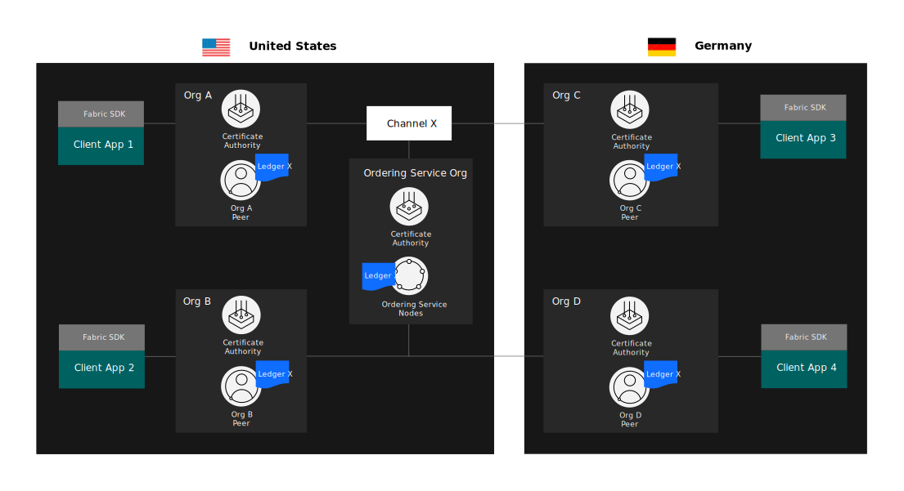
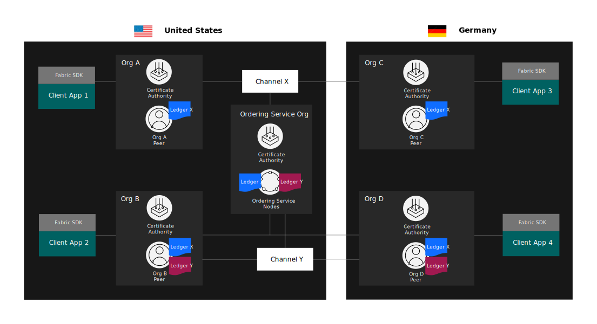
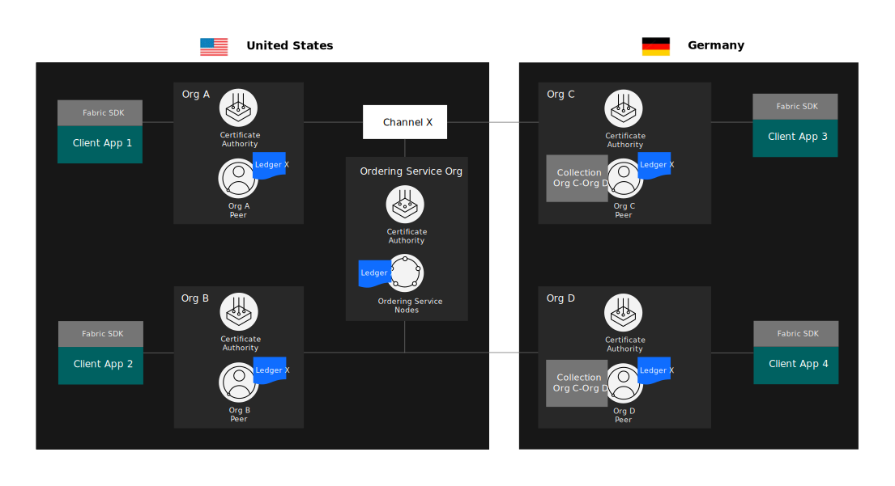
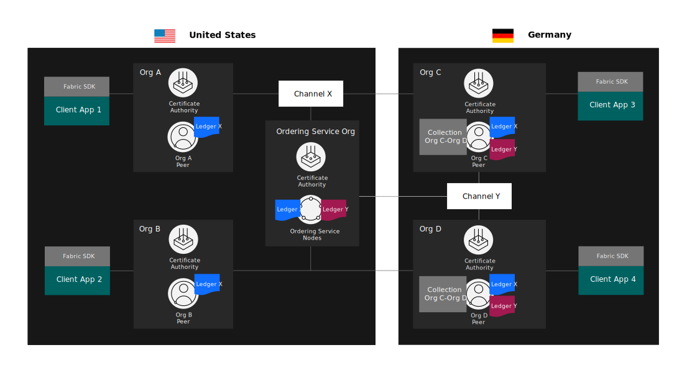
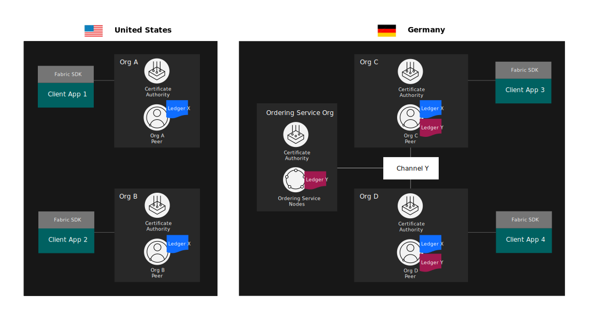
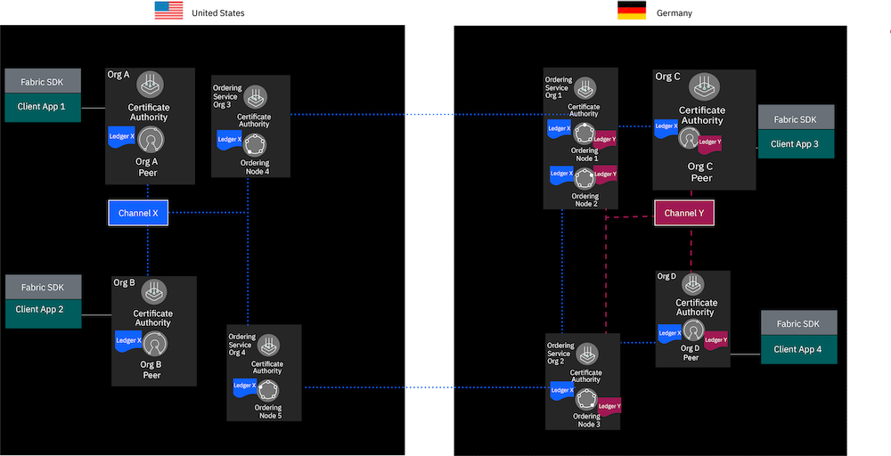

---

copyright:
  years: 2017, 2021
lastupdated: "2021-05-03"

keywords: IBM Blockchain Platform, Data residency, world state

subcollection: blockchain

---

{:shortdesc: .shortdesc}
{:screen: .screen}
{:codeblock: .codeblock}
{:note: .note}
{:important: .important}
{:tip: .tip}
{:pre: .pre}
{:external: target="_blank" .external}

# Data residency
{: #console-icp-about-data-residency}

Because blockchain networks are oblivious to the type of data that is processed, extra steps must sometimes be taken to keep certain kinds of data secure. The most common requirement on data residency is associated with laws within certain countries, which mandate that all data that is processed and stored in an IT system must remain within a specific country’s borders. Similarly, some companies in highly regulated industries, such as government, healthcare, and financial services, require that data must be stored entirely behind their firewall.
{:shortdesc}

Blockchain networks allow multiple organizations to use a distributed ledger to transact and share data in a way that is trusted and secure. However, this implies that data can be distributed across the nodes of the network and the regions where those nodes reside. Organizations can use several options to separate data from the rest of the network and achieve data residency:
1. [Private data collections on a shared channel](#console-icp-about-data-residency-fabric)
2. [Private data collections on a separate channel](#console-icp-about-data-residency-use-case)
3. [A separate channel with all of the nodes on the channel within a single country](#console-icp-about-data-residency-use-case-channel)
4. [A separate channel with only ordering nodes from one country](#console-icp-about-data-residency-raft)

Each approach provides an increased level of isolation and protection for your data, but requires additional effort to implement and manage. To help you understand how each option can be used to achieve data residency, we provide an overview of how data is shared within a Hyperledger Fabric network. We then present an example use case to illustrate how organizations within a blockchain consortium would use each option to separate their data and prevent it from leaving their region.

## How data is shared within an {{site.data.keyword.blockchainfull_notm}} Platform network
{: #console-icp-about-data-residency-fabric}

The architecture of Hyperledger Fabric that underlies the {{site.data.keyword.blockchainfull_notm}} Platform is centered around three key components: an ordering service (made up of ordering nodes), Certificate Authorities (CA), and peers. Additionally, organizations send transactions to these nodes from client applications that use the [Fabric SDKs](https://hyperledger-fabric.readthedocs.io/en/release-2.2/getting_started.html){: external}. When considering data residency, it is important to understand how these components interact with and store data.

**Peers** host ledgers and smart contracts, with the latter governing how changes to the former are made. Ledgers themselves contain two distinct, though related, parts: a world state which records the current value of any key (such as an asset), and a blockchain which contains a literal “chain of blocks” that contain the records of each transaction. Peers receive state updates in the form of new blocks from the ordering service. They then use the blocks and the world state to confirm (or commit) transactions, update the world state and add the log of transactions on the blockchain.

**Ordering nodes** form a Raft ordering cluster that comprises the ordering service of a channel. The ordering service literally “orders” transactions into blocks that are sent to peers to be committed to their ledgers. Each ordering node stores a copy of the blockchain portion of the channel ledger.

**Channels** are the place where organizations interact within a network. You cannot participate in a blockchain network without joining a channel. Channels can be used by members of the network to create logical separation between business applications and even to boost performance by limiting traffic. They can also be used by subsets of organizations in the consortium to transact privately and separate data.

Peers maintain a separate ledger for each channel that they join. Only organizations that are members of the channel can join their peers to the channel and receive ledger updates from the ordering service. As a result, each channel is bound to an ordering service, which stores the blockchain portion of every channel ledger that it maintains. Client applications submit transactions to the peers and ordering service of a given channel. These transactions are added to the transaction log within the blockchain and include a [read-write set](https://hyperledger-fabric.readthedocs.io/en/release-2.2/readwrite.html){: external} that is used to update the key-value pairs in the world state.

If in-country data residency is a requirement, you need to consider the location of your peers and the ordering service, as well as your client applications. You also need to know the location of the peers that belong to other organizations on your channels.
If you are using {{site.data.keyword.blockchainfull_notm}} Platform for {{site.data.keyword.cloud_notm}}, you can find the list of [{{site.data.keyword.blockchainfull_notm}} Platform regions and locations](/docs/blockchain/reference?topic=blockchain-ibp-regions-locations#ibp-regions-locations) where you and the members of your consortium can deploy your components.

## A use case for data residency
{: #console-icp-about-data-residency-use-case}

We can use an example consortium to illustrate how data is distributed on the {{site.data.keyword.blockchainfull_notm}} Platform, and to explore how members can  achieve data residency. The following figure contains a consortium with one ordering service and four organizations. Each organization has one peer node. Two organizations, Org A and Org B, and the ordering service are located in the United States. The other two organizations, Org C and Org D, are located in Germany. All four organizations are members of and have joined their peers to channel X.

{: caption="Figure 1. An example blockchain consortium with one ordering service and four organizations. The four organizations are all members of one channel, Channel X. " caption-side="bottom"}

Each peer joined to channel X stores a copy of the channel ledger, which is displayed in **Figure 1** as Ledger X. Because peers from the United States and Germany are joined to the channel, the data on the channel ledger resides in both geographies. The blockchain portion of the ledger is also stored by the ordering service that is located in the United States.

If two organizations in the consortium create a second channel, Channel Y, a second ledger is created and stored on the peers of channel members. Only the organizations that joined the channel have a copy of the channel data.

{: caption="Figure 2. Two organizations in the consortium have created and joined a second channel, Channel Y. A second channel ledger is created and stored on the peers of Org B and Org D and the ordering service." caption-side="bottom"}

In **Figure 2**, Org B and Org D have joined channel Y. The peers of Org B and Org D now store a copy of ledger Y, in addition to ledger X. Because the same ordering service was used to create channel X and channel Y, the ordering service now has a copy of the blockchain portion of both channel ledgers. In both **Figure 1** and **Figure 2**, data being created by applications in Germany is stored in the United States, which is undesirable if data residency is required.

We can use the previous example to explore the options that organizations can use to achieve data residency. Assume that a regulation in Germany requires some of the data that is created by Org C and Org D to remain within the country. The organizations in Germany can use all four of the following options to prevent data from being stored in the United States.

## Option one: Private data collections on a shared channel
{: #console-icp-about-data-residency-use-case-private-data}

Org C and Org D can use the [private data feature](https://hyperledger-fabric.readthedocs.io/en/release-2.2/private-data/private-data.html#what-is-a-private-data-collection "What is a private data collection?"){: external} of Hyperledger Fabric to prevent data from being distributed to all organizations on the channel. Private data collections allow organizations to share state data peer-to-peer (via a [gossip data dissemination protocol](https://hyperledger-fabric.readthedocs.io/en/release-2.2/gossip.html)) with other organizations that are authorized to read the collection. The data is stored in a private, separate database on the peer. The ordering service is not involved and does not see the private data. Only a hash of the data in the collection is added to the channel ledger and is stored on the peers of other channel members and the ordering service. This allows organizations to verify private data if they want to make the transaction details public. To learn more, visit the [Private Data](https://hyperledger-fabric.readthedocs.io/en/release-2.2/private-data/private-data.html#private-data "Private data"){: external} concept article in the Fabric documentation.

{: caption="Figure 3. Org C and Org D use a private data collection to keep data from being distributed on channel X and from leaving Germany. Hashes of data in the collection are stored on ledger X." caption-side="bottom"}

In **Figure 3**, Org C and Org D have created a private data collection, the `OrgC-OrgD` collection, that allows the organizations to transact without having to share data with Org A, Org B, or the ordering service. The key-value state data inside this collection is only stored on the peers of Org C and Org D and does not leave Germany. However, a hash of the data within the collection is stored on ledger X and shared with the broader channel. This means that a hash of the data in the `OrgC-OrgD` collection is stored on the peers and the ordering service in the United States.

When considering private data, it is important to understand the difference between **hashed data** and **encrypted data**. Encryption uses a two-way function to transform data into a form that hides its original value, but can be converted back to the original state. As an example, when data is sent over a network that is secured using TLS, the data is encrypted using a TLS certificate. It is then sent over the network as crypto text, and then decrypted by the recipient. The encrypted text contains all the original data, and can be decrypted using a private key. However, hashing is a one-way function that uses data to create a unique string of numbers and letters. The hashed data cannot be converted back to the original form using the hash. To verify the data that created the hash, a recipient needs to create a new hash of the original data using the same hash function, and verify that the hash values match. A third party cannot use the hash without a copy of the original data.  

It is important to be aware with this option that while Orgs A and B cannot see the actual ledger data because it is hashed, they are still able to see that Orgs C and D are transacting and can see the volume of transactions that are occurring between them.

Also, consider that data inside a private data collection can be purged from the peers that store it. While data is stored on a channel forever, collections allow members to specify how many blocks are committed to a channel before the [private data is purged](https://hyperledger-fabric.readthedocs.io/en/release-2.2/private_data_tutorial.html#pd-purge){: external}. Once data is removed from the private data collection, the hash on the channel can no longer be used to verify the transaction that created it. In the example network in **Figure 3**, Org C and Org D can use a `block to live` policy to ensure that any data that does not need to persist forever is removed from the network entirely within a specified time period.

## Option two: Private data collections on a separate channel
{: #console-icp-about-data-residency-use-case-private-data-channel}

Org C and Org D can also use private data collections in the context of a separate channel to provide additional isolation for their data. Creating a new channel, Channel Y in this case, ensures that the hash of the private data is only shared with the ordering service, without being shared with other members of the consortium and stored on their peers.

{: caption="Figure 4. Org C and Org D form a separate channel, Channel Y, and use a private data collection. Hashes of data in the collection are stored on ledger Y, and is only stored by the peers in Germany but not on the peers in the United States." caption-side="bottom"}

In **Figure 4**, Org C and Org D have formed a new channel, Channel Y, that does not contain any members in the United States. As a result, hashes of data in the `OrgC-OrgD` collection is stored on ledger Y instead of ledger X, and is not stored on the peers in the United States. Because the ordering service is located in the United States, a hash of the data that is created in Germany still leaves the country.

Creating a separate channel can prevent transaction details from being shared with other organizations in the consortium. If the organizations in Germany used a shared channel, Org A and Org B would be able to see the number of transaction hashes that are committed to the channel ledger by the private data collection. This might provide those organizations visibility into the fact that Orgs C and D are transacting and the volume of transactions that are generated between them. Consider though that forming a new channel requires additional management expense to create and update it. Forming a new channel also makes it harder for Org C and Org D to share data with Org A and Org B.

## Option three: A channel with all components in one country
{: #console-icp-about-data-residency-use-case-channel}

Org C and Org D can also create a channel with all of the infrastructure within the same country. This requires that the peers joined to the channel, the applications, and the ordering service all reside within the same region. In this scenario, none of the data that is stored on the channel ledger will leave the region and be stored outside the country.

{: caption="Figure 5. Org C and Org D create a new channel using an ordering service located in Germany. All data is stored in the country on Ledger Y." caption-side="bottom"}

In **Figure 5**, Org C and Org D have created a new channel for data that must not leave Germany. This requires the creation of a new ordering service that is located in Germany to ensure that the orderer's copy of the channel ledger is stored inside the country. Since in this case the ordering service, the OrgC-peer, and the OrgD-peer are located in Germany, Org C and Org D can now keep the data public on the channel if they choose, or they could still decide to use private data collections to prevent the full transaction data from being stored on the ordering service.

Creating a channel with all of the components in one country ensures that all of the data resides within one region, including the key-value pairs, the blocks, and the hashes of any private data. However, this option requires the resources to maintain a new channel and the costs that are associated with maintaining the ordering service.

## Option four: A separate channel with only ordering nodes from one country
{: #console-icp-about-data-residency-raft}

When you initially deploy an ordering service, you create a set of ordering nodes that will be available to the application channels for transaction processing. A major benefit of the Raft ordering service is that you can configure a channel to only use specific ordering nodes from the ordering service. That's why the console includes an Advanced Channel creation option to select a subset of ordering nodes to include in the channel consenter set, where each ordering node that you select will contain a copy of the channel ledger. Therefore, it is possible to restrict the channel ledger locations to only nodes that reside in country.

{: caption="Figure 6. Org C and Org D create a Channel Y using ordering nodes only located in Germany. All data is stored in the country on Ledger Y." caption-side="bottom"}

In **Figure 6**, the ordering nodes that participate in the Raft ordering service are spread across the two countries. Two ordering nodes are located in the United States, and three ordering nodes are in Germany for a total of five ordering nodes. When **Channel X** is created, all five ordering nodes are included in the consenter set, which would _not_ meet a data residency requirement as the ledger data is spread across both countries. **Channel Y** however only includes the three ordering nodes that reside in Germany, which guarantees that all ledger data for this channel stays in country. A minimum of three ordering nodes is recommended because this configuration allows for one node to go down and two nodes to be available to maintain "quorum", the minimum number of nodes that must be available (out of the total number) for the ordering service to process transactions. A more robust configuration would be to include five ordering nodes in Germany for **Channel Y**, which means that two nodes could go down without losing quorum.

The easiest way to achieve this configuration is to spread the ordering nodes across Kubernetes clusters in different regions, a process that is described in the [Setting up multiregion High Availability (HA) deployments for the ordering service](/docs/blockchain?topic=blockchain-ibp-console-hadr-mr-os) tutorial.

## Considerations around using the {{site.data.keyword.blockchainfull_notm}} Platform console
{: #console-icp-about-data-residency-considerations}

When you create an {{site.data.keyword.blockchainfull_notm}} Platform service instance in {{site.data.keyword.cloud_notm}}, you need to link the service instance to your Kubernetes cluster on {{site.data.keyword.cloud_notm}}. No ledger data is ever transmitted to the blockchain service instance that is running in {{site.data.keyword.cloud_notm}}.

When you use your console to view the channel details, ledger data is visible in your browser. The ledger data is transmitted directly from the Kubernetes cluster to your browser.
It is not passed to the service instance running on {{site.data.keyword.cloud_notm}}.

Therefore, to preserve data residency, the end user's browser and the Kubernetes cluster must reside in the same country.

## Reference material
{: #console-icp-about-data-residency-reference}

For a deeper understanding of the flow of data on the {{site.data.keyword.blockchainfull_notm}} Platform network, refer to the [Fabric documentation on transaction flow](https://hyperledger-fabric.readthedocs.io/en/release-2.2/txflow.html){: external}.

You can get more information about Private data collections and Zero Knowledge Proof in the white paper about [Private and confidential transactions with Hyperledger Fabric](https://developer.ibm.com/tutorials/cl-blockchain-private-confidential-transactions-hyperledger-fabric-zero-knowledge-proof/){: external}.
