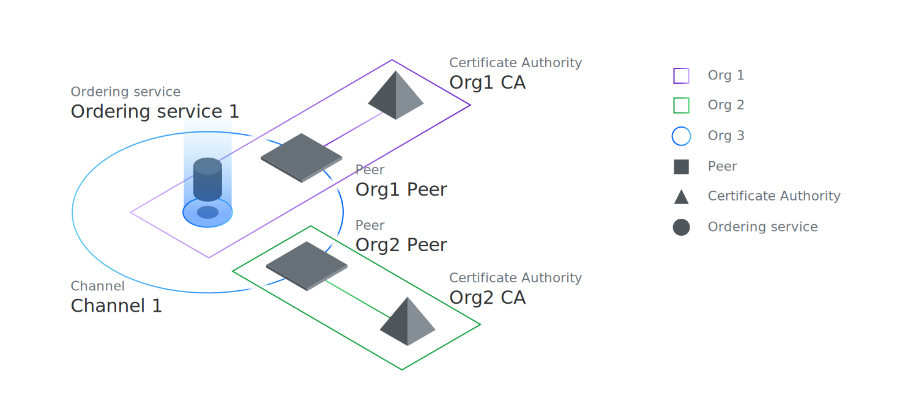

---

copyright:
  years: 2020
lastupdated: "2020-11-20"

keywords: ansible playbooks, docker image, blockchain network, APIs, ansible galaxy

subcollection: blockchain

---

{:external: target="_blank" .external}
{:shortdesc: .shortdesc}
{:codeblock: .codeblock}
{:javascript: data-hd-programlang="javascript"}
{:java: data-hd-programlang="java"}
{:screen: .screen}
{:note: .note}
{:important: .important}
{:term: .term}
{:tip: .tip}
{:help: data-hd-content-type='help'}
{:support: data-reuse='support'}
{:pre: .pre}


# Building an IBM Blockchain Platform network using Ansible playbooks
{: #ansible-build}

Customers can use Ansible playbooks to automate the setup and tear down of {{site.data.keyword.blockchainfull}} Platform network components.
{:shortdesc}

**Target audience:** This topic is designed for system administrators or operators who are responsible for creating or removing components in an {{site.data.keyword.blockchainfull_notm}} Platform network and are new to Ansible playbooks.

In this tutorial, we gather the connection information to your console and demonstrate how to use that information configure the playbooks. The playbooks group and automate common network deployment tasks so that you can bypass manually configuring your network from the console. We teach you how to run an individual playbook and then how to run them sequentially from a script.  In just a few minutes, you can deploy an entire set of blockchain components that are ready to process transactions on your {{site.data.keyword.blockchainfull_notm}} Platform network.

The Ansible scripts can be used to build the following network that includes two organizations (Org1 and Org2) that each contains one peer and an [ordering service](#x9826021){: term} with a [channel](#x2016483){: term} joined by both peers. It's a simple process to customize the playbooks with your own component or organization names. They can also be used to deploy smart contracts on the channel. And as you become more proficient, you can use the playbooks to build additional organizations, peers, ordering services, and channels according to your use case.

{: caption="Figure 1. Network components created by the Ansible playbooks" caption-side="bottom"}

## Prerequisites
{: #ansible-build-prereqs}

Before using the playbook, you need to complete the following steps:
- [Link an instance of the {{site.data.keyword.blockchainfull_notm}} Platform](/docs/blockchain?topic=blockchain-ibp-v2-deploy-iks-ic#ibp-v2-deploy-iks-create-service-instance) to your Kubernetes cluster on {{site.data.keyword.cloud_notm}}.
- Review the topic on [Getting started with Ansible playbooks on the {{site.data.keyword.blockchainfull_notm}} Platform](/docs/blockchain?topic=blockchain-ansible).
- Install [Docker](https://docs.docker.com/get-docker/){: external}.

## Step one: Gather console connection information
{: #ansible-build-console}

After you deploy an {{site.data.keyword.blockchainfull_notm}} Platform service instance, you need to gather the connection information for the console.

When your cluster is running in {{site.data.keyword.cloud_notm}}, you need to create **service credentials** for the {{site.data.keyword.blockchainfull_notm}} Platform service instance. The Ansible playbooks use the {{site.data.keyword.blockchainfull_notm}} Platform REST APIs to interact with the console. The REST APIs use the **API key** (api_key) and **API endpoint** (api_endpoint) to authenticate with the server and retrieve a Cloud Identity and Access Management (IAM) access token. The values of the `api_endpoint` and `api_key` for the console can be found in the generated **service credentials**.  

Follow instructions on [retrieving service credentials](/docs/blockchain?topic=blockchain-ibp-v2-apis#ibp-v2-apis-retrieve-service-credentials){: external} in {{site.data.keyword.cloud_notm}} to gather these values now that are used with the playbooks later in this topic.


## Step two: Clone the Ansible collection
{: #ansible-build-clone}

The Ansible collection source code is available in a GitHub repository. You need to clone the Ansible collection to your local system so that you can run the playbooks and customize them according to your use case. From the command line on your local system run the command:
```
git clone https://github.com/IBM-Blockchain/ansible-collection.git
```
{: codeblock}

We'll explore the contents of this collection in the next section.

## Step three: Get started with using the playbooks
{: #ansible-build-get-start}

After you clone the Ansible collection to your local system, open the `ansible-collection` directory and navigate to the `tutorial` folder and take a moment to review the contents.

  ```bash
  cd ansible-collection/tutorial
  ```
  {: codeblock}

The first thing that you notice is that the playbook `.yml` files are numbered. Because the playbooks build on each other, the numbers help you understand the order that they should be run. When you want to change some of the configuration properties, you can edit the `.yml` files and insert your own custom values, for example, if you want to customize a node name or use a different enrollment id. Each playbook includes either a **role** or a **task**. A role includes a set of tasks that in turn call the associated [modules](https://ibm-blockchain.github.io/ansible-collection/modules.html) that submit the requests to your cluster.

The next thing to notice is the set of variable files `ordering-org-vars.yml` (Ordering Org), `org1-vars.yml` (Org1), and `org2-vars.yml` (Org2) that define the {{site.data.keyword.blockchainfull_notm}} Platform console connection details for each organization. These variable files are used by the playbook when you run it. This means that before you run a playbook, if it uses a variable file, you need to customize the associated variable file with the connection information that you gathered in the previous step. When a playbook requires a variables file, it is included in the playbook .yml file.

The variable files include the following four fields that define your connection information to your console:
```
api_endpoint: https://ibp-console.example.org:32000
api_authtype: ibmcloud
api_key: xxxxxxxx
api_secret: xxxxxxxxxxxxxxxxxxxxxxxxxxxxxxxx
```


You need to replace the fields with the following values:

- `api_endpoint` - Set this value to the api_endpoint from your service credentials.
- `api_authtype` - Because your cluster is in {{site.data.keyword.cloud_notm}}, this value needs to be set to `ibmcloud`.
- `api_key` - to the value of api_key contained in the service credentials.
- `api_secret` - This value is not used for clusters in {{site.data.keyword.cloud_notm}}. No value is required here.   

Refer to [Gather console connection information](#ansible-build-console) for instructions on how to get the service credentials.

You can go ahead now and modify the `ordering-org-vars.yml` (Ordering Org), `org1-vars.yml` (Org1), and `org2-vars.yml` files with your console connection information.

There is also a common variables file, `common-vars.yml`. You do not need to edit this variable file right now. This file contains variables that are used by multiple organizations, for example the name of the channel that will be created, and the name of the smart contract that will be deployed. Later, when you are ready to create your own custom network you will want to modify these values according to your business use case.

## Step four: Run a playbook
{: #ansible-build-run-playbook}

These instructions assume that you have installed [Docker](https://docs.docker.com/get-docker/){: external}) in order to use the Ansible playbooks. If you have installed all of the prerequisites locally on your system instead, you can refer to the [Ansible documentation](https://ibm-blockchain.github.io/ansible-collection/tutorials/building.html#exploring-the-playbooks){: external} for instructions on how to run the playbooks.
{: note}

1. We use a Docker command to run the first playbook that creates an ordering organization named **Ordering Org**, with a certificate authority named **Ordering Org CA**, and finally a single node ordering service named **Ordering Service**. If you have not already, go ahead and modify the console connection variables inside the `ordering-org-vars.yml` by using the instructions from the previous section. You are now ready to run an Ansible playbook from Docker.

  The following command invokes the `01-create-ordering-organization-components.yml` playbook.

  ```
  docker run --rm -v <FULLY-QUALIFIED-PATH-TO-PLAYBOOKS>:/playbooks ibmcom/ibp-ansible ansible-playbook /playbooks/<PLAYBOOK>.yml
  ```
  {: codeblock}

  where:
  - `--rm` tells Docker to remove the container when the command completes.
  - `-v <FULLY-QUALIFIED-PATH-TO-PLAYBOOKS>` is used to mount the `tutorial` folder into the Docker container. Replace `<FULLY-QUALIFIED-PATH-TO-PLAYBOOKS>` with the fully qualified path to where the `tutorial` folder resides on your local system. When you run the command from the `tutorial` folder you can replace this value with `$PWD`.
  - `ibmcom/ibp-ansible` represents the tag of the Docker image published by {{site.data.keyword.IBM_notm}}.
  - `<PLAYBOOK>` is used to designate which playbook to run.

  For example:
  ```
  cd tutorial
  docker run --rm -v $PWD:/playbooks ibmcom/ibp-ansible ansible-playbook /playbooks/01-create-ordering-organization-components.yml
  ```
  {: codeblock}

  While the command is running, you see output from each task. You can safely ignore the following warning:
  ```
  [WARNING]: provided hosts list is empty, only localhost is available. Note that the implicit localhost does not match 'all'`.
  ```

  When the playbook is finished, in the `PLAY RECAP` section, you see output similar to:
  ```
  PLAY RECAP *********************************************************************
  localhost                  : ok=7    changed=5    unreachable=0    failed=0    skipped=1    rescued=0    ignored=0    
  ```

  If the playbook completes successfully, you should see `failed=0`. Go ahead now and log in to your console to confirm that **Ordering Org** CA, **Ordering Org** organization, and **Ordering Service** was created.

2. The same instructions can be repeated for the next playbook, `02-create-endorsing-organization-components.yml`. This playbook creates an endorsing organization named **Org1**, with a certificate authority named **Org1 CA**, and then a peer named **Org1 Peer**. When you open the playbook, notice in the comments that this playbook uses a different variables file `org1-vars.yml`. Edit that file with your console connection information. And then run that playbook:
  ```
  docker run --rm -v $PWD:/playbooks ibmcom/ibp-ansible ansible-playbook /playbooks/02-create-endorsing-organization-components.yml"
  ```
  {: codeblock}

  Again, if you check your console, you can see that the **Org1 CA**, **Org1** organization, and **Org1 Peer** was created.

3. You can continue running each playbook individually in the list to stand up a basic network that contains an ordering service, two peer organizations, two peers, and a channel. The playbooks also install smart contracts on the peers and instantiate them on the channel.

Check out this topic on [Exploring the playbooks](https://ibm-blockchain.github.io/ansible-collection/tutorials/building.html#exploring-the-playbooks){: external} for more information about how each playbook works.

By now, you are probably interested in scripting these commands together to stand up or even tear down the components. The next section walks you through how to do that.

## Step five: Run a script
{: #ansible-build-run-script}

At this point you've experienced how powerful the Ansible playbooks can be for programmatically deploying network components, creating channels and installing and instantiating smart contracts.  But it is likely that you will want to script them together to build reproducible networks. That's why in the `tutorial` folder a set of scripts are provided  that run groups of playbooks together in a logical order:

- `build_network.sh` - This is a script that runs a set of playbooks that create an entire simple network, the same one that can be created if you manually build the network by completing the [Build a network](/docs/blockchain?topic=blockchain-ibp-console-build-network) tutorial.  When you call the script with the `build` option, it configures a single node ordering service, a peer organization and a peer. It installs the `fabcar` smart contract on the peer, creates a channel and joins the peer to the channel.  If you run the script with the `destroy` option it removes all of these artifacts from your cluster. For details, see [Building a network](https://ibm-blockchain.github.io/ansible-collection/tutorials/building.html).

- `join_network.sh` - Run this script when you want to join a peer organization to an existing channel.  For more details see [Joining a network](https://ibm-blockchain.github.io/ansible-collection/tutorials/joining.html).

- `deploy_smart_contract.sh` - This script can be used to install a smart contract on one or more peers in your organization and instantiate it on a channel. For more details see [Deploying the smart contract](https://ibm-blockchain.github.io/ansible-collection/tutorials/deploying.html#deploying-the-smart-contract).

Before running any script, you need to update the console connection settings in the `ordering-org-var.yml`, `org1-vars.yml` and `org2-vars.yml` files. Go ahead and try out the `build_network.sh` script by running the following Docker command from your `tutorial` folder:

```
docker run --rm -v "$PWD:/tutorials" ibmcom/ibp-ansible /tutorials/build_network.sh -i build
```
{: codeblock}

If you are paying close attention, you might notice that the playbooks will run even if the artifacts that you are deploying already exist. In that case, you can see in the `PLAY RECAP` status that `changed=0`, meaning the playbook detected that the node already exists and did not try to recreate it. You can also run the `build_network.sh` with the `destroy` option to remove all the nodes and metadata that were created when you ran the `build_network.sh` script with the `build` option. Give it a try now by running the command:

```
docker run --rm -v "$PWD:/tutorials" ibmcom/ibp-ansible /tutorials/build_network.sh -i destroy
```
{: codeblock}

## Hints and Tips
{: #ansible-build-hints}

| Tip | Action |
|----------|---------|
| **Increasing the wait timeout** | Some clusters perform faster than others. The scripts use a default wait timeout of **600** seconds, which is sufficient for most environments. The wait timeout represents the maximum amount of time the playbook waits for the underlying transactions to complete before it logs a failure. If you need to increase the timeout, open the associated variables file (`ordering-org-vars.yml`, `org1-vars.yml`, or `org2-vars.yml`) and modify the value of the `wait_timeout:` parameter.|
| **Customizing organization names** | The playbooks use the organization names that are defined in the  `common-vars.yml` file. When you are ready to configure your own organizations, you can edit the file and specify the preferred organization names for your network. |
| **Customizing the name of the ordering service** | The default ordering service name is defined in the `common-vars.yml` file in the `ordering_service_name` parameter. Edit this value to specify the preferred name of the ordering service. |
| **Adjusting how many ordering nodes are created for an ordering service** |By default, the `01-create-ordering-organization-components.yml` playbook is configured to create a single node ordering service. If your cluster has the resources to support additional ordering nodes in the ordering service, you can modify how many ordering nodes are created when the ordering service is deployed by editing the `01-create-ordering-organization-components.yml` playbook and specifying the number of ordering nodes you want to deploy in the `ordering_service_nodes:` parameter. |
| **Adjusting node resources** | You can customize the resources allocated to a node by editing the `resources` block of it's associated module. For example, to modify the CPU and memory allocated to a CA node, navigate to your clone of the  [certificate_authority](https://github.com/IBM-Blockchain/ansible-collection/blob/master/plugins/modules/certificate_authority.py) module on your local system. Scroll down to the `resources` section and modify the values assigned to `cpu` and `memory`. Likewise, you can modify peer resources in your clone of the  [peer](https://github.com/IBM-Blockchain/ansible-collection/blob/master/plugins/modules/peer.py) module or the ordering service resources in the [ordering service](https://github.com/IBM-Blockchain/ansible-collection/blob/master/plugins/modules/ordering_service.py) module. |
| **Using your own smart contract** | By default, the `19-install-chaincode.yml` and `20-instantiate-chaincode.yml` playbooks use the `fabcar` sample smart contract. When you are ready to deploy your own smart contract, you need to: <br><ol><li>Include the smart contract package in the `tutorial` directory and name it using the format `<SMART-CONTRACT-NAME>@<VERSION>.cds`.</li><li> Refer to your smart contract by replacing the value of the  `smart_contract_base_name:` and `smart_contract_version:` parameters in the `common-vars.yml` file.</li></ol> |
| **Using your own enroll ID and secrets** | When the playbooks deploy a node, it uses the enroll IDs specified in the [01-create-ordering-organization-components.yml](https://github.com/IBM-Blockchain/ansible-collection/blob/master/tutorial/01-create-ordering-organization-components.yml) and  [02-create-endorsing-organization-components.yml](https://github.com/IBM-Blockchain/ansible-collection/blob/master/tutorial/02-create-endorsing-organization-components.yml) files. The associated enroll secrets are provided in the corresponding variable files [ordering-org-vars.yml](https://github.com/IBM-Blockchain/ansible-collection/blob/master/tutorial/ordering-org-vars.yml), [org1-vars.yml](https://github.com/IBM-Blockchain/ansible-collection/blob/master/tutorial/org1-vars.yml), and [org2-vars.yml](https://github.com/IBM-Blockchain/ansible-collection/blob/master/tutorial/org2-vars.yml). You can customize the values of the enroll ID and secrets in these files according to your needs. |
{: caption="Table 1. Hints and tips for using the Ansible collection" caption-side="bottom"}

## Next steps
{: #ansible-build-next-steps}

Now that you have used the playbooks to deploy your components or even scripted the deployment of your network, you can continue to use the console UI to interact with and govern your blockchain components. You will notice right away that the Ansible scripts do not associate an identity with the nodes that it deploys. If you plan to operate the nodes from the console, you need to use a manual process to upload the node identities to the console wallet and associate them with the nodes. The generated node identities are `JSON` files and are stored in the `tutorial` folder.

### Generated identities
{: #ansible-build-import-identities}
The following table lists the names of the `JSON` files that contain the identities generated by the `build_network.sh` script with the `build` option or the `join_network.sh` script for the case of Org 2. If you customized organization names inside the playbook `.yml` files, it is possible that your JSON files will be named differently. In order to operate the nodes from the console, you need to import all of the generated identities into the console wallet using the following process:

1. Navigate to the console wallet and click **Add identity**.
2. Click the **Upload JSON** tab and browse to the generated identities in the `tutorial` folder and click **Add identity**.
3. Repeat these steps for each identity file in the table below.

|  | **Ordering Org**    | **Org1** | **Org2** |
|--|-----------------|------|------|
| **Organization Admin** | Ordering Org Admin.json | Org1 Admin.json | Org1 Admin.json |
| **Organization CA Admin** | Ordering Org CA Admin.json | Org1 CA Admin.json | Org2 CA Admin.json|
{: caption="Table 1. File names of organization admin identities " caption-side="bottom"}

When you run the `build_network.sh` script with the `destroy` option, all of the nodes and associated metadata are removed from your cluster, but any identities that you manually imported into the console wallet are not removed. Before you run the `build_network.sh` script again with the `build` option, you need to manually remove each identity, by opening it in the wallet and then clicking **Remove identity**.
{: important}

Using the wallet identities from the preceeding table, you can now follow the steps in the table below to associate identities for each node type.

| Associate an identity with CAs |
|:-------------------------------|
| <ul><li>Navigate to the **Nodes** tab.</li><li>Open the **Ordering Org CA** and click **Associate identity**.</li><li>Click the **Existing CA** tab and select the **Ordering Org CA Admin**.</li><li>If you created the endorsing organizations for the peers, repeat these steps for the **Org1 CA** and **Org2 CA** nodes, associating the **Org1 CA Admin** and **Org2 CA Admin** identities respectively.</li></ul> |
{: class="simple-tab-table"}
{: caption="Table 2. CA identities" caption-side="top"}
{: #simpletabtable1}
{: tab-title="CAs"}
{: tab-group="IAM-simple"}

| Associate an identity with peers |
|----------------------------------|
| <ul><li>Navigate to the **Nodes** tab.</li><li>Open the **Org1 Peer** and click **Associate identity**.</li><li>Select the **Org1 Admin** from the drop-down list and click **Associate identity**.</li><li>If you created the second endorsing organization (Org2) for the peers, repeat these steps for the **Org2 Peer** by associating the **Org2 Admin** identity.</li></ul>  |
{: caption="Table 2. Peer identities" caption-side="top"}
{: #simpletabtable2}
{: tab-title="Peer nodes"}
{: tab-group="IAM-simple"}
{: class="simple-tab-table"}

| Associate an identity with the ordering service |
|-------------------------------------------------|
| <ul><li>Navigate to the **Nodes** tab.</li><li>Open the **Ordering Service** and click **Associate identity**.</li><li>Select the **Ordering Org Admin** from the drop-down list and click **Associate identity**.</li></ul> |
{: caption="Table 2. Ordering service identities" caption-side="top"}
{: #simpletabtable3}
{: tab-title="Ordering service"}
{: tab-group="IAM-simple"}
{: class="simple-tab-table"}

## Summary
{: #ansible-build-summary}

Congratulations. You have used the Ansible playbooks to configure {{site.data.keyword.blockchainfull_notm}} Platform components on your cluster. You know how to run a playbook individually and have some sample shell scripts that show how to run the playbooks together to build a reproducible network and tear it back down. You can explore further by building your own playbooks that call the Ansible [modules](https://ibm-blockchain.github.io/ansible-collection/modules.html){: external} or build your own custom scripts according to your network use case.
