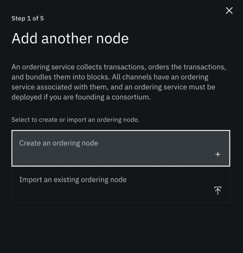

---

copyright:
  years: 2019, 2020
lastupdated: "2020-07-13"

keywords: network components, IBM Cloud Kubernetes Service, batch timeout, channel update, channels, Raft, channel configuration, orderer, ordering node, ordering service, tutorial

subcollection: blockchain

---

{:external: target="_blank" .external}
{:shortdesc: .shortdesc}
{:screen: .screen}
{:codeblock: .codeblock}
{:note: .note}
{:important: .important}
{:tip: .tip}
{:pre: .pre}

# Adding and removing ordering service nodes
{: #ibp-console-add-remove-orderer}

In this tutorial, we'll talk about the process for creating ordering nodes to add to an existing ordering service and to existing channels. This will cover the instructions for adding nodes using the same organization that created the ordering service as well as the steps when using a separate ordering organization that is added as an ordering service admin.

Because ordering nodes can only belong to a single ordering service, if you create an ordering service node from the main **Nodes** panel, you will not be able to add it to an existing ordering service. If you want to add a node to an existing ordering service, the node must be created specifically for that purpose using the process described below. Also, be aware that **adding nodes to an ordering service does not automatically add them to any existing channel**. That is a separate process that must take place after the node has been added to the ordering service. For more information, see [Adding and removing ordering service consenters](#ibp-console-add-remove-orderer-consenters-add).
{:important}

## Number of ordering nodes
{: #ibp-console-add-remove-orderer-suggested-ordering-node-configurations}

While it's technically possible to build a configuration of any number of ordering nodes (no configuration is explicitly restricted), some numbers provide a better balance between cost and performance than others. The reason for this lies in satisfying the needs of high availability (HA) and in understanding the Raft concept of the "quorum", the minimum number of nodes that must be available (out of the total number) for the ordering service to process transactions.

In Raft, a **majority of the total number of nodes** is needed to form a quorum. In other words, if you have one node, you need that node available to have a quorum, because the majority of one is one. Similarly, if you have two nodes, you will need both available, since the majority of two is two (for this reason, a configuration of two nodes is discouraged; there is no advantage to a two node configuration). In a similar vein, the majority of three is two, the majority of four is three, the majority of five is three, and so on.

While satisfying the quorum will make sure the ordering service is functioning, production networks also have to think about deployment configurations that are highly available (in other words, configurations in which the loss of a certain number of nodes can be tolerated by the system). Typically, this means tolerating two nodes failing: one node going down during a normal maintenance cycle, and another going down for any other reason (such as a power outage or error).

This is why, by default, the console offers two options: one node or five nodes. Recall that the majority of five is three. This means that in a five node configuration, the loss of two nodes can be tolerated. If your configuration features four nodes, only one node can be down for any reason before **another** node going down means a quorum has been lost and the ordering service will stop processing transactions.

For this reason, it is considered a best practice to have an odd number of nodes in an ordering service. There is nothing wrong with an even number of nodes, but they add costs without making the ordering service more highly available.

Because the number of nodes needed for a quorum is updated automatically when nodes are added to the consenter set, it is a best practice to make sure that all of the nodes in the consenter set are servicing the channel before attempting to add a new node. This is because the consenter set is updated before the node has finished provisioning. For example, if you have three nodes servicing a channel, you will have a quorum as long as two nodes are up. When attempting to add a new node, the consenter set will index to three nodes being needed (out of four). In a case where only two nodes are up out of three when a new node is added, and the new node fails to provision for any reason, you will only have two nodes available out of the three that are needed.
{:tip}

## Overview
{: #ibp-console-add-remove-orderer-add-orderer}

Adding a node to the ordering service is, at a high level, a three step process.

1. Create the node to be added to an existing ordering service.
2. Add the node to the ordering system channel. While this might seem logically similar to creating the node, it involves a different step. For more information, see [Adding the node to the ordering system channel](#ibp-console-add-remove-orderer-consenter-system-channel).
3. [Add the node to any application channels](#ibp-console-add-remove-orderer-consenters-add) where you want it to become a consenter.

If you have already created an ordering service, you can reuse the CA, MSP, node identity, and admin identity you created as part of that process when creating the new node and can skip down to the [Create the node](#ibp-console-add-remove-orderer-add-orderer-create-node) section below. If you are creating the node using either a separate console and separate organization (or both), proceed to [Create the node using a separate org and console](#ibp-console-add-remove-orderer-add-orderer-create).

### Create the CA and organization for the new node
{: #ibp-console-add-remove-orderer-add-orderer-create}

If an organization other than the organization that created the ordering service wishes to create a new node, they will need to complete several steps. For the purpose of this tutorial, it is assumed that a user has followed the [Build a network tutorial](/docs/blockchain?topic=blockchain-ibp-console-build-network) in their console and has created a peer, ordering service, and an application channel. Subsequent to this, **a separate user, with a separate console, wishes to add a node to that ordering service, which is called `Ordering Service`**.

As part of describing the process for creating a new node from a separate console, we will refer to "Console 1" and "Console 2". Console 1 is the originating console; it's where the ordering service was originally created. Console 2 is where a user is attempting to create a new node for this ordering service using a different organization in a different console.
{: important}

**Unless you have already created new nodes for this ordering service, do not reuse an existing CA and MSP**.

The process of creating a CA, registering identities, and creating an MSP is identical to the process described in [Creating your ordering service organization CA](/docs/blockchain?topic=blockchain-ibp-console-build-network#ibp-console-build-network-create-orderer-ca) from the Build a network tutorial. However, use the following values:

**Task: Create a CA and register users**

  | **Field** | **Description** | **Enroll ID** | **Secret** | **Type** |
  | ------------------------- |-----------|-----------|-----------|-----------|-----------|
  | **Create CA** | Ordering Service2 CA | admin | adminpw ||
  | **Register users** | Ordering Service2 admin | OS2admin | OS2adminpw | admin |
  |  | Ordering Service node identity |  OS2 | OS2pw | orderer |
  {: caption="Table 1. Create a CA and register users" caption-side="bottom"}

If you are using a separate console, it is possible to specify exactly the same values for these fields as was specified in the Build a network tutorial. Only the `mspid` from the fields below must be different than `osmsp`, as two different MSPs cannot have the same ID in the same console (the MSP you create here will be exported to the other console in a future step). However, we have given different values in this tutorial in case users are running this tutorial inside the same console.
{:tip}

After your CA has been created and your identities have been registered, create the MSP representing your organization and an admin representing that organization using the following values:

**Task: Create the ordering service organization MSP definition**

  |  | **Display name** | **MSP ID** | **Enroll ID**  | **Secret** |
  | ------------------------- |-----------|-----------|-----------|-----------|
  | **Create Organization** | Ordering Service2 MSP | os2msp |||
  | **Root CA** | Ordering Service2 CA ||||
  | **Org Admin Cert** | |  | OS2admin | OS2adminpw |
  | **Identity** | Ordering Service2 MSP Admin |||||
  {: caption="Table 11. Create the ordering service organization MSP definition" caption-side="bottom"}

#### Console 2: export the `Ordering Service2 MSP`
{: #ibp-console-add-remove-orderer-add-orderer-export-MSP}

Now that you have created the `Ordering Service2 MSP`, you need to export it to other members of the network (in this tutorial, that means exporting it to the operator of Console 1). You should have downloaded a copy of your MSP to your local machine during the creation process, but if you have not yet done so, download the MSP now. Then send the JSON to the operator of the other console out of band.

Until your organization is an administrator of the ordering service, you cannot add a new node to it.

{: caption="Figure 1. Export the MSP from Console 2" caption-side="bottom"}

#### Console 1: import `Ordering Service2 MSP` and export `Ordering Service`
{: #ibp-console-add-remove-orderer-add-orderer-export-ordering-service-console1}

The operator of Console 1 must take the `Ordering Service 2 MSP` and add it to its console by clicking on the **Organizations** tab and then the **Import MSP definition** tab.

{: caption="Figure 2. Import the MSP into Console 1" caption-side="bottom"}

This MSP can then be added as an ordering service administrator by clicking on the tile representing the ordering service and then the **Add ordering service administrator** tab and selecting `Ordering Service 2 MSP` from the drop-down list.

{: caption="Figure 3. Make Ordering Service2 MSP an admin" caption-side="bottom"}

While it is also possible to upload a JSON representing the MSP by clicking the **Upload JSON** tab, be aware that if you do this, the MSP will not appear in the **Organizations** tab and will therefore not be selectable later (for example, when updating an application channel to add the MSP as an ordering service administrator). For this reason, the best practice is to import the MSP through the **Organizations** tab first.
{: tip}

After the MSP has been added as an ordering service administrator, the operator of Console 1 must export the ordering service to Console 2. To export a node, navigate to the node and click on the "download" button (the button looks the same as it does in the above image showing the download of `Ordering Service2 MSP`). Then send the JSON file representing the ordering service to the operator of Console 2.

#### Console 2: import `Ordering Service`
{: #ibp-console-add-remove-orderer-add-orderer-import-ordering-service-console2}

After the operator of Console 2 has the JSON representing `Ordering Service` on its file system, they must click **Add ordering service** on the **Nodes** panel. Then, they must click **Import an existing ordering service** and click **Next**. On the following panel, they can click **Add file** and select the ordering service. Note that importing and associating an admin identity for this ordering service is an optional step. You can create a new node either way.

After Console 2 has imported the `Ordering Service`, they will be able to create the new node.

{: caption="Figure 4. Import the ordering service" caption-side="bottom"}

### Create the node
{: #ibp-console-add-remove-orderer-add-orderer-create-node}

While it is not possible to ensure that the ordering service is available (that is, that a quorum of nodes are up and that a leader has been elected) without [Viewing your node logs](/docs/blockchain?topic=blockchain-ibp-console-manage-console#ibp-console-manage-console-node-logs), it is a best practice to minimally ensure the likelihood that a quorum exists by verifying that the pods where the nodes have been deployed are available. This can be done by checking to make sure the relevant pods are active in the Kubernetes dashboard or by issuing `kubectl get pods -n <namespace>` and checking on the pods. If you do not have access to the cluster where all of the ordering nodes were created, contact the administrator of the relevant clusters. **If a quorum of nodes is not available, it will not be possible to add another node to the ordering service**.
{:tip}

To add a node, click on the tile representing the ordering service in the **Nodes** panel. Then click on the **Ordering nodes** panel and the **Add another node** tile. Then click **Create an ordering node**. This will open a series of panels similar to the process for creating an ordering service.

{: caption="Figure 5. Add another node" caption-side="bottom"}

You will need to:

* **Give the node a display name**. A best practice will be to give the node a display name that matches the pattern used for the other nodes in the ordering service. By default, nodes are given the name `<name of ordering service>_1`, `<name of ordering service>_2`, and so on.
* **Select a CA**. This should be the CA used to create your MSP.
* **Enter an enroll ID and secret**. Again, if you created an enroll ID and secret for your existing ordering nodes, you may use the same enroll ID and secret here.
* **Select an MSP**. If you are adding to an ordering service you created in your console, reuse the MSP you used when creating that ordering service. If the new node is being added to an ordering service created elsewhere, use the MSP you exported to that console.
* **Associate identity**. You will only have to associate an identity if you are using a different MSP from the MSP that was originally used when creating the ordering service.

**Task: Create an ordering service**

  |  | **Display name** | **MSP ID** | **Enroll ID** | **Secret** |
  | ------------------------- |-----------|-----------|-----------|-----------|
  | **Add another node** | Ordering Service_2 ||||
  | **CA** | Ordering Service2 CA ||||
  | **Ordering Service Identity** | |  | OS2 | OS2pw |
  | **Organization MSP** | Ordering Service2 MSP | os2msp |||
  | **Administrator certificate** | Ordering Service2 MSP ||||
  | **Associate identity** | Ordering Service2 MSP Admin   |||||
  {: caption="Table 2. Create an ordering service" caption-side="bottom"}

After reviewing the **Summary** page, click **Add another node**. This will submit the creation request.

To complete the process of adding the node, you need to add it to the consenter set of the system channel. For information about how to do that, proceed to the next section.

#### Add the `Ordering Service_2` node to the orderer system channel
{: #ibp-console-add-remove-orderer-consenter-system-channel}

This step must be completed in the console that created the new node. If you followed the steps for creating a node from a different console, this would be Console 2.
{: important}

After the ordering node has been successfully added, a new tile with the name of the node will appear on the **Ordering nodes** page. It will say it "Requires attention". This state reflects the fact that, while the node creation process has been successful, the node is not yet part of the consenter set of the system channel. The node must be added to the system channel before it can be added to any of the application channels.

Recall that the "consenter set" refers to the ordering service nodes actively participating in the ordering process on a channel, while the "system channel", which is managed by the ordering service, forms the template for application channels.
{:tip}

To add the node you created to the system channel, click on the node. You will see a **Add node to ordering service** button. Click this button. After the node has been added to the ordering service, the node should now be part of the system channel.

Note that **it will take a few minutes for the new node to sync with ordering service in the system channel**. During this time, you may see a message that your ordering service is down. This is normal --- the ordering service must come down while the new node is syncing. Any transactions proposed during this time will fail and will have to be resubmitted by the client application.

If you created this new node and added it to the system channel from a different console (Console 2), you must then export it to the console that originated the ordering service (Console 1). If the new node was added in Console 1, you can skip down to [Adding the node to the application channel](#ibp-console-add-remove-orderer-consenters-add).

### Console 2: export the `Ordering Service_2` node
{: #ibp-console-add-remove-orderer-export-console2}

After the `Ordering Service_2` node has successfully been created and added to the system channel, Console 2 must export a JSON representing the node to every channel member (in this tutorial, this means exporting it to Console 1). This will allow all channel members to have an accurate record of the nodes in the ordering service (which will allow the node to be selected from drop down lists, for example when adding consenters to channels).

To do this, click on the node and then on the "download" button. This will download a JSON representing the node to your filesystem. This JSON can then be sent to other network members out of band.

Once the node has been exported to the consoles of other channel members, those members will be able to add the node as a consenter to existing channels (where desired), and be able to accurately monitor the health of the ordering service.

Note that adding a new node to the system channel does not automatically add the node to any application channels. **If you want to add this node to any existing application channels, you will have to add them to the consenter set of each of those channels separately**. For information about how to do that, see [Adding an ordering node to the consenter set](#ibp-console-add-remove-orderer-update-channel1) of a channel.

### Console 1: add the `Ordering Service_2` node to your console
{: #ibp-console-add-remove-orderer-import-console2}

This step should be completed by every channel member.
{: important}

To do this, click on the tile representing the ordering service, which in this tutorial is called `Ordering Service.` Then click on the **Ordering nodes** tab and then the **Add another node** tab.

Then click **Import an existing node**. After clicking **Add file**, find the JSON representing the `Ordering Service_2` node that was sent to you by the operator of Console 2. After you have added the `Ordering Service_2` node, you should see it on the **Ordering nodes** page.

{: caption="Figure 6. Add the Ordering Service_2 node to your console" caption-side="bottom"}

### Update `channel1` to add the `Ordering Service2 MSP` and the `Ordering Service_2` node
{: #ibp-console-add-remove-orderer-update-channel1}

This step can be completed by any channel member.
{: important}

Because this tutorial presumes that a user is adding a node to a channel that was created as part of the [Build a network tutorial](/docs/blockchain?topic=blockchain-ibp-console-build-network), the channel the `Ordering Service_2` node is being added to, `channel1`, does not yet have the newly created ordering service organization, `Ordering Service2 MSP`, as one of the administrators of the channel. While a new ordering node can be added to a channel even if the organization that owns the node is not an administrator of the ordering service, it is a best practice to add the organization that owns the node when you add the node.

Because you are editing a part of the channel configuration that is governed by ordering service organization admins, you will be asked to send the channel configuration update to an ordering service organization admin to be signed as part of the configuration update process. **This organization can be any of the organizations that is an admin of the ordering service**, not just one of the organizations that owns one of the consenters that is already in the channel. In this tutorial, that means selecting `Ordering Service MSP`. Do not select `Ordering Service2 MSP` here as it is being added as part of this channel configuration update.

### Add `Ordering Service2 MSP` to `channel1`
{: #ibp-console-add-remove-orderer-consenters-org-add}

To add an ordering service organization to an application channel, navigate to the channel and click the **Settings** button. First, specify which peer organization and which peer organization admin is making the update request. If the application channel was created before the ordering organization was added to the system channel, click **Ordering service administrator** and add `Ordering Service2 MSP` as an administrator.

If your console is at a build before `2.1.3-104`, you will not see this option. To see the version of your build, click on the support icon in the upper right hand corner (it resembles a question mark). The version will be listed below **IBM Blockchain Platform version** on the upper left.
{: important}

After the organization has been added, we can add the consenter.

It is possible to add a node to the consenter and add the MSP of the organization that owns the node as part of the same channel configuration update.
{: tip}

### Add the node to the application channel
{: #ibp-console-add-remove-orderer-consenters-add}

After adding the organization, click on the **Consenter set** tab, select the `Ordering Service_2` node from the drop down list, and click **Add**. Note that you will only be able to add one node to a channel at a time.

After the `Ordering Service MSP` has signed the channel configuration update, the organization that initiated the channel update will get a notification that it must sign and submit the channel configuration update. This notification, like all notifications, will be located in the upper right of the screen behind the **Notifications** icon, which resembles a bell. For more information about how signature collections work, see [Signature collection flow](/docs/blockchain?topic=blockchain-ibp-console-govern#ibp-console-govern-update-channel-signature-collection).

**It will take a few minutes for the new node to sync with the consenter set of the application channel**. The time involved depends on a number of factors, including the number of blocks in a channel. During this time, the ordering service may be down. After the node has been successfully added to the application channel, you will see it in the **Ordering nodes** tab.

## Removing ordering service nodes
{: #ibp-console-add-remove-orderer-consenters-remove}

If a user wants to delete an ordering node, it must first remove the node from all channels where it is a consenter. This is because the console does not distinguish between a deleted node and an unavailable node, and will keep an ordering node as part of its consenter set until it is removed.

As a result, when you delete a node, a check is performed to see if it is a consenter on any channels. If it is, you will not be able to delete the node until it has been removed as a consenter from all channels. After removing the node as a consenter from all channels, you will be able to delete the node by clicking the trash can icon. Note that this action will have to be taken in the console where the node was created.

As part of this same process, make sure to reach out to the other console operators to let them know that the node has been deleted so they can remove the tile from their console.

Note: if you remove all of the ordering nodes that originally formed the consenter set of a channel, you might have to create a mapping from the old ordering nodes to the new nodes by editing the configuration of any new peers you attempt to join to the channel. For more information, see [Mapping to existing ordering nodes](/docs/blockchain?topic=blockchain-orderer-mapping).
{: important}

### Mapping to existing ordering nodes
{: #ibp-console-add-remove-orderer-mapping}

When a peer attempts to join a channel, it first pulls the initial configuration block (known as the genesis block) that was created when the channel was created. This block lists, among other things, the addresses of the ordering nodes that are consenters on the channel. As long as one of these nodes is still alive, the peer can pull down the ledger associated with this channel from that node and learn about any new ordering nodes that are now servicing the channel.

If none of the ordering nodes that were consenters on the channel are still up, any peer attempting to join the channel will try and fail to connect to the nodes listed in the genesis block and be unable to proceed past that point.

In these cases, it is necessary to edit the configuration of the peer itself with a code snippet provided by the console. This code snippet will point the peer to one of the ordering nodes servicing the channel and allow the ledger of the channel to be pulled from that node.

### Editing the peer configuration
{: #ibp-console-add-remove-orderer-mapping-code-snippet}

If your channel is in the state described above, in which none of the original ordering nodes are still servicing the channel, when attempting to join a peer to the channel the **Join a peer to the channel** screen will show a message similar to the following advising you that the configuration of the peer must include an "orderer override":

{: caption="Figure 7. Orderer override code snippet" caption-side="bottom"}

When you see this screen, **copy the code snippet**. Note the `addressOverrides` section. It should contain the address of one of the original ordering nodes as well as the address of one of the nodes now servicing the channel.

Then, **paste the code snippet into the configuration of the peer**. To do this:

1. Navigate to the peer from the **Nodes** panel.
2. Click on the **Settings** button inside the peer.
3. Under **Actions**, click on **Edit configuration JSON (Advanced)**.
4. In the box under **Configuration updates**, paste the code snipped you copied on the **Join a peer to the channel** page.
5. When you're ready, click **Update peer**.

The peer will automatically restart. When it is back up, you should be able to join the channel.

{: caption="Figure 8. Editing the peer configuration" caption-side="bottom"}

Note that you may have to edit the configuration of a peer multiple times, depending on the status of the ordering nodes on different channels. The override logic is designed to handle more than one "override" section in the peer configuration.

Don't copy the configuration snippet used as an override for one peer and use it on any other peers. Similarly, don't open the configuration of the peer and copy the section from that peer into another peer. **Use the code snippet provided on the Join a peer to a channel screen and paste it into the peer configuration** for each peer. This will ensure that the orderer override will work properly.
{: important}

