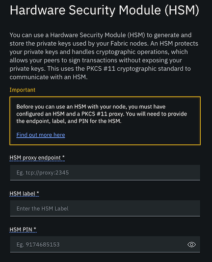

---

copyright:
  years: 2020
lastupdated: "2020-05-27"

keywords: deployment, advanced, CouchDB, LevelDB, external CA, HSM, resource allocation

subcollection: blockchain

---

{:external: target="_blank" .external}
{:shortdesc: .shortdesc}
{:screen: .screen}
{:codeblock: .codeblock}
{:note: .note}
{:important: .important}
{:tip: .tip}
{:pre: .pre}

# Advanced deployment options
{: #ibp-console-adv-deployment}

Because {{site.data.keyword.IBM_notm}} is in the process of migrating all of the {{site.data.keyword.blockchainfull_notm}} Platform consoles to v2.1.3, some of the functionality described on this page may not yet be available in your console.
Unsure what version you are currently using? Click the question mark icon in the upper right corner of the console. The {{site.data.keyword.blockchainfull_notm}} Platform version is visible under the page heading. You will receive a Cloud notification with more details about when your console will be migrated.
{: note}


When you deploy a node from the console, there are various advanced deployment options available for each node type. This topic provides more details about each of those options.
{:shortdesc}

**Target audience:** This topic is designed for advanced network operators who are familiar with Hyperledger Fabric and are responsible for creating, monitoring, and managing their components in the blockchain network.

## What types of advanced deployment options are available?
{: #ibp-console-adv-deployment-options}

The Build a network tutorial is useful for learning how to set up a basic network by using the {{site.data.keyword.blockchainfull_notm}} Platform console. But each use case will have their own customizations that are required for a production network. When you are ready to explore additional configuration settings, this topic describes the optional customizations that are available and the considerations they require. The following table describes the types of customizations you can consider for each node type:

|  | Description | CA | Peer | Ordering node | When to perform |
|-----|-----|-----|-----|----|----|
| **Resource allocations** | Customize the allocated resources (CPU, memory, storage) for your node.|  |  |  | CPU and memory can be adjusted during and after deployment. Storage is harder to update after deployment. A best practice is to monitor the storage on your nodes and before they become full, stand up a new larger capacity node to replace the node with exhausted storage. |
| **Hardware Security Module (HSM)** | Configure a node to generate and store the node identity private key in an HSM for increased security. | |  |  | Must be configured when the node is deployed. |
| **Certificate Authority Database and replication** |  Customize the type of database (SqlLite or PostgreSQL) that will be used for storing CA data and configure replication for high availability. | |  |  | Must be configured when the CA is deployed. You cannot switch databases after the CA is deployed. |
| **Peer state database** | Select whether you want the peer to use LevelDB or CouchDB for ledger data. | |  | | All peers on a channel must use the same state database. You cannot change databases after the peer is deployed. |
| **Kubernetes zone selection** |  When your Kubernetes cluster is configured across multiple zones, you can choose the zone where you want the node to be deployed. | |   |  | Must be configured when the node is deployed. You cannot change zones for a node after the node is deployed. |
| **Override node configuration** | Specify additional node configurations that are not available in the console panels. |  |  |  | Overrides can be configured when a node is deployed or updated. |
{: row-headers}
{: class="comparison-table"}
{: caption="Table 1. Advanced deployment options" caption-side="bottom"}
{: summary="This table has row and column headers. The row headers include deployment options that are available. The column headers identify the deployment options. To understand the deployment options for a node, navigate to the node column, and find the deployment option you are interested in."}

## Before you start  
{: #ibp-console-adv-deployment-before}

**Before** attempting to deploy a node, it is the network operator's responsibility to monitor the cluster CPU, memory, and storage usage, and ensure that adequate resources are available in the cluster for the node.
{:important}

### Allocating resources
{: #ibp-console-adv-deployment-allocate-resources}

Because your instance of the {{site.data.keyword.blockchainfull_notm}} Platform console and your Kubernetes cluster do not communicate directly about the resources that are available, the process for deploying components by using the console must follow this pattern:

1. **Size the deployment that you want to make**. The **Resource allocation** panels for the CA, peer, and ordering node in the console offer default CPU, memory, and storage allocations for each node. You may need to adjust these values according to your use case. If you are unsure, start with default allocations and adjust them as you understand your needs. Similarly, the **Resource reallocation** panel displays the existing resource allocations. For a sense of how much storage and compute you will need in your cluster, refer to the chart after step 3 that contains the current defaults for the peer, orderer, and CA:
2. **Check whether you have enough resources in your Kubernetes cluster**. If you are using a Kubernetes cluster that is hosted in {{site.data.keyword.cloud_notm}}, we recommend using the [{{site.data.keyword.cloud_notm}} Sysdig](https://www.ibm.com/cloud/sysdig){: external} tool in combination with your {{site.data.keyword.cloud_notm}} Kubernetes dashboard. If you do not have enough space in your cluster to deploy or resize resources, you need to increase the size of your cluster. For more information about how to increase the size of a cluster, see scaling [Kubernetes](/docs/containers?topic=containers-ca#ca){: external} or [Openshift](/docs/openshift?topic=openshift-ca){: external} clusters. If you have enough space in your cluster, you can continue with step 3.
3. **Use the console to deploy or resize your node**. If your Kubernetes pod is large enough to accommodate the new size of the node, the reallocation should proceed smoothly. If the worker node that the pod is running on is running out of resources, you can add a new larger worker node to your cluster and then delete the existing working node.

| **Component** (all containers) | CPU**  | Memory (GB) | Storage (GB) |
|--------------------------------|---------------|-----------------------|------------------------|
| **Peer**                       | 1.1           | 2.8                   | 200 (includes 100GB for peer and 100GB for state database)|
| **CA**                         | 0.1           | 0.2                   | 20                     |
| **Ordering node**              | 0.35          | 0.7                   | 100                    |
| **Operator**                   | 0.1           | 0.2                   | 0                      |

{: caption="Table 2. Default resources for nodes on {{site.data.keyword.blockchainfull_notm}} Platform" caption-side="bottom"}
** Actual VPC allocations are visible in the blockchain console when a node is deployed.

While users of a free cluster **must use default sizes** for the containers associated with their nodes, users of paid clusters can set these values while the node is being created by clicking the **Resource allocation** box during the creation of their nodes. If this box is not checked, the default resource allocations, which can be seen below, will be used.

For cases when a user wants to minimize charges without stopping or deleting a node, it is possible to scale the node down to a minimum of 0.001 CPU (1 milliCPU). Note that the node will not be functional when using this amount of CPU.

While the figures in this topic endeavor to be precise, be aware that there are times when a node may not deploy even when it appears that you have enough space in your cluster. Make sure to reference your Kubernetes dashboard to see when components deploy and for error messages when they don't. In cases where a component doesn't deploy for a lack of resources, even if there seems to be enough space in the cluster, you will likely have to deploy additional cluster resources for the component to deploy.
{:tip}

The **Resource allocation** panel in the console provides default values for the various fields that are involved in creating a node. These values are chosen because they represent a good way to get started. However, every use case is different. While this topic provides guidance for ways to think about these values, it ultimately falls to the user to monitor their nodes and find sizings that work for them. Therefore, barring situations in which users are certain that they need values different from the defaults, a practical strategy is to use these defaults at first and adjust them later. For an overview of performance and scale of Hyperledger Fabric, which the {{site.data.keyword.blockchainfull_notm}} Platform is based on, see [Answering your questions on Hyperledger Fabric performance and scale](https://www.ibm.com/blogs/blockchain/2019/01/answering-your-questions-on-hyperledger-fabric-performance-and-scale/){: external}.

After you have deployed the node, you need to **monitor the resource consumption of the node**. Configure a monitoring tool such as [Sysdig](/docs/blockchain?topic=blockchain-ibp-sysdig) to observe the nodes and ensure that adequate resources are available to the node containers when processing transactions.
{: important}

All of the containers that are associated with a node have **CPU** and **memory**, while certain containers that are associated with the peer, ordering node, and CA also have **storage**. For more information about storage, see [Persistent storage considerations](/docs/blockchain?topic=blockchain-ibp-v2-deploy-iks#ibp-console-storage) Note that when your Kubernetes cluster is configured to use any of the {{site.data.keyword.cloud_notm}} storage classes, the smallest storage amount that can be allocated to a node is 20Gi.

You are responsible for monitoring your CPU, memory, and storage consumption in your cluster. If you do happen to request more resources for a blockchain node than are available, the node will not start. However, existing nodes will not be affected. If you are using {{site.data.keyword.cloud_notm}} as your cloud provider, CPU and memory can be changed by using the console and Kubernetes cluster on {{site.data.keyword.cloud_notm}} dashboard. To expand available storage capacity, refer to the follow links for more information:
- [IBM file storage](/docs/FileStorage?topic=FileStorage-expandCapacity)
- [Portworx](https://docs.portworx.com/portworx-install-with-kubernetes/storage-operations/create-pvcs/resize-pvc/)
- [Block storage](/docs/BlockStorage?topic=BlockStorage-expandingcapacity#expandingcapacity)
{:note}

Every node has a gRPC web proxy container that bootstraps the communication layer between the console and a node. This container has fixed resource values and is included on the Resource allocation panel to provide an accurate estimate of how much space is required on your Kubernetes cluster in order for the node to deploy. Because the values for this container cannot be changed, we will not discuss the gRPC web proxy in the following sections.

## CA deployment
{: #ibp-console-adv-deployment-CA}

When you deploy a CA, the following advanced deployment options are available:
* [Database and replica sets](#ibp-console-adv-deployment-CA-replica-sets) - Configure a CA for zero downtime.
* [Resource allocation](#ibp-console-adv-deployment-CA-sizing-creation) - Configure the CPU, memory, and storage for the node.
* [Hardware Security Module](#ibp-console-adv-deployment-cfg-hsm) - Configure the CA to use an HSM to generate and store private keys.
* [CA configuration override](#ibp-console-adv-deployment-ca-customization) - Choose this option when you want to override CA configuration settings.

### Database and replica sets
{: #ibp-console-adv-deployment-CA-replica-sets}

Because redundancy is the key to ensuring that when a node goes down another node is able to continue to process requests, you have the option to configure replica sets for CA nodes. For a complete understanding of what replica sets are and how they can be configured for a CA, see this topic on [Building a high availability Certificate Authority (CA)](/docs/blockchain?topic=blockchain-ibp-console-build-ha-ca).


### Sizing a CA during creation
{: #ibp-console-adv-deployment-CA-sizing-creation}

Unlike peers and ordering nodes, which are actively involved in the transaction process, CAs are involved only in the registration and enrollment of identities, and in the creation of an MSP. This means that they require less CPU and memory. To stress a CA, a user would need to overwhelm it with requests (likely using APIs and a script), or have issued so many certificates that the CA runs out of storage. Under typical operations, neither of these things should happen, though as always, these values should reflect the needs of a particular use case.

The CA has only one associated container that we can adjust:

* **CA container**: Encapsulates the internal CA processes, such as registering and enrolling nodes and users, as well as storing a copy of every certificate it issues.

As we noted in our section on [Considerations before you deploy a node](#ibp-console-adv-deployment-before), it is recommended to use the defaults for the CA container and adjust them later when it becomes apparent how they are being utilized by your use case.

| Resources | Condition to increase |
|-----------------|-----------------------|
| **CA container CPU and memory** | When you expect that your CA will be bombarded with registrations and enrollments. |
| **CA storage** | When you plan to use this CA to register a large number of users and applications. |

For more details on the resource allocation panel in the console see [Allocating resource](#ibp-console-adv-deployment-allocate-resources).


#### Creating highly available CAs
{: #ibp-console-adv-deployment-CA-HA}

For information about creating highly available CAs through the use of replica sets, see [how to configure CA replica sets](/docs/blockchain?topic=blockchain-ibp-console-ha-ca).

### Customizing a CA configuration
{: #ibp-console-adv-deployment-ca-customization}

In addition to the CA settings that are provided in the console when you provision a CA, you have the option to override some of the settings. If you are familiar with the Hyperledger Fabric CA server, these settings are configured in the [`fabric-ca-server-config.yaml`](https://hyperledger-fabric-ca.readthedocs.io/en/release-1.4/serverconfig.html) file when a CA is deployed. The {{site.data.keyword.blockchainfull_notm}} Platform console configures these fields for you with default settings. Therefore, many of these fields are not exposed by the console. But the console also includes a panel where you can edit a `JSON` to override a set of these parameters before a CA is deployed.

The ability to override the CA configuration by using the console or APIs is available only in paid clusters.
{: note} 

#### Why would I want to override a CA configuration?
{: #ibp-console-adv-deployment-ca-customization-why}

You can use the console to configure resource allocation, HSM, or the CA database and then edit the generated `JSON` adding additional parameters and fields for your use case.  For example, you might want to register additional users with the CA when the CA is created, or specify custom affiliations for your organizations. You can also customize the CSR names that are used when certificates are issued by the CA or change the default certificate expiration. These are just a few suggestions of customizations you might want to make but the full list of parameters is provided below. This list contains all of fields that can be overridden by editing the `JSON` when a CA is deployed. For more information about what each field is used for you can refer to the [Fabric CA documentation](https://hyperledger-fabric-ca.readthedocs.io/en/release-1.4/serverconfig.html){: external}.

```json
{
	"ca": {
		"cors": {
			"enabled": false,
			"origins": [
				"*"
			]
		},
		"debug": false,
		"crlsizelimit": 512000,
		"tls": {
			"certfile": null,
			"keyfile": null,
			"clientauth": {
				"type": "noclientcert",
				"certfiles": null
			}
		},
		"ca": {
			"keyfile": null,
			"certfile": null,
			"chainfile": null
		},
		"crl": {
			"expiry": "24h"
		},
		"registry": {
			"maxenrollments": -1,
			"identities": [
				{
					"name": "<<<adminUserName>>>",
					"pass": "<<<adminPassword>>>",
					"type": "client",
					"affiliation": "",
					"attrs": {
						"hf.Registrar.Roles": "*",
						"hf.Registrar.DelegateRoles": "*",
						"hf.Revoker": true,
						"hf.IntermediateCA": true,
						"hf.GenCRL": true,
						"hf.Registrar.Attributes": "*",
						"hf.AffiliationMgr": true
					}
				}
			]
		},
		"db": {
			"type": "sqlite3",
			"datasource": "fabric-ca-server.db",
			"tls": {
				"enabled": false,
				"certfiles": null,
				"client": {
					"certfile": null,
					"keyfile": null
				}
			}
		},
		"affiliations": null,
		"csr": {
			"cn": "ca",
			"keyrequest": {
				"algo": "ecdsa",
				"size": 256
			},
			"names": [
				{
					"C": "US",
					"ST": "North Carolina",
					"L": null,
					"O": "Hyperledger",
					"OU": "Fabric"
				}
			],
			"hosts": [
				"<<<MYHOST>>>",
				"localhost"
			],
			"ca": {
				"expiry": "131400h",
				"pathlength": "<<<PATHLENGTH>>>"
			}
		},
		"idemix": {
			"rhpoolsize": 1000,
			"nonceexpiration": "15s",
			"noncesweepinterval": "15m"
		},
		"bccsp": {
			"default": "SW",
			"sw": {
				"hash": "SHA2",
				"security": 256,
				"filekeystore": null
			}
		},
		"intermediate": {
			"parentserver": {
				"url": null,
				"caname": null
			},
			"enrollment": {
				"hosts": null,
				"profile": null,
				"label": null
			},
			"tls": {
				"certfiles": null,
				"client": {
					"certfile": null,
					"keyfile": null
				}
			}
		},
		"cfg": {
			"identities": {
				"passwordattempts": 10
			}
		},
		"metrics": {
			"provider": "prometheus",
			"statsd": {
				"network": "udp",
				"address": "127.0.0.1:8125",
				"writeInterval": "10s",
				"prefix": "server"
			}
		}
	}
}
```        
{: codeblock}

#### Providing your own customizations when you create a CA
{: #ibp-console-adv-deployment-ca-create-json}

After you click **Create a CA** on the nodes tab and step through the CA configuration panels, you can click **Edit configuration** on the Summary panel to view and edit the `JSON`. Note that if you do not select any advanced options in the console, then those advanced configuration settings are not included in the `JSON`, but you can insert them yourself, using the elements provided in `JSON` above.

Alternatively, if you do check any of the advanced options when you configure the CA, those settings are included in the `JSON` on the Summary panel and can be additionally customized.

Any edits that you make to the `JSON` overrides what was specified in the console. For example, if you specified a `Maximum enrollments` value of `10` in the console, but then provided the `maxenrollments` value of `-1` in the `JSON`, then the value in the`JSON` file is used when the CA is deployed. It is the settings that are visible in the `JSON` on the **Summary page** that are used when the CA is deployed.

Here is an example of the minimum required `JSON` parameters for any override when a CA is deployed.
```json
{
	"ca": {
	  "csr": {
		"cn": "<COMMONNAME>",
		"keyrequest": {
		  "algo": "ecdsa",
		  "size": 256
		},
		"names": [
		  {
			"C": "US",
			"ST": "North Carolina",
			"L": "Location",
			"O": "Hyperledger",
			"OU": "Fabric"
		  }
		],
		"hosts": [
		  "<HOSTNAME>"
		],
		"ca": {
		  "expiry": "131400h",
		  "pathlength": 1024
		}
	  },
	  "debug": false,
	  "registry": {
		"maxenrollments": -1,
		"identities": [
		  {
			"name": "<ADMIN_ID>",
			"pass": "<ADMIN_PWD>",
			"type": "client",
			"attrs": {
			  "hf.Registrar.Roles": "*",
			  "hf.Registrar.DelegateRoles": "*",
			  "hf.Revoker": true,
			  "hf.IntermediateCA": true,
			  "hf.GenCRL": true,
			  "hf.Registrar.Attributes": "*",
			  "hf.AffiliationMgr": true
			}
		  }
		]
	  }
	}
}
```
{: codeblock}

You can insert additional fields or modify the `JSON` that is visible in the **Configuration JSON** box. For example, if you want to deploy a CA and override only the `csr names` values, you can edit the values in the `JSON`. But if you wanted to change the value of the `passwordattempts` field you would insert it into the `JSON` as follows:

```json
{
	"ca": {
	  "csr": {
		"cn": "<COMMONNAME>",
		"keyrequest": {
		  "algo": "ecdsa",
		  "size": 256
		},
		"names": [
		  {
			"C": "US",
			"ST": "North Carolina",
			"L": "Location",
			"O": "Hyperledger",
			"OU": "Fabric"
		  }
		],
		"hosts": [
		  "<HOSTNAME>"
		],
		"ca": {
		  "expiry": "131400h",
		  "pathlength": 1024
		}
	  },
	  "debug": false,
	  "registry": {
		"maxenrollments": -1,
		"identities": [
		  {
			"name": "<ADMIN_ID>",
			"pass": "<ADMIN_PWD>",
			"type": "client",
			"attrs": {
			  "hf.Registrar.Roles": "*",
			  "hf.Registrar.DelegateRoles": "*",
			  "hf.Revoker": true,
			  "hf.IntermediateCA": true,
			  "hf.GenCRL": true,
			  "hf.Registrar.Attributes": "*",
			  "hf.AffiliationMgr": true
			}
		  }
		]
		},
		"cfg": {
			"identities": {
				"passwordattempts": 3
			}
		}
	}
}
```
{: codeblock}

This snippet is provided only as an example of what the modified `JSON` would resemble. **Do not copy and edit this snippet**, as it does not contain the custom values for your configuration. Rather, edit the `JSON` from your console **Configuration JSON** box because it includes the settings for your node.

#### Considerations when including certificates
{: #ibp-console-adv-deployment-ca-certificates}

Unlike in the Fabric CA configuration file, where specification of a `certfile` includes a file path and certificate name, in this case you need to base64 encode the certificate file (or a concatenated chain of certificates) and then paste the resulting string into the CA `JSON` override. To convert a certificate file into base64 format, run the following command:

```
export FLAG=$(if [ "$(uname -s)" == "Linux" ]; then echo "-w 0"; else echo "-b 0"; fi)
cat <CERT_FILE> | base64 $FLAG
```
{: codeblock}

- Replace `<CERT_FILE>` with the name of the file that you need to encode.

Paste the resulting string into the CA `JSON` override.

#### Modifying CA settings after deployment
{: #ibp-console-adv-deployment-ca-modify-json}

After a CA is deployed, a subset of the fields can be updated as well. Click the CA tile in the console and then the **Settings** icon to open a side panel. Click **Edit configuration JSON (Advanced)** to override the CA settings. The `JSON` in the **Current configuration** box contains the current settings for the CA. **Not all of these values can be overridden.**

Only the following fields can be updated:

```json
{
	"ca":{
		"cors": {
			"enabled": false,
			"origins": [
				"*"
			]
		},
		"debug": false,
		"crlsizelimit": 512000,
		"tls": {
			"certfile": null,
			"keyfile": null,
			"clientauth": {
				"type": "noclientcert",
				"certfiles": null
			}
		},
		"crl": {
			"expiry": "24h"
		},
		"db": {
			"type": "sqlite3",
			"datasource": "fabric-ca-server.db",
			"tls": {
				"enabled": false,
				"certfiles": null,
				"client": {
					"certfile": null,
					"keyfile": null
				}
			}
		},
		"csr": {
			"cn": "ca",
			"keyrequest": {
				"algo": "ecdsa",
				"size": 256
			},
			"names": [
				{
					"C": "US",
					"ST": "North Carolina",
					"L": "Location",
					"O": "Hyperledger",
					"OU": "Fabric"
				}
			],
			"hosts": [
				"<<<MYHOST>>>",
				"localhost"
			],
			"ca": {
				"expiry": "131400h",
				"pathlength": "<<<PATHLENGTH>>>"
			}
		},
		"idemix": {
			"rhpoolsize": 1000,
			"nonceexpiration": "15s",
			"noncesweepinterval": "15m"
		},
		"bccsp": {
			"default": "SW",
			"sw": {
				"hash": "SHA2",
				"security": 256,
				"filekeystore": null
			}
		},
		"cfg": {
			"identities": {
				"passwordattempts": 10
			}
		},
		"metrics": {
			"provider": "prometheus",
			"statsd": {
				"network": "udp",
				"address": "127.0.0.1:8125",
				"writeInterval": "10s",
				"prefix": "server"
			}
		}
	}
}
```
{: codeblock}

Paste the modified `JSON` that contains only the parameters that you want to update into the **Configuration JSON** box. For example, if you only needed to update the value for the `passwordattempts` field you would paste in this `JSON`:

```json
{
	"ca": {
		"cfg": {
			"identities": {
				"passwordattempts": 3
			}
		}
	}
}
```
{: codeblock}

The ability to update a CA configuration is not available for CAs that have been imported into the console.
{: note}

## Peer deployment
{: #ibp-console-adv-deployment-peer}

When you deploy a peer, the following advanced deployment options are available:
* [State database](#ibp-console-adv-deployment-level-couch) - Choose the database for your peers where ledger transactions are stored.
* [Kubernetes zone selection](#ibp-console-adv-deployment-peer-k8s-zone) - In a multi-zone cluster, select the zone where the node is deployed.
* [External Certificate Authority configuration](#ibp-console-adv-deployment-third-party-ca) - Use certificates from a third-party CA.
* [Resource allocation](#ibp-console-adv-deployment-peers-sizing-creation) - Configure the CPU, memory, and storage for the node.
* [Hardware Security Module](#ibp-console-adv-deployment-cfg-hsm) - Configure the peer to use an HSM to generate and store private keys.
* [Peer configuration override](#ibp-console-adv-deployment-peer-create-json) - Choose this option when you want to override peer configuration.

### State database
{: #ibp-console-adv-deployment-level-couch}

During the creation of a peer, it is possible to choose between two state database options: **LevelDB** and **CouchDB**. Recall that the state database keeps the latest value of all of the keys (assets) stored on the blockchain. For example, if a car has been owned by Varad and then Joe, the value of the key that represents the ownership of the car would be "Joe".

Because it can be useful to perform rich queries against the state database (for example, searching for every red car with an automatic transmission that is owned by Joe), users will often choose a Couch database, which stores data as `JSON` objects. LevelDB, on the other hand, only stores information as key-value pairs, and therefore cannot be queried in this way. Users must keep track of block numbers and query the blocks directly (or within a range of block numbers), and parse the information. However, LevelDB is also faster than CouchDB, though it does not support database indexing (which helps performance).

This support for rich queries is why **CouchDB is the default database** unless a user selects the **State database selection** box during the process of adding a peer selects **LevelDB** on the subsequent tab.

Because the data is modeled differently in a Couch database than in a Level database, **the peers in a channel must all use the same database type**. If data written for a Level database is rejected by a Couch database (which can happen, as CouchDB keys have certain formatting restrictions as compared to LevelDB keys), a state fork would be created between the two ledgers. Therefore, **take extreme care when joining a channel to know the database type supported by the channel**. It might be necessary to create a new peer that uses the appropriate database type and join it to the channel. Note that the database type cannot be changed after a peer has been deployed.
{:important}

### Kubernetes zone selection
{: #ibp-console-adv-deployment-peer-k8s-zone}

If your Kubernetes cluster is configured across multiple zones, when you deploy a peer you have the option of selecting which zone the peer is deployed to. Check the Advanced deployment option that is labeled **Kubernetes zone selection** to see the list of zones that are currently configured for your Kubernetes cluster.

If you are deploying a redundant node (that is, another peer when you already have one), it is a best practice to deploy this node into a different zone. You can determine the zone that the other node was deployed to by opening the tile of the node and looking under the Node location. Alternatively, you can use the APIs to deploy a peer or orderer to a specific zone. For more information on how to do this with the APIs, see [Creating a node within a specific zone](/docs/blockchain?topic=blockchain-ibp-v2-apis#ibp-v2-apis-zone).


### Sizing a peer during creation
{: #ibp-console-adv-deployment-peers-sizing-creation}

The peer has five containers that can be adjusted:

- **Peer container**: Encapsulates the internal peer processes (such as validating transactions) and the blockchain (in other words, the transaction history) for all of the channels it belongs to. Note that the storage of the peer also includes the smart contracts that are installed on the peer.
- **CouchDB container**: Where the state databases of the peer are stored. Recall that each channel has a distinct state database.
- **Smart contract container**: Recall that during a transaction, the relevant smart contract is "invoked" (in other words, run). Note that all smart contracts that you install on the peer will run in a separate container inside your peer pod, which is known as a Docker-in-Docker container.

The peer also includes a container for the **Log Collector** that pipes the logs from the smart contract container to the peer container.  Similar to the gRPC web proxy container, you cannot adjust the compute for this container.

As we noted in our section on [Considerations before you deploy a node](#ibp-console-adv-deployment-before), it is recommended to use the defaults for these peer containers and adjust them later when it becomes apparent how they are being utilized by your use case.

| Resources | Condition to increase |
|-----------------|-----------------------|
| **Peer container CPU and memory** | When you anticipate a high transaction throughput right away. |
| **Peer storage** | When you anticipate installing many smart contracts on this peer and to join it to many channels. Recall that this storage will also be used to store smart contracts from all channels the peer is joined to. Keep in mind that we estimate a "small" transaction to be in the range of 10,000 bytes (10k). As the default storage is 100G, this means that as many as 10 million total transactions will fit in peer storage before it will need to be expanded (as a practical matter, the maximum number will be less than this, as transactions can vary in size and the number does not include smart contracts). While 100G might therefore seem like much more storage than is needed, keep in mind that storage is relatively inexpensive, and that the process for increasing it is more difficult (require command line) than increasing CPU or memory. |
| **CouchDB container CPU and memory** | When you anticipate a high volume of queries against a large state database. This effect can be mitigated somewhat by using [indexes](https://hyperledger-fabric.readthedocs.io/en/release-1.4/couchdb_as_state_database.html#couchdb-indexes){: external}. Nevertheless, high volumes might strain CouchDB, which can lead to query and transaction timeouts. |
| **CouchDB (ledger data) storage** | When you expect high throughput on many channels and don't plan to use indexes. However, like the peer storage, the default CouchDB storage is 100G, which is significant. |
| **Smart contract container CPU and memory** | When you expect a high throughput on a channel, especially in cases where multiple smart contracts will be invoked at the same time. You should also increase the resource allocation of your peers if your smart contracts are written in JavaScript or TypeScript.|

The {{site.data.keyword.blockchainfull_notm}} Platform supports smart contracts that are written in JavaScript, TypeScript, Java, and Go. When you are allocating resources to your peer node, it is important to note that JavaScript and TypeScript smart contracts require more resources than contracts written in Go. The default memory allocation for the peer container is sufficient for most use cases. However, when you instantiate a smart contract, you should actively monitor the resource consumption of the peer containers by using a tool like [Sysdig](/docs/blockchain?topic=blockchain-ibp-sysdig) to ensure that adequate resources are available.
{: important}

For more details on the resource allocation panel in the console see [Allocating resource](#ibp-console-adv-deployment-allocate-resources).

### Customizing a peer configuration
{: #ibp-console-adv-deployment-peer-create-json}

In addition to the peer settings that are provided in the console when you provision a peer, you have the extra option to override some of the peer settings. If you are familiar with Hyperledger Fabric, these settings are configured in the peer configuration `core.yaml` file when a peer is deployed. The {{site.data.keyword.blockchainfull_notm}} Platform console configures these fields for you using default settings and many of these fields are not exposed by the console. But the console also includes a panel where you can provide a `JSON` to override a set of these parameters before a peer is deployed. You can find the peer configuration `JSON` and an example of how to use the configuration override to customize your deployment in the sections below.

The ability to override the peer configuration by using the console or APIs is available only in paid clusters.
{: note} 

#### Why would I want to override a peer configuration?
{: #ibp-console-adv-deployment-peer-customization-why}

A common use case would be to override some of the default timeouts, or peer private data settings. Additionally you can customize the gossip configuration. These are just a few suggestions of customizations you might want to make, but the full list of available overrides is provided below. This list contains all of fields that can be overridden via editing the `JSON` when a peer is deployed from the console. For more information about what each field is used for you can refer to the [Fabric sample peer configuration file](https://github.com/hyperledger/fabric/blob/release-1.4/sampleconfig/core.yaml){: external} options.

```json
{
	"peer": {
		"id": "jdoe",
		"networkId": "dev",
		"keepalive": {
			"minInterval": "60s",
			"client": {
				"interval": "60s",
				"timeout": "20s"
			},
			"deliveryClient": {
				"interval": "60s",
				"timeout": "20s"
			}
		},
		"gossip": {
			"useLeaderElection": true,
			"orgLeader": false,
			"membershipTrackerInterval": "5s",
			"maxBlockCountToStore": 100,
			"maxPropagationBurstLatency": "10ms",
			"maxPropagationBurstSize": 10,
			"propagateIterations": 1,
			"propagatePeerNum": 3,
			"pullInterval": "4s",
			"pullPeerNum": 3,
			"requestStateInfoInterval": "4s",
			"publishStateInfoInterval": "4s",
			"stateInfoRetentionInterval": null,
			"publishCertPeriod": "10s",
			"skipBlockVerification": false,
			"dialTimeout": "3s",
			"connTimeout": "2s",
			"recvBuffSize": 20,
			"sendBuffSize": 200,
			"digestWaitTime": "1s",
			"requestWaitTime": "1500ms",
			"responseWaitTime": "2s",
			"aliveTimeInterval": "5s",
			"aliveExpirationTimeout": "25s",
			"reconnectInterval": "25s",
			"election": {
				"startupGracePeriod": "15s",
				"membershipSampleInterval": "1s",
				"leaderAliveThreshold": "10s",
				"leaderElectionDuration": "5s"
			},
			"pvtData": {
				"pullRetryThreshold": "60s",
				"transientstoreMaxBlockRetention": 1000,
				"pushAckTimeout": "3s",
				"btlPullMargin": 10,
				"reconcileBatchSize": 10,
				"reconcileSleepInterval": "1m",
				"reconciliationEnabled": true,
				"skipPullingInvalidTransactionsDuringCommit": false
			},
			"state": {
				"enabled": true,
				"checkInterval": "10s",
				"responseTimeout": "3s",
				"batchSize": 10,
				"blockBufferSize": 100,
				"maxRetries": 3
			}
		},
		"authentication": {
			"timewindow": "15m"
		},
		"BCCSP": {
			"Default": "SW",
			"SW": {
				"Hash": "SHA2",
				"Security": 256,
				"FileKeyStore": {
					"KeyStore": null
				}
			},
			"PKCS11": {
				"Library": null,
				"Label": null,
				"Pin": null,
				"Hash": null,
				"Security": null,
				"FileKeyStore": {
					"KeyStore": null
				}
			}
		},
		"client": {
			"connTimeout": "3s"
		},
		"deliveryclient": {
			"reconnectTotalTimeThreshold": "3600s",
			"connTimeout": "3s",
			"reConnectBackoffThreshold": "3600s",
			"addressOverrides": null
		},
		"adminService": null,
		"validatorPoolSize": null,
		"discovery": {
			"enabled": true,
			"authCacheEnabled": true,
			"authCacheMaxSize": 1000,
			"authCachePurgeRetentionRatio": 0.75,
			"orgMembersAllowedAccess": false
		}
	},
	"chaincode": {
		"startuptimeout": "300s",
		"executetimeout": "30s",
		"logging": {
			"level": "info",
			"shim": "warning",
			"format": "%{color}%{time:2006-01-02 15:04:05.000 MST} [%{module}] %{shortfunc} -> %{level:.4s} %{id:03x}%{color:reset} %{message}"
		}
	},
	"metrics": {
		"provider": "disabled",
		"statsd": {
			"network": "udp",
			"address": "127.0.0.1:8125",
			"writeInterval": "10s",
			"prefix": null
		}
	}
}
```        
{: codeblock}

#### Providing your own customizations when you create a peer
{: #ibp-console-adv-deployment-peer-create-json}

After you click **Create a peer** on the nodes tab and step through the peer configuration panels, you can click **Edit configuration** on the Summary panel to view and edit the `JSON`. Note that if you do not select any advanced options in the console, then the generated `JSON` is empty, but you can still insert your own customizations.

Alternatively, if you do check any of the advanced options when you configure the peer, those settings are included in the `JSON` on the Summary panel and can be additionally customized with other fields as needed. Any edits that you make will override what was specified in the console. For example, if you selected to use a LevelDB as the state database, but then overrode the setting to use CouchDB as the state database in the `JSON`, then the CouchDB database settings would be used when the peer is deployed. The override settings that are visible in the `JSON` on the **Summary page** are what is used when the peer is deployed.

You don't need to include the entire set of available parameters in the `JSON`, only the advanced deployment options that you selected in the console along with the parameters that you want to override. For example, if you want to deploy a peer and override the `chaincode startup timeout` and specify a different port for the `statsd address`, you would paste in the following `JSON`:

```json
{
  "peer": {
    "chaincode": {
      "startuptimeout": "600s"
    }
  },
  "metrics": {
    "statsd": {
      "address": "127.0.0.1:9443"
    }
  }
}
```
{: codeblock}

#### Modifying peer settings after deployment
{: #ibp-console-adv-deployment-peer-modify-json}

After a peer is deployed, a subset of the fields can be updated as well. Click the peer tile in the console and then the **Settings** icon to open a side panel. Click **Edit configuration JSON (Advanced)** to open the panel where you can override the peer settings. The `JSON` in the **Current configuration** box contains the current settings for the peer. **Not all of these values can be overridden after the peer is deployed.**  A subset of these parameters can be overridden by pasting a `JSON` with the overrides into the **Configuration JSON** box. Again, you don't need to include the entire set of parameters from the **Current configuration** `JSON`, only paste the parameters you want to override into the **Configuration JSON** box.

The following subset of parameters can be overridden after a peer is deployed:

```json
{
	"peer": {
		"id": "jdoe",
		"networkId": "dev",
		"keepalive": {
			"minInterval": "60s",
			"client": {
				"interval": "60s",
				"timeout": "20s"
			},
			"deliveryClient": {
				"interval": "60s",
				"timeout": "20s"
			}
		},
		"gossip": {
			"useLeaderElection": true,
			"orgLeader": false,
			"membershipTrackerInterval": "5s",
			"maxBlockCountToStore": 100,
			"maxPropagationBurstLatency": "10ms",
			"maxPropagationBurstSize": 10,
			"propagateIterations": 1,
			"propagatePeerNum": 3,
			"pullInterval": "4s",
			"pullPeerNum": 3,
			"requestStateInfoInterval": "4s",
			"publishStateInfoInterval": "4s",
			"stateInfoRetentionInterval": null,
			"publishCertPeriod": "10s",
			"skipBlockVerification": false,
			"dialTimeout": "3s",
			"connTimeout": "2s",
			"recvBuffSize": 20,
			"sendBuffSize": 200,
			"digestWaitTime": "1s",
			"requestWaitTime": "1500ms",
			"responseWaitTime": "2s",
			"aliveTimeInterval": "5s",
			"aliveExpirationTimeout": "25s",
			"reconnectInterval": "25s",
			"election": {
				"startupGracePeriod": "15s",
				"membershipSampleInterval": "1s",
				"leaderAliveThreshold": "10s",
				"leaderElectionDuration": "5s"
			},
			"pvtData": {
				"pullRetryThreshold": "60s",
				"transientstoreMaxBlockRetention": 1000,
				"pushAckTimeout": "3s",
				"btlPullMargin": 10,
				"reconcileBatchSize": 10,
				"reconcileSleepInterval": "1m",
				"reconciliationEnabled": true,
				"skipPullingInvalidTransactionsDuringCommit": false
			},
			"state": {
				"enabled": true,
				"checkInterval": "10s",
				"responseTimeout": "3s",
				"batchSize": 10,
				"blockBufferSize": 100,
				"maxRetries": 3
			}
		},
		"authentication": {
			"timewindow": "15m"
		},
		"client": {
			"connTimeout": "3s"
		},
		"deliveryclient": {
			"reconnectTotalTimeThreshold": "3600s",
			"connTimeout": "3s",
			"reConnectBackoffThreshold": "3600s",
			"addressOverrides": null
		},
		"adminService": null,
		"validatorPoolSize": null,
		"discovery": {
			"enabled": true,
			"authCacheEnabled": true,
			"authCacheMaxSize": 1000,
			"authCachePurgeRetentionRatio": 0.75,
			"orgMembersAllowedAccess": false
		}
	},
	"chaincode": {
		"startuptimeout": "300s",
		"executetimeout": "30s",
		"logging": {
			"level": "info",
			"shim": "warning",
			"format": "%{color}%{time:2006-01-02 15:04:05.000 MST} [%{module}] %{shortfunc} -> %{level:.4s} %{id:03x}%{color:reset} %{message}"
		}
	},
	"metrics": {
		"provider": "disabled",
		"statsd": {
			"network": "udp",
			"address": "127.0.0.1:8125",
			"writeInterval": "10s",
			"prefix": null
		}
	}
}
```
{: codeblock}

Paste the modified `JSON` that contains only the parameters that you want to update into the **Configuration JSON** box. For example, if you only need to update the value for the `executetimeout` field you would paste this `JSON` into the **Configuration JSON** box:

```json
{
	"chaincode": {
		"executetimeout": "30s"
	}
}
```
{: codeblock}

The ability to update override settings for a peer configuration is not available for peers that have been imported into the console.
{: note}

## Ordering node deployment
{: #ibp-console-adv-deployment-on}

When you deploy an ordering node, the following advanced deployment options are available:
* [Number of ordering nodes](#ibp-console-adv-deployment-suggested-ordering-node-configurations) - Decide how many ordering nodes are needed.
* [Kubernetes zone selection
](#ibp-console-adv-deployment-on-k8s-zone) - In a multi-zone cluster, select the zone where the node is deployed.
* [External Certificate Authority configuration](#ibp-console-adv-deployment-third-party-ca) - Use certificates from a third-party CA.
* [Resource allocation](#ibp-console-adv-deployment-orderer-sizing-creation) - Configure the CPU, memory, and storage for the node.
* [Hardware Security Module](#ibp-console-adv-deployment-cfg-hsm) - Configure the ordering node to use an HSM to generate and store private keys.
* [Orderer configuration override](#ibp-console-adv-deployment-orderer-create-json) - Choose this option when you want to override ordering node configuration.

### Number of ordering nodes
{: #ibp-console-adv-deployment-suggested-ordering-node-configurations}

In Raft, a **majority of the total number of nodes** must be available for the ordering service to function (this is known as achieving a "quorum" of nodes). In other words, if you have one node, you need that node available to have a quorum, because the majority of one is one. While satisfying the quorum makes sure that the ordering service is functioning, production networks also have to think about deployment configurations that are highly available (in other words, configurations in which the loss of a certain number of nodes can be tolerated by the system). Typically, this means tolerating the loss of two nodes: one node going down during a normal maintenance cycle, and another going down for any other reason (such as a power outage or error).

This is why, by default, the console offers two options: one node or five nodes. Recall that the majority of five is three. This means that in a five node configuration, the loss of two nodes can be tolerated. Users who know that they will be deploying a production solution should therefore choose the five node option.

However many nodes a user chooses to deploy, they have the ability to add more nodes to their ordering service. For more information, see [Adding and removing ordering service nodes](/docs/blockchain?topic=blockchain-ibp-console-add-remove-orderer).

### Kubernetes zone selection
{: #ibp-console-adv-deployment-on-k8s-zone}

If your Kubernetes cluster is configured across multiple zones, when you deploy an ordering node you have the option of selecting which zone the node is deployed to. Check the Advanced deployment option that is labeled **Kubernetes zone selection** to see the list of zones that are currently configured for your Kubernetes cluster.

For a five node ordering service, these nodes will be distributed into multiple zones by default, depending on the relative space available in each zone. You also have the ability to distribute a five node ordering service yourself by clearing the default option to have the zones that are chosen for you and distributing these nodes into the zones you have available. You can check which zone a node was deployed to by opening the tile of the node and looking under the Node location. Alternatively, you can use the APIs to deploy an ordering node to a specific zone. For more information on how to do this with the APIs, see [Creating a node within a specific zone](/docs/blockchain?topic=blockchain-ibp-v2-apis#ibp-v2-apis-zone).


### Sizing an ordering node during creation
{: #ibp-console-adv-deployment-orderer-sizing-creation}

Because ordering nodes neither maintain the State DB nor host smart contracts, they require fewer containers than peers do. But they do host the blockchain (the transaction history) because the blockchain is where the channel configuration is stored, and the ordering service must know the latest channel configuration to perform its role.

Similar to the CA, an ordering node has only one associated container that we can adjust (if you are deploying a five-node ordering service, you will have five separate ordering node containers, as well as five separate gRPC containers):

* **Ordering node container**: Encapsulates the internal orderer processes (such as validating transactions) and the blockchain for all of the channels it hosts.

As we noted in our section on [Considerations before you deploy a node](#ibp-console-adv-deployment-before), it is recommended to use the defaults for the ordering node container and adjust them later as it becomes apparent how they are being utilized.

| Resources | Condition to increase |
|-----------------|-----------------------|
| **Ordering node container CPU and memory** | When you anticipate a high transaction throughput right away. |
| **Ordering node storage** | When you anticipate that this ordering node will be part of an ordering service on many channels. Recall that the ordering service keeps a copy of the blockchain for every channel they host. The default storage of an ordering node is 100G, same as the container for the peer itself. |

If you plan to deploy a five node Raft ordering service, note that the total of your deployment will increase by a factor of five, a total of 1.75 CPU, 3.5 GB of memory, and 500 GB of storage for the five Raft nodes. A 4 CPU Kubernetes single worker node cluster is the minimum recommended to allow enough CPU for the ordering service cluster and any other nodes you deploy.

If an ordering service is overstressed, it might hit timeouts and start dropping transactions, requiring transactions to be resubmitted. This causes much greater harm to a network than a single peer struggling to keep up. In a Raft ordering service configuration, an overstressed leader node might stop sending heartbeat messages, triggering a leader election, and a temporary cessation of transaction ordering. Likewise, a follower node might miss messages and attempt to trigger a leader election where none is needed.
{:important}

For more details on the resource allocation panel in the console see [Allocating resource](#ibp-console-adv-deployment-allocate-resources).

### Customizing an ordering service configuration
{: #ibp-console-adv-deployment-orderer-create-json}

In addition to the ordering node settings that are provided in the console when you provision an ordering node, you have the option to override some of the default settings. If you are familiar with Hyperledger Fabric, these settings are configured in the `orderer.yaml` file when an ordering node is deployed. The {{site.data.keyword.blockchainfull_notm}} Platform console configures these fields for you using default settings so many of these fields are not exposed by the console. You can find the orderer configuration `JSON` and an example of how to use the configuration override to customize your deployment in the sections below.

The ability to override the ordering service configuration by using the console or APIs is available only in paid clusters.
{: note} 

#### Why would I want to override an ordering service configuration?
{: #ibp-console-adv-deployment-orderer-customization-why}

The need to customize the ordering node configuration is less common than the peer or CA. A common use case could be to override default timeouts or the default HSM settings. This list contains all of fields that can be overridden by editing the `JSON` when an ordering node is deployed from the console. For more information about what each field is used for you can refer to the [Fabric sample orderer configuration file](https://github.com/hyperledger/fabric/blob/release-1.4/sampleconfig/orderer.yaml){: external} options.

```json
{
	"General": {
		"Keepalive": {
			"ServerMinInterval": "60s",
			"ServerInterval": "7200s",
			"ServerTimeout": "20s"
		},
		"BCCSP": {
			"Default": "SW",
			"SW": {
				"Hash": "SHA2",
				"Security": 256,
				"FileKeyStore": {
					"KeyStore": null
				}
			}
		},
		"Authentication": {
			"TimeWindow": "15m"
		}
	},
	"Debug": {
		"BroadcastTraceDir": null,
		"DeliverTraceDir": null
	},
	"Metrics": {
		"Provider": "disabled",
		"Statsd": {
			"Network": "udp",
			"Address": "127.0.0.1:8125",
			"WriteInterval": "30s",
			"Prefix": null
		}
	}
}
```        
{: codeblock}

#### Providing your own customizations when you create an ordering service
{: #ibp-console-adv-deployment-orderer-create-json}

After you click **Add ordering service** on the nodes tab and step through the ordering service configuration panels, you can click **Edit configuration JSON** on the Summary panel to view and edit the `JSON`. Note that if you do not select any advanced options in the console, then the generated `JSON` is empty, but you can insert your own customizations.

Alternatively, if you do check any of the advanced options when you configure the ordering service, those settings are included in the `JSON` on the Summary panel. Any edits that you make to the`JSON` override what was specified in the console. You can insert additional fields or modify the generated `JSON`. The overrides that are visible in the `JSON` on the **Summary page** are what is used to override the default settings when the ordering node is deployed. **If you are deploying multiple ordering nodes, then the overrides are applied to each ordering node.**

You don't need to include the entire set of available parameters in the `JSON`, only any advanced deployment options that you selected in the console along with the parameters that you want to override. For example, if did not select any advanced options in the console and you want to deploy the ordering nodes with your own value for the  `ServerTimeout` and the `statsd address` port, you would paste the following `JSON` into the **Configuration JSON** box:

```json
{
	"General": {
		"Keepalive": {
			"ServerTimeout": "60s"
		}
	},
	"metrics": {
		"statsd": {
			"address": "127.0.0.1:9446"
		}
	}
}
```
{: codeblock}

#### Modifying ordering node settings after deployment
{: #ibp-console-adv-deployment-orderer-modify-json}

After an ordering node is deployed, a subset of the fields can be updated as well. Click the ordering service tile in the console and select the ordering node, then click the **Settings** icon to open a side panel where you can modify the `JSON`.  The `JSON` in the **Current configuration** box contains the current settings for the ordering node. **Not all of these values can be overridden after deployment.** Again, you don't need to include the entire set of parameters from the **Current configuration** `JSON`, only paste the parameters you want to override into the **Configuration JSON** box.

The following list of parameters can be updated:

```json
{
	"General": {
		"Keepalive": {
			"ServerMinInterval": "60s",
			"ServerInterval": "7200s",
			"ServerTimeout": "20s"
		},
		"Authentication": {
			"TimeWindow": "15m"
		}
	},
	"Debug": {
		"BroadcastTraceDir": null,
		"DeliverTraceDir": null
	},
	"Metrics": {
		"Provider": "disabled",
		"Statsd": {
			"Network": "udp",
			"Address": "127.0.0.1:8125",
			"WriteInterval": "30s",
			"Prefix": null
		}
	}
}
```
{: codeblock}

Paste the modified `JSON` that contains only the parameters that you want to update into the **Configuration JSON** box. For example, if you only needed to update the value for the `ServerTimeout` field you would paste this `JSON` into the **Configuration JSON** box:

```json
{
	"General": {
		"Keepalive": {
			"ServerTimeout": "20s"
		}
	}
}
```
{: codeblock}

The ability to update an ordering node configuration is not available for ordering nodes that have been imported into the console.
{: note}

## Using certificates from an external CA with your peer or ordering service
{: #ibp-console-adv-deployment-third-party-ca}

Instead of using an {{site.data.keyword.blockchainfull_notm}} Platform Certificate Authority as your peer or ordering service's CA, you can use certificates from an external CA, one that is not hosted by {{site.data.keyword.IBM_notm}}. To use an external CA, the CA needs to issue certificates in [X.509](https://hyperledger-fabric.readthedocs.io/en/release-1.4/identity/identity.html#digital-certificates){: external} format. You need to generate your private keys using the PKCS #8 standard.

### Before you begin
{: #ibp-console-adv-deployment-third-party-ca-prereq}

1. You need to gather the following certificate information and save it to individual files that can be uploaded to the console.   
**Note:** The certificates inside the files can be in either `PEM` format or `base64 encoded` format.
	* **Peer or ordering service identity certificate** This is the signing certificate from your external CA that the peer or ordering service will use.
	* **Peer or ordering service identity private key** This is your private key corresponding to the signed certificate from your third-party CA that this peer or ordering service will use.
	* **TLS CA certificate** This is the public signing certificate created by your external TLS CA that will be used by this peer or ordering service. The certificate needs to contain the x.509 Subject alternative name (SAN) for the peer or ordering nodes. If you are using the [Fabric CA client](https://hyperledger-fabric-ca.readthedocs.io/en/release-1.4/clientcli.html) to enroll the identity, you specify the SAN by passing the `--csr.hosts` parameter on the `enroll` command. If the host name is not yet known, you can specify a wild card with the domain name, for example: `--csr.hosts '*.ibpv2-cluster.us-south.containers.appdomain.cloud,127.0.0.1'`.
	* **TLS CA private key** This is the private key corresponding to the signed certificate from your TLS CA that will be used by this peer or ordering service for secure communications with other members on the network.
	* **TLS CA root certificate** (Optional) This is the root certificate of your external TLS CA. You must provide either a TLS CA root certificate or an intermediate TLS CA certificate, you can also provide both.
	* **Intermediate TLS certificate**: (Optional) This is the TLS certificate if your TLS certificate is issued by an intermediate TLS CA. Upload the intermediate TLS CA certificate. You must provide either a TLS CA root certificate or an intermediate TLS CA certificate, you may also provide both.
	* **Peer or ordering service admin identity certificate** This is the signing certificate from your external CA that the admin identity of this peer or ordering service will use. This certificate is also known as your peer or ordering service admin identity key.
	* **Peer or ordering service admin identity private key** This is the private key corresponding to the signed certificate from your external CA that the admin identity of this peer or ordering service will use.
	* **Peer or ordering service organization MSP definition** You must manually generate this file by using instructions that are provided in [Manually building an MSP JSON file](/docs/blockchain?topic=blockchain-ibp-console-organizations#console-organizations-build-msp).

2. Import the generated peer or ordering service organization MSP definition file into the console, by clicking the **Organizations** tab followed by **Import MSP definition**.

Now you have the choice of creating a peer or single-node ordering service node, or ,if you have a paid cluster, a five node ordering service.

#### Consideration when using an external CA to generate certificates
{: #ibp-console-govern-third-party-openssl}

If a generated private key is in PKCS #1 format, before it can be used by the console, it needs to be converted to PKCS #8 format by running the following openssl command:
```
openssl pkcs8 -topk8 -inform PEM -outform PEM -nocrypt -in identity.1.pem -out identity.8.pem
```
{: codeblock}

Replace:
- `identity.1.pem` with the name of the PKCS #1 private key `.PEM` file.
- `identity.8.pem` with the name that you want to give your PKCS #8 private key `.PEM` file.

Now the private key can be used by the console. If you plan to include it in an [organization MSP](/docs/blockchain?topic=blockchain-ibp-console-organizations#console-organizations-build-msp) file, it needs to be encoded in base64 format.

### Option 1: Create a new peer or single-node ordering service using certificates from an external CA
{: #ibp-console-adv-deployment-third-party-ca-create-peer-orderer}

You can skip to **Option 2** if you want to create a new five node ordering service. The following instructions are only for creating a peer or single-node ordering service with certificates from your external CA.
{:note}

Now that you have gathered all the necessary certificates, you are ready to create a peer or ordering service that uses those certificates. Follow these instructions to create the peer or single-node ordering service with certificates from an external CA.

1. On the **Nodes** tab, click **Add peer** or **Add ordering service**.
2. Make sure the option to **Create** the peer or ordering service is selected. Then click **Next**.
3. After you enter a display name for the node, select the option to use an external CA.
4. Step through the panels and upload the files corresponding to the certificate and private key you gathered.
5. Ensure you select the peer or ordering service organization MSP definition that you imported into the console from the drop-down list.
6. On the last step when you are asked to associate an identity with your peer or ordering service, you need to click **New identity**.
7. Specify any value as the **Display name** for this identity. The display name will be visible in the Wallet after you create the node.
8. In the **Certificate** field, upload the file that contains the **Peer or ordering service admin identity certificate**.
9. In the **Private key** field, upload the file that contains the **Peer or ordering service admin identity private key**.
10. Review the information on the Summary page and click **Add peer** or **Add ordering service**.
11. After you have created the peer or ordering node, you can upload the orderer admin identity to the {{site.data.keyword.blockchainfull_notm}} console. On the **Wallet** tab, click **Add identity**:
 - In the **Name** field, enter an identity name that is used for your reference only.
 - In the **Certificate** field, upload a file that contains the admin identity's signing certificate (in base64 or PEM format).
 - In the **Private Key** field, upload a file that contains the admin identity's private key (in base64 or PEM format).  

	After you upload the certificate and private key of the identity to the console, you can use the console associate the identity with the peer or ordering node.

### Option 2: Create a five node ordering service using certificates from an external CA
{: #ibp-console-adv-deployment-create-five-node}

When you have a paid Kubernetes cluster on {{site.data.keyword.cloud_notm}}, you  have the additional option of deploying a five node ordering service that uses the Raft consensus protocol. Before you deploy a five node ordering service, you need to build a `JSON` file that contains all of the certificates for the five nodes by using the following instructions:

#### Create the certificates JSON file
{: #ibp-console-adv-deployment-create-certs-file}

The required certificates `JSON` file contains an array of five `msp` entries, where each array element contains the certificates for one of the ordering nodes. You must specify unique certificates for each node. Do not reuse certificates across the different ordering nodes. The certificates in the `component` section represent the certificates for the node itself, while the `tls` section includes the certificates issued by the TLS CA.  

- **keystore**: The private key for this node
- **signcerts**: The public key (also known as a signing certificate or enrollment certificate) assigned by the CA for this node.
- **cacerts**: The certificate of the root CA.
- **admincerts**: The certificate of the admin users of the node. This might also be the admin of the organization.
- **intermediatecerts**: If your network includes multi-level CAs, paste in the certificate of the intermediate CA. If you did not use an intermediate certificate, you can leave this field blank.

Using the certificates that you gathered above, paste in the corresponding certificate in the fields below, in base64 format.

You can convert the contents of your certificate file, `<cert.pem>` from `PEM` format into a base64 string by running the following command on your local machine:

```
export FLAG=$(if [ "$(uname -s)" == "Linux" ]; then echo "-d"; else echo "-b 0"; fi)
cat <cert.pem> | base64 $FLAG
```
{:codeblock}

```json
[
    {
        "msp": {
            "component": {
                "keystore": “<cert>“,
                "signcerts": “<cert>“,
                "cacerts": [“<cert>“],
                "admincerts": [“<cert>“],
                "intermediatecerts": [“<cert>“]
            },
            "tls": {
                "keystore": “<cert>“,
                "signcerts": “<cert>“,
                "cacerts": [“<cert>“],
                "intermediatecerts": [“<cert>“]
            }
        }
    },
    {
        "msp": {
            "component": {
                "keystore": “<cert>“,
                "signcerts": “<cert>“,
                "cacerts": [“<cert>“],
                "admincerts": [“<cert>“],
                "intermediatecerts": [“<cert>“]
            },
            "tls": {
                "keystore": “<cert>“,
                "signcerts": “<cert>“,
                "cacerts": [“<cert>“],
                "intermediatecerts": [“<cert>“]
            }
        }
    },
    {
        "msp": {
            "component": {
                "keystore": “<cert>“,
                "signcerts": “<cert>“,
                "cacerts": [“<cert>“],
                "admincerts": [“<cert>“],
                "intermediatecerts": [“<cert>“]
            },
            "tls": {
                "keystore": “<cert>“,
                "signcerts": “<cert>“,
                "cacerts": [“<cert>“],
                "intermediatecerts": [“<cert>“]
            }
        }
    },
    {
        "msp": {
            "component": {
                "keystore": “<cert>“,
                "signcerts": “<cert>“,
                "cacerts": [“<cert>“],
                "admincerts": [“<cert>“],
                "intermediatecerts": [“<cert>“]
            },
            "tls": {
                "keystore": “<cert>“,
                "signcerts": “<cert>“,
                "cacerts": [“<cert>“],
                "intermediatecerts": [“<cert>“]
            }
        }
    },
    {
        "msp": {
            "component": {
                "keystore": “<cert>“,
                "signcerts": “<cert>“,
                "cacerts": [“<cert>“],
                "admincerts": [“<cert>“],
                "intermediatecerts": [“<cert>“]
            },
            "tls": {
                "keystore": “<cert>“,
                "signcerts": “<cert>“,
                "cacerts": [“<cert>“],
                "intermediatecerts": [“<cert>“]
            }
        }
    }
]
```
{:codeblock}

Save this definition as a ``JSON`` file.

#### Create the ordering service and use the certificates from the external CA for each ordering node
{: #ibp-console-adv-deployment-create-five-node-os}

After you create the `JSON` file with all of the certificates for the ordering nodes, you are ready to create the ordering service.

1. On the **Nodes** tab, click **Add ordering service**.
2. Make sure the option to **Create** an ordering service is selected. Then click **Next**.
3. Enter a single **Display name** for the five ordering nodes. The display name that you provide will be the prefix for each ordering node name and a number will be appended to it.
4. In **Number of ordering nodes**, select **Five ordering nodes**. Then select **External Certificate Authority configuration** and click **Next**.
5. Click **Add file** to upload the `JSON` file that contains all of the certificates.
6. Select the **Organization MSP** definition that you imported.
7. Because you are using a paid cluster, on  the next panel, you have the opportunity to configure resource allocation for the nodes. The selections that you make here are applied to all five ordering nodes. If you want to learn more about how to allocate resources to your node, see this topic on [Allocating resources](#ibp-console-adv-deployment-allocate-resources).
8. Review the summary and click **Add ordering service**.
9. After you have created the ordering service, you can upload the orderer admin identity to the {{site.data.keyword.blockchainfull_notm}} console. On the **Wallet** tab, click **Add identity**:
  - In the **Name** field, enter an identity name that is used for your reference only.
  - In the **Certificate** field, upload a file that contains the admin identity's signing certificate (in base64 or PEM format).
  - In the **Private Key** field, upload a file that contains the admin identity's private key (in base64 or PEM format).  

	After you upload the certificate and private key of the identity to the console, you can use the console associate the identity with your ordering node.

#### What's next
{: #ibp-console-adv-deployment-third-party-ca-next}

You have gathered all of your peer or ordering service certificates from your third-party CA, created their corresponding organization MSP definition and created a peer or ordering service. If you are following along in the tutorials, you can return to the next step.
- If you created the peer node, the next step is to [Create the node that orders transactions](/docs/blockchain?topic=blockchain-ibp-console-build-network#ibp-console-build-network-create-orderer).
- If you created the node to join an existing network, the next step is to [Add your organization to list of organizations that can transact](/docs/blockchain?topic=blockchain-ibp-console-join-network#ibp-console-join-network-add-org2).
- If you created an ordering service, the next step is to [Create a channel](/docs/blockchain?topic=blockchain-ibp-console-build-network#ibp-console-build-network-create-channel#ibp-console-build-network-create-channel).

## Configuring a node to use a Hardware Security Module (HSM)
{: #ibp-console-adv-deployment-cfg-hsm}

Key management is a critical aspect of managing a blockchain network. Because private keys are not stored by the platform, users are responsible for downloading and securing the private key of their node identities. In a production network, when a higher level of security is required for private keys, an HSM is an optional hardware appliance that performs cryptographic operations and provides the capability to ensure that the private keys never leave the HSM. Currently, Hyperledger Fabric supports HSM devices that implement the [PKCS #11 standard](http://docs.oasis-open.org/pkcs11/pkcs11-base/v2.40/os/pkcs11-base-v2.40-os.html){: external}.  PKCS #11 is a cryptographic standard for secure operations, generation, and storage of keys.

The ability to configure a node to use HSM is available only in paid clusters.
{: note} 

### What capability does HSM add to my blockchain node?
{: #ibp-console-adv-deployment-cfg-hsm-capability}

When a CA, peer, or ordering node is configured to use an HSM, their private key is generated by and protected inside the HSM. Only the private keys of node identities are secured in the HSM. When a CA is configured to use HSM, the CA root private key is stored in the HSM. This is the key that is used to sign enrollment requests. After a peer or ordering node is configured to use HSM, the nodes are able to sign and endorse transactions without ever exposing their private key. It is important to understand though that when you register other node admin or client application identities with a CA by using the console, their private keys are not stored inside the HSM because they will need their private key to transact on the network.  

### Considerations when using HSM
{: #ibp-console-adv-deployment-cfg-hsm-considerations}

* When you configure your HSM, you will create a `partition` and a `PIN` for the slot on the HSM.
* A single partition can be used to generate and store multiple keys.
* Multiple blockchain nodes can share an HSM configuration, however it is recommended that one HSM is configured per organization.
* An HSM is not configured for an ordering service. Rather it is configured at the ordering node level inside the ordering service. Consider the case when different organizations contribute ordering nodes to an ordering service, it is possible that some organizations may want to use an HSM for the private key for their ordering node, while other organizations may not have that requirement. But all of the ordering nodes can still function together in the ordering service nonetheless.
* The use of an HSM introduces overhead in transaction processing, therefore you can expect a performance hit when using an HSM to manage the private keys for your nodes.
* An HSM can be configured for a node only when the node is initially deployed. You cannot add HSM capability to existing nodes at this time.

Configuring a node to use HSM is a three-part process:
1. **Deploy an HSM**. Utilize the HSM appliance that is available in [{{site.data.keyword.cloud_notm}}](https://cloud.ibm.com/catalog/infrastructure/hardware-security-module){: external} or configure your own HSM. Record the value of the HSM `partition` and `PIN` to be used in the subsequent steps.
	-  If you plan to use {{site.data.keyword.cloud_notm}} HSM see this [tutorial](/docs/blockchain?topic=blockchain-ibp-hsm-gemalto) for an example of how to configure {{site.data.keyword.cloud_notm}} HSM 6.0 with the {{site.data.keyword.blockchainfull_notm}} Platform including the PKCS #11 proxy. After that is completed you can skip to Part 3 **Configure the node to use HSM**.
	- If you want to use the [openCryptoki HSM](https://www.ibm.com/support/knowledgecenter/linuxonibm/com.ibm.linux.z.lxce/lxce_stackoverview.html){: external} with your Z environment, you should complete these [instructions in GitHub](https://github.com/IBM-Blockchain/HSM/tree/master/Z-HSM) and then skip to Part 3 **Configure the node to use HSM**.
	- If you want to try out SoftHSM or learn more about the PCKS #11 proxy, continue to Part 2 **Set up a PKCS #11 proxy**.
2. **Set up a PKCS #11 proxy**. The proxy enables the node to communicate with the HSM. [See Setting up a PKCS #11 proxy for HSM](#ibp-console-adv-deployment-pkcs11-proxy) for your HSM.
3. **Configure the node to use HSM**.  From the APIs or the console, when you deploy a peer, CA, or ordering node, you can select the advanced option to use an HSM. See [Configure the node to use the HSM](#ibp-console-adv-deployment-cfg-hsm-node).

### Setting up a PKCS #11 proxy for your HSM
{: #ibp-console-adv-deployment-pkcs11-proxy}

An HSM is a hardware appliance that provides cryptographic processing services. In the context of a blockchain network, an HSM is used to generate and store private keys inside a tamper-resistent device. After you deploy the HSM, you need to also deploy a PKCS #11 proxy that allows the blockchain node to communicate with the HSM.  These instructions describe how to build the proxy image, how to deploy it to your cluster, and how to configure it.

The HSM and the proxy can reside anywhere, but, assuming your cluster has access to the same private network where your HSM is found, a best practice would be for the proxy to be running on the same cluster as your blockchain network.
{: tip}

Before attempting these instructions you should already have a [DockerHub login](https://hub.docker.com/signup/){: external}.
{: important}

#### Why is a proxy required?
{: #ibp-console-adv-deployment-pkcs11-proxy-why}

The {{site.data.keyword.blockchainfull_notm}} Platform HSM implementation is based on Hyperledger Fabric which supports devices that use the [PKCS #11 standard](http://docs.oasis-open.org/pkcs11/pkcs11-base/v2.40/os/pkcs11-base-v2.40-os.html){: external}. Therefore, after deploying an HSM, you need to configure a PKCS #11 proxy to set up the communications between the appliance and the nodes on the network. One PKCS #11 proxy can communicate with multiple partitions on an HSM. When a user is enrolled, their private key is generated by the HSM and stored in the partition. A partition can store multiple keys in it, although the exact number varies by HSM provider. Organizations can share a slot or partition, but it is more likely that each organization would want their own partition or potentially even their own HSM.

#### Building the proxy image
{: #ibp-console-adv-deployment-pkcs11-proxy-build-img}

The first step is to build a Docker image for the PKCS #11 proxy and add the HSM-specific library to the image.

- The following example shows the process for adding the `SoftHSM` drivers to the image. (`SoftHSM` is a software version of HSM that can be used for HSM simulation and testing, but if you are using your own HSM, you need to replace it with the library from your HSM provider.)  If you are using {{site.data.keyword.cloud_notm}} HSM, the proxy instructions are included in the [tutorial](/docs/blockchain?topic=blockchain-ibp-hsm-gemalto).

If you are running the platform behind a firewall, you need to pull the proxy image to a machine that has internet access and then push the image to a docker registry that you can access from behind your firewall.
{: note}

Starting under `### YOUR HSM LIBRARY BUILD GOES HERE ###`, edit the code for your HSM, and save it to a file named `Dockerfile`. If you are not using `SoftHSM` to try out the process, you should remove the section that starts with the label `### EXAMPLE CONFIGURATION FOR SOFTHSM ###` and ends with `### EXAMPLE CONFIGURATION FOR SOFTHSM ENDS HERE###`.

```

########## Build the pkcs11 proxy ##########
FROM registry.access.redhat.com/ubi8/ubi-minimal as builder
ARG ARCH=amd64

ARG VERSION=2032875

RUN microdnf install -y \
	git \
	make \
	cmake \
	openssl-devel \
	gcc;

RUN if [ "${ARCH}" == "amd64" ]; then ARCH="x86_64"; fi && \
	rpm -ivh https://kojipkgs.fedoraproject.org/packages/libseccomp/2.4.2/2.fc30/${ARCH}/libseccomp-2.4.2-2.fc30.${ARCH}.rpm && \
	rpm -ivh https://kojipkgs.fedoraproject.org/packages/libseccomp/2.4.2/2.fc30/${ARCH}/libseccomp-devel-2.4.2-2.fc30.${ARCH}.rpm


RUN git clone https://github.com/SUNET/pkcs11-proxy && \
	cd pkcs11-proxy && \
	git checkout ${VERSION} && \
	cmake . && \
	make && \
	make install

########## FINAL image - Build softhsm client ##########

FROM registry.access.redhat.com/ubi8/ubi-minimal
ARG ARCH=amd64

RUN microdnf install -y \
	shadow-utils \
	&& microdnf clean all \
	&& groupadd -g 7051 ibp-user \
	&& useradd -u 7051 -g ibp-user -s /bin/bash ibp-user \
	&& mkdir /licenses \
	&& if [ "${ARCH}" == "amd64" ]; then ARCH="x86_64"; fi \
	&& rpm -ivh https://kojipkgs.fedoraproject.org/packages/libseccomp/2.4.2/2.fc30/${ARCH}/libseccomp-2.4.2-2.fc30.${ARCH}.rpm \
	&& microdnf remove shadow-utils \
	&& microdnf clean all;

COPY --from=builder /usr/local/bin/pkcs11-daemon /usr/local/bin/pkcs11-daemon
COPY --from=builder /usr/local/lib/libpkcs11-proxy.so.0.1 /usr/local/lib/libpkcs11-proxy.so.0.1
COPY --from=builder /usr/local/lib/libpkcs11-proxy.so.0 /usr/local/lib/libpkcs11-proxy.so.0
COPY --from=builder /usr/local/lib/libpkcs11-proxy.so /usr/local/lib/libpkcs11-proxy.so

ENV PKCS11_DAEMON_SOCKET="tcp://0.0.0.0:2345"
#ENV PKCS11_PROXY_TLS_PSK_FILE="/tls.psk"
EXPOSE 2345

### YOUR HSM LIBRARY BUILD GOES HERE ###

ENV LIBRARY_LOCATION="/usr/lib64/softhsm/libsofthsm.so"

### YOUR HSM LIBRARY BUILD ENDS HERE ###

### EXAMPLE CONFIGURATION FOR SOFTHSM ###

ENV SLOT 0
ENV LABEL test
ENV PIN 5678
ENV SO_PIN 5678
ENV ARCH x86_64
ENV DEBUG_OUTPUT 1

RUN microdnf update && \
    microdnf install -y shadow-utils && \
    rpm -ivh https://kojipkgs.fedoraproject.org/packages/softhsm/2.5.0/4.fc30/${ARCH}/softhsm-2.5.0-4.fc30.${ARCH}.rpm
RUN mkdir -p /var/lib/softhsm/tokens/
RUN softhsm2-util --slot ${SLOT} --init-token --label ${LABEL} --pin ${PIN} --so-pin ${SO_PIN}

### EXAMPLE CONFIGURATION FOR SOFTHSM ENDS HERE###

### ###

CMD ["sh", "-c", "pkcs11-proxy $LIBRARY_LOCATION -"]
```
{: codeblock}

Run the following command to build the image:

```
docker build -t pkcs11-proxy:v1 -f Dockerfile .
```
{: codeblock}
After the image is built, the next step is to push the image to your docker registry (for example, Docker Hub). This command will look similar to:

```
docker login -u <DOCKER_HUB_ID> -p <DOCKER_HUB_PWD>
docker tag pkcs11-proxy:v1 <DOCKER_HUB_ID>/pkcs11-proxy:v1
docker push <DOCKER_HUB_ID>/pkcs11-proxy:v1
```
{: codeblock}

- Replace `<DOCKER_HUB_ID>` with your Docker Hub id.
- Replace `<DOCKER_HUB_PWD>` with your Docker Hub password.

#### Deploying the proxy to your cluster
{: #ibp-console-adv-deployment-pkcs11-proxy-deploy}

In order to use HSM with any blockchain node, you need to configure a PKCS #11 proxy that enables communications between the HSM and your blockchain nodes. The following steps guide you through the process of building an image for the proxy, deploying it, and configuring the communications with your blockchain node.

##### **Step one:**  Create a new namespace
{: #ibp-console-adv-deployment-pkcs11-proxy-deploy-s1}


On your Kubernetes cluster you need to create a namespace for HSM.
```
kubectl create ns hsm
```
{: codeblock}


##### **Step two:** Create a Kubernetes secret
{: #ibp-console-adv-deployment-pkcs11-proxy-deploy-s2}

Create an image pull secret for pulling the image from my.repo.docker.hub. The command might look something like:

```
kubectl create secret docker-registry docker-pull-secret --docker-username=<DOCKER_HUB_ID> --docker-password=<DOCKER_HUB_PWD> --docker-email=<EMAIL> --docker-server=<<DOCKER_HUB_ID>:pkcs11-proxy:v1
```
{: codeblock}

- Replace `<DOCKER_HUB_ID>` with the Docker user name.
- Replace `<DOCKER_HUB_PWD>` with the Docker password.
- Replace `<EMAIL>` with your Docker Hub email address.

For example:
```
kubectl create secret docker-registry docker-pull-secret --docker-username=dockeruser --docker-password=dockerpwd --docker-email=dockeruser@example.com --docker-server=dockeruser/pkcs11-proxy:v1 -n hsm
```
{: codeblock}

##### **Step three:** Deploy the proxy pod
{: #ibp-console-adv-deployment-pkcs11-proxy-deploy-s3}

After the secret is created with the name `docker-pull-secret`, you can use the following file to deploy the proxy pod. Copy and edit the `yaml` below and save it to a file named `pod.yaml`.

- Replace `<DOCKER_HUB_ID>` with your DockerHub login.

```yaml
apiVersion: v1
kind: Pod
metadata:
  name: pkcs11-proxy
  namespace: hsm
  labels:
    app: pkcs11
spec:
  imagePullSecrets:
  - name: docker-pull-secret
  containers:
  - name: proxy
    command:
      - sh
      - -c
      - pkcs11-daemon $LIBRARY_LOCATION
    image: <DOCKER_HUB_ID>/pkcs11-proxy:v1
    imagePullPolicy: Always
    readinessProbe:
      tcpSocket:
        port: 2345
      initialDelaySeconds: 5
      periodSeconds: 10
    livenessProbe:
      tcpSocket:
        port: 2345
      initialDelaySeconds: 15
      periodSeconds: 20
```
{: codeblock}

Deploy the file on the cluster in the `hsm` namespace by running the following command:

```
kubectl create -f pod.yaml -n hsm
```
{: codeblock}

Verify that the pod is running and passes the liveliness and readiness probes by running the command:
```
kubectl describe pod pkcs11-proxy -n hsm
```
{: codeblock}

If the pod starts successfully you will see something similar to:

```
Type    Reason     Age   From                  Message
  ----    ------     ----  ----                  -------
  Normal  Scheduled  19s   default-scheduler     Successfully assigned hsm/pkcs11-proxy to 10.95.42.51
  Normal  Pulling    18s   kubelet, 10.95.42.51  pulling image "pamaibm/pkcs11-proxy:v1"
  Normal  Pulled     7s    kubelet, 10.95.42.51  Successfully pulled image "pamaibm/pkcs11-proxy:v1"
  Normal  Created    7s    kubelet, 10.95.42.51  Created container
  Normal  Started    7s    kubelet, 10.95.42.51  Started container
```
{: codeblock}


##### **Step four:** Configure communication between the proxy and the blockchain components
{: #ibp-console-adv-deployment-pkcs11-proxy-deploy-s4}

After verifying that the pod is running, we need to configure communications between the proxy and the blockchain components by using the Kubernetes service. The `ClusterIP` service is used to ensure that the proxy is not exposed to outside the cluster. If required, you can add networking rules for all members who can access the proxy. Copy the `yaml` below and save it to a file named `service.yaml`.

```yaml
apiVersion: v1
kind: Service
metadata:
  name: pkcs11-proxy
  namespace: hsm
  labels:
    app: pkcs11
spec:
  ports:
  - name: http
    port: 2345
    protocol: TCP
    targetPort: 2345
  selector:
    app: pkcs11
  type: ClusterIP
```
{: codeblock}

Create the `ClusterIP` service by running the command:

```
kubectl create -f service.yaml -n hsm
```
{: codeblock}

When this command is successful you should see something similar to:
```
service/pkcs11-proxy created
```


After creating the service you need to get the ClusterIP address by running the command:
```
kubectl get service -n hsm pkcs11-proxy -o wide
```
{: codeblock}

You will see results similar to:
```
NAME           TYPE        CLUSTER-IP       EXTERNAL-IP   PORT(S)    AGE   SELECTOR
pkcs11-proxy   ClusterIP   172.21.106.217   <none>        2345/TCP   16s   app=pkcs11
```

Save the value of the  `CLUSTER-IP` address and `PORT` because they will be used to form the `HSM proxy endpoint` in the next step.

### Configuring a CA, peer, or ordering node to use the HSM
{: #ibp-console-adv-deployment-cfg-hsm-node}

Before attempting these steps you should have:
- Deployed an HSM for your cluster.
- Created a partition and PIN for the slot.
- Deployed the HSM proxy for your organization.

Then you are ready to deploy a new CA, peer, or ordering node that uses the HSM.

When you deploy a new node from the console, ensure that you select the advanced deployment option **Hardware security module (HSM)**.

{: caption="Figure 1. Configuring a node to use HSM" caption-side="bottom"}

On the **HSM configuration** panel,  enter the following values:

- **HSM proxy endpoint** - Enter the url for the PKCS #11 proxy that begins with `tcp://` and includes the `CLUSTER-IP` address and `PORT`. For example, `tcp://172.21.106.217:2345`.
- **HSM label** - Enter the name of the HSM partition to be used for this node.
- **HSM PIN** - Enter the PIN for the HSM slot.

Lastly, on the CA **Summary** panel, you can override the default HSM configuration, for example if you want to customize which crypto library implementation to use. Click **Edit configuration JSON (Advanced)** on the **Summary** panel to view the `JSON`. Scroll down to the `BCCSP (Blockchain Crypto Service Provider) section` where you can modify the crypto library settings. For example, if you are using AWS HSM, you also need to include additional parameters in the BCCSP section of the configuration for your node. See [Fabric documentation](https://hyperledger-fabric.readthedocs.io/en/release-1.4/hsm.html#example) for details.

Because the HSM implementation currently only supports HSMs that implement the PKCS #11 standard, you cannot modify the `bccsp.default` that is set to `PKCS11`.
{: note}

When the node is deployed, a private key for the specified node enroll ID and secret is generated by the HSM and stored securely in the appliance.

