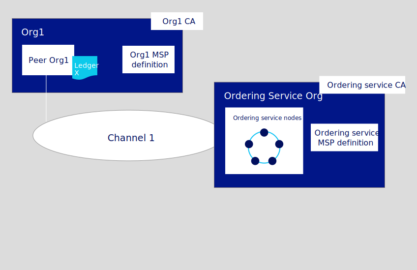

---

copyright:
  years: 2019, 2020
lastupdated: "2020-09-08"

keywords: getting started tutorials, create a CA, enroll, register, create an MSP, wallet, create a peer, create ordering service, Raft, ordering service, blockchain network, blockchain

subcollection: blockchain

---

{:external: target="_blank" .external}
{:shortdesc: .shortdesc}
{:screen: .screen}
{:codeblock: .codeblock}
{:note: .note}
{:term: .term}
{:important: .important}
{:tip: .tip}
{:pre: .pre}
{:script: data-hd-video='script'}
{:video: .video}

# Build a network
{: #ibp-console-build-network}

{{site.data.keyword.blockchainfull}} Platform is a blockchain-as-a-service offering that enables you to develop, deploy, and operate blockchain applications and networks. You can learn more about blockchain components and how they work together by visiting the [Blockchain component overview](/docs/blockchain?topic=blockchain-blockchain-component-overview#blockchain-component-overview). This tutorial is the first part in the [sample network tutorial series](/docs/blockchain?topic=blockchain-ibp-console-build-network#ibp-console-build-network-sample-tutorial) and describes how to use the {{site.data.keyword.blockchainfull_notm}} Platform console to build a fully functional network on Kubernetes cluster deployed into the cloud infrastructure of your choice.
{:shortdesc}

**Target audience:** This topic is designed for network operators who are responsible for creating, monitoring, and managing the blockchain network.

If you have not already used the {{site.data.keyword.blockchainfull_notm}} Platform console to deploy components to a Kubernetes cluster on {{site.data.keyword.cloud_notm}}, see [Getting started with {{site.data.keyword.blockchainfull_notm}} Platform for {{site.data.keyword.cloud_notm}}](/docs/blockchain?topic=blockchain-ibp-v2-deploy-iks#ibp-v2-deploy-iks). Note that the console itself does not reside in your cluster. It is a tool that you can use to deploy components into your cluster.

Whether you deploy components to a paid or free Kubernetes cluster, pay close attention to the amount of available resources in your cluster when you choose to deploy nodes and create [channels](#x2016483){: term}. It is your responsibility to manage your Kubernetes cluster and deploy additional resources when necessary. While components will successfully deploy to an {{site.data.keyword.cloud_notm}} free cluster, the more components you add, the slower your components will run. For more information about component sizings and how the console interacts with your Kubernetes cluster on {{site.data.keyword.cloud_notm}}, see [Allocating resources](/docs/blockchain?topic=blockchain-ibp-console-adv-deployment#ibp-console-adv-deployment-allocate-resources).

If you are using a Kubernetes cluster on {{site.data.keyword.cloud_notm}}, it is recommended that you provision at least a 4CPU x 16GB RAM cluster to accommodate the components in this tutorial.
{: tip}

## Sample network tutorial series
{: #ibp-console-build-network-sample-tutorial}

This three-part tutorial series guides you through the process of creating and interconnecting a relatively simple, multi-node Hyperledger Fabric network by using the {{site.data.keyword.blockchainfull_notm}} Platform console to deploy a network into your Kubernetes cluster and install and instantiate a smart contract.

Note that while this tutorial shows how this process works with a paid Kubernetes cluster on {{site.data.keyword.cloud_notm}}, the same basic flow applies to free clusters, albeit with a few limitations (for example, you cannot size or resize nodes in a free cluster).

* **Build a network tutorial** This tutorial guides you through the process of hosting a network by creating two organizations, one for your peer and another for your ordering service, and a channel. Use this tutorial if you want to form a blockchain consortium by creating an ordering service and adding organizations.
* [Join a network tutorial](/docs/blockchain?topic=blockchain-ibp-console-join-network#ibp-console-join-network) guides you through the process of joining an existing network by creating a peer and joining it to an existing channel. Use this tutorial if you either do not intend to host a network by creating an ordering service, or want to learn the process for joining other networks.
* [Deploy a smart contract on the network](/docs/blockchain?topic=blockchain-ibp-console-smart-contracts#ibp-console-smart-contracts) shows how to write a smart contract and deploy it on a network.

**Looking for a way to script the deployment of your nodes?** If you are already familiar with the manual process to deploy the components with the console, you can check out the [Ansible playbooks](/docs/blockchain?topic=blockchain-ansible), a powerful tool for scripting the deployment of components in your blockchain network.

### The structure of this network
{: #ibp-console-build-network-structure}

If you complete all the steps in the **Build a network** and **Join a network** tutorials, your network will resemble the one in the illustration below:

{: caption="Figure 1. Sample basic network structure" caption-side="bottom"}

This configuration is sufficient both for testing applications and smart contracts and as a guide for building components and joining production networks that will suit your own use case. The network contains the following components:

* **Two peer organizations**: `Org1` and `Org2`  
  The tutorial series describe how to create two peer organizations and two associated peers. Think of organizations on a blockchain network to be like two different banks that need to transact with each other. We will create the definitions of `Org1` and `Org2`.
* **One ordering service organization**: `Ordering Service`  
  Because we are building a distributed ledger, the peers and ordering service should be part of separate organizations. Therefore, a separate organization is created for the ordering service. Among other things, an ordering service orders the blocks of transactions that are sent to the peers to be written to their ledgers and become the blockchain. We will create the definition of the `Ordering Service` organization.
* **Three Certificate Authorities (CAs)**: `Org1 CA, Org2 CA, Ordering Service CA`   
  A CA is the node that issues certificates to both the users and the nodes associated with an organization. Because it’s a best practice to deploy one CA per organization, we will deploy three CAs in total: one for each peer organization and one for the ordering service organization. These CAs will also create the definition of each organization, which is encapsulated by a Membership Service Provider (MSP). A TLS CA is automatically deployed together with each organization CA and provides the TLS certificates that are used for communication between nodes. For more information, see [Using your TLS CA](/docs/blockchain?topic=blockchain-ibp-console-identities#ibp-console-identities-tlsca).
* **One ordering service:** `Ordering Service` 
  While deployments running on a paid cluster have the option to deploy either a single node ordering service or a crash fault tolerant five node ordering service, free clusters only have the option of running a single node. The crash fault tolerant five node ordering service uses an implementation of the Raft protocol (for more information about Raft, see [The Ordering Service](https://hyperledger-fabric.readthedocs.io/en/release-1.4/orderer/ordering_service.html#raft){: external} and is the deployment option this tutorial will feature. This ordering service will add peer organizations to its "consortium", which is the list of peer organizations that can create channels. Currently, only one ordering service organization per ordering service is supported, regardless of the number of ordering nodes associated with that organization. This ordering service will add peer organizations to its "consortium", which is the list of peer organizations that can create and join channels. If you want to create a channel that has organizations deployed in different clusters, which is how most production networks will be structured, the ordering service admin will need to import a peer organization that has been deployed in another console into their console. This allows the peer organization to join the channel that is hosted on that ordering service.
* **Two peers:** `Peer Org1` and `Peer Org2`  
  The ledger, `Ledger x` in the illustration above, is maintained by distributed peers. These peers are deployed with [Couch DB](https://hyperledger-fabric.readthedocs.io/en/release-1.4/couchdb_as_state_database.html){: external}) as the state database in a separate container associated with the peer. This database holds the current value of all "state" (as represented by key-value pairs). For example, saying that `Org1` (a value) is the current owner of a bank asset (the key). The blockchain, the list of transactions, is stored locally on the peer.
* **One channel**: `channel1`  
  Channels allow sets of organizations to transact without exposing their data to organizations that are not members of the channel. Each channel has its own ledger, collectively managed by the peers joined to that channel. The tutorial creates one channel that is joined by both organizations, and shows how to instantiate a smart contract on the channel that the organizations can use to transact.

This configuration isn't mandatory. The {{site.data.keyword.blockchainfull_notm}} Platform is highly customizable. If you have resources available in your Kubernetes cluster, you can use the console to deploy components in an endless array of configurations. This tutorial provides the steps that you need to build your own network, with references to topics that provide a deeper dive into the {{site.data.keyword.blockchainfull_notm}} Platform and the console.

In this **Build a network** tutorial, we build only a portion of the network above, a simple network that can be used to host an ordering service and a single peer organization and peer on a single channel. The following illustration shows the portion of the network above that we will build:
{: caption="Figure 2. Simple network structure" caption-side="bottom"}

This configuration is useful for quickly getting started and testing a smart contract but is not very meaningful until you add other organizations to transact with, creating a truly distributed network. Therefore, in the subsequent [Join a network](/docs/blockchain?topic=blockchain-ibp-console-join-network#ibp-console-join-network) tutorial, we show you how to create additional peer organizations and peers, and how to add a new organization to the channel.

Throughout this tutorial we supply **recommended values** for the fields in the console. This allows the names and identities to be easier to recognize in the tabs and drop-down lists. These values are not mandatory, but you will find them helpful, especially since you will have to remember certain values like IDs and secrets of registered users that you input in previous steps. As these values are not stored in the console, if you forget them, you will have to register additional users and start the process over again. We provide a table of the recommended values after each task and recommend that if you do not use the recommended values that you record your values as you proceed through the tutorial.
{:tip}

## Step one: Create a peer organization and a peer
{: #ibp-console-build-network-create-peer-org1}

For each organization that you want to create with the console, you should deploy at least one CA. A CA is the node that issues certificates to all network participants (peers, ordering services, clients, admins, and so on). These identities, which include a signing certificate and private key, allow network participants to communicate, authenticate, and ultimately transact. These CAs will create all of the identities and certificates that belong to your organization, in addition to defining the organization itself. You can then use those identities to deploy nodes, create admin identities, and submit transactions. For more information about your CA and the identities that you will need to create, see [Managing identities](/docs/blockchain?topic=blockchain-ibp-console-identities#ibp-console-identities).

In this tutorial, we create two organizations, one which will own a peer and another which will own an ordering service. Each organization needs a CA to issue its certificates, therefore we need to create **two CAs**. For the purpose of this tutorial, **we will create only one CA at a time**.

Watch the following video to learn about the process to create the peer's organization and the peer (for video tutorials on how how to create an ordering service and a channel, see [video series](https://developer.ibm.com/series/ibm-blockchain-platform-console-video-series/){: external}:

  

<iframe class="embed-responsive-item" id="youtubeplayer2" title="Deployment tutorial series: peer" type="text/html" width="640" height="390" src="https://www.youtube.com/embed/PAC0PPPFxLE" frameborder="0" webkitallowfullscreen mozallowfullscreen allowfullscreen> </iframe>

### Video transcript
{: #transcript-peer-video}
{: script}
{: notoc}

Hello everyone, and welcome to this demonstration of how to create a peer using the IBM Blockchain platform console. I’ll be following the process from the IBM Blockchain platform documentation, which you can see here. At the end of this tutorial, you will have created this structure, representing the components related to org1. In our next video, we’ll create an ordering service. And after that, a channel, to complete the infrastructure of our network.

In this video, we’ll be using recommended values for the various fields in the UI. These are the same values you’ll find in the docs, which are cataloged in tables for the various tasks. These values are not mandatory, but if you’re using the console for the first time, we do recommended them. In cases where you have to reenter a value, for example an enroll ID and secret, which are not stored in the console, you will be able to refer to the tables in the documentation to remember what you entered. If you do choose different values, make sure to write them down somewhere.

Alright, so let’s get started creating that peer. If you're unfamiliar with Hyperledger Fabric, which the IBM Blockchain Platform is based on, you might not realize you have to create a Certificate Authority before you create a peer. This is because before we can create a peer, we have to create some identities. These identities allow a network entity, whether it’s an admin or a node, to sign its actions using a certificate. Those certificates are issued by a Certificate Authority, also known as a CA. Therefore, our first step in creating a peer is to create a CA and use it to register identities for the peer admin and for the peer itself. After which we’ll need to create a definition for org1.

To do that, click on Add certificate authority. We’re going to be creating a CA here, not importing one. Then, give this CA a display name. Because it's going to be associated with org1, we'll call it org1 CA. Next we’ll give an enroll ID and secret for the user who will be the admin of the CA itself: admin and adminpw. Note the resource allocation box. If you leave this box deselected, your CA will be deployed with default resources. If you want to know what those resources are, for example to check against the resources available in your cluster, click the box and then next. If you’re comfortable with the default allocation, click next. You’ll be taken to the summary screen which will show the values for the CA you are creating.

If these seem right to you, click Add Certificate Authority. The process of deploying a CA can take a few minutes.

To check on the status of your deployments, make sure to refer to your Kubernetes dashboard. If the box on a node does not turn green, or turns gray at some point, you can check on its status by making sure you’re in the correct resource group and clicking on your deployments. The Kubernetes dashboard is also how you will extend resources in your cluster, as needed. When the CA is ready, you’ll see the gray box turn green, indicating that the CA has been deployed.

But before we can use the CA to register identities for org 1, we need to enroll an admin for this CA. Which we can do by clicking on the CA and clicking on associate identity. From there, enter the enroll ID and secret you used when creating the CA: admin and adminpw. Then give this identity the name Org1 CA Admin. Then click associate identity. If you click over to your wallet, you can see that the CA Admin is there, indicating it has been enrolled successfully. The CA is now ready to be used to register and enroll identities.

We’ll start by registering the admin of org1. Because it will be an admin, use an enroll ID of org1admin and a secret of org1adminpw. Then give it a type of admin. Do not use the peer or orderer type. Use the default affiliation for now, and ignore the enrollments and attributes. If you want to learn about affiliations and enrollments and attributes you can read about them in our documentation. Now that the admin identity of org1 has been registered we need to register the identity for the peer itself. Remember that nodes have identities just as admins and users do. So we'll use peer1 and peer1pw as the enroll id and secret of the peer. This is a peer so we need to use the “peer” type, again using default affiliations and ignoring enrollments and attributes.

So now that we have registered the two identities we can create the definition of org1, which is represented by an MSP. We do that through the Organizations tab. Click create. We’ll use an msp display name of Org1 MSP and an mspid of org1msp. Then specify org1 CA. You’ll see some values in the fields below. They’re the enroll ID and secret you entered when creating the admin of the CA. You don't want to use them as the admin of org1 as well. You want to create separate identities for the admins of your components. In this case that means using the identity you registered to be the admin of org1, org1admin and org1adminpw, and giving this identity the name Org1 MSP Admin. Then click generate. This will enroll the identity and put it in your wallet. Then export it. A JSON representing the Org1 Admin will be downloaded to your system. Make sure you always export your identities and MSPs as they’re only stored in the browser. If you switch to a different browser or a different machine, you won’t be able operate your components without uploading the admin of that component. When that is done, we can create this MSP definition. After which, we check our wallet and see that the Org1 Admin is there.

Now we can create the peer. Let’s give this peer a display name of Peer Org1. Again this is a display name for the UI. If you do not check any of the boxes below, default values for the various options will remain selected. To inspect these values, for example the default resources that will be allocated to the peer, click the box. You will also have a chance to review these values on the summary screen. For now, accept the defaults by leaving these boxes deselected.

In the next panel, make sure Org1 CA is selected.

Now we want to use the peer identity that we registered, peer1 and peer1pw. Then select the org1msp, as this peer will be associated with org 1. You can ignore this CSR hostname for now. That's only if you want to use a specific domain name for your peer. Next, select which Fabric version image you want to use to deploy this peer. I will select the highest version available here. Keep in mind that 2.x peers will have a lower resource allocation than 1.4.x peers because starting in Fabric version 2, smart contracts are deployed into their own pods by the smart contract launcher. Because Fabric v2.x peers do not have a "shim" (the external dependencies that allowed smart contracts to run on earlier versions of Fabric), you will have to vendor the shim and then repackage any smart contracts written in Golang (go) that you installed on peers deployed using the 1.4.x Fabric image. Without this vendoring and repackaging, the go smart contract will not run on a peer using a Fabric 2.x image. You will not need to do this for smart contracts written in Java or Node.js, nor for smart contracts written and packaged using the 2.0 package. Note also that you will not be able to enable any v2 capabilities on any channels for the time being.

Then, associate an identity --- this defines who the admin of the peer will be. In this case we're going to be using the same admin for the org as for the peer, Org1 MSP Admin. While you can create a separate admin for the peer, it’s perfectly fine to use the same identity that’s the admin of your organization.

On the next panel, review the summary to make sure these values are what you expect. Because we choose not to customize our resource allocation, pay particular attention to this section, as it represents the total amount of resources needed for this deployment. If you want to take a closer look at these values, go back and click the resource allocation box. A panel will come up showing these resources and the containers they are linked to. You can see the resources I have available in my cluster, which has three nodes with 4 CPUs and 16 gigs of RAM in a single zone. Based on the resources set to be allocated for my peer, I have enough space. When you are ready, click Add peer on the summary screen. It can take several minutes to create a peer. Check your Kubernetes cluster to monitor the status of your deployment. When the peer has finished deploying, you’ll see the gray box turn green. And that’s all there is to it.

We created a CA. We created an identity for the peer and for the admin. Then we created the definition of org1 and used all of that information to create the peer. And now that we have a peer we have everything we need to join a channel or join a network. If you want to host a channel, check out our next video, which will show you how to create an ordering service. So thank you for watching this video, and happy block chaining. 

### Creating your peer organization's CA
{: #ibp-console-build-network-create-CA-org1CA}

Your CA issues the certificates and private keys for your organization's admins, client applications, and nodes. These identities are not managed by {{site.data.keyword.IBM_notm}} and the private keys are not stored in the console. They are only stored in your browser local storage. Therefore, make sure to export your identities and the MSP of your organization. If you attempt to access the console from a different machine or a different browser, you will need to import these identities and organization definitions.
{:important}

To create the CA that will issue certificates for your first organization, perform the following steps in your console:

1. Navigate to the **Nodes** tab on the left and click **Add Certificate Authority**. The side panels will allow you to customize the CA that you want to create and the organization that this CA will issue keys for.
2. In this tutorial, we're creating nodes, as opposed to importing them, so make sure the option to **Create a Certificate Authority** is selected. Then click **Next**.
3. Use the side panel to give your CA a **display name**. Our recommended value for this CA is `Org1 CA`. Then give your CA admin credentials by specifying a **CA administrator enroll ID** of `admin` and a secret of `adminpw`. Again, these are **recommended values**.
4. The **Advanced deployment options**  are only available in paid clusters and can be safely ignored for purposes of this tutorial. For more information about these options, see the links below.
   * [Database and replica sets](/docs/blockchain?topic=blockchain-ibp-console-build-ha-ca#ibp-console-build-ha-ca-create) (Creating an HA CA) This option is only available on paid clusters.
   * [Hardware Security Module (HSM)](/docs/blockchain?topic=blockchain-ibp-console-adv-deployment#ibp-console-adv-deployment-cfg-hsm)
   * [Deployment zone selection](/docs/blockchain?topic=blockchain-ibp-console-ha#ibp-console-ha-multi-zone) (Multizone HA) This option is only visible when your cluster is configured with multiple zones.
   * [Resource allocation](/docs/blockchain?topic=blockchain-ibp-console-adv-deployment#ibp-console-adv-deployment-allocate-resources)
5. Review the Summary page, then click **Add Certificate Authority**. The **Edit configuration JSON** button allows you to override configuration settings for the CA. For this tutorial, the default settings are sufficient. See [Customizing a CA configuration](/docs/blockchain?topic=blockchain-ibp-console-adv-deployment#ibp-console-adv-deployment-ca-customization) to learn more about the options that are available.

**Task: Creating the peer organization CA**

  | **Field** | **Display name** | **Enroll ID** | **Secret** |
  | ------------------------- |-----------|-----------|-----------|
  | **Create CA** | Org1 CA  | admin | adminpw |
  {: caption="Table 1. Creating the peer organization CA" caption-side="bottom"}

After you deploy the CA, you need to associate an admin identity. This will allow you to operate your CA and use it to create your organization MSP, register users, and your **peer**.

Advanced users may already have their own CA, and not want to create a new CA in the console. If your existing CA can issue certificates in `X.509` format, you can use certificates from your own external CA instead of creating a new CA here. The CA should sign using ECDSA and the defaults should be set to use P256 curve. See this topic on [Using certificates from an external CA with your peer or ordering node](/docs/blockchain?topic=blockchain-ibp-console-adv-deployment#ibp-console-adv-deployment-third-party-ca) for more information.

### Associating the CA admin identity
{: #ibp-console-build-network-ca-admin}

Each CA node is created with a CA admin identity. You use the admin identity to register new users with your CA and generate certificates. Before you can use the console to operate your CA, you need to associate the CA admin identity with the CA node itself.

Depending on your cluster type, deployment of the CA can take up to ten minutes. When the CA is first deployed (or when the CA is otherwise unavailable), the status indicator box in the CA tile is a flashing gray box. When the CA is successfully deployed and is running, this box is green, indicating that it is "Running" and can be operated from the console. Before proceeding with the steps below, you must wait until the CA status is "Running". If the gray box stops blinking, you can try reloading the page in your browser to refresh the status.
{:important}

After the CA is running, as indicated by the green box in the tile, complete the following steps:

1. Click the `Org1 CA` tile in the **Nodes** tab. Then click **Associate identity** on the CA overview panel.
2. On the side panel that opens, provide an **Enroll ID** of `admin` and an **Enroll secret** of `adminpw`. For the **Identity display name**, you can use the default value of `Org1 CA Admin`.
3. Click **Associate identity** to add the identity into your console Wallet and associate the admin identity with your CA.

After setting the CA admin identity, you will be able to see the table of registered users in the CA overview panel.

**Task: Associate identity**

  |  **Field** | **Display name** | **Enroll ID** | **Secret** |
  | ------------------------- |-----------|-----------|-----------|-----------|
  | **Enroll ID** |  Org1 CA Admin | admin | adminpw |
  {: caption="Table 2. Associate the CA admin identity" caption-side="bottom"}

You can view the CA admin identity in your console Wallet by clicking on the **Wallet** in the left navigation. Click the identity to view the certificate and private key of the CA admin.

**Task: Check your Wallet**

  | **Field** |  **Display name** | **Description** |
  | ------------------------- |-----------|----------|
  | **Identity** | Org1 CA Admin | Org1 CA admin identity |
  {: caption="Table 3. Check your Wallet" caption-side="bottom"}

The identity is not stored in your console or managed by {{site.data.keyword.IBM_notm}}. It is only stored in local browser storage. If you change browsers, you will need to import this identity into your Wallet to be able to operate the CA. Click **Export identity** to download the identity along with its certificate and private key.
{: important}

### Using your CA to register identities
{: #ibp-console-build-network-use-CA-org1}

Each node or application that you want to create needs a certificate and private key to participate in the blockchain network. You also need to create admin identities for your nodes so that you can manage them from the console. We will use our peer organization CA to regisiter two identities:

* **An organization admin**: This identity allows you to operate nodes using the platform console.
* **A peer identity**: This is the identity of the peer itself. Whenever a peer performs an action (for example, endorsing a transaction) it will sign using its certificate.

Once you have associated the CA admin, you can use the CA tile to create these identities by completing the following steps:

1. Click the `Org1 CA` tile and ensure the `admin` identity that you created for the CA is visible in the table. Then click the **Register user** button.
2. First we'll register the organization admin, which we can do by giving an **Enroll ID** of `org1admin` and a **secret** of `org1adminpw`. Then set the `Type` for this identity as `admin`.  You can ignore the **Maximum enrollments** field. If you want to learn more about enrollments, see [Registering identities](/docs/blockchain?topic=blockchain-ibp-console-identities#ibp-console-identities-register). Click **Next**.
3. This tutorial does not configure attributes on identities, see [Registering identities](/docs/blockchain?topic=blockchain-ibp-console-identities#ibp-console-identities-register) if you want to learn more. Click **Register user**.
4. After the organization admin has been registered, repeat this same process for the identity of the peer (also using the `Org1 CA`). For the peer identity, give an enroll ID of `peer1` and a secret of `peer1pw`. This is a node identity, so select `peer` as the **Type**. You can ignore the **Maximum enrollments** field and, on the next panel, do not assign any **Attributes**, as before.

Registering these identities with the CA is only the first step in **creating** an identity. You will not be able to use these identities until they have been **enrolled**. Enrollment is the process that generates the certificate and private key for the registered user.  For the `org1admin` identity, this will happen during the creation of the MSP, which we will see in the next step. In the case of the peer1 identity, it happens during the creation of the peer.
{:note}

**Task: Register users**

  |  **Field** | **Description** | **Enroll ID** | **Secret** | **Type** |
  | ------------------------- |-----------|-----------|-----------|-----------|
  | **Create CA**  | CA admin | admin | adminpw | client |
  | **Register users** | Org1 admin | org1admin | org1adminpw | admin |
  | | Peer identity |  peer1 | peer1pw | peer |
  {: caption="Table 4. Using your CA to register users" caption-side="bottom"}

### Creating the peer organization MSP definition
{: #ibp-console-build-network-create-peers-org1}

Now that we have created the peer's CA and used it to **register** identities for the `Org1` admin and for the `Org1` peer, we need to create a formal definition of the peer's organization, which is known as an MSP. Note that many peers can belong to an organization. **You do not need to create a new organization every time you create a peer**. Because this is the first time that we go through the tutorial, we will create the MSP definition for this organization. During the process of creating the MSP, we will enroll the `org1admin` identity and add it to our Wallet.

1. Navigate to the **Organizations** tab in the left navigation and click **Create MSP definition**.
2. On the first panel, enter `Org1 MSP` as the organization MSP display name and `org1msp` and as the MSP ID. If you plan to specify an MSP other than `org1msp`, make sure to review the guidelines for MSP names in the tooltip. Click **Next**.
3. On the **Root Certificate Authority details** panel, specify the CA you used to register the identities for this organization. If this is your first time through this tutorial, you should only see one: `Org1 CA`. The CA root certificate and TLS CA root certificate are displayed. Click **Next**.
4. On the **Admin certificates panel**, select the enroll ID you created for your organization admin from the drop-down list, `org1admin`, and enter its associated secret, `org1adminpw`. Then, give this identity a display name, `Org1 MSP Admin`. Note: the default display name for this identity is the name of your MSP and the word "Admin". If you select a different name for your MSP, that will be reflected in the default.
5. Click the **Generate** button to enroll this identity as the admin of your organization and export the identity to the Wallet, where it will be used when creating the peer and creating channels.
6. Click **Export** to export the admin certificates to your file system. As we said above, this identity is not stored in your console or managed by {{site.data.keyword.IBM_notm}}. It is only stored in local browser storage. If you change browsers, you will need to import this identity into your Wallet to be able to administer the peer. Click **Next**.  
  Exporting your organization admin identity is important because you are responsible for managing and securing these certificates. If you switch browsers, you will need to import this admin identity otherwise you will not be able to operate Org1.
  {:important}
7. On the **Review MSP information** panel, make sure you have entered the correct information. When you are satisfied, click **Create MSP definition**.
8. After the MSP has been created, click on the tile representing it. Then **download** the MSP to your local filesystem. You will need to send this MSP to all of the organizations the channels you join.

**Task: Create the peer organization MSP**

  |  | **Display name** | **MSP ID** | **Enroll ID**  | **Secret** |
  | ------------------------- |-----------|-----------|-----------|-----------|
  | **Create Organization** | Org1 MSP | org1msp |||
  | **Root CA** | Org1 CA ||||
  | **Org Admin Cert** | |  | org1admin | org1adminpw |
  | **Identity** | Org1 MSP Admin |||||
  {: caption="Table 5. Create the peer organization MSP definition" caption-side="bottom"}

After you have created the MSP, you should be able to see the peer organization admin in your console **Wallet**.

**Task: Check your Wallet**

  | **Field** |  **Display name** | **Description** |
  | ------------------------- |-----------|----------|
  | **Identity** | Org1 CA Admin | Org1 admin identity |
  | **Identity** | Org1 MSP Admin | Org1 MSP admin identity |
  {: caption="Table 6. Check your Wallet" caption-side="bottom"}

For more information about MSPs, see [managing organizations](/docs/blockchain?topic=blockchain-ibp-console-organizations#ibp-console-organizations).

### Creating a peer
{: #ibp-console-build-network-peer-create}

After you have [created the Org1 CA](/docs/blockchain?topic=blockchain-ibp-console-build-network#ibp-console-build-network-create-CA-org1CA), used it to register Org1 identities, and created the [Org1 MSP](/docs/blockchain?topic=blockchain-ibp-console-build-network#ibp-console-build-network-create-peers-org1), you're ready to create a peer for Org1.

**What role do peers play?**  

It's important to remember that organizations themselves do not maintain ledgers. Peers do. Organizations also use peers to sign transaction proposals and approve channel configuration updates. Because having at least two peers per organization on a channel makes them highly available, having three peers per organization joined to a channel is considered a best practice for production level implementations because it ensures high availability even while a peer is down for maintenance. In this tutorial though, we'll only show the process for creating a single peer. You can replicate the process to suit your own business needs.

From a resource allocation perspective, it is possible to join the same peers to multiple channels. The design of the peer ensures that the data from one channel cannot pass to another through the peer. However, because the peer will store a separate ledger for each channel, it is necessary to ensure that the peer has enough processing power and storage to handle the transaction and data load.

#### Deploying your peer
{: #ibp-console-build-network-deploy-peer-role}

Use your console to perform the following steps:

1. From the **Nodes** tab, click **Add peer**.
2. Make sure the option to **Create a peer** is selected. Then click **Next**.
3. Give your peer a **Display name** of `Peer Org1`.
4. The **Advanced deployment options**  are only available in paid clusters and can be safely ignored for purposes of this tutorial. For more information about these options, see the links below.
   * [State database](/docs/blockchain?topic=blockchain-ibp-console-adv-deployment#ibp-console-adv-deployment-level-couch)
   * [Multizone Kubernetes cluster](/docs/blockchain?topic=blockchain-ibp-console-ha#ibp-console-ha-multi-zone) (Multizone HA) This option is only visible when your cluster is configured for multizone support.
   * [Use your own CA certificate and private key](/docs/blockchain?topic=blockchain-ibp-console-adv-deployment#ibp-console-adv-deployment-third-party-ca)
   * [Hardware Security Module (HSM)](/docs/blockchain?topic=blockchain-ibp-console-adv-deployment#ibp-console-adv-deployment-cfg-hsm)
   * [Resource allocation](/docs/blockchain?topic=blockchain-ibp-console-adv-deployment#ibp-console-adv-deployment-allocate-resources)
5. Click **Next**.
6. On the **Enter peer information** page:
   * Select `Org1 CA`, as this is the CA you used to register the peer identity.
   * Select the **Enroll ID** for the peer identity that you created for your peer from the drop-down list, `peer1`, and enter its associated **secret**, `peer1pw`.
   * Then, select `Org1 MSP` from the drop-down list
   * The **TLS Certificate Signing Request (CSR) hostname** is an option available to advanced users who want to specify a custom domain name that can be used to address the peer endpoint. Custom domain names are not a part of this tutorial, so leave the **TLS CSR hostname** blank for now.
   * In the **Fabric version** drop-down list, the best practice is to select the **highest available version**, as it will contain the latest bug fixes. It might also be necessary to select the highest version in order to have access to the latest features. Note that if you select any version higher than v2.0, no smart contract container will be deployed along with your peer. Instead, each smart contract will be deployed into its own pod when it is instantiated on the channel or invoked for the first time. With the exception of smart contracts that run Go chaincode, peer nodes running Fabric v1.4.7 and v2.1.1 are compatible with each other. See this [topic](/docs/blockchain?topic=blockchain-ibp-console-smart-contracts#ibp-console-smart-contracts-write-package) on vendoring the shim for more information on what is required.
   * Click **Next**.
7. The last side panel asks you to **Associate an identity** to make it the admin of your peer. For the purpose of this tutorial, make your organization admin, `Org1 MSP Admin`, the admin of your peer as well. It is possible to register and enroll a different identity with the `Org1 CA` and make that identity the admin of your peer, but this tutorial uses the `Org1 MSP Admin` identity.
8. Review the summary and click **Add peer**. The **Edit configuration JSON** button allows you to override configuration settings for the peer. For this tutorial, the default settings are sufficient. See [Customizing a peer configuration](/docs/blockchain?topic=blockchain-ibp-console-adv-deployment#ibp-console-adv-deployment-peer-create-json) to learn more about the options that are available.

**Task: Deploying a peer**

  |  | **Display name** | **MSP ID** | **Enroll ID** | **Secret** |
  | ------------------------- |-----------|-----------|-----------|-----------|
  | **Create Peer** | Peer Org1 | org1msp |||
  | **CA** | Org1 CA ||||
  | **Peer Identity** | |  | peer1 | peer1pw |
  | **Administrator certificate** | org1msp ||||
  | **Associate identity** | Org1 MSP Admin |||||
  {: caption="Table 7. Deploying a peer" caption-side="bottom"}

In a production scenario, it is recommended that each organization deploy three peers to each channel. These can be the same three peers joined to different channels or different peers. It is up to the organization. This is to allow one peer to go down (for example, during a maintenance cycle) and still maintain highly available peers. To deploy more than one peer for an organization, use the same CA you used to register your first peer identity. In this tutorial, that would be `Org1 CA`. Then, register a new peer identity using a distinct enroll ID and secret. For example, `org1secondpeer` and `org1secondpeerpw`. Then, when creating the peer, give this enroll ID and secret. As this peer is still associated with Org1, choose `Org1 CA`, `Org1 MSP`, and `Org1 MSP Admin ` from the drop-down lists. You may choose to give this new peer a different admin, which can be registered and enrolled with `Org1 CA`, but this optional. This tutorial series will only show the process for creating a single peer for each peer organization.
{:tip}

## Step two: Create the ordering service
{: #ibp-console-build-network-create-orderer}

In other distributed blockchains, such as Ethereum and Bitcoin, there is no central authority that orders transactions and sends them out to peers. Hyperledger Fabric, the blockchain that the {{site.data.keyword.blockchainfull_notm}} Platform is based on, works differently. It features a node, or a cluster of nodes, called an **ordering service**.

The ordering service is a key component in a network because it performs a few essential functions:

- It literally **orders** the blocks of transactions that are sent to the peers to be written to their ledgers. This process is called "ordering".
- It maintains the **ordering system channel**, the place where the **consortium**, the list of peer organizations permitted to create channels, resides.
- It **enforces the policies** decided by the consortium or the channel administrators. These policies dictate everything from who gets to read or write to a channel, to who can create or modify a channel. For example, when a network participant asks to modify a channel or consortium policy, the ordering service processes the request to see if the participant has the proper administrative rights for that configuration update, validates it against the existing configuration, generates a new configuration, and relays it to the peers.

For more information about ordering services and the role they play in networks based on Hyperledger Fabric, see [The Ordering Service](https://hyperledger-fabric.readthedocs.io/en/release-1.4/orderer/ordering_service.html){: external}.

In a paid cluster, you have the option between creating a one node ordering service (sufficient for testing purposes) and a crash fault tolerant ordering service featuring five nodes tied to a single organization. In a free cluster, you will only be able to create a single node ordering service. In this tutorial, we will show the one node ordering service.

However, just as with the peer, before we can create an ordering service, we need to create a CA to supply the identities and the MSP of our ordering service organization.

Watch the following video to learn about the process to create the ordering service's organization and the ordering service (for video tutorials on how how to create a peer and a channel, see [video series](https://developer.ibm.com/series/ibm-blockchain-platform-console-video-series/){: external}:

  

<iframe class="embed-responsive-item" id="youtubeplayer2" title="Deployment tutorial series: ordering service" type="text/html" width="640" height="390" src="https://www.youtube.com/embed/lapmfN_tucg" frameborder="0" webkitallowfullscreen mozallowfullscreen allowfullscreen> </iframe>

### Video transcript
{: #transcript-orderer-video}
{: script}
{: notoc}

Hello everyone, and welcome to this demonstration of how to create an ordering service using the ibm blockchain platform console. if you watched our other video on how to create a peer, much of this flow will seem similar to you. You still have to create a Certificate Authority first, use it to create identities and an organization, and then finally use those identities to create the ordering service itself. Once again, this information and more is present in our series of tutorials taking you through a full end to end where you create all of the nodes and identities, create a channel, join a channel, and deploy a smart contract. By the end of this video you'll have a configuration that looks like THIS, only without the channel, which we’ll create in our next demonstration.

So let's go ahead and add that CA. We're creating a CA so we can click next here. As we did with the peer, we need to give this CA a display name. And as before, you can use whatever values you want, but we’ll call it the Ordering Service CA. We’ll give an admin identity of admin and a secret of adminpw for our CA admin. Although this identity has the same id and secret as the org1 CA admin, it is not the same identity because it is not the same CA. Note the resource allocation box. If you leave this box unselected, your CA will be deployed with default resources. If you want to know what those resources are, for example to check against the resources available in your cluster, click the box and then next. If you’re comfortable with the default allocation, click next. You’ll be taken to the summary screen which will show the values for the CA you are creating. Once again, accept these defaults for now and click next. You’ll be taken to the summary screen that will show you the values you just entered. If these seem right to you, click Add Certificate Authority.

We talked in our previous video about the gray box. When it’s green, the CA can be used. But before we can use the CA to register identities for our ordering service organization, we need to enroll an admin for this CA. Which we can do by clicking on the CA and clicking on associate identity. From there, enter the enroll ID and secret you used when creating the CA: admin and adminpw. Then give this identity the name Org1 CA Admin. Then click associate identity. If you click over to your wallet, you can see that the CA Admin is there, indicating it has been enrolled successfully. The CA is now ready to be used to register and enroll identities.

As with the peer, we need to register two identities, one for the ordering service admin and one for the ordering service nodes.

First up will be the ordering service admin. We'll give it an enroll id of OSadmin and a secret of OSadminpw. This is an admin so we use the admin type, not the peer, orderer, or client type. As before, use the default affiliations and ignore the enrollments and attributes.

Now we can register the identity of our ordering node. In this tutorial, we’ll create a single node Raft ordering service. This configuration is not considered ideal for production because it is not highly available, but it is sufficient to get started. We’ll use an enroll id of OS1 and a secret of OS1pw. As this is an ordering node, use the orderer type, and once again use the default affiliations and attributes.

Now that we have the CA and have used it to register identities we can create the definition of the ordering service organization, which we do by clicking the Organizations tab and then create MSP definition. The display name for this msp will be called Ordering Service MSP, while the MSP ID will be osmsp. Our CA here is the ordering service CA, not the org1 CA. Then give the enroll id and secret of the admin of your ordering service organization, OSadmin and OSadminpw. Do not use any default value that might be here. Then give this identity the name Ordering Service MSP Admin. Then click generate. That will create the identity. And then export it to your machine. Then click create the MSP definition. You should see the Ordering Service MSP. And if you look in your wallet you should now see the Ordering Service MSP Admin identity we just created.

Now that we have the msp and the identities that we need we can go back and create our ordering service. Click the add orderer tile and specify that you’re creating an ordering service. On the next panel, give this ordering service the name Ordering Service. If you intend your network to be used for testing and development, you can choose one node here. Keep in mind however that a single node ordering service is not crash fault tolerant, which means that during a maintenance cycle or upgrade, you will not be able to commit transactions on a channel hosted on that ordering service. If your network is meant for production, choose the five node option, which uses the Raft protocol, as this ordering service is both crash fault tolerant and able to handle the loss of two nodes and not lose function.

As we have done for our CAs and our peer, we will use the default resource allocation. In the summary screen, we will be able to inspect the resources this ordering service needs to be deployed and check it against the resources available in our cluster.

On the next screen, make sure that you specify the ordering service ca, not the org1 ca, and that you give the enroll id of your ordering service node, OS1 and OS1pw. Then, select the Ordering Service MSP from the MSP drop down and ignore the TLS CSR hostname.

Now let’s give the ordering node identity that we registered, os1 and the secret, os1pw. Then select the Ordering Service MSP. As we did with the peer, we can ignore the CSR Hostname. Next, select which Fabric version image you want to use to deploy this ordering service. As we did with the peer, I will select the highest version here, as it contains the latest fixes and improvements. It will also set me up well when we enable v2 capabilities, which are currently not available.

On the next panel, review the summary to make sure these values are what you expect. Because we choose not to customize our resource allocation, pay particular attention to this section, as it represents the total amount of resources needed for this deployment. If you want to take a closer look at these values, go back and click the resource allocation box. A panel will come up showing these resources and the containers they are linked to. You can see the resources I have available in my cluster, which has three nodes with 4 CPUs and 16 gigs of RAM in a single zone. Based on the resources set to be allocation for my peer, I have enough space for this ordering service. When you are ready, click Add ordering service on the summary screen. It can take several minutes to create a ordering service. Check your Kubernetes cluster to monitor the status of your deployment. When the ordering service has finished deploying, you’ll see the gray box turn green.

You should now have two CAs, a peer, and an ordering service, all the components you need to create a channel, which you can learn about in our next video. Until then, thank you for watching and happy block chaining.

### Ordering in the console
{: #ibp-console-build-network-ordering-console}

The production level ordering service available is a crash fault tolerant (CFT) ordering service based on an implementation of Raft protocol in `etcd`. Raft follows a “leader and follower” model, where a leader node is selected (per channel) and its decisions are replicated by the followers. Its design allows different organizations to contribute nodes to a distributed ordering service. For more information about Raft, see [The Ordering Service](https://hyperledger-fabric.readthedocs.io/en/release-1.4/orderer/ordering_service.html#raft){: external}.

Currently, the only crash fault tolerant configuration of ordering nodes currently available is **five** nodes. While it is possible to create a crash fault tolerant ordering service with as little as three nodes, this configuration incurs risk. If a node goes down, for example during a maintenance cycle, only two nodes would be left. If another node was lost during this cycle **for any reason**, only one node would left. In that state, a one node ordering service when you started with three, you would no longer have a majority of nodes available, also known as a "quorum". Without a quorum, no transactions can be pushed and the channel stops functioning.

With five nodes, you can lose two nodes and still maintain a quorum, meaning that you can undergo a maintenance cycle while maintaining high availability. As a result, paid clusters  will only have the choice between one node and five nodes. Production networks should choose the five node option, as a one node ordering service is, by definition, not crash fault tolerant.

The ordering service can be run by either one organization (as might be the case in founder-led networks or in cases where the consortium chooses an independent neutral entity to run all of the ordering nodes), or by multiple organizations which may or may not contribute a node. Similarly, channel members can decide how many ordering nodes they want to service a channel. Two organizations might decide to create a channel only using ordering nodes they own.

In this tutorial, we will create a one node ordering service managed by a single organization. If you want to add additional nodes to this deployment, see [Adding and removing ordering service nodes](/docs/blockchain?topic=blockchain-ibp-console-add-remove-orderer).

### Creating your ordering service organization CA
{: #ibp-console-build-network-create-orderer-ca}

The process for creating a CA for an ordering service is identical to creating it for a peer.

1. Navigate to the **Nodes** tab and click **Add Certificate Authority**.
2. In this tutorial, we're creating nodes, as opposed to importing them, so make sure the option to **Create a Certificate Authority**  is selected. Then click **Next**
3. Give this CA a unique display name, `Ordering Service CA`. You're free to reuse the **CA administrator enroll ID** of `admin` and a secret of `adminpw`. As this is a different CA, this identity is distinct from the CA admin identity for created for the `Org1 CA`, even though the ID and secret are identical.
4. The **Advanced deployment options**  are only available in paid clusters and can be safely ignored for purposes of this tutorial. For more information about these options, see the links below.
   * [Database and replica sets](/docs/blockchain?topic=blockchain-ibp-console-build-ha-ca#ibp-console-build-ha-ca-create) (Creating an HA CA)  This option is only available on paid clusters. 
   * [Multizone Kubernetes cluster](/docs/blockchain?topic=blockchain-ibp-console-ha#ibp-console-ha-multi-zone) (Multizone HA) This option is only visible when your cluster is configured with multiple zones.
   * [Hardware Security Module (HSM)](/docs/blockchain?topic=blockchain-ibp-console-adv-deployment#ibp-console-adv-deployment-cfg-hsm)
   * [Resource allocation](/docs/blockchain?topic=blockchain-ibp-console-adv-deployment#ibp-console-adv-deployment-allocate-resources)
5. Review the Summary page, then click **Add Certificate Authority**.

As with the peer, advanced users may already have their own CA and not want to create a new CA using the console. If your existing CA can issue certificates in `X.509` format, you can use certificates from your own external CA instead of creating new certificates here. See this topic on [Using certificates from an external CA with your peer or ordering node](/docs/blockchain?topic=blockchain-ibp-console-adv-deployment#ibp-console-adv-deployment-third-party-ca).

### Associating the CA admin identity
{: #ibp-console-build-network-orderer-ca-admin}

As you did for your peer organization, you need to associate the CA admin identity of the ordering organization and import the identity into the console Wallet.

Depending on your cluster type, deployment of the CA can take up to ten minutes. When the CA is first deployed (or when the CA is otherwise unavailable), the box in the tile for the CA will be gray box. When the CA has successfully deployed and is running, this box will be green, indicating that it is "Running" and can be operated from the console. Before proceeding with the steps below, you must wait until the CA status is "Running". If the gray box stops blinking, you can try reloading the page in your browser to refresh the status.
{:important}

After the CA is running, as indicated by the green box in the tile, complete the following steps:

1. Click the `Ordering Service CA` tile in the **Nodes** tab. Then click **Associate identity** on the CA overview panel.
2. On the side panel that opens,  provide an **Enroll ID** of `admin` and an **Enroll secret** of `adminpw`. For the **Identity display name**, you can use the default value of `Ordering Service CA Admin`.
3. Click **Associate identity** to add the identity into your console Wallet and associate the admin identity with your CA.

**Task: Associate identity**

  |  **Field** | **Display name** | **Enroll ID** | **Secret** |
  | ------------------------- |-----------|-----------|-----------|-----------|
  | **Enroll ID** |  Ordering Service CA Admin  | admin | adminpw |
  {: caption="Table 8. Associate CA admin identity" caption-side="bottom"}

You should be able to see the CA admin in your **Wallet**. As we said above, the identity is not stored in your console or managed by {{site.data.keyword.IBM_notm}}. It is only stored in local browser storage. If you change browsers, you will need to import this identity into your console Wallet to be able to operate the CA. Click the CA admin and then click **Export identity** to download the certificate and private key.

**Task: Check your Wallet**

  | **Field** |  **Display name** | **Description** |
  | ------------------------- |-----------|----------|
  | **Identity** | Org1 CA Admin | Org1 CA admin identity |
  | **Identity** | Org1 MSP Admin   | Org1 admin identity |
  | **Identity** | Ordering Service CA Admin | Ordering Service CA admin identity |
  {: caption="Table 9. Check your Wallet" caption-side="bottom"}

### Using your CA to register ordering service node and ordering service admin identities
{: #ibp-console-build-network-use-CA-orderer}

As we did with the peer, we need to register two identities with our ordering service CA. After selecting your CA, you will need to register an admin for our ordering service organization and an identity for the ordering service itself.

After you have associated the CA admin, you can use the CA tile to create these identities by completing the following steps:

1. Click the `Ordering Service CA` tile in the **Nodes** tab and ensure the `admin` identity that you created for the CA is visible in the table. Then click the **Register user** button.
2. First we'll register the organization admin, which we can do by giving an **Enroll ID** of `OSadmin` and a **secret** of `OSadminpw`. Then set the `Type` for this identity as `admin`.  You can ignore the **Maximum enrollments** field. If you want to learn more about enrollments, see [Registering identities](/docs/blockchain?topic=blockchain-ibp-console-identities#ibp-console-identities-register). Click **Next**.
3. This tutorial does not configure attributes on identities, see [Registering identities](/docs/blockchain?topic=blockchain-ibp-console-identities#ibp-console-identities-register) if you want to learn more. Click **Register user**.
4. After the organization admin has been registered, repeat this same process for the identity of the ordering service (also using the `Ordering Service CA`). For the ordering service node identities, give an enroll ID of `OS1` and a secret of `OS1pw`. This is a node identity, so select `orderer` as the **Type**. You can ignore the **Maximum enrollments** field and, on the next panel, do not assign any **Attributes**, as before.

**Task: Create a CA and register users**

  | **Field** | **Description** | **Enroll ID** | **Secret** | **Type** |
  | ------------------------- |-----------|-----------|-----------|-----------|
  | **Create CA** | Ordering Service CA | admin | adminpw | client |
  | **Register users** | Ordering Service admin | OSadmin | OSadminpw | admin |
  |  | Ordering Service node identity |  OS1 | OS1pw | orderer |
  {: caption="Table 10. Create a CA and register users" caption-side="bottom"}

For the purpose of this tutorial, we are only creating one node identity. This identity will be used by the one node that we will deploy to create the ordering service. While you would not want to do this in a multi-organizational ordering service, it is acceptable given that all of the ordering nodes are owned by the same organization.

### Creating the ordering service organization MSP definition
{: #ibp-console-build-network-create-orderer-org-msp}

Create your ordering service organization MSP definition and specify the admin identity for the organization. After we have registered the ordering service admin and ordering service users, we need to create the MSP ID and enroll the `OSadmin` user that we registered as the admin of our organization.

1. Navigate to the **Organizations** tab in the left navigation and click **Create MSP definition**.
2. Enter `Ordering Service MSP` as the organization MSP display name and `osmsp` and as the MSP ID. If you want to specify your own MSP ID in this field, make sure to review the instructions in the tool tip.
3. Under **Root Certificate Authority details**, specify the CA you used to register the identities in the previous step, `Ordering Service CA`.
4. The **Enroll ID** and **Enroll secret** fields below this will auto populate with the enroll ID of your CA admin: `admin`. However, using this identity would give your organization the same admin identity as your CA, which for security reasons is not recommended. Instead, select the enroll ID you created for your organization admin from the drop-down list, `OSadmin`, and enter its associated secret, `OSadminpw`. Then, give this identity a display name, `Ordering Service MSP Admin`. Note: the default display name for this identity is the name of your MSP and the word "Admin". If you select a different name for your MSP, that will be reflected in the default.
5. Click the **Generate** button to enroll this identity as the admin of your organization and export the identity to the Wallet.
6. Click **Export** to export the admin certificates to your file system. As we said above, this identity is not stored in your console or managed by {{site.data.keyword.IBM_notm}}. It is only stored in local browser storage. If you change browsers, you will need to import this identity into your Wallet to be able to administer the peer.  
  Exporting your organization admin identity is important because you are responsible for managing and securing these certificates. If you export the ordering service and the ordering service MSP definition, they can be imported into another console where another operator can create new channels on the ordering service or join peers to the channel.
  {:important}
7. Click **Create MSP definition**.
8. After the MSP has been created, click on the tile representing it. Then **download** the MSP to your local filesystem. You will need to send this MSP to all of the organizations the channels you join.

**Task: Create the ordering service organization MSP definition**

  |  | **Display name** | **MSP ID** | **Enroll ID**  | **Secret** |
  | ------------------------- |-----------|-----------|-----------|-----------|
  | **Create Organization** | Ordering Service MSP | osmsp |||
  | **Root CA** | Ordering Service CA ||||
  | **Org Admin Cert** | |  | OSadmin | OSadminpw |
  | **Identity** | Ordering Service MSP Admin |||||
  {: caption="Table 11. Create the ordering service organization MSP definition" caption-side="bottom"}

After you have created the MSP, you should be able to see the ordering service organization admin in your **Wallet**, which can be accessed by clicking on the **Wallet** in the left navigation.

**Task: Check your Wallet**

  | **Field** |  **Display name** | **Description** |
  | ------------------------- |-----------|----------|
  | **Identity** | Org1 CA Admin  | Org1 CA admin identity |
  | **Identity** | Org1 MSP Admin   | Org1 admin identity |
  | **Identity** | Ordering Service CA Admin | Ordering Service CA admin identity |
  | **Identity** | Ordering Service MSP Admin   | Ordering Service admin identity |
  {: caption="Table 12. Check your wallet" caption-side="bottom"}

For more information about MSPs, see [managing organizations](/docs/blockchain?topic=blockchain-ibp-console-organizations#ibp-console-organizations).

### Deploy the ordering nodes
{: #ibp-console-build-network-create-an-orderer}

Perform the following steps from your console:

1. From the **Nodes** tab, click **Add ordering service**.
2. Make sure the option to **Create an ordering service** is selected. Then click **Next**.
3. Give your ordering service a **Display name** of `Ordering Service` and, if in a paid cluster, choose whether you want your ordering service to have one node (sufficient for testing) or five nodes (good for production). Choose **One ordering node** and click **Next**. For the purpose of this tutorial, do not choose any of the **Advanced deployment options**  (only available in paid clusters). Click **Next**. For more information about these options, see the links below.
   * [Multizone Kubernetes cluster](/docs/blockchain?topic=blockchain-ibp-console-ha#ibp-console-ha-multi-zone) (Multizone HA) This option is only visible when your cluster is configured with multiple zones.
   * [Use your own CA certificate and private key](/docs/blockchain?topic=blockchain-ibp-console-adv-deployment#ibp-console-adv-deployment-third-party-ca)
   * [Hardware Security Module (HSM)](/docs/blockchain?topic=blockchain-ibp-console-adv-deployment#ibp-console-adv-deployment-cfg-hsm)
   * [Resource allocation](/docs/blockchain?topic=blockchain-ibp-console-adv-deployment#ibp-console-adv-deployment-allocate-resources)
4. On the **Add ordering service** page
   * Select `Ordering Service CA` as your CA.
   * Then, select the **enroll ID** for the node identity that you created for your ordering service from the drop-down list, `OS1`.
   * Enter the associated **secret**, `OS1pw`.
   * Select your MSP, `Ordering Service MSP` from the drop-down list.
   * When you created the CA, a TLS CA was automatically created alongside it. The TLS CA is used to create certificates for the secure communication layer for nodes. The **TLS Certificate Signing Request (CSR) hostname** is an option available to advanced users who want to specify a custom domain name that can be used to address the ordering service endpoint. Custom domain names are not a part of this tutorial, so leave the **TLS CSR hostname** blank for now.
   * In the **Fabric version** drop down list, the best practice is to select the **highest available version**, as it will contain the latest bug fixes. It might also be necessary to select the highest version in order to have access to the latest features.
   * Click **Next**.
5. The **Associate identity** step allows you to choose an admin for your ordering service. Select `Ordering Service MSP Admin` as before and click **Next**.
6. Review the Summary page and click **Add ordering service**. The **Edit configuration JSON** button allows you to override configuration settings for the ordering service. For this tutorial, the default settings are sufficient. See [Customizing an ordering service  configuration](/docs/blockchain?topic=blockchain-ibp-console-adv-deployment#ibp-console-adv-deployment-orderer-create-json) to learn more about the options that are available.

**Task: Create an ordering service**

  |  | **Display name** | **MSP ID** | **Enroll ID** | **Secret** |
  | ------------------------- |-----------|-----------|-----------|-----------|
  | **Create ordering service** | Ordering Service | osmsp |||
  | **CA** | Ordering Service CA ||||
  | **Ordering Service Identity** | |  | OS1 | OS1pw |
  | **Administrator certificate** | Ordering Service MSP ||||
  | **Associate identity** | Ordering Service MSP Admin   |||||
  {: caption="Table 13. Create an ordering service" caption-side="bottom"}

After the ordering service has been created, you are able to see it on the **Nodes** panel.

## Step three: Join the consortium hosted by the ordering service
{: #ibp-console-build-network-add-org}

As we noted earlier, a peer organization must be known to the ordering service before it can create a channel or be joined to a channel when the channel is created. This act of being "known" to the ordering service is also known as "joining the consortium", the list of organizations known to the ordering service. This is because channels are, at a technical level, **messaging paths** between peers through the ordering service. Just as a peer can be joined to multiple channels without information passing from one channel to another, so too can an ordering service have multiple channels running through it without exposing data to organizations on other channels.

Because only ordering service admins can add peer organizations to the consortium, you will either need to **be** the ordering service admin or **send** MSP information to the ordering service admin.

Watch the following video to learn how to add a peer organization to the consortium, create the channel, and join a peer to the channel. For video tutorials on how how to create a peer and an ordering service, see [video series](https://developer.ibm.com/series/ibm-blockchain-platform-console-video-series/){: external}:

  

<iframe class="embed-responsive-item" id="youtubeplayer2" title="Deployment tutorial series: ordering service" type="text/html" width="640" height="390" src="https://www.youtube.com/embed/VVjHSSW7PLg" frameborder="0" webkitallowfullscreen mozallowfullscreen allowfullscreen> </iframe>

### Video transcript
{: #transcript-channel-video}
{: script}
{: notoc}

Hello again, and welcome to this demonstration of how to create a channel using the IBM Blockchain Platform console. If you've watched our videos on creating a peer and an ordering service, you should have a deployment that looks similar to this one, with one peer org, two CAs and an ordering service.

As with our previous videos, the steps we'll be going through today are from our Build a network tutorial in the IBM Blockchain Platform documentation. This tutorial will complete the structure you see here, with Org1, which we created in our first video, creating a channel run on our ordering service, which we created in our second video.

If you don't know what channels are, they're the place where transactions involving assets happen in the IBM Blockchain Platform. And because channels can be created with a subset of the members of a network, channels are also a powerful tool to enable privacy. Only the members of a channel will know about that channel and have access to its ledger, enabling the related business partners who form networks a space to execute deals that only they know about. Whatever the reason, the process for creating a channel is the same.

Since we’re creating a channel, you might be tempted to click over to the channels tab. But there's actually a step we need to do first, which is to add org1 to the consortium. Now what is the consortium? A consortium is the list of organizations that are allowed to create channels on a particular ordering service. Once an organization is added to this list, which is maintained by the admins of the ordering service, an organization will be able to create a channel. To do that, we must click into the Ordering Service and click Add Organization under the Consortium members header. Then we must select the org1msp, as this is our peer organization. Then click submit. Easy as that. Org1 is now a member of the consortium and allowed to create channels on this ordering service.

Now let’s create the channel. Navigate to the channel tab and click create channel. After reviewing the information on the prerequsities panel, decide whether you want to create your channel using any of the advanced options. For the purpose of this demonstration, we will not be modifying any of these fields, so this box will stay deselected. If you want to learn more about any of these options, check out the documentation on advanced channel creation and management. Note that these advanced options can be changed later.

On the channel details page, give this channel a name, channel1. And specify the ordering service it will be hosted on, Ordering Service. These two fields cannot be changed later, so in the case of the channel name make sure to choose a name that will be relevant to the way in which the channel will be used. Also, choose a unique since each channel hosted on an ordering service must have a different name. On the Organizations panel select the organizations who will be joining peers to the channel. In this case that is Org1, so select Org1 MSP from the drop down list. Make this organization an operator. Do not add any ordering service organizations here. Note that during the creation of a channel, all organizations that are added must already be members of the consortium.

The update policy determines how many organizations must sign channel update requests before the channel configuration can be changed. Because we only have one organization, we only have one option, 1 out of 1. But as more organizations are added to the channel, you will have the option to change the update policy to 1 out of 2, or 2 out of 2, and so on.

Next, specify the organization that is signing the channel creation request. This is, once again, the Org1 MSP. And also sign the request using the Org1 MSP Admin identity you created. Then review the channel creation request you're submitting. If it looks good to you, click Create Channel.

You should see a pending tile on the channel page. This is because you haven’t joined a peer to this channel. So click the pending tile and select the peer you want to join to the channel. In this case that’s the only peer we have, Peer Org1. You will also see that this peer is being made an anchor peer by default. Anchor peers bootstrap the communication between peers in different orgs, and are important for enabling features like Service Discovery, so leave this option enabled. Note also the state database of your peer, as every peer in this channel should use the same state database type to ensure consistency between ledgers. Note that by default CouchDB is selected for all peers.

After you have joined the channel you can inspect it. You’ll see the block height of one. That’s the config block that was created during the create channel flow. On the channel details tab you’ll see nodes and channel members and any smart contracts that have been instantiated. As you can see, we currently have no smart contracts on this channel.

To initiate a channel update, click the update button. This will allow you to edit many of the fields you specified when creating the channel, and to perform important tasks like adding channel members. The advanced configuration tab allows you to edit features like capability levels and ordering service consenters that were not edited during channel create. Note that some of these options will require the approval of an ordering service organization.

So now that we have created a channel and joined a peer to it, we can install and instantiate a smart contract. We can add other members to our channel. We have everything we need to start transacting using the IBM Blockchain platform console. Thank you for watching, and happy block chaining.

### Add the organization to the consortium
{: #ibp-console-build-network-add-org-consortium}

After the Ordering service tile has the green status indicator you can proceed with the following steps. Because you created the ordering service admin using the console, this process is relatively straightforward:
1. Navigate to the **Nodes** tab.
2. Scroll down to the ordering service you created and click the tile to open it.
3. Under **Consortium Members**, click **Add organization**.
4. From the drop-down list, select `Org1 MSP`, as this is the MSP that represents the peer's organization: `Org1`.
5. Click **Add organization**.

When this process is complete, it is possible for `Org1` to create or join a channel hosted on your `Ordering Service`.

In this tutorial, we can easily access the `Org1 MSP` because both the peer organization and the ordering service organization were created in the same console. In a production scenario, the MSP definitions of other organization would be created by different network operators in their own cluster using their own {{site.data.keyword.blockchainfull_notm}} console. In those cases, when the organization wants to join your consortium, the organization MSP definition of the organization will need to be sent to your console in an out of band operation. Additionally, you will need to export your ordering service and send it to them so they can import it into their console and join a peer to the channel (if they are added to the consortium, they will also be able to create a new channel). This process is described in the Join a network tutorial under [Exporting your organization information](/docs/blockchain?topic=blockchain-ibp-console-join-network#ibp-console-join-network-add-org2-remote).

## Step four: Create a channel
{: #ibp-console-build-network-create-channel}

In this tutorial, we will presume that users will not be attempting to edit any of the advanced options available when creating a channel. For information about editing advanced options both before and after a channel has been created, as well as more information about standard options, see [Advanced channel deployment and management](/docs/blockchain?topic=blockchain-ibp-console-govern#ibp-console-govern).
{:important}

Although the members of a network are usually related business entities that want to transact with each other, there might be instances when subsets of the members want to transact without the knowledge of the others. This is possible by creating a **channel** on which these transactions will take place. Channels replicate the structure of a blockchain network in that they contain members, peers, an ordering service, a ledger, policies, and smart contracts. But by restricting the membership, and even the knowledge of the channel, to particular subsets of the network membership, channels ensure that network members can leverage the overall structure of the network while maintaining privacy, where needed.

To join a peer from `Org1` to a channel, `Org1` must first be added to the consortium. After which, it can create a channel and join a peer to it. If the organization is not a member of the consortium at channel creation time, it is possible to create the channel and add the organization later by clicking the **Settings** button on the page of the relevant channel and editing the channel.

After the channel has been created, subsequent organizations do not have to join the consortium before being joined to a channel by the channel administrators through a channel configuration update. However, these organizations will only be able to create their own channels if they are added to the consortium first.
{:important}

For more information about channels and how to use them, see the [Hyperledger Fabric documentation](https://hyperledger-fabric.readthedocs.io/en/release-1.4/channels.html){: external}.

Watch [Video 3](http://ibm.biz/BlockchainPlatformSeries4) above to learn about the process to create channel and join your peer to the channel.

### Creating a channel: `channel1`
{: #ibp-console-build-network-create-channel1}

Because the console uses peers to gather information about the channels that the peers belong to, **unless an organization has joined a peer to a channel, it cannot interact with the channel**.

When you have created your CAs, identities, MSPs, ordering service, a peer, and have added your peer organization to the consortium, navigate to the **Channels** tab in the left navigation. This is where channel creation and management are handled.

When you first navigate to this tab, it will be empty except for the **Create channel** and **Join channel** buttons. This is because you haven't created a channel and joined a peer to it yet.  

#### Creating the channel
{: #ibp-console-build-network-channels-create}

Perform the following steps from your console:

1. Navigate to the **Channels** tab.
2. Click **Create channel**. The create channel panel will open. From here, you will perform all of the steps to create your channel.
3. On the **Prerequisites** panel, you can decide whether or not you want to specify any **Advanced channel configuration** options. For more information about these options, see [Advanced channel deployment and management](/docs/blockchain?topic=blockchain-ibp-console-govern#ibp-console-govern). For the purposes of this tutorial, we'll assume you don't want to specify any advanced channel configuration options, so click **Next**.
4. On the **Channel details** page, give your channel a name and specify the ordering service the channel will be hosted on. In this tutorial, our channel is called `channel1` while the ordering service is called `Ordering Service`. Note: you will not be able to change the channel name or the ordering service it is hosted on later. Click **Next**.
5. On the **Organizations** page, select the organizations that will be part of this channel. As we have only created one organization, this will be `Org1 MSP (org1msp)`. After clicking **Add**, you can assign the organization a role on the channel. Because each channel must have at least one operator, make `Org1 MSP (org1msp)` an **Operator**.
6. Next, choose a **Channel update policy** for the channel. This is the policy that will dictate how many organizations will have to approve updates to the channel configuration. Because this tutorial only involves creating a single organization, this policy should be `1 out of 1`. As you add organizations to the channel, you should change this policy to reflect the needs of your use case. A sensible standard in a five organization channel is to use a majority of organizations. For example, `3 out of 5`.
7. On the next page, select the **Channel creator organization**. Because the console allows multiple organizations to be owned by a single user, it is necessary to specify which organization is creating the channel. Because this tutorial is limited to the creation of a single organization, choose `Org1 MSP (org1msp)` from the drop-down list. Likewise, choose `Org1 MSP Admin` as the identity submitting the channel creation request.
8. On the **Review channel information** page, make sure you have entered the correct values in the correct fields. If a required field is missing, you will see an error notification relating to the field or value that must be corrected. When you are ready, click **Create channel**. You will be taken back to the **Channels** tab and you can see a pending tile of the channel that you just created.

**Task: Create a channel**

  |  **Field** | **Name** |
  | ------------------------- |-----------|
  | **Channel name** | channel1 |
  | **Ordering Service** | Ordering Service |
  | **Organizations** | Org1 MSP |
  | **Channel update policy** | 1 out of 1 |
  | **Access control list** | None |
  | **Channel creator MSP** | Org1 MSP |
  | **Identity** | Org1 MSP Admin  |
  {: caption="Table 14. Create a channel" caption-side="bottom"}

The next step is to join a peer to this channel.

## Step five: Join your peer to the channel
{: #ibp-console-build-network-join-peer}

We are almost done. Joining the peer to the channel is the last step in setting up the basic infrastructure for your network. If you are not already there, navigate to the **Channels** tab in the left navigation.

Perform the following steps from your console:

1. Click the pending tile for `channel1` to launch the side panel.
2. Select which peers you want to join to the channel. For purposes of this tutorial, click the box next to `Peer Org1`.
4. Leave the checkbox for **Make anchor peer** selected. It is a best practice for each organization to have at least one anchor peer on each channel, as anchor peers bootstrap the inter-organizational communication that enables features like [Private Data](https://hyperledger-fabric.readthedocs.io/en/release-1.4/private-data/private-data.html){: external} and [Service Discovery](https://hyperledger-fabric.readthedocs.io/en/release-1.4/discovery-overview.html){: external} to work. While it is only necessary to have one anchor peer on each channel, it does not hurt to make all peers anchor peers. The only downside will be a short-term increase in the stress on your communication layer when new organizations join their peers to the channel, as these peers are designed to contact every anchor peer in every organization to find out about the peers belonging to that organization. Note that you can also make a peer an anchor peer later through the **Channels** tab.
5. Click **Join channel**.

In this tutorial, we are only creating and joining a single peer to the channel. As a result, you don't have to worry about a conflict between the database type used by your peer (which in this tutorial is CouchDB) and any other peers on the channel. However, in a production scenario, a best practice will be to ensure that the peer you are joining to this channel uses the same database type as other peers on the channel. For more information, see [LevelDB vs CouchDB](/docs/blockchain?topic=blockchain-ibp-console-adv-deployment#ibp-console-adv-deployment-level-couch).
{:important}

## Next steps
{: #ibp-console-build-network-next-steps}

After you have created and joined your peer to a channel, you have a basic, though fully functional, blockchain network. Use the following steps to deploy a smart contract and begin submitting transactions:

- [Deploy a smart contract on your network](/docs/blockchain?topic=blockchain-ibp-console-smart-contracts#ibp-console-smart-contracts) using the console.
- After you have installed and instantiated your smart contract, you can [submit transactions using your client application](/docs/blockchain?topic=blockchain-ibp-console-smart-contracts#ibp-console-smart-contracts-connect-to-SDK).
- Use [the commercial paper sample](/docs/blockchain?topic=blockchain-ibp-console-app#ibp-console-app-commercial-paper) to deploy an example smart contract and submit transactions by using sample application code.

You can also create another peer organization by using the [Join a network tutorial](/docs/blockchain?topic=blockchain-ibp-console-join-network#ibp-console-join-network-structure). You can add the second organization to your channel to simulate a distributed network, with two peers that share a single channel ledger.

