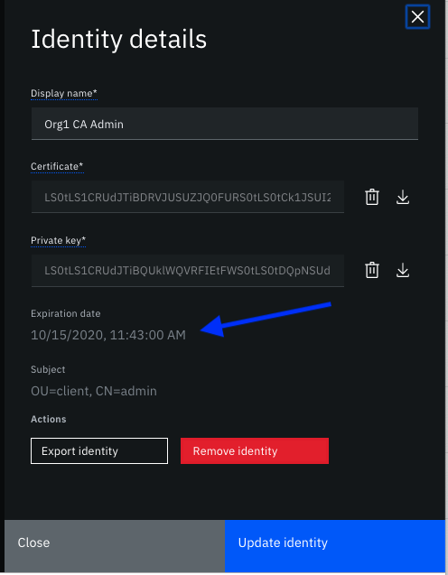
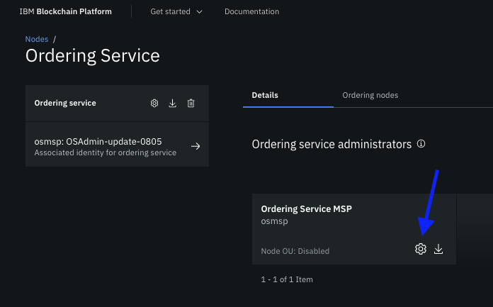

---

copyright:
  years: 2019, 2020
lastupdated: "2020-08-11"

keywords: organizations, MSPs, create an MSP, MSP JSON file, consortium, system channel, remove an organization

subcollection: blockchain

---

{:DomainName: data-hd-keyref="APPDomain"}
{:DomainName: data-hd-keyref="DomainName"}
{:android: data-hd-operatingsystem="android"}
{:apikey: data-credential-placeholder='apikey'}
{:app_key: data-hd-keyref="app_key"}
{:app_name: data-hd-keyref="app_name"}
{:app_secret: data-hd-keyref="app_secret"}
{:app_url: data-hd-keyref="app_url"}
{:authenticated-content: .authenticated-content}
{:beta: .beta}
{:c#: data-hd-programlang="c#"}
{:codeblock: .codeblock}
{:curl: .ph data-hd-programlang='curl'}
{:deprecated: .deprecated}
{:dotnet-standard: .ph data-hd-programlang='dotnet-standard'}
{:download: .download}
{:external: target="_blank" .external}
{:faq: data-hd-content-type='faq'}
{:fuzzybunny: .ph data-hd-programlang='fuzzybunny'}
{:generic: data-hd-operatingsystem="generic"}
{:generic: data-hd-programlang="generic"}
{:gif: data-image-type='gif'}
{:go: .ph data-hd-programlang='go'}
{:help: data-hd-content-type='help'}
{:hide-dashboard: .hide-dashboard}
{:hide-in-docs: .hide-in-docs}
{:important: .important}
{:ios: data-hd-operatingsystem="ios"}
{:java: #java .ph data-hd-programlang='java'}
{:java: .ph data-hd-programlang='java'}
{:java: data-hd-programlang="java"}
{:javascript: .ph data-hd-programlang='javascript'}
{:javascript: data-hd-programlang="javascript"}
{:new_window: target="_blank"}
{:note: .note}
{:objectc data-hd-programlang="objectc"}
{:org_name: data-hd-keyref="org_name"}
{:php: data-hd-programlang="php"}
{:pre: .pre}
{:preview: .preview}
{:python: .ph data-hd-programlang='python'}
{:python: data-hd-programlang="python"}
{:route: data-hd-keyref="route"}
{:row-headers: .row-headers}
{:ruby: .ph data-hd-programlang='ruby'}
{:ruby: data-hd-programlang="ruby"}
{:runtime: architecture="runtime"}
{:runtimeIcon: .runtimeIcon}
{:runtimeIconList: .runtimeIconList}
{:runtimeLink: .runtimeLink}
{:runtimeTitle: .runtimeTitle}
{:screen: .screen}
{:script: data-hd-video='script'}
{:service: architecture="service"}
{:service_instance_name: data-hd-keyref="service_instance_name"}
{:service_name: data-hd-keyref="service_name"}
{:shortdesc: .shortdesc}
{:space_name: data-hd-keyref="space_name"}
{:step: data-tutorial-type='step'}
{:subsection: outputclass="subsection"}
{:support: data-reuse='support'}
{:swift: #swift .ph data-hd-programlang='swift'}
{:swift: .ph data-hd-programlang='swift'}
{:swift: data-hd-programlang="swift"}
{:table: .aria-labeledby="caption"}
{:term: .term}
{:tip: .tip}
{:tooling-url: data-tooling-url-placeholder='tooling-url'}
{:troubleshoot: data-hd-content-type='troubleshoot'}
{:tsCauses: .tsCauses}
{:tsResolve: .tsResolve}
{:tsSymptoms: .tsSymptoms}
{:tutorial: data-hd-content-type='tutorial'}
{:unity: .ph data-hd-programlang='unity'}
{:url: data-credential-placeholder='url'}
{:user_ID: data-hd-keyref="user_ID"}
{:vb.net: .ph data-hd-programlang='vb.net'}
{:video: .video}


# Managing certificates
{: #cert-mgmt}

{{site.data.keyword.blockchainfull}} Platform is based on Hyperledger Fabric and builds permissioned blockchain networks. Participants are known as members of the network, and their activities and access to network resources are verified continuously. A participant's identity is provided in the form of a trusted x509 digital certificate. The verification is provided by an underlying public key infrastructure and sign/verify operations that secure transactions and management within the network.
{:shortdesc}

{{site.data.keyword.blockchainfull_notm}} Platform manages most of the certificate operations without users needing to handle their certificates. However, there are times when you will have to manage the certificates that allow you to communicate with the network, such as developing applications or expanding your network with a remote peer or renewing certificates before they expire. The following is a short guide to your Certificate Authority, and the underlying certificate infrastructure. This information can help you understand the certificates that you will be working with and the tasks you need to perform.

## Certificate Authorities (CAs)
{: ##cert-mgmt-network-ca}

Certificate authorities (CAs) provide identity on the network. A CA can be considered as a publicly trusted notary that acts as an anchor of trust among multiple parties. All entities in the network are given a certificate that is signed by a root CA that encapsulates their digital identity. This certificate is the root of trust for all the sign and verify operations that are performed on the network. For more details about how certificate authorities are used to establish identity, see [Hyperledger Fabric documentation](https://hyperledger-fabric.readthedocs.io/en/release-2.1/identity/identity.html){: external}.

Each organization in the network has their own CA. Your organization CA signs requests for all of the entities and components that you own, such as your admin, peers, or applications. If you want to add a peer or new application to your network, you need to register the new identity with your Certificate Authority (registration). Then, via the enrollment process, the CA generates the "enrollment certificate" that the entity needs to interact with the network.

## Certificate renewal and expiration
{: #cert-mgmt-renew-expiration}

By default, certificates that are generated by {{site.data.keyword.blockchainfull_notm}} Platform CAs expire after one year. TLS certificates, however, expire after:
- **{{site.data.keyword.blockchainfull_notm}} Platform 2.1.x:** 1 year
- **{{site.data.keyword.blockchainfull_notm}} Platform2.5+:** 10 years

The default expiration period is the same for certificates that are generated by using the Fabric SDKs, the Fabric CA client, or by using the console.

### Automatic certificate renewal
{: #cert-mgmt-auto-renewal}

The console attempts to automatically renew enrollment and TLS certificates for peers and ordering nodes. Admin certificates need to be updated manually however.

#### Enrollment and TLS certificates
{: #cert-mgmt-auto-renewal-ecerts}

Because the console automatically enrolls identities for peer or ordering nodes when the nodes are deployed, the {{site.data.keyword.blockchainfull_notm}} Platform **automatically renews the enrollment and TLS certificates** for the peer and ordering nodes. **If the certificates expire in thirty days or less, the platform automatically attempts to contact the CA and renew the certificates.** After the certificates are automatically renewed, there is no further action that needs to be taken.  

If the CA is offline, unreachable, or the renewal fails, the certificates cannot be automatically renewed. The peer or ordering node displays a warning message indicating that certificate expiration is approaching and you need to manually update the certificate. In that case, you can follow the [manual certificate renewal](#cert-mgmt-manual-renewal) process to update these certificates.

#### Admin certificates
{: #cert-mgmt-auto-renewal-admin}
Organization MSP admin certificates cannot be automatically renewed. Instead, you need to follow the [manual certificate renewal](#cert-mgmt-manual-renewal) process to update these certificates. If you have a large number of channels on your network, an [Ansible playbook](#cert-mgmt-bulk-ansible) is available to update certificates across your network in a bulk action.

#### Certificate types and actions
{: #cert-mgmt-cert-types}

When certificates expire, nodes can no longer process transactions and your applications can no longer interact with your network. Therefore, before a certificate expires, you need to enroll a new certificate for the identity, a process referred to as "certificate renewal".   

The following tables describe the types of certificates that you need to manage, how to view their expiry date, and how to maintain them. Click a tab to view the certificates for the **CA**, **peer**, or **orderer** certificates.

**Enrollment and TLS certificates:**  

|  Certificate | Description| How generated |	 Default Expiration |	How to view expiration | How to renew | What to do if expired |
|-----------------|-----------------|-----------------|-----------------|-----------------|-----------------|-----------------|
| **CA TLS certificate** | Used to trust the CA server. Contains the public key that must be shared with all members in the organization that want to transact with any node in the organization. When any client or node submits a transaction to another node, it must include this certificate as part of the transaction to prevent “man in the middle” attacks. | Generated when the CA is first started because TLS is enabled.| 1 year | **2.5.x:** <br>Console CA node **TLS Cert Expiry** field <br><br>**2.1.x:** TODO   | **2.5.x:** Automatic renewal is attempted 30 days before expiry. <br><br> **2.1.x**, or if **automatic renewal** fails: Open a support ticket.|Open a support ticket |
{: class="simple-tab-table"}
{: caption="Table 1. How to manage the CA certificates" caption-side="top"}
{: #simpletabtable1}
{: tab-title="CA"}
{: tab-group="IAM-simple"}


| Certificate |	 Description |	How generated	| Default Expiration| How to view expiration | How to renew| 	What to do if expired|
|-----|-----|-----|-----|-----|-----|-----|
| **Peer enrollment certificate (signcert)** | The signing certificate that the peer uses to sign transactions. |Generated when the peer is deployed based on the peer enroll ID and secret that is provided.| 1 year | **2.5.x: [TODO](https://github.ibm.com/ibp/operator/issues/1680)** Console peer node **Enrollment Cert Expiry** field  | **2.5.x:** Automatic renewal is attempted 30 days before expiry. <br><br> **2.1.x**, or if **automatic renewal** fails: Open a support ticket.|Open a support ticket |
|**Peer TLS certificate (signcert)** | When TLS is enabled on a network, each node must register and enroll with the TLS CA. This is the TLS certificate for the peer from that process and is required for the peer to start.| Generated when the peer is deployed.| **2.5.x:** 10 years[^how-to-view1]<br><br>**2.1.x:** 1 year | **2.5.x:** Console peer node **TLS Cert Expiry** field <br><br>**2.1.x** or if **automatic renewal** fails. | **2.5.x:** Automatic renewal is attempted 30 days before expiry. <br><br> **2.1.x**, or if **automatic renewal** fails: Open a support ticket.|Open a support ticket |
|**Peer operations certificate** | Required to view [operation metrics](/docs/blockchain?topic=blockchain-operations_service) for the peer.| Generated when the peer is deployed.| **2.5.x:** 10 years[^how-to-view2]<br><br>**2.1.x:** 1 year| **2.5.x:** Console peer node **TLS Cert Expiry** field <br><br>**2.1.x** or if **automatic renewal** fails. | **2.5.x:** Automatic renewal is attempted 30 days before expiry. <br><br> **2.1.x**, or if **automatic renewal** fails: Open a support ticket.|Open a support ticket |
{: caption="Table 2. How to manage the peer certificates" caption-side="top"}
{: #simpletabtable2}
{: tab-title="Peer"}
{: tab-group="IAM-simple"}
{: class="simple-tab-table"}

| Certificate |	 Description |	How generated	| Default Expiration| How to view expiration | How to renew| 	What to do if expired|
|-----|-----|-----|-----|-----|-----|-----|
| **Orderer enrollment certificate (signcert)** | The signing certificate that the orderer uses to sign transactions. |Generated when the ordering node is deployed based on the ordering service enroll ID and secret that is provided.| 1 year | **2.5.x: [TODO](https://github.ibm.com/ibp/operator/issues/1680)** Console ordering node **Enrollment Cert Expiry** field  | **2.5.x:** Automatic renewal is attempted 30 days before expiry. <br><br> **2.1.x**, or if **automatic renewal** fails: Open a support ticket.|Open a support ticket |
|**Orderer TLS certificate (signcert)** | When TLS is enabled on a network, each node must register and enroll with the TLS CA. This is the TLS certificate for the ordering node from that process and is required for the ordering node to start.| Generated when the ordering node is deployed.| **2.5.x:** 10 years[^how-to-view3]<br><br>**2.1.x:** 1 year | **2.5.x:** Console ordering node **TLS Cert Expiry** field <br><br>**2.1.x** or if **automatic renewal** fails.  | **2.5.x:** Automatic renewal is attempted 30 days before expiry. <br><br> **2.1.x**, or if **automatic renewal** fails: Open a support ticket.|Open a support ticket |
{: caption="Table 3. How to manage the orderer certificates" caption-side="top"}
{: #simpletabtable3}
{: tab-title="Orderer"}
{: tab-group="IAM-simple"}
{: class="simple-tab-table"}

[^how-to-view1]: If a certificate expires after five years, the expiration date is not visible from the console.

[^how-to-view2]: If a certificate expires after five years, the expiration date is not visible from the console.

[^how-to-view3]: If a certificate expires after five years, the expiration date is not visible from the console.


**Admin certificates and certificates from an external CA:**  

| Certificate |	 Description |	How generated	| Default Expiration| How to view expiration	| How to renew|  Update MSP | Update node admin | Update channel |	What to do if expired|
|-----|-----|-----|-----|-----|-----|-----|
| **Peer admin certificate** | The admin certificate that is used to administer the peer and install smart contracts on the peer. It can also be configured to manage the channel that the peer belongs to. The associated admin identity is registered with the organization CA before the node and organization MSP are created.   | Generated when you create the peer organization MSP and provide the admin identity enroll ID and secret. In addition to being part of the peer node configuration, this MSP certificate can also be included in the channel that the peer joins as a channel member or the channel administrator. | 1 year | **Wallet tab:** Click the peer admin identity tile to view the expiration date of the certificate and private key. <br><br> **Peer node:** Open peer tile and the admin cert expiration date are visible in the left column.  <br><br>**MSP tab:** Open peer organization MSP tile and the admin certificate serial number and expiry date are listed in left column.<br><br>**Channel details tab:** Open channel and click member tile to view expiration date.| [Enroll new identity](#cert-mgmt-manual-enroll)<br><br> or <br><br>[Bulk admin certificate update using Ansible](#cert-mgmt-bulk-ansible) |   No action is required when Node OU is enabled for the MSP.<br><br> Otherwise, [Append the admin certificate to the MSP definition](#cert-mgmt-manual-update-msp).| No action is required when Node OU is enabled for the MSP.<br><br> Otherwise, [Update the admin identity for the peer node](#cert-mgmt-manual-update-node-identity) <br><br> and <br><br>[Update channel member on ordering service](#cert-mgmt-manual-update-os-channel-member). | No action is required when Node OU is enabled for the MSP.<br><br> Otherwise, [Update channel](#cert-mgmt-manual-update-channel)| See [Expired admin certificates](#ibp-console-identities-expired-certs-admin).|
| **Orderer admin certificate** | The admin certificate that is used to administer the ordering service and submit or approve channel updates. The associated admin identity is registered with the organization CA before the node and organization MSP are created.   | Generated when you create the organization MSP and provide the admin identity enroll ID and secret. In addition to being part of the ordering service configuration, this MSP certificate can also be included in the ordering service channels. | 1 year | **Wallet tab:** Click the ordering service admin identity tile to view the expiration date of the certificate and private key. <br><br> **Ordering node:** Open the ordering service and then the ordering node tile to view the admin cert expiration date that is visible in the left column.  <br><br>**MSP tab:** Open the ordering service organization MSP tile and the admin certificate serial number and expiry date are listed in left column.| [Enroll new identity](#cert-mgmt-manual-enroll)<br><br> or <br><br>[Bulk admin certificate update using Ansible](#cert-mgmt-bulk-ansible) |   No action is required when Node OU is enabled for the MSP.<br><br> Otherwise, [Append the admin certificate to the MSP definition](#cert-mgmt-manual-update-msp).| No action is required when Node OU is enabled for the MSP.<br><br> Otherwise, [Update ordering service admin](#cert-mgmt-manual-update-os-admin) <br><br>and<br><br> [Update the admin identity for the ordering service](#cert-mgmt-manual-update-node-identity). | No action is required when Node OU is enabled for the MSP.<br><br> Otherwise, [Update channel](#cert-mgmt-manual-update-channel).| See [Expired admin certificates](#ibp-console-identities-expired-certs-admin). |
{: caption="Table 4. How to manage the admin certificates" caption-side="top"}
{: #simpletabtable4}
{: tab-title="Admin certificates"}
{: tab-group="IAM-simple2"}
{: class="simple-tab-table"}

| Certificate |	 Description |	How generated	| Default Expiration| How to view expiration| How to renew|  Update MSP | Update node admin | Update channel |	What to do if expired|
|-----|-----|-----|-----|-----|-----|-----|
| Node or MSP Admin certificates from an external CA | Some customers prefer to use admin certificates generated by their own third-party CA.  | These certificates are generated externally and then [manually added](/docs/blockchain?topic=blockchain-ibp-console-organizations#console-organizations-build-msp) to an MSP JSON file.  | Depends on certificate provider |  | Request new certs from the third-party provider in an out of band operation. |  [Append the admin certificate to the MSP definition](#cert-mgmt-manual-update-msp)| No action is required when Node OU is enabled for the MSP.<br><br> Otherwise, [Update the admin identity for the node](#cert-mgmt-manual-update-node). <br><br> If this is a peer organization MSP admin, [Update channel member on ordering service](#cert-mgmt-manual-update-os-channel-member). <br><br> If this an ordering organization MSP, [Update ordering service admin](#cert-mgmt-manual-update-os-admin). | No action is required when Node OU is enabled for the MSP.<br><br> Otherwise, [Update channel](#cert-mgmt-manual-update-channel). | | |
{: caption="Table 5. How to manage certificates from an external CA" caption-side="top"}
{: #simpletabtable5}
{: tab-title="External certificates"}
{: tab-group="IAM-simple2"}
{: class="simple-tab-table"}


### Manual certificate renewal
{: #cert-mgmt-manual-renewal}

While the platform automatically renews the certificates for peer and ordering nodes if the associated CA is available, customers are responsible for managing certificate expiration and renewal of the following certificates:

- MSP admin certificates
- All certificates generated by enrolling with the CA, for example client application certificates
- Orderer TLS certificates


If the admin certificates have been stored or imported into the console wallet, you can monitor the exact date of expiry for each identity. Click an admin identity tile to view the expiration date of the certificate and private key.

{: caption="Figure 1. Admin identity certificate expiration" caption-side="bottom"}

#### Step one: Enroll new identity
{: #cert-mgmt-manual-enroll}

Before a certificate expires, you must enroll a new certificate for the identity by using the associated CA to generate a new certificate and public key. If the certificates were generated with the console, you can use the following instructions:
1. Open the CA tile.
2. Locate the enroll ID for the identity in the table and click **Enroll identity** from the action menu.
3. Provide the enroll ID and secret that was specified when the identity was initially created.
4. Because the certificate and private key are never stored by the console, you must download them and store them securely.
5. It is also recommended that you add the new identity to your console wallet. Because wallet identities cannot be replaced, you need to either delete the existing wallet identity or give this one a different name.

If the certificates were generated from the Fabric CA client or Fabric SDKs, then they need to be renewed where they were generated. You can then use the updated certificates when you follow instructions in subsequent steps.  

If reach the enrollment limit for a user, simply use the console to register and enroll a new user and then use the generated certificates in subsequent steps.
{: tip}

#### Step two: Update organization MSP
{: #cert-mgmt-manual-update-msp}

If this is an MSP **admin** identity, and the associated MSP was created with the `Node OU` configuration enabled, the admin role is inserted directly into the generated admin certificate, and therefore the MSP does not need to be updated. You can skip this step.

To find out whether the MSP was created with Node OU enabled, open the MSP in the Organizations tab and examine the setting of the **Node OU** field.
  {: caption="Figure 2. How to determine the Node OU configuration for MSP" caption-side="bottom"}

If this is an MSP **admin** identity, and the associated MSP was **not** created with the `Node OU` configuration enabled, then you need to perform the following additional steps:

1. Open the **Nodes** tab in your console.
2. Locate the node tile that requires the admin certificate update. The MSP name is listed on the tile under the node name. Make a note of the MSP name.
3. Open the **Organizations** tab.
4. Locate the MSP tile for the organization MSP from step two and click the **Export** icon.
5. Open the downloaded MSP JSON file in a text editor.
6. Edit the `admins` element by appending the new base64-encoded certificate string that you generated in the previous section to the end of the list of comma-separated admin certificates. If the identity was created by using the console, you can open the identity JSON file that you exported and copy the string from the `cert` field.
7. Save your changes.
8. In the **Organizations** tab, open the MSP tile for the peer and click the **Settings** icon.
9. In the side panel, click **Add file** and select the updated MSP JSON file.
10. Click **Update MSP definition**.
11. Reexport this updated MSP and share the file with all of the members of the network who need to import it into their console.

To verify that the update worked, open the MSP tile and view the updated expiration date.

#### Step three: Update ordering service admin
{: #cert-mgmt-manual-update-os-admin}

If this MSP is for the ordering service admin, you need to update the ordering service.  

From the **Nodes** tab, open the ordering service tile. Under **Ordering service administrators** click the **Settings icon** on the Ordering service organization MSP tile. Browse to the new identity or click **Upload JSON** to add the new MSP JSON file from [step two](#cert-mgmt-manual-update-msp).

{: caption="Figure 2. Ordering service admin MSP update" caption-side="bottom"}

#### Step four: Update node admin identity
{: #cert-mgmt-manual-update-node-identity}

If this is an admin certificate for a peer or ordering node, you need to update the node admin identity. Open the associated peer or ordering service and click the **Associate identity for peer** or **Associate identity for ordering service** and browse to the newly created identity from the wallet.

#### Step five: Update channel member on ordering service
{: #cert-mgmt-manual-update-os-channel-member}

If this MSP is a member of an ordering service consortium, you need to update the ordering service.

From the **Nodes** tab, open the ordering service tile. Delete the existing consortium member, that contains the original MSP definition, and then readd the consortium with the new admin certificate by clicking **Add organization**. Browse to the new MSP JSON file from [step two](#cert-mgmt-manual-update-msp).

#### Step six: Update channel  
{: #cert-mgmt-manual-update-channel}

As with all channel updates, this update needs to be performed by a channel operator and the change will follow the channel update approval process according to the policy that was configured when the channel was created.

If the organization MSP was not created with the Node OU configuration enabled, you also need to update the associated channels that include the organization definition with the new public admin certificate. When the `Node OU` configuration is enabled, the admin role is inserted directly into the generated certificate and the channel MSP does not need to be updated. When the `Node OU` configuration is not enabled on the MSP, perform the following steps:

1. Open the channel to be updated in the console.
2. Click **Channel details** and scroll down to **Channel members**.
3. Click the channel member that you want to update.
4. Click **Add file**, browse to the updated MSP JSON file, and click **Update MSP definition**.

You can verify that this process is successful by opening the channel member tile again and viewing the updated expiration date.

### Bulk admin certificate renewal using Ansible
{: #cert-mgmt-bulk-ansible}

WIP

### Expired certificates
{: #ibp-console-identities-expired-certs}

When certificates expire, it is likely that peer, orderer, and channel operations will fail but it is still possible to update the certificates. The process to address them depends on whether they are MSP admin certificates or enrollment certificates.

#### Admin certificates
{: #ibp-console-identities-expired-certs-admin}

If the peer or orderer **admin** certificates have expired, you need to generate certificates for a new admin identity. Register and enroll a new peer or orderer admin identity with the same CA that the existing peer or orderer admin was registered with.

1. Open the peer or orderer organization CA.
2. Click **Register user** and specify a new enroll ID and secret.
3. Select a **Type** of `admin`.
4. Configure the rest of the settings as you did for the original admin identity and click **Register user**.
5. Right-click the action menu for the new user and select **Enroll identity**.
6. Ensure the **Root Certificate Authority** is selected and provide the enroll ID and secret that you specified when you register the new user.
7. Specify a unique display name for this new identity and export the identity to your wallet.
8. Using this exported certificate, follow the manual update steps [2](#cert-mgmt-manual-update-msp) - [6](#cert-mgmt-manual-update-channel) to update the admin certificates in the MSP, orderer, and channel.

##### Override orderer configuration to allow expired certs for channel updates
{: #ibp-console-identities-expired-certs-orderer-override}

TBD  
If the orderer admin certificate has expired and the channel configuration needs to be updated, you need to override the ordering service configuration to temporarily allow expired certificates in order to update the channel.

#### Enrollment or TLS certificates
{: #ibp-console-identities-expired-certs-ecerts}

If peer or orderer **enrollment** or **TLS** certificates have expired,
you need to [contact IBM Support](/docs/blockchain?topic=blockchain-blockchain-support#blockchain-support-cases) for assistance with updating your certificates.

## Using the command line to view certificate expiration
{: #ibp-console-identities-cli-expiration}

You can also use the command line to check your certificates expiration date. If your certificate was not generated by the console, for example it was generated by using the Fabric CA client or Fabric SDKs, you need to convert certificates that are in `base64` format into PEM format by running the following command on your local machine:

```
export FLAG=$(if [ "$(uname -s)" == "Linux" ]; then echo "-w 0"; else echo "-b 0"; fi)
echo <base64_string> | base64 --decode $FLAG > <key>.pem
```
{:codeblock}

Run the following command to display the PEM encoded certificate in a human-readable form:
```
openssl x509 -in <certificate .pem file> -text
```
{:codeblock}

The certificate looks similar to the following example:

```
Certificate:
Data:
    Version: 3 (0x2)
    Serial Number:
        20:3d:3e:c5:31:4f:85:7a:30:9f:b5:67:47:3d:b0:10:70:80:f6:18
Signature Algorithm: ecdsa-with-SHA256
    Issuer: C=US, ST=North Carolina, O=Hyperledger, OU=Fabric, CN=fabric-ca-server-org1CA
    Validity
        Not Before: Nov 28 19:18:00 2018 GMT
        Not After : Nov 28 19:23:00 2019 GMT
    Subject: C=US, ST=North Carolina, O=Hyperledger, OU=peer, OU=org1, CN=1peeradmin
    ...
    ...
```

You can find the expiration date in the **Validity** section and follows `Not After:`. In this example, the certificate expires on November 28, 2019.


</staging>

