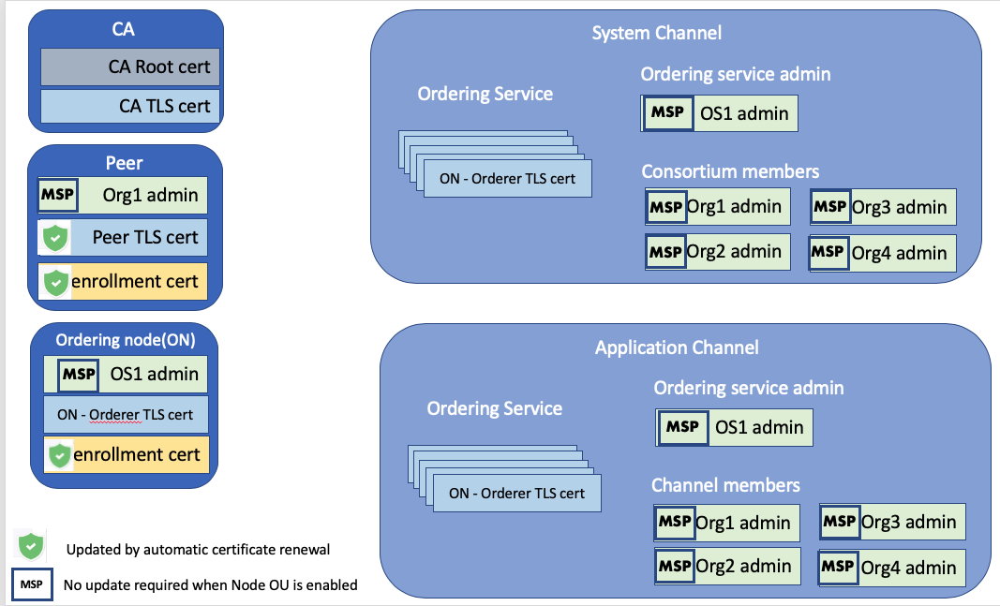
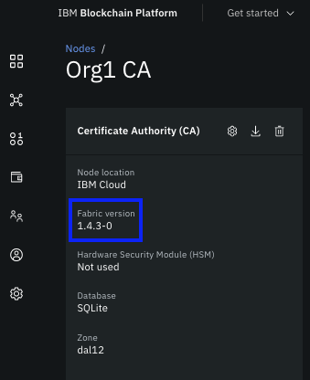
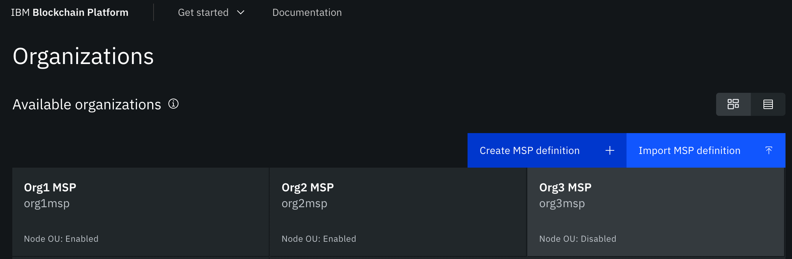
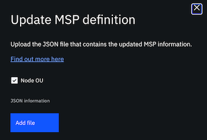
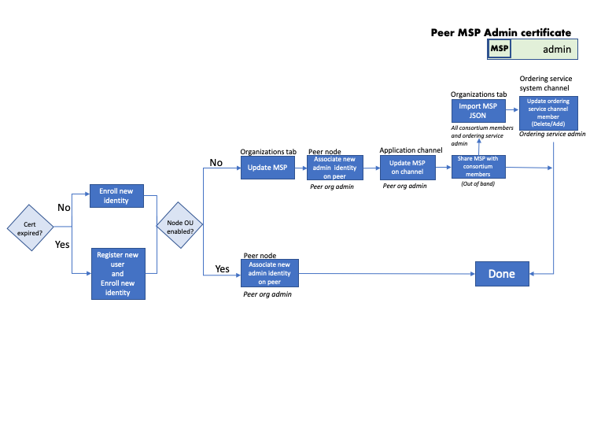
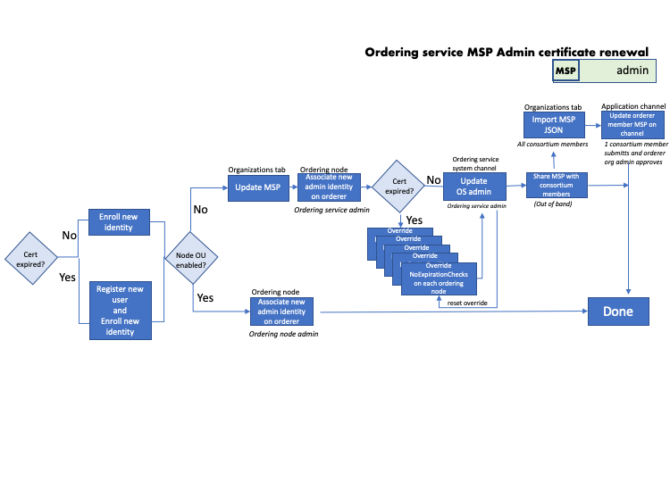
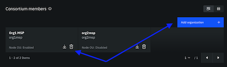
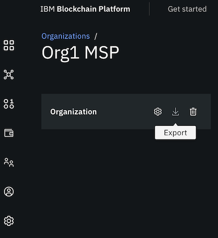

---

copyright:
  years: 2019, 2020
lastupdated: "2020-09-30"

keywords: admin certificate, Node OU, admin identity, expiration

subcollection: blockchain

---

{:DomainName: data-hd-keyref="APPDomain"}
{:DomainName: data-hd-keyref="DomainName"}
{:android: data-hd-operatingsystem="android"}
{:apikey: data-credential-placeholder='apikey'}
{:app_key: data-hd-keyref="app_key"}
{:app_name: data-hd-keyref="app_name"}
{:app_secret: data-hd-keyref="app_secret"}
{:app_url: data-hd-keyref="app_url"}
{:authenticated-content: .authenticated-content}
{:beta: .beta}
{:c#: data-hd-programlang="c#"}
{:codeblock: .codeblock}
{:curl: .ph data-hd-programlang='curl'}
{:deprecated: .deprecated}
{:dotnet-standard: .ph data-hd-programlang='dotnet-standard'}
{:download: .download}
{:external: target="_blank" .external}
{:faq: data-hd-content-type='faq'}
{:fuzzybunny: .ph data-hd-programlang='fuzzybunny'}
{:generic: data-hd-operatingsystem="generic"}
{:generic: data-hd-programlang="generic"}
{:gif: data-image-type='gif'}
{:go: .ph data-hd-programlang='go'}
{:help: data-hd-content-type='help'}
{:hide-dashboard: .hide-dashboard}
{:hide-in-docs: .hide-in-docs}
{:important: .important}
{:ios: data-hd-operatingsystem="ios"}
{:java: #java .ph data-hd-programlang='java'}
{:java: .ph data-hd-programlang='java'}
{:java: data-hd-programlang="java"}
{:javascript: .ph data-hd-programlang='javascript'}
{:javascript: data-hd-programlang="javascript"}
{:new_window: target="_blank"}
{:note: .note}
{:objectc data-hd-programlang="objectc"}
{:org_name: data-hd-keyref="org_name"}
{:php: data-hd-programlang="php"}
{:pre: .pre}
{:preview: .preview}
{:python: .ph data-hd-programlang='python'}
{:python: data-hd-programlang="python"}
{:route: data-hd-keyref="route"}
{:row-headers: .row-headers}
{:ruby: .ph data-hd-programlang='ruby'}
{:ruby: data-hd-programlang="ruby"}
{:runtime: architecture="runtime"}
{:runtimeIcon: .runtimeIcon}
{:runtimeIconList: .runtimeIconList}
{:runtimeLink: .runtimeLink}
{:runtimeTitle: .runtimeTitle}
{:screen: .screen}
{:script: data-hd-video='script'}
{:service: architecture="service"}
{:service_instance_name: data-hd-keyref="service_instance_name"}
{:service_name: data-hd-keyref="service_name"}
{:shortdesc: .shortdesc}
{:space_name: data-hd-keyref="space_name"}
{:step: data-tutorial-type='step'}
{:subsection: outputclass="subsection"}
{:support: data-reuse='support'}
{:swift: #swift .ph data-hd-programlang='swift'}
{:swift: .ph data-hd-programlang='swift'}
{:swift: data-hd-programlang="swift"}
{:table: .aria-labeledby="caption"}
{:term: .term}
{:tip: .tip}
{:tooling-url: data-tooling-url-placeholder='tooling-url'}
{:troubleshoot: data-hd-content-type='troubleshoot'}
{:tsCauses: .tsCauses}
{:tsResolve: .tsResolve}
{:tsSymptoms: .tsSymptoms}
{:tutorial: data-hd-content-type='tutorial'}
{:unity: .ph data-hd-programlang='unity'}
{:url: data-credential-placeholder='url'}
{:user_ID: data-hd-keyref="user_ID"}
{:vb.net: .ph data-hd-programlang='vb.net'}
{:video: .video}


# Managing certificates
{: #cert-mgmt}

{{site.data.keyword.blockchainfull}} Platform is based on Hyperledger Fabric and builds permissioned blockchain networks. Participants are known as members of the network, and their activities and access to network resources are verified continuously. Learn how to manage a member's identity in the form of a trusted x509 digital certificate.
{:shortdesc}

**Target audience:** This advanced topic is designed for system administrators or operators who are responsible for registering users, enrolling identities, and administering ordering services or channels. You should be familiar with Membership Service Providers (MSPs) and how they are created.

{{site.data.keyword.blockchainfull_notm}} Platform manages most of the certificate operations without users needing to handle their certificates. However, there are times when you need to manage the certificates that allow you to communicate with the network, such as developing applications or renewing certificates before they expire. This topic is a short guide to your Certificate Authority, and the underlying certificate infrastructure. This information can help you understand the certificates that you will be working with and the tasks you are responsible for.

## Certificate Authorities (CAs)
{: #cert-mgmt-network-ca}

Certificate authorities (CAs) provide identity on the network. A CA can be considered as a publicly trusted notary that acts as an anchor of trust among multiple parties. All entities in the network are given a certificate that is signed by a root CA that encapsulates their digital identity. This certificate is the root of trust for all of the sign and verify operations that are performed on the network. For more details about how certificate authorities are used to establish identity, see [Hyperledger Fabric documentation](https://hyperledger-fabric.readthedocs.io/en/release-2.1/identity/identity.html){: external}.

Each organization in the network has their own CA. Your organization CA signs requests for all of the entities and components that you own, such as your admin, peers, or applications. If you want to add a node or new application to your network, you need to register the new user with your Certificate Authority (registration). Then, via the enrollment process, the CA generates a public and private key pair.  The "enrollment certificate", also known as the signed certificate or public key, is shared with the network.

## Overview
{: #cert-mgmt-overview}

The following diagram shows all of the certificates that need to be managed and where they reside on your network.

{: caption="Figure 1. Certificate overview diagram" caption-side="bottom"}

The left column includes the certificates for the blockchain CA, peer, and ordering nodes. There are two certificates that are included on the CA node, the CA root certificate and the CA TLS cert. The root certificate is included here for completeness, but because it expires in 15 years, update instructions are not provided. The peer and ordering nodes are similar in that they both contain an **enrollment certificate** (the public key or signed certificate), their **TLS certificate** that enables them to transact with other nodes in their organization, and their **MSP admin certificate**, which represents the admin identity that is allowed to administer the node.  

The {{site.data.keyword.blockchainfull_notm}} Platform  can automatically renew the enrollment certs for the peer and ordering nodes and the TLS certificate for the peer. But the MSP admin identities have to be manually renewed. If the MSP is enabled for Node Organizational Units (Node OUs), no further action is required. More information about Node OU support and how to determine whether the MSP is enabled for it is provided in this topic.

The right column shows the certificates that are relevant to the system channel and the application channel. When the MSP is not enabled for Node OU support, additional steps are required to update these certificates on the system and application channels and are provided here.

## Node OU support
{: #cert-mgmt-nodeou}

When you register a user with the CA, you need to select a user **Type** of `client`, `peer`, `orderer`, or `admin`, that is used to confer a "role" onto the identity. Roles are referred to as **Organizational Units (OU)** inside a certificate and MSPs can be configured to recognize these roles. The `admin` and `orderer` types were added to the {{site.data.keyword.blockchainfull_notm}} Platform when Fabric v1.4.3 was included and contains support for **Node OUs** in MSPs and channels.

This new capability means that when the MSP admin identity is enrolled during MSP creation, the generated signed certificate includes the admin type as an OU inside the certificate. This admin designation means that the signed cert of the identity does not need to be included in the MSP defining the organization. You can learn more about the benefits of Node OUs in the Fabric documentation on the [Membership Service Provider](https://hyperledger-fabric.readthedocs.io/en/release-1.4/membership/membership.html#node-ou-roles-and-msps){: external}.  

Because this functionality was not yet available when the {{site.data.keyword.blockchainfull_notm}} Platform service was initially offered, all MSP admin identities that were enrolled before Node OU support was added to the platform in December 2019, do not contain the `admin` OU in their signed certificate. Instead, when the MSP was created, the signed cert, or certificate, for the MSP admin was placed in the `admins` section. The platform supports both patterns, but if the Node OU configuration was not enabled when the organization MSP was created, additional steps are required after certificate renewal to update the MSP and any channels that the MSP is part of. Therefore, if your MSPs currently are not configured with Node OU support, it is recommended that you add Node OU support now, to avoid the extra updates steps that are required in one year when the certificates expire again.

If your certificates have already expired, you are not able to complete these steps, but should come back and do this after you renew the certificates.
{: note}

**Pre-requisite:** Before you can take advantage of Node OU support, ensure that your CAs are at Fabric v1.4.3 or higher. Open the CA tile to view the Fabric version. If the CA is not at v1.4.3 or higher, you should [upgrade](/docs/blockchain?topic=blockchain-ibp-console-manage-console#ibp-console-manage-patch) it now.

  {: caption="Figure 2. View CA Fabric version" caption-side="bottom"}

Enabling Node OU support for an MSP definition is a two-part process. First, you have to update the MSP definition itself, then you have to update the same MSP definition on the channel.

**Part one: Enable Node OU support for an MSP definition:**  

1. Open the **Organizations** tab to view the Node OU status for each MSP:
  {: caption="Figure 3. View Node OU status on MSP tile" caption-side="bottom"}
2. Click the **Settings** icon for the MSP.  The checkbox to add Node OU is selected by default. You do not have to add a new JSON file, you can simply click **Update MSP definition** to enable Node OU support for the MSP.  
  {: caption="Figure 4. Node OU checkbox" caption-side="bottom"}


**Part two: Enable Node OU support for the MSP on a channel:**  

1. Open the **Channels** tab, select the channel that you want to update and click **Channel details**.
3. Scroll down and click the channel member MSP definition that you just enabled Node OU support for.  The checkbox to enable Node OU support is selected by default.
3. Select the existing MSP definition and the associated identity and click **Update MSP definition**.

Because you likely still have admin certificates in the MSP that will expire, you still need to follow the manual steps in this topic to update them. But after you complete that process, you do not have to follow the manual steps again next year after the certificates expire, since you have now enabled the Node OU support on the MSP.
{: important}

## Certificate renewal and expiration
{: #cert-mgmt-renew-expiration}

By default, most certificates that are generated by {{site.data.keyword.blockchainfull_notm}} Platform CAs expire after one year. However, the CA root certificate, CA TLS certificate, and the ordering node TLS certificates have longer periods before expiration. The default expiration period is the same for certificates that are generated by using the Fabric SDKs, the Fabric CA client, or by using the console. The expiration date for all certificates that expire within five years is visible in the console, and how to view the actual date is described later in this topic.

### Automatic certificate renewal
{: #cert-mgmt-auto-renewal}

#### Enrollment and TLS certificates
{: #cert-mgmt-auto-renewal-ecerts}

Because the console automatically enrolls identities for peer or ordering nodes when the nodes are deployed, the {{site.data.keyword.blockchainfull_notm}} Platform **automatically renews the enrollment (signing) certificates for the peer and ordering nodes and the peer TLS certificate**.  If the certificates expire within 30 days, the platform automatically attempts to contact the CA and renew the certificates. After these certificates are automatically renewed, there is no further action that needs to be taken.

If the CA is offline, unreachable, or the CA TLS certificate has expired, the certificates cannot be automatically renewed. The peer or ordering node displays a warning message indicating that certificate expiration is approaching or has occurred and you need to open a support ticket to renew the certificate.

#### Admin certificates
{: #cert-mgmt-auto-renewal-admin}

Organization MSP admin certificates cannot be automatically renewed. Instead, you need to follow the manual certificate renewal process, included in this topic, to update these certificates. If you have a large number of channels on your network, Ansible playbooks, also described later in this topic, are available to update admin certificates that have not yet expired across the channels on your network in a bulk action.

### Certificate types and actions
{: #cert-mgmt-cert-types}

When certificates expire, nodes can no longer process transactions and your applications can no longer interact with your network. Therefore, before a certificate expires, you need to **enroll the identity again to generate a new certificate**, a process referred to as "certificate renewal".   

The following tables describe the types of certificates that you need to manage, how to view their expiration date, and how to maintain them.

**CA TLS certificate:** 

|  Certificate | Description| How generated |	 Default expiration |	How to view expiration | How to renew | Impact if expires | What to do if expired |
|-----------------|-----------------|-----------------|-----------------|-----------------|-----------------|-----------------|
| **CA TLS certificate** | Used to trust the CA server. Contains the public key that must be shared with all members in the organization that want to transact with any node in the organization. When any client or node submits a transaction to another node, it must include this certificate as part of the transaction to prevent “man in the middle” attacks. | Generated when the CA is first started because TLS is enabled.| 1 year | If it expires within five years, the expiration date is visible from the console. Open CA node and view **TLS Cert Expiration** field[^how-to-view2]   | Open a support ticket.| Transactions continue.<br><br>- Cannot register or enroll new identities, but transaction traffic does not stop.<br><br>- Automatic certificate renewal fails.<br><br>- Cannot renew other certificates without fixing CA TLS certificate first. |Open a support ticket. |
{: caption="Table 1. How to manage the CA certificates" caption-side="top"}

[^how-to-view2]: If a certificate expires in more than five years, the expiration date is not visible from the console.

**Peer certificates:**  

| Certificate |	 Description |	How generated	| Default expiration| How to view expiration | How to renew| 	What to do if expired|
|-----|-----|-----|-----|-----|-----|-----|
| **Peer enrollment certificate (signcert)** | The public key that is used to verify that the signatures that nodes attach to communications were generated by the node's private key.| Generated when the peer is deployed based on the peer enroll ID and secret that is provided.| 1 year | Open console peer node and view **Enrollment Cert Expiration** field.  |  [Automatic renewal](#cert-mgmt-auto-renewal) is attempted 30 days before expiration. <br><br> If **automatic renewal** fails, open a support ticket. | [Deploy a new peer](#ibp-console-identities-expired-certs-ecerts) if possible, otherwise, open a support ticket. |
|**Peer TLS certificate (signcert)** | When TLS is enabled on a network, each node must register a user and enroll an identity with the TLS CA. This is the TLS certificate for the peer from that process and is required for the peer to start.| Generated when the peer is deployed.| **2.5.x:** 15 years[^how-to-view1]<br><br>**2.1.x:** 1 year | Open console peer node and view **TLS Cert Expiration** field.  | [Automatic renewal](#cert-mgmt-auto-renewal) is attempted 30 days before expiration. <br><br> If **automatic renewal** fails, open a support ticket.|[Deploy a new peer](#ibp-console-identities-expired-certs-ecerts) if possible, otherwise, open a support ticket. |
{: caption="Table 2. How to manage the peer certificates" caption-side="top"}

[^how-to-view1]: If a certificate expires in more than five years, the expiration date is not visible from the console.

**Orderer certificates:**  

| Certificate |	 Description |	How generated	| Default expiration| How to view expiration | How to renew| 	What to do if expired|
|-----|-----|-----|-----|-----|-----|-----|
| **Orderer enrollment certificate (signcert)** | The public key that the orderer uses to sign transactions. | Generated when the ordering node is deployed based on the ordering service enroll ID and secret that is provided.| 1 year | Open console ordering node and view **Enrollment Cert Expiration** field. | [Automatic renewal](#cert-mgmt-auto-renewal) is attempted 30 days before expiration. <br><br> If **automatic renewal** fails: Open a support ticket.| [Open a support ticket](#ibp-console-identities-expired-certs-ecerts-orderer) |
|**Orderer TLS certificate (signcert)** | When TLS is enabled on a network, each node must register a user and enroll an identity with the TLS CA. This is the TLS certificate for the ordering node from that process and is required for the ordering node to start.| Generated when the ordering node is deployed.| **2.5.x:** 15 years[^how-to-view3]<br><br>**2.1.x:** 1 year | Open console ordering node and view **TLS Cert Expiration** field. | Open a support ticket | [Open a support ticket](#ibp-console-identities-expired-certs-ecerts-orderer) |
{: caption="Table 3. How to manage the orderer certificates" caption-side="top"}
[^how-to-view3]: If a certificate expires in more than five years, the expiration date is not visible from the console.

**Peer admin certificate:**  

The following diagram summarizes the process for updating peer admin certificates on your network. Click a box to view the instructions.



<map name="home_map" id="home_map">
<area href="/docs/blockchain?topic=blockchain-cert-mgmt#cert-mgmt-manual-enroll" alt="Enroll a new identity" title="Enroll a new identity" shape="rect" coords="114, 232, 185, 268" />
<area href="/docs/blockchain?topic=blockchain-cert-mgmt#ibp-console-identities-expired-certs-admin" alt="Register a new user" title="Register a new user and enroll a new identity" shape="rect" coords="114, 314, 189, 383" />
<area href="/docs/blockchain?topic=blockchain-cert-mgmt#cert-mgmt-manual-update-msp" alt="Update MSP" title="Update MSP" shape="rect" coords="302, 183, 380, 232" />
<area href="/docs/blockchain?topic=blockchain-cert-mgmt#cert-mgmt-manual-update-node-identity" alt="Associate admin identity" title="Associate admin identity" shape="rect" coords="388, 183, 464, 240" />
<area href="/docs/blockchain?topic=blockchain-cert-mgmt#cert-mgmt-manual-update-node-identity" alt="Associate admin identity" title="Associate admin identity" shape="rect" coords="304, 317, 383, 367" />
<area href="/docs/blockchain?topic=blockchain-cert-mgmt#cert-mgmt-manual-update-channel-peer" alt="Update MSP on application channel" title="Update MSP on application channel" shape="rect" coords="481, 182, 555, 243" />
<area href="/docs/blockchain?topic=blockchain-cert-mgmt#cert-mgmt-export-msp" alt="Share MSP with consortium members" title="Share MSP with consortium members" shape="rect" coords="572, 197, 645, 241" />
<area href="/docs/blockchain?topic=blockchain-cert-mgmt#cert-mgmt-import-msp" alt="Import MSP JSON" title="Import MSP JSON" shape="rect" coords="566, 112, 644, 162" />
<area href="/docs/blockchain?topic=blockchain-cert-mgmt#cert-mgmt-manual-update-os-channel-member" alt="Update ordering service channel member" title="Update ordering service channel member" shape="rect" coords="658, 91, 752, 177" /></map>


| Certificate |	 Description |	How generated	| Default Expiration| How to view expiration	| How to renew|  Update MSP | Update node admin | Update channel |	Share with network | What to do if expired|
|-----|-----|-----|-----|-----|-----|-----|
| **Peer organization admin certificate** | The admin certificate that is used to administer the peer and install smart contracts on the peer. It can also be configured to manage the application channel that the peer belongs to. The associated admin user is registered with the organization CA before the peer and organization MSP are created.   | Generated when you create the peer organization MSP and provide the admin identity enroll ID and secret. In addition to being part of the peer node configuration, this MSP certificate can also be included in the channel that the peer joins as a channel member or channel administrator. | 1 year | **Wallet tab:** Click the peer organization admin identity tile to view the expiration date of the certificate and private key. <br><br> **Peer node:** If Node OU support is not enabled for the peer MSP, open peer tile and view the **Admin Cert Expiration** in the left column.  <br><br>**MSP tab:** Open peer organization MSP tile, the admin certificate expiration date is listed in left column.<br><br>**Channel details tab:** Open channel and click member tile to view expiration date.| [Enroll new identity](#cert-mgmt-manual-enroll)  |   No action is required when Node OU is enabled for the MSP.<br><br> Otherwise, [Append the admin certificate to the MSP definition](#cert-mgmt-manual-update-msp).| No action is required when Node OU is enabled for the MSP.<br><br> Otherwise, [Associate new admin identity on peer](#cert-mgmt-manual-update-node-identity). | No action is required when Node OU is enabled for the MSP.<br><br> Otherwise, [Update channel](#cert-mgmt-manual-update-channel-peer) <br> <br>or <br><br>[Bulk admin certificate update with Ansible playbooks](#cert-mgmt-bulk-ansible)| All consortium members and ordering service admin need to import the updated MSP into their Organizations tab. <br><br> Ordering service admin needs to [Update ordering service channel member](#cert-mgmt-manual-update-os-channel-member). | See [Expired certificates](#ibp-console-identities-expired-certs).|
{: caption="Table 4. How to manage the peer organization admin certificate" caption-side="top"}


**Ordering service MSP admin certificate:**

The following diagram summarizes the process for updating orderer organization admin certificates on your network. Click a box to view the instructions.



<map name="home_map2" id="home_map2">
<area href="/docs/blockchain?topic=blockchain-cert-mgmt#cert-mgmt-manual-enroll" alt="Enroll a new identity" title="Enroll a new identity" shape="rect" coords="98, 234, 170, 265" />
<area href="/docs/blockchain?topic=blockchain-cert-mgmt#ibp-console-identities-expired-certs-admin" alt="Register a new user" title="Register a new user and enroll a new identity" shape="rect" coords="100, 314, 172, 383" />
<area href="/docs/blockchain?topic=blockchain-cert-mgmt#cert-mgmt-manual-update-msp" alt="Update MSP" title="Update MSP" shape="rect" coords="250, 181, 325, 232" />
<area href="/docs/blockchain?topic=blockchain-cert-mgmt#cert-mgmt-manual-update-node-identity" alt="Associate admin identity" title="Associate admin identity" shape="rect" coords="332, 180, 410, 243" />
<area href="/docs/blockchain?topic=blockchain-cert-mgmt#cert-mgmt-manual-update-node-identity" alt="Associate admin identity" title="Associate admin identity" shape="rect" coords="275, 323, 357, 381" />
<area href="/docs/blockchain?topic=blockchain-cert-mgmt#cert-mgmt-manual-update-os-admin" alt="Update OS admin on system channel" title="Update OS admin on system channel" shape="rect" coords="495, 172, 573, 237" />
<area href="/docs/blockchain?topic=blockchain-cert-mgmt#cert-mgmt-export-msp" alt="Share MSP with consortium members" title="Share MSP with consortium members" shape="rect" coords="587, 182, 662, 240" />
<area href="/docs/blockchain?topic=blockchain-cert-mgmt#cert-mgmt-import-msp" alt="Import MSP JSON" title="Import MSP JSON" shape="rect" coords="581, 112, 658, 160" />
<area href="/docs/blockchain?topic=blockchain-cert-mgmt#cert-mgmt-manual-update-channel" alt="Update orderer member MSP on channel" title="Update orderer member MSP on channel" shape="rect" coords="669, 112, 754, 182" />
<area href="/docs/blockchain?topic=blockchain-cert-mgmt#ibp-console-identities-expired-certs-orderer-override" alt="Override NoExpirationChecks on each ordering node" title="Override NoExpirationChecks on each ordering node" shape="rect" coords="405, 255, 534, 338" /></map>

| Certificate |	 Description |	How generated	| Default expiration| How to view expiration	| How to renew|  Update MSP | Update node admin | Update system channel |	Share with network | What to do if expired|
|-----|-----|-----|-----|-----|-----|-----|
| **Ordering service organization admin certificate** | The admin certificate that is used to administer the ordering service and submit or approve channel updates. The associated admin identity is enrolled with the organization CA before the node and organization MSP are created.   | Generated when you create the organization MSP and provide the admin identity enroll ID and secret. In addition to being part of the ordering service configuration, this MSP certificate can also be included in the ordering service channels. | 1 year | **Wallet tab:** Click the ordering service admin identity tile to view the expiration date of the certificate and private key. <br><br>**MSP tab:** Open the ordering service organization MSP tile and the admin certificate expiration date is listed in left column.| [Enroll new identity](#cert-mgmt-manual-enroll) |   No action is required when Node OU is enabled for the MSP.<br><br> Otherwise, [Append the admin certificate to the MSP definition](#cert-mgmt-manual-update-msp).| No action is required when Node OU is enabled for the MSP.<br><br> Otherwise, [Associate new admin identity on orderer](#cert-mgmt-manual-update-node-identity)   | No action is required when Node OU is enabled for the MSP.<br><br> Otherwise, [Update ordering service admin](#cert-mgmt-manual-update-os-admin)  <br><br> or <br><br>[Bulk admin certificate update with Ansible playbooks](#cert-mgmt-bulk-ansible).| All consortium members need to import the updated MSP into their Organizations tab. <br><br> One consortium member needs to submit the request to [update the orderer member MSP on the application channel](/docs/blockchain?topic=blockchain-cert-mgmt#cert-mgmt-manual-update-channel). | See [Expired certificates](#ibp-console-identities-expired-certs). |
{: caption="Table 5. How to manage the orderer organization admin certificate" caption-side="top"}


**Certificates from an external CA:**  

Some customers prefer to use admin certificates generated by their own third-party CA. These certificates are generated externally and then [manually added](/docs/blockchain?topic=blockchain-ibp-console-organizations#console-organizations-build-msp) to an MSP JSON file. Their certificate expiration dates depend on the certificate provider but are also visible in the console. Before they expire, a new certificate and private key should be requested from the certificate provider.  

If the certificates are for enrollment or TLS certificates for a node, they can be updated by clicking the node **Settings** icon and then clicking **Update certificates**. Browse to the updated certificate files and update the node. Be aware that this action triggers a brief restart of the node.Then,  the same processes that are described in the preceding tables for the peer admin MSP certificate and ordering service MSP admin certificate renewal can be followed.

## Manual certificate renewal
{: #cert-mgmt-manual-renewal}

While the platform automatically renews the certificates for peer and ordering nodes if the associated CA is available, customers are responsible for managing certificate expiration and renewal of the following certificates:

- MSP admin certificates.
- All certificates that are generated by enrolling with the CA, for example client application certificates.

If the admin certificates have been stored or imported into the console wallet, you can monitor the exact date of expiration for each identity. Click an admin identity tile to view the expiration date of the certificate and private key.

{: caption="Figure 5. Admin identity certificate expiration" caption-side="bottom"}


### Step one: Enroll new identity
{: #cert-mgmt-manual-enroll}

Before a certificate expires, you must enroll the identity again to generate a new certificate and public key by using the associated CA. These instructions assume that you have the original enroll ID and secret that was specified when the user was originally registered. If the certificates were generated with the console, you can use the following instructions:
1. Open the CA tile. ***
2. Locate the enroll ID for the identity in the table and click **Enroll identity** from the action menu.
3. Provide the enroll ID and secret that was specified when the user was initially registered. If the enroll ID and secret are not available, follow the same steps for an expired [admin certificate](/docs/blockchain?topic=blockchain-cert-mgmt#ibp-console-identities-expired-certs-admin).
4. Because the certificate and private key are never stored by the console, you must download them and store them securely and **export** the identity.
5. Click **Add identity to wallet**. Wallet identities cannot be replaced,  you need to either delete the existing wallet identity or give this one a different name.

If the certificates were generated from the Fabric CA client or Fabric SDKs, then they need to be renewed where they were generated. You can now use the updated certificates when you follow instructions in subsequent steps.  

If you reach the enrollment limit for an identity, simply use the console to register a new user and enroll an identity and then use the generated certificate in subsequent steps.
{: tip}

*** ** If the CA admin identity expires, you are not able to update any of the identities in the CA table. And when you open the CA node, there is a message that indicates the users cannot be listed. To fix this problem, click **Associated identity for root CA**. In the side panel that opens, click the **Enroll ID** tab to enroll a new admin identity for the CA admin by providing the original **Enroll ID** and **secret** and a new **display name** for the identity, then click **Associate identity**. You can now proceed with the steps to enroll a new identity for other users in the table by clicking **Enroll identity** from their action menu.

### Step two: Update organization MSP
{: #cert-mgmt-manual-update-msp}

If this is an MSP **admin** identity that was generated after Node OU support was enabled for the MSP, the admin role is inserted directly into the generated admin certificate, and therefore the MSP does not need to be updated. You can skip this step.

If this is an MSP **admin** identity, and the associated MSP Node OU support was disabled when the identity was originally enrolled, then you need to perform the following additional steps:

Before attempting these steps, be aware that these actions trigger a restart of the peer or ordering nodes that are configured with this MSP.
{: important}

1. Open the **Nodes** tab in your console.
2. Locate the node tile that requires the admin certificate update. The MSP name is listed on the tile under the node name. Make a note of the MSP name.
3. Open the **Organizations** tab.
4. Locate the MSP tile for the organization MSP from step two and click the **Export** icon.
5. Open the downloaded MSP JSON file in a text editor.
6. Edit the `admins` element by appending the new base64-encoded certificate string that you generated in the previous section to the end of the list of comma-separated admin certificates. If the identity was enrolled from the console, you can open the identity JSON file that you exported, and copy the string from the `cert` field.
7. Save your changes.
8. In the **Organizations** tab, open the MSP tile for the peer and click the **Settings** icon.
9. In the side panel, click **Add file** and select the updated MSP JSON file.
10. Notice that the `Node OU` checkbox is selected for you, which means that Node OU support will be enabled on the MSP and that you will not have to repeat this process again _in another year_ when the certificates expire. For now though, you still need to complete all of the steps in this manual renewal process.
    {: caption="Figure 6. Update MSP with Node OU enabled" caption-side="bottom"}
11. Click **Update MSP definition**. All Peer and ordering nodes in this console that include this MSP as their node admin are automatically updated with the new MSP and restarted.
12. **Export this updated MSP**, and in an out of band action, share the file with all of the members of the network who must import it into their console. It is important for them to import the updated MSP, so when they create a new channel, they are using the MSP definition with the latest admin certificate.  

To verify that the update worked, open the MSP tile and view the updated expiration date.

### Step three: Associate new admin identity on peer or ordering service
{: #cert-mgmt-manual-update-node-identity}

If the updated certificate is an admin certificate for a peer or ordering service, you need to update the node admin identity. Open the associated peer or ordering service and click the **Associate identity for peer** or **Associate identity for ordering service** and browse to the newly created identity from the wallet.

To verify that this update worked successfully on the peer, after you associate the identity, you should be able to see the list of channels that the peer is on and list the smart contracts that are installed on the peer.
{: tip}

### Step four: Update peer organization MSP on application channel  
{: #cert-mgmt-manual-update-channel-peer}

As with all application channel updates, this update needs to be performed by a channel operator and the change will follow the channel update approval process according to the policy that was configured when the channel was created.
{: important}

If the peer organization MSP was not originally created with the Node OU configuration enabled, you also need to update all application channels that include the MSP so that it uses the new admin certificate. When the Node OU configuration is enabled, the MSP uses the value of the OU inside the certificate to determine if the identity is an admin in addition to checking the admin section of the MSP definition.

**For a peer admin certificate:**  

1. Open the channel to be updated in the console.
2. Click **Channel details** and scroll down to **Channel members**.
3. Click the channel member that you want to update.
4. On the **Update MSP definition** panel, select the updated MSP and the **original identity** and click **Update MSP definition**. You must use the original identity for this step because it's currently the only one with permission to make channel updates.  This action replaces the existing peer organization admin MSP definition with the updated MSP that includes the new admin certificate. Now this channel has the newest organization admin certificate.

You can verify that this process is successful by opening the channel member tile again and viewing the updated expiration date.

### Step five: Update channel member on ordering service system channel
{: #cert-mgmt-manual-update-os-channel-member}

If this is a peer admin MSP that is an ordering service consortium member, the ordering service admin needs to update the ordering service system channel. Because the ordering service system channel serves as a template for new application channels, taking this action keeps it current as the associated MSPs are updated. Before attempting these steps, the ordering service admin should have already imported the updated MSP from step two into their console.

1. From the **Nodes** tab, the ordering service admin opens the ordering service tile.
2. Delete the existing consortium member that contains the original MSP definition, and then add the consortium again with the new admin certificate by clicking **Add organization**.  Browse to the new MSP JSON file from [step two](#cert-mgmt-manual-update-msp).
  {: caption="Figure 7. Ordering service admin MSP update" caption-side="bottom"}

### Step six: Update ordering service admin on ordering service system channel
{: #cert-mgmt-manual-update-os-admin}

If the updated certificate is for the ordering service MSP admin, you need to update the ordering service.  

1. From the **Nodes** tab, open the ordering service tile.
2. Under **Ordering service administrators** click the **Settings** icon on the ordering service organization MSP tile.
  {: caption="Figure 8. Ordering service admin MSP update" caption-side="bottom"}
3. From the **Existing MSP ID** tab, select the MSP that needs to be updated and then select the **original identity** to sign the request. You must use the original identity for this step because it's the only one with permission to make channel updates. This action replaces the existing MSP definition for the ordering service admin with the updated MSP with the new admin certificate.

### Step seven: Update orderer organization MSP on channel  
{: #cert-mgmt-manual-update-channel}

Similar to step four, this update needs to be performed by a channel operator and the change will follow the channel update approval process according to the policy that was configured when the channel was created.
{: important}

If the orderer organization MSP was not originally created with the Node OU configuration enabled, you also need to update all application channels that include the MSP so that it will use the new admin certificate. When the Node OU configuration is enabled, the MSP uses the value of the OU inside the certificate to determine if the identity is an admin in addition to checking the admin section of the MSP definition.

**For an orderer organization admin certificate:**  

Orderer organization admin identities cannot update an application channel. Therefore, a consortium member needs to import the updated orderer organization admin MSP into their console and then complete the following steps:

1. Open the application channel to be updated in the console.
2. Click **Channel details** and scroll down to **Orderer members**.
3. Click the orderer member that you want to update.
4. On the **Update MSP definition** panel, select the updated MSP and click **Update MSP definition**. An update notification request is generated.
5. The orderer organization admin needs to approve the request and submit it to the channel.

After the change is approved by the orderer organization admin identity, you can verify that this process is successful, by opening the channel member tile again and viewing the updated expiration date.

## Bulk admin certificate renewal with Ansible playbooks

If your network contains a large number of channels that need to be updated, or if you prefer to automate the process of updating the peer organization MSP or orderer organization MSP on the ordering service, system channel, and application channel, a set of Ansible playbooks is available to script this process. **These playbooks can only be used if the certificates have not expired**. See the playbooks under [Adding an administrator certificate](https://ibm-blockchain.github.io/ansible-collection/tasks/addadmincert.html){: external} for instructions.

## Expired certificates
{: #ibp-console-identities-expired-certs}

When certificates expire, it is likely that peer, orderer, and channel operations will fail, but it is still possible to update the certificates. The process to address them depends on whether they are MSP admin certificates or enrollment certificates.

### How to fix expired Admin certificates
{: #ibp-console-identities-expired-certs-admin}

If the peer or orderer **admin** certificates have expired, you need to generate certificates for a new admin identity. The overall process depends on whether Node OU is enabled for the MSP that the admin certificate belongs to.  

Register a new user and enroll the identity for a new peer organization or orderer organization admin identity with the same CA that the existing peer or orderer organization admin was registered with.

1. Open the peer or orderer organization CA.
2. Click **Register user** and specify a new enroll ID and secret.
3. Select a **Type** of `admin`.
4. Configure the rest of the settings as you did for the original admin identity and click **Register user**.
5. Right-click the action menu for the new user and select **Enroll identity**.
6. Ensure the **Root Certificate Authority** is selected and provide the enroll ID and secret that you specified when you registered the new user.
7. Specify a unique display name for this new identity and export the identity to your wallet.
8. If Node OU support was not enabled when the identity was originally enrolled, then you should use the new exported certificate and follow the manual update steps [2](#cert-mgmt-manual-update-msp) - [7](#cert-mgmt-manual-update-channel) to update the admin certificate in the MSP, peer, orderer, and channel. **Before attempting these steps, review the next section that describes the ordering node override that needs to be configured if any of the channel member or channel orderer organization admin certs have expired.**

#### Override orderer configuration to allow expired certs for channel updates
{: #ibp-console-identities-expired-certs-orderer-override}

After the admin certificate is updated in the MSP, any channels that the MSP belongs to also have to be updated manually. But, if any of the channel member certificates or channel orderer organization admin certificates have expired, you need to override the ordering service configuration to temporarily allow expired certificates.  

Fabric includes a [setting](https://hyperledger-fabric.readthedocs.io/en/release-2.1/raft_configuration.html#certificate-expiration-related-authentication){:external} that allows the channel to ignore expiration checks in order for channel updates to be applied to fix expired certificates. You need to override the `NoExpirationChecks` setting on each ordering node in the ordering service.
1. Open the ordering service and click the **Ordering nodes** tab.
1. Open the first ordering node and click the **Settings** icon.
1. In the side panel, click **Edit configuration JSON (Advanced)**
1. Under **Configuration updates** paste in the following snippet:
  ```
  {
  "General": {
     "Authentication": {
        "NoExpirationChecks": true
       }
   }
  }
  ```
1. Click **Update ordering node**.  
1. Repeat these steps for each ordering node in the ordering service.

Now you are able to update the expired certificates in the channel, see steps [4](#cert-mgmt-manual-update-channel-peer) - [7](#cert-mgmt-manual-update-channel) for details. When you are finished, you need to remove the override by using the same process but this time setting the override snippet to:
  ```
  {
  "General": {
     "Authentication": {
        "NoExpirationChecks": false
       }
   }
  }
  ```

### How to fix expired enrollment and TLS certificates
{: #ibp-console-identities-expired-certs-ecerts}

#### Peer
{: #ibp-console-identities-expired-certs-ecerts-peer}

If your peer enrollment or TLS certificates have expired, the recommended solution is to simply deploy a new peer and configure it on the network in the same way the existing peer is configured, namely:
- Join it to the same channel or channels.
- Make this peer an [anchor peer](/docs/blockchain?topic=blockchain-ibp-console-build-network#ibp-console-build-network-join-peer), if the previous peer was an anchor peer.
- Install the same smart contracts on it.
- Download a new [connection profile](/docs/blockchain?topic=blockchain-ibp-console-organizations#ibp-console-organizations-connx-profile) that includes the new peer for client applications to address the new peer.

If deploying a new peer is not an option, you can open a [support ticket](/docs/blockchain?topic=blockchain-blockchain-support#blockchain-support-cases) for assistance.  

#### Orderer
{: #ibp-console-identities-expired-certs-ecerts-orderer}

If your ordering node enrollment and TLS certificates have expired,
you need to [contact IBM Support](/docs/blockchain?topic=blockchain-blockchain-support#blockchain-support-cases) for assistance with updating your certificates.

## Using the command line to view certificate expiration
{: #ibp-console-identities-cli-expiration}

You can also use the command line to check your certificates expiration date. If your certificate was not generated by the console, for example it was generated by using the Fabric CA client or Fabric SDKs, you need to convert certificates that are in `base64` format into PEM format by running the following command on your local system:

```
export FLAG=$(if [ "$(uname -s)" == "Linux" ]; then echo "-w 0"; else echo "-b 0"; fi)
echo <base64_string> | base64 --decode $FLAG > <key>.pem
```
{:codeblock}

Run the following command to display the PEM encoded certificate in a human-readable form:
```
openssl x509 -in <certificate .pem file> -text
```
{:codeblock}

The certificate looks similar to the following example:

```
Certificate:
Data:
    Version: 3 (0x2)
    Serial Number:
        20:3d:3e:c5:31:4f:85:7a:30:9f:b5:67:47:3d:b0:10:70:80:f6:18
Signature Algorithm: ecdsa-with-SHA256
    Issuer: C=US, ST=North Carolina, O=Hyperledger, OU=Fabric, CN=fabric-ca-server-org1CA
    Validity
        Not Before: Nov 28 19:18:00 2018 GMT
        Not After : Nov 28 19:23:00 2019 GMT
    Subject: C=US, ST=North Carolina, O=Hyperledger, OU=peer, OU=org1, CN=1peeradmin
    ...
    ...
```

You can find the expiration date in the **Validity** section and follows `Not After:`. In this example, the certificate expires on November 28, 2019.

## Export an MSP
{: #cert-mgmt-export-msp}

MSPs can be exported from the console to your local file system. Navigate to the **Organizations** tab and click the MSP that you want to export. Click the **Export** icon to download the MSP to a JSON file on your local system.

{: caption="Figure 9. How to export MSP" caption-side="bottom"}

Share the JSON file with all of the members of the network who must import it into their console. It is important for them to import the updated MSP, so that when they create a new channel, they are using the MSP definition with the latest admin certificate.

## Import an MSP
{: #cert-mgmt-import-msp}

When another organization member shares their MSP with you, importing it into your console is important to ensure you are using the latest version of their organization MSP.
1. Navigate to the **Organizations** tab and click **Import MSP definition**.
2. Browse to the MSP JSON file that was shared with you and click **Import MSP definition**.

If you previously imported the MSP into your console, you need to update the definition.
1. On the **Organizations** tab and click the MSP tile.
2. Click the **Settings** icon and then **Add file** to browse to the new JSON file.
3. Click **Update MSP**.  If you created any nodes in your console that use this MSP, they are updated with the new MSP and restarted.

