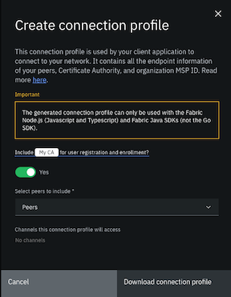

---

copyright:
  years: 2019, 2020
lastupdated: "2020-10-14"

keywords: client application, Commercial Paper, SDK, wallet, generate a certificate, generate a private key, fabric gateway, APIs, smart contract, NTP, time, clock, date

subcollection: blockchain

---

{:external: target="_blank" .external}
{:shortdesc: .shortdesc}
{:screen: .screen}
{:codeblock: .codeblock}
{:note: .note}
{:important: .important}
{:javascript: data-hd-programlang="javascript"}
{:tip: .tip}
{:pre: .pre}


# Creating applications
{: #ibp-console-app}


After you install smart contracts and deploy your nodes, you can use client applications to transact with other members of your network. Applications can invoke the business logic that is contained in smart contracts to create, transfer, or update assets on the blockchain ledger. Use this tutorial to learn how to use client applications to interact with networks that you manage from {{site.data.keyword.blockchainfull}} Platform console.
{:shortdesc}

**Target audience:** This topic is designed for application developers who are interested in learning more about how to create a client application that interacts with a blockchain network.

## Learning resources
{: #ibp-console-app-learning-resources}

You can learn more about how applications and smart contracts work together in the Commercial Paper sample. Go to the topic on how to [Run the commercial paper sample on the {{site.data.keyword.blockchainfull_notm}} Platform](/docs/blockchain?topic=blockchain-ibp-console-app#ibp-console-app-commercial-paper) to learn to deploy and invoke the commercial paper contract.

Developing an application might require coordination between two distinct users of your network, The network operator and the application developer:
- **The network operator** is the administrator who uses the {{site.data.keyword.blockchainfull_notm}} Platform console to deploy the nodes of your organization and installs the smart contracts on your network.
- **The application developer** builds the client application that is consumed by users. The developer uses the [Hyperledger Fabric SDKs](https://hyperledger-fabric.readthedocs.io/en/release-1.4/getting_started.html#hyperledger-fabric-sdks){: external} to invoke transactions written in the smart contracts.

If you are the **network operator**, you need to complete the following steps before the application developer can interact with your network:
1. Use your organization CA to [register an application identity](/docs/blockchain?topic=blockchain-ibp-console-app#ibp-console-app-identities).
2. [Download the connection profile](/docs/blockchain?topic=blockchain-ibp-console-app#ibp-console-app-profile) from the organizations panel.
3. Send the application developer the following objects and information:
  - The enroll ID and secret of the application identity.
  - The connection profile.
  - The smart contract name.
  - The name of the channel the smart contract was instantiated on.  

If you are the **application developer**, use the information that is provided by the network operator to complete following steps:
1. Generate a certificate and private key by using the enroll ID and secret of the application identity, along with CA endpoint information inside your connection profile.
2. Use the connection profile, channel name, smart contract name, and application keys to invoke the smart contract.  

The connection profile that you downloaded from the {{site.data.keyword.blockchainfull_notm}} Platform console can be used to connect to your network by using the Node.js (JavaScript and TypeScript), Java, and Go Fabric SDKs.
{: note}

The application developer can use two programming models to interact with the network:

**High-Level Fabric SDK APIs**

Starting with Fabric v1.4, users can take advantage of a simplified application and smart contract programming model. The new model reduces the number of steps and amount of code that is required to submit a transaction. This model is supported for applications that are written in **Node.js**, **Java**, and **Go**.

Client applications can leverage the capabilities of the Go SDK, but currently only the high-level programming model in the [gateway package](https://godoc.org/github.com/hyperledger/fabric-sdk-go/pkg/gateway) is supported. Direct usage of the rest of the Go SDK is not yet supported.
{: note}

If you want to take advantage of the High-Level Fabric SDK APIs, you can use this tutorial to complete the following actions on an {{site.data.keyword.blockchainfull_notm}} Platform network:

- [Generate certificates for your application](/docs/blockchain?topic=blockchain-ibp-console-app#ibp-console-app-enroll) by using the SDK.
- [Invoke a smart contract from the SDK](/docs/blockchain?topic=blockchain-ibp-console-app#ibp-console-app-invoke).
- Learn about application development by deploying the [commercial paper tutorial](/docs/blockchain?topic=blockchain-ibp-console-app#ibp-console-app-commercial-paper) to the nodes managed from your console. This tutorial provides more background on how to use Fabric Wallets and Gateways.

**Low-Level Fabric SDK APIs**

If you want to continue to use your existing smart contract and application code, or use the other Fabric SDK languages that are provided by the Hyperledger community, you can use the [low-level Fabric SDK APIs](/docs/blockchain?topic=blockchain-ibp-console-app#ibp-console-app-low-level) to connect to your network.

## Registering an application identity
{: #ibp-console-app-identities}

Applications need to sign the transactions they submit to {{site.data.keyword.blockchainfull_notm}} nodes, and attach a signing certificate that is used by nodes to verify that the transactions are being sent by the proper party. This ensures that transactions are submitted by the organizations that have permission to participate.

The network operator needs to use the organization's CA to [register an application identity](/docs/blockchain?topic=blockchain-ibp-console-identities#ibp-console-identities-register), which can then be used by the application developer to generate a certificate and private key. The operator can provide the enroll ID and secret of the identity, along the CA endpoint information, to be used by the SDK to generate certificates. By enrolling on the client side, the application developer ensures that no other party has access to the private key of the application. During registration, the network operator can set an enrollment limit of one for additional security. After the application developer enrolls, the enroll ID and secret cannot be used to generate another private key.

If you are less worried about security, the network operator can enroll an application identity by using the [CA tab](/docs/blockchain?topic=blockchain-ibp-console-identities#ibp-console-identities-enroll). The operator can then download the identity or export it to the console wallet. In order to use the certificates from the SDK, you need to convert the keys from base64 into PEM format. You can decode the certs by running the following command on your local machine:

```
export FLAG=$(if [ "$(uname -s)" == "Linux" ]; then echo "-w 0"; else echo "-b 0"; fi)
echo <base64_string> | base64 --decode $FLAG > <key>.pem
```
{:codeblock}

## Downloading your connection profile
{: #ibp-console-app-profile}

A client application connects to a network via one or more gateway peers. The gateway peers are the peers that are specified in the **connection profile**, and they are used to perform **service discovery** to find all of the endorsing peers in the network that will endorse transactions. Service discovery ensures that the request is sent to a peer that is currently available to process requests.

The connection profile that is downloaded from the {{site.data.keyword.blockchainfull_notm}} Platform console can only be used to connect to your network using the Node.js (JavaScript and TypeScript) and Java Fabric SDKs.
{: note}

The Hyperledger Fabric [Transaction Flow](https://hyperledger-fabric.readthedocs.io/en/release-1.4/txflow.html){: external} spans multiple components, with the client applications collecting endorsements from peers and sending endorsed transactions to the ordering service. The connection profile provides your application with the endpoints of the peers and ordering nodes that it needs to submit a transaction. It also contains information about your organization, such as your Certificate Authorities and your MSP ID. The Fabric SDKs can read the connection profile directly, without you having to write code that manages the transaction and endorsement flow.

In order to take advantage of the [Service Discovery](https://hyperledger-fabric.readthedocs.io/en/release-1.4/discovery-overview.html){: external} feature of Hyperledger Fabric, you must configure anchor peers. Service discovery allows your application to learn which peers on the channel outside your organization need to endorse a transaction. Without service discovery, you will need to get the endpoint information of these peers out of band from other organizations and add them to your connection profile. For more information, see [Configuring anchor peers](/docs/blockchain?topic=blockchain-ibp-console-govern#ibp-console-govern-channels-anchor-peers).

To configure your client application to use Service Discovery, when you start your gateway with the `gateway.connect()` call, you need to set the queryHandlerOptions to `strategy: DefaultQueryHandlerStrategies.MSPID_SCOPE_ROUND_ROBIN`. This configuration ensures that requests from the client application are distributed across available peers. See [DefaultQueryHandlerStrategies](https://hyperledger.github.io/fabric-sdk-node/release-1.4/module-fabric-network.html#.DefaultQueryHandlerStrategies__anchor) in the Node SDK documentation for more information.
{: tip}

Click the **Organization MSP** tile for the organization that your client application interacts with. Click **Create connection profile** to open a side panel where you can build and download your connection profile.

  

If you plan to use the client application to register and enroll users with the organization CA, you need to include the Certificate Authority in the connection profile definition.

Select the peers to include in the connection profile definition. When a peer is not available to process requests from a client application, service discovery ensures that the request is automatically sent to a different peer. Therefore, to accommodate for peer downtime during a maintenance cycle for example, it is recommended that you select more than one peer for redundancy. In addition to peers created by using the console or APIs, imported peers that have been imported into the console are eligible to be selected as well.

The list of channels that the selected peers have joined is also provided for your information. If a channel is missing from the list, it is likely because the peer joined to it is currently unavailable.

You can then download the connection profile to your local file system and use it with your client application to generate certificates and invoke smart contracts.

The connection profile that is downloaded from the {{site.data.keyword.blockchainfull_notm}} Platform console can only be used to connect to your network by using the Node.js (JavaScript and TypeScript) and Java Fabric SDKs.
{: note}

The generated connection profile only supports Fabric CAs. If you manually built your organization MSP with certificates from an external CA, the connection profile will not include any information in the "certificateAuthorities": section.


## Enrolling by using the SDK
{: #ibp-console-app-enroll}

Once the network operator provides the enroll ID and secret of the application identity and the network connection profile, an application developer can use the Fabric SDKs or the Fabric CA client to generate client-side certificates. You can use the following steps to enroll an application identity using the [Fabric SDK for Node.js](https://hyperledger.github.io/fabric-sdk-node/release-1.4/index.html){: external}.

1. Save the connection profile to your local machine and rename it `connection.json`.
2. Save the following code block as `enrollUser.js` in the same directory as your connection profile:

    ```javascript
    'use strict';

    const FabricCAServices = require('fabric-ca-client');
    const { FileSystemWallet, X509WalletMixin } = require('fabric-network');
    const fs = require('fs');
    const path = require('path');

    const ccpPath = path.resolve(__dirname, 'connection.json');
    const ccpJSON = fs.readFileSync(ccpPath, 'utf8');
    const ccp = JSON.parse(ccpJSON);

    async function main() {
      try {

      // Create a new CA client for interacting with the CA.
      const caURL = ccp.certificateAuthorities['<CA_Name>'].url;
      const ca = new FabricCAServices(caURL);

      // Create a new file system based wallet for managing identities.
      const walletPath = path.join(process.cwd(), 'wallet');
      const wallet = new FileSystemWallet(walletPath);
      console.log(`Wallet path: ${walletPath}`);

      // Check to see if we've already enrolled the admin user.
      const userExists = await wallet.exists('user1');
      if (userExists) {
        console.log('An identity for "user1" already exists in the wallet');
        return;
      }

      // Enroll the admin user, and import the new identity into the wallet.
      const enrollment = await ca.enroll({ enrollmentID: '<app_enroll_id>', enrollmentSecret: '<app_enroll_secret>' });
      const identity = X509WalletMixin.createIdentity('<msp_id>', enrollment.certificate, enrollment.key.toBytes());
      await wallet.import('user1', identity);
      console.log('Successfully enrolled client "user1" and imported it into the wallet');

      } catch (error) {
        console.error(`Failed to enroll "user1": ${error}`);
        process.exit(1);
      }
    }

    main();
    ```
    {:codeblock}

3. Edit `enrollUser.js` to replace the following values:
  - Replace  ``<CA_Name>`` with the name of your organizations CA. You can find your CA name in the "organizations" section of your connection profile under "Certificate Authorities". Do not use the "caName" in the "Certificate Authorities" section.
  - Replace ``<app_enroll_id>`` with the application enroll ID provided by your network operator.
  - Replace ``<app_enroll_secret>`` with the application enroll secret provided by your network operator.
  - Replace ``<msp_id>`` with the MSP ID of your organization. You can find your MSP ID under the "organizations" section of your connection profile.
4. Navigate to `enrollUser.js` using a terminal and run `node enrollUser.js`. If the command runs successfully, you should see the following output:

  ```
  Successfully enrolled client "user1" and imported it into the wallet
  ```
  The SDK will create and store your certificates inside the `wallet/user1/` directory that is created by the command. This directory is the file system wallet that is used submit future transactions.

The wallets that are used by the Fabric SDKs are different from the wallet in the {{site.data.keyword.blockchainfull_notm}} Platform console. The identities that are stored in your console wallet cannot be directly used by the SDK.
{: note}

## Invoking a smart contract by using the SDK
{: #ibp-console-app-invoke}

After you generate the application signing certificate and private key and store them in a wallet, you are ready to submit a transaction. You need to know the name of the smart contract and the name of the channel it was instantiated on. You can use the steps below to invoke a smart contract with the [Fabric SDK for Node.js](https://hyperledger.github.io/fabric-sdk-node/release-1.4/index.html){: external}.


1. Save the file below on your local machine as `invoke.js`. Save the file in the same directory as `enrollUser.js`

    ```javascript
    'use strict';

    const { FileSystemWallet, Gateway } = require('fabric-network');
    const fs = require('fs');
    const path = require('path');

    async function main() {
      try {

        // Parse the connection profile. This would be the path to the file downloaded
        // from the IBM Blockchain Platform operational console.
        const ccpPath = path.resolve(__dirname, 'connection.json');
        const ccp = JSON.parse(fs.readFileSync(ccpPath, 'utf8'));

        // Configure a wallet. This wallet must already be primed with an identity that
        // the application can use to interact with the peer node.
        const walletPath = path.resolve(__dirname, 'wallet');
        const wallet = new FileSystemWallet(walletPath);

        // Create a new gateway, and connect to the gateway peer node(s). The identity
        // specified must already exist in the specified wallet.
        const gateway = new Gateway();
        await gateway.connect(ccp, { wallet, identity: 'user1' , discovery: {enabled: true, asLocalhost:false }});

        // Get the network channel that the smart contract is deployed to.
        const network = await gateway.getNetwork('<channel_name>');

        // Get the smart contract from the network channel.
        const contract = network.getContract('<smart_contract_name>');

        // Submit the 'createCar' transaction to the smart contract, and wait for it
        // to be committed to the ledger.
        await contract.submitTransaction('createCar', 'CAR12', 'Honda', 'Accord', 'Black', 'Tom');
        console.log('Transaction has been submitted');

        await gateway.disconnect();

        } catch (error) {
          console.error(`Failed to submit transaction: ${error}`);
          process.exit(1);
        }
      }
    main();
    ```
    {:codeblock}

2. Edit `invoke.js` to replace the following values:
  - Replace  ``<channel_name>`` with the name of the channel the smart contract was instantiated on. You can find your CA name under the "Certificate Authorities" section of your connection profile.
  - Replace ``<smart_contract_name>`` with the name of the installed smart contract. You can get this value from your network operator.
  - Edit the contents of `submitTransaction` to invoke a function inside your smart contract. The `invoke.js` file is written to invoke the [fabcar smart contract](https://github.com/hyperledger/fabric-samples/tree/release-1.4/chaincode/fabcar){: external}. If you want to run the file below to submit a transaction, install fabcar and instantiate the smart contract on one of your channels.

3. Navigate to `invoke.js` using a terminal and run `node invoke.js`. If the command runs successfully, you should see the following output:

  ```
  Transaction has been submitted
  ```

  If you navigate to your channel by using the console, you are able to see that another block was added by the transaction.

Your transaction might fail if you did not configure an anchor peer on your channel. Unless you manually updated your connection profile, your application needs to use the [Service Discovery](https://hyperledger-fabric.readthedocs.io/en/release-1.4/discovery-overview.html){: external} feature to learn about the peers it needs to submit the transaction to. For more information, see [Configuring anchor peers](/docs/blockchain?topic=blockchain-ibp-console-govern#ibp-console-govern-channels-anchor-peers).
{: note}

## Running the Commercial Paper sample
{: #ibp-console-app-commercial-paper}

The [commercial paper tutorial](https://hyperledger-fabric.readthedocs.io/en/release-1.4/tutorial/commercial_paper.html){: external} in the Hyperledger Fabric documentation takes developers through a use case in which multiple parties buy, sell, and redeem commercial paper. It extends the [Developing applications topic](https://hyperledger-fabric.readthedocs.io/en/release-1.4/developapps/developing_applications.html){: external} by providing sample smart contract and application code that allows you to create and trade assets on a local instance of Fabric.

You can also deploy the commercial paper tutorial sample code onto an {{site.data.keyword.blockchainfull_notm}} Platform network. This allows you to quickly get started interacting with your network and use the sample to download the necessary dependencies. The sample code also includes examples of how you can import certificates into a [wallet](https://hyperledger-fabric.readthedocs.io/en/release-1.4/developapps/wallet.html){: external} and use your connection profile to build a [Fabric gateway](https://hyperledger-fabric.readthedocs.io/en/release-1.4/developapps/gateway.html){: external}. The tutorial can be used by two different organizations to complete different transactions with a single asset. If you used the [Build a network tutorial](/docs/blockchain?topic=blockchain-ibp-console-build-network#ibp-console-build-network) to deploy two peer organizations that are connected to a channel, you can interact with the tutorial by using both organizations.

Follow the steps below to deploy the sample on your network. You can review the tutorial in the Fabric Documentation [commercial paper tutorial](https://hyperledger-fabric.readthedocs.io/en/release-1.4/tutorial/commercial_paper.html){: external} for more details about the smart contracts and the application structure.

### Prerequisites

Before you can deploy the commercial paper sample, you need to install required tools on your local machine:
  * [Git](https://git-scm.com/book/en/v2/Getting-Started-Installing-Git){: external}
  * [Node.js](https://hyperledger-fabric.readthedocs.io/en/release-1.4/prereqs.html#node-js-runtime-and-npm){: external}

You will also need a use text editor to edit and save files in the sample. You can use many of the high-quality editors that are available for free, such as [Visual Studio Code](https://code.visualstudio.com/){: external}, [Atom](https://atom.io/){: external}, [Sublime text](http://www.sublimetext.com/){: external}, or [Brackets](http://brackets.io/){: external}.

### Step one: Download the sample

You download the commercial paper sample by cloning the [Fabric Samples repository](https://github.com/hyperledger/fabric-samples){: external}:

```
git clone https://github.com/hyperledger/fabric-samples.git
```
{:codeblock}

After you download the Fabric Samples, run the following commands to ensure that you are using the version of the samples compatible with Fabric v1.4.7 and v2.x.

```
cd fabric-samples
git checkout v1.4.6
```
{:codeblock}

You can find the sample in the `commercial paper` folder of `fabric-samples`.

```
cd $HOME/fabric-samples/commercial-paper
```
{:codeblock}

The tutorial contains two sample organizations, **magnetocorp** and **digibank**. Each organization has its own sample application code, stored in two separate folders under the `organization` directory.

```
ls organization
digibank	magnetocorp
```
{:codeblock}

In the course of the tutorial, you will first use the magnetocorp application code to issue a commercial paper. You can then use the digibank application code to buy and redeem the paper. Both directories contain the same smart contract.

Navigate to the application code inside the magnetocorp directory.

```
cd organization/magnetocorp/application
```
{:codeblock}

When you are inside the directory, you can download the application dependencies by running the following command:

```
npm install
```
{:codeblock}

### Step two: Install and instantiate smart contract

You can find the commercial paper smart contract inside the `contract` folder of the `digibank` and `magnetocorp` directory. You need to install this smart contract on all the peers of the organizations that use the tutorial. You then need to instantiate the commercial paper contract on a channel. The smart contract needs to be packaged in [.cds format](https://hyperledger-fabric.readthedocs.io/en/release-1.4/chaincode4noah.html#packaging){: external} to be installed by using the console.

You can use the [{{site.data.keyword.blockchainfull_notm}} VS code extension](/docs/blockchain?topic=blockchain-develop-vscode) to package the smart contract. After you install the extension, use Visual Studio Code to open the `contracts` folder in your workspace. Open the _{{site.data.keyword.blockchainfull_notm}} Platform_ tab. In the _{{site.data.keyword.blockchainfull_notm}} Platform_ pane, go to the smart contract packages section and click **Package Open Project**. The VS code extension uses the files in the `contracts` folder to create a new package named `papernet-js@.0.0.1.cds`. Right-click this package to export it to your local file system. You can then use your console to [install the smart contracts on your peers](/docs/blockchain?topic=blockchain-ibp-console-smart-contracts#ibp-console-smart-contracts-install) and then [instantiate the smart contract on a channel](/docs/blockchain?topic=blockchain-ibp-console-smart-contracts#ibp-console-smart-contracts-instantiate).

### Step three: Generate certificates for your wallet

Applications need to sign the requests they send to fabric components. If the components do not recognize the organizations submitting the transactions, the transactions are rejected and return with an error. The commercial paper sample creates a file system wallet that stores your certificates and signs your transactions. For more information about how applications use wallets, see the [wallet](https://hyperledger-fabric.readthedocs.io/en/release-1.4/developapps/wallet.html){: external} topic in the Fabric Documentation. The wallets that are used by the Fabric SDKs are different from the wallet in the {{site.data.keyword.blockchainfull_notm}} Platform console. The identities that are stored in your console wallet cannot be directly used by the SDK.

The original sample uses the `addToWallet.js` file to create a file system wallet using certificates from the fabric samples folder. We are going to create a new file that uses the SDK to generate a client-side certificate and store them directly inside a new wallet.

Choose the CA of the organization you want to use to operate the tutorial as magnetocorp. For example, you can use Org1 if you have completed the Build a network tutorial. Use the CA to [create an application identity](/docs/blockchain?topic=blockchain-ibp-console-app#ibp-console-app-identities). **Save** the enroll ID and secret.

Use your console to [download your connection profile](/docs/blockchain?topic=blockchain-ibp-console-app#ibp-console-app-profile). Save the connection profile to your local file system and rename it `connection.json`. Then, issue the following command from the `magnetocorp/application` directory to move the connection profile to a directory where it will be referenced by future commands.

  ```
  mv $HOME/<path_to_creds>/connection.json ../gateway/connection.json
  ```
  {:codeblock}

Save the following code block as `enrollUser.js` in the ``/magnetocorp/application`` directory:

  ```javascript
  'use strict';

  const FabricCAServices = require('fabric-ca-client');
  const { FileSystemWallet, X509WalletMixin } = require('fabric-network');
  const fs = require('fs');
  const path = require('path');

  const ccpPath = path.resolve(__dirname, '../gateway/connection.json');
  const ccpJSON = fs.readFileSync(ccpPath, 'utf8');
  const ccp = JSON.parse(ccpJSON);

  async function main() {
    try {

      // Create a new CA client for interacting with the CA.
      const caURL = ccp.certificateAuthorities['<CA_Name>'].url;
      const ca = new FabricCAServices(caURL);

      // Create a new file system based wallet for managing identities.
      const wallet = new FileSystemWallet('../identity/user/isabella/wallet');

      // Check to see if we've already enrolled the admin user.
      const userExists = await wallet.exists('user1');
      if (userExists) {
        console.log('An identity for "user1" already exists in the wallet');
        return;
      }

      // Enroll the admin user, and import the new identity into the wallet.
      const enrollment = await ca.enroll({ enrollmentID: '<app_enroll_id>', enrollmentSecret: '<app_enroll_secret>' });
      const identity = X509WalletMixin.createIdentity('<msp_id>', enrollment.certificate, enrollment.key.toBytes());
      await wallet.import('user1', identity);
      console.log('Successfully enrolled client "user1" and imported it into the wallet');

      } catch (error) {
        console.error(`Failed to enroll "user1": ${error}`);
        process.exit(1);
      }
  }
  main();
  ```
  {:codeblock}

Take moment to study how this file works before we edit it. First, `enrollUser.js` imports the `FileSystemWallet` and `X509WalletMixin` classes from the `fabric-network` library.

```javascript
const FabricCAServices = require('fabric-ca-client');
const { FileSystemWallet, X509WalletMixin } = require('fabric-network');
```
{:codeblock}

The file then uses the `FileSystemWallet` class to build a wallet on your local filesystem. You can edit the line below to store the wallet in a different location.

```javascript
const wallet = new FileSystemWallet('../identity/user/isabella/wallet')
```
{:codeblock}

After creating the wallet, the code snippet uses the enroll ID and secret to enroll by using your organization CA. It then creates an identity for the signing certificate and private key and imports them into the wallet. Notice how the file passes your organization MSP ID into the wallet as well.

```javascript
// Enroll the admin user, and import the new identity into the wallet.
const enrollment = await ca.enroll({ enrollmentID: '<app_enroll_id>', enrollmentSecret: '<app_enroll_secret>' });
const identity = X509WalletMixin.createIdentity('<msp_id>', enrollment.certificate, enrollment.key.toBytes());
wallet.import('user1', identity);
console.log('Successfully enrolled client "user1" and imported it into the wallet');
```
{:codeblock}

**Edit** `enrollUser.js` to replace the following values:
- Replace  `<CA_Name>` with the name of your organization's CA. You can find your CA name in the "organizations" section of your connection profile under "Certificate Authorities". Do not use the "caName" in the "Certificate Authorities" section.
- Replace `<app_enroll_id>` with the application enroll ID provided by your network operator.
- Replace `<app_enroll_secret>` with the application enroll secret provided by your network operator.
- Replace `<msp_id>` with the MSP ID of your organization. You can find this MSP ID under the "organizations" section of your connection profile.

Save `enrollUser.js` and close it. In the `magnetocorp` directory, run the following command:
```
node enrollUser.js
```
{:codeblock}

When the command completes successfully, you should see the following output:

```
Successfully enrolled client "user1" and imported it into the wallet
```

You can find the wallet that was created in the `identity` folder of the `magnetocorp` directory.

### Step four: Use the connection profile to build a fabric gateway

The Hyperledger Fabric [Transaction Flow](https://hyperledger-fabric.readthedocs.io/en/release-1.4/txflow.html){: external} spans multiple components, with the client applications playing a unique role. Your application needs to connect to the peers that need to endorse the transaction and needs to connect to the ordering service that will order the transaction and add it into a block. You can provide the endpoints of these nodes to your application by using your connection profile to construct a Fabric Gateway. The Gateway then conducts the low level interactions with your fabric network. To learn more, visit the [Fabric gateway](https://hyperledger-fabric.readthedocs.io/en/release-1.4/developapps/gateway.html){: external} topic in the Fabric Documentation.

You have already downloaded your connection profile and used it to connect to your organization's Certificate Authority. Now we will use the connection profile to build a gateway.

Open the file `issue.js` in a text editor. Before you edit the file, notice that it imports the `FileSystemWallet` and `Gateway` classes from fabric-network library.

```javascript
const { FileSystemWallet, Gateway } = require('fabric-network')
```
{:codeblock}

You will need to import the path class to build the gateway from the connection profile you downloaded from your console. **Add** the following line to the file to import the path class:
```javascript
const path = require('path');
```
The `Gateway` class is used to construct a gateway that you will used to submit your transaction.

```javascript
const gateway = new Gateway()
```
{:codeblock}

The `FileSystemWallet` class is used to load the wallet you created in the previous step. **Edit** the line below if you changed the location of the wallet on your filesystem.

```javascript
const wallet = new FileSystemWallet('../identity/user/isabella/wallet');
```
{:codeblock}

After importing your wallet, use the following code to pass your connection profile and wallet to the new gateway. You need to make the following **Edits** to the code so it resembles the code snippet below. The lines that print logs have been removed for brevity.
- Update the `userName` to match the value that you selected for your `identityLabel` in `enrollUser.js`.
- Update the discovery options to take advantage of service discovery on your network. Set `discovery: { enabled: true, asLocalhost: false }`.  
- Update the section importing your connection profile. The console connection profile is in JSON format rather than a YAML file used by the sample.  

```javascript
const userName = 'user1';

// Load connection profile; will be used to locate a gateway
const ccpPath = path.resolve(__dirname, '../gateway/connection.json');
const ccpJSON = fs.readFileSync(ccpPath, 'utf8');
const connectionProfile = JSON.parse(ccpJSON);

// Set connection options; identity and wallet
let connectionOptions = {
  identity: userName,
  wallet: wallet,
  discovery: { enabled: true, asLocalhost: false }
};

await gateway.connect(connectionProfile, connectionOptions);
```
{:codeblock}

This code snippet uses the gateway to open gRPC connections to the peer and orderer nodes, and interact with your network.

### Step five: Invoke the smart contract

After configuring the gateway to connect to the network managed by your console, we will edit the portion of the `issue.js` file that connects to the commercial paper smart contract. You need to provide the gateway the contract name and the channel on which you instantiated the smart contract.

**Edit** the line below, replacing `mychannel` with your channel name.

```javascript
const network = await gateway.getNetwork('mychannel');
```
{:codeblock}

Following a line of code that prints a message to your console, you can find a line that provides the gateway the smart contract name. **Edit** the line below to change the name `papercontract` to the name of the contract you installed.

```javascript
const contract = await network.getContract('papercontract', 'org.papernet.commercialpaper');
```
{:codeblock}

The gateway now has all the information that it needs to submit a transaction. The following line invokes the `issue` function in the commercial paper contract, with the arguments defining the new commercial paper asset.

```javascript
const issueResponse = await contract.submitTransaction('issue', 'MagnetoCorp', '00001', '2020-05-31', '2020-11-30', '5000000');
```
{:codeblock}

After it submits the transaction using the gateway, the `issue.js` file disconnects the gateway connection.

```javascript
gateway.disconnect();
```
{:codeblock}

This command closes the gRPC connections opened by your gateway. Closing connections will save network resources and improve performance.

After completing the edits from this step and **Step four**, save `issue.js` and close it. Submit the transaction that creates the new commercial paper by using the following command:

```
node issue.js
```
{:codeblock}

If the transaction is successful, you can see the following output in your terminal:

```
Transaction complete.
Disconnect from Fabric gateway.
Issue program complete.
```

### Step six: Operate the sample as digibank

After you create the commercial paper by operating as magnetocorp, you can buy and redeem the commercial paper by operating the tutorial as digibank. You can use the digibank application code by using the same organization as magnetocorp, or use the CA, peers, and connection profile of a different organization. If you competed the [Join a network tutorial](/docs/blockchain?topic=blockchain-ibp-console-join-network#ibp-console-join-network), this is a good opportunity operate the tutorial as Org2.

Go to the `digibank/application` directory. You can follow the directions that are provided in **Step three** to create to generate the certificates and wallet that will sign the transaction as digibank. You can then use the `buy.js` file to purchase the commercial paper from magnetocorp, and then use `redeem.js` to redeem the paper. You can follow **Step four** and **Step five** to edit those files so that they point to the correct connection profile, channel and smart contract.

## Connecting to your network by using low-level Fabric SDK APIs
{: #ibp-console-app-low-level}

If you are interested in preserving your existing application code, or by using Fabric SDKs for languages other than Node.js, you can still connect to your network by using lower-level Fabric SDK APIs. Use the console to [download your connection profile](/docs/blockchain?topic=blockchain-ibp-console-app#ibp-console-app-profile). You can then import the endpoints of the peers and ordering nodes of your channel directly from the connection profile, or use the node endpoint information to manually add peer and orderer objects. You will also need to use your CA to [create an application identity](/docs/blockchain?topic=blockchain-ibp-console-app#ibp-console-app-identities), and then use the CA endpoint information enroll on the client side, or generate certificates using your console.

The [Fabric Node SDK](https://hyperledger.github.io/fabric-sdk-node/release-1.4/index.html){: external} documentation provides a tutorial on how to [connect to your network using a connection profile](https://hyperledger.github.io/fabric-sdk-node/release-1.4/tutorial-network-config.html){: external}. The tutorial uses the CA endpoint information in your connection profile to generate keys using the SDK. You can also use your console to generate a signing certificate and private key and convert the keys into PEM format. You can then set a user context by passing your keys directly to the SDKs' [Fabric Client class](https://hyperledger.github.io/fabric-sdk-node/release-1.4/Client.html){: external} using the code below:

```javascript
fabric_client.createUser({
		username: 'admin',
		mspid:  'org1',
		cryptoContent: {
			privateKeyPEM: fs.readFileSync(path.join(__dirname,'./privateKey.pem')),
			signedCertPEM: fs.readFileSync(path.join(__dirname,'./certificate.pem'))
		}});
```
{:codeblock}

If you are using low level SDK APIs to connect to your network, there are additional steps that you can take to manage the performance and availability of your application. For more information, see [Best practices for application connectivity and availability](/docs/blockchain?topic=blockchain-best-practices-app#best-practices-app-connectivity-availability).


## Using indexes with CouchDB
{: #console-app-couchdb}

If you use CouchDB as your state database, you can perform JSON data queries from your smart contracts against the channel's state data. It is strongly recommended that you create indexes for your JSON queries and use them in your smart contracts. Indexes allow your applications to retrieve data efficiently when your network adds additional blocks of transactions and entries in the world state. To learn how to use indexes with your smart contracts and your applications, see [Best practices when using CouchDB](/docs/blockchain?topic=blockchain-best-practices-app#best-practices-app-couchdb-indices).


## Clock synchronization
{: #console-app-clock}

Synchronizing your application with a Network Time Protocol (NTP) server is important because it ensures that all time-based activities occur synchronously everywhere on the network.  The {{site.data.keyword.blockchainfull_notm}} Platform runs in {{site.data.keyword.cloud_notm}} and uses an internal NTP server `servertime.service.softlayer.com`.  

The NTP server that you need to synchronize your application with depends on where your application is running:

- If your application is running in {{site.data.keyword.cloud_notm}} Classic infrastructure, set your NTP server to `servertime.service.softlayer.com`.
- If your application is running in {{site.data.keyword.cloud_notm}} VPC infrastructure, set your NTP server to `time.adn.networklayer.com`.
- If your application is not running in {{site.data.keyword.cloud_notm}}, set your NTP server to `time-a.nist.gov` or `time-b.nist.gov`.


