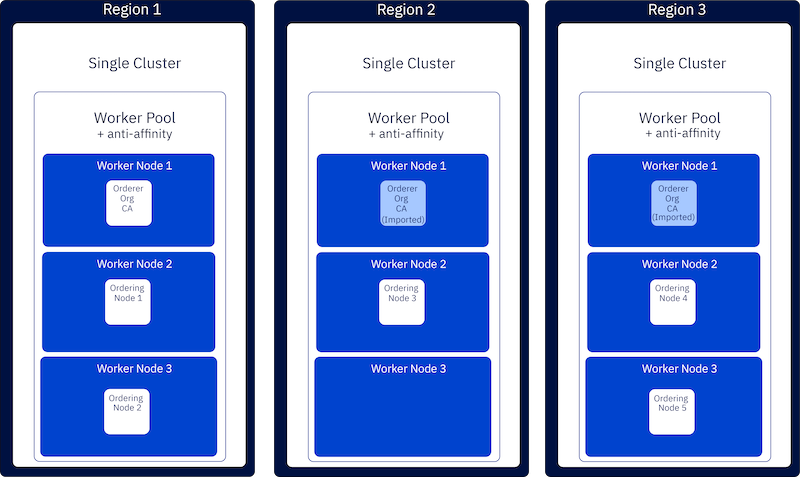
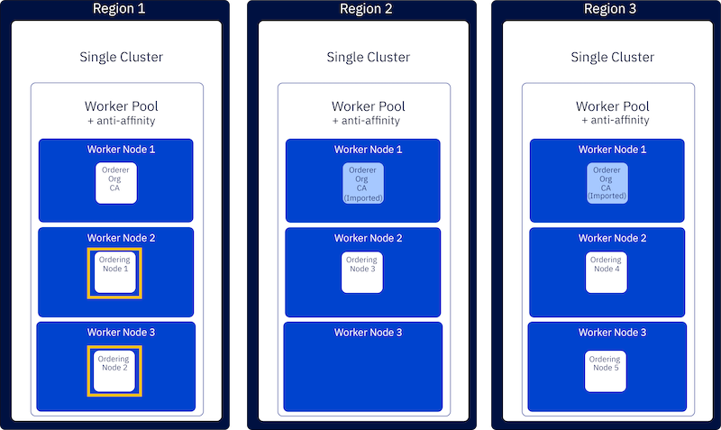
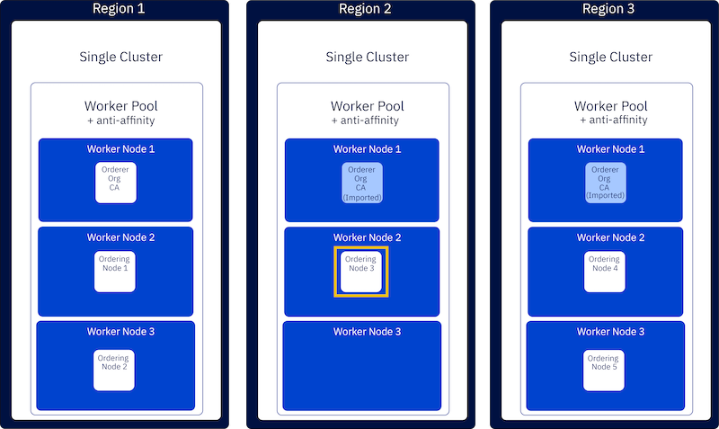
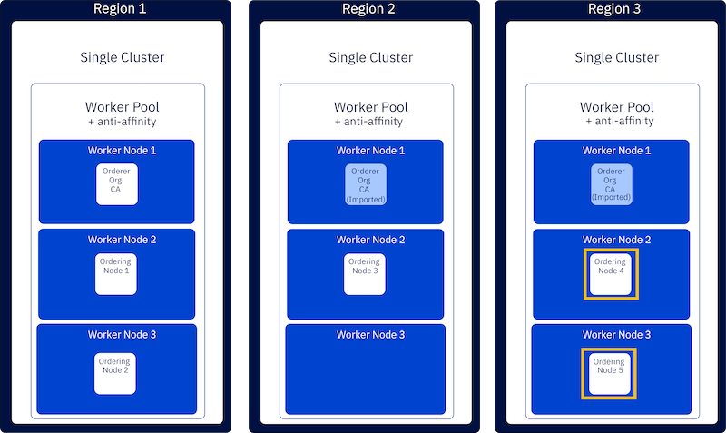
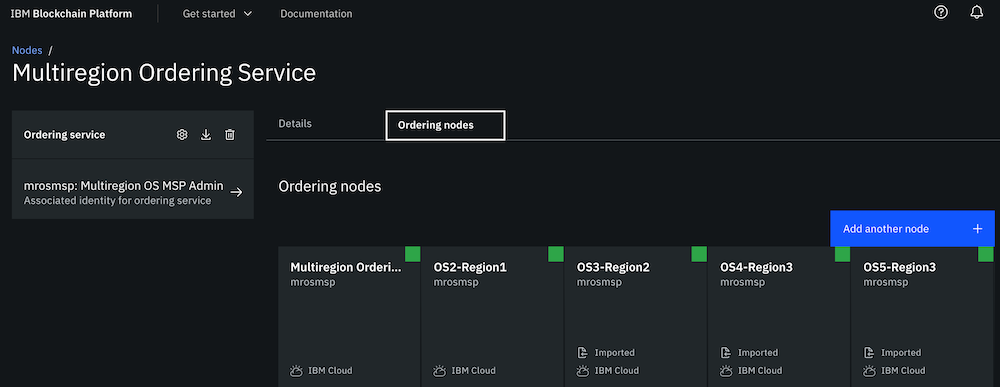
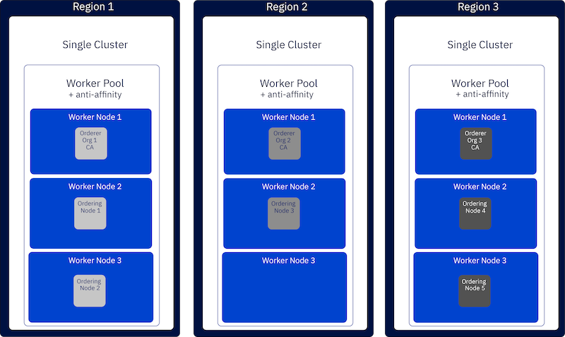

---

copyright:
  years: 2019, 2020
lastupdated: "2020-12-10"

keywords: high availability, Ordering Service, Raft

subcollection: blockchain

content-type: tutorial
services:
account-plan: paid  
completion-time: 45m

---

{:DomainName: data-hd-keyref="APPDomain"}
{:DomainName: data-hd-keyref="DomainName"}
{:android: data-hd-operatingsystem="android"}
{:api: .ph data-hd-interface='api'}
{:apikey: data-credential-placeholder='apikey'}
{:app_key: data-hd-keyref="app_key"}
{:app_name: data-hd-keyref="app_name"}
{:app_secret: data-hd-keyref="app_secret"}
{:app_url: data-hd-keyref="app_url"}
{:authenticated-content: .authenticated-content}
{:beta: .beta}
{:c#: data-hd-programlang="c#"}
{:cli: .ph data-hd-interface='cli'}
{:codeblock: .codeblock}
{:curl: .ph data-hd-programlang='curl'}
{:deprecated: .deprecated}
{:dotnet-standard: .ph data-hd-programlang='dotnet-standard'}
{:download: .download}
{:external: target="_blank" .external}
{:faq: data-hd-content-type='faq'}
{:fuzzybunny: .ph data-hd-programlang='fuzzybunny'}
{:generic: data-hd-operatingsystem="generic"}
{:generic: data-hd-programlang="generic"}
{:gif: data-image-type='gif'}
{:go: .ph data-hd-programlang='go'}
{:help: data-hd-content-type='help'}
{:hide-dashboard: .hide-dashboard}
{:hide-in-docs: .hide-in-docs}
{:important: .important}
{:ios: data-hd-operatingsystem="ios"}
{:java: .ph data-hd-programlang='java'}
{:java: data-hd-programlang="java"}
{:javascript: .ph data-hd-programlang='javascript'}
{:javascript: data-hd-programlang="javascript"}
{:new_window: target="_blank"}
{:note .note}
{:note: .note}
{:objectc data-hd-programlang="objectc"}
{:org_name: data-hd-keyref="org_name"}
{:php: data-hd-programlang="php"}
{:pre: .pre}
{:preview: .preview}
{:python: .ph data-hd-programlang='python'}
{:python: data-hd-programlang="python"}
{:route: data-hd-keyref="route"}
{:row-headers: .row-headers}
{:ruby: .ph data-hd-programlang='ruby'}
{:ruby: data-hd-programlang="ruby"}
{:runtime: architecture="runtime"}
{:runtimeIcon: .runtimeIcon}
{:runtimeIconList: .runtimeIconList}
{:runtimeLink: .runtimeLink}
{:runtimeTitle: .runtimeTitle}
{:screen: .screen}
{:script: data-hd-video='script'}
{:service: architecture="service"}
{:service_instance_name: data-hd-keyref="service_instance_name"}
{:service_name: data-hd-keyref="service_name"}
{:shortdesc: .shortdesc}
{:space_name: data-hd-keyref="space_name"}
{:step: data-tutorial-type='step'}
{:subsection: outputclass="subsection"}
{:support: data-reuse='support'}
{:swift: .ph data-hd-programlang='swift'}
{:swift: data-hd-programlang="swift"}
{:table: .aria-labeledby="caption"}
{:term: .term}
{:tip: .tip}
{:tooling-url: data-tooling-url-placeholder='tooling-url'}
{:troubleshoot: data-hd-content-type='troubleshoot'}
{:tsCauses: .tsCauses}
{:tsResolve: .tsResolve}
{:tsSymptoms: .tsSymptoms}
{:tutorial: data-hd-content-type='tutorial'}
{:ui: .ph data-hd-interface='ui'}
{:unity: .ph data-hd-programlang='unity'}
{:url: data-credential-placeholder='url'}
{:user_ID: data-hd-keyref="user_ID"}
{:vbnet: .ph data-hd-programlang='vb.net'}
{:video: .video}

# Setting up multiregion High Availability (HA) deployments for the ordering service
{: #ibp-console-hadr-mr-os}
{: toc-content-type="tutorial"}
{: toc-completion-time="45m"}

In this tutorial, you learn how to set up a Raft ordering service with five ordering nodes that span multiple regions for maximum high availability.
{: shortdesc}

{: caption="Figure 1. A diagram that shows the architecture of a multiregion ordering service" caption-side="bottom"}

The diagram shows a multiregion ordering service that includes five ordering nodes that are spread across three Kubernetes clusters in three different regions. For simplicity, this tutorial assumes that all of the ordering nodes are contributed by the same organization. The setup requires a single Certificate Authority (CA), created in one cluster and imported into the blockchain consoles on the other two clusters.  \

Throughout this tutorial we refer to two types of nodes: "ordering nodes" and "worker nodes". Ordering nodes belong to a Raft ordering service cluster. Worker nodes refer to the Kubernetes component that hosts the pods where the ordering nodes are deployed.
{: note}

After you understand how to spread the ordering nodes across regions, it is possible for separate organizations to contribute ordering nodes and generate certificates by using their own CAs. This advanced configuration is not covered in this tutorial, but you can learn more about it in the [Next steps](#ibp-console-hadr-mr-os-next).

Although you cannot choose which worker node an ordering node is deployed to, the console is configured with an `anti-affinity` policy. This means that for high availability, whenever you deploy a blockchain node on a multi-node cluster, the console attempts to spread ordering nodes that belong to the same organization across the worker nodes if sufficient resources are available. If your cluster is configured with multiple zones, you can designate which zone the ordering node is deployed to when you create it, or you can let the console choose for you. In this case, it also leverages the anti-affinity policy across zones.

A minimum of five ordering nodes is recommended for a production ordering service. In Raft, a majority of the total number of nodes is needed to form a [quorum](/docs/blockchain?topic=blockchain-glossary#glossary-quorum). In other words, if you have one node, you need that node available to have a quorum because the majority of one is one. Similarly, if you have two nodes, you will need both available, since the majority of two is two. In a similar vein, the majority of five is three. This means that in a five node configuration, the loss of two nodes can be tolerated and ensures zero downtime. You can see in the diagram that **Region 1** contains two ordering nodes, **Region 2** contains one ordering node, and **Region 3** contains two ordering nodes. Spreading the nodes across the regions guarantees that if any single region goes down, or if the ordering nodes within it need to be offline for maintenance, that quorum can be maintained by the nodes in the other regions.

The tutorial walks you through the following steps:
1. Deploy the ordering service in **Region 1**.
1. Add a new ordering node in **Region 2**.
1. Add two new ordering nodes in **Region 3**.
1. Update the ordering service in **Region 1**, **Region 2**, and **Region 3**.

## Before you begin
{: #ibp-console-hadr-mr-os-prereq}

This tutorial assumes that you have three Kubernetes clusters that are deployed across three different regions and that you have  linked a blockchain service instance to  each of those clusters.

Choose the regions of your Kubernetes clusters carefully. While it is fine for the ordering nodes to span regions, transaction latency can occur when the cluster regions are geographically far apart. For example, it is not recommended to deploy some ordering nodes in Tokyo, some in Australia, and some in the United States.
{: tip}

* [Create an {{site.data.keyword.blockchainfull_notm}} Platform service instance in {{site.data.keyword.cloud_notm}}](/docs/blockchain?topic=blockchain-ibp-v2-deploy-iks-ic#ibp-v2-deploy-iks-create-service-instance).  

  Deploy an instance of the {{site.data.keyword.blockchainfull_notm}} Platform in each cluster and verify that you can log in to the console.

* [Build a network tutorial](/docs/blockchain?topic=blockchain-ibp-console-build-network)  

  We assume that you are already familiar with the console and using it to deploy a CA, register users, enroll identities, create a Membership Service Provider (MSP), and create an ordering service. If you have not used the console before, you should review the Build a Network tutorial because a similar process is used in throughout the following instructions.

## Deploy the ordering service in Region 1
{: #ibp-console-hadr-mr-os-region1}
{: step}

In this section, we create a single-node ordering service and then add a second ordering node as highlighted in yellow in the diagram below:

{: caption="Figure 2. Create the ordering service and second ordering node" caption-side="bottom"}

Before we can deploy the ordering service, we create the ordering organization CA, register the ordering organization admin users and the ordering node user, and create the organization Membership Service Provider (MSP). The bulk of the work to set up an ordering service is performed in this section, making it simple in later steps to add ordering nodes from other regions.

### Create the ordering service CA
{: #ibp-console-hadr-mr-os-region1-ca}

For simplicity, we create an ordering service where all of the ordering nodes belong to the same organization. Therefore, we create a single CA and register and enroll the identities for each ordering node with the CA. After you have logged in to the console in **Region 1** complete the following steps:

1. Navigate to the **Nodes** tab and click **Add Certificate Authority**.
2. In this step, we're creating a CA, as opposed to importing one, so make sure that the option to **Create a Certificate Authority** is selected. Then click **Next**
3. Give this CA a unique display name, `Multiregion OS CA`.
4. Provide the **CA administrator enroll ID** and corresponding **secret**. For purposes of this tutorial, we use `admin` and `adminpw`.
5. You can ignore the Advanced deployment options, they are not relevant to this tutorial.
6. Review the Summary page, then click **Add Certificate Authority**.

Depending on your cluster type, deployment of the CA can take up to ten minutes. When the CA is first deployed, the status indicator box in the CA tile is a flashing gray box. When the CA is successfully deployed and is running, this box turns green, indicating that it is "Running" and can be operated from the console. Before proceeding with the steps below, you must wait until the CA status is "Running". If the gray box stops flashing, try reloading the page in your browser to refresh the status.
{:important}

### Associate the CA admin identity
{: #ibp-console-hadr-mr-os-region1-ca-admin}

Each CA node is created with a CA admin identity. You use the admin identity to register new users with your CA and generate certificates. Before you can use the console to operate your CA, you need to associate the CA admin identity with the CA node itself.  

After the CA is running, as indicated by the green box in the tile, complete the following steps:

1. Click the `Multiregion OS CA` tile in the **Nodes** tab. Then, click **Associate identity** on the CA overview panel.
2. On the side panel that opens, provide the **Enroll ID** of `admin` and **Enroll secret** of `adminpw` that you specified in the preceding section. For the **Identity display name**, you can use the default value of `Multiregion OS CA Admin`.
3. Click **Associate identity** to add the identity into your console Wallet and associate the admin identity with your CA.

**Task: Associate identity**

  |  **Field** | **Display name** | **Enroll ID** | **Secret** |
  | ------------------------- |-----------|-----------|-----------|-----------|
  | **Enroll ID** |  Multiregion OS CA Admin  | admin | adminpw |
  {: caption="Table 1. Associate CA admin identity" caption-side="bottom"}

You should be able to see the CA admin in your **Wallet**.

**Task: Check your Wallet**

  | **Field** |  **Display name** | **Description** |
  | ------------------------- |-----------|----------|
  | **Identity** | Multiregion OS CA Admin | Multiregion OS CA admin identity |
  {: caption="Table 2. Check your Wallet" caption-side="bottom"}

### Use your CA to register identities
{: #ibp-console-hadr-mr-os-region1-ca-reg}

Each ordering node in the ordering service needs a certificate and private key to participate in the blockchain network. You also need to create an admin identity for the ordering service organization that you can use to manage the ordering service. We use the CA to register these identities:

* **An organization admin**: This identity allows you to operate the ordering nodes from the console.
* **ordering node user**: This is the registered user that each ordering node will use. When the ordering node is subsequently created, this user is enrolled, meaning that a certificate and private key are generated for the node.

Because you have already associated the CA admin identity, you can now use the CA tile to create these identities by completing the following steps:

1. Click the `Multiregion OS CA` tile in the **Nodes** tab and ensure the `admin` identity that you created for the CA is visible in the table. Then click the **Register user** button.
2. First we'll register the organization admin, which we can do by giving an **Enroll ID** of `osadmin` and a **secret** of `osadminpw`. Then, use the `Type` drop-down to set the type for this identity as `admin`.  You can ignore the **Maximum enrollments** field. If you want to learn more about enrollments, see [Registering identities](/docs/blockchain?topic=blockchain-ibp-console-identities#ibp-console-identities-register). Click **Next**.
3. This tutorial does not configure attributes on identities. Click **Register user**.
4. After the organization admin has been registered, repeat this same process for the identity of the ordering nodes.  Use the information in the table below to register the ordering node user for the ordering nodes with an **Enroll ID** of `os1` and **secret** `os1pw`.  This is an ordering node identity, so be sure to select `orderer` from the **Type** drop-down list.

**Task: Create a CA and register users**

  | **Field** | **Description** | **Enroll ID** | **Secret** | **Type** |
  | ------------------------- |-----------|-----------|-----------|-----------|
  | **Create CA** | Multiregion OS CA | admin | adminpw | client |
  | **Register users** | Ordering Service admin | osadmin | osadminpw | admin |
  |  | Ordering Service node 1 identity |  os1 | os1pw | orderer |
  {: caption="Table 3. Register users with CA" caption-side="bottom"}

You could register a new user for each ordering node, but to keep things simple we will reuse the same user enroll ID and secret for each ordering node. Reusing the enroll ID is acceptable in this case because a unique certificate is generated when the ordering node is created and the identity is enrolled. But it is important to ensure that you have not restricted the **maximum enrollments** for the user when it is initially registered so that a new certificate can be generated when the user is enrolled when each ordering node is created. The default value of **maximum enrollments** is `unlimited`.
{: tip}

### Create the ordering service organization MSP definition
{: #ibp-console-hadr-mr-os-region1-msp}

Create your ordering service organization MSP definition and specify the admin identity for the organization. After we have registered the ordering service admin and ordering service users, we need to create the MSP ID and enroll the `osadmin` user that we registered as the admin of our organization.

1. Navigate to the **Organizations** tab in the left navigation and click **Create MSP definition**.
2. Enter `Multiregion OS MSP` as the organization MSP display name and `mrosmsp` and as the MSP ID. Click **Next**.
3. Under **Root Certificate Authority details**, specify the CA you used to register the identities in the previous step, `Multiregion OS CA`, and click **Next**.
4. Under **Enroll ID** and **Enroll secret**, select `osadmin`, and enter its associated secret, `osadminpw`.
5. Click the **Generate** button to enroll this identity as the admin of your organization and export the `Multiregion OS MSP Admin` identity to the Wallet.
6. Click **Export** to export the admin certificates to your file system and then click **Next**.
7. Review the information on the **Summary** panel and click **Create MSP definition**.
8. After the MSP is created, click on its tile and then click **Export**  to download the `Multiregion OS MSP` to your local filesystem as a `JSON` file. You will need to send this MSP to all operators of the blockchain consoles in other regions.

**Task: Create the ordering service organization MSP definition**

  |  | **Display name** | **MSP ID** | **Enroll ID**  | **Secret** |
  | ------------------------- |-----------|-----------|-----------|-----------|
  | **Create Organization** | Multiregion OS MSP | mrosmsp |||
  | **Root CA** |  Multiregion OS CA ||||
  | **Org Admin Cert** | |  | osadmin | osadminpw |
  | **Identity** | Multiregion OS MSP Admin |||||
  {: caption="Table 4. Create the ordering service organization MSP definition" caption-side="bottom"}

After you create the MSP, you should be able to see the ordering service organization admin in your **Wallet**, which can be accessed by clicking the **Wallet** tab in the left navigation.

**Task: Check your Wallet**

  | **Field**    |  **Display name** | **Description** |
  | -------------|-------------------|-----------------|
  | **Identity** | Multiregion OS CA Admin |  Multiregion OS CA admin identity |
  | **Identity** | Multiregion OS MSP Admin | Multiregion OS MSP admin identity |
  {: caption="Table 5. Check your wallet" caption-side="bottom"}

### Create single node ordering service in Region 1.
{: #ibp-console-hadr-mr-os-region1-osn1}

1. From the **Nodes** tab, click **Add ordering service**.
2. Make sure that the option to Create an ordering service is selected. Then, click **Next**.
3. Give your ordering service a **Display name** of `Multiregion Ordering Service`.
4. Choose **One ordering node** because we are creating a single node ordering service and then adding the other four nodes to it.
5. For more granular control of which zone the node gets deployed in, if your Kubernetes cluster is configured for multiple zones the console includes an advanced deployment option labeled `Deployment zone selection`. Selecting this option allows you to place the node in a specific zone inside your cluster. Or the anti-affinity policy of the console will automatically deploy your ordering nodes to different worker nodes within each zone based on the resources available. Learn more about the available [zone selection options](/docs/blockchain?topic=blockchain-ibp-console-adv-deployment#ibp-console-adv-deployment-on-k8s-zone). If you prefer to let the system choose the zone for you, you can leave this advanced option unchecked. Click **Next**.
6. On the **Add ordering service** page
   * Select `Multiregion OS CA` as your CA.
   * Then, select the **enroll ID** for the node identity that you created for your ordering service from the drop-down list, `os1`.
   * Enter the associated **secret**, `os1pw`.
   * Select your MSP, `Multiregion OS MSP` from the drop-down list.
   * For purposes of this tutorial, you can skip the **TLS CSR hostname** option.
   * In the **Fabric version** drop-down list, select the latest available version, as it will contain the latest bug fixes.
   * Click **Next**.
7. The **Associate identity** step allows you to choose an admin for your ordering service. Select `Multiregion OS MSP Admin` and click **Next**.
8. Review the Summary page and click **Add ordering service**.

**Task: Create an ordering service**

  |  | **Display name** | **MSP ID** | **Enroll ID** | **Secret** |
  | ------------------------- |-----------|-----------|-----------|-----------|
  | **Create ordering service** | Multiregion Ordering Service | mrosmsp |||
  | **CA** | Multiregion OS CA ||||
  | **Ordering Service Identity** | |  | os1 | os1pw |
  | **Administrator certificate** | Multiregion OS MSP ||||
  | **Associate identity** | Multiregion OS MSP Admin   |||||
  {: caption="Table 6. Create an ordering service" caption-side="bottom"}

It takes several minutes for the ordering service to be deployed to your **Region 1** cluster. After the ordering service has been successfully deployed, you are able to see it on the **Nodes** panel with a green status indicator. You may need to refresh your browser.

### Add second ordering node in Region 1
{: #ibp-console-hadr-mr-os-region1-osn2}

Now we can create a second ordering node in **Region 1** and add it to the ordering service. The steps are similar, but this time they are performed from inside the ordering service itself.

1. Navigate to the **Nodes** tab.
2. Scroll down to the ordering service that you created and click the tile to open it.
3. Click the **Ordering nodes** tab. Notice a single ordering node was created in the previous section. We add a second node by clicking **Add another node**.
4. Click **Create an ordering node** and **Next**.
5. Provide a name for this ordering node, `OS2-Region1`.
6. If you want to control which zone the node is created in, select the advanced deployment option that is labeled `Deployment zone selection`, otherwise you can leave this advanced option unchecked. Click **Next**.
7. On the **Add another node** page:
   * Select `Multiregion OS CA` as your CA.
   * Then, select `os1` as the **enroll ID** for the node
   * Enter the associated **secret**, `os1pw`.
   * Select your MSP, `Multiregion OS MSP` from the drop-down list.
   * As before, skip the **TLS CSR hostname** option.
   * In the **Fabric version** drop-down list, select the latest available version, as it will contain the latest bug fixes.
   * Click **Next**.
8. Review the Summary page and click **Add another node**.

**Task: Add second ordering node**

 |  | **Display name** | **MSP** | **Enroll ID** | **Secret** |
 | ------------------------- |-----------|-----------|-----------|-----------|
 | **Create ordering node** | OS2-Region1 | Multiregion OS MSP |||
 | **CA** | Multiregion OS CA ||||
 | **Ordering Service Identity** | |  | os1 | os1pw |
 {: caption="Table 7. Create second ordering node" caption-side="bottom"}

### Add the `OS2-Region1` node to the orderer system channel
{: #ibp-console-hadr-mr-os-region1-osn2-system}

To complete the process of adding the node, you need to add it to the consenter set of the system channel. After the ordering node has been successfully added, a new tile with the name of `OS2-Region1` appears on the **Multiregion Ordering Service** page with the label "Requires attention". This state reflects the fact that, while the node creation process has been successful, the node is not yet part of the consenter set of the system channel. The node must be added to the system channel before it can be added to any of the application channels.

Recall that the "consenter set" refers to the ordering service nodes actively participating in the ordering process on a channel, while the "system channel", which is managed by the ordering service, forms the template for application channels.
{:tip}

To add the node you created to the system channel, click the `OS2-Region1` node. You will see an **Add node to ordering service** button. Click this button. After the node has been added to the ordering service, the node is now part of the system channel.

Note that **it will take a few minutes for the new node to sync with ordering service in the system channel**. During this time, you may see a message that your ordering service is down. This is normal --- the ordering service must come down while the new node is syncing. After the node tile status is green, proceed to the next section.

### Export components
{: #ibp-console-hadr-mr-os-region1-export}

In your **Region 1** blockchain console, you have now configured a CA for the ordering service and registered the orderer organization admin as well as an orderer user for the ordering nodes. You created an organization MSP definition that was used to deploy a **single-node ordering service** and then added a **second node** from **Region 1** to the ordering service. Next, we need to export these components to your file system so they can be imported to the blockchain consoles in the **Region 2** and **Region 3** clusters.  

When you created the orderer organization MSP, you already exported the `Multiregion OS MSP` definition and the `Multiregion OS MSP Admin` identity, you also need to export the CA and the ordering service:

1. From the **Nodes** tab, open the `Multiregion OS CA` tile and click `Export` .
2. From the **Nodes** tab, open the `Multiregion Ordering Service` tile and click `Export` .

These actions download the components in `JSON` format to your local file system. You will need to share these four files with the operators of the blockchain console in **Region 2** and **Region 3**.

## Add a new ordering node in Region 2
{: #ibp-console-hadr-mr-os-region2}
{: step}

Now that the ordering service is available, we can add nodes to it from the two other regions.  

In this section, we create a third ordering node and then add it to the system channel as highlighted in yellow in the diagram below:

{: caption="Figure 3. Create a third ordering node in Region 2" caption-side="bottom"}

Because all of the actions in this section are performed from the blockchain console in **Region 2**, log in to the **Region 2** console now.

### Import components
{: #ibp-console-hadr-mr-os-region2-import}

Before you can use the console in **Region 2** to add an ordering node to the ordering service, you need to import the components that you set up in the previous cluster.

After you import a node into your console, you can use it create or manage other components in your console. But it is important to understand that the original node remains physically located in the console in **Region 1**. This means that if you need to view the logs of an imported node, you would need to do that from the cluster in **Region 1** where it resides.
{: tip}

1. Import the CA.
  * From the **Nodes** tab, click **Add a Certificate Authority**, then **Import an existing Certificate Authority**.
  * Click **Add file** and browse to the  `Multiregion OS CA_ca.json` file that you exported from the console in **Region 1** and click **Add Certificate Authority**.
  * Open the imported `Multiregion OS CA` tile.
  * Click **Associate identity**.
  * Specify the enroll ID and secret we used when we created the CA, `admin` and `adminpw` then **Associate identity**.
2. Import the Ordering service.
  * From the **Nodes** tab, click **Add ordering service**, then **Import an existing ordering service**.  
  * Click **Add file** and browse to the `Multiregion Ordering Service_orderer.json` file that you exported from the console in **Region 1** and click **Add ordering service**.
3. Import the orderer organization msp.
  * From the **Organizations** tab, click **Import MSP definition** and then click **Add file**.
  * Browse to the `Multiregion OS MSP_msp.json` file that you exported from the console in **Region 1** and click **Import MSP definition**.
4. Import the MSP admin identity.
  * From the **Wallet** tab, click **Add identity** then **Upload JSON**.
  * Browse to the `Multiregion OS MSP Admin_identity.json` file that you exported from the console in **Region 1** and click **Add identity**.

### Add third ordering node from Region 2
{: #ibp-console-hadr-mr-os-region2-osn3}

Now we are ready to create a third ordering node that resides in **Region 2** and add it to the ordering service. The steps that are required are largely repeated from when we added the second ordering node to the ordering service in **Region 1**.

1. Navigate to the **Nodes** tab.
2. Scroll down to the `Multiregion Ordering Service` ordering service that you imported and click the tile to open it.
3. Because the ordering service was not created in this console, you need to associate the admin identity with it. Click **Associate identity** and then select the `Multiregion OS MSP Admin` and click **Associate identity**.
3. Click the **Ordering nodes** tab where you can see the two ordering nodes contributed by the console in **Region 1**. Click **Add another node** to add a new node from **Region 2**.
4. Click **Create an ordering node** and **Next**.
5. Provide a name for this ordering node, `OS3-Region2`.
6. Again you can click the advanced deployment option that is labeled `Deployment zone selection` if you want to choose the zone where this node is deployed. Otherwise, you can leave it unchecked and let the system choose for you. Click **Next**.
7. On the **Add ordering service** page
   * Select `Multiregion OS CA` as your CA.
   * Then, select `os1` as the **enroll ID** for the node identity.
   * Enter the associated **secret**, `os1pw`.
   * Select your MSP, `Multiregion OS MSP` from the drop-down list.
   * For purposes of this tutorial, you can skip the **TLS CSR hostname** option.
   * Select the latest available Fabric version from the drop-down list, as it will contain the latest bug fixes and click **Next**.
8. Review the Summary page and click **Add another node**.

**Task: Add third ordering node**

 |  | **Display name** | **MSP** | **Enroll ID** | **Secret** |
 | ------------------------- |-----------|-----------|-----------|-----------|
 | **Create ordering node** | os3-Region2 | Multiregion OS MSP |||
 | **CA** | Multiregion OS CA ||||
 | **Ordering Service Identity** | |  | os1 | os1pw |
 {: caption="Table 8. Create third ordering node" caption-side="bottom"}

To complete the process of adding the node, you need to add it to the consenter set of the system channel.

### Add the `OS3-Region2` node to the orderer system channel
{: #ibp-console-hadr-mr-os-region2-osn3-system}

Just as when we performed these steps in the console in **Region 1**, a new tile with the name of `OS3-Region2` appears on the **Multiregion Ordering Service** page with the label "Requires attention". Again, this state reflects the fact that, while the node creation process has been successful, the node is not yet part of the consenter set of the system channel. The node must be added to the system channel before it can be added to any of the application channels.

Click the node to open it and then click **Add node to ordering service**. After the node has been added to the ordering service, this third node is now part of the system channel.  

Wait until the `OS3-Region2` node tile status turns green before proceeding to the next section.

### Export the ordering node
{: #ibp-console-hadr-mr-os-region2-osn3-export}

After this third ordering node has started successfully as indicated by the green status indicator on its tile, we need to export the node so that later it can be imported into the ordering service in the **Region 1** and **Region 3** consoles.

Open the new ordering node and click `Export`  to download the configuration to a `OS3-Region2_orderer.json` file on your local system. Share this file with the operators of the consoles in **Region 1** and **Region 3** so they can import it into their ordering service in the last step of this tutorial.

## Add two new ordering nodes in Region 3
{: #ibp-console-hadr-mr-os-region3}
{: step}

In this section, we largely repeat the instructions performed in **Region 2**. The major difference is that **Region 3** will contain two ordering nodes, highlighted in yellow in the following diagram, whereas in **Region 2** there is only one ordering node. Along with the two nodes in **Region 1** and one node from **Region 2**, this configuration will complete the recommended minimum number of five ordering nodes for a production ordering service.  

{: caption="Figure 4. Create fourth and fifth ordering nodes in Region 3" caption-side="bottom"}

Because all of the actions in this section are performed from the blockchain console in **Region 3**, log in to the **Region 3** console now.

### Import components
{: #ibp-console-hadr-mr-os-region3-import}

Repeat the steps to import the console components from **Region 1**, but this time import them into the **Region 3** console:

1. Import the CA.
  * From the **Nodes** tab, click **Add a Certificate Authority**, then **Import an existing Certificate Authority**.
  * Click **Add file** and browse to the  `Multiregion OS CA_ca.json` file and click **Add Certificate Authority**.
  * Open the imported `Multiregion OS CA` tile.
  * Click **Associate identity**.
  * Specify the enroll ID and secret we used when we created the CA, `admin` and `adminpw`, then **Associate identity**.
2. Import the Ordering service.
  * From the **Nodes** tab, click **Add ordering service**, then **Import an existing ordering service**.  
  * Click **Add file** and browse to the `Multiregion Ordering Service_orderer.json` file and click **Add ordering service**.
3. Import the orderer organization msp.
  * From the **Organizations** tab, click **Import MSP definition** and then click **Add file**.
  * Browse to the `Multiregion OS MSP_msp.json` file and click **Import MSP definition**.
4. Import the MSP admin identity.
  * From the **Wallet** tab, click **Add identity** then **Upload JSON**.
  * Browse to the `Multiregion OS MSP Admin_identity.json` file and click **Add identity**.

### Add fourth and fifth ordering nodes from Region 3
{: #ibp-console-hadr-mr-os-region2-osn3}

Almost done. Let's create the last two ordering nodes that will reside in **Region 3** and add them to the ordering service:

1. Navigate to the **Nodes** tab.
2. Scroll down to the `Multiregion Ordering Service` ordering service that you imported and click the tile to open it.
3. Because the ordering service was not created in this console, you need to associate the admin identity with it. Click **Associate identity** and then select the `Multiregion OS MSP Admin` and click **Associate identity**.
3. Click the **Ordering nodes** tab where you can see the two ordering nodes contributed by the console in **Region 1**. Click **Add another node** to add a new node from **Region 3**.
4. Click **Create an ordering node** and **Next**.
5. Provide a name for this ordering node, `OS4-Region3`.
6. Again, if you want to choose the zone where this node is deployed, click the advanced deployment option that is labeled `Deployment zone selection`. Otherwise, leave it unchecked and let the system choose for you. Click **Next**.
7. On the **Add ordering service** page
   * Select `Multiregion OS CA` as your CA.
   * Then, select `os1` as the **enroll ID** for the node identity.
   * Enter the associated **secret**, `os1pw`.
   * Select your MSP, `Multiregion OS MSP` from the drop-down list.
   * For purposes of this tutorial you can skip the **TLS CSR hostname** option.
   * Select the latest available Fabric version from the drop-down list, as it will contain the latest bug fixes and click **Next**.
8. Review the Summary page and click **Add another node**. Don't worry about adding `OS4-Region3` to the system channel yet. We'll do that after adding the last ordering node.
**Task: Add fourth ordering node**

|  | **Display name** | **MSP** | **Enroll ID** | **Secret** |
| ------------------------- |-----------|-----------|-----------|-----------|
| **Create ordering node** | OS4-Region3 | Multiregion OS MSP |||
| **CA** | Multiregion OS CA ||||
| **Ordering Service Identity** | |  | os1 | os1pw |
{: caption="Table 9. Create fourth ordering node" caption-side="bottom"}

Repeat this exact same set of steps for the fifth ordering node, but give it the name `OS5-Region3`.
**Task: Add fifth ordering node**

|  | **Display name** | **MSP** | **Enroll ID** | **Secret** |
| ------------------------- |-----------|-----------|-----------|-----------|
| **Create ordering node** | OS5-Region3 | Multiregion OS MSP |||
| **CA** | Multiregion OS CA ||||
| **Ordering Service Identity** | |  | os1 | os1pw |
{: caption="Table 10. Create fifth ordering node" caption-side="bottom"}

### Add the ordering nodes to the orderer system channel
{: #ibp-console-hadr-mr-os-region3-system}

Add both ordering nodes to the consenter set of the system channel. Click each new ordering node, then **Add node to ordering service**. After the nodes have been added to the ordering service, the nodes are now part of the system channel.

### Export the ordering nodes
{: #ibp-console-hadr-mr-os-region3-export}

After these two ordering nodes have started successfully as indicated by the green status indicator on its tile, we need to export the node so that they can be imported into the ordering service in the **Region 1** and **Region 3** consoles.

Open both new ordering nodes, `OS4-Region3` and `OS5-Region3`, and click `Export`  to download the configuration to a `JSON` file on your local system. Share these files with the operators of the consoles in **Region 1** and **Region 2**.

## Update the ordering service in Region 1, Region 2, and Region 3.
{: #ibp-console-hadr-mr-os-update}

The final step is to update the ordering service in each region with the ordering nodes that were generated in the other two regions.

1. In the **Region 1** console, import the `os3-Region2`, `os4-Region3`, and `os5-Region3` files.
  * From the **Nodes** tab, open the `Multiregion Ordering Service` tile and click the **Ordering nodes** tab.
  * Click **Add another node** and then **Import an existing ordering node**.
  * Click **Add file** and browse to the `JSON` file for one of the exported ordering nodes.
  * Repeat this process for the other two ordering node `JSON` files.
2. In the **Region 2** console, import the `os4-Region3`, and `os5-Region3` files by repeating the same steps that you used in the **Region 1** console.
3. In the **Region 3** console, import the `os3-Region2` file by repeating the same steps.

The ordering service is now synchronized in each console across each region and can be used to create application channels between consortium members.  

To summarize, anytime a new ordering node is added to the ordering service in a console, it needs to be exported and then imported into the ordering service in the consoles in the other regions. When you subsequently create an application channel based on this ordering service, under the advanced options, you can select which ordering nodes to include in the consenter set. Therefore, it is important that your console is up to date with all of the available ordering nodes before creating the channel in order to include them to the channel consenter set.

The following screen capture shows what the ordering service looks like on the console in **Region 1**. Notice the **Imported** label on the three tiles from the other clusters. The ordering service should be identical in **Region 2** and **Region 3** except for the **Imported** labels, since they will vary by region.

{: caption="Figure 5. Multiregion ordering service" caption-side="bottom"}

## Next steps
{: #ibp-console-hadr-mr-os-next}

* Create application channels

  The multiregion ordering service is now configured for HA across regions and is ready for peer organizations to create application channels. If the peers do not reside in any of the consoles that are used in this tutorial, you need to export our five-node ordering service and import it along with the orderer organization MSP into the console where the peer resides. This allows the peer organization admin to create application channels that are based on the ordering service. For instructions on how to create an application channel, see the [Build a network tutorial](/docs/blockchain?topic=blockchain-ibp-console-build-network#ibp-console-build-network-create-channel).

* Multi-organization ordering service

  For simplicity, we use a single organization for all five ordering nodes in this tutorial. But it is possible when you build an HA ordering service that multiple organizations will want to contribute their own ordering nodes to the ordering service. In that case, the process is largely the same. The major difference is that each organization that wants to contribute an ordering node needs to have their own CA and own organization MSP definition. The process to add ordering nodes from separate organizations is described in the [Adding and removing ordering service nodes](/docs/blockchain?topic=blockchain-ibp-console-add-remove-orderer) topic and the resulting architecture in this case would be similar to:

  {: caption="Figure 6. Multiregion, multi-organization ordering service" caption-side="bottom"}

* Clean up  
  Want to start fresh? You can remove the following resources that you created as a part of this tutorial:

  * From the **Nodes** tab, open the `Multiregion OS CA` and click the trash can .
  * From the **Organizations** tab, open the `Multiregion OS MSP` and click the trash can .
  * From the **Nodes** tab, open the `Multiregion Ordering Service` and click the trash can .
  * From the **Wallet** tab, open `Multiregion OS CA Admin` and click **Remove identity**.
  * From the **Wallet** tab, open `Multiregion OS MSP Admin` and click **Remove identity**.
