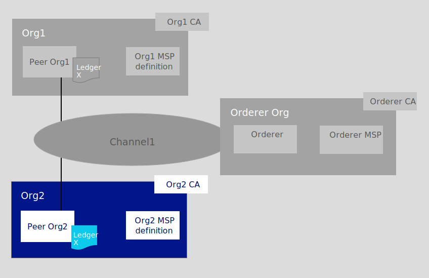

---

copyright:
  years: 2019, 2020

lastupdated: "2020-10-16"

keywords: getting started tutorials, create a CA, enroll, register, create an MSP, wallet, create a peer, create ordering service, Raft, join a network, system channel

subcollection: blockchain

---

{:external: target="_blank" .external}
{:shortdesc: .shortdesc}
{:screen: .screen}
{:codeblock: .codeblock}
{:note: .note}
{:important: .important}
{:tip: .tip}
{:pre: .pre}

# Join a network
{: #ibp-console-join-network}

{{site.data.keyword.blockchainfull}} Platform is a blockchain-as-a-service offering that enables you to develop, deploy, and operate blockchain applications and networks. You can learn more about blockchain components and how they work together by visiting the [Blockchain component overview](/docs/blockchain?topic=blockchain-blockchain-component-overview#blockchain-component-overview). This tutorial is the second part in the [sample network tutorial series](/docs/blockchain?topic=blockchain-ibp-console-build-network#ibp-console-build-network-sample-tutorial) and describes how to create nodes in the {{site.data.keyword.blockchainfull_notm}} Platform console and connect them to a blockchain consortium hosted in another cluster.
{:shortdesc}

**Target audience:** This topic is designed for network operators who are responsible for creating, monitoring, and managing the blockchain network.  

If you have not already used the {{site.data.keyword.blockchainfull_notm}} Platform console to deploy components to a Kubernetes cluster on {{site.data.keyword.cloud_notm}}, see [Getting started with {{site.data.keyword.blockchainfull_notm}} Platform for {{site.data.keyword.cloud_notm}}](/docs/blockchain?topic=blockchain-ibp-v2-deploy-iks#ibp-v2-deploy-iks). Note that the console itself does not reside in your cluster. It is a tool that you can use to deploy components into your cluster.

Whether you deploy components to a paid or free Kubernetes cluster, pay close attention to the resources at your disposal when you choose to deploy nodes and create channels. It is your responsibility to manage your Kubernetes cluster and deploy additional resources if necessary. While components will successfully deploy to an {{site.data.keyword.cloud_notm}} free cluster, the more components you add, the slower your components will run. For more information about component sizings and how the console interacts with your Kubernetes cluster on {{site.data.keyword.cloud_notm}}, see [Allocating resources](/docs/blockchain?topic=blockchain-ibp-console-adv-deployment#ibp-console-adv-deployment-allocate-resources).

## Sample network tutorial series
{: #ibp-console-join-network-structure}

You are currently on the second part of our three-part tutorial series. This tutorial guides you through the process of using the console to create and join a peer node to an existing {{site.data.keyword.blockchainfull_notm}} Platform network. Note that while this tutorial shows how this process works with a paid Kubernetes cluster on {{site.data.keyword.cloud_notm}}, the same basic flow applies to free clusters, albeit with a few limitations (for example, you cannot size or resize nodes in a free cluster).

* [Build a network tutorial](/docs/blockchain?topic=blockchain-ibp-console-build-network#ibp-console-build-network) guides you through the process of hosting a network by creating an ordering service and a peer.
* **Join a network tutorial** (Current tutorial) Guides you through the process of joining an existing network by creating a peer and joining it to a channel.
* [Deploy a smart contract using Fabric v2.x](/docs/blockchain?topic=blockchain-ibp-console-smart-contracts-v2#ibp-console-smart-contracts-v2) provides information on how to write a smart contract and deploy it on your network.

You can use the steps in these tutorials to build a network with multiple organizations in one cluster for the purposes of development and testing. Use the **Build a network** tutorial if you want to form a blockchain consortium by creating an ordering service and adding organizations. Use the **Join a network** tutorial to connect a peer to the network. Following the tutorials with different consortium members allows you to create a truly **distributed** blockchain network.

**Looking for a way to script the deployment of your nodes?** If you are already familiar with the manual process to deploy the components with the console, you can check out the [Ansible playbooks](/docs/blockchain?topic=blockchain-ansible), a powerful tool for scripting the deployment of components in your blockchain network.

This tutorial is meant to show how to join a peer to an **existing** network. It presumes that an ordering service has already been created using another {{site.data.keyword.blockchainfull_notm}} Platform console (it is possible to join peers created in the {{site.data.keyword.blockchainfull_notm}} Platform to any network running Hyperledger Fabric based components using the Fabric APIs or the CLI, but we will not show that process here). If you don't have an existing network to join, visit the [Build a network tutorial](/docs/blockchain?topic=blockchain-ibp-console-build-network#ibp-console-build-network) to learn how to create one. The **Join a network** tutorial takes you through the steps to create the following `Org2` blockchain components, highlighted in the blue box:
{: caption="Figure 1. Join network structure" caption-side="bottom"}  

Perform the steps in the **Join a network** tutorial to create the following components and complete the following actions:

* **One peer organization** `Org2`  
  Create the Org2 Membership Services Provider (MSP) definition which defines the organization `Org2`.
* **One peer** `Peer Org2`   
  The ledger, `Ledger x` in the illustration above, is maintained by distributed peers. The peer is deployed with [Couch DB](https://hyperledger-fabric.readthedocs.io/en/release-2.2/couchdb_as_state_database.html){: external} as the state database.
* **One Certificate Authority (CA)** `Org2 CA`
  A CA is the node that issues certificates to all organization admins as well as to nodes associated with an organization. We will create one CA for the peer organization `Org2`.
* **Joining one channel**
  The tutorial describes how to join the channel that was created by the [Build a network tutorial](/docs/blockchain?topic=blockchain-ibp-console-build-network#ibp-console-build-network).

Throughout this tutorial we supply **recommended values** for some of the fields in the console. This allows the names and identities to be easier to recognize in the tabs and drop-down lists. These values are not mandatory, but you will find them helpful, especially since you will have to remember certain values, especially the IDs and secrets of registered users, you input at a previous step. If you forget these values, you will have to register additional users for your admins and components. We provide a table of the recommended values after each task and recommend that if you do not use sample values that you record the values you do use somewhere as you proceed through the tutorial.
{:tip}

## Step one: Create a peer organization and a peer
{: #ibp-console-join-network-create-ca-org2}

For each organization that you want to create with the console, you should deploy at least one CA. A CA is the node that issues certificates to all network participants (peers, ordering services, clients, admins, and so on). These certificates, which include a signing certificate and private key, allow network participants to communicate, authenticate, and ultimately transact. These CAs will create all of the identities and certificates that belong to your organization, in addition to defining the organization itself. You can then use those identities to deploy nodes, create admin identities, and submit transactions. For more information about your CA and the identities that you will need to create, see [Managing identities](/docs/blockchain?topic=blockchain-ibp-console-identities#ibp-console-identities).

In this tutorial, we will create one organization. Therefore, we will need to create **one CA**.

### Creating your peer organization CA
{: #ibp-console-join-network-create-CA-org2CA}

Your CA issues the certificates and private keys for your organization's admins, client applications, and nodes. These identities are not managed by {{site.data.keyword.IBM_notm}} and the keys are not stored in the console. They are only stored in your browser local storage. Therefore, make sure to export your identities and the MSP of your organization. If you attempt to access the console from a different machine or a different browser, you will need to import these identities and organization definitions.
{:important}

Perform the following steps from your console:  

1. Navigate to the **Nodes** tab on the left and click **Add Certificate Authority**. The side panels will allow you to customize the CA that you want to create and the organization that this CA will issue keys for.
2. In this tutorial, we're creating nodes, so make sure the option to **Create a Certificate Authority** is selected. Then click **Next**.
3. Use the side panel to give your CA a **display name**. Our recommended value for this CA is `Org2 CA`. Then give your CA admin credentials by specifying a **CA administrator enroll ID** of `admin` and a secret of `adminpw`.
4. The **Advanced deployment options**  are only available in paid clusters and can be safely ignored for purposes of this tutorial. For more information about these options, see the links below.
   * [Database and replica sets](/docs/blockchain?topic=blockchain-ibp-console-build-ha-ca#ibp-console-build-ha-ca-create) (Creating an HA CA) This option is only available on paid clusters.
   * [Hardware Security Module (HSM)](/docs/blockchain?topic=blockchain-ibp-console-adv-deployment#ibp-console-adv-deployment-cfg-hsm)
   * [Deployment zone selection](/docs/blockchain?topic=blockchain-ibp-console-ha#ibp-console-ha-multi-zone) (Multizone HA) This option is only visible when your cluster is configured with multiple zones.
   * [Resource allocation](/docs/blockchain?topic=blockchain-ibp-console-adv-deployment#ibp-console-adv-deployment-allocate-resources)
5. Review the Summary page, then click **Add Certificate Authority**. The **Edit configuration JSON** button allows you to override configuration settings for the CA. For this tutorial, the default settings are sufficient. See [Customizing a CA configuration](/docs/blockchain?topic=blockchain-ibp-console-adv-deployment#ibp-console-adv-deployment-ca-customization) to learn more about the options that are available.

**Task: Creating the peer organization CA**

  | **Field** | **Display name** | **Enroll ID** | **Secret** |
  | ------------------------- |-----------|-----------|-----------|
  | **Create CA** | Org2 CA  | admin | adminpw |
  {: caption="Table 1. Creating the peer organization CA" caption-side="bottom"}

After you deploy the CA, you will use it when you create your organization MSP, register users, and to create your entry point to a network, the **peer**.

Advanced users may already have their own CA, and not want to create a new CA in the console. If your existing CA can issue certificates in `X.509` format, you can use certificates from your own third-party CA instead of creating new certificates here. The CA should sign using ECDSA and the defaults should be set to use P256 curve. See this topic on [Using certificates from an external CA with your peer or ordering node](/docs/blockchain?topic=blockchain-ibp-console-adv-deployment#ibp-console-adv-deployment-third-party-ca) for more information.

### Associating the CA admin identity
{: #ibp-console-join-network-ca-admin}

Each CA is created with a CA admin identity. You can use the admin to register new users with your CA and generate certificates. Before you can use the console to operate your CA, you need to associate the CA admin identity with the CA node itself.

Depending on your cluster type, deployment of the CA can take up to ten minutes. When the CA is first deployed (or when the CA is otherwise unavailable), the box in the tile for the CA will be gray box. When the CA has successfully deployed and is running, this box will be green, indicating that it is "Running" and can be operated from the console. Before proceeding with the steps below, you must wait until the CA status is "Running". If the gray box stops blinking, you can try reloading the page in your browser to refresh the status.
{:important}

Once the CA is running, as indicated by the green box in the tile, complete the following steps:

1. Click the `Org2 CA` tile in the **Nodes** tab. Then click **Associate identity** on the CA overview panel.
2. On the side panel that opens, provide an **Enroll ID** of `admin` and an **Enroll secret** of `adminpw`. For the **Identity display name**, you can use the default value of `Org2 CA Admin`.
3. Click **Associate identity** to add the identity into your console Wallet and associate the admin identity with your CA.

After setting the CA admin identity, you will be able to see the table of registered users in the CA overview panel.

**Task: Associate identity**

  |  **Field** | **Display name** | **Enroll ID** | **Secret** |
  | ------------------------- |-----------|-----------|-----------|-----------|
  | **Enroll ID** |  Org2 CA Admin  | admin | adminpw |
  {: caption="Table 2. Associate the CA admin identity" caption-side="bottom"}

You can view the CA admin identity in your console wallet by clicking on the **Wallet** in the left navigation. Click the identity to view the certificate and private key of the CA admin. The identity is not stored in your console or managed by {{site.data.keyword.IBM_notm}}. It is only stored in local browser storage. If you change browsers, you will need to import this identity into your Wallet to be able to operate the CA. Click **Export identity** to download the certificate and private key.

**Task: Check your Wallet**

  | **Field** |  **Display name** | **Description** |
  | ------------------------- |-----------|----------|
  | **Identity** | Org2 CA Admin | Org2 CA admin identity |
  {: caption="Table 3. Check your Wallet" caption-side="bottom"}

### Using your CA to register identities
{: #ibp-console-join-network-use-CA-org2}

Each node or application that you want to create needs certificates and private keys to participate in the blockchain network. You also need to create admin identities for these nodes so that you can manage them from the console. We will create one CA and use it to create two identities:

* **An organization admin**: This identity allows you to operate nodes using the platform console.
* **A peer identity**: This is the identity of the peer itself. Whenever a peer performs an action (for example, endorsing a transaction) it will sign using its certificate.

Once you have associated the CA admin, you can use the CA tile to create these identities by completing the following steps:

1. Click the `Org2 CA` tile and ensure the `admin` identity that you created for the CA is visible in the table. Then click the **Register user** button.
2. First we'll register the organization admin, which we can do by giving an **Enroll ID** of `org2admin` and a **secret** of `org2adminpw`. Then set the `Type` for this identity as `admin`. You can ignore the **Maximum enrollments** field. If you want to learn more about enrollments, see [Registering identities](/docs/blockchain?topic=blockchain-ibp-console-identities#ibp-console-identities-register). Click **Next**.
3. This tutorial does not configure attributes on identities, see [Registering identities](/docs/blockchain?topic=blockchain-ibp-console-identities#ibp-console-identities-register) if you want to learn more. Click **Register user**.
4. After the organization admin has been registered, repeat this same process for the identity of the peer (also using the `Org2 CA`). For the peer identity, give an enroll ID of `peer2` and a secret of `peer2pw`. This is a node identity, so select `peer` as the **Type**. You can ignore the **Maximum enrollments** field and, on the next panel, do not assign any **Attributes**, as before.

Registering these identities with the CA is only the first step in **creating** an identity. You will not be able to use these identities until they have been **enrolled**. For the `org2admin` identity, this will happen during the creation of the MSP, which we will see in the next step. In the case of the peer2 identity, it happens during the creation of the peer.
{:note}

**Task: Register users**

  |  **Field** | **Description** | **Enroll ID** | **Secret** | **Type**
  | ------------------------- |-----------|-----------|-----------|-----------|
  | **Create CA**  | CA admin | admin | adminpw | client |
  | **Register users** |  Org2 MSP Admin  | org2admin | org2adminpw | admin |
  | | Peer identity |  peer2 | peer2pw | peer|
  {: caption="Table 4. Using your CA to register user" caption-side="bottom"}

### Creating the peer organization MSP
{: #ibp-console-join-network-create-peers-org2}

Now that we have created the peer's CA and used it to **register** our organization identities, we need to create a formal definition of the peer's organization, which is known as the Membership Services Provider (MSP) definition. Many peers can belong to an organization. **You do not need to create a new organization every time you create a peer.** Because this is the first time that we go through the tutorial, we will create the MSP definition for this organization. During the process of creating the MSP, we are going to generate certificates for the `org2admin` identity and add them to our Wallet.

1. Navigate to the **Organizations** tab in the left navigation and click **Create MSP definition**.
2. On the first panel, enter `Org2 MSP` as the organization MSP display name and `org2msp` and as the MSP ID. If you plan to specify an MSP other than `org2msp`, make sure to review the guidelines for MSP names in the tooltip. Click **Next**.
3. On the **Root Certificate Authority details** panel, specify the CA you used to register the identities for this organization. If this is your first time through this tutorial, you should only see one: `Org2 CA`. The CA root certificate and TLS CA root certificate are displayed. Click **Next**.
4. On the **Admin certificates panel**, select the enroll ID you created for your organization admin from the drop-down list, `org2admin`, and enter its associated secret, `org2adminpw`. Then, give this identity a display name, `Org2 MSP Admin`. Note: the default display name for this identity is the name of your MSP and the word "Admin". If you select a different name for your MSP, that will be reflected in the default.
5. Click the **Generate** button to enroll this identity as the admin of your organization and export the identity to the Wallet, where it will be used when creating the peer and creating channels.
6. Click **Export** to export the admin certificates to your file system. As we said above, this identity is not stored in your console or managed by {{site.data.keyword.IBM_notm}}. It is only stored in local browser storage. If you change browsers, you will need to import this identity into your Wallet to be able to administer the peer. Click **Next**.  
  Exporting your organization admin identity is important because you are responsible for managing and securing these certificates. If you switch browsers, you will need to import this admin identity otherwise you will not be able to operate Org2.
  {:important}
7. On the **Review MSP information** panel, make sure you have entered the correct information. When you are satisfied, click **Create MSP definition**.
8. After the MSP has been created, click on the tile representing it. Then **download** the MSP to your local filesystem. You will need to send this MSP to all of the organizations the channels you join.

**Task: Create the peer organization MSP definition**

  |  | **Display name** | **MSP ID** | **Enroll ID**  | **Secret** |
  | ------------------------- |-----------|-----------|-----------|-----------|
  | **Create Organization** | Org2 MSP | org2msp |||
  | **Root CA** | Org2 CA ||||
  | **Org Admin Cert** | |  | org2admin | org2adminpw |
  | **Identity** | Org2 MSP Admin |||||
  {: caption="Table 5. Create the peer organization MSP definition" caption-side="bottom"}

After you have created the MSP, you should be able to see the peer organization admin in your **Wallet**, which can be accessed by clicking on the **Wallet** in the left navigation.

**Task: Check your Wallet**

  | **Field** |  **Display name** | **Description** |
  | ------------------------- |-----------|----------|
  | **Identity** | Org2 MSP Admin  | Org2 identity |
  {: caption="Table 6. Check your Wallet" caption-side="bottom"}

For more information about MSPs, see [managing organizations](/docs/blockchain?topic=blockchain-ibp-console-organizations#ibp-console-organizations).

### Creating a peer
{: #ibp-console-join-network-peer-create}

After you have [created a CA](/docs/blockchain?topic=blockchain-ibp-console-join-network#ibp-console-join-network-create-CA-org2CA), used it to register identities, and created the [peer organization MSP](/docs/blockchain?topic=blockchain-ibp-console-join-network#ibp-console-join-network-create-peers-org2), you're ready to create a peer.

**What role do peers play?**
{: #ibp-console-join-network-peer-role}

It's important to remember that organizations themselves do not maintain ledgers. Peers do. Organizations also use peers to sign transaction proposals and approve channel configuration updates. Because having at least two peers on a channel makes them highly available, having at least two peers joined to a channel is considered a best practice for production level implementations. In this tutorial, we'll only show the process for creating a single peer.

From a resource allocation perspective, it is possible to join the same peers to multiple channels. The design of the peer ensures that the data from one channel cannot pass to another through the peer. However, because the peer will store a separate ledger for each channel, it is necessary to ensure that the peer has enough processing power and storage to handle the transaction and data load.

**Deploying your peer**
{: #ibp-console-join-network-deploy-peer-role}

Use your console to perform the following steps:

1. On the **Nodes** page, click **Add peer**.
2. Make sure the option to **Create a peer** is selected. Then click **Next**.
3. Give your peer a **Display name** of `Peer Org2`.
4. The **Advanced deployment options**  are only available in paid clusters and can be safely ignored for purposes of this tutorial. For more information about these options, see the links below.
   * [State database](/docs/blockchain?topic=blockchain-ibp-console-adv-deployment#ibp-console-adv-deployment-level-couch)
   * [Multizone Kubernetes cluster](/docs/blockchain?topic=blockchain-ibp-console-ha#ibp-console-ha-multi-zone) (Multizone HA) This option is only visible when your cluster is configured for multizone support.
   * [Use your own CA certificate and private key](/docs/blockchain?topic=blockchain-ibp-console-adv-deployment#ibp-console-adv-deployment-third-party-ca)
   * [Hardware Security Module (HSM)](/docs/blockchain?topic=blockchain-ibp-console-adv-deployment#ibp-console-adv-deployment-cfg-hsm)
   * [Resource allocation](/docs/blockchain?topic=blockchain-ibp-console-adv-deployment#ibp-console-adv-deployment-allocate-resources)
5. Click **Next**.
6.  On the **Enter peer information** page:
   * Select `Org2 CA`, as this is the CA you used to register the peer identity.
   * Select the **Enroll ID** for the peer identity that you created for your peer from the drop-down list, `peer2`, and enter its associated **secret**, `peer2pw`.
   * Then, select `Org2 MSP` from the drop-down list
   * The **TLS Certificate Signing Request (CSR) hostname** is an option available to advanced users who want to specify a custom domain name that can be used to address the peer endpoint. Custom domain names are not a part of this tutorial, so leave the **TLS CSR hostname** blank for now.
   * In the **Fabric version** drop down list, the best practice is to select the **highest available version**, as it will contain the latest bug fixes. It might also be necessary to select the highest version in order to have access to the latest features. Note that if you select any version higher than v2.0, no smart contract container will be deployed along with your peer. Instead, each smart contract will be deployed into its own pod when it is instantiated on the channel or invoked for the first time. With the exception of smart contracts that run Go chaincode, peer nodes running Fabric v1.4.7 and v2.1.1 are compatible with each other. See this [topic](/docs/blockchain?topic=blockchain-ibp-console-smart-contracts-v2#ibp-console-smart-contracts-v2-write-package-vendor) on vendoring the shim for more information on what is required.
   * Click **Next**.
7. The last side panel asks you to **Associate an identity** to make it the admin of your peer. For the purpose of this tutorial, make your organization admin, `Org2 MSP Admin`, the admin of your peer as well. It is possible to register and enroll a different identity with the `Org2 CA` and make that identity the admin of your peer, but this tutorial uses the `Org2 MSP Admin` identity.
8. Review the summary and click **Add peer**.  The **Edit configuration JSON** button allows you to override configuration settings for the peer. For this tutorial, the default settings are sufficient.  See [Customizing a peer configuration](/docs/blockchain?topic=blockchain-ibp-console-adv-deployment#ibp-console-adv-deployment-peer-create-json) to learn more about the options that are available.

**Task: Deploying a peer**

|  | **Display name** | **MSP ID** | **Enroll ID** | **Secret** |
| ------------------------- |-----------|-----------|-----------|-----------|
| **Create Peer** | Peer Org2 | org2msp |||
| **CA** | Org2 CA ||||
| **Peer Identity** | |  | peer2 | peer2pw |
| **Administrator certificate** | org2msp ||||
| **Associate identity** | Org2 MSP Admin  |||||
{: caption="Table 7. Deploying a peer" caption-side="bottom"}

In a production scenario, it is recommended to deploy three peers to each channel. This is to allow one peer to go down (for example, during a maintenance cycle) and still maintain highly available peers. To deploy more than one peer for an organization, use the same CA you used to register your first peer identity. In this tutorial, that would be `Org2 CA`. Then, register a new peer identity using a distinct enroll ID and secret. For example, `org2secondpeer` and `org2secondpeerpw`. Then, when creating the peer, give this enroll ID and secret. As this peer is still associated with Org2, choose `Org2 CA`, `Org2 MSP`, and `Org2 MSP Admin ` from the drop-down lists. You may choose to give this new peer a different admin, which can be registered and enrolled with `Org2 CA`, but this optional. This tutorial series will only show the process for creating a single peer for each peer organization.
{:tip}

## Step two: Add Org2 to an existing channel
{: #ibp-console-join-network-add-channel}

In the [Build a network tutorial](/docs/blockchain?topic=blockchain-ibp-console-build-network#ibp-console-build-network), Org1 created a channel, `channel1`, with itself as the only member. For Org2 to join this channel, it must export its MSP to Org1:

1. Navigate to the **Organizations** tab. You can see the organizations available for export are listed under **Available organizations**. Click the **Export** button inside the `Org2 MSP` organization tile to download the JSON configuration file that represents the MSP of the peer organization.
2. Send this file to Org1 in an out of band operation.

Then Org1 must complete the following steps in its own console:
1. If the `Org2 MSP` was created by using a different console and sent out of band, it needs to be imported into the console where the ordering service resides. If the `Org2 MSP` is created in the same console where the ordering service resides, you can skip this step: Click the **Organizations** tab then **Import MSP definition**. Click **Add file** and browse to the `Org2 MSP` json file that was sent out of band. Click **Import MSP definition**. The administrator identity for the MSP definition is not required.
2. Navigate to the **Channels** tab, click `channel1`.
3. Click the  **Settings** icon to update the channel and add the peer organization to the channel.
4. In the **Channel updater MSP** drop-down list (under the **Organization updating channel** heading), select `Org1 MSP`. In the **Identity** drop-down list, ensure that `Org1 MSP Admin` is selected.
5. In the **Organizations** section, open the `Select a channel member` drop-down list and select the peer organization MSP, `Org2 MSP`.
6. Click **Add** and then assign permissions for that organization. We recommend you make them an `Operator` so that Org2 can operate the channel (this will allow them to sign channel updates, for example).
7. Under **Update policy**, select `2 out of 2`, meaning both of the organizations need to approve updates to the channel.

At this point no further changes are required on the channel. In the left navigation, click **Review channel information**. On the **Review channel information** panel, you can see that there are now two organization members on the channel, `org1msp` and `org2msp`. In addition the channel update policy has been changed to `2 out of 2`. When you are ready, click **Update channel** to submit your changes.

Org1 must also export its own MSP, `Org1 MSP`, and send it to Org2 in an out of band operation. **All members of a channel should have the MSPs of the other channel members**.
{:important}

At this point, Org2 is listed in the channel configuration and therefore technically part of the channel. However, more steps must still be completed.

### Export the ordering service and its MSP
{: #ibp-console-join-network-export-ordering-service}

This step can be performed either by Org1 or the ordering service admin.
{:tip}

If the ordering service and its MSP are not yet present on the file system of either Org1 or the ordering service, complete the following steps to **Export** the ordering service before it can be imported by the peer organization:

1. Navigate to the ordering service inside the **Nodes** tab. Click the **Export** button beneath the ordering service name to download a JSON configuration file.
2. Send this file to Org2 in an out of band operation. The peer organization administrator can then use the configuration file to add the ordering service to the console.

The rest of the actions in this section and **Step three** need to be performed from the console where the `Org2 MSP` was created.
{:tip}

### Import the ordering service
{: #ibp-console-join-network-import-remote-orderer}

If the `Org2 MSP` was created in the same console as the ordering service, this step can be skipped.
{: note}

Complete the following steps to **import** the ordering service into your console:

1. Navigate to the **Nodes** page and click **Add ordering service**.
2. Click the option to **Import an existing ordering service**.
3. Then click the **Add file** button to select the JSON that represents the ordering service.
4. Click **Add ordering service**.

## Step three: Join your peer to the channel
{: #ibp-console-join-network-join-peer-org2}

Your peer can now be joined to `channel1`.

1. If you are not already there, navigate to the **Channels** tab in the left navigation. <issue-3619>There will not be any channel tiles visible yet. </issue-3619>
2. Click the **Join channel** button to launch the side panels.
3. Select `Ordering Service` and click **Next**.
4. Enter `channel1` and click **Next**.
5. Select which peers you want to join the channel. For purposes of this tutorial, click `Peer Org2`. Leave the tab for **Make anchor peer** selected. It is a best practice for each organization to have at least one anchor peer on each channel, as anchor peers bootstrap the inter-organizational communication that is necessary for [Private Data](https://hyperledger-fabric.readthedocs.io/en/release-2.2/private-data/private-data.html){: external} and [Service Discovery](https://hyperledger-fabric.readthedocs.io/en/release-2.2/discovery-overview.html){: external} to work. While it is only necessary to have one anchor peer on each channel, it does not hurt to make all peer anchor peers. The only downside will be a short term increase in the stress on your communication layer when new organizations join their peers to the channel, as these peers are designed to contact every anchor peer in every organization to find out about the peers belonging to that organization. Note that you can also make a peer an anchor peer later through the **Channels** tab.
6. Click **Join channel**.

In these tutorials, we create all of our peers using default options, which means that every peer uses CouchDB. As a result, you don't have to worry about a conflict between the database type used by your peer and any other peers on the channel. However, in a production scenario, a best practice will be to ensure that the peer you are joining to this channel uses the same database type as other peers on the channel. For more information, see [LevelDB vs CouchDB](/docs/blockchain?topic=blockchain-ibp-console-adv-deployment#ibp-console-adv-deployment-level-couch).
{:important}

## Step four: Creating a channel
{: #ibp-console-join-network-create-channel}

In this tutorial, we will presume that users will not be attempting to edit any of the advanced options. For information about editing advanced options both before and after a channel has been created, see [Advanced channel deployment and management](/docs/blockchain?topic=blockchain-ibp-console-govern#ibp-console-govern).
{: note}

### Join the consortium hosted by the ordering service
{: #ibp-console-join-network-add-org2}

A peer organization must be known to the ordering service before it can create a channel (this is also known as joining the "consortium", the list of organizations known to the ordering service). This is because channels are, at a technical level, **messaging paths** between peers through the ordering service. Just as a peer can be joined to multiple channels without information passing from one channel to another, so too can an ordering service have multiple channels running through it without exposing data to organizations on other channels.

Because only ordering service admins can add peer organizations to the consortium, you need to either:

* **Be** the ordering service admin. In which case you can add the peer organization you created to the consortium directly.
* **Send** MSP information to the ordering service admin, who will add your organization to their consortium.

In the next step, we will show how to add your peer organization to a consortium hosted by an ordering service in another {{site.data.keyword.blockchainfull_notm}} Platform service instance. The tutorial assumes that you have created the ordering service and can follow every step yourself. If the ordering service was created in another console, ensure that the ordering service admin follows the steps marked with the blue "tip" box at the top.

If you followed the Build a network tutorial or if your console already includes the ordering service, you can skip ahead to [Add the peer's organization to the ordering service](/docs/blockchain?topic=blockchain-ibp-console-join-network#ibp-console-join-network-add-org2-local). You can then continue with [Step two: Add the peer's organization to an existing channel](/docs/blockchain?topic=blockchain-ibp-console-join-network#ibp-console-join-network-add-channel).

### Export your organization information
{: #ibp-console-join-network-add-org2-remote}

If the ordering service admin does not already have your MSP, export it and send it to them now.

### Import the organization definition
{: #ibp-console-join-network-import-remote-msp}

This step needs to be completed by an ordering service admin.
{:tip}

Once the MSP representing Org2 has been received, an administrator of the ordering service must import the JSON file by navigated to the **Organizations** tab, clicking the **Import MSP definition** button, and selecting the JSON file that represents the `Org2 MSP` peer organization MSP definition.

### Add Org2 MSP to the ordering service consortium
{: #ibp-console-join-network-add-org2-local}

This step needs to be completed by an ordering service admin.
{:tip}

After the MSP representing Org2 has been imported, use these steps to add the peer organization to the consortium hosted by the ordering service. Only ordering service admins, those who are listed under **Ordering service administrators** in the **Details** tab of the ordering service, can add peer organizations to the consortium. You must have the ordering service organization admin identity in your Wallet to perform this task.

1. Navigate to the **Nodes** tab.
2. Scroll down to the ordering service you want to use and click the tile to open it.
3. Under **Consortium Members**, click **Add organization**.
4. From the drop-down list, select `Org2 MSP`, as this is the MSP that represents `Org2`.
5. Click **Add organization**.

Once your organization is a member of the consortium, you have the ability create a new channel. First, you will need to import the MSP definition of other channel members. Use the steps below to create a channel with two members: the `Org1` that was created in the [Build a network tutorial](/docs/blockchain?topic=blockchain-ibp-console-build-network#ibp-console-build-network) and the `Org2` that was created in the steps above.

### Creating a channel: `channel2`
{: #ibp-console-build-network-create-channel1}

Because the console uses peers to gather information about the channels that the peers belong to, **unless an organization has joined a peer to a channel, it cannot interact with the channel**.

When you have created your CAs, identities, MSPs, ordering service, a peer, have added your peer organization to the consortium, and have imported the MSPs of any organizations who will be joined to this channel, navigate to the **Channels** tab in the left navigation. This is where channel creation and management are handled.

When you first navigate to this tab, it will be empty except for the **Create channel** and **Join channel** buttons. This is because you haven't created a channel and joined a peer to it yet.  

**Creating the channel**
{: #ibp-console-build-network-channels-create}

Perform the following steps from your console:

1. Navigate to the **Channels** tab.
2. Click **Create channel**. The create channel panel will open. From here, you will perform all of the steps to create your channel.
3. On the **Prerequisites** panel, you can decide whether or not you want to specify any **Advanced channel configuration** options. See [Advanced options](/docs/blockchain?topic=blockchain-ibp-console-govern#ibp-console-govern-update-channel-available-parameters-advanced) to learn more. For the purposes of this tutorial, we'll assume you don't want to specify any advanced channel configuration options, so click **Next**.
4. On the **Channel details** page, give you channel a name and specify the ordering service the channel will be hosted on. In this tutorial, our channel is called `channel2` while the ordering service is called `Ordering Service`.
5. On the **Organizations** page, select the organizations who will be part of this channel. Since we have two organizations, select and add `Org1 MSP (org1msp)` and then `Org2 MSP (org2msp)`. After clicking **Add**, you can assign an organization a role on the channel. Because each channel must have at least one operator, make both organizations **Operator**.
6. Next, choose a **Update policy** for the channel. This is the policy that will dictate how many organizations will have to approve updates to the channel configuration. As this channel includes two organizations, this policy should be `2 out of 2`, meaning both organizations have to approve updates to the channel. As you add organizations to the channel, you should change this policy to reflect the needs of your use case. A sensible standard is to use a majority of organizations. For example, `3 out of 5`.
7. On the next page, select the **Organization creating channel**. Because the console allows multiple organizations to be owned by a single user, it is necessary to specify which organization is creating the channel. Because this tutorial is limited to the creation of a single organization, choose `Org2 MSP (org2msp)` from the drop-down list. Likewise, choose `Org2 MSP Admin` as the identity submitting the channel creation request.
8. On the **Review channel information** page, make sure you have entered the correct values in the correct fields. If a required field is missing, you will see an error notification relating to the field or value that must be corrected.

When you are ready, click **Create channel**. You will be taken back to the **Channels** tab and you can see a pending tile of the channel that you just created.

**Task: Create a channel**

  |  **Field** | **Name** |
  | ------------------------- |-----------|
  | **Channel name** | channel2 |
  | **Ordering Service** | Ordering Service |
  | **Organizations** | Org2 MSP |
  | **Channel update policy** | 2 out of 2 |
  | **Access control list** | None |
  | **Channel creator MSP** | Org2 MSP |
  | **Identity** | Org2 MSP Admin  |
  {: caption="Table 8. Create a channel" caption-side="bottom"}

The next step is to join a peer to this channel. Click the pending tile and select the organization peers to be added to the channel.

## Next steps
{: #ibp-console-join-network-next-steps}

After you have joined your peer to a channel, use the following steps to deploy a smart contract and begin submitting transactions to the blockchain:

- [Deploy a smart contract on your network using Fabric v2.x](/docs/blockchain?topic=blockchain-ibp-console-smart-contracts-v2#ibp-console-smart-contracts-v2) using the console.
- After you have installed and instantiated your smart contract, you can [submit transactions using your client application](/docs/blockchain?topic=blockchain-ibp-console-app). The [commercial paper sample](/docs/blockchain?topic=blockchain-ibp-console-app#ibp-console-app-commercial-paper) can be used to deploy an example smart contract and submit transactions from sample application code.

