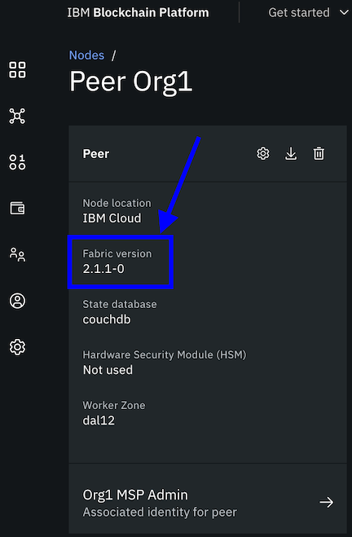

---

copyright:
  years: 2019, 2020
lastupdated: "2020-10-15"

keywords: IBM Blockchain Platform console, administer a console, add users, remove users, modify a user's role, install patches, Kubernetes cluster expiration, iam, refresh cluster, refresh console

subcollection: blockchain

---

{:DomainName: data-hd-keyref="APPDomain"}
{:DomainName: data-hd-keyref="DomainName"}
{:android: data-hd-operatingsystem="android"}
{:apikey: data-credential-placeholder='apikey'}
{:app_key: data-hd-keyref="app_key"}
{:app_name: data-hd-keyref="app_name"}
{:app_secret: data-hd-keyref="app_secret"}
{:app_url: data-hd-keyref="app_url"}
{:authenticated-content: .authenticated-content}
{:beta: .beta}
{:c#: data-hd-programlang="c#"}
{:codeblock: .codeblock}
{:curl: .ph data-hd-programlang='curl'}
{:deprecated: .deprecated}
{:dotnet-standard: .ph data-hd-programlang='dotnet-standard'}
{:download: .download}
{:external: target="_blank" .external}
{:faq: data-hd-content-type='faq'}
{:fuzzybunny: .ph data-hd-programlang='fuzzybunny'}
{:generic: data-hd-operatingsystem="generic"}
{:generic: data-hd-programlang="generic"}
{:gif: data-image-type='gif'}
{:go: .ph data-hd-programlang='go'}
{:help: data-hd-content-type='help'}
{:hide-dashboard: .hide-dashboard}
{:hide-in-docs: .hide-in-docs}
{:important: .important}
{:ios: data-hd-operatingsystem="ios"}
{:java: #java .ph data-hd-programlang='java'}
{:java: .ph data-hd-programlang='java'}
{:java: data-hd-programlang="java"}
{:javascript: .ph data-hd-programlang='javascript'}
{:javascript: data-hd-programlang="javascript"}
{:new_window: target="_blank"}
{:note .note}
{:note: .note}
{:objectc data-hd-programlang="objectc"}
{:org_name: data-hd-keyref="org_name"}
{:php: data-hd-programlang="php"}
{:pre: .pre}
{:preview: .preview}
{:python: .ph data-hd-programlang='python'}
{:python: data-hd-programlang="python"}
{:route: data-hd-keyref="route"}
{:row-headers: .row-headers}
{:ruby: .ph data-hd-programlang='ruby'}
{:ruby: data-hd-programlang="ruby"}
{:runtime: architecture="runtime"}
{:runtimeIcon: .runtimeIcon}
{:runtimeIconList: .runtimeIconList}
{:runtimeLink: .runtimeLink}
{:runtimeTitle: .runtimeTitle}
{:screen: .screen}
{:script: data-hd-video='script'}
{:service: architecture="service"}
{:service_instance_name: data-hd-keyref="service_instance_name"}
{:service_name: data-hd-keyref="service_name"}
{:shortdesc: .shortdesc}
{:space_name: data-hd-keyref="space_name"}
{:step: data-tutorial-type='step'}
{:subsection: outputclass="subsection"}
{:support: data-reuse='support'}
{:swift: #swift .ph data-hd-programlang='swift'}
{:swift: .ph data-hd-programlang='swift'}
{:swift: data-hd-programlang="swift"}
{:table: .aria-labeledby="caption"}
{:term: .term}
{:tip: .tip}
{:tooling-url: data-tooling-url-placeholder='tooling-url'}
{:troubleshoot: data-hd-content-type='troubleshoot'}
{:tsCauses: .tsCauses}
{:tsResolve: .tsResolve}
{:tsSymptoms: .tsSymptoms}
{:tutorial: data-hd-content-type='tutorial'}
{:unity: .ph data-hd-programlang='unity'}
{:url: data-credential-placeholder='url'}
{:user_ID: data-hd-keyref="user_ID"}
{:vb.net: .ph data-hd-programlang='vb.net'}
{:video: .video}


# Administering your console
{: #ibp-console-manage-console}

There are various actions that you can take to manage your console behavior. This topic describes actions outside of the blockchain node operations that aid you in your day-to-day usage of the console.
{:shortdesc}

**Target audience:** This topic is designed for network operators who are responsible for creating, monitoring, and managing the blockchain network.

## Refreshing your console
{: #ibp-console-refresh}

If you are having trouble connecting to your console after you click `Launch the {{site.data.keyword.blockchainfull}} Platform` on the Welcome back panel, or recently upgraded your OpenShift Container platform 3.11 to 4.x, the **Refresh cluster** button is a useful mechanism to renew the connection between your console and your Kubernetes cluster on {{site.data.keyword.cloud_notm}}. It can also be used to upgrade to a newer release of the console, if one is available.

To access this button:
1. Log in to {{site.data.keyword.cloud_notm}} and  open [{{site.data.keyword.cloud_notm}} Resource list](https://cloud.ibm.com/resources){: external}. Ensure that you log in with your {{site.data.keyword.IBM_notm}} ID.
2. Your {{site.data.keyword.blockchainfull_notm}} Platform service instance is visible under the **Services** twistie. Locate and click the {{site.data.keyword.blockchainfull_notm}} Platform service instance that you deployed.
3. On the Welcome Back panel, click **Refresh cluster**. The operation could take a few minutes while it re-establishes connectivity to your Kubernetes cluster and refreshes the management console.
4. Click **Launch {{site.data.keyword.blockchainfull_notm}} Platform** again.

Your console opens in your browser.

## Adding and removing users from the console
{: #ibp-console-manage-console-add-remove}

Every user that accesses the console must be assigned an access policy with an {{site.data.keyword.cloud}} Identity and Access Management (IAM) user role defined. The policy determines what actions the user can perform within the console. The {{site.data.keyword.blockchainfull}} Platform console is provisioned with the email address of the {{site.data.keyword.cloud_notm}} owner as the console administrator.  By default, this {{site.data.keyword.cloud_notm}} user is given the **Manager** role for the {{site.data.keyword.blockchainfull_notm}} Platform service in IAM. The console administrator can then grant other users access to the console by using the IAM UI. For more information about IAM，see [What is IAM](/docs/account?topic=account-iamoverview){: external}.  

For instructions on how to add new user see [Inviting users to an account](/docs/account?topic=account-iamuserinv){: external} with the following additional details:

- Under **Assign users additional access**, click **IAM services**.
- Under **What type of access to you want to assign?**, type **Blockchain Platform**.
- Under **Service Instance Name**, select the service instance where you want to add the user.
- Under **Service access** you can click each pill to see the specific actions associated to each role, similar to the table in the next section.

### Role to permissions mapping table
{: #ibp-console-manage-console-role-mapping}

| Role | Permissions |
|--------|----------|
| Manager | As a Manager, you have permissions beyond the Writer role. You can do everything a Reader and Writer can do as well as: <ul><li>Provision new components such as CAs, peers, and ordering services, by using the console or APIs.</li><li>Override configuration settings on components.</li><li>Delete provisioned components by using the console or APIs.</li><li>Change console logging levels by using the console or APIs.</li><li>Restart the console by using an API.</li><li>Link a blockchain service instance to a Kubernetes cluster.</li></ul> |
| Writer | As a Writer, you have permissions beyond the Reader role, including: <ul><li>Import components by using the console or APIs.</li><li>Remove imported components by using the console or APIs.</li><li>Register users on a CA.</li><li> Add or remove notifications by using the console or APIs.</li><li>Refresh your connected cluster from the service instance.</li></ul>  |
| Reader | As a reader, you can perform read-only actions including: <ul><li>View console UI.</li><li>View console log.</li><li>Export components.</li><li>Issue any GET API.</li><li>View the blockchain console UI.</li></ul> | |
{: caption="Table 1. Role to permissions mapping table" caption-side="bottom"}

 Permissions are cumulative. If you select a **Manager** role, the user will also be able to perform all **Writer** and **Reader** actions, you are not required to additionally check those roles.   Likewise, a user with the `Writer` role will be able to perform all of the actions in the **Reader** role. For console access, you need to only select a role under the **Service Access Roles**, you do not need to select anything under the **Platform Access Roles**. Check the corresponding role under **Assign platform access role** when it is important that the service instance is visible in the invited user's {{site.data.keyword.cloud_notm}} dashboard.

After you add new users to the console, the users might not be able to view all the nodes, channels, or chaincode, which other users deploy. To work with these components, each user needs to import the associated identities into their own console wallet. For more information, see [Storing identities in your console wallet](/docs/blockchain?topic=blockchain-ibp-console-identities#ibp-console-identities-wallet).
{:important}

If you need to modify a user's role:
 1. From the menu bar, click  **Manage** > **Access (IAM)** and then select **Users**.
 2. Click the Actions menu next to the user you want to modify and select **Assign access**.
 3. Select the tile **Assign access to resources**.
 4. From the **Services** drop-down list, select **Blockchain Platform 2.0**.
 5. Scroll down to **Select roles**.
 6. Under **Assign service access roles**, choose a role for the user, which can be **Manager**, **Writer**, and **Reader**.
 7. Click **Assign**.

When you need to remove a user's access to the console, follow instructions in the [IAM Removing users topic](/docs/account?topic=account-remove){: external}.

### Assigning access roles to individual or groups of users in IAM
{: #ibp-console-manage-console-users-groups}

When you set {{site.data.keyword.cloud_notm}} IAM policies, you can assign roles to an individual user or to a group of users.

<dl>
<dt>Individual users</dt>
<dd>You might have a specific user that needs more or less permissions than the rest of your team. You can customize permissions on an individual basis so that each person has the permissions that they need to complete their tasks. You can assign more than one {{site.data.keyword.cloud_notm}} IAM role to each user.</dd>
<dt>Multiple users in an access group</dt>
<dd>You can create a group of users and then assign permissions to that group. For example, you can group all team leaders and assign administrator access to the group. Then, you can group all developers and assign only write access to that group. You can assign more than one {{site.data.keyword.cloud_notm}} IAM role to each access group. When you assign permissions to a group, any user that is added or removed from that group is affected. If you add a user to the group, then they also have the additional access. If they are removed, their access is revoked.</dd>
</dl>

The users that you add in IAM are simply email addresses of users who can log in to the console. They have no relationship to the **Available Organizations** in the Organizations tab or the identities stored by the console wallet.
{:note}

## Updating the administrator email address

If the console is used by multiple people or organizations, it is recommended that you create a functional email address to access your network. The use of a functional email allows you to continue to access the console even when the original administrator leaves your organization or has their email address suspended. Only a single email address can be used as the administrator contact.

To update the email address of the console administrator that was configured when the console was deployed, you must be logged in as the console administrator. Navigate to the **Users** tab and click **Configure** on the **{{site.data.keyword.IBM_notm}} ID** tile. In the panel that opens, specify a new email address for the console administrator.

## Viewing your logs
{: #ibp-console-manage-logs}
{: help}
{: support}

When you use the {{site.data.keyword.blockchainfull_notm}} Platform console, you might need to view logs to debug an issue.

In addition to the console and node logs that are available in the customer clusters, {{site.data.keyword.IBM_notm}} keeps logs regarding {{site.data.keyword.cloud_notm}} account activity on the {{site.data.keyword.blockchainfull_notm}} Platform instance. These logs are not available in customer clusters or their containers. If you need these service management logs, open a support ticket.
{: note}

### Viewing your console logs
{: #ibp-console-manage-console-logs}

You can easily access the console logs if you need to debug problems that you encounter when you use the console or operate your nodes. You can also set the logging level to increase or decrease the amount of logs that the console collects. The console logs are collected separately from the [node logs](/docs/blockchain?topic=blockchain-ibp-console-manage-console#ibp-console-manage-console-node-logs), which are collected by Kubernetes.

Navigate to the **Settings** tab in the console browser to change the logging settings. The console logs are collected from two separate sources:

  * **Client logging:** These logs are collected when commands are sent from your browser to the console.
  * **Server logging:** These logs are collected when the console sends commands to your nodes and from the console deployment. These logs include the Hyperledger Fabric logging output.

Set the amount of collected logs by using the drop-down list under each log type. For example, **Error** and **Warning** collect the least amount of logs, while **Debug** and **All** collect the most.

You can view only the console logs if you are logged in as a console administrator. To view the logs from the **Settings** tab, replace the word `settings` in the browser URL with `api/v1/logs`. For example, if your console URL is `localhost:3001/settings`, you can view your logs by navigating to `localhost:3001/api/v1/logs`. Client and server logs are collected in separate files. The most recent logs are at the top of the page.

### Viewing your node logs
{: #ibp-console-manage-console-node-logs}

The logs of your peers, ordering nodes, and Certificate Authorities (CAs) are collected by the {{site.data.keyword.IBM_notm}} Kubernetes Service or Red Hat OpenShift. Use the steps below to view the logs of your nodes from the cluster where you deployed your {{site.data.keyword.blockchainfull_notm}} Platform network based on the type of cluster you are using.

#### Viewing nodes logs on an {{site.data.keyword.cloud_notm}} Kubernetes Service cluster
{: #ibp-console-manage-console-node-logs-iks}

To more easily locate your node logs, it is recommended to filter on the namespace that was used when the nodes were deployed. To find the namespace, open any CA node in your console and click the **Info and Usage** icon. View the value of the **API URL**. For example: `https://n2734d0-soorg10524.ibpv2-cluster.us-south.containers.appdomain.cloud:7054`.

The namespace is the first part of the URL beginning with the letter `n` and followed by a random string of six alphanumeric characters. So in the example above the value of the namespace is `n2734d0`.

1. Open the [{{site.data.keyword.cloud_notm}} dashboard](https://cloud.ibm.com/resources){: external} and navigate to the overview screen of your {{site.data.keyword.IBM_notm}} Kubernetes Service cluster.
2. Above the cluster overview screen, click **Kubernetes Dashboard**.
3. Inside the Kubernetes dashboard, use the left navigation **Namespace** drop-down list to change to the namespace for your {{site.data.keyword.blockchainfull_notm}} Platform service instance that you discovered above.
4. On the left navigation, click **Pods** to view the list of node pods that you have deployed.
5. Click on a pod. Then click **Logs** on the top menu to open the logs of your node. Above the logs, you can use the drop-down menu after **Logs from** to view the logs from the different containers within the pod. For example, your peer and the state database (CouchDB for example) run in different containers and generate different logs.

#### Viewing nodes logs on a Red Hat OpenShift 4.x cluster
{: #ibp-console-manage-console-node-logs-ocp43}

See the Red Hat OpenShift [documentation](https://docs.openshift.com/container-platform/4.3/logging/cluster-logging-viewing.html#cluster-logging-viewing-logs-console_cluster-logging-viewing){: external}.

### Viewing your smart contract container logs
{: #ibp-console-manage-console-container-logs}

If you encounter issues with your smart contract, you can view the smart contract, or chaincode, logs to debug an issue.  The process to view the logs depends on whether your peer is running a Fabric v1.4 or v2.x image. The Fabric version that the peer is running is visible when you click on a peer node in the console:

  {: caption="Figure 1.How to find peer fabric version" caption-side="bottom"}

####  Hyperledger Fabric v2.x peer image
{: #ibp-console-manage-console-container-logs-2x}

If your peer is based on the Hyperleder Fabric v2.x image, you can run the following set of kubectl commands to view the smart contract logs.

**Find your cluster namespace**  

If you don't already know it, you need to find your Kubernetes cluster namespace.  From the console, open any CA node and click the **Info and Usage** icon. View the value of the **API URL**. For example: `https://nf85a2a-soorg10524.ibpv2-cluster.us-south.containers.appdomain.cloud:7054`. The namespace is the first part of the URL beginning with the letter `n` and followed by a random string of six alphanumeric characters. So in the example above the value of the namespace is `nf85a2a`.

**Find the smart contract pod**  

Next, get a list of all of the chaincode pods running in your cluster:

```
kubectl get po -n <NAMESPACE> | grep chaincode-execution | cut -d" " -f1 | xargs -I {} kubectl get po {} -n <NAMESPACE> --show-labels
```
{:codeblock}
Replacing `<NAMESPACE>` with the name of your cluster namespace.

You should see results similar to:
```
NAME                                                       READY   STATUS            RESTARTS   AGE   LABELS
chaincode-execution-0a8fb504-78e2-4d50-a614-e95fb7e7c8f4   1/1     Running   0          14s   chaincode-id=javacc-1.1,peer-id=org1peer1
NAME                                                       READY   STATUS    RESTARTS   AGE   LABELS
chaincode-execution-f3cc736f-94ef-454d-8da3-362a50c653d9   1/1     Running   0          4m    chaincode-id=nodecc-1.1,peer-id=org1peer1
```
Your smart contract name and version is visible next to the `chaincode-id`.  

**View the logs**  

Then, to view the logs for a specific smart contract pod, run the command:
```
kubectl  logs -f <SMART_CONTRACT_POD> -n <NAMESPACE>
```
{:codeblock}

Replace
- `<SMART_CONTRACT_POD>` with the name of the pod where the chaincode is running.
- `<NAMESPACE>` with the name of your cluster namespace.

For example:
```
kubectl  logs -f chaincode-execution-0a8fb504-78e2-4d50-a614-e95fb7e7c8f4 -n nf85a2a

```
{:codeblock}

####  Hyperledger Fabric v1.4 peer image
{: #ibp-console-manage-console-container-logs-14}

Use these instructions when the peer is based on a Fabric v1.4 image.

##### Viewing smart contract logs on an {{site.data.keyword.cloud_notm}} Kubernetes Service cluster
{: #ibp-console-manage-console-container-logs-iks}

1. Open your Kubernetes dashboard, filter on your [namespace](#ibp-console-manage-console-node-logs), and click the peer pod where the smart contract is running.
2. Click the `Logs` link from your dashboard. By default it points to peer container.
3. Switch to the `dind` container by selecting it from the drop-down list.  

All of your smart contract logs are visible in this window and can be downloaded using the download icon on the panel.

##### Viewing smart contract logs on a Red Hat OpenShift 4.x cluster
{: #ibp-console-manage-console-container-logs-ocp43}

See the Red Hat OpenShift [documentation](https://docs.openshift.com/container-platform/4.3/logging/cluster-logging-viewing.html#cluster-logging-viewing-logs-console_cluster-logging-viewing){: external}. Access the logs for the peer pod where the smart contract is running and select the `dind` container.

### Using LogDNA to view the node logs
{: #ibp-console-manage-console-logdna}

By default, the logs of your nodes are collected locally within your cluster. You can also use {{site.data.keyword.cloud_notm}} services or a third-party service to collect, store, and analyze the logs from your network. For more information, see Logging and monitoring cluster health for the [{{site.data.keyword.IBM_notm}} Kubernetes Service](/docs/containers?topic=containers-health#health){: external} or [OpenShift](/docs/openshift?topic=openshift-health){: external}. It is recommended that you take advantage of the [{{site.data.keyword.cloud_notm}} LogDNA](/docs/Log-Analysis-with-LogDNA?topic=Log-Analysis-with-LogDNA-kube#kube){: external} service that
allows you to easily parse the logs in real time. See this [tutorial](/docs/blockchain?topic=blockchain-ibp-LogDNA) on using LogDNA with the {{site.data.keyword.blockchainfull_notm}} Platform.

## Upgrading your nodes
{: #ibp-console-manage-patch}

The underlying {{site.data.keyword.IBM_notm}} Hyperledger Fabric docker images for the peer, CA, and ordering nodes might need to be updated over time, for example, with security updates or to a new Fabric point release. The **Upgrade available** text on a node tile is the indicator that such a patch is available and can be installed on the node whenever you are ready. Unless otherwise noted in the [Release notes](/docs/blockchain?topic=blockchain-release-notes-saas-20), these upgrades are optional, but recommended. You cannot upgrade nodes that have been imported into the console.

The best practice is to apply upgrades to one node at a time. While the upgrade is being applied, the node is unavailable to process requests or transactions. Therefore, to avoid any disruption of service, whenever possible you should ensure another node of the same type is available to process requests. Upgrading a node takes about a minute to complete and when the update is complete, the node is ready to process requests.
{:note}

For information about how to upgrade a node, check out [Upgrading to the latest version of Fabric](/docs/blockchain?topic=blockchain-ibp-console-govern-components#ibp-console-govern-components-upgrade).

## Kubernetes cluster expiration
{: #ibp-console-manage-console-cluster-expiration}

If you are using a free {{site.data.keyword.cloud_notm}} Kubernetes service cluster, it will expire after 30 days. When this happens, you can no longer access your console. All of the associated nodes and certificates are deleted as well. You can have only one free cluster at a time. Therefore, before you can create another blockchain service instance, you need to ensure that the expired cluster and its associated service instance have been deleted from {{site.data.keyword.cloud_notm}}. To confirm if they have already been deleted or to manually delete these resources, follow these steps:

1. In your {{site.data.keyword.cloud_notm}} dashboard, click the hamburger menu and open the **Resource List**.
2. Scroll to the **Services** twistie and expand it to view your service instance.
3. If your instance is listed, click the action menu for the service instance, then **Delete**, to delete this service instance.
4. Scroll to the **Kubernetes Clusters** twistie and expand it to view your free cluster.
5. If your free cluster is listed, click the action menu for the cluster and then click **Delete** to delete the free cluster.

When these actions are complete, you can follow the [original steps](/docs/blockchain?topic=blockchain-ibp-v2-deploy-iks#ibp-v2-deploy-iks) to create a new Kubernetes cluster and blockchain service instance from the {{site.data.keyword.cloud_notm}} catalog page.

Note that if you delete your Kubernetes cluster, you will still be charged for your {{site.data.keyword.blockchainfull_notm}} Platform service instance until you delete that as well.
{: important}
