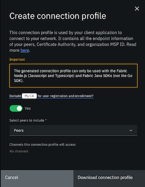

---

copyright:
  years: 2019, 2021
lastupdated: "2021-01-08"

keywords: smart contract, private data, private data collection, anchor peer, instantiation, install smart contract

subcollection: blockchain

---

{:DomainName: data-hd-keyref="APPDomain"}
{:DomainName: data-hd-keyref="DomainName"}
{:android: data-hd-operatingsystem="android"}
{:api: .ph data-hd-interface='api'}
{:apikey: data-credential-placeholder='apikey'}
{:app_key: data-hd-keyref="app_key"}
{:app_name: data-hd-keyref="app_name"}
{:app_secret: data-hd-keyref="app_secret"}
{:app_url: data-hd-keyref="app_url"}
{:authenticated-content: .authenticated-content}
{:beta: .beta}
{:c#: data-hd-programlang="c#"}
{:cli: .ph data-hd-interface='cli'}
{:codeblock: .codeblock}
{:curl: .ph data-hd-programlang='curl'}
{:deprecated: .deprecated}
{:dotnet-standard: .ph data-hd-programlang='dotnet-standard'}
{:download: .download}
{:external: target="_blank" .external}
{:faq: data-hd-content-type='faq'}
{:fuzzybunny: .ph data-hd-programlang='fuzzybunny'}
{:generic: data-hd-operatingsystem="generic"}
{:generic: data-hd-programlang="generic"}
{:gif: data-image-type='gif'}
{:go: .ph data-hd-programlang='go'}
{:help: data-hd-content-type='help'}
{:hide-dashboard: .hide-dashboard}
{:hide-in-docs: .hide-in-docs}
{:important: .important}
{:ios: data-hd-operatingsystem="ios"}
{:java: .ph data-hd-programlang='java'}
{:java: data-hd-programlang="java"}
{:javascript: .ph data-hd-programlang='javascript'}
{:javascript: data-hd-programlang="javascript"}
{:new_window: target="_blank"}
{:note .note}
{:note: .note}
{:objectc data-hd-programlang="objectc"}
{:org_name: data-hd-keyref="org_name"}
{:php: data-hd-programlang="php"}
{:pre: .pre}
{:preview: .preview}
{:python: .ph data-hd-programlang='python'}
{:python: data-hd-programlang="python"}
{:route: data-hd-keyref="route"}
{:row-headers: .row-headers}
{:ruby: .ph data-hd-programlang='ruby'}
{:ruby: data-hd-programlang="ruby"}
{:runtime: architecture="runtime"}
{:runtimeIcon: .runtimeIcon}
{:runtimeIconList: .runtimeIconList}
{:runtimeLink: .runtimeLink}
{:runtimeTitle: .runtimeTitle}
{:screen: .screen}
{:script: data-hd-video='script'}
{:service: architecture="service"}
{:service_instance_name: data-hd-keyref="service_instance_name"}
{:service_name: data-hd-keyref="service_name"}
{:shortdesc: .shortdesc}
{:space_name: data-hd-keyref="space_name"}
{:step: data-tutorial-type='step'}
{:subsection: outputclass="subsection"}
{:support: data-reuse='support'}
{:swift: .ph data-hd-programlang='swift'}
{:swift: data-hd-programlang="swift"}
{:table: .aria-labeledby="caption"}
{:term: .term}
{:tip: .tip}
{:tooling-url: data-tooling-url-placeholder='tooling-url'}
{:troubleshoot: data-hd-content-type='troubleshoot'}
{:tsCauses: .tsCauses}
{:tsResolve: .tsResolve}
{:tsSymptoms: .tsSymptoms}
{:tutorial: data-hd-content-type='tutorial'}
{:ui: .ph data-hd-interface='ui'}
{:unity: .ph data-hd-programlang='unity'}
{:url: data-credential-placeholder='url'}
{:user_ID: data-hd-keyref="user_ID"}
{:vbnet: .ph data-hd-programlang='vb.net'}
{:video: .video}


# Deploy a smart contract using Fabric v1.4 (Legacy)
{: #ibp-console-smart-contracts-v14}
 Learn how to create and package a smart contract, how to install the smart contract on a peer running a Fabric 1.4 image, and how to instantiate the smart contract on a channel using application capability 1.x.
{: shortdesc}


**Target audience:** This topic is designed for network operators who are responsible for creating, monitoring, and managing the blockchain network. Additionally, application developers might be interested in the sections that reference how to create a smart contract.

While the terms "smart contract" and "chaincode" are often used interchangeably, "smart contracts" refers to the business logic that governs transactions and access to its data, while "chaincode" refers to the larger infrastructure of packages and other code that encompasses a smart contract.
{: important}

Smart contracts are installed on peers and then instantiated on channels. **All members that want to submit transactions or read data by using a smart contract need to install the contract on their peer.** A smart contract is defined by its name and version. Therefore, both the name and version of the installed contract need to be consistent across all peers on the channel that plan to run the smart contract.

After a smart contract is installed on the peers, a single network member instantiates the contract on the channel. The network member needs to have joined the channel in order to perform this action. Instantiation updates the ledger with the initial data that is used by the smart contract, and then starts smart contract pods. The peers can then use the smart contract.

- **Only one network member needs to instantiate a smart contract.**
- **If a peer with a smart contract installed joins a channel where the same smart contract version has already been instantiated, the smart contract container starts automatically.**  

In this tutorial, we go through the steps to use the {{site.data.keyword.blockchainfull_notm}} Platform console to manage the deployment of smart contracts on your network:

- [Write and package your smart contract](#ibp-console-smart-contracts-write-package).
- [Install smart contracts on your peers](#ibp-console-smart-contracts-install).
- [Instantiate them on channels](#ibp-console-smart-contracts-instantiate).
- [Specify endorsement policies](#ibp-console-smart-contracts-endorse).
- [Upgrade the smart contract policies and code](#ibp-console-smart-contracts-upgrade).

## Before you begin
{: #ibp-console-smart-contracts-before}

Before you can install a smart contract, ensure that you have the following things ready.

- You must either [build a network](/docs/blockchain?topic=blockchain-ibp-console-build-network#ibp-console-build-network) or [join a network](/docs/blockchain?topic=blockchain-ibp-console-join-network#ibp-console-join-network) by using your {{site.data.keyword.blockchainfull_notm}} Platform console.
- Because smart contracts are installed onto peers, ensure that you [add peers](/docs/blockchain?topic=blockchain-ibp-console-build-network#ibp-console-build-network-create-peer-org1) to your console.
- Smart contracts are instantiated on a channel. Therefore, you must [create a channel](/docs/blockchain?topic=blockchain-ibp-console-build-network#ibp-console-build-network-create-channel) or [join a channel](/docs/blockchain?topic=blockchain-ibp-console-join-network#ibp-console-join-network-join-peer-org2) by using your console.
- The {{site.data.keyword.blockchainfull_notm}} Platform supports smart contracts written in JavaScript, TypeScript, Java, and Go. When you are allocating resources to your peer node, it is important to note that JavaScript and TypeScript smart contracts require more resources than contracts written in Go.


## Step one: Write and package your smart contract
{: #ibp-console-smart-contracts-write-package}

The {{site.data.keyword.blockchainfull_notm}} console manages the *deployment* of smart contracts rather than development. If you are interested in developing smart contracts, you can get started using tutorials provided by the Hyperledger Fabric community and tooling provided by {{site.data.keyword.IBM_notm}}.

- To learn how smart contracts can be used to conduct transactions among multiple parties, see the [Developing applications topic](https://hyperledger-fabric.readthedocs.io/en/release-1.4/developapps/developing_applications.html){: external} in the Hyperledger Fabric documentation.
- When you are ready to start building smart contracts, you can use the [{{site.data.keyword.blockchainfull_notm}} Visual Studio code extension](/docs/blockchain?topic=blockchain-develop-vscode) to start building your own smart contract project. You can also use that extension to [connect directly to your network from Visual Studio Code](/docs/blockchain?topic=blockchain-develop-vscode#develop-vscode-connecting-ibp) and explore the inline tutorials.
- For a quick tutorial on developing smart contracts, see [Develop a smart contract with the IBM Blockchain Platform VS Code extension](https://developer.ibm.com/tutorials/ibm-blockchain-platform-vscode-smart-contract/){: external}.
- For a more in-depth end-to-end tutorial about using an application to interact with smart contracts, see [Hyperledger Fabric Commercial Paper tutorial](https://hyperledger-fabric.readthedocs.io/en/release-1.4/tutorial/commercial_paper.html){: external}.
- To learn about how to incorporate access control mechanisms into your smart contract, see [Chaincode for Developers](https://hyperledger-fabric.readthedocs.io/en/release-1.4/chaincode4ade.html#chaincode-access-control){: external}.

Because Fabric v2.x peers do not have a "shim" (the external dependencies that allowed smart contracts to run on earlier versions of Fabric), you will have to vendor the shim and then repackage any smart contracts written in Golang (Go) that you installed on peers deployed using the 1.4.x Fabric image. Without this vendoring and repackaging, the smart contract will not run on a peer using a Fabric 2.x image. You will not need to do this on smart contracts that are written in Java or Node.js, nor for smart contracts written and packaged using the 2.0 package. See [Vendoring smart contracts](#ibp-console-smart-contracts-write-package-vendor) for details.
{: important}

When you are ready to install and instantiate your smart contract to the {{site.data.keyword.blockchainfull_notm}} platform, the smart contract must be packaged into `.cds` format. For more information, see [Packaging smart contracts](/docs/blockchain?topic=blockchain-develop-vscode#packaging-a-smart-contract). Alternatively, you can use peer CLI commands to build the package. For v1.4.x commands, see [1.4.x peer CLI commands](https://hyperledger-fabric.readthedocs.io/en/release-1.4/commands/peerchaincode.html#peer-chaincode-package){: external}.

### Vendoring smart contracts
{: #ibp-console-smart-contracts-write-package-vendor}

If your smart contract uses the
[fabric-chaincode-go](https://github.com/hyperledger/fabric-chaincode-go/tree/master/shim) shim or the [Go contract-api](https://github.com/hyperledger/fabric-contract-api-go) you need to repackage the smart contract before it can be installed on a peer that is running a Fabric v2.x image.

**Why is vendoring the shim required?**  

In Fabric v1.4.x, the Go chaincode shim and protocol buffers (protos) were included with the Fabric distribution and were included in the Go chaincode runtime in the {{site.data.keyword.blockchainfull_notm}} Platform. Starting with v2.0, Fabric now provides the chaincode [shim](/docs/blockchain?topic=blockchain-glossary#glossary-shim) and protos as separate repositories that need to be imported or "vendored" in Go smart contracts before they can be installed on a peer that runs a Fabric v2.x image. To vendor the shim for your Go smart contract, navigate to your smart contract source folder and initialize the Go module by issuing the following command which creates a `go.mod`file:

```
go mod init
```
{: codeblock}

Add the required imports to `go.mod` by running the following command:
```
go test
```
{: codeblock}

The `go.mod` file will resemble:
```
module mysmartcontract

 go 1.14

 require (
         github.com/hyperledger/fabric-chaincode-go v0.0.0-20200511190512-bcfeb58dd83a
         github.com/hyperledger/fabric-protos-go v0.0.0-20200506201313-25f6564b9ac4
 )
```
or if you are using the `Go contract-api`, it will resemble:
```
module github.com/hyperledger/fabric-samples/chaincode/fabcar/go

go 1.13

require github.com/hyperledger/fabric-contract-api-go v1.1.0
```

You can then get the necessary dependencies to install the Go smart contract on a 2.x peer by issuing the following command that completes the vendoring of the smart contract:

```
go mod tidy
go mod vendor
```
{: codeblock}

See the [Go documentation](https://golang.org/ref/mod){: external} to learn more about what these commands do.  

**Package Construction**  

The following example shows the folder structure of a "marbles" smart contract that uses the fabric-chaincode-go shim before the vendoring process:

```
├── META-INF
│   └── statedb
│       └── couchdb
│           └── indexes
│               └── indexOwner.json
├── marbles_chaincode.go
└── util
    └── util.go
```

And after the vendoring process, the structure is as follows:
```

├── META-INF
│   └── statedb
│       └── couchdb
│           └── indexes
│               └── indexOwner.json
├── go.mod
├── go.sum
├── marbles_chaincode.go
├── util
│   └── util.go
└── vendor
    ├── github.com
    │   ├── golang
    │   │   └── protobuf
    │   └── hyperledger
    │       ├── fabric-chaincode-go
    │       └── fabric-protos-go
    ├── golang.org
    ├── google.golang.org
    └── modules.txt
```
The source directory must be the smart contract name which is "marbles" in this case. Therefore, the import for the util package in the smart contract would be:  
`import "marbles/util"`
{: note}

After you have completed these steps, you need to repackage your smart contract using the process that is described in [Packaging smart contracts](/docs/blockchain?topic=blockchain-develop-vscode#packaging-a-smart-contract).

Fabric-contract-api and fabric-shim node modules must be at v1.4.5 or greater to work with Node version 12. If you are using a smart contract that was originally written to work with Fabric 1.4, check the node modules before deploying your smart contract on a peer that runs a Fabric v2.x image.
{: tip}

## Step two: Install a smart contract
{: #ibp-console-smart-contracts-install}

Use your console to perform these steps:

1. Click the **Smart contracts** tab to install one or more smart contracts.
2. Click **Install smart contract** to upload the smart contract package file in [.cds format](https://hyperledger-fabric.readthedocs.io/en/release-1.4/chaincode4noah.html#packaging){: external}. _The smart contract package file must be less than 25 MB in size._ You can use the {{site.data.keyword.blockchainfull_notm}} Visual Studio Code extension to [create a smart contract package](/docs/blockchain?topic=blockchain-develop-vscode#packaging-a-smart-contract). When you install the package from the **Smart contracts** tab, you can select one or more peer nodes to install the smart contracts on.

If only one peer exists in the console, the smart contract will be installed on it. You are not prompted to select a peer to install the smart contract on. You can navigate to the nodes tab and click a peer that is managed by your console to view the list of smart contracts installed on an individual peer.

You can return to the **Smart contracts** tab later to install the smart contract on additional peers, even after the smart contract was instantiated on the channel. If the version of the smart contract that you install is the same as the instantiated version, these additional peers can process transactions just like the existing peers.
{:tip}

**This console cannot be used to install Hyperledger Composer `.bna` files.**


## Step three: Instantiate a smart contract
{: #ibp-console-smart-contracts-instantiate}

Smart contracts are instantiated on a channel. Any console member with peers joined to a channel can instantiate a smart contract and specify the associated [endorsement policy](/docs/blockchain?topic=blockchain-glossary#glossary-endorsement-policy).

Use your console to perform these steps:

1. On the smart contracts tab, find the smart contract from the list of smart contracts that are installed on your peers and click **Instantiate** from the overflow menu on the right side of the row.
2. On the side panel that opens, select a channel to instantiate the smart contract on. You can select the channel, named `channel1`, which you created. Then, click **Next**.
3. Specify the [endorsement policy for the smart contract](#ibp-console-smart-contracts-endorse), described in the following section. When multiple organizations are members of the channel, you have the opportunity choose how many organizations are required to endorse the smart contract transactions.
4. You also need to select the organization members to be included in the endorsement policy. If you are following along in the tutorial, that would be `org1msp` and possibly `org2msp` if you completed both the **Build a network** and **Join a network** tutorials.
5. On the Select peer panel, select a peer from the drop-down list that is from an organization that is a member of the channel.
6. If your smart contract includes Fabric private data collections, you need to upload the associated collection configuration JSON file, otherwise you can skip this step. For more information, see [private data](#ibp-console-smart-contracts-private-data).
7. On the last panel, you are prompted to specify the name of the smart contract initialization function, along with the associated arguments to pass to that function.

You can view all of the smart contracts that are instantiated on a channel by clicking the channel icon in the left navigation, selecting a channel from the table, and then clicking the **Channel details** tab.

Be aware that if you use a free Kubernetes cluster on {{site.data.keyword.cloud_notm}}, instantiation can take significantly longer than in a paid cluster.Depending on the number of peers you have deployed in your cluster, the type of smart contract you are instantiating, and the platform you are running on, instantiation can take several minutes. If the instantiation fails with a timeout error, wait 5 minutes and then retry it again.
{: tip}

The combination of **installation and instantiation** is a powerful feature because it allows for a peer to use a single smart contract across many channels. Peers may want to join multiple channels that use the same smart contract, but with different sets of network members able to access the data. A peer can install the smart contract once and use it on any channel where it has been instantiated. This lightweight approach saves compute and storage space, and helps you scale your network.

## Step four: Send transactions by using your client applications
{: #ibp-console-smart-contracts-connect-to-SDK}

After a smart contract has been instantiated on a channel, you can use a client application to transact with other members of your network. Applications can invoke the business logic that is contained in smart contracts to create, transfer, or update assets on the blockchain ledger.

### Connect with SDK
{: #ibp-console-smart-contracts-connect-to-SDK-panel}

After you create an organization MSP definition, you can download a connection profile that can be used by a client application to connect to your network via one or more gateway peers. The gateway peers are the peers that are specified in the connection profile, and they are used to perform service discovery to find all of the endorsing peers in the network that will endorse transactions.

Click the **Organization MSP** tile for the organization that your client application interacts with. Click **Create connection profile** to open a side panel where you can build and download your connection profile.

  

If you plan to use the client application to register and enroll users with the organization CA, you need to include the Certificate Authority in the connection profile definition.

Select the peers to include in the connection profile definition. When a peer is not available to process requests from a client application, service discovery ensures that the request is automatically sent to a different peer. Therefore, to accommodate for peer downtime during a maintenance cycle for example, it is recommended that you select more than one peer for redundancy. In addition to peers created by using the console or APIs, imported peers that have been imported into the console are eligible to be selected as well.

The list of channels that the selected peers have joined is also provided for your information. If a channel is missing from the list, it is likely because the peer joined to it is currently unavailable.

You can then download the connection profile to your local file system and use it with your client application to generate certificates and invoke smart contracts.

The connection profile that is downloaded from the {{site.data.keyword.blockchainfull_notm}} Platform console can only be used to connect to your network by using the Node.js (JavaScript and TypeScript) and Java Fabric SDKs.
{: note}

The generated connection profile only supports Fabric CAs. If you manually built your organization MSP with certificates from an external CA, the connection profile will not include any information in the "certificateAuthorities": section.

## Specifying an endorsement policy
{: #ibp-console-smart-contracts-endorse}

Every smart contract must have an endorsement policy, that is specified during instantiation. The endorsement policy specifies the set of organizations, the peers, on a channel that can execute the smart contract and independently validate the transaction output. For example, an endorsement policy can specify that a transaction is added to the ledger only if a majority of the members on the channel endorse the transaction. The organization that instantiates the smart contract can select from among the members who have installed the smart contract to become validators, and sets the endorsement policy for all channel members. You can update your endorsement policy by following the steps for [updating your smart contract](#ibp-console-smart-contracts-upgrade).

When you follow the steps to [instantiate a smart contract](#ibp-console-smart-contracts-instantiate), you can use the side panel to set a contract's endorsement policy after selecting the channel. Use this panel to specify a simple policy by selecting the peers that need to endorse the transaction from the list of peers that have installed the smart contract on the channel. You can use this method to specify an endorsement policy of all channel members, a majority of them, a single member, or a simple +1 preventing members from self-signing. The default endorsement policy is set to `1 of x`, meaning that only a single member of the channel is required to endorse a smart contract transaction.

Click the **Advanced** button if you want to specify a policy in JSON format. You can use this method to specify more complicated endorsement policies, such as requiring that a certain member of the channel must validate a transaction, along with a majority of other members. You can find additional [examples of advanced endorsement policies](https://hyperledger-fabric.readthedocs.io/en/release-1.4/arch-deep-dive.html#example-endorsement-policies){: external} in the Hyperledger Fabric documentation. For more information about writing endorsement policies in JSON, see [Hyperledger Fabric Node SDK documentation](https://hyperledger.github.io/fabric-sdk-node/release-1.4/global.html#ChaincodeInstantiateUpgradeRequest){: external}.

Endorsement policies are not updated automatically when new organizations join the channel and install a smart contract. For example, if the endorsement policy requires two of five organizations to endorse a transaction, the policy will not be updated to require two out of six organizations when a new organization joins the channel. Instead, the new organization will not be listed on the policy, and they will not be able to endorse transactions. You can add another organization to an endorsement policy by upgrading the relevant smart contract and updating the policy.

### What does the user type have to do with the smart contract endorsement policy?
{: #ibp-console-smart-contracts-endorse-user-type}

It's worth clicking the **Advanced** button to review the endorsement policy that will be used for the smart contract. Every organization that you select from the **Members** drop-down list on this panel will be included in the endorsement policy (represented by the role `mspId` parameter in the policy). The value of the role `name` parameter indicates the type of identity that is required to endorse transactions and can be any of  `client`, `peer`, `orderer`, `admin`, or `member`.  If it is set to `member`, then any of the other four roles will satisfy the criteria.

When a `peer` role is specified, you should ensure that any peers that will be submitting endorsement transactions were registered with the correct type. In the following endorsement policy example, peers who are members of `org1msp` can endorse transactions if their enroll id was registered with the type of `client`, `peer`, `orderer`, or `admin`. However, for peers who are members of `org2msp`, their enroll id must have been registered with a type of `peer` to be able to endorse transactions.

```json
{
    "identities": [
        {
            "role": {
                "name": "member",
                "mspId": "org1msp"
            }
        },
        {
            "role": {
                "name": "peer",
                "mspId": "org2msp"
            }
        }
    ],
    "policy": {
        "1-of-2": [
            {
                "signed-by": 0
            }
        ]
    }
}
```  
{: codeblock}

Unsure which `type` was selected when a peer identity was registered? From the console, you can open the CA where the peer identity was registered and view the list of registered users and their associated type.

## Upgrading a smart contract
{: #ibp-console-smart-contracts-upgrade}

You can upgrade a smart contract to change its code, endorsement policy, or private data collection while maintaining its relationship to the assets on the ledger. There are a variety of reasons why you may want to upgrade an instantiated smart contract.
1. You can upgrade the smart contract to add or remove functionality from its code and iterate on the logic of your business network.
2. Whenever a new member is added to a channel, the endorsement policy of the instantiated smart contracts *must* be updated to include the new channel member. In order to work with the new channel member, the smart contract must be repackaged with a new version number and instantiated on the channel, even if the smart contract itself is unchanged. Otherwise, transaction endorsement cannot succeed.
3. When a private data collection has changed, for example an organization is added or removed you need to upgrade your smart contract. Or, use this action whenever a new private data collection is added to the collection configuration JSON file.
4. The smart contract initialization arguments have changed.

Before you upgrade an instantiated smart contract, the new version of the smart contract must be installed on all peers in the channel that are running the previous level of the smart contract.
{:note}

Be aware that after you have upgraded your peers to the v2.x image and switched your application channel capability to 2.0, you can no longer upgrade your smart contract using the instructions in this topic. Instead, you need to repackage your smart contract and [deploy the smart contract on the network using Fabric v2.x](/docs/blockchain?topic=blockchain-ibp-console-smart-contracts-v2).
{: important}

### How to upgrade a smart contract
{: #ibp-console-smart-contracts-upgrade-howto}

To upgrade a smart contract, install the updated code by specifying the same smart contract name but by using and a new version number. If you have installed a newer version of a smart contract on any peer in the channel, notice that the original version now has the `Upgrade Available` button next to it in the **Instantiated smart contracts** table.

{:important}
When a new member that will run the smart contract joins the channel, it is mandatory to update the smart contract by installing a new version on all the peers and instantiating it on the channel with a modified endorsement policy that includes the new member.

- Navigate to the **Smart contracts** tab on the left.
- Scroll down to the **Instantiated smart contracts** table.
- In the **Instantiated smart contracts** table, locate the smart contract version and channel that you want to upgrade. It must have the **Upgrade Available** label next to it.
- Click the **overflow menu** on the right side of the smart contract row and click **Upgrade** to perform the following steps:  

 1. Select the smart contract version that you want to upgrade on the channel from the drop-down list.
 2. Update the endorsement policy by adding or removing channel members. You can also click **Advanced** to paste in a new JSON formatted string, which modifies the existing policy.
 3. On the Select peer panel you need to select a peer that can approve the proposal to upgrade the smart contract. Therefore, you need to select a peer from the drop-down list that is from an organization that was a member of the channel before the smart contract was last instantiated on the channel.
 4. If you want to associate a private data collection configuration file with the smart contract you can upload the JSON file. Or if you want to update an existing collection configuration, you can upload the JSON file.
 If the smart contract was previously instantiated with a collection configuration file, you **must** again upload the previous version or a new version of the collection configuration file during this step.
 5. (Optional) Modify the smart contract initialization argument values if the parameters have changed. If you are unsure about it, check with your smart contract developer. If they have not changed, you can leave this field blank.

After you upgrade the smart contract, you will change the version of the contract that is instantiated on the channel. If you are using private data collections, be sure you have configured anchor peers on the channel.

### Considerations when you upgrade smart contracts
{: #ibp-console-smart-contracts-upgrade-considerations}

1. Do I need to install the new version of the smart contract on all my peers?  

  When a smart contract is invoked on a peer, it attempts to run the version that is instantiated on the channel. If a previous version is running on the peer, it results in an error. Therefore, before you upgrade a smart contract on a channel, *it is a best practice to install the latest version of the smart contract on all peers that are running the previous version.*  

2. Can a subsequent smart contract version still process data on the ledger from a prior version of the smart contract?  

  Yes. As long as the new smart contract code addresses the data in a compatible way (by adding new JSON fields and not changing the semantics or type of the existing fields), any subsequent version of the smart contract can run against the data from a prior version.

3. What happens to my peers if I forget to upgrade them to the latest version before updating the smart contract on the channel?  

  After updating the channel to use the new version of the smart contract, if there are still peers on the channel running the previous version, those peers are no longer able to endorse transactions for the smart contract. Also, you risk not having enough endorsements for transactions to be committed to the ledger, depending on how the smart contract endorsement policy is defined. However, it is possible to install the new version of the smart contract on these peers later and they will again be able to endorse transactions, effectively catching up.

4. What happens when I remove an organization from my private data collection?

   The peers in that organization continue to store data in the private data collection until its ledger reaches the block that removes its membership from the collection. After that occurs, the peers will not receive private data in any future transactions, and _clients_ of that organization will no longer be able to query the private data using a smart contract from any peer.

## Private data
{: #ibp-console-smart-contracts-private-data}

Private data is a feature of Hyperledger Fabric networks at version 1.2 or higher and is used to keep sensitive information private from other organization members **on a channel**. Data privacy is achieved by using [private data collections](https://hyperledger-fabric.readthedocs.io/en/release-1.4/private-data/private-data.html#what-is-a-private-data-collection "What is a private data collection?"){: external}. For example, several wholesalers and a set of farmers might be joined to a single channel. If a farmer and a wholesaler want to transact privately, they can create a channel for this purpose. But they can also decide to create a private data collection on the smart contract that governs their business interactions to maintain privacy over sensitive aspects of the sale, such as the price, without having to create a secondary channel. To learn more about when to use private data within a blockchain, visit the [Private Data](https://hyperledger-fabric.readthedocs.io/en/release-1.4/private-data/private-data.html#private-data "Private data"){: external} concept article in the Fabric documentation.

In order to use private data with {{site.data.keyword.blockchainfull_notm}} Platform, the following three conditions must be satisfied:  
1. **Define the private data collection.** A private data collection file can be added to your smart contract. Then, at run time, your client application can use private data-specific chaincode APIs to input and retrieve data from the collection. For more information about how to use private data collections with your smart contract, see the Fabric SDK tutorial on [Using private data](https://hyperledger.github.io/fabric-sdk-node/release-1.4/tutorial-private-data.html){: external} in the Fabric SDK documentation.  

2. **Deploy the smart contract.** After you define the smart contract private data collection, you need to install the smart contract on the peers that are members of the channel. When you instantiate the smart contract on the channel by using the console, you need to upload the collection configuration JSON file. For more information on how to [create a collection definition JSON file](https://hyperledger.github.io/fabric-sdk-node/release-1.4/tutorial-private-data.html){: external} see the Fabric SDK documentation topic.

  Instead of using the console to install and instantiate your smart contract with a collection config file, you can also use the Fabric SDK. Those instructions are also available under [How to use private data](https://hyperledger.github.io/fabric-sdk-node/release-1.4/tutorial-private-data.html){: external} in the Node SDK documentation.  

  **Note:** A client needs to be an admin of your peer in order to install or instantiate a smart contract by using the SDK. Therefore, you need to download the certificates of the peer admin identity from your console wallet and pass the peer admin's signing certificate and private key to directly to the SDK instead of creating an application identity. For an example of how to pass a key pair to the SDK, see [Connecting to your network by using low-level Fabric SDK APIs](/docs/blockchain?topic=blockchain-ibp-console-app#ibp-console-app-low-level).  

3. **Configure anchor peers.** Because cross organizational [gossip](https://hyperledger-fabric.readthedocs.io/en/release-2.2/gossip.html){: external} must be enabled for private data to work, an anchor peer must exist for each organization in the collection definition. Refer to this information for [how to configure anchor peers](/docs/blockchain?topic=blockchain-ibp-console-govern#ibp-console-govern-channels-anchor-peers) on your network.

Your channel is now configured to use private data.
