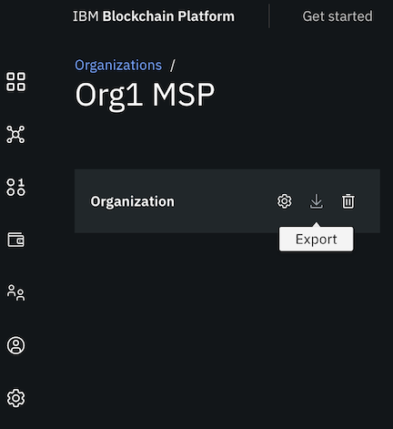

---

copyright:
  years: 2019, 2020
lastupdated: "2020-07-02"

keywords: smart contract, private data, private data collection, anchor peer

subcollection: blockchain

---

{:external: target="_blank" .external}
{:shortdesc: .shortdesc}
{:screen: .screen}
{:codeblock: .codeblock}
{:note: .note}
{:term: .term}
{:important: .important}
{:tip: .tip}
{:pre: .pre}

# Deploy a smart contract on the network using Fabric chaincode lifecycle
{: #ibp-console-smart-contracts-v2}

A new lifecycle to manage smart contracts was introduced in Fabric v2.0 to allow for decentralizing the governance of smart contracts on a channel.   The process for installing, proposing, and updating a smart contract is known as the "lifecycle" of a smart contract. This lifecycle is necessarily ongoing, as it encompasses changes to the smart contract itself as well as updates to a channel, as for example when a new member starts using the smart contract, and is managed through a combination of processes inside and outside the console.

You manage the lifecycle of a smart contract from the **Channels** tab in the console.

## Before you begin
{: #ibp-console-smart-contracts-v2-before}

### Ensure peer is running Fabric v2.x image
{: #ibp-console-smart-contracts-v2-before-fabimage}

To leverage the smart contract lifecycle process, the peer must be running a Fabric v2.x image. The Fabric level of a peer is visible in the console by clicking a peer node to open it.
  {: caption="Figure 1. How to find the Fabric version of the peer" caption-side="bottom"}

If your peer is running a Fabric v1.4.x image, you cannot use this tutorial to manage your smart contract. Instead, see the [Deploy a smart contract on the network](https://cloud.ibm.com/docs/blockchain?topic=blockchain-ibp-console-smart-contracts) tutorial for instructions on how to install and instantiate the smart contract on the channel.

### Create channel and join peers
{: #ibp-console-smart-contracts-v2-before-peer}

Because the lifecycle of a smart contract begins by installing the smart contract on an organization peer on a channel, you need to create a channel and include the organization members. **The channel must be configured to run with the Fabric 2.0 Application capability level**. Second, you need to deploy at least one peer (that must be running the Fabric v2.x image) for your organization and join it to a channel. If you haven't already created a channel and joined at least one peer to it, see the [Build a network](/docs/blockchain?topic=blockchain-ibp-console-build-network#ibp-console-build-network-structure) tutorial for instructions.

### Import organization Membership Service Providers (MSPS)
{: #ibp-console-smart-contracts-v2-before-msps}

A benefit of the decentralized nature of smart contract lifecycle governance is that channel members can agree upon how many organizations on the channel must approve a smart contract definition before it can be committed to a channel. This agreement is described in the channel "Lifecycle Endorsement policy" when the channel is created. Because an approval notification is sent to each organization that is included in the Lifecycle Endorsement policy, the console requires the endpoint address of each organization, which is included in the MSP. Therefore, you must **import the MSP from each organization into your console**. In an out of band operation, for example by email or some other mechanism, each organization administrator needs to export their organization MSP and send the generated JSON file to each organization member so that each admin can import the definition into their console.  

**To export your MSP:**  

  1. Navigate to the **Organizations** tab and click your organization MSP tile.
  2. In the tile that opens, click the **Export** icon.

    {: caption="Figure 1. Export MSP button" caption-side="bottom"}
  3. A JSON file is generated and downloaded to your local system.
  4. Share this file with the other organization admins of your channel.

**To import an MSP from another organization:**  

  1. Navigate to the **Organizations** tab and click **Import MSP**.
  2. Browse to the MSP JSON file and click **Add file**.
  3. Click **Import MSP**.

  Repeat these steps for each organization that is included in your channel Lifecycle Endorsement policy.

## Package smart contract
{: #ibp-console-smart-contracts-v2-pkg}

- Use IBM Developer Tooling, the VS Code extension locally, or Red Hat CodeReady Workspaces in the cloud. Ensure that you are using the [Beta version](https://github.com/IBM-Blockchain/blockchain-vscode-extension/releases/tag/v2.0.0-beta.3) that supports the Fabric v2.0 Lifecycle. New to the VS Code extension? Check out [Developing smart contracts with IBM Blockchain Platform Developer Tools](/docs/blockchain?topic=blockchain-develop-vscode) to get started using the extension to create smart contracts that run on the network and clients applications to send transactions.
- Use the [peer lifecycle chaincode package](https://hyperledger-fabric.readthedocs.io/en/release-2.2/commands/peerlifecycle.html#peer-lifecycle-chaincode-package) CLI.

Smart contracts must be packaged into a `.tar.gz` or `.tgz` format in order to be uploaded to the console. Because the smart contract packaging uses the `tar` format, organizations can easily inspect its contents by using widely available tooling. When it is important to review the smart contract package before approving the definition, the package can be shared out of band with organization members. There is no way to share the package from the console.
{: important}

### Best Practice
{: #ibp-console-smart-contracts-v2-pkg-best-practice}

**Versioning a smart contract**  

It is likely that you will need to modify the smart contract over time as channel members agree to changes in the business logic. Or, your organization may prefer to implement certain aspects of the logic according to your business needs. Regardless, the platform recommends using the following convention:

In order to facilitate the smart contract versioning process, package naming should be of the format:  
`{SMART_CONTACT_NAME}_{VERSION}`

where`{VERSION}` contains:
 - `n.n` when the version requires approval across organizations in the channel. For example,  `mysmartcontract_1.0`.
 - `n.n.n` when the version does not require approval from other organizations on a channel. For example,  `mysmartcontract_1.0.1`. This updated version of the smart contract package cannot introduce any modifications the to read/write set that could cause transaction endorsement to fail.  Use this option to incrementally patch your smart contract as needed.

Although this recommended convention is not enforced by Fabric, it provides a standard nomenclature for you to update the smart contract on your organization's peers without requiring approval from other channel members.  
{: important}

Organizations on the channel can share their smart contract packages with other channel members, out of band, or each organization can package their own version of the smart contract. The important thing is that every organization installs a package with the same business logic, to allow transaction endorsement to succeed across all peers on the channel. Each organization needs to ensure that the smart contract transactions are deterministic. That is, each transaction must always generate the same transaction response for a given set of transaction inputs. That's because the smart contract is run by multiple organizations, each of whom must generate the same transaction response. If not, the resulting generated transaction will be captured in the ledger as invalid, and the world state will not be updated. The transaction has no effect on the ledger.

## Install and Propose smart contract
{: #ibp-console-smart-contracts-v2-install-propose}

After packaging a smart contract, its lifecycle on the channel begins by installing the smart contract on your own organization peers and proposing the smart contract definition to the other channel members. You install a smart contract **package** and propose a smart contract **definition**.
 All lifecycle actions are managed from the **Channels** tab in the console.

1. Navigate to the **Channels** tab and click **Propose smart contract definition**. This single action actually performs two tasks. It _installs_ a smart contract on one or more of your peers and _proposes_ the smart contract definition to the channel.

2. Because the console allows you to act as multiple organizations from a single console, you must first select the organization that is proposing this smart contract and the associated admin identity.

3. On the next panel, browse to your smart contract package and click **Add file**.  You can install a new package or browse to an existing package.
  Smart contract packages must be of type `.tgz` or `.tar.gz`.
  {: tip}

4. On the **Smart contract details** panel you can specify the name and version to use for this smart contract. The console extracts these values from the package name itself but you can override them and specify any values that your organization prefers. Keep in mind, other organizations approve this definition.

5. On the **Install smart contract** panel, you can install the smart contract on all your peers on the channel or just a subset. In a production network, for redundancy reasons, you should install the smart contract on at least two peers.
  Since you are proposing the smart contract, it must be installed on at least one peer.
  {: note}

6. On the **Transaction endorsement policy** panel, you can designate how many organizations need to endorse a smart contract transaction before it can be committed to the ledger.  The default policy says that a MAJORITY of channel members needs to endorse a transaction before it can be committed. When you decline to use the default policy, you can specify your select specific organizations or paste in your own policy JSON. Remember, this transaction endorsement policy becomes part of the proposal that must be agreed to by the other channel members before the smart contract can be committed to the channel.

7. If your smart contract includes Fabric private data collections, you need to upload the associated collection configuration JSON file on the **Additional private data collection** panel. Otherwise, you can skip this step. For more information, see [private data](/docs/blockchain?topic=blockchain-ibp-console-smart-contracts#ibp-console-smart-contracts-private-data).

8. Your smart contract proposal definition is listed on the **Summary panel**. Everything that you selected on the previous panels become part of the proposal definition. It also includes the list of organization members that will receive the proposal notification. Once a proposal is created, the definition cannot be modified.
  Proposal definitions cannot be modified after they are created. If, after creating the proposal you realize that changes are required to the definition, you need to create a new proposal. However, you are permitted to update the package on the proposal.
  {: important}

9. When you are satisfied with the proposal, click **Propose** to install the smart contract on the selected peers and send an approval notification to the channel members. When the proposal is successful, it is visible in the **Channels** tab under **Smart contract definitions** with a status of **_Proposed_** on the tile. It is also visible to members of the channel Lifecycle Endorsement policy under the console Notifications (bell) icon.

If other organizations will run the package on their peers, you need to share the name of the package with them out of band, so they can select it and install it on their peers when they approve the smart contract definition. The smart contract package name is included on the Summary panel.
{: tip}

## Approve smart contract definition
{: #ibp-console-smart-contracts-v2-approve}

The decentralized governance of the smart contract lifecycle requires that the specified number of organizations in the channel Lifecycle Endorsement policy approve the smart contract definition before it can be committed to a channel. All organizations listed in the channel Lifecycle Endorsement policy receive a notification when a proposal definition is submitted to the channel. They can access the proposal from the Notification (bell) icon in the console or simply open the **Channels** tab where they can find the smart contract definition tile in the `Proposed` state. Clicking the tile or the notification opens the same approval panel.  

Proposal originators can view the proposal using the same mechanisms. However, by virtue of submitting the proposal, their approval is automatic.  

**Channel members approve the smart contract definition, not the smart contract package**, which contains the business logic that runs on a peer. A smart contract proposal contains the following information:
- Smart contract name
- Version
- Transaction endorsement policy
- Private data collection JSON (if the smart contract uses private data collections)

The members, including the originator, cannot change the definition. They can simply approve it or choose not to approve it. If the required approvals based on the channel Lifecycle Endorsement policy are not met, the smart contract cannot be committed to the channel.

Channel members can choose among these options:
- **Approve the definition, but do not install the package on any of their peers.** Useful when the smart contract can run on the channel but is not required for your organization.

- **Approve the definition and install the existing package on one or more of peers in their organization.** The proposal originator needs to provide the package name to the channel members so they can select it from the list of existing packages. Because there is no validation or enforcement for selecting the correct package definition, **pay careful attention to the package you select.**

- **Approve the definition but upload their own package and install it on one or more peers in their organization.** When an organization prefers to run their own version of the smart contract package on the channel, they would select the option to **Install a smart contract package** and then upload their own file.

- **If a member wants to reject the smart contract proposal, they should simply abstain from approving the definition.**  Instead, they can create their own smart contract proposal with the definition they prefer and either upload a new smart contract package or use the existing one from the original proposal.  

After you approve a smart contract proposal and while it is waiting for approvals from other members, you can still update the package for your organization, or install it on additional peers if needed. Simply, reopen the proposal tile on the **Channels** tab and click **Update** next to your organization to upload a new package.  If you do upload a new package, when you create the updated package, we recommend incrementing the third digit of the version on the package name to help you differentiate the packages. For example, if the existing package is named `MySmartContract@1.0.0.tar.gz`, the new package is named `MySmartContract@1.0.1.tar.gz`.

The **Approve** or **Update** buttons are not visible on the panel when the console user does not have an identity in their wallet for a listed organization.
{: note}

## Commit smart contract definition
{: #ibp-console-smart-contracts-v2-commit}

