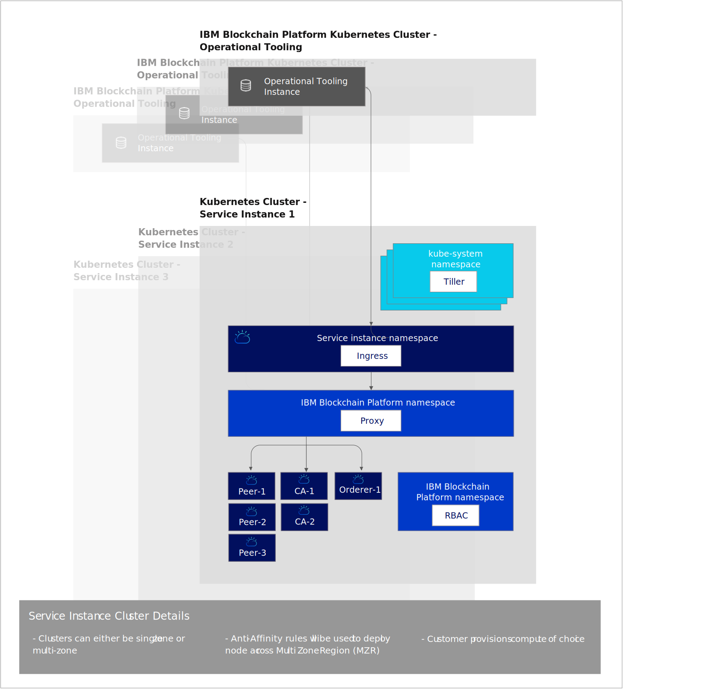

---

copyright:
  years: 2019, 2020
lastupdated: "2020-02-05"

keywords: key features, build, operate, grow, architecture, multizone clusters

subcollection: blockchain

---

{:external: target="_blank" .external}
{:shortdesc: .shortdesc}
{:screen: .screen}
{:codeblock: .codeblock}
{:note: .note}
{:important: .important}
{:tip: .tip}
{:pre: .pre}

# About {{site.data.keyword.blockchainfull_notm}} Platform for {{site.data.keyword.cloud_notm}}
{: #ibp-console-overview}

The {{site.data.keyword.blockchainfull}} Platform for {{site.data.keyword.cloud_notm}} is the next generation of {{site.data.keyword.blockchainfull_notm}} Platform offerings, which gives you total control over your deployments, certificates, and private keys. It includes the new {{site.data.keyword.blockchainfull_notm}} Platform console, a user interface that can simplify and accelerate the process of deploying components into an {{site.data.keyword.cloud_notm}} Kubernetes Service managed and controlled by you. For more information about Kubernetes and {{site.data.keyword.cloud_notm}} Kubernetes Service, see [Kubernetes](/docs/blockchain/reference?topic=blockchain-k8s-overview).
{:shortdesc}

{{site.data.keyword.blockchainfull_notm}} Platform for {{site.data.keyword.cloud_notm}} is based on Hyperledger Fabric v1.4.3. For more information about Hyperledger Fabric v1.4.3 new features, see [What's new in 1.4](https://hyperledger-fabric.readthedocs.io/en/release-1.4/whatsnew.html){: external}.

If you are interested in learning more about how to use {{site.data.keyword.blockchainfull_notm}} Platform on Red Hat OpenShift Container Platform, Red Hat Open Kubernetes Distribution, {{site.data.keyword.cloud_notm}} Private V3.2.1 or any Kubernetes v1.14 - v1.16 container platform on x86_64 hardware, see [Getting started with IBM Blockchain Platform v2.1.2](/docs/blockchain-rhos?topic=blockchain-rhos-get-started-console-ocp).

If you are an experienced Hyperledger Fabric customer and are interested in learning more about how to use the  {{site.data.keyword.blockchainfull_notm}} peer, CA, orderer, and smart contract containers images, see [Using the {{site.data.keyword.blockchainfull_notm}} images ](/docs/blockchain-rhos?topic=blockchain-rhos-blockchain-images).

## What the new release offers
{: #ibp-console-overview-capabilities}

This latest release is tailored to experienced {{site.data.keyword.blockchainfull_notm}} and Hyperledger Fabric users and lets them host and join {{site.data.keyword.blockchainfull_notm}} networks. If you are an existing Starter or Enterprise Plan customer, instead of {{site.data.keyword.IBM_notm}} managing your network, you now have total control with the ability to provision, monitor, and manage your components inside your own Kubernetes cluster.

This {{site.data.keyword.blockchainfull_notm}} Platform release includes the following key features:

**BUILD ---- Integrated developer experience**
- **Easily code** your smart contracts in Node.js, Golang, or Java, write client applications using the new {{site.data.keyword.blockchainfull_notm}} VS Code extension, leverage **SDK integration** with the console, and learn from our rich tutorials and samples.
- **Simplified DevOps** allows you to move from development to test to production in a single environment by scaling up your Kubernetes resources to add more components.
- **Up-to-date Fabric key features**. Leverage the latest features of Hyperledger Fabric v1.4.3 (note that [Node organizational units (OUs)](https://hyperledger-fabric.readthedocs.io/en/release-1.4/msp.html){: external} are not currently usable with the console):
  -  [Raft ordering service](https://hyperledger-fabric.readthedocs.io/en/release-1.4/orderer/ordering_service.html#raft){: external}
  - [**Private data** collections](/docs/blockchain?topic=blockchain-ibp-console-smart-contracts#ibp-console-smart-contracts-private-data) provide increased data privacy by ensuring that ledger data is shared to only authorized peers via the gossip protocol.
  - [Service Discovery](https://hyperledger-fabric.readthedocs.io/en/release-1.4/discovery-overview.html){: external}, allows you to dynamically discover and update how your application interacts with your network.
  - [Channel Access Control Lists](https://hyperledger-fabric.readthedocs.io/en/release-1.4/access_control.html){: external} allow additional control over the governance of your channels and smart contracts.
- {{site.data.keyword.cloud_notm}} service integration. Leverage the built-in [{{site.data.keyword.cloud_notm}} services](/docs/blockchain?topic=blockchain-ibp-v2-deploy-iks#ibp-v2-deploy-iks-integrations), such as {{site.data.keyword.cloud_notm}} Kubernetes Service Dashboard, {{site.data.keyword.IBM_notm}} Log Analysis with LogDNA, and {{site.data.keyword.cloud_notm}} Identity and Access Management (IAM).

**OPERATE --- Total control of your deployments**
- **Deploy only the components you need**. Connect a peer to multiple channels and networks, or host an ordering service that business partners can connect to.
- **Maintain complete control of your identities**. Store and manage the keys that are used to administer your nodes without storing your private keys on the {{site.data.keyword.cloud_notm}}.
- **Centralized operation**. The {{site.data.keyword.blockchainfull_notm}} Platform console allows you to deploy and manage all of your organizations and nodes in **one central console** without having to rely on {{site.data.keyword.IBM_notm}} or other vendors to manage your orderers or Certificate Authority. You can also add or remove members from a blockchain consortium, create and join channels, and install and instantiate smart contracts from your console.
- **Host or join a network**. Deploy peers hosted in your cluster to multiple channels on multiple clouds, or invite other organizations to join your consortium or channels while the organizations manage their nodes independently across infrastructures.
- **Manage access** of the users who can administer or monitor your nodes.
- **Direct access to the logs** of your nodes from the {{site.data.keyword.IBM_notm}} Kubernetes service. Use the {{site.data.keyword.cloud_notm}} Log Analysis service or a third-party service to extract and analyze your logs.
- **Interact directly with your pods** using the Kubernetes Dashboard. Exec into your pods and containers to execute commands and update certificates from the command line.
- **Dynamic signature collection** that allows better control over collaborative governance over channel configurations.

**GROW --- Scalability and flexibility**
- **Choose your compute**. You have the flexibility to decide the amount of CPU, memory, and storage you want to provision in your Kubernetes cluster. For more information, see [How the {{site.data.keyword.cloud_notm}} Kubernetes Service interacts with the console](/docs/blockchain?topic=blockchain-ibp-console-govern-components#ibp-console-govern-components-iks-console-interaction).
- **Scale** up and down the resources in your Kubernetes cluster, paying for only what you need. For more information see [Pricing](/docs/blockchain?topic=blockchain-ibp-saas-pricing).
- **Disaster recovery and multi-region high availability.** This option duplicates your Kubernetes deployment across regions, enabling high availability (HA) of your components and disaster recovery (DR).
- **Run Anywhere**. Thanks to the **unified codebase** of the {{site.data.keyword.blockchainfull_notm}} Platform console, it is possible to run your components on {{site.data.keyword.cloud_notm}}, {{site.data.keyword.cloud_notm}} Private, and third-party public clouds.
- **Connect to other Fabric networks**: Join {{site.data.keyword.blockchainfull_notm}} Platform peers to any network running Hyperledger Fabric components. Similarly, you can invite Fabric peers to join channels hosted on an ordering service deployed on the {{site.data.keyword.blockchainfull_notm}} Platform. Note that you will need to use Hyperledger Fabric APIs or the CLI.

Check out this [blog](https://www.ibm.com/blogs/blockchain/2019/02/taking-the-next-step-towards-deploying-blockchain-anywhere){: external} on taking the next step towards deploying blockchain for business anywhere.

This offering is intended for experienced Fabric users who want to build and manage their own networks.

## Considerations
{: #ibp-console-overview-considerations}

Before you deploy the console, ensure that you understand the following considerations:

- All peers deployed with this release use CouchDB as their state database.
- You are responsible for the management of health monitoring, security, and logging of your Kubernetes cluster. See this [information](/docs/containers?topic=containers-responsibilities_iks#your-responsibilities-by-using-ibm-cloud-kubernetes-service){: external} for details on what {{site.data.keyword.cloud_notm}} manages and what you are responsible for.
- You are also responsible for monitoring the resource usage of your Kubernetes cluster. To monitor your Kubernetes resources, we recommend using the [{{site.data.keyword.cloud_notm}} SysDig](https://www.ibm.com/cloud/sysdig){: external} tool in combination with your {{site.data.keyword.cloud_notm}} Kubernetes dashboard. If you need to increase storage capacity or performance of your cluster, see this information on how to [modify your existing volume](/docs/containers?topic=containers-file_storage#change_storage_configuration){: external}.
- You are responsible for managing and securing your certificates and private keys. {{site.data.keyword.IBM_notm}} does not store your certificates in the Kubernetes cluster or in the console. They are only kept in the local storage of your browser. If you switch browsers, you will have to import your created identities into that browser.
- {{site.data.keyword.blockchainfull_notm}} Platform is available in select regions. Refer to this topic on [{{site.data.keyword.blockchainfull_notm}} Platform locations](/docs/blockchain?topic=blockchain-ibp-regions-locations) for an updated list.
- {{site.data.keyword.blockchainfull_notm}} Platform cannot be deployed on OpenShift clusters created using the {{site.data.keyword.IBM_notm}} Kubernetes service.
- Your {{site.data.keyword.cloud_notm}} Kubernetes cluster must be version 1.13, 1.14, or 1.15.
- If you do not want to use the default Bronze File storage that is pre-selected for you when you provision a Kubernetes cluster in {{site.data.keyword.cloud_notm}}, you can provision storage of your choice. See this topic on [Persistent storage considerations](/docs/blockchain?topic=blockchain-ibp-v2-deploy-iks#ibp-console-storage) to learn more.
- If you decide to include {{site.data.keyword.cloud_notm}} multi-zone support in your Kubernetes cluster, you must provision your own storage. See [Using Multizone (MZR) clusters with {{site.data.keyword.blockchainfull_notm}} Platform](/docs/blockchain?topic=blockchain-ibp-v2-deploy-iks#ibp-console-mzr) for more details.
- You can preview the {{site.data.keyword.blockchainfull_notm}} Platform at no charge for 30 days when you link your {{site.data.keyword.blockchainfull_notm}} Platform service instance to an {{site.data.keyword.cloud_notm}} Kubernetes free cluster.  Performance will be limited by throughput, storage and functionality. {{site.data.keyword.cloud_notm}} will delete your cluster after 30 days and you cannot migrate any nodes or data from a free cluster to a paid cluster. If you choose a paid Kubernetes cluster instead of the limited free cluster, you will incur charges for the Kubernetes service to your {{site.data.keyword.cloud_notm}} account.
- Kubernetes clusters that are configured with private VLANs are not supported.

## Migration
{: #ibp-console-overview-migration}

Currently, migration from any {{site.data.keyword.blockchainfull_notm}} platform offering to the {{site.data.keyword.blockchainfull_notm}} Platform for {{site.data.keyword.cloud_notm}} is not possible.

## License and pricing
{: #ibp-console-overview-license-and-pricing}

{{site.data.keyword.blockchainfull_notm}} Platform for {{site.data.keyword.cloud_notm}} introduces a new hourly pricing model based on virtual processor core (VPC) usage. The simplified model is based on the amount of CPU (or VPC) that your {{site.data.keyword.blockchainfull_notm}} Platform nodes consume on an hourly basis, at a flat rate of **$0.29 USD/VPC-hour**, where **1 VPC = 1 CPU**. See this topic on [Pricing](/docs/blockchain?topic=blockchain-ibp-saas-pricing) for more details.

## Getting started
{: #ibp-console-overview-deploy}

For information about how to deploy {{site.data.keyword.blockchainfull_notm}} Platform for {{site.data.keyword.cloud_notm}}, see [Getting started with {{site.data.keyword.blockchainfull_notm}} Platform for {{site.data.keyword.cloud_notm}}](/docs/blockchain?topic=blockchain-ibp-v2-deploy-iks#ibp-v2-deploy-iks).

For more information about how to use the console to start deploying nodes and building consortium, see the [Building your network](/docs/blockchain?topic=blockchain-ibp-console-build-network#ibp-console-build-network) tutorial. This tutorial guides you through the process of using the console to create a sample network with three organizations, one ordering organization, two peer organizations, and a channel with two peers joined to it. You can use this sample network to for demos or proofs of concept or adjust and expand the steps in the tutorial to create your own custom blockchain configuration.

## Architecture reference
{: #ibp-console-overview-architecture}

The following illustration shows the components of your blockchain network and how they interact.
{: caption="Figure 1. Architecture reference" caption-side="bottom"}

Notice how a single instance of the console, also known as Operational Tooling, is created for each {{site.data.keyword.blockchainfull_notm}} Platform Service Instance. When a peer, orderer or CA node is deployed by using the console, it is deployed into the **Kubernetes Cluster Service Instance**.

| **{{site.data.keyword.blockchainfull_notm}} Platform Kubernetes Cluster** | **Description** |
| ------------------------- |-----------|
| Operational Tooling | Also known as the `console`, this is your central user interface for operating all of your blockchain components. With this console you can now create CA, peer, and orderer nodes, create channels and install and instantiate smart contracts developed with the Hyperledger Fabric v1.4 VS Code extension. The console is deployed in an {{site.data.keyword.IBM_notm}}-owned cluster. There is no charge for this tooling or the Kubernetes cluster where it runs.|
{: caption="Table 1.Components that reside in the {{site.data.keyword.blockchainfull_notm}} Platform Kubernetes Cluster" caption-side="bottom"}

| **Kubernetes Cluster Service Instance** | **Description** |
| ------------------------- |-----------|-----------|-----------|
| **Tiller** | Part of the [Helm tooling](https://docs.helm.sh/glossary/#tiller){: external}, the Tiller runs inside the Kubernetes cluster to manage the installations of your peer, CA and orderer Helm charts. |
| **Ingress** | A [Kubernetes object](https://kubernetes.io/docs/concepts/services-networking/ingress/){: external} that allows access to the cluster resources from outside the cluster. |
| **Proxy** | The {{site.data.keyword.blockchainfull_notm}} Platform proxy is responsible for routing traffic to the correct peer, CA and orderer nodes by using host header routing. |
| **Peers, CAs, Orderers** | These are the nodes that are created by deploying the underlying helm charts. Note: These nodes could also be imported from other Kubernetes Cluster Service Instances. Because the keys are never stored by {{site.data.keyword.IBM_notm}}, every peer and orderer node includes a gRPC web proxy that allows the console to communicate with each node by using the keys in the console wallet. |
| **RBAC** | Role based access control.  The {{site.data.keyword.blockchainfull_notm}} Platform configures [Kubernetes RBAC](https://kubernetes.io/docs/reference/access-authn-authz/rbac/){: external} in the cluster which is required to manage blockchain components in the cluster.
{: caption="Table 2.Components that reside in the customer Kubernetes Cluster" caption-side="bottom"}

## Getting support
{: #ibp-console-overview-support}

For more information about how to get support on {{site.data.keyword.blockchainfull_notm}} Platform for {{site.data.keyword.cloud_notm}}, as well as free blockchain developer resources and support forums that you can use to troubleshoot problems, see [Getting support](/docs/blockchain?topic=blockchain-blockchain-support#blockchain-support).
