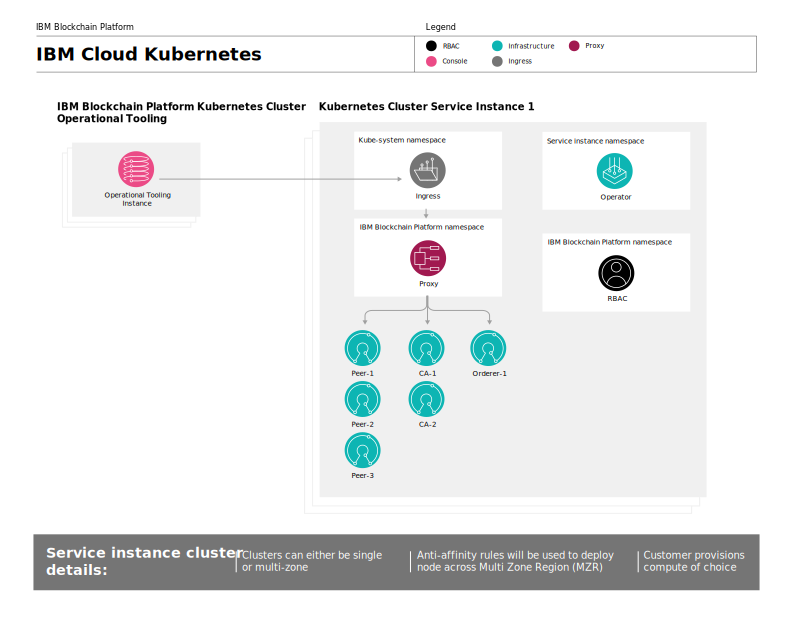
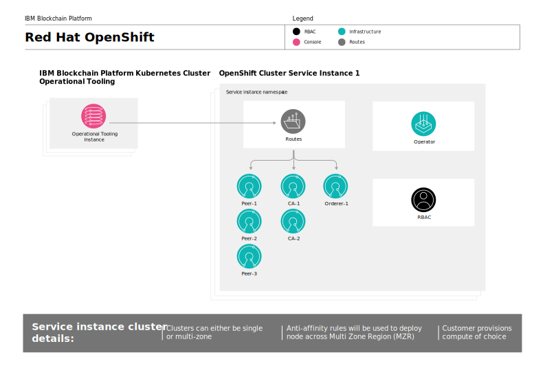
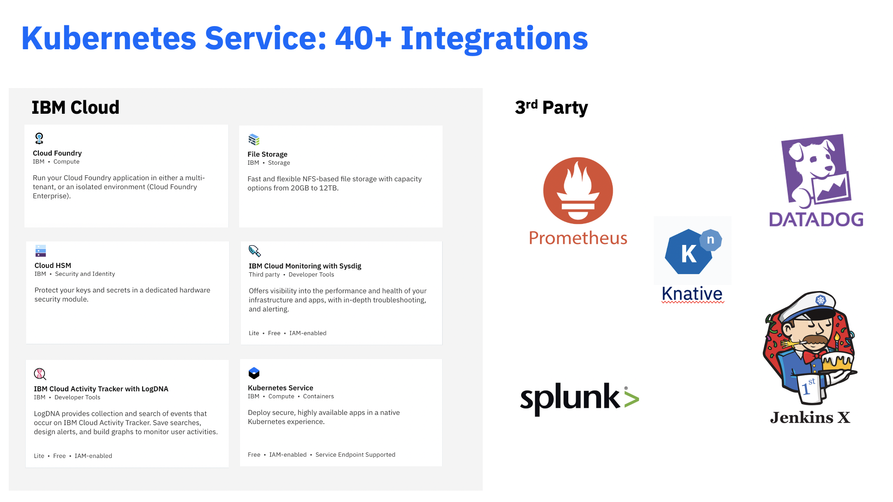

---

copyright:
  years: 2019, 2020
lastupdated: "2020-06-24"

keywords: key features, build, operate, grow, architecture, multizone clusters, compliance

subcollection: blockchain

---

{:external: target="_blank" .external}
{:shortdesc: .shortdesc}
{:screen: .screen}
{:codeblock: .codeblock}
{:note: .note}
{:important: .important}
{:term: .term}
{:tip: .tip}
{:pre: .pre}

# About {{site.data.keyword.blockchainfull_notm}} Platform for {{site.data.keyword.cloud_notm}}
{: #ibp-console-overview}

The {{site.data.keyword.blockchainfull}} Platform for {{site.data.keyword.cloud_notm}} is the next generation of {{site.data.keyword.blockchainfull_notm}} Platform offerings, which gives you total control over your deployments, certificates, and private keys. It includes the new {{site.data.keyword.blockchainfull_notm}} Platform console, a user interface that can simplify and accelerate the process of deploying components into a Kubernetes cluster on {{site.data.keyword.cloud_notm}} managed and controlled by you. For more information about deploying an Kubernetes cluster on {{site.data.keyword.cloud_notm}}, see [Kubernetes](/docs/blockchain/reference?topic=blockchain-k8s-overview).
{:shortdesc}

{{site.data.keyword.blockchainfull_notm}} Platform for {{site.data.keyword.cloud_notm}} is based on Hyperledger Fabric v1.4.7 and v2.x.

If you are interested in learning more about how to use {{site.data.keyword.blockchainfull_notm}} Platform on Red Hat OpenShift Container Platform, Red Hat Open Kubernetes Distribution, or any Kubernetes v1.15 - v1.18 container platform on x86_64 hardware, see [Getting started with IBM Blockchain Platform 2.5](/docs/blockchain-sw-25?topic=blockchain-sw-25-get-started-console-ocp).

If you are an experienced Hyperledger Fabric customer and are interested in learning more about how to use the {{site.data.keyword.blockchainfull_notm}} peer, CA, orderer, and smart contract containers images, see [Using the {{site.data.keyword.blockchainfull_notm}} images ](/docs/blockchain-sw-25?topic=blockchain-sw-25-blockchain-images).

## What the {{site.data.keyword.blockchainfull_notm}} Platform offers
{: #ibp-console-overview-capabilities}

This latest release is tailored to experienced {{site.data.keyword.blockchainfull_notm}} and Hyperledger Fabric users and lets them host and join {{site.data.keyword.blockchainfull_notm}} networks. If you are an existing Enterprise Plan customer, instead of {{site.data.keyword.IBM_notm}} managing your network, you now have total control with the ability to provision, monitor, and manage your components inside your own Kubernetes cluster.

The {{site.data.keyword.blockchainfull_notm}} Platform includes the following key features:

**BUILD ---- Integrated developer experience**
- **Deploy easily**. Use Ansible Playbooks to deploy networks quicker than ever before.
- **Easily code** your smart contracts in Node.js, Golang, Java, or JavaScript. Use the {{site.data.keyword.blockchainfull_notm}} Platform Developer Tools to easily develop smart contracts locally or use Red Hat CodeReady Workspaces to develop them in the cloud. Leverage **SDK integration** with the console, and learn from our rich tutorials and samples.
- **Simplified DevOps** allows you to move from development to test to production in a single environment by scaling up your Kubernetes resources to add more components.
- **Up-to-date Fabric key features**. Choose which version of Hyperledger Fabric you want to use when deploying peers or ordering nodes. Leverage the latest features of Hyperledger Fabric v1.4.7 and v2.x:
  - [Raft ordering service](https://hyperledger-fabric.readthedocs.io/en/release-1.4/orderer/ordering_service.html#raft){: external}
  - [Private data collections](/docs/blockchain?topic=blockchain-ibp-console-smart-contracts#ibp-console-smart-contracts-private-data) that provide increased data privacy by ensuring that ledger data is shared to only authorized peers via the gossip protocol.
  - [Fabric Node OUs](https://hyperledger-fabric.readthedocs.io/en/release-1.4/membership/membership.html#node-ou-roles-and-msps){: external}
  - [Service discovery](https://hyperledger-fabric.readthedocs.io/en/release-1.4/discovery-overview.html){: external}, allowing you to dynamically discover and update how your application interacts with your network.
  - [Channel access control lists](https://hyperledger-fabric.readthedocs.io/en/release-1.4/access_control.html){: external} that allow you additional control of the governance of your channels and smart contracts.

**OPERATE --- Total control of your deployments**
- **Host or join a network**. Deploy peers that are hosted in your cluster to multiple channels on multiple clouds, or invite other organizations to join your consortium or channels while the organizations manage their nodes independently across infrastructures.
- **Maintain complete control of your identities**. Store and manage the keys that are used to administer your nodes. Optionally, use an [Hardware Security Module (HSM)](#x6704988){: term} to generate and store the private key of your nodes.
- **Run Anywhere**. Thanks to the **unified codebase** of the {{site.data.keyword.blockchainfull_notm}} Platform console, it is possible to run your components on any environment supported by {{site.data.keyword.cloud_notm}} and third-party public clouds.
- **Unified operation**. The {{site.data.keyword.blockchainfull_notm}} Platform console allows you to deploy and manage all of your organizations and nodes in **one console**. You can also add or remove members from a blockchain consortium, create and join channels, and install and instantiate smart contracts from your console.
- **Dynamic signature collection** that allows better control over collaborative governance over channel configurations.
- **Elimination of Docker-in-Docker for smart contracts** allows smart contract pods to be run more securely, without peers needing privileged access.
- **Manage access** of the users who can administer or monitor your nodes.
- **Interact directly with your pods** using the Kubernetes dashboard.
- **Direct access to the logs** of your nodes from your {{site.data.keyword.IBM_notm}} Kubernetes service. Use the {{site.data.keyword.la_full_notm}} or any supported third-party service to extract and analyze your logs.
- **Kubernetes service integration.** Leverage services such as LogDNA for logging and Prometheus and Sysdig for monitoring. Leverage the built-in {{site.data.keyword.cloud_notm}} services, such as {{site.data.keyword.cloud_notm}} Kubernetes Service and OpenShift dashboards, {{site.data.keyword.la_full_notm}}, and {{site.data.keyword.cloud_notm}} Identity and Access Management (IAM).

**GROW --- Scalability and flexibility**
- **Choose your compute**. You have the flexibility to decide the amount of CPU, memory, and storage you want to provision in your Kubernetes cluster. For more information, see [Allocating resources](/docs/blockchain?topic=blockchain-ibp-console-adv-deployment#ibp-console-adv-deployment-allocate-resources).
- **Scale** up and down the resources in your Kubernetes cluster, paying for only what you need. For more information, see  [Pricing](/docs/blockchain?topic=blockchain-ibp-saas-pricing).
- **Disaster recovery and multi-region high availability (HA).** This option duplicates your Kubernetes deployment across zones and  regions, enabling high availability (HA) of your components and disaster recovery (DR).
- **Connect to other Fabric networks**: Join {{site.data.keyword.blockchainfull_notm}} Platform peers to any network running Hyperledger Fabric components. Similarly, you can invite Fabric peers to join channels hosted on an ordering service deployed on the {{site.data.keyword.blockchainfull_notm}} Platform. Note that you will need to use Hyperledger Fabric APIs or the CLI.

Check out this [blog](https://www.ibm.com/blogs/blockchain/2020/06/ibm-blockchain-platform-2-5-a-new-era-of-multi-party-systems/){: external} on how blockchain is creating the new era of multi-party systems.

This offering is intended for experienced Fabric users who want to build and manage their own networks.

## Supported {{site.data.keyword.cloud_notm}} configuration
{: #ibp-console-overview-supported-cfg}

| | |
|----|----|
| Kubernetes | <ul><li>v1.15 - v1.18</ul> |
| Orchestration Service| <ul><li>Kubernetes</li><li>Red Hat OpenShift 4.3</li></ul> |
| Hardware Security Module [(HSM)](#x6704988){: term} | <ul><li>Tested with [Cloud HSM ](/docs/blockchain?topic=blockchain-ibp-hsm-gemalto) <li> Support any HSM that implements the [PKCS #11 standard](http://docs.oasis-open.org/pkcs11/pkcs11-base/v2.40/os/pkcs11-base-v2.40-os.html){: external} </ul> |
| VLAN | <ul><li>[VLAN spanning](/docs/vlans?topic=vlans-vlan-spanning#manage-vlan-spanning){: external} must be enabled for multi-zone clusters. <li>Because  private ingress is not supported, a cluster with only private VLANs is not supported as a public internet connection is required for a connection between the {{site.data.keyword.blockchainfull_notm}} cluster and the customer Kubernetes cluster. A cluster with private and public VLANs configured is supported. </ul> |
| Storage | <ul><li>File <li> Block <li> Portworx <li> Object (For backups only, not intended for live storage)</ul> |
{: caption="Table 1. Supported {{site.data.keyword.cloud_notm}} configuration" caption-side="bottom"}

## Considerations
{: #ibp-console-overview-considerations}

Before you deploy the console, ensure that you understand the following considerations:

- You are responsible for the management of health monitoring, security, and logging of your Kubernetes cluster on {{site.data.keyword.cloud_notm}}. See this [information](/docs/containers?topic=containers-responsibilities_iks){: external} for details on what {{site.data.keyword.cloud_notm}} manages and what you are responsible for.
- You are also responsible for monitoring the resource usage of your Kubernetes cluster on {{site.data.keyword.cloud_notm}}. To monitor your Kubernetes resources, we recommend using the [{{site.data.keyword.cloud_notm}} Sysdig](https://www.ibm.com/cloud/sysdig){: external} tool in combination with your {{site.data.keyword.cloud_notm}} Kubernetes dashboard. If you need to increase storage capacity or performance of your cluster, see this information on how to [modify your existing volume](/docs/containers?topic=containers-file_storage#file_change_storage_configuration){: external}.
- You are responsible for managing and securing your certificates and private keys. {{site.data.keyword.IBM_notm}} does not store your certificates in the Kubernetes cluster or in the console. They are only kept in the local storage of your browser. If you switch browsers, you will have to import your created identities into that browser.
- {{site.data.keyword.blockchainfull_notm}} Platform is available in select regions. Refer to this topic on [{{site.data.keyword.blockchainfull_notm}} Platform locations](/docs/blockchain?topic=blockchain-ibp-regions-locations) for an updated list.
- If you do not want to use the default Bronze File storage that is pre-selected for you when you provision a Kubernetes cluster in {{site.data.keyword.cloud_notm}}, you can provision storage of your choice. See this topic on [Persistent storage considerations](/docs/blockchain?topic=blockchain-ibp-v2-deploy-iks#ibp-console-storage) to learn more.
- If you decide to include {{site.data.keyword.cloud_notm}} multi-zone support in your Kubernetes cluster on {{site.data.keyword.cloud_notm}}, you must provision your own storage. See [Using Multizone (MZR) clusters with {{site.data.keyword.blockchainfull_notm}} Platform](/docs/blockchain?topic=blockchain-ibp-v2-deploy-iks#ibp-console-mzr) for more details.
- You can preview the {{site.data.keyword.blockchainfull_notm}} Platform at no charge for 30 days when you link your {{site.data.keyword.blockchainfull_notm}} Platform service instance to an {{site.data.keyword.cloud_notm}} Kubernetes free cluster. Performance will be limited by throughput, storage and functionality. {{site.data.keyword.cloud_notm}} will delete your cluster after 30 days and you cannot migrate any nodes or data from a free cluster to a paid cluster. If you choose a paid Kubernetes cluster instead of the limited free cluster, you will incur charges for the Kubernetes service to your {{site.data.keyword.cloud_notm}} account.
- Kubernetes clusters that are configured with private VLANs are not supported.

## Migration
{: #ibp-console-overview-migration}

Currently, migration from any {{site.data.keyword.blockchainfull_notm}} platform offering to the {{site.data.keyword.blockchainfull_notm}} Platform for {{site.data.keyword.cloud_notm}} is not possible.

## License and pricing
{: #ibp-console-overview-license-and-pricing}

{{site.data.keyword.blockchainfull_notm}} Platform for {{site.data.keyword.cloud_notm}} introduces a new hourly pricing model based on virtual processor core (VPC) usage. The simplified model is based on the amount of CPU (or VPC) that your {{site.data.keyword.blockchainfull_notm}} Platform nodes consume on an hourly basis, at a flat rate of **$0.29 USD/VPC-hour**, where **1 VPC = 1 CPU**. See this topic on [Pricing](/docs/blockchain?topic=blockchain-ibp-saas-pricing) for more details.

## Getting started
{: #ibp-console-overview-deploy}

For information about how to deploy {{site.data.keyword.blockchainfull_notm}} Platform for {{site.data.keyword.cloud_notm}}, see [Getting started with {{site.data.keyword.blockchainfull_notm}} Platform for {{site.data.keyword.cloud_notm}}](/docs/blockchain?topic=blockchain-ibp-v2-deploy-iks#ibp-v2-deploy-iks).

For more information about how to use the console to start deploying nodes and building consortium, see the [Building your network](/docs/blockchain?topic=blockchain-ibp-console-build-network#ibp-console-build-network) tutorial. This tutorial guides you through the process of using the console to create a sample network with three organizations, one ordering organization, two peer organizations, and a channel with two peers joined to it. You can use this sample network to for demos or proofs of concept or adjust and expand the steps in the tutorial to create your own custom blockchain configuration.

## Architecture reference
{: #ibp-console-overview-architecture}

The following illustrations show the components of your blockchain network and how they interact with your cluster.

### IBM Blockchain Platform on {{site.data.keyword.cloud_notm}} Kubernetes Service Architecture
{: #ibp-console-overview-architecture-iks}

{: caption="Figure 1. Architecture diagram of IBM Blockchain Platform on {{site.data.keyword.cloud_notm}} Kubernetes Service" caption-side="bottom"}

Notice how a single instance of the console, also known as Operational Tooling, is created for each {{site.data.keyword.blockchainfull_notm}} Platform Service Instance. When a peer, orderer or CA node is deployed by using the console, it is deployed into the **Kubernetes Cluster Service Instance**.

| **{{site.data.keyword.blockchainfull_notm}} Platform Kubernetes Cluster** | **Description** |
| ------------------------- |-----------|
| Operational Tooling | Also known as the `console`, this is your central user interface for operating all of your blockchain components. With this console you can now create CA, peer, and ordering nodes, create channels and install and instantiate smart contracts developed with the Hyperledger Fabric v1.4 VS Code extension. The console is deployed in an {{site.data.keyword.IBM_notm}}-owned cluster. There is no charge for this tooling or the Kubernetes cluster on {{site.data.keyword.cloud_notm}} where it runs.|
{: caption="Table 2. Components that reside in the {{site.data.keyword.blockchainfull_notm}} Platform Kubernetes Cluster" caption-side="bottom"} 

| **Kubernetes cluster on {{site.data.keyword.cloud_notm}} instance** | **Description** |
| ------------------------- |-----------|-----------|-----------|
| **Operator** | A Kubernetes operator that is used to deploy the console. |
| **Ingress** | A [Kubernetes object](https://kubernetes.io/docs/concepts/services-networking/ingress/){: external} that allows access to the cluster resources from outside the cluster. |
| **Proxy** | The {{site.data.keyword.blockchainfull_notm}} Platform proxy is responsible for routing traffic to the correct peer, CA and ordering nodes by using host header routing. |
| **Peers, CAs, Ordering nodes** | These are the nodes that are created. Note: these nodes could also be imported from other Kubernetes Cluster Service Instances. Because the keys are never stored by {{site.data.keyword.IBM_notm}}, every peer and orderer node includes a gRPC web proxy that allows the console to communicate with each node by using the keys in the wallet. |
| **RBAC** | Role based access control.  The {{site.data.keyword.blockchainfull_notm}} Platform configures [Kubernetes RBAC](https://kubernetes.io/docs/reference/access-authn-authz/rbac/){: external} in the cluster which is required to manage blockchain components in the cluster.
{: caption="Table 3. Components that reside in the customer Kubernetes Cluster" caption-side="bottom"}

### IBM Blockchain Platform on Red Hat OpenShift Architecture
{: #ibp-console-overview-architecture-ocp}

{: caption="Figure 2. Architecture diagram of IBM Blockchain Platform on Red Hat OpenShift in {{site.data.keyword.cloud_notm}}" caption-side="bottom"}

Notice how a single instance of the console, also known as Operational Tooling, is created for each {{site.data.keyword.blockchainfull_notm}} Platform Service Instance. When a peer, orderer or CA node is deployed by using the console, it is deployed into the **Red Hat OpenShift Cluster Service Instance**.

| **{{site.data.keyword.blockchainfull_notm}} Platform Red Hat OpenShift Cluster** | **Description** |
| ------------------------- |-----------|
| Operational Tooling | Also known as the `console`, this is your central user interface for operating all of your blockchain components. With this console you can now create CA, peer, and ordering nodes, create channels and install and instantiate smart contracts developed with the Hyperledger Fabric v1.4 VS Code extension. The console is deployed in an {{site.data.keyword.IBM_notm}}-owned cluster. There is no charge for this tooling or the Kubernetes cluster on {{site.data.keyword.cloud_notm}} where it runs.|
{: caption="Table 4. Components that reside in the {{site.data.keyword.blockchainfull_notm}} Platform Kubernetes Cluster" caption-side="bottom"}

| **Kubernetes cluster on {{site.data.keyword.cloud_notm}} instance** | **Description** |
| ------------------------- |-----------|-----------|-----------|
| **Operator** | A Kubernetes operator that is used to deploy the console. |
| **Routes** | An OpenShift route is a way to expose a service by giving it an externally-reachable hostname. |
| **Proxy** | The {{site.data.keyword.blockchainfull_notm}} Platform proxy is responsible for routing traffic to the correct peer, CA and ordering nodes by using host header routing. |
| **Peers, CAs, Ordering nodes** | These are the nodes that are created. Note: these nodes could also be imported from other Kubernetes Cluster Service Instances. Because the keys are never stored by {{site.data.keyword.IBM_notm}}, every peer and orderer node includes a gRPC web proxy that allows the console to communicate with each node by using the keys in the wallet. |
| **RBAC** | Role based access control.  The {{site.data.keyword.blockchainfull_notm}} Platform configures [OpenShift  RBAC](https://docs.openshift.com/container-platform/4.3/authentication/using-rbac.html){: external} in the cluster which is required to manage blockchain components in the cluster.
{: caption="Table 5. Components that reside in the customer Red Hat OpenShift Cluster" caption-side="bottom"}

## Integrating with {{site.data.keyword.cloud_notm}} and other third-party services
{: #ibp-v2-deploy-iks-integrations}

{{site.data.keyword.blockchainfull_notm}} Platform can leverage a suite of services provided in the {{site.data.keyword.cloud_notm}} catalog to enable users more visibility into their network or to integrate with other services.

{: caption="Figure 2.{{site.data.keyword.cloud_notm}} Integrations" caption-side="bottom"}

**Access control**  
- Securely authenticate users and control access to all cloud resources using [{{site.data.keyword.cloud_notm}} Identity and Access Management (IAM)](/docs/Log-Analysis-with-LogDNA?topic=Log-Analysis-with-LogDNA-iam).

**Monitoring**  
- Use [{{site.data.keyword.cloud_notm}} Activity Tracker with LogDNA](/docs/Log-Analysis-with-LogDNA?topic=Log-Analysis-with-LogDNA-getting-started#getting-started) service to troubleshoot logs in real-time, diagnose issues, and identify problems in your Kubernetes cluster on {{site.data.keyword.cloud_notm}}.

- Use [{{site.data.keyword.cloud_notm}} Activity Tracker with Sysdig](/docs/Monitoring-with-Sysdig?topic=Monitoring-with-Sysdig-getting-started#getting-started) to monitor the activity and the health of services and applications in the Kubernetes cluster on {{site.data.keyword.cloud_notm}}.

- See this tutorial on how to [Analyze logs and monitor application health with LogDNA and Sysdig](/docs/tutorials?topic=solution-tutorials-application-log-analysis).

- The {{site.data.keyword.blockchainfull_notm}} Platform peers and orderers are automatically configured to expose a `/metrics` endpoint that Prometheus can use to scrape a wide variety of blockchain metric data. Read more about using [Prometheus in {{site.data.keyword.cloud_notm}}](/docs/cloud-foundry?topic=cloud-foundry-monitoring#prometheus){: external}.

**Storage**  
- Utilize {{site.data.keyword.cloud_notm}} [File Storage](/docs/FileStorage?topic=FileStorage-about#getting-started-with-file-storage) when blockchain nodes are provisioned. See the topic on [Persistent storage considerations](#ibp-console-storage) to learn more about how blockchain integrates with {{site.data.keyword.cloud_notm}} storage options.

- Set up [Portworx](/docs/containers?topic=containers-portworx#portworx) to manage local persistent storage across your containerized databases, or share data between pods across multiple zones.

For more information about available {{site.data.keyword.cloud_notm}} services and other third-party integrations, see this list of [Supported {{site.data.keyword.cloud_notm}} and third-party integrations](/docs/containers?topic=containers-supported_integrations#supported_integrations){: external}.

## Compliance
{: #ibp-console-overview-compliance}

For a list of the current security certifications that {{site.data.keyword.blockchainfull_notm}}  Platform adheres to, see the [Software Compatibility Reports]( https://www.ibm.com/software/reports/compatibility/clarity-reports/report/html/softwareReqsForProduct?deliverableId=58A3B7D0BEE911E5BA010CF56D8211B6){: external}.

## Getting support
{: #ibp-console-overview-support}

For more information about how to get support on {{site.data.keyword.blockchainfull_notm}} Platform for {{site.data.keyword.cloud_notm}}, as well as free blockchain developer resources and support forums that you can use to troubleshoot problems, see [Getting support](/docs/blockchain?topic=blockchain-blockchain-support#blockchain-support).
