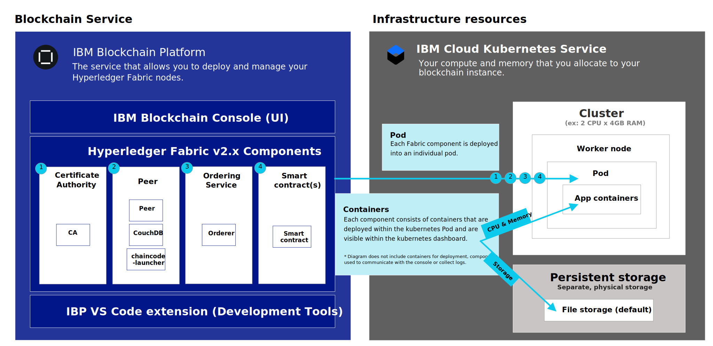
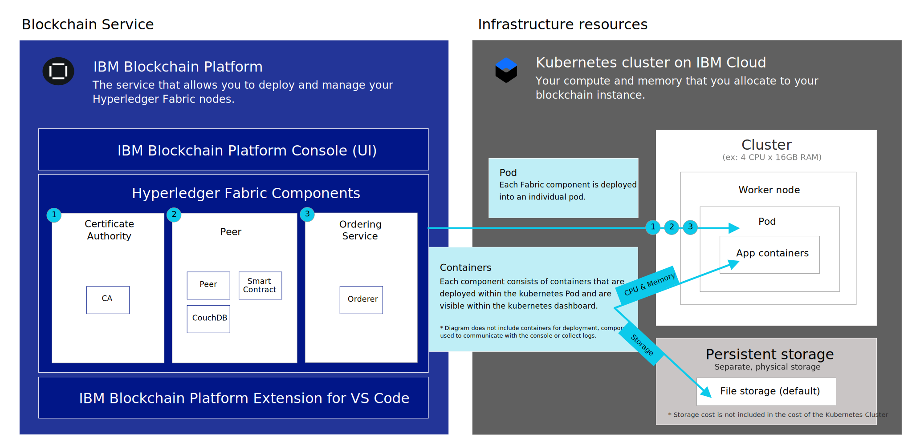

---

copyright:
  years: 2019, 2021
lastupdated: "2021-07-13"

keywords: getting started tutorials, videos, integration, storage, IBM Cloud

subcollection: blockchain

---

{:DomainName: data-hd-keyref="APPDomain"}
{:DomainName: data-hd-keyref="DomainName"}
{:android: data-hd-operatingsystem="android"}
{:api: .ph data-hd-interface='api'}
{:apikey: data-credential-placeholder='apikey'}
{:app_key: data-hd-keyref="app_key"}
{:app_name: data-hd-keyref="app_name"}
{:app_secret: data-hd-keyref="app_secret"}
{:app_url: data-hd-keyref="app_url"}
{:authenticated-content: .authenticated-content}
{:beta: .beta}
{:c#: data-hd-programlang="c#"}
{:cli: .ph data-hd-interface='cli'}
{:codeblock: .codeblock}
{:curl: .ph data-hd-programlang='curl'}
{:deprecated: .deprecated}
{:dotnet-standard: .ph data-hd-programlang='dotnet-standard'}
{:download: .download}
{:external: target="_blank" .external}
{:faq: data-hd-content-type='faq'}
{:fuzzybunny: .ph data-hd-programlang='fuzzybunny'}
{:generic: data-hd-operatingsystem="generic"}
{:generic: data-hd-programlang="generic"}
{:gif: data-image-type='gif'}
{:go: .ph data-hd-programlang='go'}
{:help: data-hd-content-type='help'}
{:hide-dashboard: .hide-dashboard}
{:hide-in-docs: .hide-in-docs}
{:important: .important}
{:ios: data-hd-operatingsystem="ios"}
{:java: .ph data-hd-programlang='java'}
{:java: data-hd-programlang="java"}
{:javascript: .ph data-hd-programlang='javascript'}
{:javascript: data-hd-programlang="javascript"}
{:new_window: target="_blank"}
{:note .note}
{:note: .note}
{:objectc data-hd-programlang="objectc"}
{:org_name: data-hd-keyref="org_name"}
{:php: data-hd-programlang="php"}
{:pre: .pre}
{:preview: .preview}
{:python: .ph data-hd-programlang='python'}
{:python: data-hd-programlang="python"}
{:route: data-hd-keyref="route"}
{:row-headers: .row-headers}
{:ruby: .ph data-hd-programlang='ruby'}
{:ruby: data-hd-programlang="ruby"}
{:runtime: architecture="runtime"}
{:runtimeIcon: .runtimeIcon}
{:runtimeIconList: .runtimeIconList}
{:runtimeLink: .runtimeLink}
{:runtimeTitle: .runtimeTitle}
{:screen: .screen}
{:script: data-hd-video='script'}
{:service: architecture="service"}
{:service_instance_name: data-hd-keyref="service_instance_name"}
{:service_name: data-hd-keyref="service_name"}
{:shortdesc: .shortdesc}
{:space_name: data-hd-keyref="space_name"}
{:step: data-tutorial-type='step'}
{:subsection: outputclass="subsection"}
{:support: data-reuse='support'}
{:swift: .ph data-hd-programlang='swift'}
{:swift: data-hd-programlang="swift"}
{:table: .aria-labeledby="caption"}
{:term: .term}
{:terraform: .ph data-hd-interface='terraform'}
{:tip: .tip}
{:tooling-url: data-tooling-url-placeholder='tooling-url'}
{:troubleshoot: data-hd-content-type='troubleshoot'}
{:tsCauses: .tsCauses}
{:tsResolve: .tsResolve}
{:tsSymptoms: .tsSymptoms}
{:tutorial: data-hd-content-type='tutorial'}
{:ui: .ph data-hd-interface='ui'}
{:unity: .ph data-hd-programlang='unity'}
{:url: data-credential-placeholder='url'}
{:user_ID: data-hd-keyref="user_ID"}
{:vbnet: .ph data-hd-programlang='vb.net'}
{:video: .video}

# Deploy from {{site.data.keyword.cloud_notm}}
{: #ibp-v2-deploy-iks-ic}

Learn how to get started with {{site.data.keyword.blockchainfull_notm}} Platform for {{site.data.keyword.cloud_notm}} from the {{site.data.keyword.cloud_notm}} Catalog.
{:shortdesc}

**Target audience:** This topic is designed for system administrators who are responsible for setting up a Kubernetes cluster on {{site.data.keyword.cloud_notm}} and for deploying {{site.data.keyword.blockchainfull_notm}} Platform.

## Deploy a Kubernetes cluster on {{site.data.keyword.cloud_notm}}
{: #ibp-v2-deploy-iks-deploy-cluster}

If you don't already have an existing Kubernetes cluster on {{site.data.keyword.cloud_notm}} in a supported region, you must create one. For information about locations where the {{site.data.keyword.blockchainfull_notm}} Platform can be deployed, see [Supported regions](/docs/blockchain/reference?topic=blockchain-ibp-regions-locations#ibp-regions-locations).

In the Cloud Catalog, find the **Kubernetes Service** tile and click it. Note that you have two types of Kubernetes clusters you can deploy: an {{site.data.keyword.IBM_notm}} Kubernetes Service cluster or an OpenShift cluster. The {{site.data.keyword.blockchainfull_notm}} Platform can be linked to either one. Your choice of cluster will be based on your use case.

For more information about the {{site.data.keyword.IBM_notm}} Kubernetes Service, see [Getting started with {{site.data.keyword.cloud_notm}} Kubernetes Service](/docs/containers?topic=containers-getting-started){: external}.

For more information about OpenShift, see [About the OpenShift Kubernetes Engine](https://docs.openshift.com/container-platform/4.3/welcome/oke_about.html){: external}.

As both {{site.data.keyword.IBM_notm}} Kubernetes Service clusters and OpenShift clusters are based on Kubernetes, you will find that many of the underlying decisions about hardware and storage types will be the same regardless of which cluster provider you choose. Note that the Kubernetes version of the cluster you deploy must be v1.17 - v1.20 to be compatible with the {{site.data.keyword.blockchainfull_notm}} Platform.

**Note that if you want high availability or disaster recovery, you will need to make a decision about the storage class you are using. The `default` storage class on the cluster will be used by the dynamic provisioning. So, customers can set any storage class as the default. For more information, see [Deciding on the file storage configuration](/docs/containers?topic=containers-file_storage#file_predefined_storageclass){: external}.**

### Free {{site.data.keyword.IBM_notm}} Kubernetes Service clusters
{: #ibp-v2-deploy-iks-deploy-cluster-free}

The {{site.data.keyword.IBM_notm}} Kubernetes service offers a free cluster that can be used for 30 days. Note that the free cluster offers limited storage and transaction throughput, and that it is not possible to migrate data from free clusters to paid clusters. For more information about the differences between the free and paid Kubernetes clusters on {{site.data.keyword.cloud_notm}}, see [Comparison of free and standard clusters](/docs/containers?topic=containers-cs_ov#cluster_types){: external}.

For instructions on what to do when your Kubernetes cluster expires, see this topic on [Kubernetes cluster expiration](/docs/blockchain?topic=blockchain-ibp-console-manage-console#ibp-console-manage-console-cluster-expiration).

## Create an {{site.data.keyword.blockchainfull_notm}} Platform service instance in {{site.data.keyword.cloud_notm}}
{: #ibp-v2-deploy-iks-create-service-instance}

After you have deployed a Kubernetes cluster on {{site.data.keyword.cloud_notm}}, you're ready to create an instance of {{site.data.keyword.blockchainfull_notm}} Platform for {{site.data.keyword.cloud_notm}}.

Creating an {{site.data.keyword.blockchainfull_notm}} Platform service instance is a two step process.

- Create and name the instance.
- Link the instance to your cluster in {{site.data.keyword.cloud_notm}}.

### Step one: Create and name the instance
{: #ibp-v2-deploy-iks-create-service-instance-create}

1. Locate the [Blockchain Platform](https://cloud.ibm.com/catalog/services/blockchain){: external} in the {{site.data.keyword.cloud_notm}} Catalog, or search for `Blockchain` on the {{site.data.keyword.cloud_notm}} Catalog page.
2. We recommend that you rename the **Service name** for your instance so you can recognize it easily in the future.
3. Choose your region from the drop-down list under **Select a region**. For a list of available regions, see [Regions](/docs/blockchain/reference?topic=blockchain-ibp-regions-locations#ibp-regions-locations).
4. You can leave the resource group and tags fields unchanged.
5. Click **Create** to provision the service instance.

### Step two: Link the instance to your Kubernetes cluster on {{site.data.keyword.cloud_notm}}
{: #ibp-v2-deploy-iks-steps}

After you click **Create** to create your service instance, you'll be taken to the panel where you can link your service instance to your cluster.

If you have not already created a Kubernetes cluster in {{site.data.keyword.cloud_notm}}, click  **Create a Kubernetes cluster on {{site.data.keyword.cloud_notm}}**. You will be taken to the catalog page and have to follow the process described in [Deploy a Kubernetes cluster on {{site.data.keyword.cloud_notm}}](#ibp-v2-deploy-iks-deploy-cluster).

If you already have a cluster, you can link your service instance to it by clicking **Link a Kubernetes cluster on {{site.data.keyword.cloud_notm}}** and selecting your existing cluster from the drop-down list. If your Kubernetes cluster is not visible in the drop-down list, it could be caused by the following conditions:

- The cluster creation process can take up to 60 minutes to complete. If you created a cluster, allow some extra time until the state of your cluster becomes **Normal**.
- Clusters that are outside the [supported regions](/docs/blockchain?topic=blockchain-ibp-regions-locations#ibp-regions-locations-ibp) are not visible and cannot be used.
- Check to make sure you are not using the ESR version of Firefox. If you are, switch to another browser such as Chrome and retry.
- If you have a multi-zone region ([MZR](#x9774820){: term}) cluster you need to enable [VLAN spanning](/docs/vlans?topic=vlans-vlan-spanning#manage-vlan-spanning).

If your cluster is available, select it and click **Next**. It might take a few minutes for the console to finish being linked to your cluster. When the linking process has finished, click **Launch the IBM Blockchain Platform console** to open the console. You are now ready to start exploring the console.

### Blockchain component deployment
{: #ibp-v2-deploy-components}

 The following illustration shows how the {{site.data.keyword.blockchainfull_notm}} Platform components are deployed to the Kubernetes cluster assuming Hyperledger Fabric v2.x images are used by the peer.

{: caption="Figure 2: Deploying the {{site.data.keyword.blockchainfull_notm}} Platform to a Kubernetes cluster on {{site.data.keyword.cloud_notm}}." caption-side="bottom"}

- **Pod**: When each Certificate Authority, peer, ordering service, or smart contract is deployed, a new Pod is created in a worker node in your cluster. Every time you deploy a smart contract, a new pod is launched for the smart contract.
- **App containers**: Containers are created inside the pods for each node that is deployed.
- **Persistent Storage**: Storage for each node is dynamically provisioned from the Kubernetes cluster `default` storage class every time a node is deployed.

 The following illustration shows how the {{site.data.keyword.blockchainfull_notm}} Platform components are deployed to the Kubernetes cluster assuming Hyperledger Fabric v1.4 images are used by the peer.

{: caption="Figure 3: Deploying the {{site.data.keyword.blockchainfull_notm}} Platform to a Kubernetes cluster on {{site.data.keyword.cloud_notm}}." caption-side="bottom"}

- **Pod**: When each Certificate Authority, peer, or ordering service is deployed, a new Pod is created in a worker node in your cluster.
- **App containers**: Containers are created inside the pods for each node that is deployed.
- **Persistent Storage**: Storage for each node is dynamically provisioned from the Kubernetes cluster `default` storage class every time a node is deployed.

## (Optional) Add additional users to the console
{: #ibp-v2-deploy-iks-add-users}

By default, the console uses [{{site.data.keyword.cloud_notm}} Identity and Access Management (IAM)](/docs/account?topic=account-iamoverview){: external} as the {{site.data.keyword.cloud_notm}} identity service provider. Your {{site.data.keyword.blockchainfull_notm}} Platform console is provisioned by configuring the email address of the {{site.data.keyword.IBM_notm}} owner as the Administrator of the console. As an Administrator, this user is authorized to grant other users access to the console via their email addresses.  See these instructions on how to [add and remove users from the console](/docs/blockchain?topic=blockchain-ibp-console-manage-console#ibp-console-manage-console-add-remove) for more information.

## Next steps
{: #ibp-v2-deploy-iks-next-steps}

- Before you create any nodes, you need to decide on the storage plug-in for your Kubernetes cluster. If you are just getting started and trying things out, `Bronze` file storage is suitable. However, if your cluster is running Kubernetes v1.17 or higher, `Gold` File Storage is preselected for your cluster by default. To change the default storage for your cluster, see this topic on [Persistent storage considerations](/docs/blockchain?topic=blockchain-ibp-v2-deploy-iks#ibp-console-storage) to learn more.

- Now that your console is ready to use, you can go ahead to the [Build a network tutorial](/docs/blockchain?topic=blockchain-ibp-console-build-network#ibp-console-build-network).
Consider bookmarking the URL of your console so you can come back at a later time if needed. Otherwise, you can follow the steps in the [Post-install instructions](#ibp-v2-deploy-iks-post-install) to get back to it from your browser.

## Updating the Kubernetes version of your cluster
{: #ibp-v2-deploy-iks-updating-kubernetes}

If you use an existing {{site.data.keyword.cloud_notm}} Kubernetes service cluster, ensure that it is running Kubernetes v1.17 - v1.20.

You can check the Kubernetes version of your cluster in the [Kubernetes clusters page](https://cloud.ibm.com/kubernetes/clusters){: external} on {{site.data.keyword.cloud_notm}}, which lists all your clusters in a table.

For instructions on how to update Kubernetes, see [Updating clusters, worker nodes, and cluster components](/docs/containers?topic=containers-update#update). For the list of {{site.data.keyword.containerlong_notm}} supported versions and expiration dates see the [release history](/docs/containers?topic=containers-cs_versions#release-history).

You must wait for the update to complete before you can [resume the {{site.data.keyword.blockchainfull_notm}} Platform deployment](#ibp-v2-deploy-iks-steps).

## How to assign Kubernetes access roles
{: #ibp-v2-deploy-iks-k8x-access-roles}

The user who links the blockchain service instance to the Kubernetes cluster must have the `Administrator` and `Manager` roles in Kubernetes.
To configure this access you must complete the following steps:
   1. In the {{site.data.keyword.cloud_notm}} dashboard, click the **Manage** drop-down list, then **Access (IAM)**.
   2. In the left navigation menu, click **Users** and click the ID of user who will link the service instance to the Kubernetes cluster.
   3. Click **Access Policies**, then **Assign access**.
   4. Click the tile **Assign access to resources**.
   5. In the Services drop-down list, select **Kubernetes Service**.
   6. Check the **Administrator** and **Manager** roles for this user.
   7. Click **Assign**.

For more information about Kubernetes access control, see [how to pick the right access policy and role for your users](/docs/containers?topic=containers-users#access_roles).

## Post-install instructions
{: #ibp-v2-deploy-iks-post-install}

After you deploy your console, you can click the **Launch the {{site.data.keyword.blockchainfull_notm}} Platform** button to open the console in your browser. You can add the console URL as a bookmark to your browser.

### Returning to your console from {{site.data.keyword.cloud_notm}}
{: #ibp-v2-deploy-iks-rtn-to-console}

If you don't have the console URL, you can find it from your {{site.data.keyword.cloud_notm}} dashboard.

1. In your browser, open [{{site.data.keyword.cloud_notm}} Resource list](https://cloud.ibm.com/resources){: external}. You need to log in with your {{site.data.keyword.IBM_notm}} ID.
2. Your {{site.data.keyword.blockchainfull_notm}} Platform service instance is visible under the **Services** twistie. Locate the {{site.data.keyword.blockchainfull_notm}} Platform service instance that you deployed and click it.
3. On the subsequent panel, click **Manage** in the left navigation and then click **Launch the {{site.data.keyword.blockchainfull_notm}} Platform**.

Your console opens in your browser.

## Deleting a service instance
{: #ibp-v2-deploy-iks-delete-service-instance}

When you no longer need your service instance it can be deleted from your Kubernetes cluster to free up resources.  You can use the {{site.data.keyword.cloud_notm}} dashboard to delete your {{site.data.keyword.blockchainfull_notm}} Platform service instance.

If the service instance contains organizations that are participating in an active network, you should remove the organization from the network before you delete the service instance. See [Removing an organization](/docs/blockchain?topic=blockchain-ibp-console-organizations#console-organizations-remove) for more details.
{: important}

1. In your browser, open [{{site.data.keyword.cloud_notm}} Resource list](https://cloud.ibm.com/resources){: external}. You need to log in with you {{site.data.keyword.IBM_notm}} ID.
2. Under the **Services** twistie, locate the service instance you want to delete and click **Delete** on the Actions menu.

**Choose this option carefully.** If you delete a service instance, the storage associated with each node is deleted and cannot be restored. All your ledger data will be deleted.
{: important}

If your service instance deletion fails, it could be because the Kubernetes cluster is not accessible. If this occurs, open a [support ticket](/docs/blockchain?topic=blockchain-blockchain-support#blockchain-support-cases) to request the service instance deletion.
