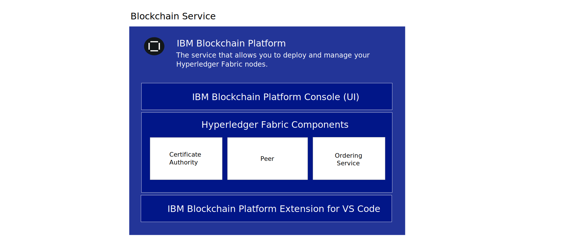

---

copyright:
  years: 2019, 2021
lastupdated: "2021-04-19"

keywords: getting started tutorials, videos, integration, storage

subcollection: blockchain

---

{:DomainName: data-hd-keyref="APPDomain"}
{:DomainName: data-hd-keyref="DomainName"}
{:android: data-hd-operatingsystem="android"}
{:api: .ph data-hd-interface='api'}
{:apikey: data-credential-placeholder='apikey'}
{:app_key: data-hd-keyref="app_key"}
{:app_name: data-hd-keyref="app_name"}
{:app_secret: data-hd-keyref="app_secret"}
{:app_url: data-hd-keyref="app_url"}
{:authenticated-content: .authenticated-content}
{:beta: .beta}
{:c#: data-hd-programlang="c#"}
{:cli: .ph data-hd-interface='cli'}
{:codeblock: .codeblock}
{:curl: .ph data-hd-programlang='curl'}
{:deprecated: .deprecated}
{:dotnet-standard: .ph data-hd-programlang='dotnet-standard'}
{:download: .download}
{:external: target="_blank" .external}
{:faq: data-hd-content-type='faq'}
{:fuzzybunny: .ph data-hd-programlang='fuzzybunny'}
{:generic: data-hd-operatingsystem="generic"}
{:generic: data-hd-programlang="generic"}
{:gif: data-image-type='gif'}
{:go: .ph data-hd-programlang='go'}
{:help: data-hd-content-type='help'}
{:hide-dashboard: .hide-dashboard}
{:hide-in-docs: .hide-in-docs}
{:important: .important}
{:ios: data-hd-operatingsystem="ios"}
{:java: .ph data-hd-programlang='java'}
{:java: data-hd-programlang="java"}
{:javascript: .ph data-hd-programlang='javascript'}
{:javascript: data-hd-programlang="javascript"}
{:new_window: target="_blank"}
{:note .note}
{:note: .note}
{:objectc data-hd-programlang="objectc"}
{:org_name: data-hd-keyref="org_name"}
{:php: data-hd-programlang="php"}
{:pre: .pre}
{:preview: .preview}
{:python: .ph data-hd-programlang='python'}
{:python: data-hd-programlang="python"}
{:route: data-hd-keyref="route"}
{:row-headers: .row-headers}
{:ruby: .ph data-hd-programlang='ruby'}
{:ruby: data-hd-programlang="ruby"}
{:runtime: architecture="runtime"}
{:runtimeIcon: .runtimeIcon}
{:runtimeIconList: .runtimeIconList}
{:runtimeLink: .runtimeLink}
{:runtimeTitle: .runtimeTitle}
{:screen: .screen}
{:script: data-hd-video='script'}
{:service: architecture="service"}
{:service_instance_name: data-hd-keyref="service_instance_name"}
{:service_name: data-hd-keyref="service_name"}
{:shortdesc: .shortdesc}
{:space_name: data-hd-keyref="space_name"}
{:step: data-tutorial-type='step'}
{:subsection: outputclass="subsection"}
{:support: data-reuse='support'}
{:swift: .ph data-hd-programlang='swift'}
{:swift: data-hd-programlang="swift"}
{:table: .aria-labeledby="caption"}
{:term: .term}
{:tip: .tip}
{:tooling-url: data-tooling-url-placeholder='tooling-url'}
{:troubleshoot: data-hd-content-type='troubleshoot'}
{:tsCauses: .tsCauses}
{:tsResolve: .tsResolve}
{:tsSymptoms: .tsSymptoms}
{:tutorial: data-hd-content-type='tutorial'}
{:ui: .ph data-hd-interface='ui'}
{:unity: .ph data-hd-programlang='unity'}
{:url: data-credential-placeholder='url'}
{:user_ID: data-hd-keyref="user_ID"}
{:vbnet: .ph data-hd-programlang='vb.net'}
{:video: .video}


<style>
<!--
    #tutorials { /* hide the page header */
        display: none !important;
    }
    .allCategories {
        display: flex !important;
        flex-direction: row !important;
        flex-wrap: wrap !important;
    }
    .categoryBox {
        flex-grow: 1 !important;
        width: calc(33% - 20px) !important;
        text-decoration: none !important;
        margin: 0 10px 20px 0 !important;
        padding: 16px !important;
        border: 1px #dfe6eb solid !important;
        box-shadow: 0 1px 2px 0 rgba(0, 0, 0, 0.2) !important;
        text-align: center !important;
        text-overflow: ellipsis !important;
        overflow: hidden !important;
    }
    .solutionBoxContainer {}
    .solutionBoxContainer a {
        text-decoration: none !important;
        border: none !important;
    }
    .solutionBox {
        display: inline-block !important;
        width: 100% !important;
        margin: 0 10px 20px 0 !important;
        padding: 16px !important;
        background-color: #f4f4f4 !important;
    }
    @media screen and (min-width: 960px) {
        .solutionBox {
        width: calc(50% - 3%) !important;
        }
        .solutionBox.solutionBoxFeatured {
        width: calc(50% - 3%) !important;
        }
        .solutionBoxContent {
        height: 350px !important;
        }
    }
    @media screen and (min-width: 1298px) {
        .solutionBox {
        width: calc(33% - 2%) !important;
        }
        .solutionBoxContent {
        min-height: 350px !important;
        }
    }
    .solutionBox:hover {
        border: 1px rgb(136, 151, 162)solid !important;
        box-shadow: 0 1px 2px 0 rgba(0, 0, 0, 0.2) !important;
    }
    .solutionBoxContent {
        display: flex !important;
        flex-direction: column !important;
    }
    .solutionBoxTitle {
        margin: 0rem !important;
        margin-bottom: 5px !important;
        font-size: 14px !important;
        font-weight: 900 !important;
        line-height: 16px !important;
        height: 37px !important;
        text-overflow: ellipsis !important;
        overflow: hidden !important;
        display: -webkit-box !important;
        -webkit-line-clamp: 2 !important;
        -webkit-box-orient: vertical !important;
        -webkit-box-align: inherit !important;
    }
    .solutionBoxDescription {
        flex-grow: 1 !important;
        display: flex !important;
        flex-direction: column !important;
    }
    .descriptionContainer {
    }
    .descriptionContainer p {
        margin: 0 !important;
        overflow: hidden !important;
        display: -webkit-box !important;
        -webkit-line-clamp: 4 !important;
        -webkit-box-orient: vertical !important;
        font-size: 14px !important;
        font-weight: 400 !important;
        line-height: 1.5 !important;
        letter-spacing: 0 !important;
        max-height: 70px !important;
    }
    .architectureDiagramContainer {
        flex-grow: 1 !important;
        min-width: calc(33% - 2%) !important;
        padding: 0 16px !important;
        text-align: center !important;
        display: flex !important;
        flex-direction: column !important;
        justify-content: center !important;
        background-color: #f4f4f4;
    }
    .architectureDiagram {
        max-height: 175px !important;
        padding: 5px !important;
        margin: 0 auto !important;
    }
-->
</style>

# Getting started with {{site.data.keyword.blockchainfull_notm}} Platform for {{site.data.keyword.cloud_notm}}
{: #ibp-v2-deploy-iks}

{{site.data.keyword.blockchainfull}} Platform for {{site.data.keyword.cloud_notm}} includes the {{site.data.keyword.blockchainfull_notm}} Platform console, a user interface that can simplify and accelerate your journey to deploy and manage blockchain components. This tutorial describes how to get started with {{site.data.keyword.blockchainfull_notm}} Platform for {{site.data.keyword.cloud_notm}} and use the console to deploy and manage blockchain components in your Kubernetes cluster on {{site.data.keyword.cloud_notm}}. To learn more about Kubernetes see this [overview](/docs/blockchain/reference?topic=blockchain-k8s-overview "Kubernetes").
{:shortdesc}

**Target audience:** This topic is designed for system administrators who are responsible for setting up a Kubernetes cluster on {{site.data.keyword.cloud_notm}} and for deploying {{site.data.keyword.blockchainfull_notm}} Platform.

If you are interested in learning more about how to use {{site.data.keyword.blockchainfull_notm}} Platform on Red Hat OpenShift Container Platform, Red Hat Open Kubernetes Distribution (OKD), or Kubernetes, see [Getting started with IBM Blockchain Platform 2.5.2](/docs/blockchain-sw-252?topic=blockchain-sw-252-get-started-console-ocp).

If you are an experienced Hyperledger Fabric customer and are interested in learning more about how to use the  {{site.data.keyword.blockchainfull_notm}} peer, CA, orderer, and smart contract containers images, see [Using the {{site.data.keyword.blockchainfull_notm}} images ](/docs/blockchain-sw-252?topic=blockchain-sw-252-blockchain-images).

After you link your {{site.data.keyword.blockchainfull_notm}} Platform to your Kubernetes cluster on {{site.data.keyword.cloud_notm}}, you can launch the console to create and manage your blockchain components and experience the following important benefits:

- **Control:** You control and manage your blockchain components and certificates from one central console. Deploy only the components needed for your business and add more as your need grow.
- **Flexible Kubernetes based deployment:** You can take advantage of the compute (CPU, memory, storage) options for your Kubernetes cluster and leverage built-in HA and DR options.

## What is the Blockchain Service?
{: #ibp-v2-deploy-iks-blockchain-service}

The following diagram illustrates the three elements of the {{site.data.keyword.blockchainfull_notm}} Platform:

{: caption="Figure 1. The {{site.data.keyword.blockchainfull_notm}} Platform components" caption-side="bottom"}

- **{{site.data.keyword.blockchainfull_notm}} Platform Console (UI)**: This is the console that allows you to create and manage your blockchain components. After you provision a service instance in {{site.data.keyword.cloud_notm}}, you can deploy an instance of the {{site.data.keyword.blockchainfull_notm}} console and link it to your Kubernetes cluster on {{site.data.keyword.cloud_notm}}. Then you can use the console to create and manage your blockchain components in your Kubernetes cluster. There is no charge for the console.

- **Hyperledger Fabric Components**: The console is used to create and manage blockchain components that are based on Hyperledger Fabric v1.4.11 and v2.2.2 Certificate Authority, peer, and ordering service images. These components are deployed into your Kubernetes cluster and storage is provisioned for them using the `default` storage class when they are deployed.

- **{{site.data.keyword.IBM_notm}} VS Code extension (Development Tools)**: Download the VS Code extension from the VS Code marketplace in order to get started with developing, packaging, and testing client applications and smart contracts.

## Considerations
{: #ibp-v2-deploy-iks-considerations}

Before you deploy the console, ensure that you understand the following considerations:

- {{site.data.keyword.blockchainfull_notm}} Platform for {{site.data.keyword.cloud_notm}} is built with Hyperledger Fabric v1.4.11 and v2.2.2.
- You have the option to link your {{site.data.keyword.blockchainfull_notm}} Platform service instance to a free Kubernetes cluster for evaluation of the offering, however capacity and performance are limited, none of your data can be migrated, and the cluster is deleted after 30 days.
- You are responsible for the management of health monitoring, security, and logging of your Kubernetes cluster. See this [information](/docs/containers?topic=containers-responsibilities_iks){: external} for details on what {{site.data.keyword.cloud_notm}} manages and what you are responsible for.
- You are also responsible for monitoring the resource usage of your Kubernetes cluster by using the Kubernetes dashboard. If you need to increase storage capacity of your cluster, see this information on how to modify your existing volume:
  - [IBM File Storage](/docs/FileStorage?topic=FileStorage-expandCapacity)
  - [Portworx](https://docs.portworx.com/portworx-install-with-kubernetes/storage-operations/create-pvcs/resize-pvc/)
  - [Block storage](/docs/BlockStorage?topic=BlockStorage-expandingcapacity#expandingcapacity)
- You are responsible for managing and securing your certificates and private keys. {{site.data.keyword.IBM_notm}} does not store your certificates in the Kubernetes cluster.
- {{site.data.keyword.blockchainfull_notm}} Platform is available in select regions. Refer to this topic on [{{site.data.keyword.blockchainfull_notm}} Platform locations](/docs/blockchain?topic=blockchain-ibp-regions-locations) for an updated list.
- {{site.data.keyword.blockchainfull_notm}} Platform is compatible with a Kubernetes cluster on {{site.data.keyword.cloud_notm}} running Kubernetes v1.17 - v1.20.
- The default storage that is pre-selected for you when you provision a Kubernetes cluster in {{site.data.keyword.cloud_notm}} is `Gold`. If you do not want to use the default File Storage that is pre-selected for you when you provision a Kubernetes cluster in {{site.data.keyword.cloud_notm}}, you can provision storage of your choice. See this topic on [Persistent storage considerations](/docs/blockchain?topic=blockchain-ibp-v2-deploy-iks#ibp-console-storage) to learn more.
- If you decide to include {{site.data.keyword.cloud_notm}} multi-zone support in your Kubernetes cluster, you must provision your own storage. See [Using Multizone (MZR) clusters with {{site.data.keyword.blockchainfull_notm}} Platform](/docs/blockchain?topic=blockchain-ibp-v2-deploy-iks#ibp-console-mzr) for more details.
- Kubernetes clusters that are configured with private VLANs are not supported.


## Video tutorial
{: #ibp-v2-deploy-video}

Watch the following [video series](http://ibm.biz/BlockchainPlatformSeries) to learn more about the {{site.data.keyword.blockchainfull_notm}} Platform console and how you can get started to deploy {{site.data.keyword.blockchainfull_notm}} Platform for {{site.data.keyword.cloud_notm}}.

## Before you begin
{: #ibp-v2-deploy-iks-prereq}

Before you begin:

- Ensure that you have an [{{site.data.keyword.cloud_notm}} paid account](https://cloud.ibm.com/catalog/services/blockchain){: external}. If you do not have an account:
   1. Click the **Sign up** button.
   2. After you create a free trial account, upgrade it to a **Pay-As-You-Go** type by going to **Manage** > **Billing and Usage** > **Billing** in the {{site.data.keyword.cloud_notm}} console, and clicking **Add Credit Card**.
   3. Ensure that the user has both Administrator and Manager roles for the Kubernetes cluster that they will link to their blockchain service instance. See these steps on [how to assign Kubernetes access roles](/docs/blockchain?topic=blockchain-ibp-v2-deploy-iks-ic#ibp-v2-deploy-iks-k8x-access-roles) for more information.

When you plan to use the service instance in the context of a broader organization-wide solution, it is recommended that the participating organizations use a functional email address to create their network. In this case, access to the network does not depend on any single individual's availability.
{:tip}

- If you plan to use an existing Kubernetes cluster on {{site.data.keyword.cloud_notm}}, ensure the version of Kubernetes it is running is between v1.17 - v1.20. For more information about how to determine what version of Kubernetes your cluster is running and how to upgrade the version, see [Updating the Kubernetes version of your cluster](/docs/blockchain?topic=blockchain-ibp-v2-deploy-iks-ic#ibp-v2-deploy-iks-updating-kubernetes).

- If you plan to use a Hardware Security Module (HSM) to generate and store the private key for your peer and ordering nodes, you can configure the HSM before you deploy the platform. Along with deploying the HSM device itself, in order for the blockchain components to access the HSM partition, you also need to publish an HSM client image to a container registry or configure a PKCS #11 proxy (deprecated). If you decide to publish an HSM client image to a container registry, you can enable HSM support for the platform by providing the image URL when you link the service to your cluster.  See the instructions in [Configuring a node to use a Hardware Security Module](/docs/blockchain?topic=blockchain-ibp-console-adv-deployment#ibp-console-adv-deployment-cfg-hsm) to learn how to deploy the HSM and publish the HSM client image. If the HSM device is not yet available, you can always come back later and enable the HSM support for the platform when it is ready.

- Zero downtime is an important goal of your blockchain network. Review the topic on [High Availability](/docs/blockchain?topic=blockchain-ibp-console-ha) for considerations when configuring your Kubernetes cluster and blockchain components.

- If you plan to use a Kubernetes cluster that contains multiple zones, ensure that [`VLAN spanning`](/docs/vlans?topic=vlans-vlan-spanning#manage-vlan-spanning){: external} is enabled in your account.  This setting allows worker nodes to communicate between zones.

- The user who links the service to the Kubernetes cluster must have **Storage Manage** permissions. From the {{site.data.keyword.cloud_notm}} dashboard, navigate to **Manage > Access (IAM)**, then choose **Users**, and click the user who will link the service to the Kubernetes cluster. Click the **Classic infrastructure** tab, expand the **Services** twistie, and select **Storage Manage**. Click **Apply** to add this permission for the user.

### Browsers
{: #ibp-v2-deploy-iks-browsers}
The {{site.data.keyword.blockchainfull_notm}} Platform console has been successfully tested on the following browsers:

- Chrome Version 85.0.4183.121 (Official Build) (64-bit)
- Safari Version 13.0.3 (15608.3.10.1.4)

### Resources required
{: #ibp-v2-deploy-iks-resources-required}

#### Cluster size recommendations
{: #ibp-v2-deploy-iks-resources-required-free}

 When you link your {{site.data.keyword.blockchainfull_notm}} Platform console to a Kubernetes cluster on {{site.data.keyword.cloud_notm}}, you need to ensure that your Kubernetes cluster meets the minimum hardware resource requirements:

|Kubernetes cluster type | Use case | CPU | RAM | Worker nodes |
|-----------|------|-----|-----------------------|
|Standard (Recommended) | Suitable for MVPs | 4 (Shared) | 16 GB (Shared)|multiple|
|Free** | Suitable for evaluation | 2 | 4 GB | 1 |
{: caption="Table 1. Recommended cluster size on Kubernetes cluster on {{site.data.keyword.cloud_notm}}" caption-side="bottom"}
** Preview the {{site.data.keyword.blockchainfull_notm}} Platform at no charge for 30 days when you link your {{site.data.keyword.blockchainfull_notm}} Platform service instance to an {{site.data.keyword.cloud_notm}} Kubernetes free cluster. Performance will be limited by throughput, storage and functionality. {{site.data.keyword.cloud_notm}} will delete your Kubernetes cluster after 30 days and you cannot migrate any nodes or data from a free cluster to a paid cluster. Also note that when components are deployed to a free cluster, the resource allocation for the nodes is sized smaller than a paid cluster.

These resources are sufficient for testing and experimentation. The [Build a network tutorial](/docs/blockchain?topic=blockchain-ibp-console-build-network#ibp-console-build-network), in which you create two peers, two CAs, and a single node ordering service, takes up approximately 1.95 CPU. A five node ordering service requires 1.75 CPU by itself. Therefore, if you plan to deploy a five node ordering service, you should not deploy a Kubernetes cluster with a 2 CPU single worker node as the ordering service will not fit comfortably with other nodes. We recommend a cluster with nodes of at least 4 CPU. The more worker nodes you add, the easier your cluster will be able to handle your deployments.
{:note}

**Paid clusters**  
{: #ibp-v2-deploy-iks-resources-required-paid}

Production level deployments of the {{site.data.keyword.blockchainfull_notm}} Platform will be deployed to a paid cluster of {{site.data.keyword.cloud_notm}} Kubernetes Service. The size and configuration of this cluster will depend on the needs of your particular use case. Bigger deployments will necessarily need to be deployed on bigger clusters. How much bigger your cluster is than your projected deployment is up to you. Having at least some headroom is desirable, as it will allow peers and ordering services to be a part of additional channels and take on higher throughput without having to deploy additional resources into your Kubernetes cluster **before** adjusting the size of your nodes. For more information about how these values are adjusted, see [Reallocating resources](/docs/blockchain?topic=blockchain-ibp-console-govern-components#ibp-console-govern-components-reallocate-resources).

Creating an initial deployment of sufficient size to allow growth is particularly important for users who will choose to not use the [Kubernetes Service](/docs/containers?topic=containers-ca#ca){: external} or [OpenShift](/docs/openshift?topic=openshift-ca){: external} autoscaler, which can take on some of the burden of deploying additional nodes and pods for the user.

While it is simpler to have enough resources deployed to {{site.data.keyword.cloud_notm}} Kubernetes Service and be able to expand your pods and worker nodes as you see fit without having to increase your Kubernetes cluster deployment first, bigger Kubernetes cluster deployments will cost more money. Users will have to consider their options carefully and recognize the tradeoffs they are making regardless of the option they choose.

For a sense of how much storage and compute you will need in your cluster, refer to this chart, which contains the current defaults for the peer, ordering node, and CA:

| **Component** (all containers) | CPU**  | Memory (GB) | Storage (GB) |
|--------------------------------|---------------|-----------------------|------------------------|
| **Peer (Hyperledger Fabric v1.4)**                       | 1.1           | 2.8                   | 200 (includes 100GB for peer and 100GB for state database)|
| **Peer (Hyperledger Fabric v2.x)**                       | 0.7           | 2.0                   | 200 (includes 100GB for peer and 100GB for state database)|
| **CA**                         | 0.1           | 0.2                   | 20                     |
| **Ordering node**              | 0.35          | 0.7                   | 100                    |
| **Operator**                   | 0.1           | 0.2                   | 0                      |
| **Console**                    | 1.2           | 2.4                   | 10                     |
{: caption="Table 2. Recommended resources for nodes on {{site.data.keyword.blockchainfull_notm}} Platform for {{site.data.keyword.cloud_notm}}" caption-side="bottom"}

Note that when smart contracts are installed on peers that run a Fabric v2.x image, the smart contract is launched in its own pod instead of a separate container on the peer, which accounts for the smaller amount of resources required on the peer.

If you plan to deploy a five node Raft ordering service, note that the total of your deployment will increase by a factor of five. So a total of 1.75 CPU, 3.5 GB of memory, and 500 GB of storage for the five Raft nodes. A 4x16 Kubernetes two worker node cluster is minimally recommended to allow plenty of CPU for the Raft cluster and any other nodes you deploy.
{:tip}

## Persistent storage considerations
{: #ibp-console-storage}

{{site.data.keyword.blockchainfull_notm}} Platform requires persistent storage for each CA, peer, and ordering node. When you deploy a standard Kubernetes cluster in {{site.data.keyword.cloud_notm}}, it uses a pre-configured storage class that is backed by [{{site.data.keyword.cloud_notm}} File Storage](/docs/FileStorage?topic=FileStorage-getting-started). You have the option to upgrade your storage class, change your backing storage, or use third-party services.

Every cluster on your Kubernetes cluster on {{site.data.keyword.cloud_notm}} comes with predefined, `default` storage class that is used to provision persistent storage on {{site.data.keyword.cloud_notm}}. When you deploy a blockchain node to that cluster by using the {{site.data.keyword.blockchainfull_notm}} Platform console or the APIs, the node uses this `default` storage class to dynamically provision the amount of storage that you specify on {{site.data.keyword.cloud_notm}}.

For {{site.data.keyword.cloud_notm}} Kubernetes service, the `default` storage class is `Gold` File Storage backed by [Endurance File Storage](/docs/FileStorage). See [Deciding on the File Storage configuration](/docs/containers?topic=containers-file_storage#file_predefined_storageclass){: external} for more details. OpenShift clusters default to `Gold` [Block Storage](/docs/openshift?topic=openshift-block_storage#block_predefined_storageclass). If you need to change your default storage class, see [Ordering File Storage with pre-defined IOPS Tiers (Endurance)](/docs/FileStorage?topic=FileStorage-orderingConsole#endurance) and then follow instructions to [configure a custom storage class](#ibp-console-storage-custom).
{: important}

### Provision persistent storage
{: #ibp-console-storage-provision}

If you are linking to a Red Hat OpenShift cluster in {{site.data.keyword.cloud_notm}}, review the topic on [Planning highly available persistent storage](/docs/openshift?topic=openshift-storage_planning#choose_storage_solution){: external}. If you are linking to an {{site.data.keyword.cloud_notm}} Kubernetes Service cluster, you can choose from several [Kubernetes storage options](/docs/containers?topic=containers-storage_planning#choose_storage_solution){: external} and decide on the storage type that best fits your use case. In both cases, you need to provision persistent storage. Be aware that you are charged separately for your storage usage, so you can factor in the cost of the various storage options when you make your selection. All of the predefined storage classes in your Kubernetes cluster on {{site.data.keyword.cloud_notm}} use File Storage as the backing storage. For more information, see [{{site.data.keyword.cloud_notm}} File Storage pricing](https://www.ibm.com/cloud/file-storage/pricing).

### Multizone-capable storage
{: #ibp-console-storage-multizone}

If your Kubernetes cluster is configured with **SDS (Portworx)** storage, you can leverage multizone-capable storage for your nodes. Without multizone-capable storage, if an entire zone goes down, any blockchain nodes in that zone cannot automatically come up in another zone because their associated persistent storage is unavailable in the failed zone. When multizone-capable storage is configured for high availability, if a zone failure occurs, the nodes can come up in another zone, with their associated storage intact, ensuring high availability of the node. To learn more about multizone-capable storage, see the comparison of persistent storage options for multizone clusters on [OpenShift](/docs/openshift?topic=openshift-storage_planning#persistent_storage_overview) or [{{site.data.keyword.cloud_notm}} Kubernetes service](/docs/containers?topic=containers-storage_planning#persistent_storage_overview). When you deploy a peer, ordering service, or ordering node, select the advanced deployment option labeled **Deployment zone selection** and then select **Across all zones** to configure the component for this high availability capability.

### Configuring a custom storage class
{: #ibp-console-storage-custom}

If you want to use [Performance File Storage](/docs/FileStorage?topic=FileStorage-orderingConsole#performance), or [Portworx](/docs/containers?topic=containers-portworx#portworx) as backing storage, you must create a customized storage class for your cluster. Read about how to add a storage class for [Red Hat OpenShift clusters](/docs/openshift?topic=openshift-kube_concepts#dynamic_provisioning){: external} or [{{site.data.keyword.cloud_notm}} Kubernetes service clusters](/docs/containers?topic=containers-kube_concepts#storageclasses){: external}. You can then make the custom storage class the `default` storage class by running the following command:

```
kubectl patch storageclass <storageclass> -p '{"metadata": {"annotations":{"storageclass.kubernetes.io/is-default-class":"true"}}}'
```
{:codeblock}

Replace ``<storageclass>`` with the name of your storage class.

After you deploy blockchain nodes to your cluster, you should not change the `default` storage class. This will result in losing the storage for the CAs, peers, and ordering nodes that are already deployed. Therefore, you need to decide on your storage before you deploy any blockchain nodes.
{: important}

If you need to increase storage capacity of your cluster, see this information on how to modify your existing volume:
  - [IBM File Storage](/docs/FileStorage?topic=FileStorage-expandCapacity)
  - [Portworx](https://docs.portworx.com/portworx-install-with-kubernetes/storage-operations/create-pvcs/resize-pvc/)
  - [Block storage](/docs/BlockStorage?topic=BlockStorage-expandingcapacity#expandingcapacity)

## Using Multizone (MZR) clusters with {{site.data.keyword.blockchainfull_notm}} Platform
{: #ibp-console-mzr}

In regions where it is offered, [multizone support](/docs/containers?topic=containers-regions-and-zones#regions_multizone){: external} is pre-selected by default when you create a standard Kubernetes cluster on {{site.data.keyword.cloud_notm}}. Although not required, this capability provides for high availability of your nodes in case any one zone, or data center, goes down. If your cluster includes multizone support, you need to bring your own storage solution. You can choose from several [persistent storage options](/docs/containers?topic=containers-storage_planning#persistent_storage_overview){: external}.

If you are setting up an {{site.data.keyword.blockchainfull_notm}} Platform network in an MZR cluster and want your components to eventually fail over between data centers, you should select Portworx as your storage type. Otherwise, if you use File Storage for your node in your MZR cluster and the zone fails, you will need to provision that component again later. Currently, if a data center (or zone) goes down, the node will _not_ automatically come up in another zone, regardless of the storage type that is used for the node. However, if one of the nodes fails in a single zone, it will automatically failover to another node in the same zone regardless of the storage type that is being used for that node.
{: note}

After you create the storage class, run the `kubectl patch storageclass` command above to set the storage class of the multizone region to be the `default` storage class.

## Pricing and Billing information
{: #ibp-v2-deploy-iks-pricing-billing}

- See [Pricing](/docs/blockchain?topic=blockchain-ibp-saas-pricing) if you need to revisit the {{site.data.keyword.blockchainfull_notm}} Platform pricing information.
- Your current {{site.data.keyword.cloud_notm}} usage information is available on your [usage tile](https://cloud.ibm.com/billing/){: external} of the {{site.data.keyword.cloud_notm}} dashboard and your bill is visible under [billing information](https://cloud.ibm.com/billing/billing-items){: external}. See this topic on [Billing](/docs/blockchain?topic=blockchain-ibp-saas-pricing#ibp-saas-pricing-billing) for more details about how {{site.data.keyword.blockchainfull_notm}} Platform billing works.


## Choose your deployment process
{: #ibp-v2-deploy-iks-deploy-process}

From your {{site.data.keyword.cloud_notm}} account, you can deploy the {{site.data.keyword.blockchainfull_notm}} Platform service from either the {{site.data.keyword.cloud_notm}} Catalog or the Red Hat Marketplace.

- **IBM Cloud Catalog** Use the IBM Cloud Catalog to deploy blockchain to an {{site.data.keyword.IBM_notm}} Kubernetes service or OpenShift cluster in {{site.data.keyword.cloud_notm}}. With this [software-as-a-service](#x4585386){: term} option, {{site.data.keyword.IBM_notm}} manages the maintenance and the updates to the console for you, but you can choose when to update your blockchain components.
- **Red Hat Marketplace** OpenShift customers who are already familiar with the OpenShift Container (OC) [CLI](#x2051424){: term} and the Red Hat Marketplace may prefer to use this option. Note that with this option, you are responsible for the maintenance of your console and blockchain components.
- **Multicloud** Not running an OpenShift or Kubernetes cluster in IBM Cloud? The {{site.data.keyword.blockchainfull_notm}} Platform 2.5.2 can be installed on your OpenShift or Kubernetes cluster in your cloud or on-prem. With this option as well, you are responsible for the maintenance of your console and blockchain components.

<div class=solutionBoxContainer>
  <div class="solutionBox">
    <a href = "/docs/blockchain?topic=blockchain-ibp-v2-deploy-iks-ic#ibp-v2-deploy-iks-create-service-instance">
      <div>
        <p><strong> Deploy from IBM Cloud Catalog</p>
        <p class="bx--type-caption">Use the IBM Cloud Catalog to deploy the Platform to an OpenShift or IBM Kubernetes service cluster in IBM Cloud.</p>
      </div>
    </a>
  </div>
  <div class="solutionBox">
    <a href = "/docs/blockchain-sw-252?topic=blockchain-sw-252-deploy-ocp-rhm">
      <div>
        <p><strong> Deploy from Red Hat Marketplace</p>
        <p class="bx--type-caption">Use the Red Hat Marketplace to deploy the IBM Blockchain  Platform to an OpenShift cluster in IBM Cloud.</p>
      </div>
    </a>
  </div>
  <div class="solutionBox">
    <a href = "/docs/blockchain-sw-252?topic=blockchain-sw-252-get-started-console-ocp#get-started-console-ocp-step-two-deploy-console">
      <div>
        <p><strong>&nbsp;&nbsp;&nbsp;&nbsp; Deploy to another cloud or on-prem</p>
        <p class="bx--type-caption"><strong>(Multicloud)</strong> Deploy the IBM Blockchain Platform to your OpenShift or Kubernetes cluster in your cloud or on-prem.</p>
      </div>
    </a>
</div>
