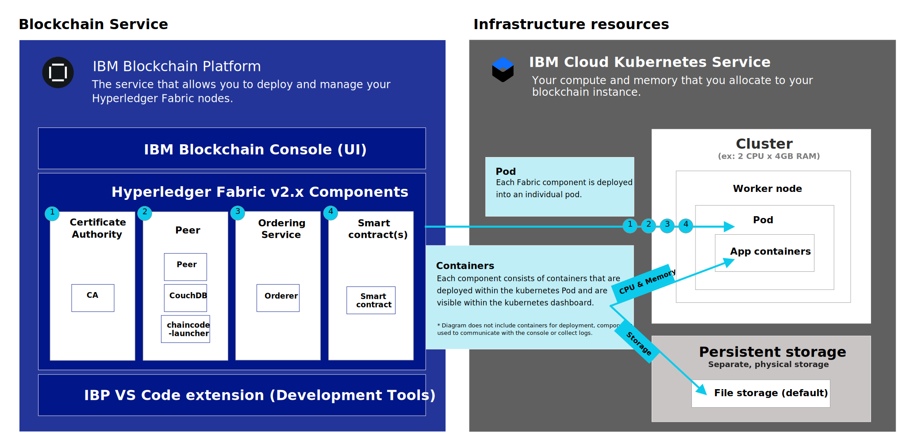
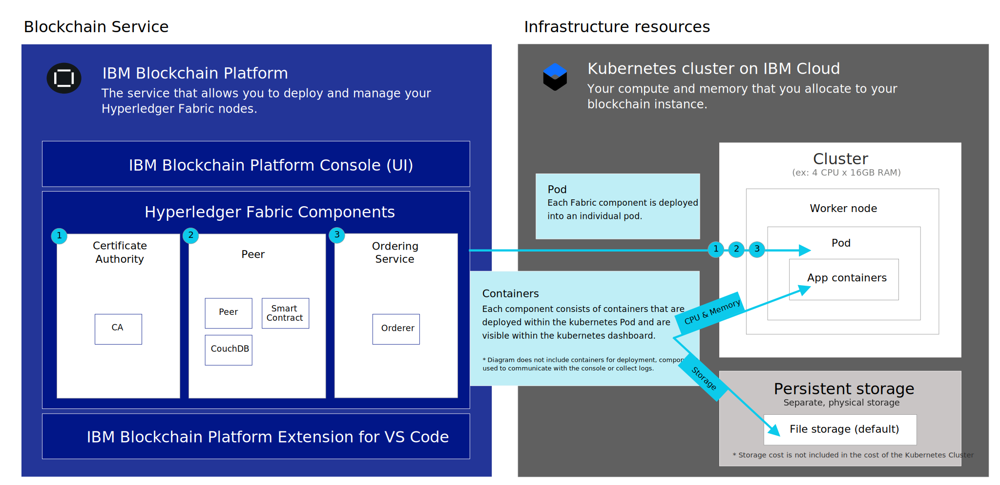

---

copyright:
  years: 2019, 2020
lastupdated: "2020-08-06"

keywords: getting started tutorials, videos, web browsers, integration, storage

subcollection: blockchain

---

{:external: target="_blank" .external}
{:shortdesc: .shortdesc}
{:screen: .screen}
{:codeblock: .codeblock}
{:note: .note}
{:important: .important}
{:tip: .tip}
{:term: .term}
{:pre: .pre}
{:gif: data-image-type='gif'}


# Getting started with {{site.data.keyword.blockchainfull_notm}} Platform for {{site.data.keyword.cloud_notm}}
{: #ibp-v2-deploy-iks}

{{site.data.keyword.blockchainfull}} Platform for {{site.data.keyword.cloud_notm}} includes the {{site.data.keyword.blockchainfull_notm}} Platform console, a user interface that can simplify and accelerate your journey to deploy and manage blockchain components. This tutorial describes how to get started with {{site.data.keyword.blockchainfull_notm}} Platform for {{site.data.keyword.cloud_notm}} and use the console to deploy and manage blockchain components in your Kubernetes cluster on {{site.data.keyword.cloud_notm}}. To learn more about Kubernetes see this [overview](/docs/blockchain/reference?topic=blockchain-k8s-overview "Kubernetes").
{:shortdesc}


**Target audience:** This topic is designed for system administrators who are responsible for setting up a Kubernetes cluster on {{site.data.keyword.cloud_notm}} and for deploying {{site.data.keyword.blockchainfull_notm}} Platform.

If you are interested in learning more about how to use {{site.data.keyword.blockchainfull_notm}} Platform on Red Hat OpenShift Container Platform, Red Hat Open Kubernetes Distribution (OKD), or Kubernetes, see [Getting started with IBM Blockchain Platform 2.5](/docs/blockchain-sw-25?topic=blockchain-sw-25-get-started-console-ocp).

If you are an experienced Hyperledger Fabric customer and are interested in learning more about how to use the  {{site.data.keyword.blockchainfull_notm}} peer, CA, orderer, and smart contract containers images, see [Using the {{site.data.keyword.blockchainfull_notm}} images ](/docs/blockchain-sw-25?topic=blockchain-sw-25-blockchain-images).

After you link your {{site.data.keyword.blockchainfull_notm}} Platform to your Kubernetes cluster on {{site.data.keyword.cloud_notm}}, you can launch the console to create and manage your blockchain components and experience the following important benefits:

- **Control:** You control and manage your blockchain components and certificates from one central console. Deploy only the components needed for your business and add more as your need grow.
- **Flexible Kubernetes based deployment:** You can take advantage of the compute (CPU, memory, storage) options for your Kubernetes cluster and leverage built-in HA and DR options.

## What is the Blockchain Service?
{: #ibp-v2-deploy-iks-blockhain-service}

The following diagram illustrates the three elements of the {{site.data.keyword.blockchainfull_notm}} Platform:

{: caption="Figure 1. The {{site.data.keyword.blockchainfull_notm}} Platform components" caption-side="bottom"}

- **{{site.data.keyword.blockchainfull_notm}} Platform Console (UI)**: This is the console that allows you to create and manage your blockchain components. After you provision a service instance in {{site.data.keyword.cloud_notm}}, you can deploy an instance of the {{site.data.keyword.blockchainfull_notm}} console and link it to your Kubernetes cluster on {{site.data.keyword.cloud_notm}}. Then you can use the console to create and manage your blockchain components in your Kubernetes cluster. There is no charge for the console.

- **Hyperledger Fabric Components**: The console is used to create and manage blockchain components that are based on Hyperledger Fabric v1.4.7 and v2.x Certificate Authority, peer, and ordering service images. These components are deployed into your Kubernetes cluster and storage is provisioned for them using the `default` storage class when they are deployed.

- **{{site.data.keyword.IBM_notm}} VS Code extension (Development Tools)**: Download the VS Code extension from the VS Code marketplace in order to get started with developing, packaging, and testing client applications and smart contracts.

## Considerations
{: #ibp-v2-deploy-iks-considerations}

Before you deploy the console, ensure that you understand the following considerations:

- {{site.data.keyword.blockchainfull_notm}} Platform for {{site.data.keyword.cloud_notm}} is built with Hyperledger Fabric v1.4.7 and v2.x.
- You have the option to link your {{site.data.keyword.blockchainfull_notm}} Platform service instance to a free Kubernetes cluster for evaluation of the offering, however capacity and performance are limited, none of your data can be migrated, and the cluster is deleted after 30 days.
- You are responsible for the management of health monitoring, security, and logging of your Kubernetes cluster. See this [information](/docs/containers?topic=containers-responsibilities_iks){: external} for details on what {{site.data.keyword.cloud_notm}} manages and what you are responsible for.
- You are also responsible for monitoring the resource usage of your Kubernetes cluster by using the Kubernetes dashboard. If you need to increase storage capacity of your cluster, see this information on how to modify your existing volume:
  - [IBM file storage](/docs/FileStorage?topic=FileStorage-expandCapacity)
  - [Portworx](https://docs.portworx.com/portworx-install-with-kubernetes/storage-operations/create-pvcs/resize-pvc/)
  - [Block storage](/docs/BlockStorage?topic=BlockStorage-expandingcapacity#expandingcapacity)
- You are responsible for managing and securing your certificates and private keys. {{site.data.keyword.IBM_notm}} does not store your certificates in the Kubernetes cluster.
- {{site.data.keyword.blockchainfull_notm}} Platform is available in select regions. Refer to this topic on [{{site.data.keyword.blockchainfull_notm}} Platform locations](/docs/blockchain?topic=blockchain-ibp-regions-locations) for an updated list.
- {{site.data.keyword.blockchainfull_notm}} Platform is compatible with a Kubernetes cluster on {{site.data.keyword.cloud_notm}} running Kubernetes v1.15 - v1.18.
- If you do not want to use the default Bronze File storage that is pre-selected for you when you provision a Kubernetes cluster in {{site.data.keyword.cloud_notm}}, you can provision storage of your choice. See this topic on [Persistent storage considerations](/docs/blockchain?topic=blockchain-ibp-v2-deploy-iks#ibp-console-storage) to learn more. Note that when your Kubernetes cluster is configured to use any of the IBM Cloud storage classes, the smallest storage amount that can be allocated to a node is 20Gi.
- If you decide to include {{site.data.keyword.cloud_notm}} multi-zone support in your Kubernetes cluster, you must provision your own storage. See [Using Multizone (MZR) clusters with {{site.data.keyword.blockchainfull_notm}} Platform](/docs/blockchain?topic=blockchain-ibp-v2-deploy-iks#ibp-console-mzr) for more details.
- Kubernetes clusters that are configured with private VLANs are not supported.
- Only the Kubernetes cluster "Classic" infrastructure is supported. [Virtual Private Clouds](#x4585403){: term} (VPC) are currently not supported.  

## Video tutorial
{: #ibp-v2-deploy-video}

Watch the following [video series]( http://ibm.biz/BlockchainPlatformSeries) to learn more about the {{site.data.keyword.blockchainfull_notm}} Platform console and how you can get started to deploy {{site.data.keyword.blockchainfull_notm}} Platform for {{site.data.keyword.cloud_notm}}.

## Before you begin
{: #ibp-v2-deploy-iks-prereq}

Before you begin:

- Ensure that you have an [{{site.data.keyword.cloud_notm}} paid account](https://cloud.ibm.com/catalog/services/blockchain){: external}. If you do not have an account:
   1. Click the **Sign up** button.
   2. After you create a free trial account, upgrade it to a **Pay-As-You-Go** type by going to **Manage** > **Billing and Usage** > **Billing** in the {{site.data.keyword.cloud_notm}} console, and clicking **Add Credit Card**.
   3. Ensure that the user has both Administrator and Manager roles for the Kubernetes cluster that they will link to their blockchain service instance. See these steps on [how to assign Kubernetes access roles](#ibp-v2-deploy-iks-k8x-access-roles) for more information.

When you plan to use the service instance in the context of a broader organization-wide solution, it is recommended that the participating organizations use a functional email address to create their network. In this case, access to the network does not depend on any single individual's availability.
{:tip}

- If you plan to use an existing Kubernetes cluster on {{site.data.keyword.cloud_notm}}, ensure the version of Kubernetes it is running is between v1.15 - v1.18. For more information about how to determine what version of Kubernetes your cluster is running and how to upgrade the version, see [Updating the Kubernetes version of your cluster](/docs/blockchain?topic=blockchain-ibp-v2-deploy-iks#ibp-v2-deploy-iks-updating-kubernetes).

- Zero downtime is an important goal of your blockchain network. Review the topic on [High Availability](https://cloud.ibm.com/docs/blockchain?topic=blockchain-ibp-console-ha) for considerations when configuring your Kubernetes cluster and blockchain components.

- If your plan to use a Kubernetes cluster that contains multiple zones, ensure that [`VLAN spanning`](/docs/vlans?topic=vlans-vlan-spanning#manage-vlan-spanning){: external} is enabled in your account.  This setting allows worker nodes to communicate between zones.

- Add **Storage Manage** access in the classic infrastructure list of permissions. At the top of the IBM Cloud UI, navigate to **Manage > Access (IAM)**, then choose **Users**, then click on the link for a specific user. Inside the **Classic infrastructure** tab click on the **Permissions** tab. The **Storage Manage** setting can be found under **Services**.

### Browsers
{: #ibp-v2-deploy-iks-browsers}
The {{site.data.keyword.blockchainfull_notm}} Platform console has been successfully tested on the following browsers:

- Chrome Version 83.0.4103.97 (Official Build) (64-bit)
- Safari Version 13.0.3 (15608.3.10.1.4)


### Resources required
{: #ibp-v2-deploy-iks-resources-required}

#### Cluster size recommendations
{: #ibp-v2-deploy-iks-resources-required-free}

 When you link your {{site.data.keyword.blockchainfull_notm}} Platform console to a Kubernetes cluster on {{site.data.keyword.cloud_notm}}, you need to ensure that your Kubernetes cluster meets the minimum hardware resource requirements:

|Kubernetes cluster type | Use case | CPU | RAM | Worker nodes |
|-----------|------|-----|-----------------------|
|Standard (Recommended) | Suitable for MVPs | 4 (Shared) | 16 GB (Shared)|multiple|
|Free** | Suitable for evaluation | 2 | 4 GB | 1 |
{: caption="Table 1. Recommended cluster size on Kubernetes cluster on {{site.data.keyword.cloud_notm}}" caption-side="bottom"}
** Preview the {{site.data.keyword.blockchainfull_notm}} Platform at no charge for 30 days when you link your {{site.data.keyword.blockchainfull_notm}} Platform service instance to an {{site.data.keyword.cloud_notm}} Kubernetes free cluster. Performance will be limited by throughput, storage and functionality. {{site.data.keyword.cloud_notm}} will delete your Kubernetes cluster after 30 days and you cannot migrate any nodes or data from a free cluster to a paid cluster. Also note that when components are deployed to a free cluster, the resource allocation for the nodes is sized smaller than a paid cluster.

These resources are sufficient for testing and experimentation. The [Build a network tutorial](/docs/blockchain?topic=blockchain-ibp-console-build-network#ibp-console-build-network), in which you create two peers, two CAs, and a single node ordering service, takes up approximately 1.95 CPU. A five node ordering service requires 1.75 CPU by itself. Therefore, if you plan to deploy a five node ordering service, you should not deploy a Kubernetes cluster with a 2 CPU single worker node as the ordering service will not fit comfortably with other nodes. We recommend a cluster with nodes of at least 4 CPU. The more worker nodes you add, the easier your cluster will be able to handle your deployments.
{:note}

#### Paid clusters
{: #ibp-v2-deploy-iks-resources-required-paid}

Production level deployments of the {{site.data.keyword.blockchainfull_notm}} Platform will be deployed to a paid cluster of {{site.data.keyword.cloud_notm}} Kubernetes Service. The size and configuration of this cluster will depend on the needs of your particular use case. Bigger deployments will necessarily need to be deployed on bigger clusters. How much bigger your cluster is than your projected deployment is up to you. Having at least some headroom is desirable, as it will allow peers and ordering services to be a part of additional channels and take on higher throughput without having to deploy additional resources into your Kubernetes cluster **before** adjusting the size of your nodes. For more information about how these values are adjusted, see [Reallocating resources](/docs/blockchain?topic=blockchain-ibp-console-govern-components#ibp-console-govern-components-reallocate-resources).

Creating an initial deployment of sufficient size to allow growth is particularly important for users who will choose to not use the [Kubernetes Service](/docs/containers?topic=containers-ca#ca){: external} or [OpenShift](/docs/openshift?topic=openshift-ca){: external} autoscaler, which can take on some of the burden of deploying additional nodes and pods for the user.

While it is simpler to have enough resources deployed to {{site.data.keyword.cloud_notm}} Kubernetes Service and be able to expand your pods and worker nodes as you see fit without having to increase your Kubernetes cluster deployment first, bigger Kubernetes cluster deployments will cost more money. Users will have to consider their options carefully and recognize the tradeoffs they are making regardless of the option they choose.

For a sense of how much storage and compute you will need in your cluster, refer to this chart, which contains the current defaults for the peer, ordering node, and CA:

| **Component** (all containers) | CPU**  | Memory (GB) | Storage (GB) |
|--------------------------------|---------------|-----------------------|------------------------|
| **Peer (Hyperledger Fabric v1.4)**                       | 1.1           | 2.8                   | 200 (includes 100GB for peer and 100GB for state database)|
| **Peer (Hyperledger Fabric v2.x)**                       | 0.7           | 2.0                   | 200 (includes 100GB for peer and 100GB for state database)|
| **CA**                         | 0.1           | 0.2                   | 20                     |
| **Ordering node**              | 0.35          | 0.7                   | 100                    |
| **Operator**                   | 0.1           | 0.2                   | 0                      |
| **Console**                    | 1.2           | 2.4                   | 10                     |

{: caption="Table 2. Recommended resources for nodes on {{site.data.keyword.blockchainfull_notm}} Platform for {{site.data.keyword.cloud_notm}}" caption-side="bottom"}

If you plan to deploy a five node Raft ordering service, note that the total of your deployment will increase by a factor of five. So a total of 1.75 CPU, 3.5 GB of memory, and 500 GB of storage for the five Raft nodes. A 4x16 Kubernetes single worker node cluster is minimally recommended to allow plenty of CPU for the Raft cluster and any other nodes you deploy.
{:tip}


## Deploy a Kubernetes cluster on {{site.data.keyword.cloud_notm}}
{: #ibp-v2-deploy-iks-deploy-cluster}

If you don't already have an existing Kubernetes cluster on {{site.data.keyword.cloud_notm}} in a supported region, you must create one. For information about locations where the {{site.data.keyword.blockchainfull_notm}} Platform can be deployed, see [Supported regions](/docs/blockchain/reference?topic=blockchain-ibp-regions-locations#ibp-regions-locations).

In the Cloud Catalog, find the **Kubernetes Service** tile and click it. Note that you have two types of Kubernetes clusters you can deploy: an {{site.data.keyword.IBM_notm}} Kubernetes Service cluster or an OpenShift cluster. The {{site.data.keyword.blockchainfull_notm}} Platform can be linked to either one. Your choice of cluster will be based on your use case.

For more information about the {{site.data.keyword.IBM_notm}} Kubernetes Service, see [Getting started with {{site.data.keyword.cloud_notm}} Kubernetes Service](/docs/containers?topic=containers-getting-started){: external}.

For more information about OpenShift, see [About the OpenShift Kubernetes Engine](https://docs.openshift.com/container-platform/4.3/welcome/oke_about.html){: external}.

As both {{site.data.keyword.IBM_notm}} Kubernetes Service clusters and OpenShift clusters are based on Kubernetes, you will find that many of the underlying decisions about hardware and storage types will be the same regardless of which cluster provider you choose. Note that the Kubernetes version of the cluster you deploy must be between v1.15 - v1.18 to be compatible with the {{site.data.keyword.blockchainfull_notm}} Platform.

**Note that if you want high availability or disaster recovery, you will need to make a decision about the storage class you are using. The `default` storage class on the cluster will be used by the dynamic provisioning. So, customers can set any storage class as the default. For more information, see [Deciding on the file storage configuration](/docs/containers?topic=containers-file_storage#file_predefined_storageclass){: external}.**

### Free {{site.data.keyword.IBM_notm}} Kubernetes service clusters
{: #ibp-v2-deploy-iks-deploy-cluster-free}

The {{site.data.keyword.IBM_notm}} Kubernetes service offers a free cluster that can be used for 30 days. Note that the free cluster offers limited storage and transaction throughput, and that it is not possible to migrate data from free clusters to paid clusters. For more information about the differences between the free and paid Kubernetes clusters on {{site.data.keyword.cloud_notm}}, see [Comparison of free and standard clusters](/docs/containers?topic=containers-cluster_types#cluster_types){: external}.

For instructions on what to do when your Kubernetes cluster expires, see this topic on [Kubernetes cluster expiration](/docs/blockchain?topic=blockchain-ibp-console-manage-console#ibp-console-manage-console-cluster-expiration).

## Create an {{site.data.keyword.blockchainfull_notm}} Platform service instance in {{site.data.keyword.cloud_notm}}
{: #ibp-v2-deploy-iks-create-service-instance}

Once you have a Kubernetes cluster on {{site.data.keyword.cloud_notm}} deployed, you're ready to deploy to create a service instance of {{site.data.keyword.blockchainfull_notm}} Platform for {{site.data.keyword.cloud_notm}}.

Creating a {{site.data.keyword.blockchainfull_notm}} Platform service instance is a two step process.

1. Create and name the instance.
2. Link the instance to your cluster in {{site.data.keyword.cloud_notm}}.

### Step one: Create the instance
{: #ibp-v2-deploy-iks-create-service-instance-create}

1. Locate the [Blockchain Platform](https://cloud.ibm.com/catalog/services/blockchain){: external} in the {{site.data.keyword.cloud_notm}} Catalog, or search for `Blockchain` on the {{site.data.keyword.cloud_notm}} Catalog page.
2. We recommend that you rename the **Service name** for your instance so you can recognize it easily in the future.
3. Choose your region from the drop-down list under **Select a region**. For a list of available regions, see [Regions](/docs/blockchain/reference?topic=blockchain-ibp-regions-locations#ibp-regions-locations).
4. You can leave the resource group and tags fields unchanged.
5. Click **Create** to provision the service instance.

### Step two: Link the instance to your Kubernetes cluster on {{site.data.keyword.cloud_notm}}
{: #ibp-v2-deploy-iks-steps}

After you click **Create** to create your service instance, you'll be taken to the panel where you can link your service instance to your cluster.

If you have not already created a Kubernetes cluster in {{site.data.keyword.cloud_notm}}, click  **Create a Kubernetes cluster on {{site.data.keyword.cloud_notm}}**. You will be taken to the catalog page and have to follow the process described in [Deploy a Kubernetes cluster on {{site.data.keyword.cloud_notm}}](#ibp-v2-deploy-iks-deploy-cluster).

If you already have a cluster, you can link your service instance to it by clicking **Link a Kubernetes cluster on {{site.data.keyword.cloud_notm}}** and selecting your existing cluster from the drop-down list. If your Kubernetes cluster is not visible in the drop-down list, it could be caused by the following conditions:

- The cluster creation process can take up to 60 minutes to complete. If you created a cluster, allow some extra time until the state of your cluster becomes **Normal**.
- Clusters that are outside the [supported regions](/docs/blockchain?topic=blockchain-ibp-regions-locations#ibp-regions-locations-ibp) are not visible and cannot be used.
- Check to make sure you are not using the ESR version of Firefox. If you are, switch to another browser such as Chrome and retry.
- If you have a multi-zone region ([MZR](#x9774820){: term}) cluster you need to enable [VLAN spanning](/docs/vlans?topic=vlans-vlan-spanning#manage-vlan-spanning).

If your cluster is available, select it and click **Next**. It might take a few minutes for the console to finish being linked to your cluster. When the linking process has finished, click **Launch the IBM Blockchain Platform console** to open the console.

### Blockchain component deployment
{: #ibp-v2-deploy-components}

You are now ready to start exploring the console.

 The following illustration shows how the {{site.data.keyword.blockchainfull_notm}} Platform components are deployed to the Kubernetes cluster assuming Hyperledger Fabric v2.x images are used by the peer.

{: caption="Figure 2: Deploying the {{site.data.keyword.blockchainfull_notm}} Platform to a Kubernetes cluster on {{site.data.keyword.cloud_notm}}." caption-side="bottom"}

- **Pod**: When each Certificate Authority, peer, ordering service, or smart contract is deployed, a new Pod is created in a worker node in your cluster. Every time you deploy a smart contract, a new pod is launched for the smart contract.
- **App containers**: Containers are created inside the pods for each node that is deployed.
- **Persistent Storage**: Storage for each node is dynamically provisioned from the Kubernetes cluster `default` storage class every time a node is deployed.

 The following illustration shows how the {{site.data.keyword.blockchainfull_notm}} Platform components are deployed to the Kubernetes cluster assuming Hyperledger Fabric v1.4 images are used by the peer.

{: caption="Figure 3: Deploying the {{site.data.keyword.blockchainfull_notm}} Platform to a Kubernetes cluster on {{site.data.keyword.cloud_notm}}." caption-side="bottom"}

- **Pod**: When each Certificate Authority, peer, or ordering service is deployed, a new Pod is created in a worker node in your cluster.
- **App containers**: Containers are created inside the pods for each node that is deployed.
- **Persistent Storage**: Storage for each node is dynamically provisioned from the Kubernetes cluster `default` storage class every time a node is deployed.


## (Optional) Add additional users to the console
{: #ibp-v2-deploy-iks-add-users}

By default, the console uses [{{site.data.keyword.cloud_notm}} Identity and Access Management (IAM)](/docs/iam?topic=iam-iamoverview#iamoverview){: external} as the {{site.data.keyword.cloud_notm}} identity service provider. Your {{site.data.keyword.blockchainfull_notm}} Platform console is provisioned by configuring the email address of the {{site.data.keyword.IBM_notm}} owner as the Administrator of the console. As an Administrator, this user is authorized to grant other users access to the console via their email addresses.  See these instructions on how to [add and remove users from the console](/docs/blockchain?topic=blockchain-ibp-console-manage-console#ibp-console-manage-console-add-remove) for more information.

## Next steps
{: #ibp-v2-deploy-iks-next-steps}

- Before you create any nodes, you need to decide on the storage plug-in for your Kubernetes cluster. If you are just getting started and trying things out, the default Bronze File Storage that is pre-selected for you when you provision the cluster is suitable. No further action is required at this time.  But, when you are ready to deploy a cluster for formal testing or Production usage, you need to decide on the appropriate storage plug-in for your needs. See this topic on [Persistent storage considerations](#ibp-console-storage) to get started.

- Now that your console is ready to use, you can go ahead to the [Build a network tutorial](/docs/blockchain?topic=blockchain-ibp-console-build-network#ibp-console-build-network).
Consider bookmarking the url of your console so you can come back at a later time if needed. Otherwise, you can follow the steps in the [Post-install instructions](#ibp-v2-deploy-iks-post-install) to get back to it from your browser.

## Updating the Kubernetes version of your cluster
{: #ibp-v2-deploy-iks-updating-kubernetes}

If you use an existing {{site.data.keyword.cloud_notm}} Kubernetes service cluster, ensure that it is running Kubernetes v1.15 - v1.18.

You can check the Kubernetes version of your cluster in the [Kubernetes clusters page](https://cloud.ibm.com/kubernetes/clusters){: external} on {{site.data.keyword.cloud_notm}}, which lists all your clusters in a table.

1. Click the overflow menu icon at the end of the row and select **Update version**. This process takes about one hour to complete. If the version is updated successfully, you can see the updated version of your cluster in the **Kubernetes version** column.  
2. Select v1.15 - v1.18 from the Kubernetes version drop-down list and click **Update**.
3. Click your cluster and go to the **Worker Nodes** tab. Select the check box before the work node that you want to update and click **Update Kubernetes** from the pop-up menu bar. If your cluster contains multiple work nodes, all of them must be updated.

  Updates to worker nodes can cause downtime for your apps and services. Your worker node machine is reimaged, and data is deleted if not [stored outside the pod](/docs/containers?topic=containers-storage_planning#persistent_storage_overview){: external}.
  {:important}

{: gif}

For more information about updating Kubernetes version for an {{site.data.keyword.IBM_notm}} Kubernetes Service cluster and work nodes, see [Updating clusters, worker nodes, and add-ons](/docs/containers?topic=containers-update#update){: external}.  

You must wait for the update to complete before you can [resume the {{site.data.keyword.blockchainfull_notm}} Platform deployment](/docs/blockchain?topic=blockchain-ibp-v2-deploy-iks#ibp-v2-deploy-iks-steps).

## How to assign Kubernetes access roles
{: #ibp-v2-deploy-iks-k8x-access-roles}

The user who links the blockchain service instance to the Kubernetes cluster must have the `Administrator` and `Manager` roles in Kubernetes.
To configure this access you must complete the following steps:
   1. In the {{site.data.keyword.cloud_notm}} dashboard, click the **Manage** drop-down list, then **Access (IAM)**.
   2. In the left navigation menu, click **Users** and click the ID of user who will link the service instance to the Kubernetes cluster.
   3. Click **Access Policies**, then **Assign access**.
   4. Click the tile **Assign access to resources**.
   5. In the Services drop-down list, select **Kubernetes Service**.
   6. Check the **Administrator** and **Manager** roles for this user.
   7. Click **Assign**.

For more information about Kubernetes access control, see [how to pick the right access policy and role for your users](/docs/containers?topic=containers-users#access_roles).

## Post-install instructions
{: #ibp-v2-deploy-iks-post-install}

After you deploy your console, you can click the **Launch the {{site.data.keyword.blockchainfull_notm}} Platform** button to open the console in your browser. You can add the console URL as a bookmark to your browser.

### Returning to your console from {{site.data.keyword.cloud_notm}}
{: #ibp-v2-deploy-iks-rtn-to-console}

If you don't have the console URL, you can find it from your {{site.data.keyword.cloud_notm}} dashboard.

1. In your browser, open [{{site.data.keyword.cloud_notm}} Resource list](https://cloud.ibm.com/resources){: external}. You need to log in with your {{site.data.keyword.IBM_notm}} ID.
2. Your {{site.data.keyword.blockchainfull_notm}} Platform service instance is visible under the **Services** twistie. Locate the {{site.data.keyword.blockchainfull_notm}} Platform service instance that you deployed and click it.
3. On the subsequent panel, click **Manage** in the left navigation and then click **Launch the {{site.data.keyword.blockchainfull_notm}} Platform**.

Your console opens in your browser.

## Persistent storage considerations
{: #ibp-console-storage}

{{site.data.keyword.blockchainfull_notm}} Platform requires persistent storage for each CA, peer, and ordering node. When you deploy a standard Kubernetes cluster in {{site.data.keyword.cloud_notm}}, it uses a pre-configured storage class that is backed by [{{site.data.keyword.cloud_notm}} File Storage](/docs/FileStorage?topic=FileStorage-getting-started). You have the option to upgrade your storage class, change your backing storage, or use third-party services.

Every cluster on your Kubernetes cluster on {{site.data.keyword.cloud_notm}} comes with predefined, `default` storage class that is used to provision persistent storage on {{site.data.keyword.cloud_notm}}. When you deploy a blockchain node to that cluster by using the {{site.data.keyword.blockchainfull_notm}} Platform console or the APIs, the node uses this `default` storage class to dynamically provision the amount of storage that you specify on {{site.data.keyword.cloud_notm}}. If you make no changes, the `default` storage class is the [Bronze-level File Storage](/docs/containers?topic=containers-file_storage#file_predefined_storageclass){: external} backed by [Endurance File Storage](/docs/FileStorage?topic=FileStorage-about#provisioning-with-endurance-tiers).

### Provision persistent storage
{: #ibp-console-storage-provision}

If you are linking to a Red Hat OpenShift cluster in {{site.data.keyword.cloud_notm}}, review the topic on [Planning highly available persistent storage](/docs/openshift?topic=openshift-storage){: external}. If you are linking to an {{site.data.keyword.cloud_notm}} Kubernetes Service cluster, you can choose from several [Kubernetes storage options](/docs/containers?topic=containers-storage_planning#choose_storage_solution){: external} and decide on the storage type that best fits your use case. In both cases, you need to provision persistent storage. Be aware that you are charged separately for your storage usage, so you can factor in the cost of the various storage options when you make your selection. All of the predefined storage classes in your Kubernetes cluster on {{site.data.keyword.cloud_notm}} use file storage as the backing storage. For more information, see [{{site.data.keyword.cloud_notm}} File Storage pricing](/docs/FileStorage?topic=FileStorage-about#billing).

### Multizone-capable storage
{: #ibp-console-storage-multizone}

If your Kubernetes cluster is configured with **SDS (Portworx)** storage, you can leverage multizone-capable storage for your nodes. Without multizone-capable storage, if an entire zone goes down, any blockchain nodes in that zone cannot automatically come up in another zone because their associated persistent storage is unavailable in the failed zone. When multizone-capable storage is configured for high availability, if a zone failure occurs, the nodes can come up in another zone, with their associated storage intact, ensuring high availability of the node. To learn more about multizone-capable storage, see the comparison of persistent storage options for multizone clusters on [OpenShift](/docs/openshift?topic=openshift-storage_planning#persistent_storage_overview) or [{{site.data.keyword.cloud_notm}} Kubernetes service](/docs/containers?topic=containers-storage_planning#persistent_storage_overview). When you deploy a peer, ordering service, or ordering node, select the advanced deployment option labeled **Deployment zone selection** and then select **Across all zones** to configure the component for this high availability capability.

### Configuring a custom storage class
{: #ibp-console-storage-custom}

If you want to use [Performance File Storage](/docs/FileStorage?topic=FileStorage-about#provisioning-with-performance), or [Portworx](/docs/containers?topic=containers-portworx#portworx) as backing storage, you must create a customized storage class for your cluster. Read about how to add a storage class for [Red Hat OpenShift clusters](/docs/openshift?topic=openshift-kube_concepts#dynamic_provisioning){: external} or [{{site.data.keyword.cloud_notm}} Kubernetes service clusters](/docs/containers?topic=containers-kube_concepts#storageclasses){: external}. You can then make the custom storage class the `default` storage class by running the following command:

```
kubectl patch storageclass <storageclass> -p '{"metadata": {"annotations":{"storageclass.kubernetes.io/is-default-class":"true"}}}'
```
{:codeblock}

Replace ``<storageclass>`` with the name of your storage class.

After you deploy blockchain nodes to your cluster, you should not change the `default` storage class. This will result in losing the storage for the CAs, peers, and ordering nodes that are already deployed. Therefore, you need to decide on your storage before you deploy any blockchain nodes.
{: important}

If you need to increase storage capacity of your cluster, see this information on how to modify your existing volume:
  - [IBM file storage](/docs/FileStorage?topic=FileStorage-expandCapacity)
  - [Portworx](https://docs.portworx.com/portworx-install-with-kubernetes/storage-operations/create-pvcs/resize-pvc/)
  - [Block storage](/docs/BlockStorage?topic=BlockStorage-expandingcapacity#expandingcapacity)

## Using Multizone (MZR) clusters with {{site.data.keyword.blockchainfull_notm}} Platform
{: #ibp-console-mzr}

In regions where it is offered, [multizone support](/docs/containers?topic=containers-regions-and-zones#regions_multizone){: external} is pre-selected by default when you create a standard Kubernetes cluster on {{site.data.keyword.cloud_notm}}. Although not required, this capability provides for high availability of your nodes in case any one zone, or data center, goes down. If your cluster includes multizone support, you need to bring your own storage solution. You can choose from several [persistent storage options](/docs/containers?topic=containers-storage_planning#persistent_storage_overview){: external}.

If you are setting up an {{site.data.keyword.blockchainfull_notm}} Platform network in an MZR cluster and want your components to eventually fail over between data centers, you should select Portworx as your storage type. Otherwise, if you use File Storage for your node in your MZR cluster and the zone fails, you will need to provision that component again later. Currently, if a data center (or zone) goes down, the node will _not_ automatically come up in another zone, regardless of the storage type that is used for the node. However, if one of the nodes fails in a single zone, it will automatically failover to another node in the same zone regardless of the storage type that is being used for that node.
{: note}

After you create the storage class, run the `kubectl patch storageclass` command above to set the storage class of the multizone region to be the `default` storage class.

## Pricing and Billing information
{: #ibp-v2-deploy-iks-pricing-billing}

- See [Pricing](/docs/blockchain?topic=blockchain-ibp-saas-pricing) if you need to revisit the {{site.data.keyword.blockchainfull_notm}} Platform pricing information.
- Your current {{site.data.keyword.cloud_notm}} usage information is available on your [usage tile](https://cloud.ibm.com/billing/){: external} of the {{site.data.keyword.cloud_notm}} dashboard and your bill is visible under [billing information](https://cloud.ibm.com/billing/billing-items){: external}. See this topic on [Billing](/docs/blockchain?topic=blockchain-ibp-saas-pricing#ibp-saas-pricing-billing) for more details about how {{site.data.keyword.blockchainfull_notm}} Platform billing works.


## Deleting a service instance
{: #ibp-v2-deploy-iks-delete-service-instance}

When you no longer need your service instance it can be deleted from your Kubernetes cluster to free up resources.  You can use the {{site.data.keyword.cloud_notm}} dashboard to delete your {{site.data.keyword.blockchainfull_notm}} Platform service instance.

If the service instance contains organizations that are participating in an active network, you should remove the organization from the network before you delete the service instance. See [Removing an organization](/docs/blockchain?topic=blockchain-ibp-console-organizations#console-organizations-remove) for more details.
{: important}

1. In your browser, open [{{site.data.keyword.cloud_notm}} Resource list](https://cloud.ibm.com/resources){: external}. You need to log in with you {{site.data.keyword.IBM_notm}} ID.
2. Under the **Services** twistie, locate the service instance you want to delete and click **Delete** on the Actions menu.

**Choose this option carefully.** If you delete a service instance, the storage associated with each node is deleted and cannot be restored. All your ledger data will be deleted.
{: important}

If your service instance deletion fails, it could be because the Kubernetes cluster is not accessible. If this occurs, open a [support ticket](/docs/blockchain?topic=blockchain-blockchain-support#blockchain-support-cases) to request the service instance deletion.
