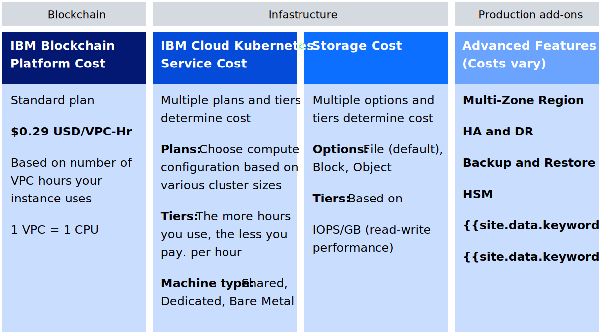

---

copyright:
  years: 2019, 2020
lastupdated: "2020-06-04"

keywords: pricing model, hourly, per hour, VPC, CPU, vCPU, virtual core, cost, scalability, estimation, optimize your cost, billing, free, trial, preview, pricing examples

subcollection: blockchain

---

{:external: target="_blank" .external}
{:shortdesc: .shortdesc}
{:screen: .screen}
{:codeblock: .codeblock}
{:note: .note}
{:important: .important}
{:tip: .tip}
{:gif: data-image-type='gif'}
{:help: data-hd-content-type='help'}
{:support: data-reuse='support'}
{:pre: .pre}

# Pricing for {{site.data.keyword.blockchainfull_notm}} Platform for {{site.data.keyword.cloud_notm}}
{: #ibp-saas-pricing}

This guide helps you understand the pricing model for {{site.data.keyword.blockchainfull}} Platform for {{site.data.keyword.cloud_notm}}, and how much you will pay when you develop and grow your blockchain network of peers, ordering nodes, and Certificate Authorities components, which are based on Hyperledger Fabric v1.4.7 and v2.x.
{:shortdesc}

## Pricing model
{: #ibp-saas-pricing-model}

{{site.data.keyword.blockchainfull_notm}} Platform introduces a new hourly pricing model that is based on virtual processor core (VPC) allocation. This simplified model is based on the amount of CPU (or VPC) that your {{site.data.keyword.blockchainfull_notm}} Platform nodes are allocated on an hourly basis, at a flat rate of **$0.29 USD/VPC-hour**.

A VPC is a unit of measurement that is used to determine the licensing cost of {{site.data.keyword.IBM_notm}} products. It is based on the number of virtual cores (vCPUs) that are available to the product. A vCPU is a virtual core that is assigned to a virtual machine or a physical processor core. For {{site.data.keyword.blockchainfull_notm}} Platform cost estimation purposes, **1 VPC = 1 CPU = 1 vCPU = 1 Core**.
{:note}

For a total cost estimate, remember that your blockchain network consists of an Kubernetes cluster on {{site.data.keyword.cloud_notm}} that contains {{site.data.keyword.blockchainfull_notm}} Platform components and uses storage of your choice. Your Kubernetes cluster on {{site.data.keyword.cloud_notm}} and the storage that you choose incur separate charges. You will not be charged for the cluster that the Operational Tooling instance, also known as the console, is running on. See the [Architecture reference](/docs/blockchain?topic=blockchain-ibp-console-overview#ibp-console-overview-architecture) topic for an illustration. More details on how to calculate charges are described below.

### Benefits of the new pricing model
{: #ibp-saas-pricing-benefits}

- **No membership fees**: Freedom from membership fees means that you can invest directly in your blockchain components.
- **Estimation clarity**: A simple hourly pricing model makes cost estimation clear and easy by using the cost estimator tool that is available in the {{site.data.keyword.cloud_notm}} dashboard.
- **No minimum fee required**: Pay for only what you use, no minimum VPC hourly package is required, which makes it very inexpensive to get started.
- **Scalability of compute**: You have the option to scale your compute up during peak usage periods or down to a minute fraction of capacity for when the compute is not needed to minimize expense.  

In summary, these features remove the complexity of accounting for membership limitations or purchasing compute ahead of your needs.

### Are you a developer?
{: #ibp-saas-pricing-developer}

Developers can get started with the free [extension for VS Code](https://marketplace.visualstudio.com/items?itemName=IBMBlockchain.ibm-blockchain-platform){: external}. Use this integrated developer environment to write, test, debug, and package smart contracts locally and for {{site.data.keyword.blockchainfull_notm}} Platform deployment, as well as to write client applications. Start from scratch or access tutorials and samples to learn blockchain fundamentals. Then, come back and link an {{site.data.keyword.blockchainfull_notm}} Platform service instance to your Kubernetes cluster so that you can build your blockchain network by using the console.

### Find out how to preview the platform free for 30 days
{: #ibp-saas-pricing-free}

You can preview the {{site.data.keyword.blockchainfull_notm}} Platform at no charge for 30 days when you link your {{site.data.keyword.blockchainfull_notm}} Platform service instance to an {{site.data.keyword.cloud_notm}} Kubernetes **free** cluster.

#### Limitations of the free preview
{: #ibp-saas-pricing-free-limits}

* Performance will be limited by throughput, storage, and functionality. Read more about the [limitations of free clusters](/docs/containers?topic=containers-cs_ov#cluster_types).
* {{site.data.keyword.cloud_notm}} will delete your Kubernetes cluster after 30 days.
* Only one blockchain console can be connected to a free cluster at a time.
* You cannot migrate any nodes or data from a free cluster to a paid cluster.

The following capabilities are only available on a paid cluster:

- Customizing resource allocation for a node during or after deployment.
- Using a Hardware Security Module (HSM) to secure the private key for a node.
- Configuring a Certificate Authority (CA) for high availability by using a PostgreSQL database and replica sets.
- Selecting a specific Kubernetes zone when deploying a node.
- Overriding node configuration during or after deployment by using the console or APIs.
- Adding or removing ordering nodes to an ordering service. The free offering only supports a single node Raft ordering service.

#### How to preview {{site.data.keyword.IBM_notm}} Blockchain Platform for free
{: #ibp-saas-pricing-free-howto}

1. Get an [{{site.data.keyword.cloud_notm}} Account](https://cloud.ibm.com/registration?target=%2Fcatalog%2Fservices%2Fblockchain){:external}.
2. Upgrade your {{site.data.keyword.cloud_notm}} Account to "Pay-as-you-go" by adding in a credit card. You will not be charged.
3. Launch {{site.data.keyword.blockchainfull_notm}} Platform in the [{{site.data.keyword.cloud_notm}} Catalog](https://cloud.ibm.com/catalog/services/blockchain-platform){: external}.
4. Under **Select a pricing plan**, ensure that the **Standard** plan is selected and then click **Create**.
5. On the **Welcome and pre-requisites** panel that opens, click **I have a Cluster (Skip to Link a cluster)**.
6. In the **Select an {{site.data.keyword.IBM_notm}} Kubernetes Service cluster** drop-down list, select your free cluster. **Note:** If your free cluster is not listed, ensure sure you are not using the ESR version of Firefox. If you are, switch to another browser such as Chrome and retry.
7. Click **Deploy to cluster**.
8. When the platform is ready, you can click **Launch the {{site.data.keyword.blockchainfull_notm}} Platform** to open the blockchain console UI and get started. Watch the [video](http://ibm.biz/BlockchainPlatformSeries2){: external} to learn how to Deploy a peer on the {{site.data.keyword.blockchainfull_notm}} Platform,  or try out the getting started tutorial [Build a network](/docs/blockchain?topic=blockchain-ibp-console-build-network).

After 30 days, your Kubernetes cluster is deleted along with all of your blockchain nodes and data.

## Key elements of cost
{: #ibp-saas-pricing-elements}

Because your blockchain network consists of an Kubernetes cluster on {{site.data.keyword.cloud_notm}} that contains {{site.data.keyword.blockchainfull_notm}} Platform components and uses storage of your choice, each of the following elements forms your total cost.

{: caption="Figure 1. Elements of pricing" caption-side="bottom"}

- **{{site.data.keyword.blockchainfull_notm}} Platform:** Based on a flat rate of $0.29 USD/VPC-hour. This fee represents the charge for your blockchain component VPC allocation in your Kubernetes cluster.
- **{{site.data.keyword.cloud_notm}} Kubernetes Service:** While you can link your {{site.data.keyword.blockchainfull_notm}} Platform service instance to either an {{site.data.keyword.cloud_notm}} Kubernetes service cluster or an OpenShift cluster, this pricing model is based on the usage of an {{site.data.keyword.cloud_notm}} Kubernetes service cluster. The {{site.data.keyword.cloud_notm}} Kubernetes service uses a tiered pricing model that is visible in {{site.data.keyword.cloud_notm}} when you provision your paid cluster. This includes the charges for your compute, that is, CPU and memory. {{site.data.keyword.cloud_notm}} Kubernetes Services are priced on a tiered model that is based on the number of hours of usage per month. Therefore, when you examine pricing plans, consider that 24x7 usage is equivalent to 720 hours per month. Refer to the table on the [Kubernetes Service Catalog page](https://cloud.ibm.com/kubernetes/catalog/cluster){: external} for more details on cluster pricing. Customers who are interested in pricing OpenShift clusters can review [Red Hat OpenShift on {{site.data.keyword.cloud_notm}} Pricing](https://www.ibm.com/cloud/openshift/pricing).
- **Storage:** Choose the storage plan that works for your needs. See [Understanding Kubernetes storage basics](/docs/containers?topic=containers-kube_concepts#kube_concepts) to learn more about your storage class options and how much they [cost](https://www.ibm.com/cloud/file-storage/pricing){: external}. The {{site.data.keyword.blockchainfull_notm}} Platform nodes use the default storage class for the cluster. When you provision a Kubernetes cluster in {{site.data.keyword.cloud_notm}}, it is preconfigured with [Bronze level File storage](/docs/containers?topic=containers-file_storage#file_predefined_storageclass) as the persistent storage plug-in.
- **Advanced features:** Options that are available for Production networks for increased security, disaster recovery, and health monitoring of the nodes. Costs vary depending on the options you choose.

When you allocate VPCs (or CPU) to a blockchain node, the node consumes CPUs from your Kubernetes cluster allocation. Therefore the size of the Kubernetes cluster that is required directly depends on the size and quantity of the blockchain nodes that you deploy.
{: tip}

## Pricing examples
{: #ibp-saas-pricing-scenarios}

The following table provides two examples of pricing with [default resource allocations]( #ibp-saas-pricing-default) unless otherwise noted. Both examples assume an {{site.data.keyword.cloud_notm}} Kubernetes service cluster and the default CouchDB database is used as the peer database. 
- The **Test network** scenario is suitable for getting started with your first use case with IBM Blockchain and testing smart contracts.
- The **Join a network** scenario includes two peers, and a Certificate Authority (CA) that is required for organization membership.
   - These peers can join a production {{site.data.keyword.blockchainfull_notm}} Platform network that is hosted elsewhere.
   - Nodes can always be dialed back to a minimal utilization state (0.001 CPU) when they are not in use to [lower costs](/docs/blockchain?topic=blockchain-ibp-console-govern-components).
   - Because this scenario could be used for a **production** environment:
     - The default compute resources have been doubled to provide greater capacity.
     - The [Silver](/docs/containers?topic=containers-file_storage#file_storageclass_reference){: external} storage class is chosen for faster performance.

| Pricing options** (1 VPC = 1 CPU = 1 vCPU)| **Test Network** | **Join a Network** |
|-|------------|-----------------------------|
| **CPU allocation** |  1.65 vCPU   Includes:   - 1 peer (1.1 vCPU)   - 2 CAs (0.1 vCPU x 2)   - 1 ordering node (0.35 vCPU)| 4.5 vCPU  Includes:   - 2 peers (for HA)   **(2x default compute = 2 x 1.1 x 2)**  - 1 CA (0.1)    |
| **Hourly cost: {{site.data.keyword.blockchainfull_notm}} Platform** | $0.48 USD   (1.65 vCPU x $0.29 USD/VPC-hr) | $1.31 USD   (4.5 vCPUx $0.29 USD/VPC-hr ) |
| **Hourly cost: {{site.data.keyword.cloud_notm}} Kubernetes cluster**   | $0.27 USD   (Compute: 4 x 16 lowest tier; 1 worker node; 1 zone)   (IP Allocation: $16 USD/month) | $0.46 USD   (Compute: 8 x 32 lowest tier; 1 worker node; 1 zone)   (IP Allocation: $16 USD/month) |
| **Hourly cost: Storage** | $0.07 USD   340GB    [Bronze](https://www.ibm.com/cloud/file-storage/pricing){: external}    2 IOPS/GB | $0.13 USD   420GB   [Silver](https://www.ibm.com/cloud/file-storage/pricing){: external}   4 IOPS/GB  |
| **Total hourly cost** | **$0.82 USD** | **$1.90 USD**| |
{: caption="Table 1. Pricing examples for a test network and joining a network" caption-side="bottom"}

** [Preview the {{site.data.keyword.blockchainfull_notm}} Platform at no charge](/docs/blockchain?topic=blockchain-ibp-saas-pricing#ibp-saas-pricing-free) for 30 days when you link your {{site.data.keyword.blockchainfull_notm}} Platform service instance to an {{site.data.keyword.cloud_notm}} Kubernetes free cluster. Performance is limited by throughput, storage and functionality. {{site.data.keyword.cloud_notm}} will delete your Kubernetes cluster after 30 days and you cannot migrate any nodes or data from a free cluster to a paid cluster.  

Your actual costs will vary depending on additional factors such as transaction rate, the number of channels you require, the payload size on the transactions, and the maximum number of concurrent transactions. The pricing examples above are based on an {{site.data.keyword.cloud_notm}} Kubernetes single-zone cluster only.  If you chose a multi-zone cluster, there are extra fees for the additional zones and the required multi-zone load balancer.
{:note}

There is no limit to the number of service instances that you can provision and associate to a single Kubernetes cluster. But you need to ensure that adequate resources are available by monitoring the CPU, memory, and storage usage to avoid disruption of service. The {{site.data.keyword.blockchainfull_notm}} Platform nodes do not have to be in their own cluster. You can have other {{site.data.keyword.cloud_notm}} services running in the same cluster that your blockchain components are running in, but again you need to ensure that you have adequate compute and storage to address all the requirements of all service instances.  

**Interested in more pricing examples?** See the Reference topic on [Detailed pricing scenarios](/docs/blockchain?topic=blockchain-ibp-detailed-pricing) for additional configurations and prices.

**Ready to get started?** Check out [Getting started with {{site.data.keyword.blockchainfull_notm}} Platform](/docs/blockchain?topic=blockchain-get-started-ibp) to see the options.

## Default resource allocations
{: #ibp-saas-pricing-default}

The values in the following table are useful to estimate the hourly cost of your custom network based on CPU, compute, and storage. These minimum recommended values are sufficient for getting started. As you monitor your network usage, you might find that your actual resource requirements and costs will vary depending on your use case and your security and availability needs.  

| **Component** (all containers) | CPU**  | Memory (GB) | Storage (GB) |
|--------------------------------|---------------|-----------------------|------------------------|
| **Peer**                       | 1.1           | 2.8                   | 200 (includes 100GB for peer and 100GB for state database)|
| **CA**                         | 0.1           | 0.2                   | 20                     |
| **Ordering node**              | 0.35          | 0.7                   | 100                    |
| **Operator**                   | 0.1           | 0.2                   | 0                      |

{: caption="Table 2. Recommended resources for nodes on {{site.data.keyword.blockchainfull_notm}} Platform for {{site.data.keyword.cloud_notm}}" caption-side="bottom"}

## Billing
{: #ibp-saas-pricing-billing}
{: help}
{: support}

Your {{site.data.keyword.blockchainfull_notm}} Platform billing and invoices are based on the CPU and memory allocation for each node. When you are done with your network and want to avoid any further charges, you need to delete your nodes from the console and then delete your blockchain service instance from {{site.data.keyword.cloud_notm}}. Storage that was provisioned for the node is automatically deleted when the node is deleted.

### {{site.data.keyword.cloud_notm}} and {{site.data.keyword.blockchainfull_notm}} Platform charges
{: #ibp-saas-pricing-iks-ibp}

If {{site.data.keyword.cloud_notm}} has your credit card on file, you will be sent a link to view your invoice. You can also view it from your {{site.data.keyword.cloud_notm}} Dashboard by navigating to **Manage** > **Billing and Usage** > **Invoices**.

1. Click the Download icon next to the invoice you want to view.
2. You will have the option to download your invoice in "PDF invoice" or "EXCEL invoice" format.

  * **PDF invoice** Select this format when limited detail is required. This format includes the line-item "Platform Services Containers" that includes your {{site.data.keyword.cloud_notm}} Kubernetes and Storage costs (as well as other container costs). The line item "Platform Services Other Services" aggregates your blockchain cost with other service costs.

  * **EXCEL invoice** Select this format when you need more insight into your Kubernetes containers, storage instances, and blockchain cost. Navigate to the Detailed Billing sheet in the downloaded invoice workbook to understand how those specific line items break down, and see details of the specific containers/storage instances you got charged for. The Blockchain Platform cost is visible under the Description line item "Platform Service Plan Feature Usage: Blockchain Platform Standard" . For example, a Detailed Billing tab would look similar to the following:

     {: caption="Figure 2. Kubernetes cluster IP Allocation charges" caption-side="bottom"}

The pie-chart visible on the Usage tab of the {{site.data.keyword.cloud_notm}} Dashboard will not align with the invoices since it applies to  a different billing period.  
{: note}

### IP Allocation charges

When you provision a Kubernetes cluster in {{site.data.keyword.cloud_notm}}, a flat monthly fee is assessed for IP Allocation. This fee is charged by zone, so that if you provision three zones in your cluster, you can multiply this charge by three. The example below shows the charge for a single zone.

{: caption="Figure 3. Kubernetes cluster IP Allocation charges" caption-side="bottom"}

This charge is visible on the **Invoices** tab of the Usage tile. Click the link under **Next Recurring Invoice** to see your charges for IP Allocation.

### Storage usage

If you are using {{site.data.keyword.cloud_notm}} File storage, the costs are assessed monthly, so an estimate of storage costs is not visible until the end of the month. However, the storage that you provisioned throughout the month is listed as line items in the Usage tile under **Sales** > **Orders**. Look in the **Items** column for a description of the storage that was dynamically provisioned when you deployed a peer, CA, or ordering node.

## Optimizing the cost of your nodes
{: #ibp-saas-pricing-shutdown}

One of the key benefits of the {{site.data.keyword.blockchainfull_notm}} Platform pricing model is the ability to dial back or delete resources when they are not needed.

- **Switch your nodes to Minimum Utilization State**  
  CPU on individual nodes can be scaled down to 0.001 CPU to completely minimize charges. Taking these actions renders the node non-functional. When the compute is needed later, you can use the reallocation option in the {{site.data.keyword.blockchainfull_notm}} Platform console to scale up to what is required. For more information about how resources can be reallocated, see [Reallocating resources](/docs/blockchain?topic=blockchain-ibp-console-govern-components).

- **Delete unused peer and deploy a new one when needed.**
  Because the ledger is stored on the ordering node, when you deploy a new peer and join a channel, the peer receives a copy of the distributed ledger. The drawback to this approach is that you need to generate new certificates and join the peer to the channels again.  

  It is not recommended to ever delete a CA node because the data on it can never be recovered. Likewise, if you have only a single ordering node, you should never delete it.  
  {:important}

- **Monitor and adjust your resource allocation based on your needs**.
  When you monitor your resource usage over time, you might decide that you can scale down the resources that are allocated to a node while still ensuring adequate performance. When you follow instructions for [reallocating resources](/docs/blockchain?topic=blockchain-ibp-console-govern-components) in the console, the effects on total VPC for the node are updated and can be used to estimate revised monthly costs.  
