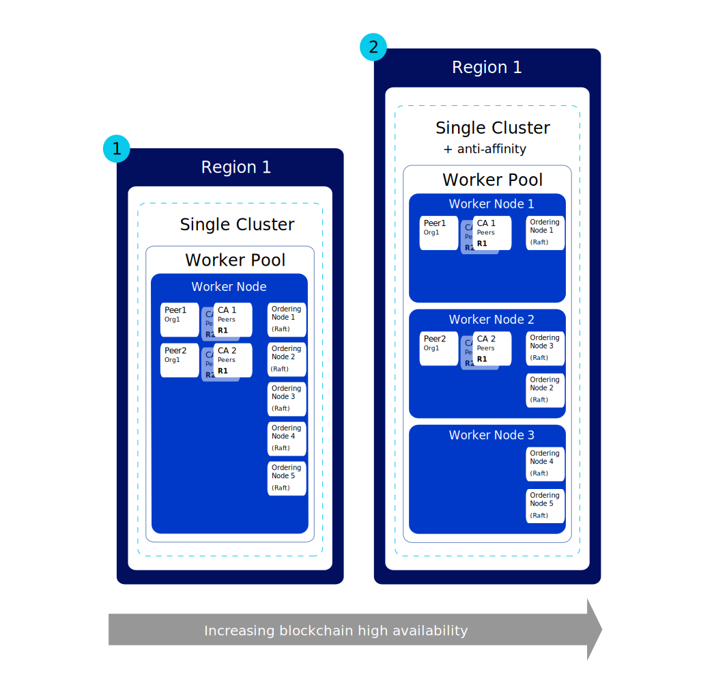
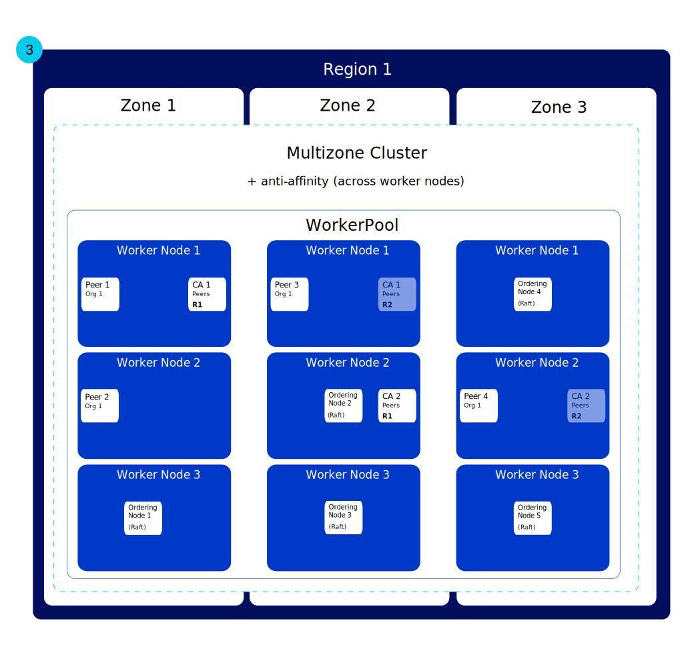

---

copyright:
  years: 2019, 2020
lastupdated: "2020-02-06"

keywords: high availability, HA, IBM Cloud, failures, zone failure, region failure, component failure, worker node failure

subcollection: blockchain

---

{:external: target="_blank" .external}
{:shortdesc: .shortdesc}
{:screen: .screen}
{:codeblock: .codeblock}
{:note: .note}
{:important: .important}
{:term: .term}
{:tip: .tip}
{:pre: .pre}

# High availability (HA)
{: #ibp-console-ha}

Use the built-in Kubernetes features along with {{site.data.keyword.blockchainfull}} Platform component deployment strategies to make your blockchain networks more highly available and to protect your network from downtime when a failure occurs in your cluster.
{:shortdesc}

**Target audience:** This topic is designed for architects and system administrators who are responsible for planning and configuring {{site.data.keyword.blockchainfull_notm}} on {{site.data.keyword.cloud_notm}} or on {{site.data.keyword.cloud_notm}} Private .

High availability is a core discipline in an IT infrastructure to keep your apps up and running, even after a partial or full site failure. The main purpose of high availability is to eliminate potential points of failures in an IT infrastructure. For example, you can prepare for the failure of one system by adding redundancy and setting up failover mechanisms.

You can achieve high availability on different levels in your IT infrastructure and within different layers of your cluster. The level of availability that is right for you depends on several factors, such as your business requirements, the Service Level Agreements that you have with your organizations, and the cost of redundancy.


Before proceeding, we recommend that you review the platform-specific guidance for HA:

- If you are using {{site.data.keyword.cloud_notm}}, you can read more about how HA works with Kubernetes in {{site.data.keyword.cloud_notm}} in this topic on [High availability for {{site.data.keyword.cloud_notm}} Kubernetes Service](/docs/containers?topic=containers-ha){: external}.
- If you are using {{site.data.keyword.cloud_notm}} Private, review the content about [Implementing HA on {{site.data.keyword.cloud_notm}} Private](https://www.ibm.com/cloud/garage/practices/manage/high-availability-ibm-cloud-private){: external}.  


Then you can use this topic for details on blockchain-specific HA guidance along with the recommendations from the platform-specific topic above.

## Overview of potential points of failure in {{site.data.keyword.blockchainfull_notm}} Platform
{: #ibp-console-ha-points-of-failure-overview}

The {{site.data.keyword.blockchainfull_notm}} Platform architecture is designed to ensure reliability, low processing latency, and a maximum uptime of the service. However, failures can happen. {{site.data.keyword.blockchainfull_notm}} Platform provides several approaches to add more availability to your cluster by adding redundancy and [anti-affinity](https://www.ibm.com/blogs/cloud-archive/2016/07/ibm-containers-anti-affinity/){: external} policies. Anti-affinity ensures that blockchain components of the same type and organization are deployed across different worker nodes.  By adding redundancy across your blockchain network, you can avoid failures or downtime.  

To achieve maximum high availability, it is recommended that you build redundancy by provisioning peers and orderers in Kubernetes clusters in multiple regions. When the components are spread across regions and the blockchain ledger is distributed across those components, a failure in any single region will not impact processing of transactions. CAs are less critical for daily transaction processing. After all the users have been registered and enrolled with the CA, it is no longer required until the next time those services are required.

### Peer considerations
{: #ibp-console-ha-peers}

HA for peers means always having redundant peers, that is at least two peers available for each organization on the same channel to process requests from client applications. Multiple peers can be deployed to a single worker node, or spread across worker nodes, zones (if you are using {{site.data.keyword.cloud_notm}}), or even regions. Whenever you deploy multiple peers and join them to the same channel, the peers act as HA pairs because the channel and the data are automatically synchronized across all peers in the channel.  By design, a blockchain network is meant to have multiple organizations that transact on the same channels.  Therefore, the common deployment model is that for any given channel, there are redundant peers for each organization spread across several organization account clusters that are all synchronizing data between each other.  Each organization can have a peer in their own cluster in any region. 

For even more robust HA coverage, you can stand up multiple clusters in multiple regions and deploy peers in all of them. However, if high performance is desired, care must be taken when distributing peers to ensure the latency and bandwidth between them is sufficient to achieve your performance targets.

**Anchor peers** on a channel facilitate cross-organization communication that is required for private data, gossip, and service discovery to work. If only one anchor peer exists on a channel, and that peer becomes unavailable, the organizations are no longer connected and the cross-organization gossip is no longer possible. Therefore, when you create redundant peers for an organization, be sure to add redundant [anchor peers on the channel](/docs/blockchain?topic=blockchain-ibp-console-govern#ibp-console-govern-channels-anchor-peers) as well.

Finally, your peer redundancy strategy needs to take into account your chaincode endorsement policies to ensure that you always have enough peers available to satisfy the endorsement policy requirements. For example, if an endorsement policy requires a specific number of endorsements, your peer HA strategy needs to ensure there are always that number of peers available. Alternatively, if the endorsement policy requires a `MAJORITY` of peers to endorse the transactions, then you need to ensure that a majority of the peers are always available in order for transactions to continue to be processed.

### Ordering service considerations
{: #ibp-console-ha-ordering-service}

{{site.data.keyword.blockchainfull_notm}} Platform  is built upon Hyperledger Fabric v1.4.3  that includes the Raft ordering service. Raft is a crash fault tolerant (CFT) ordering service based on an implementation of [Raft protocol](https://raft.github.io/raft.pdf){: external}. By design, Raft ordering nodes automatically synchronize data between them using Raft-based consensus. In {{site.data.keyword.blockchainfull_notm}} Platform, an organization network operator can choose to stand up either a single node Raft-based orderer, with no HA, or five orderers in a single region that are automatically configured for HA via Raft.


## HA Checklist
{: #ibp-console-ha-checklist}


The following table contains a list of options to consider as you plan for increasing degrees of HA.

|  | Single node | Single cluster with multiple nodes | Multizone ({{site.data.keyword.cloud_notm}} only**)| Multiple clusters across regions |
|-----|-----|-----|-----|-----|
| Redundant peers |  |  |  |  |
| Redundant anchors peers on a channel|  |  |  | |
| Anti-affinity*** (peers) |  |  |  | |
| Multi-zone (peers)*** |  |  |  | |
|Raft ordering service |  | | |  |
| Anti-affinity*** (ordering nodes) |  |  | | |
| Multi-zone (ordering nodes)*** |  |  |  | |
|Development or Test environment |  |  | | |
| Production environment | | |  |  |
{: row-headers}
{: class="comparison-table"}
{: caption="Table 1. Comparison of deployment scenarios to increase your network HA" caption-side="top"}
{: summary="This table has row and column headers. The row headers identify the deployment scenarios. The column headers identify available options in each scenario to increase your HA."}

  *** The {{site.data.keyword.blockchainfull_notm}} Platform deployer attempts to spread peers and ordering nodes across different worker nodes but cannot guarantee that it will happen due to resource limitations. You can also use the {{site.data.keyword.blockchainfull_notm}} Platform APIs or the blockchain console to deploy peers or ordering nodes to specific zones in order to ensure that they are resilient to a zone failure. For more information see [Multizone HA](#ibp-console-ha-multi-zone).  Multi-zone ([MZR](#x9774820){: term}) functionality is not available on {{site.data.keyword.cloud_notm}} Private.  

** The default configuration for a Standard Kubernetes cluster on {{site.data.keyword.cloud_notm}} is a 4 CPU x 16 GB RAM cluster that includes three zones with three worker nodes each. You can scale up or down, by selecting a smaller or larger configuration, according to your needs. 

## Potential points of failure
{: #ibp-console-ha-points-of-failure}

{{site.data.keyword.blockchainfull_notm}} Platform offers several approaches to add more availability to your network by adding redundancy and using anti-affinity policies. Review the following diagrams to learn more about potential points of failure and how to eliminate them. You can select a model based on your application criticality, service levels, and costs. As general rule, you can implement the redundancy to meet your service levels. All of these scenarios must be weighed against the cost of implementing greater resiliency.

### Single region HA
{: #ibp-console-ha-single-region}

{: caption="Figure 1. Blockchain HA single region options" caption-side="bottom"}


1. **Component failure.**

   **Single-zone cluster**:  

   Every time that you deploy a blockchain component, such as a peer, ordering node, or CA, a new pod is created for the component in a worker node. Containers and pods are, by design, short-lived and can fail unexpectedly. For example, a container or pod might crash if an error occurs in your component. So, to make your node highly available, you must ensure that you have enough instances of it to handle the workload plus extra instances in case of a failure.

   **Peers** How many peers are required? In a production scenario, the recommendation is to deploy three peers from the same organization to each channel. This configuration allows one peer to go down (for example, during a maintenance cycle) and still maintain two highly available peers. Therefore, to compensate for a peer failure, and for the most basic level of HA, you can achieve peer redundancy by simply deploying three peers per organization on a channel on your worker node. Note that you need to ensure that you have adequate resources available on your node to support these components.

   **Ordering service** As mentioned above, the HA ordering service is based on Raft, and contains five ordering nodes by default. Because the system can sustain the loss of nodes, including leader nodes, as long as there is a majority of ordering nodes (what’s known as a “quorum”) remaining, Raft is said to be “crash fault tolerant” (CFT). In other words, if you have five nodes in a channel, you can lose two nodes (leaving three remaining nodes). When you deploy an ordering service from the console, choose the five node service for HA.    
   This scenario uses redundant peers and ordering nodes which protects against component failure, but cannot protect from node failure.   
   Therefore, it is only suitable for development and testing purposes.

2. **Worker node failure.**  

   **Single-zone cluster with multiple worker nodes and anti-affinity**:

   A worker node is a VM that runs on a physical hardware. Worker node failures include hardware outages, such as power, cooling, or networking, and issues on the VM itself. You can account for a worker node failure by setting up multiple worker nodes when you provision your cluster. When blockchain components are distributed across multiple worker nodes, you are protected from a worker node failure.

   **Peers** The {{site.data.keyword.blockchainfull_notm}} Platform deployer anti-affinity policy distributes redundant peers, that is peers from the same organization, across the worker nodes in their cluster.

   **Ordering service** Whenever you deploy a Raft ordering service, the five ordering nodes are automatically distributed across the worker nodes in your cluster, using the anti-affinity policy and based on resource availability on the nodes.    This scenario uses redundant peers and ordering nodes across multiple worker nodes in a single cluster or zone, which protects against node failure, but cannot protect from a cluster or zone failure.  Therefore, it is not recommended for Production.

### Multizone HA ({{site.data.keyword.cloud_notm}} Kubernetes service only) 
{: #ibp-console-ha-multi-zone}

_This scenario only applies to customers using the {{site.data.keyword.cloud_notm}} Kubernetes Service._

{: caption="Figure 2. Blockchain HA single zone options" caption-side="bottom"}

   **Zone failure.**  

   **Multizone clusters with multiple work nodes and anti-affinity**:

   Think of a zone as a data center. A zone failure affects all physical compute hosts and NFS storage. Failures include power, cooling, networking, or storage outages, and natural disasters, like flooding, earthquakes, and hurricanes. To protect against a zone failure, you must have clusters in at least two different zones that are load balanced by an external load balancer. By default when you deploy a Kubernetes cluster in {{site.data.keyword.cloud_notm}}, the cluster is configured with mulit-zone support, including three zones, although you can choose two zones. Note that {{site.data.keyword.cloud_notm}} Private does not support zones.

   A single zone is sufficient for a development and test environment if you can tolerate an zone outage. Therefore, to leverage the HA benefits of multiple zones,  when you provision your cluster, ensure that multiple zones are selected. Two zones are better than one, but three are recommended for HA to increase the likelihood that the two additional zones can absorb the workload of any single zone failure.  When redundant peers from the same organization and channel, and ordering nodes, are spread across multiple zones, a failure in any one zone should not affect the ability of the network to process transactions because the workload will shift to the blockchain nodes in the other zones.

   You can use the {{site.data.keyword.blockchainfull_notm}} Platform console to specify the zone where a  peer or ordering node is created. When you deploy a peer, or ordering service (or a single ordering node), check the Advanced deployment option that is labelled **Kubernetes zone selection** to see the list of zones that are currently configured for your Kubernetes cluster.

   If you're deploying a peer or ordering service, you have the option to select the zone from the zones you have available or let your Kubernetes cluster decide for you by leaving the default selected. For a five node ordering service, these nodes will be distributed into multiple zones by default, depending on the relative space available in each zone. You also have the ability to distribute a five node ordering service yourself by unselecting the default option to have the zones chosen for you and distributing these nodes into the zones you have available. If you are deploying a redundant node (that is, another peer when you already have one), it is a best practice to deploy this node into a different zone. You you can check which zone the other node was deployed to by opening the tile of the node and looking under the **Node location**. Alternatively, you can use the APIs to deploy a peer or orderer to a specific zone. For more information on how to do this with the APIs, see [Creating a node within a specific zone](/docs/blockchain?topic=blockchain-ibp-v2-apis#ibp-v2-apis-zone).  This scenario uses redundant peers and ordering nodes across multiple worker nodes and multiple zones, which protects against zone failure, but does not protect from an unlikely entire region failure. This scenario is recommended for a production network.

   If you choose to use a multi-zone configuration for peers or ordering nodes you are responsible for configuring the storage for each zone and set the node affinity to zones.
   {: important}

### Multi-region HA
{: #ibp-console-ha-multi-region}

This scenario offers the highest level of HA possible.

{: caption="Figure 3. Blockchain HA multi-region options" caption-side="bottom"}

   **Region failure.**

   **Multi-region clusters with multiple work nodes and anti-affinity**:

   The likelihood of a full regional failure is low. However, to account for this failure, you can set up multiple clusters in different regions where each cluster has it's own linked console. If an entire region fails, redundant peers in the cluster in the other regions can service the work load. For production environments, configuring your blockchain **peers** across multiple regions provides the maximum HA coverage available.

   This scenario uses redundant peers across multiple worker nodes in multiple regions, which provide the highest degree of HA. This approach is also a recommended scenario for a production network when your resiliency requirements merit the investment.  

   See this topic on [Setting up multi-region HA deployments](/docs/blockchain?topic=blockchain-ibp-console-hadr-mr) for steps to configure your {{site.data.keyword.blockchainfull_notm}} Platform peers across multiple regions.

## Disaster recovery (DR)
{: #ibp-console-ha-dr}

The most important step for disaster recovery is to configure your environment across multiple regions as documented in the previous section. Multi-region configuration ensures that your environment can handle a datacenter or regional disaster with zero downtime or data loss. However, this does not protect against data corruption or accidental deletion. To do this, you may want to also take periodic backups.

It is recommended that you regularly back up the storage associated with every deployed component. Because the ledger is shared across all the peers and ordering nodes, taking regular backups is critical. For example, if incorrect data is accidentally propagated to a peer's ledger or if data is mistakenly deleted, the incorrect data might spread to the ledgers of some other peers. This would require the restoration of the ledgers of all the peers from an established backup point to ensure synchronicity. You can decide how often to perform the backups based your recovery needs, but a general guideline would be to take daily backups.

All nodes must be [stopped](#ibp-console-ha-stop-nodes) in order to ensure a reliable backup.
{: important}


| Storage solution provider | Guidance |
|----------|---------|
| {{site.data.keyword.cloud_notm}} storage solution | You can leverage the [capability provided by {{site.data.keyword.cloud_notm}} Kubernetes service](/docs/services/RegistryImages/ibm-backup-restore?topic=RegistryImages-ibmbackup_restore_starter#ibmbackup_restore_starter){: external}. |
| {{site.data.keyword.cloud_notm}} Private storage solution | You can use the backup or restore technology provided by your storage provider.  |
| Portworx | While a [snapshot capability](https://docs.portworx.com/portworx-install-with-kubernetes/cloud/ibm/#prerequisites){: external} is available for taking backups, in order to get a reliable backup, the nodes must be stopped. |
{: caption="Table 2. Backup recommendations for storage" caption-side="top"}


When you need to restore a backup, the backups would need to be restored on every component across your network.


### Stopping nodes to prepare for a backup
{: #ibp-console-ha-stop-nodes}

If you are not using Portworx as your storage solution, you can use the following `kubectl` command to stop the nodes before you take the backup, for example:

   ```
   kubectl scale deployment <my-deployment> --replicas=0
   ```
   {:codeblock}

   Run the backup.
   Restart the nodes:

   ```
   kubectl scale deployment <my-deployment> --replicas=1
   ```
   {:codeblock}

This example assumes your environment is running with a 1 replica. Currently, replica sets are not supported for CAs, ordering nodes, or peers.
{: note}

You can find your deployments by running the command:

   ```
   kubectl get deployment -n <NAMESPACE>
   ```
   {:codeblock}

   where `<NAMESPACE>` can be determined by running the command `kubectl get namespace` and choose the namespace value that begins with `n`.

### Node considerations
{: #ibp-console-ha-dr-node-considerations}

The following node-specific guidance is provided to help plan your disaster recovery strategy.


|  Backup  | Restore |
|:---------|---------|
| CAs must be stopped and backed up following the instructions provided in this topic. | You can restore a CA without impacting the peers or the ordering nodes ability to process transactions. |
{: caption="Table 3. Considerations for node backup and restore" caption-side="top"}
{: #simpletabtable5}
{: tab-title="Certificate Authority (CA)"}
{: tab-group="IAM-simple"}
{: class="simple-tab-table"}

|  Backup  | Transaction processing | Private data considerations |
|:---------|:-----------------------|:----------------------------|
| Peers must be stopped and backed up one at a time, following the instructions provided in this topic. It is recommended that you have more than one peer per channel, so they can be stopped and backed up individually. | Transaction processing on the peers will not stop, as long as you have more than one peer per organization.  | If the peers include private data collections, it is recommended that you coordinate the backup of the ordering nodes and all connected peer nodes during the same window (see the Ordering Service tab). |
{: caption="Table 3. Considerations for node backup and restore" caption-side="top"}
{: #simpletabtable5}
{: tab-title="Peers"}
{: tab-group="IAM-simple"}
{: class="simple-tab-table"}

|  Backup  | Transaction processing | Restore |
|:---------|:-----------------------|:--------|
| To back up the ordering service, all the ordering nodes need to be stopped. You can do this by scaling down the deployments replica sets to 0, but you need to scale down the deployment for all nodes, back each one up, then scale back up all fives nodes. | Since the ordering service is down, transaction processing stops. | **If you are not using private data collections**, you can provision _new_ peers and rejoin the channels. The peers will sync up with the latest data from the  ordering service, then you can reinstall any chaincode. <br>Or, you can restore the peers from a backup older than the ordering nodes. In this case, the peers will only have to catch up from the last backup, which is faster. And you will only need to install any chaincode installed since the last backup. <br><br> **If you are using private data collections**, the peers must be restored to exactly the same block height as the orderers. The best way to ensure this is to backup all peers while the ordering service is also down for backup. |
{: caption="Table 3. Considerations for node backup and restore" caption-side="top"}
{: #simpletabtable5}
{: tab-title="Ordering service"}
{: tab-group="IAM-simple"}
{: class="simple-tab-table"}

