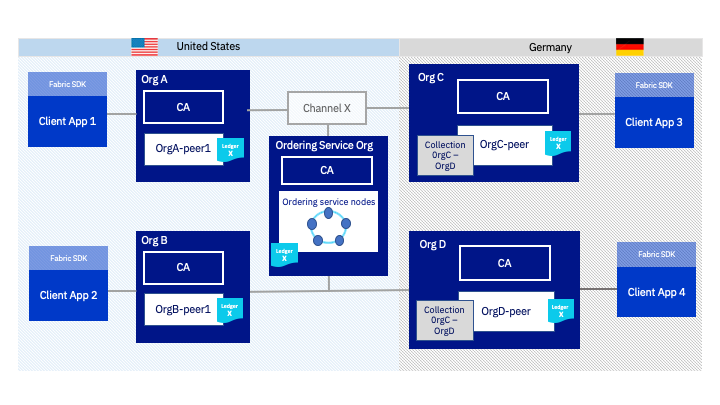

---

copyright:
  years: 2017, 2019
lastupdated: "2019-07-10"

keywords: IBM Blockchain Platform, IBM Cloud Private, AWS, Data residency, world state

subcollection: blockchain

---

{:shortdesc: .shortdesc}
{:screen: .screen}
{:codeblock: .codeblock}
{:note: .note}
{:important: .important}
{:tip: .tip}
{:pre: .pre}
{:external: target="_blank" .external}

# Datenspeicherort
{: #console-icp-about-data-residency}

Da Blockchain-Netze dem Typ der verarbeiteten Daten keine Beachtung schenken, müssen bisweilen zusätzliche Schritte ausgeführt werden, damit bestimmte Arten von Daten geschützt bleiben. Die gängigste Anforderung zum Datenspeicherort besteht in Bezug auf die Gesetzgebung einiger Länder, die vorgibt, dass alle Daten, die in einem IT-System verarbeitet und gespeichert werden, innerhalb der Grenzen eines bestimmten Landes verbleiben müssen. Ähnlich wird von bestimmten Unternehmen in stark regulierten Branchen (z. B. Behörden, Gesundheitswesen und Finanzdienstleistungen) vorgegeben, dass Daten vollständig hinter einer Firewall gespeichert werden müssen.

Blockchain-Netze ermöglichen mehreren Organisationen die Verwendung eines verteilten Ledgers, um Daten auf anerkannte und sichere Art zu übertragen und gemeinsam zu nutzen. Dies setzt jedoch voraus, dass die betreffenden Daten auf die Knoten des Netzes verteilt werden können und auf die Regionen, in denen sich diese Knoten befinden. Die Organisationen können mehrere Optionen verwenden, um Daten vom übrigen Netz zu trennen und einen entsprechenden Datenspeicherort zu realisieren:
1. [Private Datensammlungen in einem gemeinsam genutzten Kanal](#console-icp-about-data-residency-fabric)
2. [Private Datensammlungen in einem separaten Kanal](#console-icp-about-data-residency-use-case)
3. [Separater Kanal mit allen Kanalknoten in einem einzigen Land](#console-icp-about-data-residency-use-case-channel)

Jeder Ansatz bietet ein höheres Maß an Datenisolation und -schutz für Ihre Daten und erfordert zugleich einen höheren Implementierungs- und Verwaltungsaufwand. Als Illustration für die Verwendung der einzelnen Optionen bei der Realisierung der Datenresidenz (Datenspeicherort) dient eine Übersicht der Vorgehensweise bei der gemeinsamen Datennutzung in einem Hyperledger Fabric-Netz. Anschließend wird an einem Beispielanwendungsfall erläutert, wie Organisationen in einem Blockchain-Konsortium die einzelnen Optionen verwenden würden, um ihre Daten zu trennen und sicherzustellen, dass sie innerhalb der jeweiligen Region bleiben.

## Gemeinsame Datennutzung in einem {{site.data.keyword.blockchainfull_notm}} Platform-Netz
{: #console-icp-about-data-residency-fabric}

Die Architektur von Hyperledger Fabric, auf die {{site.data.keyword.blockchainfull_notm}} Platform aufbaut, basiert auf drei Schlüsselkomponenten: einem Anordnungsservice (bestehend aus Anordnungsknoten), Zertifizierungsstellen (Certificate Authorities, CAs) und Peers. Darüber hinaus senden Organisationen Transaktionen an diese Knoten über Clientanwendungen mithilfe der [Fabric-SDKs](https://hyperledger-fabric.readthedocs.io/en/release-1.4/getting_started.html){: external}. Im Hinblick auf die Wahl des Datenspeicherorts ist es von großer Bedeutung, wie diese Komponenten mit Daten interagieren und Daten speichern.

**Peers** werden von Mitgliedern des Konsortiums verwendet, um das Blockchain-[Ledger](https://hyperledger-fabric.readthedocs.io/en/release-1.4/ledger/ledger.html){: external} zu speichern. Das Blockchain-Ledger besteht aus zwei Komponenten. Die erste Komponente ist der World-Status, in dem die neuesten Werte für alle Ledgerdaten als Schlüssel/Wert-Paare gespeichert werden. Die zweite Komponente ist der Blockchain-Datensatz für jede Transaktion. Statusaktualisierungen werden in Form von neuen Blöcken vom Anordnungsservice an die Peers übergeben. Die Peers verwenden diese Blöcke und den World-Status zum Bestätigen (oder Festschreiben) von Transaktionen, zum Aktualisieren des World-Status und zum Hinzufügen des Transaktionsprotokolls in der Blockchain. Der Anordnungsservice legt die Reihenfolge der Transaktionen für alle Peers im [Konsortium](/docs/services/blockchain?topic=blockchain-glossary#glossary-consortium) fest und speichert eine Kopie des Blockchain-Teils der Ledger-Daten.

**Kanäle** sind eine Komponente für die Datenübertragung in einem Netz. Ohne den Beitritt zu einem Kanal ist keine Teilnahme an einem Blockchain-Netz möglich. Mithilfe von Kanälen können Netzmitglieder die logische Trennung von Geschäftsanwendungen realisieren und sogar die Leistung erhöhen, indem der Datenverkehr begrenzt wird. Außerdem können Kanäle von Untergruppen der Organisationen im Konsortium verwendet werden, um private Transaktionen auszuführen und Daten zu isolieren.

Peers verwalten ein separates Ledger für jeden Kanal, dem sie beitreten. Nur Organisationen, die Mitglied des Kanals sind, können ihre Peers zum Kanal hinzufügen und Ledgeraktualisierungen vom Anordnungsservice empfangen. Im Ergebnis wird jeder Kanal an einen Anordnungsservice gebunden, der den Blockchain-Anteil jedes von ihm verwalteten Kanalledgers speichert. Clientanwendungen übergeben Transaktionen an die Peers und den Anordnungsservice eines angegebenen Kanals. Diese Transaktionen werden zum Transaktionsprotokoll in der Blockchain hinzugefügt und enthalten einen [Lese-/Schreibsatz](https://hyperledger-fabric.readthedocs.io/en/release-1.4/readwrite.html){: external}, der zu den Schlüssel/Wert-Paaren im World-Status hinzugefügt wird.

Wenn die Datenspeicherung in einem bestimmten Land erforderlich ist, müssen Sie die Standorte Ihrer Peers, des Anordnungsservice und Ihrer Clientanwendungen berücksichtigen. Außerdem müssen Sie den Standort der Peers kennen, die anderen Organisationen in Ihren Kanälen angehören. Wenn Sie mit {{site.data.keyword.blockchainfull_notm}} Platform for {{site.data.keyword.cloud_notm}} arbeiten, können Sie die Liste der [{{site.data.keyword.blockchainfull_notm}} Platform-Regionen und -Standorte](/docs/services/blockchain/reference?topic=blockchain-ibp-regions-locations#ibp-regions-locations) ermitteln, in bzw. an denen die Mitglieder Ihres Konsortiums Ihre Komponenten bereitstellen können.

## Anwendungsfall für Datenspeicherort
{: #console-icp-about-data-residency-use-case}

Anhand eines Beispielkonsortiums wird dargestellt, wie Daten in {{site.data.keyword.blockchainfull_notm}} Platform verteilt werden und wie Mitglieder die Festlegung des Datenspeicherorts realisieren können. Die nachfolgende Abbildung enthält ein Konsortium, das aus einem Anordnungsservice und vier Organisationen besteht. Jede Organisation verfügt über einen Peerknoten. Zwei Organisationen (Org. A und Org. B) und der Anordnungsservice befinden sich in den Vereinigten Staaten. Die beiden anderen Organisationen (Org. C und Org. D) befinden sich in Deutschland. Alle vier Organisationen sind Mitglieder von Kanal X und ihre Peers sind diesem Kanal beigetreten.

Jeder Peer, der Kanal X beigetreten ist, speichert eine Kopie des Kanalledgers, das in **Abbildung 1** als Ledger X dargestellt ist. Da Peers aus den Vereinigten Staaten und aus Deutschland dem Kanal beigetreten sind, befinden sich die Daten des Kanalledgers in beiden geografischen Regionen. Der Blockchain-Anteil des Ledgers wird außerdem von dem Anordnungsservice gespeichert, der sich in den Vereinigten Staaten befindet.

Wenn zwei Organisationen in dem Konsortium einen zweiten Kanal (Kanal Y) einrichten, wird ein zweites Ledger erstellt und in den Peers der Kanalmitglieder gespeichert. Nur Organisationen, die dem Kanal beigetreten sind, erhalten eine Kopie der Kanaldaten.

In **Abbildung 2** sind "Org. B" und "Org. D" dem Kanal Y beigetreten. In den Peers von "Org. B" und "Org. D" wird jetzt eine Kopie von "Ledger Y" gespeichert (zusätzlich zu "Ledger X"). Da "Kanal X" und "Kanal Y" vom selben Anordnungsservice erstellt wurden, verfügt der Anordnungsservice nun über eine Kopie des Blockchain-Anteils beider Kanalledger. In **Abbildung 1** und in **Abbildung 2** werden Daten, die von Anwendungen in Deutschland erstellt werden, in den Vereinigten Staaten gespeichert. Dies ist unerwünscht, wenn ein gleich bleibender Datenspeicherort erforderlich ist.

Anhand des oben angegebenen Beispiels kann untersucht werden, mit welchen Optionen Organisationen den Datenspeicherort steuern können. Angenommen, eine gesetzliche Bestimmung in Deutschland legt fest, dass bestimmte Daten, die von "Org. C" und "Org. D" erstellt wurden, nur innerhalb des Landes gespeichert werden dürfen. Die Organisationen in Deutschland können alle drei Optionen nutzen, um zu verhindern, dass Daten in den Vereinigten Staaten gespeichert werden.

## Option 1: Private Datensammlungen in einem gemeinsam genutzten Kanal
{: #console-icp-about-data-residency-use-case-private-data}

"Org. C" und "Org. D" können die [Funktion für private Daten](https://hyperledger-fabric.readthedocs.io/en/release-1.4/private-data/private-data.html#what-is-a-private-data-collection "Was ist eine private Datensammlung?"){: external} von Hyperledger Fabric verwenden, um zu verhindern, dass Daten auf alle Organisationen in dem Kanal verteilt werden. Private Datensammlungen ermöglichen Organisationen die gemeinsame Nutzung von Statusdaten zwischen Peers (über das Gossip-Protokoll) mit anderen Organisationen, die zum Lesen der Datensammlung berechtigt sind. Die Daten werden in einer separaten privaten Datenbank auf dem Peer gespeichert. Der Anordnungsservice ist daran nicht beteiligt und kann die Daten nicht aufrufen. Nur Hashwerte der Daten in der Sammlung werden zum Kanalledger hinzugefügt und auf den Peers anderer Kanalmitglieder sowie im Anordnungsservice gespeichert. Auf diese Weise können Organisationen private Daten überprüfen, wenn die Absicht besteht, die Transaktionsdetails allgemein zugänglich zu machen. Weitere Informationen finden Sie im Artikel über das Konzept [private Daten](https://hyperledger-fabric.readthedocs.io/en/release-1.4/private-data/private-data.html#private-data "private Daten"){: external} in der Fabric-Dokumentation.

In **Abbildung 3** wurde von "Org. C" und "Org. D" eine private Datensammlung (die Datensammlung "OrgC-OrgD") erstellt, die es den Organisationen ermöglicht, Transaktionen auszuführen, ohne Daten mit "Org. A", "Org. B" oder dem Anordnungsservice zu teilen. Die Schlüssel/Wert-Statusdaten aus dieser Datensammlung werden nur auf den Peers von "Org. C" und "Org. D" gespeichert und nicht außerhalb von Deutschland. Die Hashwerte der Daten aus der Datensammlung werden jedoch im Ledger X gespeichert und mit dem umfassenderen Kanal gemeinsam genutzt. Dies bedeutet, dass Hashwerte der Daten aus der Datensammlung "OrgC-OrgD" auf den Peers und dem Anordnungsservice in den Vereinigten Staaten gespeichert werden.

Im Zusammenhang mit privaten Daten ist der Unterschied zwischen **hashverschlüsselten Daten** und **verschlüsselten Daten** von Bedeutung. Bei der Verschlüsselung werden Daten durch eine bidirektionale Funktion in ein Format umgewandelt, das den ursprünglichen Wert verbirgt und später in die ursprünglichen Daten zurückverwandelt werden kann. Beispiel: Beim Übertragen von Daten in einem Netz, das durch TLS geschützt ist, werden die Daten mithilfe eines TLS-Zertifikats verschlüsselt. Die verschlüsselten Daten werden als kryptografischer Text im Netz übertragen und anschließend vom Empfänger entschlüsselt. Der verschlüsselte Text enthält alle ursprünglichen Daten und kann mit einem privaten Schlüssel entschlüsselt werden. Das Hashing ist jedoch eine unidirektionale Funktion, die aus den Daten eine eindeutige Zeichenfolge mit Ziffern und Buchstaben erzeugt. Die hashverschlüsselten Daten können nicht anhand des Hashwerts in ihre ursprüngliche Form zurückverwandelt werden. Zum Überprüfen der Daten, aus denen der Hashwert erstellt wurde, muss der Empfänger einen neuen Hashwert aus den ursprünglichen Daten anhand derselben Hashfunktion erstellen und prüfen, ob die Hashwerte übereinstimmen. Für eine Drittpartei sind die Hashwerte nur nutzbar, wenn zusätzlich eine Kopie der ursprünglichen Daten vorliegt.  

Bei Verwendung dieser Option ist zu beachten, dass "Org. A" und "Org. B" die tatsächlichen Ledgerdaten aufgrund der Hashverschlüsselung nicht lesen können. Sie können jedoch erkennen, welches Transaktionsvolumen zwischen den beiden anderen Organisationen übertragen wird.

Außerdem ist zu beachten, dass Daten einer privaten Datensammlung auf den Peers, in denen sie gespeichert sind, gelöscht werden können. Obwohl Daten in einem Kanal permanent gespeichert sind, können Kanalmitglieder angeben, wie viele Blöcke der Datensammlungen in einem Kanal festgeschrieben werden, bevor [die privaten Daten bereinigt werden](https://hyperledger-fabric.readthedocs.io/en/release-1.4/private_data_tutorial.html#pd-purge){: external}. Nach dem Entfernen der Daten aus der privaten Datensammlung kann der Hashwert in dem Kanal nicht mehr zum Überprüfen der Transaktion genutzt werden, von der er stammt. In dem Beispielnetz aus **Abbildung 3** können "Org. C" und "Org. D" mithilfe einer BTL-Richtlinie (BTL = `Block To Live`) sicherstellen, dass Daten, die nicht permanent gespeichert bleiben müssen, innerhalb eines bestimmten Zeitraums aus dem Netz entfernt werden.

## Option 2: Private Datensammlungen in einem separaten Kanal
{: #console-icp-about-data-residency-use-case-private-data-channel}

"Org. C" und "Org D" können auch private Datensammlungen im Kontext eines separaten Kanals verwenden, um zusätzliche Isolation für ihre Daten bereitzustellen. Durch das Erstellen eines neuen Kanals (in diesem Fall Kanal Y) wird sichergestellt, dass der Hashwert der privaten Daten nur mit dem Anordnungsservice gemeinsam genutzt wird. Dies bedeutet, der Hashwert wird weder mit anderen Mitgliedern des Konsortiums gemeinsam genutzt noch in deren Peers gespeichert.

In **Abbildung 4** haben "Org. C" und "Org. D" einen neuen Kanal (Kanal Y) eingerichtet, der keine Mitglieder in den Vereinigten Staaten hat. Dadurch werden Hashwerte von Daten aus der Datensammlung "OrgC-OrgD" in Ledger Y gespeichert anstatt in Ledger X und damit nicht auf den Peers in den Vereinigten Staaten. Da sich der Anordnungsservice in den Vereinigten Staaten befindet, wird jedoch ein Hashwert der in Deutschland erstellten Daten in die Vereinigten Staaten übertragen.

Durch das Erstellen eines separaten Kanals kann verhindert werden, dass Transaktionsdetails mit anderen Organisationen im Konsortium gemeinsam genutzt werden. Wenn die Organisationen in Deutschland einen gemeinsamen Kanal verwenden, können "Org. A" und "Org. B" ablesen, wie viele Transaktionshashwerte von der privaten Datensammlung im Kanalledger festgeschrieben werden. Daraus können diese Organisationen ableiten, dass zwischen "Org. C" und "Org. D" Transaktionen ausgeführt werden und wie umfangreich dieser Austausch ist. Dabei ist jedoch zu beachten, dass zum Erstellen und Aktualisieren eines neuen Kanals zusätzlicher Managementaufwand erforderlich ist. Darüber hinaus wird es durch das Einrichten eines neuen Kanals für "Org. C" und "Org. D" schwieriger, Daten mit "Org. A" und "Org. B" gemeinsam zu nutzen.

## Option 3: Kanal mit allen Komponenten im selben Land
{: #console-icp-about-data-residency-use-case-channel}

"Org. C" und "Org. D2 können auch einen Kanal mit der gesamten Infrastruktur im selben Land erstellen. Dabei wird vorausgesetzt, dass die mit dem Kanal verknüpften Peers und Anwendungen sowie der Anordnungsservice alle in derselben Region angesiedelt sind. In diesem Szenario verbleiben alle im Kanalledger gespeicherten Daten innerhalb der Region und werden nicht außerhalb des Landes gespeichert.

In **Abbildung 5** haben "Org. C" und "Org. D" einen neuen Kanal für Daten erstellt, die in Deutschland verbleiben müssen. Dies erfordert die Erstellung eines neuen Anordnungsservice, der sich in Deutschland befindet, um sicherzustellen, dass die Kopie des Kanalledgers für den Anordnungsservice innerhalb des Landes gespeichert wird. Da sich im vorliegenden Fall der Anordnungsservice, der Peer der Organisation C (OrgC-peer) und der Peer der Organisation D (OrgD-peer) in Deutschland befinden, können die Daten im Kanal öffentlich bleiben (falls gewünscht) oder es können privaten Datensammlungen verwendet werden, um zu vermeiden, dass die vollständigen Transaktionsdaten im Anordnungsservice gespeichert werden.

Durch das Erstellen eines Kanals, dessen zugehörige Komponenten alle in einem bestimmten Land angesiedelt sind, befinden sich sämtliche Daten innerhalb einer Region, einschließlich der Schlüssel/Wert-Paare, des Blockchain-Transaktionsprotokolls und der Hashwerte für sämtliche private Daten. Diese Option ist jedoch mit zusätzlichem Aufwand zum Verwalten eines neuen Kanals und mit Kosten für die Verwaltung des Anordnungsservice verbunden.

## Referenzmaterial
{: #console-icp-about-data-residency-reference}

Zum besseren Verständnis des Datenflusses im {{site.data.keyword.blockchainfull_notm}} Platform-Netz lesen Sie die [Fabric-Dokumentation zum Transaktionsfluss](https://hyperledger-fabric.readthedocs.io/en/release-1.4/txflow.html){: external}.

In Zukunft wird durch die Funktion "Zero-Knowledge-Beweis" die Möglichkeit zur Erschließung bzw. Isolation weiterer Datenspeicherorte in Hyperledger Fabric verbessert. Bei einem Zero-Knowledge-Beweis überzeugt ein sogenannter Beweiser (Prover) einen Verifizierer (Verifier) davon, dass er einen bestimmten geheimen Schlüssel (Secret) kennt, ohne dabei den geheimen Schlüssel selbst preiszugeben. Diese Methode eröffnet die Möglichkeit, zu zeigen, dass Sie über Kenntnisse verfügen, die eine bestimmte Aussage bestätigen, ohne offenzulegen, um welche konkreten Informationen es sich dabei handelt.

Weitere Informationen zu privaten Datensammlungen und zum Zero-Knowledge-Beweis finden Sie im Whitepaper zu [privaten und vertraulichen Transaktionen mit Hyperledger Fabric](https://developer.ibm.com/tutorials/cl-blockchain-private-confidential-transactions-hyperledger-fabric-zero-knowledge-proof/){: external}.
