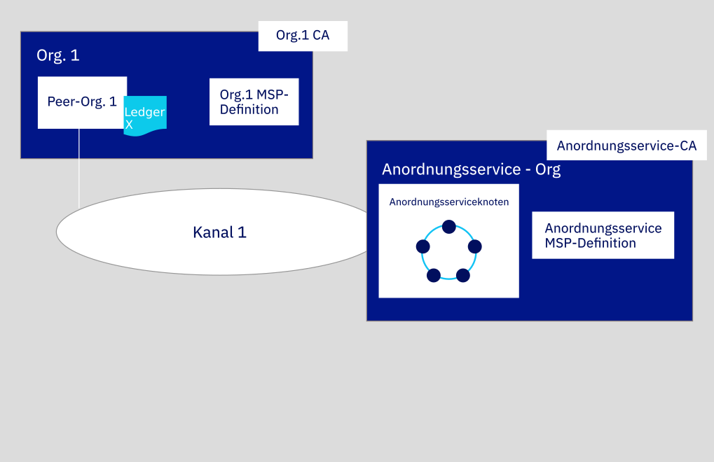

---

copyright:
  years: 2019
lastupdated: "2019-05-16"

keywords: getting started tutorials, create a CA, enroll, register, create an MSP, wallet, create a peer, create ordering service, Raft

subcollection: blockchain

---

{:new_window: target="_blank"}
{:shortdesc: .shortdesc}
{:screen: .screen}
{:codeblock: .codeblock}
{:note: .note}
{:important: .important}
{:tip: .tip}
{:pre: .pre}

# Lernprogramm zum Erstellen eines Netzes
{: #ibp-console-build-network}

{{site.data.keyword.blockchainfull}} Platform ist ein Blockchain-as-a-Service-Angebot, mit dem Sie Blockchain-Anwendungen und -Netze entwickeln, bereitstellen und betreiben können. In der [Übersicht zu den Blockchain-Komponenten](/docs/services/blockchain/blockchain_component_overview.html#blockchain-component-overview) erfahren Sie mehr zu den Blockchain-Komponenten und darüber, wie sie miteinander interagieren. Dieses Lernprogramm ist der erste Teil in der [Lernprogrammreihe für Beispielnetze](/docs/services/blockchain/howto/ibp-console-build-network.html#ibp-console-build-network-sample-tutorial) und beschreibt, wie Sie mit der {{site.data.keyword.blockchainfull_notm}} Platform-Konsole ein voll funktionsfähiges Netz in einer einzelnen {{site.data.keyword.cloud_notm}} Kubernetes Service-Instanz erstellen können.
{:shortdesc}

Wenn Sie die Betatestversion von {{site.data.keyword.blockchainfull_notm}} Platform verwenden, dann stimmen wahrscheinlich bestimmte Anzeigen in Ihrer Konsole nicht mit den Darstellungen in der aktuellen Dokumentation überein, die stets auf den Stand der allgemein verfügbaren Serviceinstanz aktualisiert wird. Um alle Vorteile der neuesten Funktionalität nutzen zu können, sollten Sie eine neue GA-Serviceinstanz bereitstellen. Befolgen Sie hierzu die Anweisungen im Abschnitt mit der [Einführung in {{site.data.keyword.blockchainfull_notm}} Platform on {{site.data.keyword.cloud_notm}}](/docs/services/blockchain/howto/ibp-v2-deploy-iks.html#ibp-v2-deploy-iks).
{: important}

**Zielgruppe:** Dieser Abschnitt richtet sich an Netzoperatoren, die für die Erstellung, Überwachung und Verwaltung des Blockchain-Netzes verantwortlich sind.

Wenn Sie die {{site.data.keyword.blockchainfull_notm}} Platform-Konsole noch nicht verwendet haben, um Komponenten unter Verwendung von {{site.data.keyword.cloud_notm}} Kubernetes Service in einem Kubernetes-Cluster bereitzustellen, dann lesen Sie die Informationen im Abschnitt mit der [Einführung in {{site.data.keyword.blockchainfull_notm}} Platform on {{site.data.keyword.cloud_notm}}](/docs/services/blockchain/howto/ibp-v2-deploy-iks.html#ibp-v2-deploy-iks). Beachten Sie, dass die Konsole selbst sich nicht in Ihrem Cluster befindet. Es handelt sich dabei um ein Tool, das Sie zur Bereitstellung von Komponenten in Ihrem Cluster verwenden können.


Unabhängig davon, ob Sie Komponenten in einem gebührenpflichtigen oder kostenlosen Kubernetes-Cluster bereitstellen, verwenden Sie das Kubernetes-Dashboard, um bei der Bereitstellung von Knoten und der Erstellung von Kanälen ein besonderes Augenmerk auf die Ihnen zur Verfügung stehenden Ressourcen zu legen. Es liegt in Ihrer Verantwortung, Ihren Kubernetes-Cluster zu verwalten und bei Bedarf zusätzliche Ressourcen zu implementieren. Obwohl Komponenten erfolgreich in einem kostenlosen Cluster bereitgestellt werden können, gilt dennoch Folgendes: Je mehr Komponenten Sie hinzufügen, desto langsamer werden die Komponenten ausgeführt. Weitere Informationen zur passenden Größe von Komponenten und zur Interaktion der Konsole mit Ihrem Kubernetes-Cluster finden Sie im Abschnitt [Ressourcen zuordnen](/docs/services/blockchain/howto/ibp-console-govern.html#ibp-console-govern-iks-console-interaction).
{: note}

## Lernprogrammreihe für Beispielnetze
{: #ibp-console-build-network-sample-tutorial}

Diese dreiteilige Lernprogrammreihe führt Sie durch den Prozess der Erstellung und Verbindung eines relativ einfachen Hyperledger Fabric-Netzes mit mehreren Knoten, indem Sie mithilfe der {{site.data.keyword.blockchainfull_notm}} Platform-Konsole ein Netz in Ihrem Kubernetes-Cluster bereitstellen und einen Smart Contract installieren und instanziieren. Beachten Sie hierbei, dass dieser Prozess im vorliegenden Lernprogramm anhand eines gebührenpflichtigen Kubernetes-Clusters dargestellt wird, für kostenlose Cluster jedoch (abgesehen von einigen geringfügigen Einschränkungen) der gleiche grundlegende Ablauf gilt. So ist es beispielsweise in einem kostenlosen Cluster nicht möglich, die Größe von Knoten zu verändern.

* Im **Lernprogramm zum Erstellen eines Netzes** erfahren Sie, wie Sie durch das Erstellen von zwei Organisationen (eine für Ihren Peer und eine weitere für Ihren Anordnungsservice) und eines Kanals ein Netz hosten können. Verwenden Sie dieses Lernprogramm, um ein Blockchain-Konsortium zu bilden, indem Sie einen Anordnungsservice erstellen und diesem Organisationen hinzufügen.
* Im [Lernprogramm zum Teilnehmen an einem Netz](/docs/services/blockchain/howto/ibp-console-join-network.html#ibp-console-join-network) erfahren Sie, wie Sie einem vorhandenen Netz beitreten können, indem Sie einen Peer erstellen und diesen einem bereits vorhandenen Kanal zuordnen. Verwenden Sie dieses Lernprogramm, wenn Sie entweder kein Netz hosten möchten, indem Sie einen Anordnungsservice erstellen, oder wenn Sie sich mit dem Prozess zum Teilnehmen an anderen Netzen vertraut machen möchten.
* Im [Lernprogramm zum Bereitstellen eines Smart Contract im Netz](/docs/services/blockchain/howto/ibp-console-smart-contracts.html#ibp-console-smart-contracts) erfahren Sie, wie Sie einen Smart Contract schreiben und in einem Netz bereitstellen können.


### Struktur dieses Netzes
{: #ibp-console-build-network-structure}

Wenn Sie alle Schritte in den Lernprogrammen zum **Erstellen eines Netzes** und **Teilnehmen an einem Netz** ausführen, ähnelt Ihr Netz dem in der folgenden Abbildung dargestellten Netz:

*Abbildung 1. Beispiel für grundlegende Netzstruktur*  

Diese Konfiguration ist sowohl für das Testen von Anwendungen und Smart Contracts als auch als Anleitung zur Erstellung von Komponenten und zur Teilnahme an Produktionsnetzen ausreichend, die den Anforderungen Ihres eigenen Anwendungsfalls genügen. Das Netz enthält die folgenden Komponenten:

* **Zwei Peerorganisationen**: `Org1` und `Org2`  
  In der Lernprogrammreihe wird beschrieben, wie zwei Peerorganisationen und zwei zugeordnete Peers erstellt werden. Sehen Sie dabei Organisationen in einem Blockchain-Netz beispielsweise als zwei Banken an, die Transaktionen untereinander ausführen. Außerdem werden Sie die Definitionen von `Org1` und `Org2` erstellen.
* **Eine Anordnungsserviceorganisation**: `Anordnungsservice`  
  Da Sie ein verteiltes Ledger erstellen, sollten die Peers und der Anordnungsservice verschiedenen Organisationen angehören. Daher wird für den Anordnungsservice eine separate Organisation erstellt. Unter anderem ordnet ein Anordnungsservice die Blöcke von Transaktionen an, die an die Peers gesendet werden, damit sie in die entsprechenden Ledger geschrieben werden und somit die Blockchain bilden. Sie werden die Definition der Organisation für den `Anordnungsservice` erstellen.
* **Drei Zertifizierungsstellen (CAs)**: `Org1 CA, Org2 CA, CA des Anordnungsservice`   
  Eine Zertifizierungsstelle (CA) ist der Knoten, der Zertifikate für die Benutzer und die Knoten ausgibt, die einer Organisation zugeordnet sind. Da als Best Practice eine Zertifizierungsstelle pro Organisation bereitgestellt wird, stellen Sie insgesamt drei Zertifizierungsstellen bereit: eine Zertifizierungsstelle für jede Peerorganisation und eine für die Anordnungsserviceorganisation. Diese Zertifizierungsstellen dienen auch zur Erstellung der Definition für jede Organisation, die in einen Membership Service Provider (MSP) eingebunden ist. Eine TLS-Zertifizierungsstelle wird parallel zur Zertifizierungsstelle der Organisation bereitgestellt. Diese Zertifizierungsstelle stellt Zertifikate bereit, die für die Kommunikation zwischen Knoten verwendet werden. Obwohl es sich als Best Practice bewährt hat, für die TLS-Zertifizierungsstelle einen separaten Administrator zu definieren, wird im Rahmen des vorliegenden Lernprogramms dieser Prozess nicht dargestellt. Weitere Informationen zu diesem Thema finden Sie in [TLS-Zertifizierungsstelle verwenden](/docs/services/blockchain/howto/ibp-console-identities.html#ibp-console-identities-tlsca).
* **Ein Anordnungsservice:** `Anordnungsservice`  
  Während Bereitstellungen, die auf einem gebührenpflichtigen Cluster ausgeführt werden, über die Option zur Bereitstellung eines Anordnungsservice mit einem Knoten oder eines fehlertoleranten Anordnungsservice mit fünf Knoten verfügen, besteht in kostenlosen Clustern nur die Möglichkeit zur Ausführung eines Einzelknotens. Der Anordnungsservice mit fünf Knoten verwendet eine Implementierung des Raft-Protokolls (weitere Informationen zu Raft finden Sie im Abschnitt zum [Anordnungsservice ](https://hyperledger-fabric.readthedocs.io/en/release-1.4/orderer/ordering_service.html#raft)) und stellt die Bereitstellungsoption dar, die im vorliegenden Lernprogramm erläutert wird. Momentan wird lediglich eine Anordnungsserviceorganisation pro Anordnungsservice unterstützt, und zwar unabhängig von der Anzahl der Anordnungsknoten, die dieser Organisation zugeordnet sind. Dieser Anordnungsservice dient zum Hinzufügen von Peerorganisationen zum jeweiligen "Konsortium", bei dem es sich um die Liste der Peerorganisationen handelt, die Kanäle erstellen und an Kanälen teilnehmen können. Wenn Sie einen Kanal erstellen möchten, der über Organisationen verfügt, die in verschiedenen Clustern bereitgestellt werden (wie dies in den meisten Produktionsnetzen der Fall ist), muss der Administrator des Anordnungsservice außerdem eine Peerorganisation in seine Konsole importieren, die in einer anderen Konsole bereitgestellt wurde. Dies ermöglicht es der Peerorganisation, dem Kanal beizutreten, der von diesem Anordnungsservice gehostet wird.
* **Zwei Peers:** `Peer Org1` und `Peer Org2`  
  Das Ledger (`Ledger x` in der Abbildung oben) wird von verteilten Peers verwaltet. Diese Peers werden mit [Couch DB ](https://hyperledger-fabric.readthedocs.io/en/release-1.4/couchdb_as_state_database.html) als Statusdatenbank in einem separaten Container bereitgestellt, der dem Peer zugeordnet ist. Diese Datenbank enthält den aktuellen Wert für alle "Status" (dargestellt als Schlüssel/Wert-Paare). Beispiel: `Org1` (ein Wert) ist der aktuelle Eigner einer Bankanlage (Schlüssel). Die Blockchain (Liste der Transaktionen) wird lokal auf dem Peer gespeichert.
* **Ein Kanal**: `Kanal 1`  
  Kanäle ermöglichen es Gruppen von Organisationen, Transaktionen auszuführen, ohne ihre Daten den Organisationen zugänglich zu machen, die keine Mitglieder des Kanals sind. Jeder Kanal verfügt über ein eigenes Ledger, das von den mit diesem Kanal verknüpften Peers gemeinsam verwaltet wird. Im Rahmen des Lernprogramms wird ein Kanal erstellt, dem beide Organisationen beitreten. Außerdem wird gezeigt, wie ein Smart Contract in dem Kanal instanziiert wird, über den die Organisationen Transaktionen ausführen können.

Diese Konfiguration ist nicht obligatorisch. {{site.data.keyword.blockchainfull_notm}} Platform ist extrem anpassbar. Wenn in Ihrem Kubernetes-Cluster Ressourcen verfügbar sind, können Sie über die Konsole Komponenten in einem unbegrenzten Array von Konfigurationen bereitstellen. Dieses Lernprogramm enthält die Schritte, die Sie zum Erstellen eines eigenen Netzes benötigen, und Verweise auf Themen, die einen tieferen Einblick in {{site.data.keyword.blockchainfull_notm}} Platform und die Konsole bieten.

In diesem Lernprogramm zum **Erstellen eines Netzes** erstellen Sie nur einen Teil des obigen Netzes, ein einfaches Netz, in dem ein Anordnungsservice und eine einzelne Peerorganisation und ein Peer in einem einzigen Kanal gehostet werden können. Die folgende Abbildung veranschaulicht den Teil des obigen Netzes, den Sie erstellen:
  
*Abbildung 2. Einfache Netzstruktur*  

Diese Konfiguration ist als schnelle Einführung hilfreich und unterstützt Sie beim Testen eines Smart Contract. Sie ist jedoch erst dann sinnvoll, wenn Sie weitere Organisationen für den Austausch von Transaktionen hinzufügen und so ein wirklich verteiltes Netz erstellen. Daher wird im nachfolgenden Lernprogramm zum [Teilnehme an einem Netz](/docs/services/blockchain/howto/ibp-console-join-network.html#ibp-console-join-network) gezeigt, wie zusätzliche Peerorganisationen und Peers erstellt werden und wie dem Kanal eine neue Organisation hinzugefügt wird.

In diesem Lernprogramm werden **empfohlene Werte** für die Felder in der Konsole angegeben. Auf diese Weise können Sie die Namen und Identitäten in den Registerkarten und Dropdown-Listen leichter erkennen. Diese Werte sind zwar nicht obligatorisch, jedoch hilfreich, da Sie bestimmte Werte wie beispielsweise IDs und geheime Schlüssel registrierter Benutzer, die Sie in einem vorherigen Schritt eingegeben haben, für weitere Schritte benötigen. Da diese Werte nicht in der Konsole gespeichert werden, müssen Sie, wenn Sie sie vergessen, weitere Benutzer registrieren und den Prozess erneut starten. Nach jeder Tasks finden Sie eine Tabelle mit den empfohlenen Werten. Sollten Sie nicht die empfohlenen Werte verwenden, dann sollten Sie sich die von Ihnen benutzten Werte notieren, während Sie das Lernprogramm durcharbeiten.
{:tip}

## Schritt 1: Organisation und Einstiegspunkt zur Blockchain erstellen
{: #ibp-console-build-network-create-peer-org1}

Für jede Organisation, die Sie mit der Konsole erstellen möchten, sollten Sie mindestens eine Zertifizierungsstelle implementieren. Eine Zertifizierungsstelle (CA) ist der Knoten, der Zertifikate für alle Netzteilnehmer (Peers, Anordnungsservices, Clients, Administratoren usw.) ausgibt. Mit diesen Zertifikaten, die ein Signierzertifikat und einen privaten Schlüssel enthalten, können Netzteilnehmer miteinander kommunizieren, sich authentifizieren und letztendlich Transaktionen ausführen. Diese Zertifizierungsstellen erstellen alle Identitäten und Zertifikate, die zu Ihrer Organisation gehören. Außerdem definieren sie die Organisation an sich. Anschließend können Sie diese Identitäten verwenden, um Knoten bereitzustellen, Administratoridentitäten zu erstellen und Transaktionen zu übergeben. Weitere Informationen zu Ihrer Zertifizierungsstelle und zu den Identitäten, die Sie erstellen müssen, finden Sie im Abschnitt [Identitäten verwalten](/docs/services/blockchain/howto/ibp-console-identities.html#ibp-console-identities).

In diesem Lernprogramm erstellen Sie zwei Organisationen: eine mit einem Peer und eine andere mit einem Anordnungsservice. Da jede Organisation eine Zertifizierungsstelle benötigt, um ihre Zertifikate auszugeben, müssen Sie **zwei Zertifizierungsstellen** erstellen. Im Rahmen dieses Lernprogramms **erstellen Sie jeweils immer nur eine Zertifizierungsstelle**.

Sehen Sie sich das folgende Video zur [ an ](http://ibm.biz/BlockchainPlatformSeries2 "Bereitstellung eines Peers unter {{site.data.keyword.blockchainfull_notm}} Platform"), um mehr über den Prozess zum Erstellen der Peerorganisation und des Peers zu erfahren.


### Zertifizierungsstelle für Peerorganisation erstellen
{: #ibp-console-build-network-create-CA-org1CA}

Im Rahmen dieses Lernprogramms gibt Ihre Zertifizierungsstelle die Zertifikate und privaten Schlüssel für Ihre Benutzer und Knoten aus. Diese Identitäten werden nicht von {{site.data.keyword.IBM_notm}} verwaltet und die Schlüssel werden nicht in der Konsole gespeichert. Sie werden nur im lokalen Speicher Ihres Browsers gespeichert. Stellen Sie daher sicher, dass Sie Ihre Identitäten und den MSP der Organisation exportieren. Wenn Sie versuchen, von einer anderen Maschine oder über einen anderen Browser auf die Konsole zuzugreifen, müssen Sie diese Identitäten und Organisationsdefinitionen importieren.
{:important}

Führen Sie an der Konsole die folgenden Schritte aus, um die Zertifizierungsstelle zu erstellen, die Zertifikate für Ihre erste Organisation ausstellt:

1. Navigieren Sie zu der Registerkarte **Knoten** auf der linken Seite und klicken Sie auf **Zertifizierungsstelle hinzufügen**. In den Seitenanzeigen können Sie die Zertifizierungsstelle anpassen, die Sie erstellen möchten, und die Organisation, für die die Zertifizierungsstelle Schlüssel ausgibt.
2. Klicken Sie auf **{{site.data.keyword.cloud_notm}}** unter **Zertifizierungsstelle erstellen** und dann auf **Weiter**.
3. Verwenden Sie die zweite Seitenanzeige, um der Zertifizierungsstelle einen **Anzeigename** zu geben. Der empfohlener Wert für diese Zertifizierungsstelle ist `Org1 CA`.
4. Geben Sie in der nächsten Anzeige die Administratorberechtigungsnachweise für die Zertifizierungsstelle an, indem Sie als **Eintragungs-ID des Zertifizierungsstellenadministrators** die Zeichenfolge `admin` und als geheimen Schlüssel `adminpw` angeben. Auch hierbei handelt es sich um die **empfohlenen Werte**.
5. Wenn Sie einen gebührenpflichtigen Cluster verwenden, haben Sie die Möglichkeit, die Ressourcenzuordnung für den Knoten zu konfigurieren. Im Rahmen dieses Lernprogramms können Sie alle Standardeinstellungen akzeptieren und auf **Weiter** klicken. Weitere Informationen über die Zuordnung von Ressourcen zu Ihrem Knoten finden Sie in diesem Thema zur [Ressourcenzuordnung](/docs/services/blockchain?topic=blockchain-ibp-console-govern#ibp-console-govern-allocate-resources). Wenn Sie einen kostenlosen Cluster verwenden, wird die Seite **Zusammenfassung** angezeigt.
6. Überprüfen Sie die Seite "Zusammenfassung" und klicken Sie dann **Zertifizierungsstelle hinzufügen**.

**Task: Zertifizierungsstelle für die Peerorganisation erstellen**

  | **Feld** | **Anzeigename** | **Eintragungs-ID** | **Geheimer Schlüssel** |
  | ------------------------- |-----------|-----------|-----------|
  | **Zertifizierungsstelle erstellen** | Org1 CA  | admin | adminpw |

  *Abbildung 3. Zertifizierungsstelle für die Peerorganisation erstellen*

Nach der Bereitstellung der Zertifizierungsstelle verwenden Sie diese zum Erstellen des MSP für Ihre Organisation, zum Registrieren von Benutzern und zum Erstellen des Einstiegspunkts für ein Netz (den **Peer**).

Fortgeschrittene Benutzer verfügen möglicherweise bereits über eine eigene Zertifizierungsstelle und möchten keine neue Zertifizierungsstelle in der Konsole erstellen. Wenn Ihre vorhandene Zertifizierungsstelle Zertifikate im `X.509`-Format ausgeben kann, können Sie eine eigene externe Zertifizierungsstelle verwenden, anstatt hier eine neue zu erstellen. Lesen Sie dazu den Abschnitt zur [Verwendung von Zertifikaten einer externen Zertifizierungsstelle mit Ihrem Peer oder Anordnungsservice](/docs/services/blockchain/howto/ibp-console-build-network.html#ibp-console-build-network-third-party-ca).

### Zertifizierungsstelle zum Registrieren von Identitäten verwenden
{: #ibp-console-build-network-use-CA-org1}

Jeder Knoten oder jede Anwendung, den bzw. die Sie erstellen möchten, benötigt für die Teilnahme am Blockchain-Netz ein Zertifikat und einen privaten Schlüssel. Außerdem müssen Sie Administratoridentitäten für diese Knoten und Anwendungen erstellen, damit Sie sie über die Konsole verwalten können. Sie werden diesen Prozess zweimal durchlaufen und zwar jeweils einmal für die beiden von Ihnen erstellten Zertifizierungsstellen. Außerdem erstellen Sie für jede Zertifizierungsstelle zwei Identitäten:

* **Organisationsadministrator**: Diese Identität ermöglicht es Ihnen, Knoten über die Platform-Konsole zu bedienen.
* **Peeridentität**: Dies ist die Identität des Peers selbst. Wenn ein Peer eine Aktion ausführt (z. B. die Bewilligung einer Transaktion), erfolgt die Signierung mit dem zugehörigen Zertifikat.

Je nach Ihrem Clustertyp kann die Bereitstellung der Zertifizierungsstelle bis zu zehn Minuten dauern. Wenn die Zertifizierungsstelle zum ersten Mal bereitgestellt wird (oder wenn die Zertifizierungsstelle aus anderen Gründen nicht verfügbar ist), dann wird das Feld in der Kachel für die Zertifizierungsstelle abgeblendet dargestellt. Nachdem die Zertifizierungsstelle erfolgreich bereitgestellt wurde und ausgeführt wird, wird dieses Feld grün dargestellt. Dies zeigt an, dass sie "Aktiv" ist und zur Registrierung von Identitäten verwendet werden kann. Bevor Sie mit den Schritten zur Registrierung von Identitäten fortfahren können, müssen Sie warten, bis der Status der Zertifizierungsstelle "Aktiv" lautet.
{:important}

Nachdem die Zertifizierungsstelle aktiviert wurde, was durch das grüne Feld in der Kachel angezeigt wird, müssen Sie diese Zertifikate generieren, indem Sie die folgenden Schritte ausführen:

1. Klicken Sie auf `Org1 CA` und vergewissern Sie sich, dass die Identität `admin`, die Sie für die Zertifizierungsstelle erstellt haben, in der Tabelle angezeigt wird. Klicken Sie dann auf die Schaltfläche **Benutzer registrieren**.
2. Zuerst wird der Administrator der Organisation registriert. Dazu können Sie die **Eintragungs-ID** `org1admin` und den **geheimen Schlüssel** `org1adminpw` festlegen. Geben Sie dann als `Typ` für diese Identität `client` an (Administratoridentitäten sollten immer als `client` registriert werden, während Knotenidentitäten immer mit dem Typ `peer` registriert werden sollten. Das Feld **Maximale Anzahl der Eintragungen** kann ignoriert werden. Weitere Informationen zu Eintragungen finden Sie im Abschnitt zur [Registrierung von Identitäten](/docs/services/blockchain/howto/ibp-console-identities.html#ibp-console-identities-register). Klicken Sie auf **Weiter**.
3. Im Rahmen dieses Lernprogramms muss **Attribut hinzufügen** nicht verwendet werden. Weitere Informationen zu Identitätsattributen finden Sie im Abschnitt zur [Registrierung von Identitäten](/docs/services/blockchain/howto/ibp-console-identities.html#ibp-console-identities-register). 
4. Nachdem der Organisationsadministrator registriert wurde, wiederholen Sie diesen Prozess für die Identität des Peers (und verwenden Sie dazu ebenfalls `Org1 CA`). Geben Sie für die Peeridentität die Eintragungs-ID `peer1` und den geheimen Schlüssel `peer1pw` an. Dies ist eine Knotenidentität. Wählen Sie daher `peer` als **Typ** aus. Das Feld **Maximale Anzahl der Eintragungen** kann ignoriert werden. In der nächsten Anzeige müssen Sie wie zuvor keine **Attribute** zuordnen.

Die Registrierung dieser Identitäten bei der Zertifizierungsstelle stellt lediglich den ersten Schritt bei der **Erstellung** einer Identität dar. Sie können diese Identitäten erst benutzen, nachdem Sie die **Eintragung** durchgeführt haben. Für die Identität `org1admin` erfolgt dieser Schritt während der Erstellung des MSP (siehe hierzu den nächsten Schritt). Im Falle des Peers wird er während der Erstellung des Peers ausgeführt.
{:note}

**Task: Benutzer registrieren**

  |  **Feld** | **Beschreibung** | **Eintragungs-ID** | **Geheimer Schlüssel** |
  | ------------------------- |-----------|-----------|-----------|-----------|
  | **Benutzer registrieren** |  Org1 admin | org1admin | org1adminpw |
  | | Peeridentität |  peer1 | peer1pw |

  *Abbildung 4. Zertifizierungsstelle zum Registrieren von Benutzern verwenden*

### MSP-Definition der Peerorganisation erstellen
{: #ibp-console-build-network-create-peers-org1}

Nachdem Sie nun die Zertifizierungsstelle des Peers erstellt und diese zum **Registrieren** der Identitäten für den Administrator von `Org1` und für den Peer verwendet haben, der `Org1` zugeordnet wird, müssen Sie eine formale Definition der Peerorganisation erstellen, die als Membership Service Provider (MSP) bezeichnet wird. Beachten Sie hierbei, dass einer Organisation zahlreiche Peers zugeordnet werden können. **Sie müssen nicht jedes Mal, wenn Sie einen Peer erstellen, auch eine neue Organisation erstellen.** Da Sie dieses Lernprogramm zum ersten Mal durchlaufen, erstellen Sie die MSP-ID für diese Organisation. Während der Erstellung des MSP werden Sie Zertifikate für die Identität `org1admin` generieren und sie zu Ihrer Wallet hinzufügen.

1. Navigieren Sie zur Registerkarte **Organisationen** im linken Navigationsbereich und klicken Sie auf **MSP-Definition erstellen**.
2. Geben Sie für den MSP den Anzeigenamen `Org1 MSP` und die MSP-ID `org1msp` an. Wenn Sie in diesem Feld eine eigene MSP-ID angeben möchten, müssen Sie die Spezifikationen zu den Einschränkungen für diesen Namen in der QuickInfo befolgen.
3. Geben Sie unter den **Details für die Stammzertifizierungsstelle** die Zertifizierungsstelle an, die Sie im vorherigen Schritt zur Registrierung der Identitäten verwendet haben. Wenn Sie dieses Lernprogramm zum ersten Mal verwenden, sollten Sie nur eine Zertifizierungsstelle sehen: `Org1 CA`.
4. Die Felder **Eintragungs-ID** und **Geheimer Eintragungsschlüssel** darunter werden automatisch mit der Eintragungs-ID und dem geheimen Schlüssel für den ersten Benutzer gefüllt, den Sie mit der Zertifizierungsstelle erstellt haben: `admin` und `adminpw`. Wenn Sie diese Identität verwenden, dann erhält Ihre Organisation jedoch die gleiche Identität wie Ihre CA-Identität, was aus Sicherheitsgründen nicht zu empfehlen ist. Wählen Sie stattdessen in der Dropdown-Liste die Eintragungs-ID aus, die Sie für Ihren Organisationsadministrator erstellt haben (`org1admin`), und geben Sie als zugehörigen geheimen Schlüssel `org1adminpw` ein. Geben Sie dann dieser Identität einen Anzeigenamen (`Org1 Admin`).
5. Klicken Sie auf die Schaltfläche **Generieren**, um diese Identität als Administrator Ihrer Organisation einzutragen und die Identität in die Wallet zu exportieren, wo sie verwendet wird, wenn Sie den Peer und Kanäle erstellen.
6. Klicken Sie auf **Exportieren**, um die Administratorzertifikate in Ihr Dateisystem zu exportieren. Wie bereits oben erwähnt, wird diese Identität nicht in Ihrer Konsole gespeichert oder von {{site.data.keyword.IBM_notm}} verwaltet. Sie wird nur im lokalen Speicher Ihres Browsers gespeichert. Wenn Sie zu einem anderen Browser wechseln, müssen Sie diese Identität in Ihre Wallet importieren, damit Sie den Peer verwalten können.
7. Klicken Sie auf **MSP-Definition erstellen**.

**Task: MSP-Definition für die Peerorganisation erstellen**

  |  | **Anzeigename** | **MSP-ID** | **Eintragungs-ID**  | **Geheimer Schlüssel** |
  | ------------------------- |-----------|-----------|-----------|-----------|
  | **Organisation erstellen** | Org1 MSP | org1msp |||
  | **Stammzertifizierungsstelle** | Org1 CA ||||
  | **Administratorzertifikat für Organisation** | |  | org1admin | org1adminpw |
  | **Identität** | Org1 Admin |||||

  *Abbildung 5. MSP-Definition für Peerorganisation erstellen*

Nachdem Sie den MSP erstellt haben, sollte der Administrator der Peerorganisation in Ihrer **Wallet** angezeigt werden. Klicken Sie im linken Navigationsbereich auf **Wallet**, um darauf zuzugreifen.

**Task: Wallet überprüfen**

  | **Feld** |  **Anzeigename** | **Beschreibung** |
  | ------------------------- |-----------|----------|
  | **Identität** | Org1 Admin | Identität von 'Org1 Admin' |

  *Abbildung 6. Wallet überprüfen*

Weitere Informationen zu MSPs finden Sie im Abschnitt [Organisationen verwalten](/docs/services/blockchain/howto/ibp-console-organizations.html#ibp-console-organizations).

Das Exportieren der Identität des Organisationsadministrators ist wichtig, da Sie für die Verwaltung und Sicherung dieser Zertifikate verantwortlich sind.
{:important}

### Peer erstellen
{: #ibp-console-build-network-peer-create}

Nachdem Sie eine [Zertifizierungsstelle erstellt](/docs/services/blockchain/howto/ibp-console-build-network.html#ibp-console-build-network-create-CA-org1CA), diese zum Registrieren von Identitäten verwendet und den [MSP der Peerorganisation erstellt](/docs/services/blockchain/howto/ibp-console-build-network.html#ibp-console-build-network-create-peers-org1) haben, können Sie nun einen Peer erstellen.

#### Welche Rolle spielen Peers?
{: #ibp-console-build-network-peer-role}

Es ist wichtig zu wissen, dass die Organisationen selbst keine Ledger pflegen. Dies übernehmen Peers. Organisationen verwenden auch Peers, um Transaktionsvorschläge zu signieren und Kanalkonfigurationsaktualisierungen zu genehmigen. Da das Vorhandensein von mindestens zwei Peers in einem Kanal diese hoch verfügbar macht, wird die Implementierung von mindestens zwei Peers, die mit einem Kanal verbunden sind, als Best Practice für Implementierungen auf Produktionsebene betrachtet. Dieses Lernprogramm enthält jedoch nur den Prozess zum Erstellen eines einzelnen Peers.

Aus Sicht einer Ressourcenzuordnung ist es möglich, dieselben Peers mit mehreren Kanälen zu verknüpfen. Das Design des Peers stellt sicher, dass die Daten von einem Kanal nicht über den Peer an einen anderen Kanal übergeben werden können. Da der Peer jedoch für jeden Kanal ein separates Ledger speichert, muss sichergestellt werden, dass der Peer genügend Verarbeitungsleistung und Speicher hat, um die Transaktion und das Laden der Daten zu verarbeiten.

#### Peer bereitstellen
{: #ibp-console-build-network-deploy-peer-role}

Verwenden Sie die Konsole, um die folgenden Schritte auszuführen:

1. Klicken Sie auf der Seite **Knoten** auf **Peer hinzufügen**.
2. Klicken Sie auf {{site.data.keyword.cloud_notm}} unter **Neuen Peer erstellen** und dann auf **Weiter**.
3. Geben Sie für den Peer als **Anzeigename** den Namen `Peer Org1` an.
4. Wählen Sie in der nächsten Anzeige den Eintrag `Org1 CA` aus. Hierbei handelt es sich um die Zertifizierungsstelle, die Sie zur Registrierung der Peeridentität verwendet haben. Wählen Sie in der Dropdown-Liste die **Eintragungs-ID** für die Peeridentität aus, die Sie für Ihren Peer erstellt haben (`peer1`), und geben Sie den zugehörigen **geheimen Schlüssel** (`peer1pw`) ein. Wählen Sie dann in der Dropdown-Liste `Org1 MSP` aus und klicken Sie auf **Weiter**.
5. In der nächsten Seitenanzeige werden Informationen zur TLS-Zertifizierungsstelle abgefragt. Bei der Erstellung der Zertifizierungsstelle wird außerdem eine TLS-Zertifizierungsstelle (TLSCA) erstellt. Diese Zertifizierungsstelle wird zur Erstellung von Zertifikaten für die sichere Kommunikationsebene für Knoten verwendet. Wählen Sie deshalb in der Dropdown-Liste die **Eintragungs-ID** für die Peeridentität aus, die Sie für Ihren Peer erstellt haben (`peer1`), und geben Sie den zugehörigen **geheimen Schlüssel** (`peer1pw`) ein. Der **TLS-CSR-Hostname** ist eine Option, die für fortgeschrittene Benutzer zur Verfügung steht, die einen angepassten Domänennamen angeben möchten, der zur Adressierung des Peerendpunkts verwendet werden kann. Angepasste Domänennamen werden im Rahmen des vorliegenden Lernprogramms nicht behandelt, sodass Sie momentan für **TLS-CSR-Hostname** keinen Wert angeben sollten.
6. Auf der nächsten Seitenanzeige erhalten Sie die Aufforderung **Identität zuordnen**, um diese als Administrator Ihres Peers festzulegen. Im Rahmen des vorliegenden Lernprogramms werden Sie Ihren Organisationsadministrator `Org1 Admin` auch als Administrator Ihres Peers festlegen. Es ist möglich, bei `Org1 CA` eine andere Identität zu registrieren und einzutragen und diese Identität als Administrator Ihres Peers festzulegen. Im vorliegenden Lernprogramm wird jedoch die Identität `Org1 Admin` verwendet.
7. Wenn Sie einen gebührenpflichtigen Cluster verwenden, haben Sie auf der nächsten Anzeige die Möglichkeit, die Ressourcenzuordnung für den Knoten zu konfigurieren. Im Rahmen dieses Lernprogramms können Sie alle Standardeinstellungen akzeptieren und auf **Weiter** klicken. Weitere Informationen über die Zuordnung von Ressourcen zu Ihrem Knoten finden Sie in diesem Thema zur [Ressourcenzuordnung](/docs/services/blockchain?topic=blockchain-ibp-console-govern#ibp-console-govern-allocate-resources). Wenn Sie einen kostenlosen Cluster verwenden, wird Ihnen die Seite **Zusammenfassung** angezeigt.
8. Überprüfen Sie die Zusammenfassung und klicken Sie auf **Peer hinzufügen**.

**Task: Peer bereitstellen**

  |  | **Anzeigename** | **MSP-ID** | **Eintragungs-ID** | **Geheimer Schlüssel** |
  | ------------------------- |-----------|-----------|-----------|-----------|
  | **Peer erstellen** | Peer Org1 | org1msp |||
  | **Zertifizierungsstelle** | Org1 CA ||||
  | **Peeridentität** | |  | peer1 | peer1pw |
  | **Administratorzertifikat** | org1msp ||||
  | **TLS-Zertifizierungsstelle** | Org1 CA ||||
  | **ID der TLS-Zertifizierungsstelle** | || admin | adminpw |
  | **Identität zuordnen** | Org1 Admin |||||

  *Abbildung 7. Peer bereitstellen*

In einem Produktionsszenario sollten Sie drei Peers für jeden Kanal bereitstellen. Dadurch kann der Ausfall eines Peers (z. B. während eines Wartungszyklus) ausgeglichen werden, sodass weiterhin die Hochverfügbarkeit der Peers erhalten bleibt. Wenn Sie für eine Organisation mehrere Peers bereitstellen wollen, dann verwenden Sie dieselbe Zertifizierungsstelle, die Sie auch zur Registrierung Ihrer ersten Peeridentität verwendet haben. Im vorliegenden Lernprogramm ist dies `Org1 CA`. Führen Sie dann die Registrierung einer neuen Peeridentität mit einer anderen Eintragungs-ID und einem anderen geheimen Schlüssel durch. Beispiel: `org1secondpeer` und `org1secondpeerpw`. Geben Sie dann bei der Erstellung des Peers die Eintragungs-ID und den geheimen Schlüssel an. Da dieser Peer weiterhin Org1 zugeordnet ist, müssen Sie in der Dropdown-Liste `Org1 CA`, `Org1 MSP` und `Org1 Admin` auswählen. Sie können diesem neuen Peer einen anderen Administrator zuordnen, der mit `Org1 CA` registriert und eingetragen werden kann. Dies ist jedoch ein optionaler Schritt. In dieser Lernprogrammreihe wird lediglich der Prozess zur Erstellung eines einzelnen Peers für jede Peerorganisation erläutert.
{:tip}

## Schritt 2: Knoten erstellen, der Transaktionen anordnet
{: #ibp-console-build-network-create-orderer}

In anderen verteilten Blockchains, wie Ethereum und Bitcoin, gibt es keine zentrale Stelle, die Transaktionen anordnet und an Peers sendet. Hyperledger Fabric als Blockchain, auf der {{site.data.keyword.blockchainfull_notm}} Platform basiert, funktioniert anders. Es umfasst einen Knoten oder einen Knotencluster, den sog. **Anordnungsservice**.

Der Anordnungsservice stellt eine Schlüsselkomponente in einem Netz dar, da er zur Ausführung einiger wichtigen Funktionen dient:

- Sie **ordnen** buchstäblich die Blöcke von Transaktionen an, die an die Peers gesendet werden, damit sie in die entsprechenden Ledger geschrieben werden können. Dieser Prozess wird als "Anordnung" bezeichnet.
- Sie verwalten den **Systemkanal für die Anordnung**, also die Position, an der das **Konsortium** (die Liste der Peerorganisationen, die Kanäle erstellen dürfen) gespeichert ist. Ein Konsortium ist im Wesentlichen eine Multi-Tenant-Einheit, und ein einzelner Anordnungsservice kann von sich aus mehrere Konsortien hosten.
- Sie **setzen die Richtlinien um**, die von dem Konsortium oder den Kanaladministratoren festgelegt wurden. Diese Richtlinien legen alles fest: wer Lese- oder Schreibzugriff auf einen Kanal erhält bis hin zu wer einen Kanal erstellen oder ändern kann. Wenn beispielsweise ein Netzteilnehmer einen Kanal oder eine Konsortiumrichtlinie ändern möchte, verarbeitet der Anforderungsservice die Anfrage, um zu ermitteln, ob der Teilnehmer über die entsprechenden Administratorberechtigungen für diese Konfigurationsaktualisierung verfügt, validiert sie für die vorhandenen Konfiguration, generiert eine neue Konfiguration und übermittelt diese dann an die Peers.

Weitere Informationen zu den Anordnungsservices und zu deren Rolle innerhalb eines Hyperledger Fabric-basierten Netzes finden Sie im Abschnitt zum [Anordnungsservice ](https://hyperledger-fabric.readthedocs.io/en/release-1.4/orderer/ordering_service.html).

In einem gebührenpflichtigen Cluster haben Sie die Möglichkeit, zwischen der Erstellung eines Anordnungsservice mit einem Knoten (ausreichend für Testzwecke) und der Erstellung eines fehlertoleranten Anordnungsservice mit fünf Knoten zu wählen, die einer einzigen Organisation zugeordnet sind. In einem kostenlosen Cluster können Sie nur einen Anordnungsservice mit einem Knoten erstellen. In diesem Lernprogramm wird ein Anordnungsservice mit fünf Knoten dargestellt.

Allerdings ist zu beachten, dass genau wie bei dem Peer vor dem Erstellen eines Anordnungsservice eine Zertifizierungsstelle erstellt werden muss, um die Identitäten und den MSP der Anordnungsserviceorganisation bereitzustellen.

Sehen Sie sich das folgende Video zur [ ](http://ibm.biz/BlockchainPlatformSeries3 "Bereitstellung eines Anordnungsservice unter {{site.data.keyword.blockchainfull_notm}} Platform") an, um mehr über den Prozess zum Erstellen einer Anordnungsserviceorganisation und des Anordnungsservice zu erfahren.

### In der Konsole anordnen
{: #ibp-console-build-network-ordering-console}

In diesem Release werden verteilte Anordnungsservices, bei denen mehrere Organisationen Knoten zu einem Anordnungsservice hinzufügen, nicht unterstützt. Jeder Anordnungsknoten in dem Anordnungsservice wird von einer einzelnen Organisation verwaltet.

Bei dem für den Produktionsmodus verfügbaren Anordnungsservice handelt es sich um einen fehlertoleranten Anordnungsservice, der auf einer Implementierung des Raft-Protokolls in `etcd` basiert. Raft orientiert sich an einem sog. Leader-and-Follower-Modell, das vorgibt, dass ein Leaderknoten (pro Kanal) ausgewählt wird, dessen Entscheidungen von den Followern repliziert werden. Raft-Anordnungsservices sind im Vergleich zu Kafka-basierten Anordnungsservices einfacher einzurichten und zu verwalten. Ihr Design ermöglicht unterschiedlichen Organisationen das Hinzufügen von Knoten zu einem verteilten Anordnungsservice. Weitere Informationen zu Raft finden Sie im Abschnitt zum [Anordnungsservice ](https://hyperledger-fabric.readthedocs.io/en/release-1.4/orderer/ordering_service.html#raft).

Momentan steht als fehlertolerante Konfiguration für Anordnungsknoten nur die Konfiguration mit **fünf** Knoten zur Verfügung. Obwohl es technisch möglich ist, einen fehlertoleranten Anordnungsservice mit nur drei Knoten zu erstellen (von der Verwendung von Anordnungsservices mit nur zwei Knoten wird dringend abgeraten), besteht bei Verwendung von nur drei Knoten ein höheres Risiko, dass bei Knotenausfällen (z. B. während eines Upgrades) Probleme auftreten.

Aus diesem Grund werden als gebührenpflichtige Cluster nur Konfigurationen mit einem oder mit fünf Knoten angeboten. Netze im Produktionsbereich sollten unbedingt mit fünf Knoten konfiguriert werden, da ein Anordnungsservice mit nur einem Knoten per Definition nicht fehlertolerant ist.

Im vorliegenden Lernprogramm wird ein Anordnungsservice mit fünf Knoten erstellt.

### Zertifizierungsstelle für Anordnungsserviceorganisation erstellen
{: #ibp-console-build-network-create-orderer-ca}

Der Prozess zur Erstellung einer Zertifizierungsstelle für einen Anordnungsservice ist identisch mit dem Erstellen einer Zertifizierungsstelle für einen Peer.

1. Navigieren Sie zur Registerkarte **Knoten** und klicken Sie auf **Zertifizierungsstelle hinzufügen**.
2. Klicken Sie auf **{{site.data.keyword.cloud_notm}}** unter **Neue Zertifizierungsstelle erstellen** und dann auf **Weiter**
3. Geben Sie dieser Zertifizierungsstelle einen eindeutigen Anzeigenamen (`CA des Anordnungsservice`).
4. Sie können als **Eintragungs-ID des Zertifizierungsstellenadministrators** erneut `admin` und als geheimen Schlüssel erneut `adminpw` verwenden. Da es sich hier um eine andere Zertifizierungsstelle handelt, unterscheidet sich diese Identität von der Identität des Administrators der Zertifizierungsstelle, die für `Org1 CA` erstellt wurde, obwohl die ID und der geheime Schlüssel identisch sind.
5. Wenn Sie einen gebührenpflichtigen Cluster verwenden, haben Sie in der nächsten Anzeige die Möglichkeit, die Ressourcenzuordnung für die Zertifizierungsstelle zu konfigurieren. Im Rahmen dieses Lernprogramms können Sie alle Standardeinstellungen akzeptieren und auf **Weiter** klicken. Weitere Informationen über die Zuordnung von Ressourcen zu Ihrem Knoten finden Sie in diesem Thema zur [Ressourcenzuordnung](/docs/services/blockchain?topic=blockchain-ibp-console-govern#ibp-console-govern-allocate-resources). Wenn Sie einen kostenlosen Cluster verwenden, wird die Seite **Zusammenfassung** angezeigt.
6. Überprüfen Sie die Seite "Zusammenfassung" und klicken Sie dann **Zertifizierungsstelle hinzufügen**.

Wie beim Peer verfügen fortgeschrittene Benutzer möglicherweise bereits über eine eigene Zertifizierungsstelle und möchten keine neue Zertifizierungsstelle über die Konsole erstellen. Wenn Ihre vorhandene Zertifizierungsstelle Zertifikate im `X.509`-Format ausgeben kann, können Sie eine eigene externe Zertifizierungsstelle verwenden, anstatt hier eine neue zu erstellen. Lesen Sie dazu den Abschnitt zur [Verwendung von Zertifikaten einer externen Zertifizierungsstelle mit Ihrem Peer oder Anordnungsservice](/docs/services/blockchain/howto/ibp-console-build-network.html#ibp-console-build-network-third-party-ca).

### Zertifizierungsstelle zur Registrierung eines Anordnungsserviceknotens und der Identitäten des Administrators für den Anordnungsservice verwenden
{: #ibp-console-build-network-use-CA-orderer}

Wie beim Peer auch müssen Sie zwei Identitäten für die Zertifizierungsstelle des Anordnungsservice registrieren. Nachdem Sie Ihre Zertifizierungsstelle ausgewählt haben, müssen Sie einen Administrator für die Anordnungsserviceorganisation sowie eine Identität für den Anordnungsservice selbst registrieren. Wie zuvor sollte eine Identität auf der Registerkarte `CA des Anordnungsservice` angezeigt werden. Es handelt sich hierbei um den von Ihnen für die Zertifizierungsstelle erstellten Administrator.

Je nach Ihrem Clustertyp kann die Bereitstellung der Zertifizierungsstelle bis zu zehn Minuten dauern. Wenn die Zertifizierungsstelle zum ersten Mal bereitgestellt wird (oder wenn die Zertifizierungsstelle aus anderen Gründen nicht verfügbar ist), dann wird das Feld in der Kachel für die Zertifizierungsstelle abgeblendet dargestellt. Nachdem die Zertifizierungsstelle erfolgreich bereitgestellt wurde und ausgeführt wird, wird dieses Feld grün dargestellt. Dies zeigt an, dass sie "Aktiv" ist und zur Registrierung von Identitäten verwendet werden kann. Bevor Sie mit den Schritten zur Registrierung von Identitäten fortfahren können, müssen Sie warten, bis der Status der Zertifizierungsstelle "Aktiv" lautet.
{:important}

Nachdem die Zertifizierungsstelle aktiviert wurde, was durch das grüne Feld in der Kachel für `CA des Anordnungsservice` angezeigt wird, müssen Sie diese Zertifikate generieren, indem Sie die folgenden Schritte ausführen:

1. Klicken Sie auf der Registerkarte **Knoten** auf `CA des Anordnungsservice` und vergewissern Sie sich, dass die Identität `admin`, die Sie für die Zertifizierungsstelle erstellt haben, in der Tabelle angezeigt wird. Klicken Sie dann auf die Schaltfläche **Benutzer registrieren**.
2. Zuerst wird der Administrator der Organisation registriert. Dazu können Sie die **Eintragungs-ID** `OSadmin` und den **geheimen Schlüssel** `OSadminpw` festlegen. Geben Sie dann als `Typ` für diese Identität `client` an (Administratoridentitäten sollten immer als `client` registriert werden, während Knotenidentitäten immer mit dem Typ `peer` registriert werden sollten. Das Feld **Maximale Anzahl der Eintragungen** kann ignoriert werden. Weitere Informationen zu Eintragungen finden Sie im Abschnitt zur [Registrierung von Identitäten](/docs/services/blockchain/howto/ibp-console-identities.html#ibp-console-identities-register). Klicken Sie auf **Weiter**.
3. Im Rahmen dieses Lernprogramms muss **Attribut hinzufügen** nicht verwendet werden. Weitere Informationen zu Identitätsattributen finden Sie im Abschnitt zur [Registrierung von Identitäten](/docs/services/blockchain/howto/ibp-console-identities.html#ibp-console-identities-register). 
4. 5. Nachdem der Organisationsadministrator registriert wurde, wiederholen Sie diesen Prozess für die Identität des Anordnungsservice (und verwenden Sie dazu ebenfalls `CA des Anordnungsservice`). Geben Sie für die Identitäten des Anordnungsserviceknotens die Eintragungs-ID `OS1` und den geheimen Schlüssel `OS1pw` an. Dies ist eine Knotenidentität. Wählen Sie daher `peer` als **Typ** aus. Das Feld **Maximale Anzahl der Eintragungen** kann ignoriert werden. In der nächsten Anzeige müssen Sie wie zuvor keine **Attribute** zuordnen.

**Task: Zertifizierungsstelle erstellen und Benutzer registrieren**

  | **Feld** | **Beschreibung** | **Eintragungs-ID** | **Geheimer Schlüssel** |
  | ------------------------- |-----------|-----------|-----------|-----------|
  | **Zertifizierungsstelle erstellen** | CA des Anordnungsservice | admin | adminpw |
  | **Benutzer registrieren** | Administrator des Anordnungsservice | OSadmin | OSadminpw |
  |  | Identität des Anordnungsserviceknotens |  OS1 | OS1pw |

*Abbildung 8. Zertifizierungsstelle erstellen und Benutzer registrieren*

Im Rahmen dieses Lernprogramms wird lediglich eine Knotenidentität erstellt. Diese Identität wird von allen fünf Knoten verwendet, die zur Erstellung des Anordnungsservice bereitgestellt werden. Während dieser Schritt in einem Anordnungsservice für mehrere Organisationen nicht ratsam ist, kann er problemlos ausgeführt werden, wenn alle Anordnungsknoten derselben Organisation zugeordnet sind.

### MSP-Definition der Anordnungsserviceorganisation erstellen
{: #ibp-console-build-network-create-orderer-org-msp}

Erstellen Sie die MSP-Definition der Anordnungsserviceorganisation und geben Sie die Administratoridentität für die Organisation an. Nachdem Sie den Administrator und die Benutzer des Anordnungsservice registriert haben, müssen Sie die MSP-ID erstellen und den Benutzer `OSadmin` eintragen, den Sie als Administrator der Organisation registriert haben.

1. Navigieren Sie zur Registerkarte **Organisationen** im linken Navigationsbereich und klicken Sie auf **MSP-Definition erstellen**.
2. Ordnen Sie der MSP-Definition den Anzeigenamen `MSP des Anordnungsservice` und die MSP-ID `osmsp` zu. Wenn Sie eine andere MSP-ID auswählen, müssen Sie die Spezifikationen zu den Einschränkungen für diesen Namen in der QuickInfo befolgen.
3. Wählen Sie unter den **Details für die Stammzertifizierungsstelle** die von Ihnen erstellte `CA des Anordnungsservice` aus.
4. Die Felder **Eintragungs-ID** und **Geheimer Eintragungsschlüssel** darunter werden automatisch mit der Eintragungs-ID und dem geheimen Schlüssel für den ersten Benutzer gefüllt, den Sie mit der Zertifizierungsstelle erstellt haben: `admin` und `adminpw`. Wenn Sie diese Identität verwenden, dann erhält Ihre Organisation jedoch die gleiche Identität wie Ihre CA-Identität, was aus Sicherheitsgründen nicht zu empfehlen ist. Wählen Sie stattdessen in der Dropdown-Liste die Eintragungs-ID aus, die Sie für Ihren Organisationsadministrator erstellt haben (`OSadmin`), und geben Sie als zugehörigen geheimen Schlüssel `OSadminpw` ein. Geben Sie dann dieser Identität einen Anzeigenamen (`Administrator des Anordnungsservice`).
5. Klicken Sie auf die Schaltfläche **Generieren**, um diese Identität als Administrator Ihrer Organisation einzutragen und die Identität in die Wallet zu exportieren.
6. Klicken Sie auf **Exportieren**, um die Administratorzertifikate in Ihr Dateisystem zu exportieren. Wie bereits oben erwähnt, wird diese Identität nicht in Ihrer Konsole gespeichert oder von {{site.data.keyword.IBM_notm}} verwaltet. Sie wird nur in Ihrem Browser gespeichert. Wenn Sie zu einem anderen Browser wechseln, müssen Sie diese Identität importieren, damit Sie den Anordnungsservice verwalten können.
7. Klicken Sie auf **MSP-Definition erstellen**.

**Task: MSP-Definition der Anordnungsserviceorganisation erstellen**

  |  | **Anzeigename** | **MSP-ID** | **Eintragungs-ID**  | **Geheimer Schlüssel** |
  | ------------------------- |-----------|-----------|-----------|-----------|
  | **Organisation erstellen** | MSP des Anordnungsservice | osmsp |||
  | **Stammzertifizierungsstelle** | CA des Anordnungsservice ||||
  | **Administratorzertifikat für Organisation** | |  | OSadmin | OSadminpw |
  | **Identität** | Administrator des Anordnungsservice |||||

  *Abbildung 9. MSP-Definition der Anordnungsserviceorganisation erstellen*

Nachdem Sie den MSP erstellt haben, sollte der Administrator der Anordnungsserviceorganisation in Ihrer **Wallet** angezeigt werden. Klicken Sie im linken Navigationsbereich auf **Wallet**, um darauf zuzugreifen.

**Task: Wallet überprüfen**

  | **Feld** |  **Anzeigename** | **Beschreibung** |
  | ------------------------- |-----------|----------|
  | **Identität** | Org1 Admin | Identität von 'Org1 Admin' |
  | **Identität** | Administrator des Anordnungsservice | Identität des Administrators des Anordnungsservice |

  *Abbildung 10. MSP-Definition der Anordnungsserviceorganisation erstellen*

Weitere Informationen zu MSPs finden Sie im Abschnitt [Organisationen verwalten](/docs/services/blockchain/howto/ibp-console-organizations.html#ibp-console-organizations).

Das Exportieren der Identität des Organisationsadministrators ist wichtig, da Sie für die Verwaltung und Sicherung dieser Zertifikate verantwortlich sind. Wenn Sie den Anordnungsservice und die MSP-Definition des Anordnungsservice exportieren, können sie in eine andere Konsole importiert werden, in der ein anderer Operator neue Kanäle im Anordnungsservice erstellen oder Peers einem Kanal zuordnen kann.
{:important}

### Anordnungsservice erstellen
{: #ibp-console-build-network-create-an-orderer}

Führen Sie die folgenden Schritte in der Konsole aus:

1. Klicken Sie auf der Seite **Knoten** auf **Anordnungsservice hinzufügen**.
2. Klicken Sie auf die Schaltfläche {{site.data.keyword.cloud_notm}} unter **IBM Cloud-Anordnungsservice erstellen** und dann auf **Weiter**.
3. Ordnen Sie dem Anordnungsservice den **Anzeigenamen** `Anordnungsservice` zu und wählen Sie (in einem gebührenpflichtigen Cluster) aus, ob Sie einen Anordnungsservice mit einem Knoten (ausreichend für Testzwecke) oder fünf Knoten (geeignet für Produktionszwecke) konfigurieren möchten. Wählen Sie **fünf Knoten** aus. Geben Sie außerdem an, dass keine externe Zertifizierungsstelle verwendet werden soll. Dies ist eine erweiterte Option.
4. Wählen Sie in der nächsten Anzeige `CA des Anordnungsservice` als Zertifizierungsstelle aus. Wählen Sie dann in der Dropdown-Liste die **Eintragungs-ID** für die Knotenidentität aus, die Sie für Ihren Anordnungsservice erstellt haben (`OS1`), und geben Sie den zugehörigen **geheimen Schlüssel** (`OS1pw`) ein. Wählen Sie anschließend in der Dropdown-Liste Ihren MSP (`CA des Anordnungsservice`) aus. Im Rahmen des vorliegenden Lernprogramms sollten Sie nicht auswählen, dass eine externe Zertifizierungsstelle für Ihren Anordnungsservice verwendet wird. Wenn Sie weitere Informationen zu diesem Thema benötigen, dann ziehen Sie den Abschnitt zur [Verwendung von Zertifikaten einer externen Zertifizierungsstelle](#ibp-console-build-network-third-party-ca) zurate. Klicken Sie auf **Weiter**.
5. In der nächsten Seitenanzeige werden Informationen zur TLS-Zertifizierungsstelle abgefragt. Bei der Erstellung der Zertifizierungsstelle wird außerdem eine TLS-Zertifizierungsstelle erstellt. Diese Zertifizierungsstelle wird zur Erstellung von Zertifikaten für die sichere Kommunikationsebene für Knoten verwendet. Wählen Sie deshalb in der Dropdown-Liste die **Eintragungs-ID** für die Anordnungsserviceidentität aus, die Sie erstellt haben (`OS1`), und geben Sie den zugehörigen **geheimen Schlüssel** (`OS1pw`) ein. Der **TLS-CSR-Hostname** ist eine Option, die für fortgeschrittene Benutzer zur Verfügung steht, die einen angepassten Domänennamen angeben möchten, der zur Adressierung des Endpunkts für den Anordnungsservice verwendet werden kann. Angepasste Domänennamen werden im Rahmen des vorliegenden Lernprogramms nicht behandelt, sodass Sie momentan für **TLS-CSR-Hostname** keinen Wert angeben sollten.
6. Mit dem Schritt **Identität zuordnen** können Sie einen Administrator für Ihren Anordnungsservice auswählen. Wählen Sie wie zuvor `Administrator des Anordnungsservice` aus und klicken Sie auf **Weiter**.
7. Wenn Sie einen gebührenpflichtigen Cluster verwenden, haben Sie auf der nächsten Anzeige die Möglichkeit, die Ressourcenzuordnung für den Knoten zu konfigurieren. Im Rahmen dieses Lernprogramms können Sie alle Standardeinstellungen akzeptieren und auf **Weiter** klicken. Die hier ausgewählten Optionen werden für alle fünf Anordnungsknoten angewendet. Weitere Informationen über die Zuordnung von Ressourcen zu Ihrem Knoten finden Sie in diesem Thema zur [Ressourcenzuordnung](/docs/services/blockchain?topic=blockchain-ibp-console-govern#ibp-console-govern-allocate-resources).
7. Überprüfen Sie die Seite "Zusammenfassung" und klicken Sie auf **Anordnungsservice hinzufügen**.

**Task: Anordnungsservice erstellen**

  |  | **Anzeigename** | **MSP-ID** | **Eintragungs-ID** | **Geheimer Schlüssel** |
  | ------------------------- |-----------|-----------|-----------|-----------|
  | **Anordnungsservice erstellen** | Anordnungsservice | osmsp |||
  | **Zertifizierungsstelle** | CA des Anordnungsservice ||||
  | **Anordnungsserviceidentität** | |  | OS1 | OS1pw |
  | **Administratorzertifikat** | MSP des Anordnungsservice ||||
  | **TLS-Zertifizierungsstelle** | CA des Anordnungsservice ||||
  | **ID der TLS-Zertifizierungsstelle** | || admin | adminpw |
  | **Identität zuordnen** | Administrator des Anordnungsservice |||||

  *Abbildung 11. Anordnungsservice erstellen*

Nachdem der Anordnungsservice erstellt wurde, wird er in der Anzeige **Knoten** angezeigt.

## Schritt 3: Organisation zur Liste der Organisationen hinzufügen, die Transaktionen durchführen können
{: #ibp-console-build-network-add-org}

Wie bereits erwähnt, muss eine Peerorganisation für den Anordnungsservice bekannt sein, bevor sie einen Kanal erstellen oder einem Kanal beitreten kann (dieser Schritt wird auch als Teilnahme am "Konsortium", d. h. der Liste der Organisationen bezeichnet, die für den Anordnungsservice bekannt sind). Dies wird dadurch begründet, dass Kanäle in technischer Hinsicht **Nachrichtenübertragungswege** zwischen Peers über einen Anordnungsservice darstellen. So wie ein Peer mehreren Kanälen zugeordnet werden kann, ohne dass Informationen von einem Kanal an einen anderen Kanal übergeben werden, kann ein Anordnungsservice zur Ausführung von mehreren Kanälen verwendet werden, ohne dass Daten für Organisationen in anderen Kanälen offengelegt werden.

Da nur Administratoren von Anordnungsservices Peerorganisationen zum Konsortium hinzufügen können, müssen Sie entweder ein solcher Administrator des Anordnungsservice **sein** oder MSP-Informationen an den Administrator des Anordnungsservice **senden**.

Sehen Sie sich das folgende Video zum [ ](http://ibm.biz/BlockchainPlatformSeries4 "Erstellen und Zuordnen eines Kanals unter {{site.data.keyword.blockchainfull_notm}} Platform") an, um mehr über den Prozess zum Hinzufügen der Organisation zum Konsortium, zum Erstellen des Kanals und zum Zuordnen Ihres Peers zu dem Kanal zu erfahren.

Da Sie den Administrator des Anordnungsservice über die Konsole erstellt haben, ist dieser Prozess relativ einfach:
1. Navigieren Sie zur Registerkarte **Knoten**.
2. Blättern Sie abwärts zu dem von Ihnen erstellten Anordnungsservice und klicken Sie auf den Anordnungsservice, um ihn zu öffnen.
3. Klicken Sie unter **Konsortiumsmitglieder** auf **Organisation hinzufügen**.
4. Wählen Sie in der Dropdown-Liste `Org1 MSP` aus, da es sich hierbei um den MSP handelt, der die Peerorganisation `org1` darstellt.
5. Klicken Sie auf **Organisation hinzufügen**.

Wenn dieser Prozess abgeschlossen ist, kann `org1` einen Kanal erstellen oder einem Kanal beitreten, der über Ihren `Anordnungsservice` gehostet wird.

In diesem Lernprogramm können Sie ohne großen Aufwand auf den `Org1 MSP` zugreifen, da sowohl die Peerorganisation als auch die Anordnungsserviceorganisation in derselben Konsole erstellt wurden. In einem Produktionsszenario werden die MSP-Definitionen anderer Organisationen von verschiedenen Netzoperatoren in ihrem eigenen Cluster und mit ihrer eigenen {{site.data.keyword.blockchainfull_notm}}-Konsole erstellt. In Fällen, in denen die Organisation Ihrem Konsortium beitreten möchte, muss die MSP-Definition der Organisation in einer externen Operation an Ihre Konsole gesendet werden. Außerdem müssen Sie Ihren Anordnungsservice exportieren und an die Netzoperatoren versenden, damit er von diesen Netzoperatoren in deren Konsole importiert werden kann, um einen Peer einem Kanal zuzuordnen (oder einen neuen Kanal zu erstellen). Dieser Prozess ist im Lernprogramm zum Teilnehmen an einem Netz unter [Organisationsinformationen exportieren](/docs/services/blockchain/howto/ibp-console-join-network.html#ibp-console-join-network-add-org2-remote) beschrieben.

## Schritt 4: Kanal erstellen
{: #ibp-console-build-network-create-channel}

Informationen zur Vorgehensweise bei der Aktualisierung eines Kanals finden Sie im Abschnitt zum [Aktualisieren einer Kanalkonfiguration](/docs/services/blockchain/howto/ibp-console-govern.html#ibp-console-govern-update-channel).

Obwohl die Mitglieder eines Netzes in der Regel zusammengehörige Geschäftsentitäten sind, die miteinander agieren wollen, kann es zu Situationen kommen, in denen Untergruppen der Mitglieder ohne die Kenntnis der anderen Teilnehmer Transaktionen ausführen möchten. Dies kann durch das Erstellen eines **Kanals** erreicht werden, über den diese Transaktionen ausgeführt werden. Kanäle bilden die Struktur eines Blockchain-Netzes in der Form nach, dass sie Mitglieder, Peers, einen Anordnungsservice, ein Ledger, Richtlinien und Smart Contracts enthalten. Durch die Beschränkung die Mitgliedschaft und sogar der 'Kenntnis' des Kanals auf bestimmte Untergruppen der Zugehörigkeit stellen Kanäle sicher, dass Netzmitglieder die gesamte Struktur des Netzes zwar nutzen können, der Datenschutz jedoch bei Bedarf beibehalten werden kann.

Wenn ein Peer aus `org1` mit einem Kanal verknüpft werden soll, muss, wie oben bereits erwähnt, `org1` zunächst zum Konsortium hinzugefügt werden. Wenn die Organisation zum Zeitpunkt der Kanalerstellung nicht Mitglied des Konsortiums ist, ist es möglich, den Kanal zu erstellen und die Organisation später hinzuzufügen, indem Sie auf die Schaltfläche **Einstellungen** auf der Seite des betreffenden Kanals klicken und den Verarbeitungsablauf für **Kanal aktualisieren** durchlaufen.

Weitere Informationen zu Kanälen und zur Verwendung dieser Kanäle finden Sie in der [Hyperledger Fabric-Dokumentation ](https://hyperledger-fabric.readthedocs.io/en/release-1.4/channels.html).

Sehen Sie sich das obige Video 3 für Informationen zum Erstellen eines Kanals sowie zum Verknüpfen Ihres Peers mit dem Kanal an.


<!--
Note that even though the {{site.data.keyword.blockchainfull_notm}} Platform 2.0 uses Hyperledger Fabric v1.4 binaries, because the [gossip protocol ](https://hyperledger-fabric.readthedocs.io/en/release-1.4/gossip.html) is not being used with the console, Fabric functionalities that leverage gossip, such as [Private Data ](https://hyperledger-fabric.readthedocs.io/en/release-1.4/private-data/private-data.html)] and [Service Discovery ](https://hyperledger-fabric.readthedocs.io/en/release-1.4/discovery-overview.html)], are not available.
-->

### Kanal erstellen: `Kanal 1`
{: #ibp-console-build-network-create-channel1}

Da die Konsole Peers verwendet, um Informationen zu den Kanälen zu sammeln, zu denen die Peers gehören, **kann eine Organisation nur dann mit einem Kanal interagieren, wenn sie zuvor einen Peer einem Kanal zugeordnet hat**.

Nachdem Sie Ihre Zertifizierungsstellen, Identitäten, MSPs, Anordnungsservices und den Peer erstellt haben, navigieren Sie zur Registerkarte **Kanäle** im linken Navigationsbereich. Auf dieser Registerkarte können Kanäle erstellt und verwaltet werden.

Wenn Sie zum ersten Mal zu dieser Registerkarte navigieren, weist diese nur die Schaltflächen **Kanal erstellen** und **Kanal beitreten** auf und ist ansonsten leer. Das liegt daran, dass Sie noch keinen Kanal erstellt und ihn mit noch keinem Peer verknüpft haben.

#### Kanal erstellen
{: #ibp-console-build-network-channels-create}

Führen Sie die folgenden Schritte in der Konsole aus:

1. Klicken Sie auf **Kanal erstellen**. Es wird eine Seitenanzeige geöffnet.
2. Geben Sie dem Kanal einen **Namen**: `Kanal 1`. Notieren Sie sich diesen Wert, da Sie ihn mit jedem teilen müssen, der diesem Kanal beitreten möchte.
3. Wählen Sie in der Dropdown-Liste `Anordnungsservice` aus.
4. Wählen Sie die **Organisationen** aus, die Teil dieses Kanals sein sollen. Da Sie nur eine Organisation erstellt haben, lautet die Angabe `Org1 MSP (org1msp)`. Definieren Sie diese Organisation als **Operator**. Hinweis: Verwenden Sie hier nicht `MSP des Anordnungsservice`.
5. Wählen Sie für den Kanal eine **Kanalaktualisierungsrichtlinie** aus. Hierbei handelt es sich um die Richtlinie, die vorgibt, wie viele Organisationen Aktualisierungen an der Kanalkonfiguration genehmigen müssen. Da im vorliegenden Lernprogramm ausschließlich die Erstellung einer einzelnen Organisation behandelt wird, sollte diese Richtlinie `1 von 1` lauten. Wenn Sie Organisationen zu dem Kanal hinzufügen, müssen Sie diese Richtlinie ändern, um sie an die Anforderungen Ihres Anwendungsfalls anzupassen. Ein sinnvoller Standard besteht in der Verwendung einer Mehrheit von Organisationen. Beispiel: `3 von 5`.
6. Geben Sie sämtliche Einschränkungen für die **Zugriffssteuerung** an, die Sie festlegen wollen. Hinweis: Dies ist eine **erweiterte Option**. Wenn Sie einer bestimmten Organisation den Zugriff auf eine Ressource erteilen, beschränkt dies den Zugriff aller Organisationen auf diese Ressource. Wenn der Standardzugriff auf eine bestimmte Ressource z. B. für `Leseberechtigte` aller Organisationen gilt, und wenn dieser Zugriff dem `Administrator` von `Org1` erteilt wird, dann verfügt **nur** der Administrator von Org1 über Zugriff auf diese Ressource. Da der Zugriff auf bestimmte Ressourcen für den reibungslosen Betrieb eines Kanals von grundlegender Bedeutung ist, sollten Sie Entscheidungen zur Zugriffssteuerung sorgfältig abwägen. Wenn Sie sich dafür entscheiden, den Zugriff auf eine Ressource einzuschränken, stellen Sie sicher, dass der Zugriff auf diese Ressource bei Bedarf für jede Organisation hinzugefügt werden kann.
7. Wählen Sie die **Organisation des Kanalerstellers** aus. Da es von der Konsole zugelassen wird, dass ein Benutzer Eigner mehrerer Organisationen ist, muss angegeben werden, welche Organisation den Kanal erstellt. Da im vorliegenden Lernprogramm lediglich die Erstellung einer einzigen Organisation behandelt wird, wählen Sie in der Dropdown-Liste `Org1 MSP` aus. Wählen Sie außerdem `Org1 Admin` als die Identität aus, mit der der Kanal erstellt wird.

Nachdem Sie diese Schritte abgeschlossen haben, klicken Sie auf **Vorschlag senden**. Daraufhin wird wieder die Registerkarte "Kanäle" aufgerufen, auf der für den soeben erstellten Kanal eine Kachel im Status "Anstehend" angezeigt wird.

**Task: Kanal erstellen**

  |  **Feld** | **Name** |
  | ------------------------- |-----------|
  | **Kanalname** | Kanal 1 |
  | **Anordnungsservice** | Anordnungsservice |
  | **Organisationen** | Org1 MSP |
  | **Kanalaktualisierungsrichtlinie** | 1 von 1 |
  | **Zugriffssteuerungsliste** | Keine |
  | **Organisation des Kanalerstellers** | Org1 MSP |
  | **Walletidentität** | Org1 Admin|

*Abbildung 12. Einen Kanal erstellen*

Als nächsten Schritt verknüpfen Sie daher eine Peer mit diesem Kanal.

## Schritt 5: Peer mit dem Kanal verknüpfen
{: #ibp-console-build-network-join-peer}

Sie haben es fast geschafft. Das Verknüpfen eines Peers mit einem Kanal ist der letzte Schritt bei der Konfiguration der grundlegenden Infrastruktur für Ihr Netz. Navigieren Sie dazu ggf. zur Registerkarte **Kanäle** im linken Navigationsbereich.

Führen Sie die folgenden Schritte in der Konsole aus:

1. Klicken Sie auf die offene Kachel für `Kanal 1`, um die Seitenanzeigen zu starten.
2. Wählen Sie die Peers aus, die Sie mit dem Kanal verknüpfen möchten. Klicken Sie im Rahmen dieses Lernprogramms auf `Peer Org1`.
3. Klicken Sie auf **Kanal beitreten**.

## Nächste Schritte
{: #ibp-console-build-network-next-steps}

Nachdem Sie einen Peer erstellt und ihn mit einem Kanal verknüpft haben, verfügen Sie über eine voll funktionsfähiges, grundlegendes Blockchain-Netz, das Sie zu Entwicklungs- und Testzwecken verwenden können. Verwenden Sie die folgenden Schritte, um einen Smart Contract bereitzustellen und mit der Übertragung von Transaktionen an die Blockchain zu beginnen:

- [Stellen Sie einen Smart Contract in Ihrem Netz bereit](/docs/services/blockchain/howto/ibp-console-smart-contracts.html#ibp-console-smart-contracts). Verwenden Sie dazu die Konsole.
- Nachdem Sie Ihren Smart Contract installiert und instanziiert haben, können Sie [Transaktionen mit Ihrer Clientanwendung übergeben](/docs/services/blockchain/howto/ibp-console-smart-contracts.html#ibp-console-smart-contracts-connect-to-SDK).
- Verwenden Sie das [Wertpapier-Beispiel (commercial-paper)](/docs/services/blockchain/howto/ibp-console-create-app.html#ibp-console-app-commercial-paper), um einen beispielhaften Smart Contract bereitzustellen und Transaktionen mithilfe von Anwendungscode zu übergeben.

Sie können auch eine weitere Peerorganisation erstellen, indem Sie das [Lernprogramm zum Teilnehmen an einem Netz](/docs/services/blockchain/howto/ibp-console-join-network.html#ibp-console-join-network-structure) verwenden. Sie können die zweite Organisation Ihrem Kanal hinzufügen, um ein verteiltes Netz mit zwei Peers zu simulieren, die ein einziges Kanalledger gemeinsam nutzen.

## Zertifikate einer externen Zertifizierungsstelle mit Ihrem Peer oder Anordnungsservice verwenden
{: #ibp-console-build-network-third-party-ca}

Anstatt eine Zertifizierungsstelle von {{site.data.keyword.blockchainfull_notm}} Platform als Zertifizierungsstelle des Peers oder Anordnungsservice zu verwenden, können Sie Zertifikate einer externen Zertifizierungsstelle verwenden, die nicht von {{site.data.keyword.IBM_notm}} gehostet wird. Voraussetzung hierfür ist, dass die Zertifizierungsstelle die Zertifikate im Format [X.509 ](https://hyperledger-fabric.readthedocs.io/en/release-1.4/identity/identity.html#digital-certificates "Digital Certificates") ausgibt.

### Vorbemerkungen
{: #ibp-console-build-network-third-party-ca-prereq}

1. Sie müssen die folgenden Zertifikatsinformationen zusammenstellen und sie in einzelnen Dateien speichern, die in die Konsole hochgeladen werden können.   
**Hinweis:** Die Zertifikate in den Dateien können entweder im `PEM`-Format oder in `Base64-Codierung` vorliegen.
 * **Zertifikat für Peer- oder Anordnungsserviceidentität** Dies ist das Signierzertifikat Ihrer externen Zertifizierungsstelle, das vom Peer oder Anordnungsservice verwendet wird.
 * **Privater Schlüssel für Peer- oder Anordnungsserviceidentität** Dies ist Ihr privater Schlüssel, der dem signierten Zertifikat Ihrer unabhängigen Zertifizierungsstelle zugeordnet ist und von diesem Peer- oder Anordnungsservice verwendet wird.
 * **MSP-Definition für Peer- oder Anordnungsserviceorganisation** Diese Datei müssen Sie manuell anhand der Anweisungen unter [MSP-JSON-Datei manuell erstellen](/docs/services/blockchain/howto/ibp-console-organizations.html#console-organizations-build-msp) generieren.
 * **Zertifikat der TLS-Zertifizierungsstelle** Dies ist das öffentliche Signierzertifikat, das von Ihrer externen TLS-Zertifizierungsstelle erstellt und von diesem Peer oder Anordnungsservice verwendet wird.
  * **Privater Schlüssel der TLS-Zertifizierungsstelle** Dies ist der private Schlüssel, der dem signierten Zertifikat Ihrer TLS-Zertifizierungsstelle zugeordnet ist und von diesem Peer oder Anordnungsservice zur sicheren Kommunikation mit anderen Mitgliedern im Netz verwendet wird.
 * **Stammzertifikat der TLS-Zertifizierungsstelle** (Optional) Dies ist das Stammzertifikat Ihrer externen TLS-Zertifizierungsstelle. Sie müssen entweder ein Stammzertifikat einer TLS-Zertifizierungsstelle oder ein Zertifikat einer TLS-Zwischenzertifizierungsstelle angeben, können jedoch auch beide Zertifikate angeben.
 * **TLS-Zwischenzertifikat**: (Optional) Dies ist das TLS-Zertifikat in dem Fall, dass Ihr TLS-Zertifikat von einer TLS-Zwischenzertifizierungsstelle ausgegeben wird. Laden Sie das Zertifikat der TLS-Zwischenzertifizierungsstelle hoch. Sie müssen entweder ein Stammzertifikat einer TLS-Zertifizierungsstelle oder ein Zertifikat einer TLS-Zwischenzertifizierungsstelle angeben, können jedoch auch beide Zertifikate angeben.
 * **Zertifikat für die Administratoridentität des Peers oder Anordnungsservice** Dies ist das Signierzertifikat Ihrer externen Zertifizierungsstelle, das die Administratoridentität dieses Peers oder Anordnungsservice verwenden wird. Dieses Zertifikat wird auch als der Schlüssel für die Administratoridentität des Peers oder Anordnungsservice bezeichnet.
 * **Privater Schlüssel für die Administratoridentität des Peers oder Anordnungsservice** Dies ist der private Schlüssel, der dem signierten Zertifikat Ihrer externen Zertifizierungsstelle zugeordnet ist und von der Administratoridentität dieses Peers oder Anordnungsservice verwendet wird.

2. Importieren Sie die generierte MSP-Definitionsdatei für die Peer- oder Anordnungsserviceorganisation in die Konsole, indem Sie auf die Registerkarte **Organisationen** und dann auf **MSP-Definition importieren** klicken.

Jetzt können Sie entscheiden, ob Sie einen Peer oder Anordnungsserviceknoten mit nur einem Knoten oder (im Falle eines gebührenpflichtigen Clusters) einen Anordnungsservice mit fünf Knoten erstellen wollen.

### Option 1: Neuen Peer oder Anordnungsservice mit einem Knoten mithilfe von Zertifikaten einer externen Zertifizierungsstelle erstellen
{: #ibp-console-build-network-create-peer-orderer-third-party-ca-}

Sie können mit **Option 2** fortfahren, wenn Sie einen neuen Anordnungsservice mit fünf Knoten erstellen möchten. Die folgenden Anweisungen gelten nur für die Erstellung eines Peers oder Anordnungsservice mit einem Knoten mithilfe von Zertifikaten einer externen Zertifizierungsstelle.
{:note}

Nachdem Sie nun alle notwendigen Zertifikate zusammengestellt haben, können Sie einen Peer oder Anordnungsservice erstellen, der diese Zertifikate benutzt. Führen Sie die folgenden Anweisungen aus, um den Peer oder Anordnungsservice mit einem Knoten mit Zertifikaten einer externen Zertifizierungsstelle zu erstellen.

1. Klicken Sie auf der Registerkarte **Knoten** auf **Peer hinzufügen** oder **Anordnungsservice hinzufügen**.
2. Nachdem Sie einen Anzeigenamen für den Knoten eingegeben haben, wählen Sie die Option zur Verwendung einer externen Zertifizierungsstelle aus.
3. Gehen Sie schrittweise durch die Anzeigen und laden Sie die Dateien entsprechend den von Ihnen zusammengestellten Zertifikatsinformationen hoch.
4. Achten Sie darauf, die MSP-Definition für die Peer- oder Anordnungsserviceorganisation auszuwählen, die Sie über die Dropdown-Liste in die Konsole importiert haben.
5. Wenn Sie im letzten Schritt aufgefordert werden, Ihrem Peer oder Anordnungsservice eine Identität zuzuordnen, müssen Sie auf **Neue Identität** klicken.
6. Geben Sie einen beliebigen Wert als **Anzeigename** für diese Identität an. Der Anzeigename wird in der Wallet angezeigt, nachdem Sie den Knoten erstellt haben.
7. Laden Sie im Feld **Zertifikat** die Datei hoch, die das **Zertifikat für die Administratoridentität des Peers oder Anordnungsservice** enthält.
8. Laden Sie im Feld **Privater Schlüssel** die Datei hoch, die den **privaten Schlüssel für die Administratoridentität des Peers oder Anordnungsservice** enthält.
9. Überprüfen Sie die Informationen auf der Seite "Zusammenfassung" und klicken Sie auf **Peer hinzufügen** oder **Anordnungsservice hinzufügen**.

### Option 2: Anordnungsservice mit fünf Knoten mithilfe von Zertifikaten einer externen Zertifizierungsstelle erstellen
{: #ibp-console-build-network-create-five-node}

Wenn Sie mit einem gebührenpflichtigen Kubernetes-Cluster arbeiten, dann verfügen Sie über die zusätzliche Option zur Bereitstellung eines Anordnungsservice mit fünf Knoten, für den das Raft-Konsensprotokoll verwendet wird. Bevor Sie einen Anordnungsservice mit fünf Knoten bereitstellen können, müssen Sie eine JSON-Datei erstellen, die alle Zertifikate für die fünf Knoten enthält.

#### JSON-Datei für Zertifikate erstellen
{: #ibp-console-build-network-create-certs-file}

Die erforderliche JSON-Datei für die Zertifikate enthält eine Gruppe von fünf `msp`-Einträgen. Jedes Gruppenelement enthält die Zertifikate für einen der Anordnungsknoten. Unter normalen Bedingungen würde jeder Knoten genau die gleiche Gruppe von Zertifikaten verwenden. Sie verfügen jedoch auch über die Möglichkeit, unterschiedliche Zertifikate für jeden Knoten anzugeben. Die Zertifikate im Abschnitt `component` stellen die Zertifikate für den Knoten selbst dar, während es sich bei den Zertifikaten im Abschnitt `tls` um die von der TLS-Zertifizierungsstelle ausgegebenen Zertifikate handelt.  

- **keystore**: Der private Schlüssel für diesen Knoten.
- **signcerts**: Der öffentliche Schlüssel (auch als Signierzertifikat oder Eintragungszertifikat bezeichnet), der diesem Knoten von der Zertifizierungsstelle zugeordnet wurde.
- **cacerts**: Das Zertifikat der Stammzertifizierungsstelle.
- **admincerts**: Das Zertifikat der Benutzer mit Administratorberechtigungen für den Knoten. Hierbei kann es sich auch um den Administrator der Organisation handeln.
- **intermediatecerts**: Wenn Ihr Netz Zertifizierungsstellen mit mehreren Ebenen enthält, fügen Sie das Zertifikat der Zwischenzertifizierungsstelle ein. Wenn Sie kein Zwischenzertifikat verwendet haben, dann können Sie dieses Feld leer lassen.

Fügen Sie mithilfe der oben zusammengestellten Zertifikate in den nachfolgenden Feldern die entsprechenden Zertifikate im Base64-Format ein.

Sie können den Inhalt Ihrer Zertifikatsdatei, `<cert.pem>`, vom `PEM`-Format in eine Base64-Zeichenfolge konvertieren, indem Sie in Ihrem lokalen System den folgenden Befehl ausführen:

```
export FLAG=$(if [ "$(uname -s)" == "Linux" ]; then echo "-w 0"; else echo "-b 0"; fi)
cat <cert.pem> | base64 $FLAG
```
{:codeblock}

```
[
    {
        "msp": {
            "component": {
                "keystore": [],
                "signcerts": [],
                "cacerts": [],
                "admincerts": [],
                "intermediatecerts": []
            },
        "tls": {
                "keystore": [],
                "signcerts": [],
                "cacerts": [],
                "intermediatecerts": []
            }
        }
    },
    {
        "msp": {
            "component": {
                "keystore": [],
                "signcerts": [],
                "cacerts": [],
                "admincerts": [],
                "intermediatecerts": []
            },
        "tls": {
                "keystore": [],
                "signcerts": [],
                "cacerts": [],
                "intermediatecerts": []
            }
        }
    },
    {
        "msp": {
            "component": {
                "keystore": [],
                "signcerts": [],
                "cacerts": [],
                "admincerts": [],
                "intermediatecerts": []
            },
        "tls": {
                "keystore": [],
                "signcerts": [],
                "cacerts": [],
                "intermediatecerts": []
            }
        }
    },
    {
        "msp": {
            "component": {
                "keystore": [],
                "signcerts": [],
                "cacerts": [],
                "admincerts": [],
                "intermediatecerts": []
            },
        "tls": {
                "keystore": [],
                "signcerts": [],
                "cacerts": [],
                "intermediatecerts": []
            }
        }
    },
    {
        "msp": {
            "component": {
                "keystore": [],
                "signcerts": [],
                "cacerts": [],
                "admincerts": [],
                "intermediatecerts": []
            },
        "tls": {
                "keystore": [],
                "signcerts": [],
                "cacerts": [],
                "intermediatecerts": []
            }
        }
    }
]
```
{:codeblock}

Speichern Sie diese Definition als `JSON`-Datei.

#### Anordnungsservice erstellen und Zertifikate der externen Zertifizierungsstelle für jeden Anordnungsknoten verwenden
{: #ibp-console-build-network-create-five-node-os}

Nachdem Sie nun eine JSON-Datei mit allen Zertifikaten für die Anordnungsknoten erstellt haben, sind Sie bereit zur Erstellung des Anordnungsservice.

1. Klicken Sie auf der Registerkarte **Knoten** auf **Anordnungsservice hinzufügen**.
2. Geben Sie einen einzigen **Anzeigenamen** für die fünf Anordnungsknoten ein. Der Anzeigename, den Sie angeben, wird als Präfix für jeden Anordnungsknotennamen verwendet. Dem Namen wird ein numerischer Wert angefügt.
3. Wählen Sie unter **Anzahl der Anordnungsknoten** die Option **Fünf Anordnungsknoten** aus.
4. Wählen Sie **Ich möchte Zertifikate einer externen Zertifizierungsstelle verwenden** aus und klicken Sie dann auf **Weiter**.
5. Klicken Sie auf **Datei hinzufügen**, um die JSON-Datei hochzuladen, die alle Zertifikate enthält.
6. Wählen Sie die Definition der **Organisations-MSP** aus, die Sie importiert haben.  
7. Da Sie einen gebührenpflichtigen Cluster verwenden, haben Sie in der nächsten Anzeige die Möglichkeit, die Ressourcenzuordnung für die Knoten zu konfigurieren. Die hier ausgewählten Optionen werden für alle fünf Anordnungsknoten angewendet. Weitere Informationen über die Zuordnung von Ressourcen zu Ihrem Knoten finden Sie in diesem Thema zur [Ressourcenzuordnung](/docs/services/blockchain?topic=blockchain-ibp-console-govern#ibp-console-govern-allocate-resources).
8. Überprüfen Sie die Zusammenfassung und klicken Sie auf **Anordnungsservice hinzufügen**.

### Nächste Schritte
{: #ibp-console-build-network-third-party-ca-next}

Sie haben nun alle Peer- oder Anordnungsservicezertifikate Ihrer unabhängigen Zertifizierungsstelle zusammengestellt, die entsprechende MSP-Definition für die Organisation und einen Peer oder Anordnungsservice erstellt. Wenn Sie den Lernprogrammen folgen, können Sie zum nächsten Schritt zurückkehren.
- Wenn Sie den Peerknoten erstellt haben, besteht der nächste Schritt im [Erstellen des Knotens, der Transaktionen anordnet](/docs/services/blockchain/howto/ibp-console-build-network.html#ibp-console-build-network-create-orderer).
- Wenn Sie den Knoten für die Verknüpfung mit einem vorhandenen Netz erstellt haben, besteht der nächste Schritt im [Hinzufügen Ihrer Organisation zur Liste der Organisationen, die Transaktionen durchführen können](/docs/services/blockchain/howto/ibp-console-join-network.html#ibp-console-join-network-add-org2).
- Wenn Sie einen Anordnungsservice erstellt haben, besteht der nächste Schritt im [Erstellen eines Kanals](/docs/services/blockchain/howto/ibp-console-build-network.html#ibp-console-build-network-create-channel).
