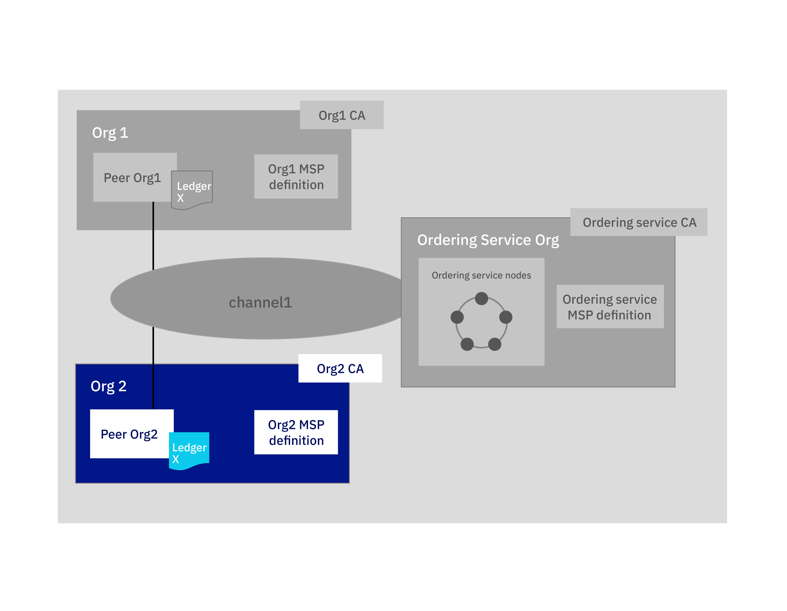

---

copyright:
  years: 2019
lastupdated: "2019-05-16"

keywords: getting started tutorials, create a CA, enroll, register, create an MSP, wallet, create a peer, create ordering service, Raft, join a network, system channel

subcollection: blockchain

---

{:new_window: target="_blank"}
{:shortdesc: .shortdesc}
{:screen: .screen}
{:codeblock: .codeblock}
{:note: .note}
{:important: .important}
{:tip: .tip}
{:pre: .pre}

# Lernprogramm zum Teilnehmen an einem Netz
{: #ibp-console-join-network}

{{site.data.keyword.blockchainfull}} Platform ist ein Blockchain-as-a-Service-Angebot, mit dem Sie Blockchain-Anwendungen und -Netze entwickeln, bereitstellen und betreiben können. In der [Übersicht zu den Blockchain-Komponenten](/docs/services/blockchain/blockchain_component_overview.html#blockchain-component-overview) erfahren Sie mehr zu den Blockchain-Komponenten und darüber, wie sie miteinander interagieren. Dieses Lernprogramm ist der zweite Teil der [Lernprogrammreihe für Beispielnetze](/docs/services/blockchain/howto/ibp-console-build-network.html#ibp-console-build-network-sample-tutorial), in dem die Vorgehensweise zum Erstellen von Knoten in der {{site.data.keyword.blockchainfull_notm}} Platform-Konsole und dem Verbinden dieser Knoten mit einem Blockchain-Konsortium beschrieben wird, das in einem anderen Cluster gehostet ist.
{:shortdesc}

Wenn Sie die Betatestversion von {{site.data.keyword.blockchainfull_notm}} Platform verwenden, dann stimmen wahrscheinlich bestimmte Anzeigen in Ihrer Konsole nicht mit den Darstellungen in der aktuellen Dokumentation überein, die stets auf den Stand der allgemein verfügbaren Serviceinstanz aktualisiert wird. Um alle Vorteile der neuesten Funktionalität nutzen zu können, sollten Sie eine neue GA-Serviceinstanz bereitstellen. Befolgen Sie hierzu die Anweisungen im Abschnitt mit der [Einführung in {{site.data.keyword.blockchainfull_notm}} Platform on {{site.data.keyword.cloud_notm}}](/docs/services/blockchain/howto/ibp-v2-deploy-iks.html#ibp-v2-deploy-iks).

**Zielgruppe:** Dieser Abschnitt richtet sich an Netzoperatoren, die für die Erstellung, Überwachung und Verwaltung des Blockchain-Netzes verantwortlich sind.  

Wenn Sie {{site.data.keyword.blockchainfull_notm}} Platform noch nicht bereitgestellt haben, lesen Sie die Informationen im Abschnitt mit der [Einführung in {{site.data.keyword.blockchainfull_notm}} Platform on {{site.data.keyword.cloud_notm}}](/docs/services/blockchain/howto/ibp-v2-deploy-iks.html#ibp-v2-deploy-iks). Sie können einen neuen Kubernetes-Cluster für die Blockchain-Komponenten erstellen oder einen vorhandenen Cluster in Ihrem {{site.data.keyword.cloud_notm}}-Konto verwenden. Nachdem Sie die {{site.data.keyword.blockchainfull_notm}} Platform-Instanz bereitgestellt haben, können Sie die Konsole starten, um Ihre Blockchain-Komponenten zu erstellen und zu verwalten.

Unabhängig davon, ob Sie einen bezahlten oder kostenlosen Kubernetes-Cluster bereitstellen, verwenden Sie das Kubernetes-Dashboard, um bei der Bereitstellung von Knoten und Erstellung von Kanälen ein besonderes Augenmerk auf die Ihnen zur Verfügung stehenden Ressourcen zu legen. Es liegt in Ihrer Verantwortung, Ihren Kubernetes-Cluster zu verwalten und bei Bedarf zusätzliche Ressourcen zu implementieren. Obwohl Komponenten erfolgreich in einem kostenlosen Cluster bereitgestellt werden können, gilt dennoch Folgendes: Je mehr Komponenten Sie hinzufügen, desto langsamer werden die Komponenten ausgeführt. Weitere Informationen zur passenden Größe von Komponenten und zur Interaktion der Konsole mit Ihrem Kubernetes-Cluster finden Sie im Abschnitt [Ressourcen zuordnen](/docs/services/blockchain/howto/ibp-console-govern.html#ibp-console-govern-iks-console-interaction).
{: note}

## Lernprogrammreihe für Beispielnetze
{: #ibp-console-join-network-structure}

Diese dreiteilige Lernprogrammreihe führt Sie durch den Prozess der Erstellung und Verbindung eines relativ einfachen Hyperledger Fabric-Netzes mit mehreren Knoten, indem Sie mithilfe der {{site.data.keyword.blockchainfull_notm}} Platform 2.0-Konsole ein Netz in Ihrem Kubernetes-Cluster installieren und einen Smart Contract instanziieren.

* Das [Lernprogramm zum Erstellen eines Netzes](/docs/services/blockchain/howto/ibp-console-build-network.html#ibp-console-build-network) führt Sie durch das Hosten eines Netzes, indem ein Anordnungsservice und ein Peer erstellt werden.
* Im **Lernprogramm zum Teilnehmen an einem Netz** erfahren Sie, wie Sie durch Erstellen eines Peers und Verknüpfen des Peers mit einem Kanal an einem vorhandenen Netz teilnehmen können.
* Im [Lernprogramm zum Bereitstellen eines Smart Contract im Netz](/docs/services/blockchain/howto/ibp-console-smart-contracts.html#ibp-console-smart-contracts) erfahren Sie, wie Sie einen Smart Contract schreiben und in Ihrem Netz bereitstellen.

Sie können die Schritte in diesen Lernprogrammen verwenden, um ein Netz mit mehreren Organisationen in einem Cluster für Entwicklungs- und Testzwecke zu erstellen. Verwenden Sie das Lernprogramm zum **Erstellen eines Netzes**, wenn Sie ein Blockchain-Konsortium gründen möchten, indem Sie einen Anordnungsservice erstellen und Organisationen hinzufügen. Verwenden Sie das Lernprogramm zum **Teilnehmen an einem Netz**, um einen Peer mit dem Netz zu verbinden. Indem Sie die Lernprogramme mit unterschiedlichen Konsortiumsmitgliedern durchführen, können Sie ein wirklich **verteiltes** Blockchain-Netz erstellen.  

In diesem Lernprogramm soll gezeigt werden, wie Sie einen Peer mit einem **vorhandenen** Netz verknüpfen. Es setzt voraus, dass ein Anordnungsservice, der alle Kanäle hostet, sowie das Konsortium bereits in Ihrem Cluster oder in einem anderen {{site.data.keyword.blockchainfull_notm}} Platform-Cluster vorhanden sind. Wenn kein Netz vorhanden ist, dem Sie beitreten können, erfahren Sie im [Lernprogramm zum Erstellen eines Netzes](/docs/services/blockchain/howto/ibp-console-build-network.html#ibp-console-build-network), wie Sie ein Netz erstellen können. Das Lernprogramm zum **Teilnehmen an einem Netz** führt Sie durch die Schritte zum Erstellen der folgenden Blockchain-Komponenten für `Org2`, die im blauen Kasten markiert sind:
  
*Abbildung 1. Struktur zum Teilnehmen an einem Netz*  
Führen Sie die Schritte im Lernprogramm zum **Teilnehmen an einem Netz** aus, um die folgenden Komponenten zu erstellen und die folgenden Aktionen auszuführen:

* **Eine Peerorganisation** `Org2`  
  Erstellen Sie die MSP-Definition (MSP, Membership Services Provider) für 'Org12', die die Organisation `Org2` definiert.
* **Ein Peer** `Peer Org2`   
  Das Ledger (`Ledger x` in der Abbildung oben) wird von verteilten Peers verwaltet. Der Peer wird mit [CouchDB ](https://hyperledger-fabric.readthedocs.io/en/release-1.4/couchdb_as_state_database.html) als Statusdatenbank bereitgestellt.
* **Eine Zertifizierungsstelle (CA)** `Org2 CA`
  Eine Zertifizierungsstelle (CA) ist der Knoten, der Zertifikate für alle Organisationsadministratoren und für die Knoten ausgibt, die einer Organisation zugeordnet sind. Sie erstellen eine Zertifizierungsstelle für die Peerorganisation `Org2`.
* **Einem Kanal beitreten**
  Dieses Lernprogramm beschreibt die Vorgehensweise zum Beitreten zu einem Kanal, der im Rahmen des [Lernprogramms zum Erstellen eines Netzes](/docs/services/blockchain/howto/ibp-console-build-network.html#ibp-console-build-network) erstellt wurde.

In diesem Lernprogramm werden **empfohlene Werte** für einige der Felder in der Konsole angegeben. Auf diese Weise können Sie die Namen und Identitäten in den Registerkarten und Dropdown-Listen leichter erkennen. Diese Werte sind zwar nicht obligatorisch, jedoch hilfreich, da Sie bestimmte Werte wie beispielsweise IDs und geheime Schlüssel registrierter Benutzer, die Sie in einem vorherigen Schritt eingegeben haben, für weitere Schritte benötigen. Sollten Sie diese Werte vergessen, dann müssen Sie zusätzliche Benutzer erstellen und registrieren. Nach jeder Tasks finden Sie eine Tabelle mit den empfohlenen Werten. Sollten Sie nicht die Beispielwerte verwenden, dann sollten Sie sich die von Ihnen benutzten Werte notieren, während Sie das Lernprogramm durcharbeiten.
{:tip}

## Schritt 1: Zusätzliche Organisation und Einstiegspunkt zur Blockchain erstellen
{: #ibp-console-join-network-create-ca-org2}

Für jede Organisation, die Sie mit der Konsole erstellen möchten, sollten Sie mindestens eine Zertifizierungsstelle implementieren. Eine Zertifizierungsstelle (CA) ist der Knoten, der Zertifikate für alle Netzteilnehmer (Peers, Anordnungsservices, Clients, Administratoren usw.) ausgibt. Mit diesen Zertifikaten, die ein Signierzertifikat und einen privaten Schlüssel enthalten, können Netzteilnehmer miteinander kommunizieren, sich authentifizieren und letztendlich Transaktionen ausführen. Diese Zertifizierungsstellen erstellen alle Identitäten und Zertifikate, die zu Ihrer Organisation gehören. Außerdem definieren sie die Organisation an sich. Anschließend können Sie diese Identitäten verwenden, um Knoten bereitzustellen, Administratoridentitäten zu erstellen und Transaktionen zu übergeben. Weitere Informationen zu Ihrer Zertifizierungsstelle und zu den Identitäten, die Sie erstellen müssen, finden Sie im Abschnitt [Identitäten verwalten](/docs/services/blockchain/howto/ibp-console-identities.html#ibp-console-identities).

Im vorliegenden Lernprogramm wird eine Organisation erstellt. Aus diesem Grund muss auch **eine Zertifizierungsstelle (CA)** erstellt werden.

### Zertifizierungsstelle für Peerorganisation erstellen
{: #ibp-console-join-network-create-CA-org2CA}

Im Rahmen dieses Lernprogramms gibt Ihre Zertifizierungsstelle die Zertifikate und privaten Schlüssel für Ihre Benutzer und Knoten aus. Diese Identitäten werden nicht von {{site.data.keyword.IBM_notm}} verwaltet und die Schlüssel werden nicht in der Konsole gespeichert. Sie werden nur im lokalen Speicher Ihres Browsers gespeichert. Stellen Sie daher sicher, dass Sie Ihre Identitäten und den MSP der Organisation exportieren. Wenn Sie versuchen, von einer anderen Maschine oder über einen anderen Browser auf die Konsole zuzugreifen, müssen Sie diese Identitäten und Organisationsdefinitionen importieren.
{:important}

Führen Sie die folgenden Schritte in der Konsole aus:  

1. Navigieren Sie zu der Registerkarte **Knoten** auf der linken Seite und klicken Sie auf **Zertifizierungsstelle hinzufügen**. In den Seitenanzeigen können Sie die Zertifizierungsstelle anpassen, die Sie erstellen möchten, und die Organisation, für die die Zertifizierungsstelle Schlüssel ausgibt.
2. Klicken Sie auf **{{site.data.keyword.cloud_notm}}** unter **Zertifizierungsstelle erstellen** und dann auf **Weiter**.
3. Verwenden Sie die zweite Seitenanzeige, um der Zertifizierungsstelle einen **Anzeigename** zu geben. Der empfohlener Wert für diese Zertifizierungsstelle ist `Org2 CA`.
4. Geben Sie in der nächsten Anzeige die Administratorberechtigungsnachweise für die Zertifizierungsstelle an, indem Sie als **Eintragungs-ID des Zertifizierungsstellenadministrators** die Zeichenfolge `admin` und als geheimen Schlüssel `adminpw` angeben. Auch hierbei handelt es sich um die **empfohlenen Werte**.
5. Wenn Sie einen gebührenpflichtigen Cluster verwenden, haben Sie die Möglichkeit, die Ressourcenzuordnung für den Knoten zu konfigurieren. Im Rahmen dieses Lernprogramms können Sie alle Standardeinstellungen akzeptieren und auf **Weiter** klicken. Weitere Informationen über die Zuordnung von Ressourcen zu Ihrem Knoten finden Sie in diesem Thema zur [Ressourcenzuordnung](/docs/services/blockchain?topic=blockchain-ibp-console-govern#ibp-console-govern-allocate-resources). Wenn Sie einen kostenlosen Cluster verwenden, wird die Seite **Zusammenfassung** angezeigt.
6. Überprüfen Sie die Seite "Zusammenfassung" und klicken Sie dann **Zertifizierungsstelle hinzufügen**.

**Task: Zertifizierungsstelle für die Peerorganisation erstellen**

  | **Feld** | **Anzeigename** | **Eintragungs-ID** | **Geheimer Schlüssel** |
  | ------------------------- |-----------|-----------|-----------|
  | **Zertifizierungsstelle erstellen** | Org2 CA  | admin | adminpw |

*Abbildung 2. Zertifizierungsstelle für die Peerorganisation erstellen*  

Nach der Bereitstellung der Zertifizierungsstelle verwenden Sie diese zum Erstellen des MSP für Ihre Organisation, zum Registrieren von Benutzern und zum Erstellen des Einstiegspunkts für ein Netz (den **Peer**).

Fortgeschrittene Benutzer verfügen möglicherweise bereits über eine eigene Zertifizierungsstelle und möchten keine neue Zertifizierungsstelle in der Konsole erstellen. Wenn Ihre vorhandene Zertifizierungsstelle Zertifikate im Format `X.509` ausgeben kann, können Sie Ihre eigene unabhängige Zertifizierungsstelle verwenden, anstatt hier eine neue zu erstellen. Weitere Informationen zu diesem Thema finden Sie im Abschnitt zur [Verwendung einer unabhängigen Zertifizierungsstelle mit Ihrem Peer oder Anordnungsservice](/docs/services/blockchain/howto/ibp-console-build-network.html#ibp-console-identities).

### Zertifizierungsstelle zum Registrieren von Identitäten verwenden
{: #ibp-console-join-network-use-CA-org2}

Jeder Knoten oder jede Anwendung, die Sie erstellen möchten, benötigt Zertifikate und private Schlüssel für die Teilnahme am Blockchain-Netz. Außerdem müssen Sie Administratoridentitäten für diese Knoten und Anwendungen erstellen, damit Sie sie über die Konsole verwalten können. Sie werden diesen Prozess zweimal durchlaufen und zwar jeweils einmal für die beiden von Ihnen erstellten Zertifizierungsstellen. Außerdem erstellen Sie für jede Zertifizierungsstelle zwei Identitäten:

* **Organisationsadministrator**: Diese Identität ermöglicht es Ihnen, Knoten über die Platform-Konsole zu bedienen.
* **Peeridentität**: Dies ist die Identität des Peers selbst. Wenn ein Peer eine Aktion ausführt (z. B. die Bewilligung einer Transaktion), erfolgt die Signierung mit dem zugehörigen Zertifikat.

Je nach Ihrem Clustertyp kann die Bereitstellung der Zertifizierungsstelle bis zu zehn Minuten dauern. Wenn die Zertifizierungsstelle zum ersten Mal bereitgestellt wird (oder wenn die Zertifizierungsstelle aus anderen Gründen nicht verfügbar ist), dann wird das Feld in der Kachel für die Zertifizierungsstelle abgeblendet dargestellt. Nachdem die Zertifizierungsstelle erfolgreich bereitgestellt wurde und ausgeführt wird, wird dieses Feld grün dargestellt. Dies zeigt an, dass sie "Aktiv" ist und zur Registrierung von Identitäten verwendet werden kann. Bevor Sie mit den Schritten zur Registrierung von Identitäten fortfahren können, müssen Sie warten, bis der Status der Zertifizierungsstelle "Aktiv" lautet.
{:important}

Nachdem die Zertifizierungsstelle aktiviert wurde, was durch das grüne Feld in der Kachel angezeigt wird, müssen Sie diese Zertifikate generieren, indem Sie die folgenden Schritte ausführen:

1. Klicken Sie auf `Org2 CA` und vergewissern Sie sich, dass die Identität `admin`, die Sie für die Zertifizierungsstelle erstellt haben, in der Tabelle angezeigt wird. Klicken Sie dann auf die Schaltfläche **Benutzer registrieren**.
2. Zuerst wird der Administrator der Organisation registriert. Dazu können Sie die **Eintragungs-ID** `org2admin` und den **geheimen Schlüssel** `org2adminpw` festlegen. Geben Sie dann als `Typ` für diese Identität `client` an (Administratoridentitäten sollten immer als `client` registriert werden, während Knotenidentitäten immer mit dem Typ `peer` registriert werden sollten. Das Feld für die Zugehörigkeit (sog. Affiliation) ist für fortgeschrittene Benutzer vorgesehen und wird in diesem Lernprogramm nicht verwendet. Klicken Sie also auf das Feld **Stammzugehörigkeit verwenden**. Wenn Sie mehr darüber erfahren möchten, wie Zugehörigkeiten von der Fabric-Zertifizierungsstelle verwendet werden, lesen Sie die Informationen im Abschnitt zum [Registrieren einer neuen Identität ](https://hyperledger-fabric-ca.readthedocs.io/en/release-1.4/users-guide.html#registering-a-new-identity). Wählen Sie vorläufig eine beliebige Zugehörigkeit in der Liste aus, beispielsweise `org1`. Das Feld **Maximale Anzahl der Eintragungen** kann ignoriert werden. Weitere Informationen zu Eintragungen finden Sie im Abschnitt zur [Registrierung von Identitäten](/docs/services/blockchain/howto/ibp-console-identities.html#ibp-console-identities-register). Klicken Sie auf **Weiter**.
4. Im Rahmen dieses Lernprogramms muss **Attribut hinzufügen** nicht verwendet werden. Weitere Informationen zu Identitätsattributen finden Sie im Abschnitt zur [Registrierung von Identitäten](/docs/services/blockchain/howto/ibp-console-identities.html#ibp-console-identities-register).
5. Nachdem der Organisationsadministrator registriert wurde, wiederholen Sie diesen Prozess für die Identität des Peers (und verwenden Sie dazu ebenfalls `Org2 CA`). Geben Sie für die Peeridentität die Eintragungs-ID `peer2` und den geheimen Schlüssel `peer2pw` an. Dies ist eine Knotenidentität. Wählen Sie daher `peer` als **Typ** aus. Klicken Sie auf das Feld **Stammzugehörigkeit verwenden** und ignorieren Sie die Option **Maximale Anzahl der Eintragungen**. In der nächsten Anzeige müssen Sie wie zuvor keine **Attribute** zuordnen.

Die Registrierung dieser Identitäten bei der Zertifizierungsstelle stellt lediglich den ersten Schritt bei der **Erstellung** einer Identität dar. Sie können diese Identitäten erst benutzen, nachdem Sie die **Eintragung** durchgeführt haben. Für die Identität `org2admin` erfolgt dieser Schritt während der Erstellung des MSP (siehe hierzu den nächsten Schritt). Im Falle des Peers wird er während der Erstellung des Peers ausgeführt.
{:note}

**Task: Benutzer registrieren**

  |  **Feld** | **Beschreibung** | **Eintragungs-ID** | **Geheimer Schlüssel** |
  | ------------------------- |-----------|-----------|-----------|-----------|
  | **Benutzer registrieren** |  Org2 admin | org2admin | org2adminpw |
  | | Peeridentität |  peer2 | peer2pw |

*Abbildung 3. Zertifizierungsstelle zum Registrieren von Benutzern verwenden*  

### MSP-Definition der Peerorganisation erstellen
{: #ibp-console-join-network-create-peers-org2}

Nachdem Sie nun die Zertifizierungsstelle des Peers erstellt und diese zum **Registrieren** der Organisationsidentitäten verwendet haben, müssen Sie eine formale Definition der Peerorganisation erstellen, die als MSP-Definition (MSP, Membership Services Provider) bezeichnet wird. Viele Peers können zu einer Organisation gehören. **Sie müssen nicht jedes Mal, wenn Sie einen Peer erstellen, auch eine neue Organisation erstellen.** Da Sie dieses Lernprogramm zum ersten Mal durchlaufen, erstellen Sie die MSP-ID für diese Organisation. Während der Erstellung des MSP werden Sie Zertifikate für die Identität `org2admin` generieren und sie zu Ihrer Wallet hinzufügen.

1. Navigieren Sie zur Registerkarte **Organisationen** im linken Navigationsbereich und klicken Sie auf **MSP-Definition erstellen**.
2. Geben Sie für den MSP den Anzeigenamen `Org2 MSP` und die MSP-ID `org2msp` an. Wenn Sie in diesem Feld eine eigene MSP-ID angeben möchten, müssen Sie die Spezifikationen zu den Einschränkungen für diesen Namen in der QuickInfo befolgen.
3. Geben Sie unter den **Details für die Stammzertifizierungsstelle** die Zertifizierungsstelle an, die Sie im vorherigen Schritt zur Registrierung der Identitäten verwendet haben. Wenn Sie dieses Lernprogramm zum ersten Mal verwenden, sollten Sie nur eine Zertifizierungsstelle sehen: `Org2 CA`. 
4. Die Felder **Eintragungs-ID** und **Geheimer Eintragungsschlüssel** darunter werden automatisch mit der Eintragungs-ID und dem geheimen Schlüssel für den ersten Benutzer gefüllt, den Sie mit der Zertifizierungsstelle erstellt haben: `admin` und `adminpw`. Wenn Sie diese Identität verwenden, dann erhält Ihre Organisation jedoch die gleiche Identität wie Ihre CA-Identität, was aus Sicherheitsgründen nicht zu empfehlen ist. Wählen Sie stattdessen in der Dropdown-Liste die Eintragungs-ID aus, die Sie für Ihren Organisationsadministrator erstellt haben (`org2admin`), und geben Sie als zugehörigen geheimen Schlüssel `org2adminpw` ein. Geben Sie dann dieser Identität einen Anzeigenamen (`Org2 Admin`).
5. Klicken Sie auf die Schaltfläche **Generieren**, um diese Identität als Administrator Ihrer Organisation einzutragen und die Identität in die Wallet zu exportieren, wo sie verwendet wird, wenn Sie den Peer und Kanäle erstellen.
6. Klicken Sie auf **Exportieren**, um die Administratorzertifikate in Ihr Dateisystem zu exportieren. Wie bereits oben erwähnt, wird diese Identität nicht in Ihrem Cluster gespeichert oder von {{site.data.keyword.IBM_notm}} verwaltet. Sie wird nur im lokalen Speicher Ihres Browsers gespeichert. Wenn Sie zu einem anderen Browser wechseln, müssen Sie diese Identität in Ihre Wallet importieren, damit Sie den Peer verwalten können.
7. Klicken Sie auf **MSP-Definition erstellen**.

**Task: MSP-Definition für die Peerorganisation erstellen**

  |  | **Anzeigename** | **MSP-ID** | **Eintragungs-ID**  | **Geheimer Schlüssel** |
  | ------------------------- |-----------|-----------|-----------|-----------|
  | **Organisation erstellen** | Org2 MSP | org2msp |||
  | **Stammzertifizierungsstelle** | Org2 CA ||||
  | **Administratorzertifikat für Organisation** | |  | org2admin | org2adminpw |
  | **Identität** | Org2 Admin |||||

  *Abbildung 4. MSP-Definition für Peerorganisation erstellen*  

Nachdem Sie den MSP erstellt haben, sollte der Administrator der Peerorganisation in Ihrer **Wallet** angezeigt werden. Klicken Sie im linken Navigationsbereich auf **Wallet**, um darauf zuzugreifen.

**Task: Wallet überprüfen**

  | **Feld** |  **Anzeigename** | **Beschreibung** |
  | ------------------------- |-----------|----------|
  | **Identität** | Org2 Admin | Org2 identity |

  *Abbildung 5. Wallet überprüfen*  

Weitere Informationen zu MSPs finden Sie im Abschnitt [Organisationen verwalten](/docs/services/blockchain/howto/ibp-console-organizations.html#ibp-console-organizations).

Das Exportieren der Identität des Organisationsadministrators ist wichtig, da Sie für die Verwaltung und Sicherung dieser Zertifikate verantwortlich sind. Wenn Sie den Anordnungsservice und die MSP-Definition des Anordnungsservice exportieren, können sie in eine andere Konsole importiert werden, in der ein anderer Operator neue Kanäle im Anordnungsservice erstellen oder dem Kanal Peers zuordnen kann.
{:important}

### Peer erstellen
{: #ibp-console-join-network-peer-create}

Nachdem Sie eine [Zertifizierungsstelle erstellt](/docs/services/blockchain/howto/ibp-console-join-network.html#ibp-console-join-network-create-CA-org2CA), diese zum Registrieren von Identität verwendet und den [MSP der Peerorganisation erstellt haben](/docs/services/blockchain/howto/ibp-console-join-network.html#ibp-console-join-network-create-peers-org2), können Sie nun einen Peer erstellen.

#### Welche Rolle spielen Peers?
{: #ibp-console-join-network-peer-role}

Es ist wichtig zu wissen, dass die Organisationen selbst keine Ledger pflegen. Dies übernehmen Peers. Organisationen verwenden auch Peers, um Transaktionsvorschläge zu signieren und Kanalkonfigurationsaktualisierungen zu genehmigen. Da das Vorhandensein von mindestens zwei Peers in einem Kanal diese hoch verfügbar macht, wird die Implementierung von mindestens zwei Peers, die mit einem Kanal verbunden sind, als Best Practice für Implementierungen auf Produktionsebene betrachtet. Dieses Lernprogramm enthält jedoch nur den Prozess zum Erstellen eines einzelnen Peers.

Aus Sicht einer Ressourcenzuordnung ist es möglich, dieselben Peers mit mehreren Kanälen zu verknüpfen. Das Design des Peers stellt sicher, dass die Daten von einem Kanal nicht über den Peer an einen anderen Kanal übergeben werden können. Da der Peer jedoch für jeden Kanal ein separates Ledger speichert, muss sichergestellt werden, dass der Peer genügend Verarbeitungsleistung und Speicher hat, um die Transaktion und das Laden der Daten zu verarbeiten.

#### Peer bereitstellen
{: #ibp-console-join-network-deploy-peer-role}

Verwenden Sie die Konsole, um die folgenden Schritte auszuführen:

1. Klicken Sie auf der Seite **Knoten** auf **Peer hinzufügen**.
2. Klicken Sie auf {{site.data.keyword.cloud_notm}} unter **Neuen Peer erstellen** und dann auf **Weiter**.
3. Geben Sie für den Peer als **Anzeigename** den Namen `Peer Org1` an.
4. Wählen Sie in der nächsten Anzeige den Eintrag `Org2 CA` aus. Hierbei handelt es sich um die Zertifizierungsstelle, die Sie zur Registrierung der Peeridentität verwendet haben. Wählen Sie in der Dropdown-Liste die **Eintragungs-ID** für die Peeridentität aus, die Sie für Ihren Peer erstellt haben (`peer2`), und geben Sie den zugehörigen **geheimen Schlüssel** (`peer2pw`) ein. Wählen Sie dann in der Dropdown-Liste `Org2 MSP` aus und klicken Sie auf **Weiter**.
5. In der nächsten Seitenanzeige werden Informationen zur TLS-Zertifizierungsstelle abgefragt. Bei der Erstellung der Zertifizierungsstelle wird außerdem eine TLS-Zertifizierungsstelle (TLSCA) erstellt. Diese Zertifizierungsstelle wird zur Erstellung von Zertifikaten für die sichere Kommunikationsebene für Knoten verwendet. Wählen Sie deshalb in der Dropdown-Liste die **Eintragungs-ID** für die Peeridentität aus, die Sie für Ihren Peer erstellt haben (`peer2`), und geben Sie den zugehörigen **geheimen Schlüssel** (`peer2pw`) ein. Der **TLS-CSR-Hostname** ist eine Option, die für fortgeschrittene Benutzer zur Verfügung steht, die einen angepassten Domänennamen angeben möchten, der zur Adressierung des Peerendpunkts verwendet werden kann. Angepasste Domänennamen werden im Rahmen des vorliegenden Lernprogramms nicht behandelt, sodass Sie momentan für **TLS-CSR-Hostname** keinen Wert angeben sollten.
6. Auf der nächsten Seitenanzeige erhalten Sie die Aufforderung **Identität zuordnen**, um diese als Administrator Ihres Peers festzulegen. Im Rahmen des vorliegenden Lernprogramms werden Sie Ihren Organisationsadministrator `Org2 Admin` auch als Administrator Ihres Peers festlegen. Es ist möglich, bei `Org2 CA` eine andere Identität zu registrieren und einzutragen und diese Identität als Administrator Ihres Peers festzulegen. Im vorliegenden Lernprogramm wird jedoch die Identität `Org2 Admin` verwendet.
7. Wenn Sie einen gebührenpflichtigen Cluster verwenden, haben Sie auf der nächsten Anzeige die Möglichkeit, die Ressourcenzuordnung für den Knoten zu konfigurieren. Im Rahmen dieses Lernprogramms können Sie alle Standardeinstellungen akzeptieren und auf **Weiter** klicken. Weitere Informationen über die Zuordnung von Ressourcen zu Ihrem Knoten finden Sie in diesem Thema zur [Ressourcenzuordnung](/docs/services/blockchain?topic=blockchain-ibp-console-govern#ibp-console-govern-allocate-resources). Wenn Sie einen kostenlosen Cluster verwenden, wird Ihnen die Seite **Zusammenfassung** angezeigt.
8. Überprüfen Sie die Zusammenfassung und klicken Sie auf **Peer hinzufügen**.

**Task: Peer bereitstellen**

  |  | **Anzeigename** | **MSP-ID** | **Eintragungs-ID** | **Geheimer Schlüssel** |
  | ------------------------- |-----------|-----------|-----------|-----------|
  | **Peer erstellen** | Peer Org2 | org2msp |||
  | **Zertifizierungsstelle** | Org2 CA ||||
  | **Peeridentität** | |  | peer2 | peer2pw |
  | **Administratorzertifikat** | org2msp ||||
  | **TLS-Zertifizierungsstelle** | Org2 CA ||||
  | **ID der TLS-Zertifizierungsstelle** | || admin | adminpw |
  | **Identität zuordnen** | Org2 Admin |||||

  *Abbildung 6. Peer bereitstellen*  

In einem Produktionsszenario sollten Sie drei Peers für jeden Kanal bereitstellen. Dadurch kann der Ausfall eines Peers (z. B. während eines Wartungszyklus) ausgeglichen werden, sodass weiterhin die Hochverfügbarkeit der Peers erhalten bleibt. Wenn Sie für eine Organisation mehrere Peers bereitstellen wollen, dann verwenden Sie dieselbe Zertifizierungsstelle, die Sie auch zur Registrierung Ihrer ersten Peeridentität verwendet haben. Im vorliegenden Lernprogramm ist dies `Org2 CA`. Führen Sie dann die Registrierung einer neuen Peeridentität mit einer anderen Eintragungs-ID und einem anderen geheimen Schlüssel durch. Beispiel: `org2secondpeer` und `org2secondpeerpw`. Geben Sie dann bei der Erstellung des Peers die Eintragungs-ID und den geheimen Schlüssel an. Da dieser Peer weiterhin Org2 zugeordnet ist, müssen Sie in der Dropdown-Liste `Org2 CA`, `Org2 MSP` und `Org2 Admin` auswählen. Sie können diesem neuen Peer einen anderen Administrator zuordnen, der mit `Org2 CA` registriert und eingetragen werden kann. Dies ist jedoch ein optionaler Schritt. In dieser Lernprogrammreihe wird lediglich der Prozess zur Erstellung eines einzelnen Peers für jede Peerorganisation erläutert.
{:tip}

## Schritt 2: Organisation zur Liste der Organisationen hinzufügen, die Transaktionen durchführen können
{: #ibp-console-join-network-add-org2}

Wie bereits erwähnt, muss eine Peerorganisation für den Anordnungsservice bekannt sein, bevor sie einen Kanal erstellen oder einem Kanal beitreten kann (dieser Schritt wird auch als Teilnahme am "Konsortium", d. h. der Liste der Organisationen bezeichnet, die für den Anordnungsservice bekannt sind). Dies wird dadurch begründet, dass Kanäle in technischer Hinsicht **Nachrichtenübertragungswege** zwischen Peers über einen Anordnungsservice darstellen. So wie ein Peer mehreren Kanälen zugeordnet werden kann, ohne dass Informationen von einem Kanal an einen anderen Kanal übergeben werden, kann ein Anordnungsservice zur Ausführung von mehreren Kanälen verwendet werden, ohne dass Daten für Organisationen in anderen Kanälen offengelegt werden.

Da nur Administratoren von Anordnungsservices Peerorganisationen zum Konsortium hinzufügen können, müssen Sie über eine der folgenden Rollen verfügen:

* **Administrator des Anordnungsservice**. In diesem Fall können Sie die von Ihnen erstellte Peerorganisation direkt zum Konsortium hinzufügen.
* **Absender** der MSP-Informationen an den Administrator des Anordnungsservice, der Ihre Organisation zum entsprechenden Konsortium hinzufügt.

Im nächsten Schritt werden Sie erfahren, wie eine von Ihnen erstellte Peerorganisation zu einem Konsortium hinzugefügt wird, das sich unter Ihrer Kontrolle befindet. Weitere Informationen zur Vorgehensweise beim Export Ihrer Organisation in eine Konsole, auf der ein Anordnungsservice gehostet wird, finden Sie im folgenden Abschnitt zum [Exportieren der Informationen einer Organisation](/docs/services/blockchain/howto/ibp-console-join-network.html#ibp-console-join-network-add-org2-remote).

### Organisation des Peers zum Anordnungsservice in der eigenen Konsole hinzufügen
{: #ibp-console-join-network-add-org2-local}

**Führen Sie die folgenden Schritte nur aus, wenn die Konsole bereits den Anordnungsservice und den Kanal enthält, denen Sie beitreten möchten.** Andernfalls fahren Sie mit dem [Exportieren der Organisationsinformationen](/docs/services/blockchain/howto/ibp-console-join-network.html#ibp-console-join-network-add-org2-remote) fort.

Da nur Administratoren von Anordnungsservices Peerorganisationen zum Konsortium hinzufügen können, müssen Sie der Administrator des Anordnungsservice sein, was bedeutet, dass die Identität des Administrators der Anordnungsserviceorganisation in Ihrer Wallet vorhanden sein muss.

1. Navigieren Sie zur Registerkarte **Knoten**.
2. Blättern Sie abwärts zu dem Anordnungsservice, den Sie verwenden möchten, und klicken Sie auf diesen Service, um ihn zu öffnen.
3. Klicken Sie unter **Konsortiumsmitglieder** auf **Organisation hinzufügen**.
4. Wählen Sie in der Dropdown-Liste `Org2 MSP` aus, da es sich hierbei um den MSP handelt, der die Organisation `org2` darstellt.
5. Klicken Sie auf **Organisation hinzufügen**.

Fügen Sie nun die Peerorganisation zum Kanal hinzu.
1. Navigieren Sie zur Registerkarte **Kanäle** und klicken Sie auf `Kanal 1`.
2. Klicken Sie auf das Symbol **Einstellungen**, um den Kanal zu aktualisieren und die Peerorganisation zum Kanal hinzuzufügen.
3. Stellen Sie sicher, dass in der Dropdown-Liste **Verfügbaren Anordnungsservice auswählen** der Eintrag `Anordnungsservice` ausgewählt ist.
4. Stellen Sie sicher, dass in der Dropdown-Liste **MSP-ID des Kanalaktualisierungsberechtigten** der Eintrag `org1MSP` ausgewählt ist.
5. Stellen Sie sicher, dass in der Dropdown-Liste **Verfügbare Identität zuordnen** der Eintrag `Org1Admin` ausgewählt ist.
6. Blättern Sie abwärts zum Abschnitt `Organisationen zum Kanal hinzufügen` und öffnen Sie die Dropdown-Liste `Kanalmitglied auswählen`. Wählen Sie den MSP der Peerorganisation (`Org2 MSP`) aus.
7. Klicken Sie auf **Hinzufügen** und ordnen Sie dann Berechtigungen für diese Organisation zu. Sie sollten Berechtigungen des Typs `Operator` verwenden, damit der Kanal aktualisiert werden kann.
8. Klicken Sie auf **Kanal aktualisieren**.

Wenn dieser Prozess abgeschlossen ist, kann `org2` einen Kanal erstellen oder einem Kanal beitreten, der über den `Anordnungsservice` gehostet wird. Sie können mit [Schritt 3: Ihren Peer dem Kanal zuordnen](/docs/services/blockchain/howto/ibp-console-join-network.html#ibp-console-join-network-join-peer-org2) fortfahren.

### Organisationsinformationen exportieren
{: #ibp-console-join-network-add-org2-remote}

**Führen Sie diese Schritte nur aus, wenn sich der Anordnungsservice und der Kanal, denen der Peer beitritt, in einer anderen {{site.data.keyword.blockchainfull_notm}} Platform-Serviceinstanz** befinden. Andernfalls können Sie mit [Schritt 3: Peer mit dem Kanal verknüpfen](/docs/services/blockchain/howto/ibp-console-join-network.html#ibp-console-join-network-join-peer-org2) fortfahren.

Sie müssen die MSP-Definition Ihrer Organisation an den Administrator des Anordnungsservice senden und mit den nachfolgenden Schritten zum Konsortium hinzufügen.

Wenn Sie die folgenden Schritte ausführen, müssen Sie der Administrator der **Peerorganisation** sein. Dies bedeutet, dass die Identität des Administrators der Peerorganisation in Ihrer Wallet vorhanden sein muss:

1. Navigieren Sie zur Registerkarte **Organisationen**. Die Organisationen, die für den Export zur Verfügung stehen, sind unter **Verfügbare Organisationen** aufgelistet. Klicken Sie auf die Schaltfläche **Herunterladen** innerhalb der Kachel mit den Organisationen, um die JSON-Konfigurationsdatei herunterzuladen, die den MSP der Peerorganisation darstellt.
2. Senden Sie diese Datei in einer externen Operation an den Administrator des Anordnungsservice.

### Organisationsdefinition importieren
{: #ibp-console-join-network-import-remote-msp}

Der Administrator des Anordnungsservice muss diese JSON-Datei importieren, um Ihre Organisation zu seiner Konsole hinzuzufügen:

1. Navigieren Sie zur Registerkarte **Organisationen**, klicken Sie auf die Schaltfläche **MSP-Definition importieren** und wählen Sie die JSON-Datei aus, die die MSP-Definition der Peerorganisation darstellt.
2. Navigieren Sie zur Seite **Knoten** und klicken Sie auf den Knoten Ihres Anordnungsservice. Klicken Sie in der Anzeige für den Anordnungsservice unter **Konsortiumsmitglieder** auf **Organisation hinzufügen**. Wählen Sie in der Seitenanzeige, die geöffnet wird, `Org2 MSP` aus der Liste der MSP-Definitionen auf der Registerkarte **Organisationen** aus.
3. Navigieren Sie zur Registerkarte **Kanäle**, klicken Sie auf `Kanal 1` und anschließend auf das Symbol **Einstellungen**, um den Kanal zu aktualisieren, und fügen Sie die Peerorganisation zum Kanal hinzu.
4. Stellen Sie sicher, dass in der Dropdown-Liste **Verfügbaren Anordnungsservice auswählen** der Eintrag `Anordnungsservice` ausgewählt ist.
5. Stellen Sie sicher, dass in der Dropdown-Liste **MSP-ID des Kanalaktualisierungsberechtigten** der Eintrag `org1MSP` ausgewählt ist.
6. Stellen Sie sicher, dass in der Dropdown-Liste **Verfügbare Identität zuordnen** der Eintrag `Org1Admin` ausgewählt ist.
7. Blättern Sie abwärts zum Abschnitt `Organisationen zum Kanal hinzufügen` und öffnen Sie die Dropdown-Liste `Kanalmitglied auswählen`. Wählen Sie den MSP der Peerorganisation, `Org2 MSP`, für das Lernprogramm aus.
8. Klicken Sie auf **Hinzufügen** und ordnen Sie dann Berechtigungen für diese Organisation zu. Sie sollten Berechtigungen des Typs `Operator` verwenden, damit der Kanal aktualisiert werden kann.
9. Klicken Sie auf **Kanal aktualisieren**.

Nachdem der Administrator des Anordnungsservice die Peerorganisation mit dem Konsortium und dem Kanal verbunden hat, müssen Sie den Anordnungsservice in Ihre Konsole importieren. Sie können dann Kanälen beitreten, die vom Anordnungsservice gehostet werden. Führen Sie die folgenden Schritte aus, um den Anordnungsservice zu **importieren**:

Der Administrator der **Organisation des Anordnungsservice** muss zuerst die folgenden Schritte ausführen:

1. Navigieren Sie auf der Registerkarte **Knoten** zum Anordnungsservice und klicken Sie auf das Symbol **Einstellungen** rechts neben dem Namen des Anordnungsservice, um die Seitenanzeige zu öffnen. Klicken Sie unter **Aktionen** auf die Schaltfläche **Exportieren**, um eine JSON-Konfigurationsdatei herunterzuladen.
2. Senden Sie diese Datei in einer externen Operation an die Peerorganisation. Der Administrator der Peerorganisation kann dann die Konfigurationsdatei verwenden, um den Anordnungsservice zur Konsole hinzuzufügen.

### Anordnungsservice aus einem anderen Cluster importieren
{: #ibp-console-join-network-import-remote-orderer}

Führen Sie die folgenden Schritte aus, wenn Sie der Administrator der **Peerorganisation** sind:

1. Navigieren Sie zur Seite **Knoten** und klicken Sie auf **Anordnungsservice hinzufügen**.
2. Klicken Sie unter **Vorhandenen Anordnungsservice importieren** auf {{site.data.keyword.cloud_notm}}.
3. Klicken Sie anschließend auf die Schaltfläche **JSON hochladen** und wählen Sie die JSON aus, die den Knoten selbst darstellt.
4. Wenn Sie im nächsten Schritt zum Zuordnen einer Identität aufgefordert werden, wählen Sie die Identität der Peerorganisation aus. Im vorliegenden Lernprogramm ist dies `Org2 Admin`. Klicken Sie auf **Anordnungsservice importieren**.

## Schritt 3: Peer mit dem Kanal verknüpfen
{: #ibp-console-join-network-join-peer-org2}

Sie haben es fast geschafft. Ihr Peer kann nun mit einem vorhandenen Kanal verknüpft werden. Sie müssen in einer externen Operation den `Kanalnamen` von einer Organisation abrufen, die Mitglied des Kanals ist. Im Lernprogramm zum **Erstellen eines Netzes** haben Sie einen Kanal namens `Kanal 1` erstellt. Navigieren Sie dazu ggf. zur Registerkarte **Kanäle** im linken Navigationsbereich.

Führen Sie die folgenden Schritte in der Konsole aus:

1. Klicken Sie auf die Schaltfläche **Kanal beitreten**, um die Seitenanzeigen zu starten.
2. Wählen Sie den Anordnungsservice mit dem Namen `Anordnungsservice` aus und klicken Sie auf **Weiter**.
3. Geben Sie den Namen des Kanals ein, dem Sie beitreten möchten (`Kanal 1`), und klicken Sie auf **Weiter**.
4. Wählen Sie die Peers aus, die dem Kanal beitreten sollen. Klicken Sie im Rahmen dieses Lernprogramms auf `Peer Org2`.
5. Klicken Sie auf **Kanal beitreten**.

Wenn Sie die Funktion [Private Data ](https://hyperledger-fabric.readthedocs.io/en/release-1.4/private-data/private-data.html "Private Data") oder [Service Discovery ](https://hyperledger-fabric.readthedocs.io/en/release-1.4/discovery-overview.html "Service Discovery") von Hyperledger Fabric nutzen möchten, müssen Sie Ankerpeers in Ihren Organisationen über die Registerkarte **Kanäle** konfigurieren. Weitere Informationen zum Konfigurieren von Ankerpeers für private Daten über die Registerkarte **Kanäle** in der Konsole finden Sie unter [Private Daten](/docs/services/blockchain/howto/ibp-console-smart-contracts.html#ibp-console-smart-contracts-private-data).

Sie können auch einen neuen Kanal erstellen, wenn Ihre Organisation Mitglied des Konsortiums ist. Führen Sie die Schritte zum [Erstellen eines Kanals](/docs/services/blockchain/howto/ibp-console-build-network.html#ibp-console-build-network-create-channel) im [Lernprogramm zum Erstellen eines Netzes](/docs/services/blockchain/howto/ibp-console-build-network.html#ibp-console-build-network) aus.

## Nächste Schritte
{: #ibp-console-join-network-next-steps}

Nachdem Sie den Peer mit einem Kanal verknüpft haben, verwenden Sie nun die folgenden Schritte, um einen Smart Contract bereitzustellen und mit der Übertragung von Transaktionen an die Blockchain zu beginnen:

- [Stellen Sie einen Smart Contract in Ihrem Netz bereit](/docs/services/blockchain/howto/ibp-console-smart-contracts.html#ibp-console-smart-contracts). Verwenden Sie dazu die Konsole.
- Nachdem Sie Ihren Smart Contract installiert und instanziiert haben, können Sie [Transaktionen mit Ihrer Clientanwendung übergeben](/docs/services/blockchain/howto/ibp-console-smart-contracts.html#ibp-console-smart-contracts-connect-to-SDK).
- Verwenden Sie das [Wertpapier-Beispiel (commercial-paper)](/docs/services/blockchain/howto/ibp-console-create-app.html#ibp-console-app-commercial-paper), um einen beispielhaften Smart Contract bereitzustellen und Transaktionen mithilfe von Anwendungscode zu übergeben.
