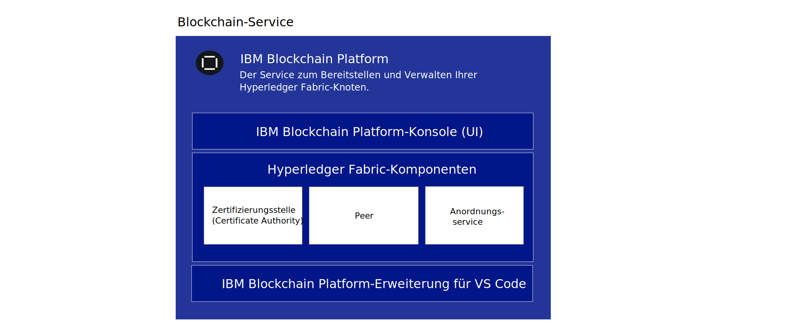
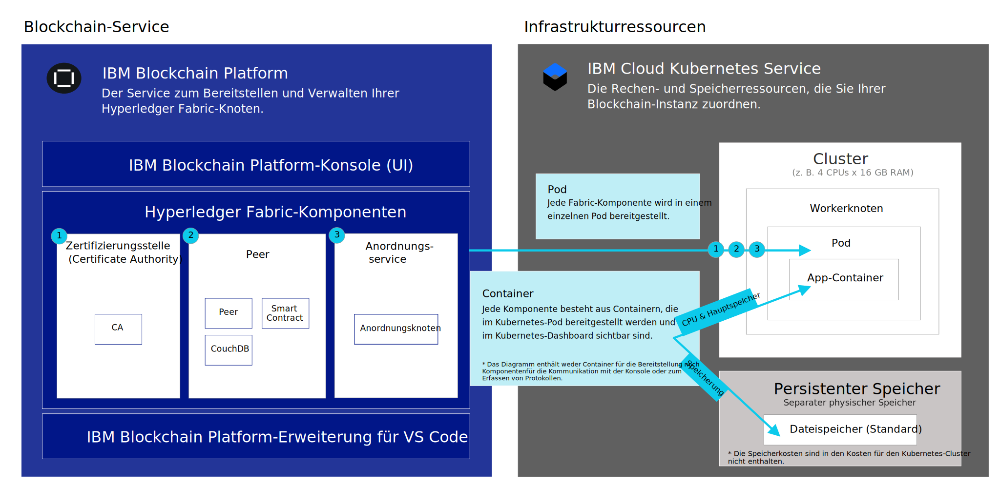

---

copyright:
  years: 2019
lastupdated: "2019-07-16"

keywords: getting started tutorials, videos, web browsers, integration

subcollection: blockchain

---

{:external: target="_blank" .external}
{:shortdesc: .shortdesc}
{:screen: .screen}
{:codeblock: .codeblock}
{:note: .note}
{:important: .important}
{:tip: .tip}
{:pre: .pre}
{:gif: data-image-type='gif'}

# Einführung in {{site.data.keyword.blockchainfull_notm}} Platform for {{site.data.keyword.cloud_notm}}
{: #ibp-v2-deploy-iks}

{{site.data.keyword.blockchainfull}} Platform for {{site.data.keyword.cloud_notm}} enthält die {{site.data.keyword.blockchainfull_notm}} Platform-Konsole, d. h. eine Benutzerschnittstelle, die den Prozess zum Bereitstellen und Steuern von Blockchain-Komponenten vereinfachen und beschleunigen kann. In diesem Lernprogramm wird der Einstieg in {{site.data.keyword.blockchainfull_notm}} Platform for {{site.data.keyword.cloud_notm}} und in die Verwendung der Konsole zum Bereitstellen und Verwalten von Blockchain-Komponenten in Ihrem {{site.data.keyword.cloud_notm}} Kubernetes Service-Cluster unter {{site.data.keyword.cloud_notm}} beschrieben. Weitere Informationen zu Kubernetes und zu {{site.data.keyword.cloud_notm}} Kubernetes Service finden Sie unter [Kubernetes](/docs/services/blockchain/reference?topic=blockchain-k8s-overview "Kubernetes").
{:shortdesc}

**Zielgruppe:** Dieser Abschnitt richtet sich an Systemadministratoren, die für die Einrichtung eines Kubernetes-Clusters on {{site.data.keyword.cloud_notm}} und für die Bereitstellung von {{site.data.keyword.blockchainfull_notm}} Platform verantwortlich sind.

Nachdem Sie {{site.data.keyword.blockchainfull_notm}} Platform mit Ihrem {{site.data.keyword.cloud_notm}} Kubernetes-Cluster verbunden haben, können Sie die Konsole starten, um Ihre Blockchain-Komponenten zu erstellen und zu verwalten und die folgenden wichtigen Vorteile zu nutzen:

- **Steuerung:** Sie steuern und verwalten Ihre Blockchain-Komponenten und Zertifikate von einer zentralen Konsole aus. Stellen Sie nur die Komponenten bereit, die für Ihr Unternehmen benötigt werden, und fügen Sie mehr hinzu, wenn Sie wachsen.
- **Flexible Kubernetes-basierte Bereitstellung:** Sie können die Optionen für die Rechenleistung (CPU, Hauptspeicher, Speicher) für Ihren Kubernetes-Cluster verwenden und integrierte HA- und DR-Optionen nutzen.

## Was ist der Blockchain-Service?
{: #ibp-v2-deploy-iks-blockhain-service}

Das folgende Diagramm veranschaulicht die drei Elemente von {{site.data.keyword.blockchainfull_notm}} Platform:



- **{{site.data.keyword.blockchainfull_notm}} Platform-Konsole (Benutzerschnittstelle, UI)**: Mit dieser Konsole können Sie Blockchain-Komponenten erstellen und verwalten. Nachdem Sie eine Serviceinstanz in {{site.data.keyword.cloud_notm}} zur Verfügung gestellt haben, können Sie eine Instanz der {{site.data.keyword.blockchainfull_notm}}-Konsole bereitstellen und mit Ihrem {{site.data.keyword.cloud_notm}} Kubernetes-Cluster verknüpfen. Anschließend können Sie mit der Konsole eigene Blockchain-Komponenten in Ihrem Kubernetes-Cluster erstellen und verwalten. Die Konsole ist kostenlos.

- **Hyperledger Fabric-Komponenten**: Mithilfe der Konsole werden Blockchain-Komponenten erstellt und verwaltet, die auf Hyperledger Fabric v1.4.1-Images für Zertifizierungsstelle, Peer und Anordnungsservice basieren.  Diese Komponenten werden in Ihrem Kubernetes-Cluster bereitgestellt. Der Speicher für diese Komponenten wird bei ihrer Bereitstellung über die Speicherklasse `default` zur Verfügung gestellt.

- **{{site.data.keyword.IBM_notm}} VS Code-Erweiterung (Entwicklungstools)**: Laden Sie die VS Code-Erweiterung aus dem VS Code-Marktplatz herunter, um mit der Entwicklung, der Paketierung und dem Testen von Clientanwendungen und Smart Contracts zu beginnen.

## Wichtige Hinweise
{: #ibp-v2-deploy-iks-considerations}

Stellen Sie vor der Bereitstellung der Konsole sicher, dass Sie die folgenden Aspekte verstehen:

- {{site.data.keyword.blockchainfull_notm}} Platform for {{site.data.keyword.cloud_notm}} basiert auf Hyperledger Fabric v1.4.1.
- Alle Peers, die mit der Konsole oder den APIs bereitgestellt werden, verwenden CouchDB als Statusdatenbank.
- Sie haben die Möglichkeit, Ihre {{site.data.keyword.blockchainfull_notm}} Platform-Serviceinstanz mit einem kostenlosen Kubernetes-Cluster zu verbinden, um das Angebot zu bewerten. Kapazität und Leistung sind jedoch begrenzt und Ihre Daten können nicht migriert werden. Der Cluster wird nach 30 Tagen gelöscht.
- Sie sind für das Management der Statusüberwachung, der Sicherheit und der Protokollierung Ihres Kubernetes-Cluster verantwortlich. Hier finden Sie [weitere Informationen](/docs/containers?topic=containers-responsibilities_iks#your-responsibilities-by-using-ibm-cloud-kubernetes-service){: external} dazu, welche Aspekte von {{site.data.keyword.cloud_notm}} verwaltet werden und für welche Aspekte Sie verantwortlich sind.
- Sie sind auch für die Überwachung der Ressourcennutzung Ihres Kubernetes-Clusters über das Kubernetes-Dashboard verantwortlich. Wenn Sie die Speicherkapazität oder die Leistung Ihres Clusters erhöhen müssen, lesen Sie diese Informationen zum [Ändern des vorhandenen Datenträgers](/docs/containers?topic=containers-file_storage#change_storage_configuration){: external}.
- Sie sind für die Verwaltung und Sicherung Ihrer Zertifikate und privaten Schlüssel verantwortlich. {{site.data.keyword.IBM_notm}} speichert Ihre Zertifikate nicht im Kubernetes-Cluster.
- {{site.data.keyword.blockchainfull_notm}} Platform steht in ausgewählten Regionen zur Verfügung. Eine aktualisierte Liste hierzu finden Sie im Abschnitt zu den [Standorten von {{site.data.keyword.blockchainfull_notm}} Platform](/docs/services/blockchain/howto?topic=blockchain-ibp-regions-locations).
- {{site.data.keyword.blockchainfull_notm}} Platform kann nicht in OpenShift-Clustern bereitgestellt werden, die mit dem {{site.data.keyword.IBM_notm}} Kubernetes-Service erstellt wurden.
- Kubernetes muss in Ihrem {{site.data.keyword.cloud_notm}} Kubernetes-Cluster die Version 1.11 oder höher aufweisen. Führen Sie die folgenden Anweisungen aus, um [ein Upgrade für Ihre neuen und vorhandenen Cluster](/docs/services/blockchain/howto?topic=blockchain-ibp-v2-deploy-iks#ibp-v2-deploy-iks-updating-kubernetes) auf diese Version zu aktualisieren.
- Wenn Sie bei der Bereitstellung eines Kubernetes-Clusters in {{site.data.keyword.cloud_notm}} nicht den vorausgewählten Standarddateispeicher der Bronzestufe verwenden möchten, können Sie den gewünschten Speicher bereitstellen. Weitere Angaben hierzu finden Sie unter [Hinweise zum persistenten Speicher](/docs/services/blockchain?topic=blockchain-ibp-v2-deploy-iks#ibp-console-storage).
- Wenn Sie sich entschließen, in Ihrem Kubernetes-Cluster {{site.data.keyword.cloud_notm}}-Unterstützung für mehrere Zonen einzubinden, müssen Sie eigenen Speicher bereitstellen. Weitere Angaben hierzu finden Sie unter [Cluster mit mehreren Zonen (MZR) für {{site.data.keyword.blockchainfull_notm}} Platform](/docs/services/blockchain?topic=blockchain-ibp-v2-deploy-iks#ibp-console-mzr) verwenden.
- VRF (Virtual Routing and Forwarding) wird nicht unterstützt. Der {site.data.keyword.blockchainfull_notm}} Platform-Service ist nicht kompatibel mit Konten, die für automatische globale Weiterleitung zwischen IP-Teilnetzblöcken aktiviert sind. Kubernetes-Cluster, die mit privaten VLANs konfiguriert sind, werden ebenfalls nicht unterstützt.

## Schulungsvideo
{: #ibp-v2-deploy-video}

Die folgende [Videoreihe]( http://ibm.biz/BlockchainPlatformSeries) vermittelt weitere Informationen zur {{site.data.keyword.blockchainfull_notm}} Platform-Konsole und eine Einführung in die Bereitstellung von {{site.data.keyword.blockchainfull_notm}} Platform for {{site.data.keyword.cloud_notm}}.

## Vorbemerkungen
{: #ibp-v2-deploy-iks-prereq}

Vorbemerkungen:

- Stellen Sie sicher, dass Sie über ein [gebührenpflichtiges {{site.data.keyword.cloud_notm}}-Konto](https://cloud.ibm.com/catalog/services/blockchain){: external} verfügen. Wenn Sie kein Konto haben:
   1. Klicken Sie auf die Schaltfläche **Registrieren** .
   2. Nach der Erstellung eines kostenfreien Testkontos führen Sie ein Upgrade auf ein **nutzungsabhängig Konto** durch, indem Sie **Verwalten** > **Abrechnung und Nutzung** > **Abrechnung** in der {{site.data.keyword.cloud_notm}}-Konsole aufrufen und auf **Kreditkarte hinzufügen** klicken.
   3. Stellen Sie sicher, dass der Benutzer sowohl die Administratorrolle als auch Managerrollen für den Kubernetes-Cluster besitzt, den er mit der zugehörigen Blockchain-Serviceinstanz verknüpfen wird. Weitere Informationen zu diesen Schritten finden Sie unter [Vorgehensweise zur Zuweisung von Kubernetes-Zugriffsrollen](#ibp-v2-deploy-iks-k8x-access-roles).

Wenn Sie planen, die Serviceinstanz im Kontext einer umfassenderen organisationsweiten Lösung zu verwenden, wird empfohlen, dass die teilnehmenden Organisationen eine funktionale E-Mail-Adresse verwenden, um ihr Netz zu erstellen. In diesem Fall ist der Zugriff auf das Netz nicht von der Verfügbarkeit der einzelnen Personen abhängig.
{:tip}  

- Wenn Sie einen vorhandenen {{site.data.keyword.cloud_notm}} Kubernetes Service-Cluster verwenden möchten, überprüfen Sie die Version von Kubernetes, und führen Sie bei Bedarf ein Upgrade auf Version 1.11 oder höher durch. Weitere Informationen zum Ermitteln der Version von Kubernetes, auf der Ihr Cluster ausgeführt wird, sowie zum Durchführen eines Upgrades auf eine höhere Version finden Sie im Abschnitt [Kubernetes-Version des Clusters aktualisieren](/docs/services/blockchain/howto?topic=blockchain-ibp-v2-deploy-iks#ibp-v2-deploy-iks-updating-kubernetes).

### Browser
{: #ibp-v2-deploy-iks-browsers}
Die folgende Liste enthält die Mindestanforderung für die Browsersoftware für die {{site.data.keyword.blockchainfull_notm}} Platform-Konsole:

- Chrome: aktuelle Version für Ihr Betriebssystem
- Firefox: aktuelle reguläre Versionen (keine ESR-Versionen) für Ihr Betriebssystem
- Safari: aktuelle Version für Mac
- Edge: Version 44.17763.1.0 oder höher

### Erforderliche Ressourcen
{: #ibp-v2-deploy-iks-resources-required}

#### Empfehlungen für die Clustergröße
{: #ibp-v2-deploy-iks-resources-required-free}

 Wenn Sie Ihre {{site.data.keyword.blockchainfull_notm}} Platform-Konsole mit einem {{site.data.keyword.cloud_notm}} Kubernetes Service-Cluster verknüpfen, müssen Sie sicherstellen, dass Ihr Kubernetes-Cluster die Mindestvoraussetzungen für Hardwareressourcen erfüllt:

|Kubernetes-Cluster-Typ | Anwendungsfall | CPU | RAM | Workerknoten |
|-----------|------|-----|-----------------------|
|Standard (empfohlen) | Für MVPs geeignet | 4 (Gemeinsam genutzt) | 16 GB (gemeinsam genutzt)|Mehrere|
|Kostenlos** | Für eine Evaluierung geeignet | 2 | 4 GB | 1 |  
** Testen Sie {{site.data.keyword.blockchainfull_notm}} Platform für einen Zeitraum von 30 Tagen kostenlos, indem Sie Ihre {{site.data.keyword.blockchainfull_notm}} Platform-Serviceinstanz mit einem kostenlosen {{site.data.keyword.cloud_notm}} Kubernetes-Cluster verbinden. Die Leistung dieser Testversion ist jedoch in Bezug auf Durchsatz, Speicherkapazität und Funktionalität beschränkt. {{site.data.keyword.cloud_notm}} löscht Ihren Kubernetes-Cluster nach 30 Tagen. Eine Migration von Knoten oder Daten aus einem kostenlosen Cluster auf einen gebührenpflichtigen Cluster ist hierbei nicht möglich.

Diese Ressourcen sind für Tests und Versuchsreihen ausreichend. Das [Lernprogramm zum Erstellen eines Netzes](/docs/services/blockchain/howto?topic=blockchain-ibp-console-build-network#ibp-console-build-network), in dem Sie zwei Peers, zwei Zertifizierungsstellen und einen Anordnungsservice erstellen, beansprucht ungefähr 4,15 CPUs. Der Anordnungsservice mit fünf Knoten beansprucht 1,75 CPUs davon. Wenn Sie planen, einen Anordnungsservice mit fünf Knoten bereitzustellen, sollten Sie keinen Kubernetes-Cluster mit einem einzelnen Workerknoten, der 2 CPUs umfasst, bereitstellen. Dieser Anordnungsservice kann nicht nahtlos in andere Knoten eingepasst werden. Es wird empfohlen, einen Cluster mit Knoten zu verwenden, der mindestens 4 CPUs umfasst. Je mehr Workerknoten Sie hinzufügen, umso leichter kann der Cluster Ihre Bereitstellungen verarbeiten.
{:note}

#### Gebührenpflichtige Cluster
{: #ibp-v2-deploy-iks-resources-required-paid}

Bereitstellungen von {{site.data.keyword.blockchainfull_notm}} Platform auf Produktionsebene erfolgen auf einem gebührenpflichtigen Cluster von {{site.data.keyword.cloud_notm}} Kubernetes Service. Die Größe und Konfiguration dieses Clusters hängt von den Anforderungen Ihres jeweiligen Anwendungsfalls ab. Größere Bereitstellungen müssen unbedingt in größeren Clustern erfolgen. Wie viel größer der Cluster als Ihre geplante Bereitstellung ist, liegt bei Ihnen. Wenn ein gewisser Spielraum vorhanden ist, können Peers und Anordnungsservices in zusätzliche Kanäle integriert werden und einen höheren Durchsatz übernehmen und in Ihrem Kubernetes-Cluster müssen keine zusätzlichen Ressourcen bereitgestellt werden, **bevor** die Größe Ihrer Knoten angepasst werden kann. Weitere Informationen zur Anpassung dieser Werte finden Sie unter [Neuzuordnung von Ressourcen](/docs/services/blockchain/howto?topic=blockchain-ibp-console-govern#ibp-console-govern-reallocate-resources).

Sie müssen einen Kubernetes-Cluster erstellen, um {{site.data.keyword.blockchainfull_notm}} Platform bereitzustellen. {{site.data.keyword.blockchainfull_notm}} Platform bietet keine Unterstützung für OpenShift-Cluster, die mit dem {{site.data.keyword.IBM_notm}} Kubernetes-Service erstellt wurden.
{:important}

Die Erstellung einer ursprünglichen Bereitstellung von ausreichender Größe, die ein weiteres Wachstum zulässt, ist besonders wichtig für Benutzer, die sich gegen die Nutzung des [{{site.data.keyword.cloud_notm}} Kubernetes Service-Autoscalers](/docs/containers?topic=containers-ca#ca){: external} entscheiden. Damit kann der Benutzer bei der Bereitstellung zusätzlicher Knoten und Pods entlastet werden.

Wenngleich es einfacher ist, genügend Ressourcen in {{site.data.keyword.cloud_notm}} Kubernetes Service bereitgestellt zu haben und die Pods und Workerknoten bedarfsgerecht erweitern zu können, ohne erst die Kubernetes-Clusterbereitstellung erhöhen zu müssen, verursachen größere Kubernetes-Clusterbereitstellungen entsprechend höhere Kosten. Benutzer müssen ihre Optionen sorgfältig prüfen und sich der Beeinträchtigungen bewusst sein, die sie mit der jeweiligen Option in Kauf nehmen.

Die nachstehende Tabelle mit den aktuellen Standardwerten für den Peer, den Anordnungsknoten und die Zertifizierungsstelle vermittelt eine Vorstellung davon, wie viel Speicherkapazität und Rechenleistung Sie in Ihrem Cluster benötigen:

| **Komponente** (alle Container) | CPU  | Hauptspeicher (GB) | Speicher (GB) |
|--------------------------------|---------------|-----------------------|------------------------|
| **Peer**                       | 1,1            | 2,4                  | 200 (umfasst 100 GB für Peer und 100 GB für CouchDB)|
| **Zertifizierungsstelle**                         | 0,1            | 0,2                  | 20                     |
| **Anordnungsknoten**              | 0,35           | 0,9                  | 100                    |

Wenn Sie beabsichtigen, einen Raft-Anordnungsservice mit fünf Knoten bereitzustellen, muss Ihre Bereitstellung um den Faktor fünf erhöht werden. Dies bedeutet in Summe 1,75 CPUs, 4,5 GB Hauptspeicher und 500 GB Speicher für die fünf Raft-Knoten. Ein einzelner Kubernetes-Workerknoten mit 4 CPUs wird als Mindestvoraussetzung empfohlen, um ausreichend CPU-Kapazität für den Raft-Cluster und alle anderen Knoten, die Sie bereitstellen, zur Verfügung zu stellen.
{:tip}

## Schritt 1: Erstellen Sie ein Verbindungsprofil für {{site.data.keyword.cloud_notm}} Platform
{: #ibp-v2-deploy-iks-create-service-instance}

Führen Sie die folgenden Schritte aus, um eine Serviceinstanz von {{site.data.keyword.blockchainfull_notm}} Platform for {{site.data.keyword.cloud_notm}} zu erstellen:

1. Suchen Sie den [Blockchain-Service](https://cloud.ibm.com/catalog/services/blockchain){: external} im {{site.data.keyword.cloud_notm}}-Katalog oder suchen Sie auf Ihrer {{site.data.keyword.cloud_notm}}-Katalogseite nach `Blockchain`.
2. Sie sollten den **Service** für Ihre Instanz umbenennen, sodass Sie ihn in Zukunft einfacher erkennen können.
3. Wählen Sie Ihre Region aus. Eine Liste der verfügbaren Regionen finden Sie unter [Regionen](/docs/services/blockchain/reference?topic=blockchain-ibp-regions-locations#ibp-regions-locations).
4. Sie können die Felder für die Ressourcengruppe und die Tags unverändert lassen.
5. Wählen Sie den Plan **Standard** aus.
6. Klicken Sie auf **Erstellen**, um die Serviceinstanz bereitzustellen.

## Schritt 2: Stellen Sie {{site.data.keyword.blockchainfull_notm}} Platform bereit
{: #ibp-v2-deploy-iks-steps}

Folgen Sie der Anleitung zum Bereitstellen von {{site.data.keyword.blockchainfull_notm}} Platform sofort nach der Erstellung der Serviceinstanz.

1. Der Schritt **Willkommen & Voraussetzungen**. Wenn Sie bereits über einen vorhandenen {{site.data.keyword.IBM_notm}} Kubernetes Service-Cluster in der Region **Dallas** verfügen und ihn für Ihren Blockchain-Service verwenden möchten, wählen Sie das Kontrollkästchen aus. **Wenn Sie einen vorhandenen Cluster verwenden, können Sie den nächsten Schritt überspringen. Stellen Sie jedoch sicher, dass die Kubernetes-Version 1.11 oder eine höhere stabile Version** verwendet wird. Klicken Sie auf **Weiter**.
2. Der Schritt **Cluster erstellen**. Wenn Sie das Kontrollkästchen in Schritt 1 auswählen, um einen vorhandenen Kubernetes-Cluster zu verwenden, wird dieser Schritt übersprungen. Klicken Sie andernfalls auf **Neuen Cluster erstellen**, wodurch das {{site.data.keyword.cloud_notm}} Kubernetes-Dashboard zum Erstellen eines Clusters gestartet wird. Weitere Informationen finden Sie unter [Einführung in {{site.data.keyword.cloud_notm}} Kubernetes Service](/docs/containers?topic=containers-getting-started){: external}. Planen Sie zusätzliche Zeit ein, um diesen Prozess abzuschließen.
  - Informationen zu Standorten für Ihren Cluster finden Sie unter [Regionen](/docs/services/blockchain/reference?topic=blockchain-ibp-regions-locations#ibp-regions-locations).
  - Wählen Sie **Standard-Cluster (empfohlen):** Wenn Sie eine längerfristige Option benötigen, die mehrere Knoten für die Hochverfügbarkeit enthält. Wählen Sie den Clustertyp **Kubernetes** aus. **Wählen Sie mindestens Version 1.11 oder eine höhere stabile Version aus.** Informationen zur Bereitstellung eines gebührenpflichtigen Clusters finden Sie unter [Standard-Cluster erstellen](/docs/containers?topic=containers-clusters#clusters_ui_standard){: external}. Bitte beachten Sie: Wenn Sie Hochverfügbarkeit oder Disaster-Recovery wünschen, müssen Sie eine Entscheidung über die Speicherklasse treffen, die Sie verwenden. Die `Standard-`-Speicherklasse für den Cluster wird von der dynamischen Bereitstellung verwendet. Auf diese Weise können Kunden eine beliebige Speicherklasse als Standard festlegen. Weitere Informationen finden Sie unter [Entscheidungshilfen zur Konfiguration des Dateispeichers](/docs/containers?topic=containers-file_storage#file_predefined_storageclass){: external}.
  - Wählen Sie **Kostenloser Cluster:** aus, wenn Sie die Plattform für weniger als 30 Tage testen wollen. **Hinweis:** Beachten Sie, dass es nicht möglich ist, von einem kostenlosen Cluster auf einen gebührenpflichtigen Cluster zu migrieren. Der kostenlose Cluster bietet nur begrenzt Speicher und einen geringeren Transaktionsdurchsatz. Anweisungen dazu, was zu tun ist, wenn Ihr Kubernetes-Cluster abläuft, finden Sie in diesem Thema unter [Ablauf des Kubernetes-Clusters](/docs/services/blockchain/howto?topic=blockchain-ibp-console-manage-console#ibp-console-manage-console-cluster-expiration).
  - Weitere Informationen zu den Unterschieden zwischen kostenlosen und gebührenpflichtigen Kubernetes-Clustern in {{site.data.keyword.cloud_notm}} finden Sie im Abschnitt [Vergleich von kostenlosen Clustern und Standardclustern](/docs/containers?topic=containers-cluster_types#cluster_types){: external}.  

   Sie müssen in Ihrem Browser zu dieser Registerkarte zurückkehren, nachdem Sie den Cluster erstellt haben, damit Sie den Bereitstellungsprozess für {{site.data.keyword.blockchainfull_notm}} Platform abschließen können.  
   {:important}  

  Sie müssen warten, bis Ihr Cluster erfolgreich bereitgestellt wurde. Klicken Sie dann auf die Schaltfläche **I Have a Cluster** (Ich habe einen Cluster).
3. Ihre Kubernetes-Version, die in Ihrem Cluster ausgeführt wird, muss die Version 1.11 oder höher haben. Führen Sie die folgenden [Schritte](/docs/services/blockchain/howto?topic=blockchain-ibp-v2-deploy-iks#ibp-v2-deploy-iks-updating-kubernetes) aus, um die Clusterversion zu überprüfen und gegebenenfalls ein Upgrade durchzuführen. Kehren Sie dann zurück und fahren Sie mit diesen Anweisungen fort.
4. Der Schritt **In Cluster bereitstellen**. Wählen Sie den Kubernetes-Cluster, auf dem Sie {{site.data.keyword.blockchainfull_notm}} Platform bereitstellen möchten, in der Dropdown-Liste aus und klicken Sie auf **In Cluster bereitstellen**.  

  Wenn Ihr Kubernetes-Cluster in der Dropdown-Liste nicht sichtbar ist, kann dies durch die folgenden Bedingungen verursacht werden:
  - Der Prozess der Clustererstellung kann bis zu 60 Minuten in Anspruch nehmen. Wenn Sie einen Cluster erstellt haben, planen Sie zusätzliche Zeit ein, bis der Status Ihres Clusters **Normal** ist.
  - Cluster, die sich außerhalb der **Dallas**-Region befinden, sind nicht sichtbar und können nicht verwendet werden.
  - Stellen Sie sicher, dass Sie nicht die ESR-Version von Firefox verwenden. Wenn ja, wechseln Sie in einen anderen Browser, wie z. B. Chrome, und wiederholen Sie den Vorgang.

5. Der Schritt **Konsole starten**. Nachdem {{site.data.keyword.blockchainfull_notm}} Platform erfolgreich bereitgestellt wurde, klicken Sie auf **{{site.data.keyword.blockchainfull_notm}} Platform starten**, um die {{site.data.keyword.blockchainfull_notm}} Platform-Konsole zu öffnen. Es kann ein paar Minuten dauern, bis die Schaltfläche aktiviert wird, während die Konsole bereitgestellt wird.

In der folgenden Abbildung ist dargestellt, wie die {{site.data.keyword.blockchainfull_notm}} Platform-Komponenten im Kubernetes-Cluster bereitgestellt werden.



- **Pod**: Bei jeder Bereitstellung einer Zertifizierungsstelle, eines Peers oder eines Anordnungsservice wird ein neuer Post in einem Workerknoten in Ihrem Cluster erstellt.
- **App-Container**: In den Pods für jeden bereitgestellten Knoten werden Container erstellt.  
- **Persistenter Speicher**: Bei jeder Bereitstellung eines Knotens wird Speicher für den Knoten über die Speicherklasse `default` dynamisch bereitgestellt.

## (Optional) Der Konsole weitere Benutzer hinzufügen
{: #ibp-v2-deploy-iks-add-users}

Die Konsole verwendet standardmäßig [{{site.data.keyword.cloud_notm}} Identity and Access Management (IAM)](/docs/iam?topic=iam-iamoverview#iamoverview){: external} als Provider für den {{site.data.keyword.cloud_notm}}-Identitätsservice. Ihre {{site.data.keyword.blockchainfull_notm}} Platform-Konsole wird bereitgestellt, indem die E-Mail-Adresse des {{site.data.keyword.IBM_notm}}-Eigners als Administrator der Konsole konfiguriert wird. Als Administrator ist dieser Benutzer berechtigt, anderen Benutzern über ihre E-Mail-Adressen Zugriff auf die Konsole zu erteilen.  Lesen Sie hierzu die Anweisungen zur Vorgehensweise beim [Hinzufügen und Entfernen von Benutzern aus der Konsole](/docs/services/blockchain?topic=blockchain-ibp-console-manage-console#ibp-console-manage-console-add-remove).

## Nächste Schritte
{: #ibp-v2-deploy-iks-next-steps}

- Vor dem Erstellen von Knoten müssen Sie festlegen, welches Speicher-Plug-in für Ihren Kubernetes-Cluster verwendet werden soll. Für den Einstieg und zum Experimentieren eignet sich die Dateispeicherstufe "Bronze", die automatisch ausgewählt wird, wenn Sie den Cluster bereitstellen. Im vorliegenden Beispiel ist keine weitere Aktion erforderlich.  Wenn Sie jedoch einen Cluster für formelle Test- oder Produktionszwecke bereitstellen, müssen Sie das entsprechende Plug-in für Ihren Bedarf festlegen. Eine Einführung hierzu finden Sie im zugehörigen Thema [Hinweise zum persistenten Speicher](#ibp-console-storage).

- Jetzt ist Ihre Konsole einsatzbereit und Sie können mit dem [Lernprogramm zum Erstellen eines Netzes](/docs/services/blockchain/howto?topic=blockchain-ibp-console-build-network#ibp-console-build-network) fortfahren.
Setzen Sie für die URL Ihrer Konsole ein Lesezeichen, sodass Sie sie zu einem späteren Zeitpunkt wieder aufrufen können. Andernfalls können Sie die Schritte ausführen, die im Abschnitt mit den [Nachinstallationsanweisungen](#ibp-v2-deploy-iks-post-install) aufgeführt sind, um die Konsole über Ihren Browser wieder aufzurufen.

## In {{site.data.keyword.cloud_notm}} und in Services anderer Anbieter integrieren
{: #ibp-v2-deploy-iks-integrations}

{{site.data.keyword.blockchainfull_notm}} Platform kann eine Gruppe von Services nutzen, die im {{site.data.keyword.cloud_notm}}-Katalog bereitgestellt werden, um Benutzern einen tieferen Einblick in das zugehörige Netz zu bieten oder die Integration mit anderen Services zu ermöglichen.

  

**Zugriffssteuerung**  
- Für die sichere Authentifizierung von Benutzern und zum Steuern des Zugriffs auf alle Cloudressourcen können Sie [{{site.data.keyword.cloud_notm}} Identity and Access Management (IAM)](/docs/services/Log-Analysis-with-LogDNA?topic=LogDNA-iam) verwenden.

**Überwachung**  
- Mit dem Service [{{site.data.keyword.cloud_notm}} Activity Tracker with LogDNA](/docs/services/Log-Analysis-with-LogDNA?topic=LogDNA-getting-started#getting-started) können Sie Protokolle in Echtzeit überprüfen, Fehler diagnostizieren und Probleme in Ihrem Kubernetes-Cluster ermitteln.

- Mit [{{site.data.keyword.cloud_notm}} Activity Tracker with SysDig](/docs/services/Monitoring-with-Sysdig?topic=Sysdig-getting-started#getting-started) können Sie die Aktivität und den Zustand von Services und Anwendungen in IBM Cloud überwachen.

- In diesem Lernprogramm erfahren Sie, wie Sie [Mit LogDNA und Sysdig Protokolle analysieren und den Zustand von Anwendungen überwachen](/docs/tutorials?topic=solution-tutorials-application-log-analysis) können.

**Speicher**  
- Verwenden Sie {{site.data.keyword.cloud_notm}} [Dateispeicher](/docs/infrastructure/FileStorage?topic=FileStorage-about#getting-started-with-file-storage) und [Blockspeicher](/docs/infrastructure/BlockStorage?topic=BlockStorage-About#getting-started-with-block-storage), wenn Blockchain-Knoten bereitgestellt werden. Weitere Informationen zur Integration von Blockchain mit {{site.data.keyword.cloud_notm}}-Speicheroptionen finden Sie im Abschnitt [Hinweise zum persistenten Speicher](#ibp-console-storage).

- Richten Sie [Portworx](/docs/containers?topic=containers-portworx#portworx) ein, um lokalen persistenten Speicher für Ihre containerbasierten Datenbanken zu verwalten oder Daten zwischen Pods in mehreren Zonen gemeinsam zu nutzen.

Weitere Informationen zu verfügbaren {{site.data.keyword.cloud_notm}}-Services und anderen Integrationen für Drittanbieter finden Sie in der Liste [Unterstützte {{site.data.keyword.cloud_notm}}-Integrationen und Drittanbieterintegrationen](/docs/containers?topic=containers-supported_integrations#supported_integrations){: external}.

## Kubernetes-Version Ihres Clusters aktualisieren
{: #ibp-v2-deploy-iks-updating-kubernetes}

Wenn Sie einen vorhandenen {{site.data.keyword.cloud_notm}} Kubernetes Service-Cluster verwenden, stellen Sie sicher, dass die Version von Kubernetes die Version 1.11 oder höher ist.

Die Kubernetes-Version Ihres Clusters können Sie auf der [Seite für Kubernetes-Cluster](https://cloud.ibm.com/kubernetes/clusters){: external} in {{site.data.keyword.cloud_notm}} überprüfen. Auf dieser Seite werden alle Ihre Cluster in einer Tabelle aufgelistet.

Wenn die Version von Kubernetes nicht die Version 1.11 oder höher ist, müssen Sie die folgenden Schritte ausführen, um die Kubernetes-Version Ihres Clusters zu aktualisieren.

1. Klicken Sie auf das Überlaufmenü am Ende der Zeile und wählen Sie **Version aktualisieren** aus. Dieser Vorgang dauert etwa eine Stunde. Wenn die Version erfolgreich aktualisiert wurde, wird die aktualisierte Version Ihres Clusters in der Spalte **Kubernetes-Version** angezeigt.  
2. Wählen Sie Kubernetes Version 1.11 oder höher in der Dropdown-Liste der Kubernetes-Versionen aus und klicken Sie auf **Aktualisieren**.
3. Klicken Sie auf den Cluster und rufen Sie die Registerkarte **Workerknoten** auf. Wählen Sie das Kontrollkästchen vor dem Workerknoten aus, den Sie aktualisieren möchten, und klicken Sie in der Popup-Menüleiste auf **Kubernetes aktualisieren**. Wenn Ihr Cluster mehrere Workerknoten enthält, dann müssen alle diese Knoten aktualisiert werden.

  Aktualisierungen der Workerknoten können zu Ausfallzeiten Ihrer Apps und Services führen. Ein neues Image Ihrer Workerknotenmaschine wird erstellt und es werden Daten gelöscht. Daher sollten Sie [Daten außerhalb des Pods speichern](/docs/containers?topic=containers-storage_planning#persistent_storage_overview){: external}.
  {:important}

{: gif}

Weitere Informationen zum Aktualisieren der Kubernetes-Version für einen {{site.data.keyword.IBM_notm}} Kubernetes Service-Cluster sowie für Workerknoten und Add-ons finden Sie im Abschnitt [Cluster, Workerknoten und Add-ons aktualisieren](/docs/containers?topic=containers-update#update){: external}.  

Warten Sie, bis die Aktualisierung abgeschlossen ist, bevor Sie [die Bereitstellung von {{site.data.keyword.blockchainfull_notm}} Platform fortsetzen](/docs/services/blockchain/howto?topic=blockchain-ibp-v2-deploy-iks#ibp-v2-deploy-iks-steps).

## Kubernetes-Zugriffsrollen zuweisen
{: #ibp-v2-deploy-iks-k8x-access-roles}

Der Benutzer, der die Blockchain-Serviceinstanz mit dem Kubernetes-Cluster verknüpft, muss über die Rollen "Administrator" und "Manager" in Kubernetes verfügen.
Zur Konfiguration dieses Zugriffs führen Sie die folgenden Schritte aus:
   1. Klicken Sie im {{site.data.keyword.cloud_notm}}-Dashboard auf die Dropdown-Liste **Verwalten** und dann auf **Zugriff (IAM)**.
   2. Klicken Sie im linken Navigationsmenü auf **Benutzer** und auf die ID des Benutzers, der die Serviceinstanz mit dem Kubernetes-Cluster verknüpft.
   3. Klicken Sie auf **Zugriffsrichtlinien** und dann auf **Zugriff zuweisen**.
   4. Klicken Sie auf die Kachel **Zugriff auf Ressourcen zuweisen**.
   5. Wählen Sie in der Dropdown-Liste **Services** die Option **Kubernetes Service** aus.
   6. Überprüfen Sie die **Administrator**- und die **Manager**-Rolle für diesen Benutzer.
   7. Klicken Sie auf **Zuweisen**.

{: gif}

Weitere Informationen zur Zugriffssteuerung von Kubernetes finden Sie im Thema zur [Vorgehensweise zur Auswahl der richtigen Zugriffsrichtlinie und Rolle für Benutzer](/docs/containers?topic=containers-users#access_roles).

## Nachinstallationsanweisungen
{: #ibp-v2-deploy-iks-post-install}

Nachdem Sie Ihre Konsole bereitgestellt haben, können Sie auf die Schaltfläche **{{site.data.keyword.blockchainfull_notm}} Platform starten** klicken, um die Konsole in Ihrem Browser zu öffnen. Sie können die URL der Konsole als Lesezeichen in Ihrem Browser hinzufügen.

### Konsole in {{site.data.keyword.cloud_notm}} erneut aufrufen
{: #ibp-v2-deploy-iks-rtn-to-console}

Wenn Ihnen die URL der Konsole nicht vorliegt, können Sie sie über Ihr {{site.data.keyword.cloud_notm}}-Dashboard abrufen.

1. Öfnen Sie in Ihrem Browser die [Liste der {{site.data.keyword.cloud_notm}}-Ressourcen](https://cloud.ibm.com/resources){: external}. Sie müssen sich mit Ihrer {{site.data.keyword.IBM_notm}} ID anmelden.
2. Ihre {{site.data.keyword.blockchainfull_notm}} Platform-Serviceinstanz wird unter dem Twistie **Services** angezeigt. Suchen Sie nach der {{site.data.keyword.blockchainfull_notm}} Platform-Serviceinstanz, die von Ihnen bereitgestellt wurde, und klicken Sie darauf.
3. Klicken Sie in der nachfolgenden Anzeige auf **Verwalten** im linken Navigationsbereich und klicken Sie anschließend auf **{{site.data.keyword.blockchainfull_notm}} Platform starten**.

Ihre Konsole wir in Ihrem Browser geöffnet.

## Hinweise zum persistenten Speicher
{: #ibp-console-storage}

In {{site.data.keyword.blockchainfull_notm}} Platform ist persistenter Speicher für jede Zertifizierungsstelle, für jeden Peer und für Anordnungsknoten erforderlich. Wenn Sie einen Kubernetes-Standardcluster in {{site.data.keyword.cloud_notm}} bereitstellen, wird er mit dem Plug-in für [Dateispeicher der Stufe "Bronze"](/docs/containers?topic=containers-file_storage#file_predefined_storageclass){: external} als Standardspeicherklasse `default` vorkonfiguriert. Wenn Sie danach mithilfe der Konsole oder der APIs einen Blockchain-Knoten in dem Cluster bereitstellen, wird Dateispeicher für den Knoten dynamisch bereitgestellt (entsprechend der beim Bereitstellen des Knotens angeforderten Speicherkapazität). In der Bereitstellung wird der Speicher für den Cluster mit der Speicherklasse `default` bereitgestellt. Sie können eine der verfügbaren [Kubernetes-Speicheroptionen](/docs/containers?topic=containers-storage_planning#persistent_storage_overview){: external} auswählen und den Speichertyp angeben, der für Ihren Anwendungsfall am besten geeignet ist. Dabei ist zu beachten, dass die Speichernutzung gesondert abgerechnet wird. Berücksichtigen Sie beim Auswählen daher die Kosten für die verschiedenen Speicheroptionen.

Wenn Sie ein eigenes Speicher-Plug-in hinzufügen möchten, müssen Sie eine angepasste Speicherklasse erstellen. Hier finden Sie Informationen zum [Hinzufügen einer Speicherklasse](/docs/containers?topic=containers-kube_concepts#storageclasses){: external} für Ihre Lösung. Da {{site.data.keyword.blockchainfull_notm}} die [dynamische Datenträgerbereitstellung](/docs/containers?topic=containers-kube_concepts#dynamic_provisioning){: external} mit der Speicherklasse `default` verwendet, müssen Sie mit dem folgenden Befehl die Standardspeicherklasse so anpassen, dass Ihr Speicher-Plug-in verwendet wird:

```
kubectl patch storageclass <storageclass> -p '{"metadata": {"annotations":{"storageclass.kubernetes.io/is-default-class":"true"}}}'
```
{:codeblock}

Ersetzen Sie ``<storageclass>`` durch den Namen Ihrer Speicherklasse.

Nachdem Sie Blockchain-Knoten in Ihrem Cluster bereitgestellt haben, sollten Sie die Standardspeicherklasse des Kubernetes-Clusters nicht mehr ändern. Andernfalls geht der Speicher für die bereitgestellten Zertifizierungsstellen, Peers und Anordnungsknoten verloren. Daher müssen Sie sich vor der Bereitstellung von Blockchain-Knoten für das gewünschte Speicher-Plug-in entscheiden.
{: important}

### Cluster mit mehreren Zonen (MZR) für {{site.data.keyword.blockchainfull_notm}} Platform verwenden
{: #ibp-console-mzr}

In Regionen, in denen dies verfügbar ist, wird die [Unterstützung für mehrere Zonen](/docs/containers?topic=containers-regions-and-zones#regions_multizone){: external} standardmäßig vorausgewählt, wenn Sie einen Kubernetes-Standardcluster in {{site.data.keyword.cloud_notm}} erstellen. Diese Funktionalität ist nicht zwingend erforderlich, aber sie unterstützt die Hochverfügbarkeit für Ihre Knoten, falls eine Zone oder ein Rechenzentrum ausfällt. Wenn Ihr Cluster mehrere Zonen unterstützt, müssen Sie eine eigene Speicherlösung zur Verfügung stellen. Sie können unter mehreren [Optionen für persistenten Speicher](/docs/containers?topic=containers-storage_planning#persistent_storage_overview){: external} auswählen.

Führen Sie nach dem Erstellen der Speicherklasse den oben angegebenen Befehl `kubectl patch storageclass` aus, um die Speicherklasse `default` für die Region mit mehreren Zonen festzulegen.

### Informationen zur Preisstruktur und Abrechnung
{: #ibp-v2-deploy-iks-pricing-billing}

- Im Abschnitt zur [Preisstruktur](/docs/services/blockchain/howto?topic=blockchain-ibp-saas-pricing) finden Sie Informationen zur Preisstruktur von {{site.data.keyword.blockchainfull_notm}} Platform.
- Ihre aktuellen Nutzungsinformationen für {{site.data.keyword.cloud_notm}} sind auf Ihrer [Kachel für Nutzungsinformationen](https://cloud.ibm.com/billing/){: external} im {{site.data.keyword.cloud_notm}}-Dashboard verfügbar und Ihre Rechnung finden Sie unter [Abrechnungsinformationen](https://cloud.ibm.com/billing/billing-items){: external}. Weitere Details zur Abrechnungsmethode bei {{site.data.keyword.blockchainfull_notm}} Platform finden Sie im Abschnitt zur [Abrechnung](/docs/services/blockchain/howto?topic=blockchain-ibp-saas-pricing#ibp-saas-pricing-billing).

### Serviceinstanz löschen
{: #ibp-v2-deploy-iks-delete-service-instance}

Wenn Sie Ihre Serviceinstanz nicht mehr benötigen, kann sie aus Ihrem Kubernetes-Cluster gelöscht werden, um Ressourcen freizugeben. Über das {{site.data.keyword.cloud_notm}}-Dashboard können Sie Ihre {{site.data.keyword.blockchainfull_notm}} Platform-Serviceinstanz löschen.

1. Öfnen Sie in Ihrem Browser die [Liste der {{site.data.keyword.cloud_notm}}-Ressourcen](https://cloud.ibm.com/resources){: external}. Sie müssen sich mit Ihrer {{site.data.keyword.IBM_notm}} ID anmelden.
2. Lokalisieren Sie unter dem Pfeilsymbol **Services** die Serviceinstanz, die Sie löschen möchten, und klicken Sie im Aktionsmenü auf **Löschen**.

**Wählen Sie diese Option sorgfältig aus.** Wenn Sie eine Serviceinstanz löschen, wird der zugehörige Speicher für jeden Knoten gelöscht und kann nicht wiederhergestellt werden. Ihre Ledgerdaten werden vollständig gelöscht.
{: important}

Wenn das Löschen Ihrer Serviceinstanz fehlschlägt, ist der Kubernetes-Cluster möglicherweise nicht zugänglich. Wenn dies zutrifft, öffnen Sie ein [Support-Ticket](/docs/services/blockchain?topic=blockchain-blockchain-support#blockchain-support-cases), um das Löschen der Serviceinstanz anzufordern.
