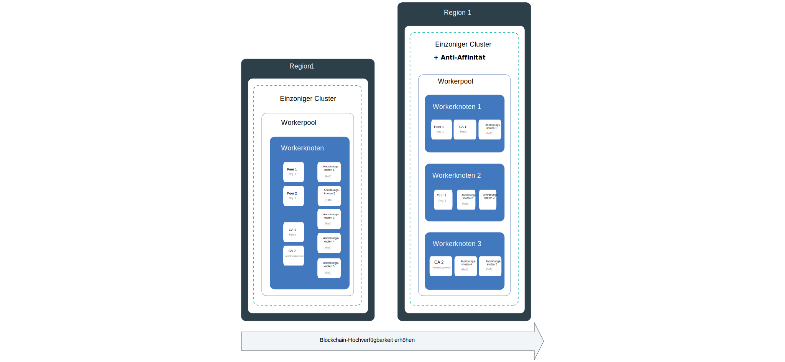
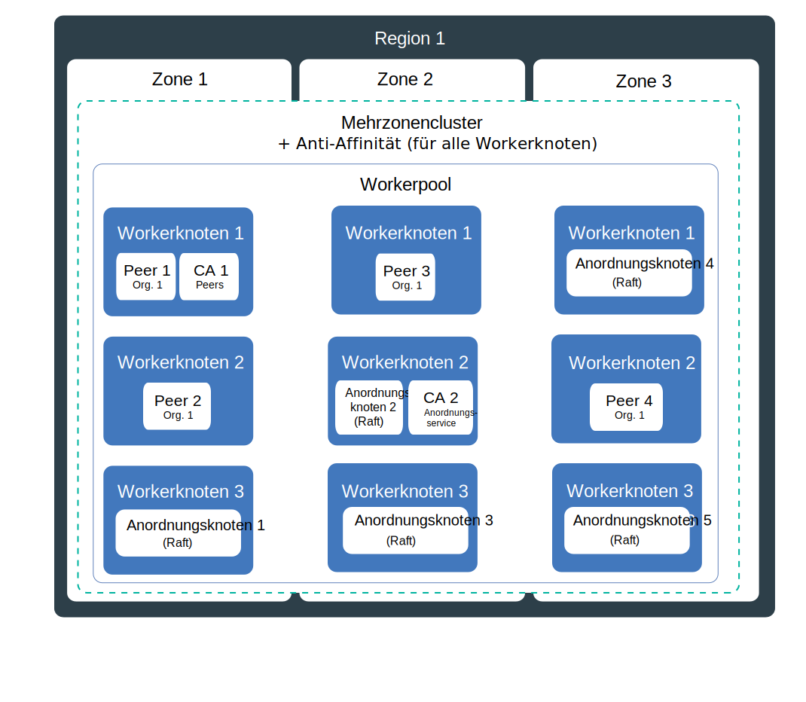
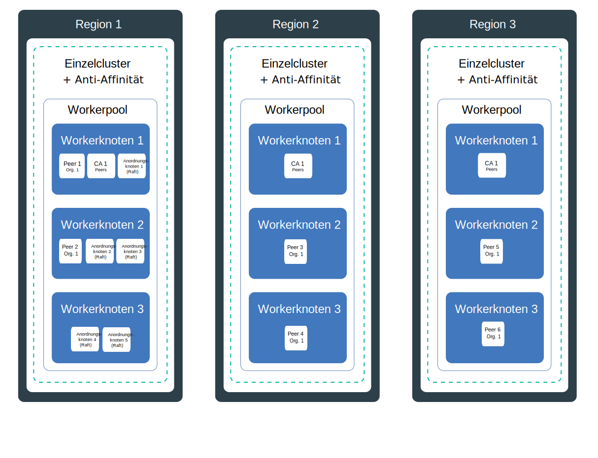

---

copyright:
  years: 2019
lastupdated: "2019-06-21"

keywords: high availability, HA, IBM Cloud, failures, zone failure, region failure, component failure, worker node failure

subcollection: blockchain

---

{:external: target="_blank" .external}
{:shortdesc: .shortdesc}
{:screen: .screen}
{:codeblock: .codeblock}
{:note: .note}
{:important: .important}
{:tip: .tip}
{:pre: .pre}

# Hochverfügbarkeit (High Availability, HA)
{: #ibp-console-ha}

Verwenden Sie die integrierten Kubernetes-Funktionen zusammen mit den Bereitstellungsstrategien für {{site.data.keyword.blockchainfull}} Platform-Komponenten, um eine höhere Verfügbarkeit Ihrer Blockchain-Netze zu erzielen und Ausfallzeiten für Ihr Netz zu vermeiden, falls in Ihrem Cluster eine Störung auftritt.
{:shortdesc}

**Zielgruppe:** Dieser Abschnitt richtet sich an Systemarchitekten und -administratoren, die für die Planung und Konfiguration von {{site.data.keyword.blockchainfull_notm}} unter {{site.data.keyword.cloud_notm}} oder unter {{site.data.keyword.cloud_notm}} Private verantwortlich sind.

Hochverfügbarkeit ist eine zentrale Disziplin in einer IT-Infrastruktur, um Ihre Apps auch nach einem partiellen oder vollständigen Ausfall der Site betriebsbereit zu halten. Der Hauptzweck der Hochverfügbarkeit ist es, potenzielle Fehlerquellen in einer IT-Infrastruktur zu eliminieren. Sie können sich zum Beispiel auf den Ausfall eines Systems vorbereiten, indem Sie Redundanz hinzufügen und Funktionsübernahmemechanismen einrichten.

Sie können Hochverfügbarkeit in verschiedenen Schichten Ihrer IT-Infrastruktur und auf verschiedenen Ebenen in Ihrem Cluster erreichen. Welcher Grad der Verfügbarkeit für Ihre Zwecke erforderlich ist, hängt von verschiedenen Faktoren wie den Geschäftsanforderungen, den bestehenden Service-Level-Agreements mit Ihren Organisationen und den Kosten für die Redundanz ab.

Bevor Sie fortfahren, sollten Sie die plattformspezifischen Hinweise für die Hochverfügbarkeit (HA) überprüfen:
- Wenn Sie {{site.data.keyword.cloud_notm}} verwenden, finden Sie weitere Informationen zur Funktionsweise der HA unter Kubernetes und {{site.data.keyword.cloud_notm}} in diesem Abschnitt zur [Hochverfügbarkeit für {{site.data.keyword.cloud_notm}} Kubernetes Service](/docs/containers?topic=containers-ha){: external}.
- Wenn Sie {{site.data.keyword.cloud_notm}} Private verwenden, lesen Sie die Informationen zur [Implementierung von HA in {{site.data.keyword.cloud_notm}} Private](https://www.ibm.com/cloud/garage/practices/manage/high-availability-ibm-cloud-private){: external}.  

In diesem Abschnitt finden Sie Details zur Hochverfügbarkeit von Blockchain-Netzen und Empfehlungen aus den oben angegebenen plattformspezifischen Themen.

## Übersicht über potenzielle Fehlerquellen in {{site.data.keyword.blockchainfull_notm}} Platform für {{site.data.keyword.cloud_notm}}
{: #ibp-console-ha-points-of-failure}

Die {{site.data.keyword.blockchainfull_notm}} Platform-Architektur ist auf Zuverlässigkeit, kurze Latenzzeiten bei der Verarbeitung und größtmögliche Verfügbarkeitszeit des Service abgestimmt. Fehler können jedoch trotzdem auftreten. {{site.data.keyword.blockchainfull_notm}} Platform bietet mehrere Methoden, um die Verfügbarkeit Ihres Clusters zu erhöhen, indem Richtlinien für Redundanz und [Anti-Affinität](https://www.ibm.com/blogs/cloud-archive/2016/07/ibm-containers-anti-affinity/){: external} hinzugefügt werden (falls verfügbar), um sicherzustellen, dass Blockchain-Komponenten desselben Typs und derselben Organisation auf verschiedenen Workerknoten übergreifend bereitgestellt werden. Durch das Hinzufügen von Redundanz in Ihrem Blockchain-Netz können Sie Störungen oder Ausfallzeiten vermeiden.  

Um maximale Hochverfügbarkeit zu erreichen, empfiehlt sich das Einrichten von Redundanz durch die Bereitstellung von Peers und Anordnungsknoten in Kubernetes-ClusternHochverfügbarkeit in mehreren Regionen. Wenn die Komponenten auf mehrere Regionen verteilt sind und das Blockchain-Ledger ebenfalls auf diese Komponenten verteilt wird, führt eine Störung in einer einzelnen Region nicht zu einer Beeinträchtigung der Transaktionsverarbeitung. Zertifizierungsstellen (CAs) sind nicht von zentraler Bedeutung für die tägliche Transaktionsverarbeitung. Nachdem alle Benutzer bei der CA registriert und eingetragen wurden, wird die CA erst wieder benötigt, wenn diese Services erneut erforderlich sind.

### Hinweise zu Peers
{: #ibp-console-ha-peers}

Die Hochverfügbarkeit (High Availability, HA) für Peers bedeutet, dass redundante Peers bereitgestellt werden müssen. Dies bedeutet, dass für jede Organisation mindestens zwei Peers im selben Kanal erforderlich sind, um Anforderungen von Clientanwendungen zu verarbeiten. Mehrere Peers können entweder auf einem einzelnen Workerknoten bereitgestellt oder auf Workerknoten, Zonen (bei Verwendung von {{site.data.keyword.cloud_notm}}) oder sogar Regionen verteilt werden. Wenn Sie mehrere Peers bereitstellen und zum selben Kanal hinzufügen, agieren die Peers als HA-Paare, da der Kanal und die Daten automatisch auf allen Peers in dem Kanal synchronisiert werden. In einem Blockchain-Netz sollen mehrere Organisationen über dieselben Kanäle Transaktionen ausführen. Daher sieht das gemeinsame Bereitstellungsmodell vor, dass für jeden Kanal redundante Peers für jede Organisation auf mehrere Organisationskonto-Cluster verteilt werden, deren Daten untereinander synchronisiert werden. Für jede Organisation kann ein Peer im eigenen Cluster und in jeder beliebigen Region bereitgestellt werden. 

Für eine noch bessere HA-Abdeckung können Sie mehrere Cluster in mehreren Regionen einrichten und in jedem einzelnen Cluster Peers bereitstellen. Wenn es jedoch auf hohe Leistung ankommt, muss die Verteilung der Peers sorgfältig geplant werden, um sicherzustellen, dass die Latenz und Bandbreite zwischen ihnen entsprechend ausgelegt ist, um die gewünschten Leistungsziele zu erreichen.

**Ankerpeers** in einem Kanal erleichtern die Kommunikation zwischen Organisationen, die zur Unterstützung von privaten Daten, Gossip, und Serviceerkennung erforderlich ist. Wenn in einem Kanal nur ein Ankerpeer vorhanden ist und dieser Peer nicht betriebsbereit ist, sind die Organisationen nicht mehr miteinander verbunden und organisationsübergreifender Gossip-Datenaustausch ist nicht mehr möglich. Beim Erstellen redundanter Peers für eine Organisation müssen Sie daher auch redundante [Ankerpeers im Kanal](/docs/services/blockchain?topic=blockchain-ibp-console-govern#ibp-console-govern-channels-anchor-peers) hinzufügen.

### Hinweise zum Anordnungsservice
{: #ibp-console-ha-ordering-service}

{{site.data.keyword.blockchainfull_notm}} Platform basiert auf Hyperledger Fabric Version 1.4.1, das den Anordnungsservice Raft beinhaltet. Raft ist ein CFT-Anordnungsservice (CFT = Crash Fault Tolerant, fehlertolerant), der auf einer Implementierung des [Raft-Protokolls](https://raft.github.io/raft.pdf){: external} basiert. In diesem Produkt werden die Daten zwischen den Raft-Anordnungsknoten mithilfe von Raft-basiertem Konsens automatisch synchronisiert. In {{site.data.keyword.blockchainfull_notm}} Platform können Netzbediener einer Organisation wahlweise entweder einen einzelnen Raft-basierten Anordnungsknoten ohne HA einrichten oder fünf Anordnungsknoten in einer einzelnen Region, die von Raft automatisch für HA konfiguriert werden.

## Prüfliste für HA
{: #ibp-console-ha-checklist}

Die folgende Tabelle enthält eine Liste der Optionen, die bei der Planung der stufenweisen HA-Maximierung einbezogen werden können.

|  | Einzelknoten | Einzelkluster mit mehreren Knoten | Mehrzonennetz (nur {{site.data.keyword.cloud_notm}}**)| Mehrere regionenübergreifende Cluster |
|-----|-----|-----|-----|-----|
| Redundante Peers |  |  |  |  |
| Anti-Affinität (Peers) |  |  |  | |
| Redundante Ankerpeers in einem Kanal |  |  |  | |
| Raft-Anordnungsservice |  |  |  | |
| Anti-Affinität (Anordnungsknoten) |  |  |  | |
| Entwicklungs- oder Testumgebung |  |  | | |
| Produktionsumgebung | | |  |  |
{: row-headers}
{: class="comparison-table"}
{: caption="Tabelle 1. Vergleich von Bereitstellungsszenarios zur HA-Maximierung im Netz" caption-side="top"}
{: summary="This table has row and column headers. The row headers identify the deployment scenarios. The column headers identify available options in each scenario to increase your HA."}
** Die Standardkonfiguration für einen Kubernetes-Standardcluster in {{site.data.keyword.cloud_notm}} ist ein Cluster mit 4 CPUs x 16 GB RAM, der drei Zonen mit je drei Workerknoten enthält. Sie können nach Bedarf nach oben oder unten skalieren, indem Sie eine größere oder kleinere Konfiguration auswählen.

## Potenzielle Fehlerquellen
{: #ibp-console-ha-points-of-failure}

{{site.data.keyword.blockchainfull_notm}} Platform bietet mehrere Methoden zum Erhöhen der Verfügbarkeit für Ihr Netz durch Hinzufügen von Redundanz und durch die Verwendung von Richtlinien für Anti-Affinität. In den folgenden Diagrammen finden Sie weitere Informationen zu potenziellen Fehlerquellen und ihrer Vermeidung. Wählen Sie je nach Anwendungspriorität, Service-Level und Kostenaufwand ein Modell aus. Als Grundregel können Sie die Redundanz an die gewünschten Service-Level anpassen. Bei allen dargestellten Szenarios muss der Kostenaufwand für die Bereitstellung höherer Ausfallsicherheit abgewogen werden.

### HA für einzelne Region
{: #ibp-console-ha-single-region}




1. **Komponentenfehler**

   **Cluster mit einer Zone**:  

   Wenn Sie eine Blockchain-Komponente (z. B. Peer oder Anordnungsknoten) bereitstellen, wird ein neuer Pod für die Komponente in einem Workerknoten erstellt. Container und Pods sind per Definition Komponenten mit kurzer Lebensdauer, die kurzfristig und unerwartet ausfallen können. Ein Container oder Pod kann zum Beispiel ausfallen, wenn ein Fehler in Ihrer Komponente auftritt. Um den Peer hochverfügbar zum machen, müssen Sie sicherstellen, dass eine ausreichende Anzahl von Instanzen dieses Peers für die Verarbeitung der Workload vorhanden ist, plus zusätzliche Instanzen, die im Falle einer Störung die Verarbeitung übernehmen können.

   **Peers** Wie viele Peers sind erforderlich? In einem Produktionsszenario sollten Sie drei Peers derselben Organisation in jedem Kanal bereitstellen. Dadurch kann der Ausfall eines Peers (z. B. während eines Wartungszyklus) ausgeglichen werden, sodass weiterhin zwei hochverfügbare Peers erhalten bleiben. Zum Kompensieren eines Peer-Ausfalls und für die Basisstufe der Hochverfügbarkeit können Sie Peer-Redundanz erreichen, indem Sie drei Peers pro Organisation in einem Kanal auf Ihrem Workerknoten bereitstellen. Dabei ist zu beachten, dass auf Ihrem Knoten genügend Ressourcen verfügbar sein müssen, um diese Komponenten zu unterstützen.

   **Anordnungsservice** Wie oben angegeben, basiert der HA-Anordnungsservice auf Raft und enthält standardmäßig fünf Anordnungsknoten. Da das System den Verlust von Knoten (einschließlich Führungsknoten) ausgleichen kann, solange die Mehrheit der Anordnungsknoten (das sogenannte “Quorum”) verfügbar ist, wird Raft als “fehlertolerant” (Crash Fault Tolerant, CFT) bezeichnet. Anders ausgedrückt: Wenn ein Kanal fünf Knoten enthält, können zwei Knoten ausfallen (drei Knoten sind weiterhin verfügbar). Wählen Sie beim Bereitstellen eines Anordnungsservice in der Konsole für HA den Service mit fünf Knoten aus.  

   In diesem Szenario werden redundante Peers und Anordnungsknoten auf einem einzelnen Workerknoten als Schutz vor Komponentenfehlern verwendet. Dies bietet jedoch keinen Schutz vor Knotenfehlern. Dieses Szenario eignet sich daher nur für Entwicklungs- und Testzwecke.

2. **Workerknotenfehler**  

   **Cluster mit einer Zone sowie mehreren Workerknoten und Anti-Affinität**:

   Ein Workerknoten ist eine virtuelle Maschine (VM), die auf physischer Hardware ausgeführt wird. Workerknotenfehler umfassen Hardwareausfälle, wie z. B. Ausfälle bei Stromversorgung, Kühlung oder Netzbetrieb, und Probleme auf der VM selbst. Sie können einem Workerknotenfehler vorbeugen, indem Sie beim Bereitstellen Ihres Clusters mehrere Workerknoten einrichten. Wenn Blockchain-Komponenten auf mehrere Workerknoten verteilt sind, kann ein Workerknotenfehler ausgeglichen werden. Beachten Sie, dass der {{site.data.keyword.cloud_notm}} Kubernetes-Service die Option für mehrere Zonen in einem Cluster bietet. {{site.data.keyword.cloud_notm}} Private bietet keine Unterstützung für Zonen.

   **Peers**: Die {{site.data.keyword.blockchainfull_notm}} Platform-Bereitstellungsrichtlinie für Anti-Affinität verteilt redundante Peers (Peers, die derselben Organisation angehören) auf die Workerknoten im zugehörigen Cluster oder in der zugehörigen Zone.

   **Anordnungsservice**: Wenn Sie einen Raft-Anordnungsservice bereitstellen, werden die fünf zugehörigen Anordnungsknoten automatisch auf die Workerknoten in Ihrem Cluster verteilt (gemäß der Richtlinie für Anti-Affinität und je nach Verfügbarkeit der Ressourcen auf den Knoten).  

   In diesem Szenario werden als Schutz vor Knotenfehlern redundante Peers und Anordnungsknoten auf mehrere Workerknoten in einem einzelnen Cluster oder einer einzelnen Zone verteilt. Dies bietet jedoch keinen Schutz vor Cluster- oder Zonenfehlern. Daher wird dieses Szenario nicht für Produktionssysteme empfohlen.

### HA mit mehreren Zonen (nur {{site.data.keyword.cloud_notm}} Kubernetes-Service)
{: #ibp-console-ha-multi-zone}

_Dieses Szenario ist nur für Kunden geeignet, die {{site.data.keyword.cloud_notm}} Kubernetes Service_ verwenden.



   **Zonenfehler**  

   **Cluster mit mehreren Zonen sowie mehreren Workerknoten und Anti-Affinität**:

   Eine Zone ist mit einem Rechenzentrum vergleichbar. Ein Zonenfehler wirkt sich auf alle physischen Rechenhosts und den NFS-Speicher aus. Fehler umfassen Ausfälle bei Stromversorgung, Kühlung, Netzbetrieb oder Speicherausfälle sowie Naturkatastrophen wie Überschwemmungen, Erdbeben und Stürme. Als Schutz vor einem Zonenfehler müssen Cluster in mindestens zwei verschiedenen Zonen vorhanden sein, für die eine Lastausgleichsfunktion konfiguriert ist. Wenn Sie einen Kubernetes-Cluster in {{site.data.keyword.cloud_notm}} bereitstellen, wird in dem Cluster standardmäßig die Unterstützung für drei Zonen konfiguriert (alternativ können Sie die Unterstützung für zwei Zonen auswählen).

   Eine einzelne Zone genügt für eine Entwicklungs- oder Testumgebung, falls ein Zonenfehler toleriert werden kann. Um die Vorteile der Hochverfügbarkeit (HA) mit mehreren Zonen zu nutzen, sollten beim Bereitstellen Ihres Clusters unbedingt mehrere Zonen ausgewählt werden. Zwei Zonen sind zwar besser als eine, für die HA werden jedoch drei Zonen empfohlen. Dies erhöht die Wahrscheinlichkeit, dass die Arbeitslast von den beiden anderen Zonen übernommen werden kann, wenn eine einzelne Zone ausfällt. Wenn redundante Peers derselben Organisation sowie Kanäle und Anordnungsknoten auf mehrere Zonen verteilt sind, beeinträchtigt ein Zonenfehler in einer dieser Zonen in der Regel nicht die Transaktionsverarbeitung im Netz, da die Workload auf die Blockchain-Knoten in den anderen Zonen verlagert wird.

   Der Bereitsteller von {{site.data.keyword.blockchainfull_notm}} Platform kann nicht garantieren, dass Blockchain-Komponenten auf mehrere **Zonen** verteilt werden. Der Bereitsteller implementiert zwar Ressourcen gemäß ihrer Verfügbarkeit auf den Workerknoten in mehreren Zonen, er platziert jedoch nicht standardmäßig zwei Peers derselben Organisation oder die Anordnungsknoten in separaten Zonen.
   {:note}

   In diesem Szenario werden als Schutz für Zonenfehlern redundante Peers und Anordnungsknoten auf mehrere Workerknoten und mehrere Zonen verteilt. Dies schützt jedoch nicht vor dem (eher seltenen) Fall, dass eine ganze Region ausfällt. Das vorliegende Szenario wird für Produktionsnetze empfohlen.

### HA mit mehreren Regionen
{: #ibp-console-ha-multi-region}

Dieses Szenario bietet die maximale erreichbare HA.



   **Ausfall einer Region**

   **Cluster mit mehreren Regionen sowie mehreren Workerknoten und Anti-Affinität**:

   Die Wahrscheinlichkeit eines vollständigen regionalen Ausfalls ist gering. Als Schutz vor einem solchen Ausfall können Sie mehrere Cluster in verschiedenen Regionen einrichten, die jeweils über eine eigene verlinkte Konsole verfügen. Falls eine Region vollständig ausfällt, können redundante Peers im Cluster einer anderen Region die Workload übernehmen. Für Produktionsumgebungen bietet die Bereitstellung der Blockchain-**Peers** in mehreren Regionen die maximale erreichbare HA-Abdeckung.

   In diesem Szenario werden redundante Peers auf mehrere Workernoten in mehreren Regionen verteilt, um die maximale erreichbare HA zu erzielen. Dieses Szenario wird ebenfalls für Produktionsnetze empfohlen, sofern Ihre Anforderungen an die Ausfallsicherheit die zusätzlichen Kosten rechtfertigen.  

   In diesem Abschnitt zum Thema [HA-Bereitstellungen mit mehreren Regionen einrichten](/docs/services/blockchain?topic=blockchain-ibp-console-hadr-mr) finden Sie Schritte zum Konfigurieren Ihrer Peers für {{site.data.keyword.blockchainfull_notm}} Platform in mehreren Regionen.


## Disaster-Recovery (DR)
{: #ibp-console-ha-dr}

Zum Schutz vor Datenverlusten wird generell empfohlen, den zugehörigen Speicher aller bereitgestellten Komponenten regelmäßig zu sichern. Da das Ledger von allen Peers und Anordnungsknoten gemeinsam genutzt wird, sind regelmäßige Backups unverzichtbar. Beispiel: Wenn ein Peer-Ledger beschädigt wird, wird der Fehler auf alle übrigen Peer-Ledger übertragen. In diesem Fall kann das Ledger nur mithilfe einer vorhandenen Sicherung im gesamten Netz wiederhergestellt werden. Legen Sie anhand Ihres Recovery-Bedarfs fest, wie häufig Backups erstellt werden sollen. Als allgemeine Richtlinie wird empfohlen, täglich Backups zu erstellen.  

| Anbieter der Speicherlösung | Hinweise |
|----------|---------|
| {{site.data.keyword.cloud_notm}}-Speicherlösung | Sie können die vom [{{site.data.keyword.cloud_notm}} Kubernetes-Service](/docs/services/RegistryImages/ibm-backup-restore?topic=RegistryImages-ibmbackup_restore_starter#ibmbackup_restore_starter){: external} bereitgestellte Funktionalität nutzen. Dabei ist jedoch zu beachten, dass die Knoten [gestoppt](#ibp-console-ha-stop-nodes) werden müssen, wenn keine Snapshotfunktion verfügbar ist, um eine zuverlässige Sicherung zu gewährleisten. |
| {{site.data.keyword.cloud_notm}} Private-Speicherlösung | Sie können die von Ihrem Speicheranbieter bereitgestellte Technologie für Sicherung und Wiederherstellung verwenden. Stellen Sie auch hierbei sicher, dass die Knoten [gestoppt](#ibp-console-ha-stop-nodes) sind, bevor Sie die Sicherung erstellen. |
| Portworx | Eine [Snapshotfunktion](https://docs.portworx.com/portworx-install-with-kubernetes/cloud/ibm/#prerequisites){: external} zum Erstellen von Backups ohne Stoppen der Knoten ist verfügbar. |
{: caption="Tabelle 2. Sicherungsempfehlungen für den Speicher" caption-side="top"}

Beim Wiederherstellen einer Sicherung muss die Sicherung auf jeder Komponente in Ihrem Netz wiederhergestellt werden.

### Knoten stoppen, um eine Sicherung vorzubereiten
{: #ibp-console-ha-stop-nodes}

Wenn Sie eine andere Speicherlösung als Portworx verwenden, können Sie die Knoten beispielsweise mit dem folgenden Befehl `kubectl` stoppen, bevor die Sicherung erstellt wird:

   ```
   kubectl scale deployment my-deployment --replicas=0
   ```
   {:codeblock}

   Erstellen Sie die Sicherung.
   Starten Sie die Knoten erneut:

   ```
   kubectl scale deployment my-deployment --replicas=1
   ```
   {:codeblock}
