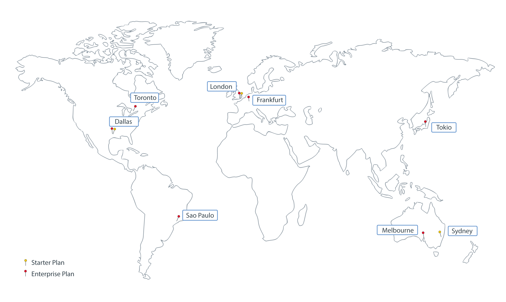

---

copyright:
  years: 2017, 2019
lastupdated: "2019-06-18"

keywords: data centers, IBM Cloud regions, available locations

subcollection: blockchain

---

{:external: target="_blank" .external}
{:shortdesc: .shortdesc}
{:screen: .screen}
{:pre: .pre}
{:table: .aria-labeledby="caption"}
{:codeblock: .codeblock}
{:tip: .tip}
{:download: .download}

# Standorte von {{site.data.keyword.blockchainfull_notm}} Platform
{: #ibp-regions-locations}

{{site.data.keyword.cloud}} wird weltweit an verschiedenen Standorten gehostet. Bei den Standorten handelt es sich um Rechenzentren in einem geografischen Bereich, die über einen Endpunkt zugänglich sind. {{site.data.keyword.blockchainfull_notm}} Platform stellt Blockchain-Netze in {{site.data.keyword.cloud_notm}} global an unterschiedlichen Standorten bereit. Wenn Sie eine {{site.data.keyword.blockchainfull_notm}} Platform-Serviceinstanz in {{site.data.keyword.cloud_notm}} erstellen, werden Blockchain-Netz und Netzressourcen an dem {{site.data.keyword.cloud_notm}}-Standort erstellt, an dem Sie die Serviceinstanz erstellen.
{:shortdesc}

Die {{site.data.keyword.blockchainfull_notm}} Platform-Angebote variieren je nach {{site.data.keyword.cloud_notm}}-Standort. Sie können Blockchain-Netze nur in {{site.data.keyword.cloud_notm}}-Standorten erstellen, in denen Mitgliedschaftspläne für {{site.data.keyword.blockchainfull_notm}} Platform verfügbar sind.

In Tabelle 1 und Abbildung 1 sind die {{site.data.keyword.cloud_notm}}-Regionen und -Standorte zu sehen, die von {{site.data.keyword.blockchainfull_notm}} Platform for {{site.data.keyword.cloud_notm}} unterstützt werden.

Wenn Sie einen kostenlosen {{site.data.keyword.cloud_notm}} Kubernetes-Cluster verwenden wollen, dann wählen Sie für den asiatisch-pazifischen Raum keinen kostenlosen Cluster aus. Andernfalls wird Ihr kostenloser Cluster in Melbourne im asiatisch-pazifischen Raum (Süden) anstatt im asiatisch-pazifischen Raum (Norden) erstellt. Cluster im asiatisch-pazifischen Raum (Süden) können momentan nicht zur Bereitstellung von {{site.data.keyword.blockchainfull_notm}} Platform v2.0 verwendet werden. Wenn Sie die Verwendung eines kostenlosen Clusters planen, dann verwenden Sie als Standort **Vereinigte Staaten (Süden)** oder **Zentraleuropa**.
{: note}

| Region | {{site.data.keyword.cloud_notm}}-Standorte |
|--------|--------------------|
| Vereinigte Staaten (Süden) | San Jose, Sao Paulo, Dallas, Houston |
| Asiatisch-pazifischer Raum (Norden) | Tokio, Chennai, Hongkong, Seoul, Singapur |
| Zentraleuropa | Frankfurt, Amsterdam, Mailand, Oslo, Paris |

_Tabelle 1. Standorte von {{site.data.keyword.blockchainfull_notm}} Platform for {{site.data.keyword.cloud_notm}}_

Standorte von 

In Tabelle 2 und Abbildung 2 sind die {{site.data.keyword.cloud_notm}}-Regionen und -Standorte zu sehen, die von {{site.data.keyword.blockchainfull_notm}} Platform Starter Plan und Enterprise Plan unterstützt werden.

| Standort | Starter Plan | Enterprise Plan |
|--------|----------|----------|
| Dallas | J | J |
| London | J | J |
| Tokio |  | J |
| Frankfurt |  | J |
| Sydney | J |  |
| Melbourne |  | J |
| São Paulo |  | J |
| Toronto |  | J |

_Tabelle 2. Starter Plan- und Enterprise Plan-Standorte_

