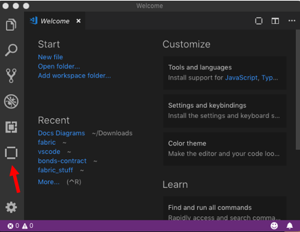

---

copyright:
  years: 2017, 2019
lastupdated: "2019-06-18"

keywords: vs code extension, Visual Studio Code extension, smart contract, development tools

subcollection: blockchain

---

{:shortdesc: .shortdesc}
{:codeblock: .codeblock}
{:screen: .screen}
{:note: .note}
{:important: .important}
{:tip: .tip}
{:pre: .pre}
{:external: target="_blank" .external}

# Smart Contracts mit Visual Studio Code-Erweiterung entwickeln
{: #develop-vscode}

Die {{site.data.keyword.blockchainfull}} Platform-Erweiterung für Visual Studio Code (VS Code) stellt innerhalb von Visual Studio Code eine Umgebung zum Entwickeln, Paketieren und Testen von Smart Contracts zur Verfügung. Sie können die Erweiterung verwenden, um Ihr Smart-Contract-Projekt zu erstellen und die ersten Schritte zur Entwicklung Ihrer Geschäftslogik auszuführen. Anschließend können Sie VS Code verwenden, um Ihren Smart Contract mit einer vorkonfigurierten Instanz von Hyperledger Fabric auf der lokalen Maschine zu testen, bevor Sie den Smart Contract unter {{site.data.keyword.blockchainfull_notm}} Platform bereitstellen. In diesem Lernprogramm wird beschrieben, wie die VS Code-Erweiterung verwendet wird.

  

<!--

<map name="home_map1" id="home_map1">
<area href="/docs/services/blockchain/vscode-extension.html#develop-vscode-creating-a-project" alt="Create a smart contract project" title="Create a Smart contract project" shape="rect" coords="40, 73.2, 175, 128.2" />
<area href="/docs/services/blockchain/vscode-extension.html#develop-vscode-creating-a-project" alt="Develop contract code in VS Code" title="Create key pair" shape="rect" coords="199, 73.2, 334, 128.2" />
<area href="/docs/services/blockchain/vscode-extension.html#packaging-a-smart-contract" alt="Package the smart contract" title="Package the smart contract" shape="rect" coords="358, 73.2, 175, 128.2" />
<area href="/docs/services/blockchain/vscode-extension.html#develop-vscode-deploy" alt="Deploy locally to test and debug" title="Deploy locally to test and debug" shape="rect" coords="358, 73.2, 493, 128.2"/>
<area href="/docs/services/blockchain/vscode-extension.html#develop-vscode-exporting-deleting-smart-contract-package" alt="Export the package" title="Export the package" shape="rect" coords="517, 152.2, 493, 207.2" />
<area href="/docs/services/blockchain/vscode-extension.html#develop-vscode-connecting-ibp" alt="Deploy to {{site.data.keyword.cloud_notm}}" title="Deploy to {{site.data.keyword.cloud_notm}}" shape="rect" coords="700, 73.2, 835, 128.2" />
-->

Die {{site.data.keyword.blockchainfull_notm}} Platform-Erweiterung arbeitet reibungslos mit jeder Instanz von {{site.data.keyword.blockchainfull_notm}} Platform zusammen, die Hyperledger Fabric Version 1.4 oder höher verwendet.
{: note}

## Schritt 1: {{site.data.keyword.blockchainfull_notm}} Platform-Erweiterung für VS Code kostenlos installieren
{: #develop-vscode-install}

Vor der Installation der {{site.data.keyword.blockchainfull_notm}} Platform-Erweiterung für VS Code müssen Sie die geltenden Voraussetzungen erfüllen.

### Voraussetzungen
{: #develop-vscode-prerequisites}

- Derzeit werden die Betriebssysteme Windows 10, Linux und Mac OS unterstützt.l
- [VS Code Version 1.32 oder höher](https://code.visualstudio.com/){: external}.
- [Node Version 8.x oder höher und npm Version 5.x oder höher](https://nodejs.org/en/download/){: external}.
- [Docker Version 17.06.2-ce oder höher](https://www.docker.com/get-started){: external}.
- [Docker Compose Version 1.14.0 oder höher](https://docs.docker.com/compose/install/){: external}.
- [Go Version 1.12 oder höher für die Entwicklung von Go-Verträgen](https://golang.org/dl/){: external}.

Wenn Sie mit Windows arbeiten, müssen Sie außerdem Folgendes sicherstellen:

- Docker for Windows ist für die Verwendung von LINUX-Containern konfiguriert (dies ist die Standardeinstellung).
- Die C++-Build-Tools für Windows aus [windows-build-tools](https://github.com/felixrieseberg/windows-build-tools#windows-build-tools){: external} sind installiert.
- OpenSSL Version 1.0.2 aus [Win32 OpenSSL](http://slproweb.com/products/Win32OpenSSL.html){: external} ist installiert.
  - Installieren Sie die normale Version und nicht die als "light" bezeichnete Version.
  - Installieren Sie die Win32-Version in C:\OpenSSL-Win32 auf 32-Bit-Systemen.
  - Installieren Sie die Win64-Version in C:\OpenSSL-Win64 auf 64-Bit-Systemen.

### Erweiterung installieren
{: #develop-vscode-installing-the-extension}

1. Navigieren Sie zur [Seite mit dem Marktplatz für Visual Studio Code-Erweiterungen](https://marketplace.visualstudio.com/items?itemName=IBMBlockchain.ibm-blockchain-platform){: external} oder suchen Sie in der Visual Studio Code-Anzeige für Erweiterungen nach **{{site.data.keyword.blockchainfull_notm}} Platform**.
2. Klicken Sie auf **Installieren**.
3. Starten Sie Visual Studio Code erneut, um die Installation der Erweiterung vollständig abzuschließen.

Nach der Installation können Sie das Symbol für {{site.data.keyword.blockchainfull_notm}} auf der linken Seite von VS Code verwenden, um die {{site.data.keyword.blockchainfull_notm}} Platform-Anzeige zu öffnen.

Mit der Erweiterung werden auch neue Befehle zur Befehlspalette von Visual Studio Code (VS Code) hinzugefügt. Über die Befehlspalette können Sie zahlreiche Operationen ausführen, die im vorliegenden Leitfaden detailliert erläutert werden.

## Schritt 2: Smart-Contract-Projekt erstellen
{: #develop-vscode-creating-a-project}

Sie können die Erweiterung verwenden, um ein neues Smart-Contract-Projekt in Visual Studio Code zu erstellen. Mit der Erweiterung wird ein grundlegender Smart Contract erstellt, der zur Verwaltung eines Beispielassets in der Sprache Ihrer Wahl dient. Sie können die Struktur des Beispiels als Ausgangspunkt für die Entwicklung einer eigenen Geschäftslogik verwenden. Die Erweiterung stellt alle Abhängigkeiten bereit, die erforderlich sind, um Ihren Smart Contract in einer Instanz von Hyperledger Fabric bereitzustellen.

1. Öffnen Sie die Registerkarte **{{site.data.keyword.blockchainfull_notm}}**. Klicken Sie auf das Überlaufmenü im Teilfenster für die Smart-Contract-Pakete und klicken Sie dann auf **Smart-Contract-Projekt erstellen**.
2. Wählen Sie die Sprache aus, in der Sie einen Smart Contract erstellen möchten. Die momentan verfügbaren Optionen sind "JavaScript", "TypeScript", "Go" und "Java". **Hinweis:** {{site.data.keyword.blockchainfull_notm}} Platform bietet keine Unterstützung für Java-Chaincode.
3. **Wenn Sie "JavaScript" oder "TypeScript" ausgewählt haben**, wählen Sie ein Asset aus, das durch den Beispielvertrag verwaltet werden soll. Beispiel: ***bond***.
4. Erstellen Sie einen Ordner mit dem Namen Ihres Projekts und öffnen Sie ihn.
5. Wählen Sie aus, wie das neue Projekt geöffnet werden soll. Der Projektordner sollte jetzt geöffnet sein.

Wenn das Projekt geöffnet wird, befindet sich im linken Teilfenster des Explorer-Fensters der neue Smart Contract. Die Struktur des Projekts hängt von der Sprache ab, die Sie ausgewählt haben. Jeder Smart Contract enthält jedoch die gleichen Elemente:
- Quellcode des Smart Contract. Wenn Sie die Erstellung eines Smart Contracts in Javascipt oder TypeScript ausgewählt haben, erstellt die Erweiterung einen grundlegenden Smart Contract unter Verwendung von `fabric-contract-api` und eine Reihe von Funktionen, die zur Verwaltung des Beispielassets dienen. Wenn Sie beispielsweise ***bond*** ausgewählt haben, denn stehen die Funktionen `createBond`, `updateBond`, `readBond`, `bondExists` und `deleteBond` zur Verfügung.
- Eine Testdatei.
- Die zugehörigen Smart-Contract-Abhängigkeiten.

## Schritt 3: Smart Contract paketieren
{: #packaging-a-smart-contract}

Ein Smart Contract muss im CDS-Format (`.cds`) paketiert werden, bevor Sie ihn in Ihrem {{site.data.keyword.blockchainfull_notm}} Platform-Netz oder im vorkonfigurierten Hyperledger Fabric-Netz installieren können. Führen Sie die folgenden Schritte aus, um Ihren Smart Contract zu paketieren:

1. Navigieren Sie in Visual Studio Code zur Anzeige **{{site.data.keyword.blockchainfull_notm}} Platform**. Vergewissern Sie sich, dass in der Dateianzeigefunktion ein geöffnetes Smart-Contract-Projekt vorhanden ist.
2. Klicken Sie in der Anzeige **Smart-Contract-Pakete** auf das Überlaufmenü und wählen Sie **Smart-Contract-Projekt paketieren**. Sie werden aufgefordert, den Namen und die Version des Pakets anzugeben.
  - Wenn Sie über ein Smart-Contract-Projekt verfügen, wird es automatisch gepackt und im Teilfenster **Smart-Contract-Pakete** angezeigt.
  - Sind mehrere Smart-Contract-Ordner geöffnet, wird angefragt, für welchen Ordner das Paket erstellt werden soll.
  - Für den Fall, dass keine Smart-Contract-Ordner geöffnet sind, wird eine Fehlernachricht ausgegeben.

### Smart-Contract-Paket exportieren, importieren und löschen
{: #develop-vscode-exporting-deleting-smart-contract-package}

Nachdem Sie ein Smart-Contract-Projekt paketiert haben, können Sie es aus Visual Studio Code exportieren:

1. Klicken Sie in der Anzeige der {{site.data.keyword.blockchainfull_notm}} Platform-Erweiterung mit der rechten Maustaste auf das Smart-Contract-Paket und wählen Sie dann **Paket exportieren** aus.
2. Wählen Sie das Verzeichnis aus, in dem die Datei mit Ihrem Smart-Contract-Paket gespeichert werden soll, und klicken Sie auf **Exportieren**.

Sie können auch ein vorhandenes Smart-Contract-Paket in das Teilfenster für {{site.data.keyword.blockchainfull_notm}} Platform importieren:

1. Klicken Sie in der Anzeige **Smart-Contract-Pakete** auf das Überlaufmenü und wählen Sie **Paket importieren** aus.
2. Navigieren Sie zu dem Smart-Contract-Paket, das Sie importieren möchten, und klicken Sie auf **Importieren**.

Sie können auch auf **Paket löschen** klicken, um das Smart-Contract-Paket aus der Liste der Pakete zu entfernen.

## Schritt 4: Smart Contract in vorkonfiguriertem Hyperledger Fabric-Netz bereitstellen
{: #develop-vscode-deploy}

Sie können Visual Studio Code verwenden, um Ihren Smart Contract in einem vorkonfigurierten Hyperledger Fabric-Netz bereitzustellen, das von der Erweiterung auf Ihrer lokalen Maschine erstellt wird. Dies ermöglicht Ihnen das Installieren, Instanziieren und Testen Ihres Smart Contract, bevor Sie ihn in einem Live-Netz bereitstellen.

### Vorkonfiguriertes Hyperledger Fabric-Netz bereitstellen
{: #develop-vscode-connecting-and-disconnecting}

Führen Sie die folgenden Schritte aus, um das vorkonfigurierte Netz bereitzustellen:

1. Vergewissern Sie sich, dass auf Ihrer Maschine Docker ausgeführt wird.
2. Öffnen Sie in Visual Studio Code die Registerkarte für **{{site.data.keyword.blockchainfull_notm}} Platform**.
3. Klicken Sie im Teilfenster **Operationen für lokale Fabric** auf **Laufzeit der lokalen Fabric**. Falls Docker aktiv ist, sollte die lokale Hyperledger Fabric-Instanz heruntergeladen und gestartet werden.
4. Doppelklicken Sie im Teilfenster **Fabric-Gateways** auf **local_fabric**, um eine Verbindung zum lokalen Netz herzustellen. Standardmäßig verwendet die Verbindung die Administratoridentität, die im Teilfenster für die Fabric-Wallets angegeben ist. Sie können eine neue Identität erstellen, indem Sie mit der rechten Maustaste auf den Knoten der Zertifizierungsstelle im Teilfenster **Operationen für lokale Fabric** klicken. Diese neue Identität kann dann zu einer Wallet hinzugefügt werden und der Verbindung für **local_fabric** zugeordnet werden.

Die VS Code-Erweiterung erstellt ein grundlegendes Fabric-Netz, das einen Anordnungsknoten, einen Peer und eine Zertifizierungsstelle umfasst. Der Peer ist einem Kanal mit dem Namen `mychannel` zugeordnet. Die Liste der Knoten, Organisationen und Kanäle, die zu dem Netz gehören, werden im Teilfenster **Operationen für lokale Fabric** aufgeführt. Über diesen Knoten befindet sich die Liste der Smart Contracts, die installiert und instanziiert wurden.

### Vorkonfiguriertes Netz stoppen, erneut starten und entfernen
{: #develop-vscode-stop-Fabric-runtime}

Nachdem Sie das vorkonfigurierte Netz erstellt haben, können Sie es stoppen oder erneut starten:

1. Klicken Sie im Teilfenster **Operationen für lokale Fabric** auf das Überlaufmenü.
2. Wählen Sie **Fabric-Laufzeit erneut starten** oder **Fabric-Laufzeit stoppen** aus, um den Container erneut zu starten oder zu stoppen.

Die Verbindungsdetails werden in einem Verzeichnis namens **local_fabric** gespeichert, das in Ihrem aktuellen Projektverzeichnis enthalten ist. Sie können auch **Fabric-Laufzeit umrüsten** auswählen, um das lokale Fabric-Netz vollständig zu entfernen. **Hinweis:** Durch diese Entfernung gehen die Ledgerdaten und die Daten für den World-Status verloren.

### Smart Contract im vorkonfigurierten Netz bereitstellen
{: #develop-vscode-deploy-smart-contract}

Sie können alle Pakete im Teilfenster **Smart-Contract-Pakete** in einem aktiven vorkonfigurierten Netz bereitstellen.

Zuerst müssen Sie den Smart Contract auf einem Peer installieren:

1. Klicken Sie im Teilfenster **Operationen für lokale Fabric** auf **Smart Contract installieren**.
2. Wählen Sie den Peer aus, auf dem der Smart Contract installiert werden soll.
3. Wählen Sie das Smart-Contract-Paket aus, das Sie installieren möchten, und klicken Sie auf **Installieren**.

Als Nächstes können Sie den Smart Contract auf einem Kanal instanziieren:

1. Klicken Sie im Teilfenster **Operationen für lokale Fabric** auf **Smart Contract instanziieren**.
2. Wählen Sie den installierten Smart Contract aus, der instanziiert werden soll.
3. (Optional) Geben Sie den Namen der Instanzerstellungsfunktion in Ihrem Smart Contract ein. Wenn Sie die Standardvorlage für Smart Contracts verwendet haben, dann wird die Instanzerstellungsfunktion nicht verwendet.
4. (Optional) Geben Sie alle Argumente ein, die für Ihre Instanzerstellungsfunktion benötigt werden.
5. (Optional) Navigieren Sie zu Ihrer Konfigurationsdatei für Datensammlungen, wenn Ihr Smart Contract mit privaten Daten arbeitet.
6. Klicken Sie auf **Instanziieren**.

Wenn Sie Änderungen am Code Ihres Smart Contract vornehmen und ihn erneut paketieren, dann können Sie für den instanziierten Smart Contract ein Upgrade durchführen, um eine neuere Version im Netz bereitzustellen:

1. Vergewissern Sie sich, dass der Smart Contract, für den ein Upgrade durchgeführt werden soll, instanziiert wurde.
2. Installieren Sie die neue Version des Smart Contracts auf einem Peer in demselben Netz.
3. Klicken Sie mit der rechten Maustaste auf den instanziierten Smart Contract und wählen Sie die Option **Upgrade für Smart Contract durchführen** aus.
4. (Optional) Führen Sie eine Transaktion aus, nachdem der neue Smart Contract instanziiert wurde.

### Mit Smart Contract interagieren
{: #develop-vscode-submitting-transactions}

Nachdem ein Smart Contract installiert und instanziiert wurde, können Sie über das Teilfenster **Fabric-Gateways** Transaktionen an die Funktionen in Ihrem Smart Contract übergeben:

1. Vergewissern Sie sich, dass der Smart Contract installiert und instanziiert wurde und dass Sie mit dem Netz verbunden sind.
2. Erweitern Sie in der Anzeige **Fabric-Gateways** das Element **Instanziierte Smart Contracts**.
3. Erweitern Sie den Smart Contract, mit dem Sie interagieren möchten. Die Liste der Transaktionen, die unter Ihrem Smart Contract aufgeführt ist, wird angezeigt.
4. Klicken Sie mit der rechten Maustaste auf die zu übergebende Transaktion und wählen Sie die Option **Transaktion übergeben** aus. Wenn Sie beispielsweise das Smart-Contract-Beispiel für Wertpapiere ("Bonds") erstellt und paketiert haben, dann klicken Sie auf **createBond**.
5. Geben Sie alle von der Transaktion benötigten Argumente ein und drücken Sie die **Eingabetaste**. Geben Sie z. B. `["bond01","100"]` ein, um das erste Wertpapier zu erstellen.

### Anwendungen mit vorkonfiguriertem Netz verbinden
{: #develop-vscode-exploring-connection-details}

Sie können Ihre Clientanwendungen testen, indem Sie sie mit dem vorkonfigurierten Netz verbinden und Transaktionen an Ihren Smart Contract übergeben.

Zuerst müssen Sie Ihr Verbindungsprofil exportieren:

1. Starten Sie das Netz und erweitern Sie die Ansicht für **Knoten** im Teilfenster **Operationen für lokale Fabric**.
2. Klicken Sie mit der rechten Maustaste auf den Peer und wählen Sie dann **Verbindungsprofil exportieren** aus.

Anschließend können Sie die Fabric-SDKs und das Verbindungsprofil benutzen, um Ihre Administratoridentität mit dem Benutzernamen `admin` und dem Kennwort `adminpw` einzutragen. Anschließend können Sie diese Identität verwenden, um Ihren Smart Contract aufzurufen oder weitere Benutzer zu registrieren und einzutragen.

## Schritt 5: Smart Contracts im Entwicklungsmodus debuggen
{: #develop-vscode-development-mode}

Sie können das vorkonfigurierte Netz im **Entwicklungsmodus** ausführen, um Ihre Smart Contracts auf dem lokalen System iterativ zu entwickeln und zu debuggen, ohne dass die Smart Contracts nach jeder Änderung neu paketiert und aktualisiert werden müssen. Beim Debugging für einen Smart Contract können Sie die Transaktionen des Smart Contracts mit Unterbrechungspunkten und Ausgabe durchlaufen und sich vergewissern, dass die Transaktionen wie beabsichtigt funktionieren.

Führen Sie die folgenden Schritte aus, um den Entwicklungsmodus im vorkonfigurierten Netz zu aktivieren:

1. Nachdem das Netz gestartet wurde, erweitern Sie im Teilfenster **Operationen für lokale Fabric** den Abschnitt **Knoten**.
2. Klicken Sie mit der rechten Maustaste auf den Peer und wählen Sie dann **Entwicklungsmodus ein-/ausschalten** aus.

Beim normalen Betrieb wird durch einen Peer ein Chaincode-Container erstellt und verwaltet, um instanziierte Smart Contracts auszuführen. Ein Wechsel in den Entwicklungsmodus bewirkt, dass der Peer die manuelle Ausführung des Chaincode-Containers zulässt. Dadurch können Sie Aktualisierungen in Ihrem Smart Contract über die VS Code-Anzeige **Debug** direkt im aktiven Netz bereitstellen.

1. Stellen Sie sicher, dass die Verbindung für **local_fabric** im Entwicklungsmodus besteht.
2. Öffnen Sie Ihr Smart-Contract-Projekt.
3. Öffnen Sie die Anzeige **Debug** in Visual Studio Code über die linke Navigationsleiste.
4. Wählen Sie in der Dropdown-Liste oben links **Smart-Contract-Konfiguration debuggen** aus.
5. Erstellen Sie das Smart-Contract-Paket und installieren Sie den Smart Contract, indem Sie auf die Schaltfläche für die **Wiedergabe** klicken.
6. Fügen Sie Unterbrechungspunkte zum Smart Contract hinzu, indem Sie in den Smart-Contract-Dateien auf die entsprechenden Zeilennummern klicken.
7. Klicken Sie in der Debug-Symbolleiste auf die Schaltfläche **Blockchain**, um den Smart Contract zu instanziieren.
8. Klicken Sie in der Debug-Symbolleiste auf die Schaltfläche **Blockchain**, um Transaktionen zu übergeben oder zu bewerten.

Um während des Debugvorgangs Änderungen am Smart Contract vorzunehmen, klicken Sie auf die Schaltfläche **Erneut starten**, nachdem Sie den Smart Contract geändert haben. Durch das erneute Starten des Debuggings müssen Sie den Smart Contract nicht noch einmal instanziieren.

## Schritt 6: Instanziierten Smart Contract testen
{: #develop-vscode-testing-instantiated-smart-contract}

Sie können Tests für Smart Contracts generieren, die in den Netzen instanziiert werden, zu denen Sie eine Verbindung herstellen. Die Tests können entweder in **JavaScript** oder in **TypeScript** generiert, ausgeführt oder einer Fehlerbehebung unterzogen werden.

1. Vergewissern Sie sich, dass der Smart Contract instanziiert wurde.
2. Klicken Sie in der Anzeige **Fabric-Gateways** mit der rechten Maustaste auf den Smart Contract unter der Liste der Kanäle, für die Tests generiert werden sollen.
3. Wählen Sie die Option **Tests für Smart Contract generieren** aus.
4. Wählen Sie die Sprache für die Testdatei aus (entweder **JavaScript** oder **TypeScript**). Die {{site.data.keyword.blockchainfull_notm}} Platform-Erweiterung installiert daraufhin erforderliche npm-Module und erstellt die Testdatei.

Nachdem die Testdatei erstellt wurde, können Sie die Tests ausführen, indem Sie in der Datei auf die Schaltfläche zum **Ausführen der Tests** klicken.

## Schritt 7: Verbindung zum {{site.data.keyword.blockchainfull_notm}} Platform-Netz herstellen
{: #develop-vscode-connecting-ibp}

Sie können die Erweiterung auch verwenden, um eine Verbindung zu {{site.data.keyword.blockchainfull_notm}} Platform herzustellen, das unter {{site.data.keyword.cloud_notm}} oder {{site.data.keyword.cloud_notm}} Private ausgeführt wird, und alle installierten und instanziierten Smart Contracts über die Benutzerschnittstelle der {{site.data.keyword.blockchainfull_notm}} Platform-Konsole aufzurufen.

Öffnen Sie die {{site.data.keyword.blockchainfull_notm}} Platform-Konsole, die Ihrer Instanz von {{site.data.keyword.blockchainfull_notm}} Platform zugeordnet ist. Navigieren Sie zur Registerkarte **Smart Contracts**. Verwenden Sie die Tabelle mit den **instanziierten Smart Contracts** auf der Registerkarte "Smart Contracts", um Ihr [Verbindungsprofil](/docs/services/blockchain/howto?topic=blockchain-ibp-console-app#ibp-console-app-profile) in das lokale Dateisystem herunterzuladen. Anschließend müssen Sie eine [Anwendungsidentität erstellen](/docs/services/blockchain/howto?topic=blockchain-ibp-console-app#ibp-console-app-identities). Verwenden Sie hierzu Ihre Zertifizierungsstelle und speichern Sie die Eintragungs-ID und den geheimen Schlüssel. Führen Sie die folgenden Schritte aus, um über Visual Studio Code eine Verbindung zu {{site.data.keyword.blockchainfull_notm}} Platform herzustellen.

1. Öffnen Sie die Registerkarte **{{site.data.keyword.blockchainfull_notm}} Platform**.
2. Klicken Sie im Teilfenster **Fabric-Gateways** auf das Pluszeichen (**+**).
3. Geben Sie einen Namen für die Verbindung ein.
4. Geben Sie den vollständig qualifizierten Dateipfad Ihres Verbindungsprofils ein. Ihre Verbindung sollte jetzt in der Verbindungsliste unter **local_fabric** angezeigt werden.
5. Klicken Sie im Teilfenster **Fabric-Wallets** auf das Pluszeichen (**+**).
6. Wählen Sie unter den verfügbaren Optionen **Neue Wallet erstellen und Identität hinzufügen** aus. Geben Sie einen Namen für Ihre Wallet und Ihre Identität an.
7. Geben Sie die MSP-ID Ihrer Organisation ein.
8. Wählen Sie die Option **Gateway auswählen und Eintragungs-ID und geheimen Schlüssel angeben** und dann das Gateway aus, das Sie oben erstellt haben.
9. Geben Sie die Eintragungs-ID und den geheimen Schlüssel der Anwendungsidentität ein, die Sie mit der Konsole erstellt haben. Im Teilfenster **Fabric-Wallets** wird eine neue Identität erstellt.
10. Sie können nun eine Verbindung zu Ihrer Instanz des {{site.data.keyword.blockchainfull_notm}} Platform-Netzes herstellen. Doppelklicken Sie auf den Verbindungsnamen und wählen Sie den Namen der Wallet aus, die Sie soeben erstellt haben. Sie können die von Ihnen erstellte Wallet auch dem Gateway zuordnen. Klicken Sie hierzu mit der rechten Maustaste auf das Gateway und wählen Sie dann **Wallet zuordnen** aus. Auf diese Weise kann die Verbindung bei jedem Verbindungsvorgang die gleiche Wallet verwenden.

Nachdem Sie über Visual Studio Code eine Verbindung zu {{site.data.keyword.blockchainfull_notm}} Platform hergestellt haben, wird die Liste der Kanäle, denen die Peers Ihrer Organisation beigetreten sind, unter dem Gateway angezeigt. Unter jedem Kanal können Sie die Liste der Smart Contracts, die auf den einzelnen Kanälen instanziiert werden, und die Funktionen in jedem Smart Contract anzeigen. Sie können Transaktionen an Ihr Netz übergeben, indem Sie mit der rechten Maustaste auf eine Funktion klicken und dann **Transaktion übergeben** auswählen und die erforderlichen Argumente übergeben. Sie können auch eine Testdatei für die Smart Contracts generieren, die auf Ihren Kanälen instanziiert werden.

### Wallets und Benutzer hinzufügen
{: #develop-vscode-add-a-wallet}

Führen Sie die folgenden Schritte aus, um eine neue Wallet mithilfe eines Zertifikats und eines privaten Schlüssels zu erstellen:

1. Klicken Sie im Teilfenster **Fabric-Wallets** auf das Pluszeichen (**+**).
2. Wählen Sie unter den verfügbaren Optionen **Neue Wallet erstellen und Identität hinzufügen** aus. Geben Sie einen Namen für Ihre Wallet und Ihre Identität an.
3. Geben Sie die MSP-ID Ihrer Organisation ein.
4. Wählen Sie die Option zum Hinzufügen eines Zertifikats und eines privaten Schlüssels aus.
5. Wenn Sie ein Zertifikat und einen privaten Schlüssel verwenden, suchen Sie nach diesem Zertifikat und dem privaten Schlüssel.

Zu den bereits erstellten Wallets können auch neue Benutzer hinzugefügt werden:

1. Klicken Sie im Teilfenster **Fabric-Wallets** mit der rechten Maustaste auf eine Wallet und wählen Sie dann **Identität hinzufügen** aus.
2. Geben Sie einen Namen für die Identität und eine MSP-ID an.
3. Wählen Sie entweder ein Zertifikat und einen privaten Schlüssel oder eine Eintragungs-ID und einen geheimen Schlüssel aus.
4. Wenn Sie ein Zertifikat und einen privaten Schlüssel verwenden, suchen Sie nach diesem Zertifikat und dem privaten Schlüssel.
5. Wenn Sie eine Eintragungs-ID und einen geheimen Schlüssel verwenden, wählen Sie das Gateway aus, bei dem die Eintragung erfolgen soll, und geben Sie die Eintragungs-ID und den geheimen Schlüssel ein.

### Verbindungen bearbeiten, trennen und löschen
{: #develop-vscode-editing-connection}

Klicken Sie über die Erweiterung unten links mit der rechten Maustaste auf eine Verbindung, um ein Kontextmenü mit den Optionen zum Hinzufügen einer Identität, zum Bearbeiten einer Verbindung oder zum Löschen einer Verbindung zu öffnen.

Führen Sie die folgenden Schritte aus, um eine Verbindung zu bearbeiten:
1. Wählen Sie die Option **Verbindung bearbeiten** aus. Daraufhin wird die Seite **Benutzereinstellungen** geöffnet, auf der die Verbindungsdetails hervorgehoben dargestellt werden.
2. Nehmen Sie die erforderlichen Änderungen vor und speichern Sie die Seite mit den Einstellungen.

Wenn Sie bereit sind, die Verbindung zum Netz zu trennen, klicken Sie auf das Symbol **Verbindung trennen** oben rechts im Teilfenster **Fabric-Gateways**.

Wenn Sie eine Verbindung löschen möchten, klicken Sie mit der rechten Maustaste auf die Verbindung und wählen Sie **Gateway löschen** aus.
