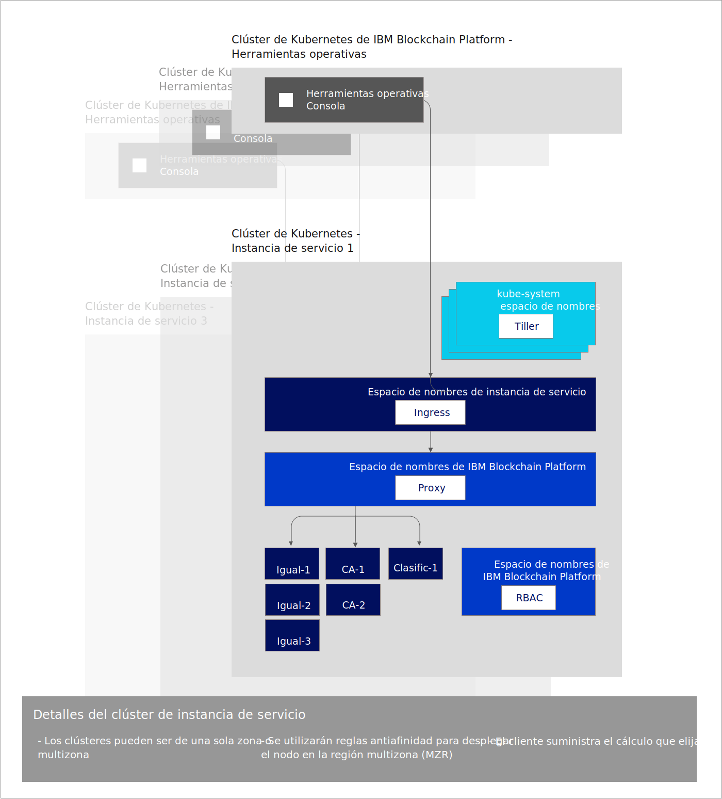

---

copyright:
  years: 2019
lastupdated: "2019-05-31"

keywords: key features, build, operate, grow, architecture, multizone clusters

subcollection: blockchain

---

{:external: target="_blank" .external}
{:shortdesc: .shortdesc}
{:screen: .screen}
{:codeblock: .codeblock}
{:note: .note}
{:important: .important}
{:tip: .tip}
{:pre: .pre}

# Acerca de {{site.data.keyword.blockchainfull_notm}} Platform for {{site.data.keyword.cloud_notm}}
{: #ibp-console-overview}

{{site.data.keyword.blockchainfull}} Platform for {{site.data.keyword.cloud_notm}} es la siguiente generación de ofertas de {{site.data.keyword.blockchainfull_notm}} Platform, que le ofrecen un control total sobre sus despliegues, certificados y claves privadas. Se incluye la nueva consola de {{site.data.keyword.blockchainfull_notm}} Platform, una interfaz de usuario que puede simplificar y acelerar el proceso de despliegue de componentes en un servicio Kubernetes de {{site.data.keyword.cloud_notm}} gestionado y controlado por usted. Para obtener más información sobre Kubernetes y sobre el servicio Kubernetes de {{site.data.keyword.cloud_notm}}, consulte el apartado sobre [Kubernetes](/docs/services/blockchain/reference/k8s.html).
{:shortdesc}

{{site.data.keyword.blockchainfull_notm}} Platform for {{site.data.keyword.cloud_notm}} se basa en Hyperledger Fabric 1.4.1. Para obtener más información sobre las nuevas prestaciones de Hyperledger Fabric 1.4.1, consulte [Novedades de 1.4](https://hyperledger-fabric.readthedocs.io/en/release-1.4/whatsnew.html){: external}.

## Lo que ofrece el nuevo release
{: #ibp-console-overview-capabilities}

Este último release se adapta a los usuarios experimentados de {{site.data.keyword.blockchainfull_notm}} e Hyperledger Fabric y les permite alojar redes o crear nuevas organizaciones que pueden unirse a otras redes de {{site.data.keyword.blockchainfull_notm}}. Si es cliente de un Plan inicial o de empresa, en lugar de que {{site.data.keyword.IBM_notm}} gestione la red, ahora tiene un control total con capacidad para suministrar, supervisar y gestionar los componentes dentro del clúster Kubernetes.

Este release de {{site.data.keyword.blockchainfull_notm}} Platform incluye las siguientes características principales:

**CREAR ---- Experiencia integrada del desarrollador**
- **Codifique fácilmente** sus contratos inteligentes en Node.js, Golang o Java, escriba aplicaciones cliente con la nueva extensión de VS Code de {{site.data.keyword.blockchainfull_notm}}, aproveche la **integración de SDK** con la consola y aprenda con nuestras completas guías de aprendizaje y ejemplos.
- **DevOps simplificado** le permite pasar de la fase de desarrollo a la de prueba y producción en un solo entorno mediante la ampliación de los recursos de Kubernetes para añadir más componentes.
- **Características principales de Fabric actualizadas**. Aproveche las características más recientes de Hyperledger Fabric v1.4.1:
  -  [Servicio de ordenación Raft](https://hyperledger-fabric.readthedocs.io/en/release-1.4/orderer/ordering_service.html#raft){: external}
  - **Integración del servicio {{site.data.keyword.cloud_notm}}.** Aproveche los servicios incorporados en {{site.data.keyword.cloud_notm}}, como el panel de control del servicio {{site.data.keyword.cloud_notm}} Kubernetes, {{site.data.keyword.IBM_notm}} Log Analysis con LogDNA e {{site.data.keyword.cloud_notm}} Identity and Access Management (IAM).
  - [Recopilaciones de **datos privados**](/docs/services/blockchain/howto/ibp-console-smart-contracts.html#ibp-console-smart-contracts-private-data) que mejoran la privacidad de los datos al garantizar que los datos del libro mayor solo se comparten entre iguales autorizados mediante el protocolo gossip.
  - [Service Discovery](https://hyperledger-fabric.readthedocs.io/en/release-1.4/discovery-overview.html){: external}, que le permite descubrir y actualizar de forma dinámica la forma en que la aplicación interactúa con la red.
  - [Listas de control de acceso de canal](https://hyperledger-fabric.readthedocs.io/en/release-1.4/access_control.html){: external}, que le ofrecen un control adicional sobre los canales y los contratos inteligentes.

**OPERAR --- Control total de los despliegues**
- **Despliegue solo los componentes que necesite**. Conecte un igual a varios canales y redes, o aloje un servicio de ordenación al que pueden conectarse los socios de la empresa.
- **Mantenga un control completo de sus identidades**. Almacene y gestione las claves que se utilizan para administrar los nodos sin almacenar las claves privadas en {{site.data.keyword.cloud_notm}}.
- **Operación centralizada**. La consola de {{site.data.keyword.blockchainfull_notm}} Platform le permite desplegar y gestionar todas las organizaciones y nodos en **una consola central** sin tener que depender de {{site.data.keyword.IBM_notm}} ni de otros proveedores para gestionar los clasificadores o la entidad emisora de certificados. También puede añadir o eliminar miembros de un consorcio de blockchain, crear y unir canales e instalar y crear instancias de contratos inteligentes desde la consola.
- **Aloje o únase a una red**. Despliegue iguales alojados en el clúster en varios canales en varias nubes, o invite a otras organizaciones a unirse a su consorcio o canales mientras las organizaciones gestionan sus nodos de forma independiente entre infraestructuras.
- **Gestione el acceso** de los usuarios que pueden administrar o supervisar los nodos.
- **Acceso directo a los registros** de los nodos desde el servicio Kubernetes de {{site.data.keyword.IBM_notm}}. Utilice el servicio {{site.data.keyword.cloud_notm}} Log Analysis o un servicio de terceros para extraer y analizar los registros.
- **Interactúe directamente con los pods** mediante el panel de control de Kubernetes. Emita mandatos exec en los pods y contenedores para ejecutar mandatos y actualizar certificados desde la línea de mandatos.
- **Recopilación de firmas dinámica**, que le permite un mejor control sobre la gestión de la colaboración a través de configuraciones de canal.

**CRECER --- Escalabilidad y flexibilidad**
- **Elija su capacidad de cálculo**. Tiene flexibilidad para decidir la cantidad de CPU, de memoria y de almacenamiento que desea suministrar en el clúster de Kubernetes. Para obtener más información, consulte [Cómo interactúa el servicio {{site.data.keyword.cloud_notm}} Kubernetes con la consola](/docs/services/blockchain/howto/ibp-console-govern.html#ibp-console-govern-iks-console-interaction).
- **Escale** al alza o a la baja los recursos del clúster de Kubernetes y pague solo lo que necesite. Para obtener más información, consulte [Tarifas](/docs/services/blockchain/howto/pricing.html#ibp-pricing).
- **Recuperación tras desastre y alta disponibilidad en varias regiones.** Esta opción duplica el despliegue de Kubernetes entre regiones, ofreciendo alta disponibilidad (HA) de sus componentes y recuperación tras desastre (DR).
- **Ejecución en cualquier lugar** (instrucciones próximamente). Gracias al **código base unificado** de la consola de {{site.data.keyword.blockchainfull_notm}} Platform, es posible ejecutar los componentes en {{site.data.keyword.cloud_notm}}, {{site.data.keyword.cloud_notm}} Private y en nubes públicas de terceros.

Consulte este [blog](https://www.ibm.com/blogs/blockchain/2019/02/taking-the-next-step-towards-deploying-blockchain-anywhere){: external} para seguir el siguiente paso del despliegue de blockchain para la empresa en cualquier sitio.

Esta oferta está pensada para usuarios experimentados de Fabric que deseen crear y gestionar sus propias redes.

## Consideraciones
{: #ibp-console-overview-considerations}

Antes de desplegar la consola, asegúrese de que comprende las consideraciones siguientes:

- Debido a que la disponibilidad de la prueba beta y el release de disponibilidad general (GA) de {{site.data.keyword.blockchainfull_notm}} Platform se van a solapar, es importante que se asegure de conocer qué versión de {{site.data.keyword.blockchainfull_notm}} Platform utiliza. Las nuevas características y arreglos no se incluirán en la beta, pero estarán disponibles en la versión de disponibilidad general de {{site.data.keyword.blockchainfull_notm}} Platform. Como resultado, si utiliza la versión beta de {{site.data.keyword.blockchainfull_notm}} Platform, es probable que algunos paneles de la consola no coincidan con los de la documentación actual, que se mantiene actualizada con la instancia de servicio de disponibilidad general. Para obtener las ventajas de todas las funciones más recientes, se recomienda que suministre una nueva instancia de servicio de disponibilidad general. Para aprender a hacer esto, consulte [Iniciación a {{site.data.keyword.blockchainfull_notm}} Platform for {{site.data.keyword.cloud_notm}}](/docs/services/blockchain/howto/ibp-v2-deploy-iks.html#ibp-v2-deploy-iks).
- Todos los iguales desplegados con este release utilizan CouchDB como base de datos de estado.
- El usuario es responsable de gestionar la supervisión del estado, la seguridad y el registro del clúster de Kubernetes. Consulte esta [información](https://cloud.ibm.com/docs/containers/cs_responsibilities.html#your-responsibilities-by-using-ibm-cloud-kubernetes-service){: external} para ver detalles sobre lo que gestiona {{site.data.keyword.cloud_notm}} y lo que es responsabilidad del usuario.
- También es responsable de supervisar el uso de recursos del clúster Kubernetes. Para supervisar los recursos de Kubernetes, recomendamos utilizar la herramienta [{{site.data.keyword.cloud_notm}} SysDig](https://www.ibm.com/cloud/sysdig){: external} junto con el panel de control de Kubernetes de {{site.data.keyword.cloud_notm}}. Si tiene que aumentar la capacidad de almacenamiento o el rendimiento del clúster, consulte esta información sobre cómo [modificar un volumen existente](https://cloud.ibm.com/docs/containers/cs_storage_file.html#change_storage_configuration){: external}.
- Es responsable de gestionar y proteger sus certificados y sus claves privadas. {{site.data.keyword.IBM_notm}} no almacena los certificados en el clúster de Kubernetes ni en la consola. Solo se conservan en el almacenamiento local del navegador. Si cambia de navegador, tendrá que importar las identidades creadas en dicho navegador.
- {{site.data.keyword.blockchainfull_notm}} Platform está disponible en diversas regiones. Consulte este tema sobre [Ubicaciones de {{site.data.keyword.blockchainfull_notm}} Platform](/docs/services/blockchain/howto?topic=blockchain-ibp-regions-locations) para ver una lista actualizada.
- Kubernetes debe tener la versión estable 1.11 o superior en el clúster de Kubernetes de {{site.data.keyword.cloud_notm}}. Utilice estas instrucciones para [actualizar los clústeres nuevos y existentes](/docs/services/blockchain/howto/ibp-v2-deploy-iks.html#ibp-v2-deploy-iks-updating-kubernetes) a esta versión.
- Si no desea utilizar el almacenamiento de archivos de nivel bronce predeterminado preseleccionado automáticamente al suministrar un clúster de Kubernetes en {{site.data.keyword.cloud_notm}}, puede suministrar el almacenamiento que elija. Consulte este tema sobre [Consideraciones sobre el almacenamiento persistente](/docs/services/blockchain?topic=blockchain-ibp-v2-deploy-iks#ibp-console-storage) para obtener más información.
- Si decide incluir el soporte multizona de {{site.data.keyword.cloud_notm}} en el clúster de Kubernetes, debe suministrar su propio almacenamiento. Consulte [Utilización de clústeres multizona (MZR) con {{site.data.keyword.blockchainfull_notm}} Platform](/docs/services/blockchain?topic=blockchain-ibp-v2-deploy-iks#ibp-console-mzr) para obtener más detalles.
- Puede obtener una vista previa de {{site.data.keyword.blockchainfull_notm}} Platform sin coste alguno durante 30 días al enlazar su instancia de servicio de {{site.data.keyword.blockchainfull_notm}} Platform con un clúster Kubernetes gratuito de {{site.data.keyword.cloud_notm}}.  El rendimiento estará limitado por el uso, almacenamiento y funcionalidad. {{site.data.keyword.cloud_notm}} suprimirá el clúster después de 30 días y no se podrán migrar los nodos ni los datos de un clúster gratuito a un clúster de pago. Aunque la prueba beta de {{site.data.keyword.blockchainfull_notm}} Platform es gratuita, si elige un clúster Kubernetes de pago en lugar del clúster gratuito limitado, incurrirá en cargos debidos al servicio Kubernetes en su cuenta de {{site.data.keyword.cloud_notm}}.

## Migración
{: #ibp-console-overview-migration}

Actualmente, no es posible migrar de ninguna oferta de {{site.data.keyword.blockchainfull_notm}} Platform a {{site.data.keyword.blockchainfull_notm}} Platform for {{site.data.keyword.cloud_notm}}.

Ninguna de las instancias de servicio de la prueba beta de {{site.data.keyword.blockchainfull_notm}} Platform se puede migrar al release de disponibilidad general.

## Licencias y precios
{: #ibp-console-overview-license-and-pricing}

{{site.data.keyword.blockchainfull_notm}} Platform for {{site.data.keyword.cloud_notm}} presenta un nuevo modelo de precios por hora basado en el uso del núcleo de procesador virtual (VPC). El modelo simplificado se basa en la cantidad de CPU (o VPC) que consumen los nodos de {{site.data.keyword.blockchainfull_notm}} Platform por hora, con una tarifa plana de **$0,29 USD/VPC-hora**, donde **1 VPC = 1 CPU**. Consulte este tema sobre [Tarifas](/docs/services/blockchain?topic=blockchain-ibp-console-overview) para obtener más detalles.

## Guía de inicio
{: #ibp-console-overview-deploy}

Para obtener información sobre cómo desplegar {{site.data.keyword.blockchainfull_notm}} Platform for {{site.data.keyword.cloud_notm}}, consulte [Iniciación a {{site.data.keyword.blockchainfull_notm}} Platform for {{site.data.keyword.cloud_notm}}](/docs/services/blockchain/howto/ibp-v2-deploy-iks.html#ibp-v2-deploy-iks).

Para obtener más información sobre cómo utilizar la consola para empezar a desplegar nodos y a crear un consorcio, consulte la guía de aprendizaje sobre cómo [crear una red](/docs/services/blockchain/howto/ibp-console-build-network.html#ibp-console-build-network). Esta guía de aprendizaje le guiará por el proceso de utilizar la consola para crear una red de ejemplo con tres organizaciones (una organización de clasificador y dos organizaciones iguales) y un canal con dos iguales unidos. Puede utilizar esta red de ejemplo para ver demostraciones o pruebas de concepto, o puede ajustar y ampliar los pasos de la guía de aprendizaje para crear su propia configuración de blockchain personalizada.

## Referencia de la arquitectura
{: #ibp-console-overview-architecture}

En la siguiente ilustración se muestran los componentes de la red de blockchain y cómo interactúan. .

Observe cómo se crea una única instancia de la consola, también conocida como Herramientas operativas, para cada instancia del servicio {{site.data.keyword.blockchainfull_notm}} Platform. Cuando se despliega un igual, un clasificador o un nodo de CA mediante la consola, se despliega en la **instancia de servicio del clúster Kubernetes**.

| **Clúster Kubernetes de {{site.data.keyword.blockchainfull_notm}} Platform** | **Descripción** |
| ------------------------- |-----------|
| Herramientas operativas | También conocida como `consola`, es la interfaz de usuario central para trabajar con todos los componentes de blockchain. Con esta consola ahora puede crear nodos de CA, igual y clasificador, crear canales e instalar y crear instancias de contratos inteligentes desarrollados con la extensión de VS Code de Hyperledger Fabric v1.4. La consola se despliega en un clúster propiedad de {{site.data.keyword.IBM_notm}}. No hay ningún cargo en relación con este conjunto de herramientas ni al clúster Kubernetes donde se ejecuta.|

| **Instancia de servicio del clúster Kubernetes** | **Descripción** |
| ------------------------- |-----------|-----------|-----------|
| **Tiller** | Parte de las [herramientas de Helm](https://docs.helm.sh/glossary/#tiller){: external}, Tiller se ejecuta dentro del clúster de Kubernetes para gestionar las instalaciones de igual, CA y diagramas de Helm de solicitante. |
| **Ingress** | Un [objeto de Kubernetes](https://kubernetes.io/docs/concepts/services-networking/ingress/){: external} que permite el acceso a los recursos del clúster desde fuera del clúster. |
| **Proxy** | El proxy de {{site.data.keyword.blockchainfull_notm}} Platform es el responsable de direccionar el tráfico a los nodos de igual, CA y clasificador correctos mediante el direccionamiento de cabeceras de host. |
| **Iguales, CA, clasificadores** | Son los nodos que se crean mediante el despliegue de los diagramas de Helm subyacentes. Nota: estos nodos también se pueden importar desde otras instancias del servicio de clúster de Kubernetes. Puesto que {{site.data.keyword.IBM_notm}} nunca almacena las claves, cada nodo igual y clasificador incluye un proxy web gRPC que permite que la consola se comunique con cada nodo utilizando las claves de la cartera de la consola. |
| **RBAC** | Control de acceso basado en roles.  {{site.data.keyword.blockchainfull_notm}} Platform configura [Kubernetes RBAC](https://kubernetes.io/docs/reference/access-authn-authz/rbac/){: external} en el clúster, necesario para gestionar los componentes de blockchain en el clúster.

## Obtención de soporte
{: #ibp-console-overview-support}

Para obtener más información sobre cómo obtener soporte en {{site.data.keyword.blockchainfull_notm}} Platform for {{site.data.keyword.cloud_notm}}, recursos gratuitos del desarrollador de blockchain y foros de soporte que puede utilizar para solucionar problemas, consulte [Obtención de soporte](/docs/services/blockchain/ibmblockchain_support.html#blockchain-support).

El soporte para la prueba beta de {{site.data.keyword.blockchainfull_notm}} Platform está limitado durante el periodo beta que finaliza el 3 de agosto de 2019.
