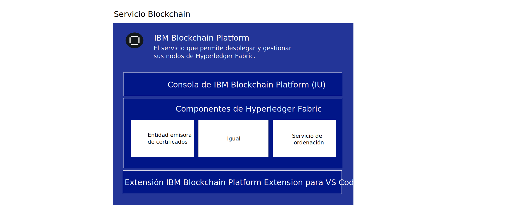
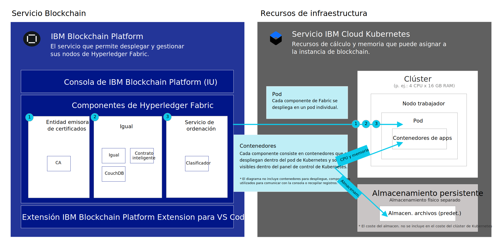

---

copyright:
  years: 2019
lastupdated: "2019-07-16"

keywords: getting started tutorials, videos, web browsers, integration

subcollection: blockchain

---

{:external: target="_blank" .external}
{:shortdesc: .shortdesc}
{:screen: .screen}
{:codeblock: .codeblock}
{:note: .note}
{:important: .important}
{:tip: .tip}
{:pre: .pre}
{:gif: data-image-type='gif'}

# Iniciación a {{site.data.keyword.blockchainfull_notm}} Platform for {{site.data.keyword.cloud_notm}}
{: #ibp-v2-deploy-iks}

{{site.data.keyword.blockchainfull}} Platform for {{site.data.keyword.cloud_notm}} incluye la consola de {{site.data.keyword.blockchainfull_notm}} Platform, una interfaz de usuario que puede simplificar y acelerar el proceso de despliegue y gestión de componentes de blockchain. En esta guía de aprendizaje se describe cómo empezar a trabajar con {{site.data.keyword.blockchainfull_notm}} Platform for {{site.data.keyword.cloud_notm}} y cómo utilizar la consola para desplegar y gestionar componentes de blockchain en el clúster del servicio Kubernetes de {{site.data.keyword.cloud_notm}} en {{site.data.keyword.cloud_notm}}. Para obtener más información sobre Kubernetes y sobre el servicio Kubernetes de {{site.data.keyword.cloud_notm}}, consulte [Kubernetes](/docs/services/blockchain/reference?topic=blockchain-k8s-overview "Kubernetes").
{:shortdesc}

**Audiencia de destino:** este tema está diseñado para los administradores de red responsables de configurar un clúster de Kubernetes en {{site.data.keyword.cloud_notm}} y de desplegar {{site.data.keyword.blockchainfull_notm}} Platform.

Después de enlazar {{site.data.keyword.blockchainfull_notm}} Platform al clúster de {{site.data.keyword.cloud_notm}} Kubernetes, puede iniciar la consola para crear y gestionar los componentes de blockchain y experimentar las ventajas importantes siguientes:

- **Control:** puede controlar y gestionar los componentes de blockchain y los certificados desde una consola central. Despliegue solo los componentes necesarios para su negocio y añada más a medida que crezcan sus necesidades.
- **Despliegue flexible basado en Kubernetes:** puede aprovechar las opciones de cálculo (CPU, memoria, almacenamiento) del clúster de Kubernetes y las opciones integradas de HA y DR.

## ¿Qué es el servicio Blockchain?
{: #ibp-v2-deploy-iks-blockhain-service}

En el diagrama siguiente se muestran los tres elementos de {{site.data.keyword.blockchainfull_notm}} Platform:



- **Consola de {{site.data.keyword.blockchainfull_notm}} Platform (IU)**: esta es la consola que le permite crear y gestionar los componentes de blockchain. Después de suministrar una instancia de servicio en {{site.data.keyword.cloud_notm}}, puede desplegar una instancia de la consola de {{site.data.keyword.blockchainfull_notm}} y enlazarla con el clúster de Kubernetes de {{site.data.keyword.cloud_notm}}. A continuación, puede utilizar la consola para crear y gestionar los componentes de blockchain en el clúster Kubernetes. No hay ningún cargo para la consola.

- **Componentes de Hyperledger Fabric**: la consola se utiliza para crear y gestionar componentes de blockchain basados en imágenes de servicio de ordenación, de igual y de entidad emisora de certificados de Hyperledger Fabric v1.4.1.  Estos componentes se despliegan en el clúster de kubernetes y se les suministra almacenamiento mediante la clase de almacenamiento `default` cuando se despliegan.

- Extensión **{{site.data.keyword.IBM_notm}} VS Code (herramientas de desarrollo)**: descargue la extensión VS Code del mercado de VS Code para empezar a desarrollar, empaquetar y probar aplicaciones cliente y contratos inteligentes.

## Consideraciones
{: #ibp-v2-deploy-iks-considerations}

Antes de desplegar la consola, asegúrese de que comprende las consideraciones siguientes:

- {{site.data.keyword.blockchainfull_notm}} Platform for {{site.data.keyword.cloud_notm}} se basa en Hyperledger Fabric v1.4.1.
- Todos los iguales desplegados con la consola o las API utilizan CouchDB como base de datos de estado.
- Tiene la opción de enlazar su instancia de servicio de {{site.data.keyword.blockchainfull_notm}} Platform con un clúster Kubernetes gratuito para la evaluación de la oferta; sin embargo, la capacidad y el rendimiento están limitados, no se pueden migrar datos y el clúster se suprime después de 30 días.
- El usuario es responsable de gestionar la supervisión del estado, la seguridad y el registro del clúster de Kubernetes. Consulte esta [información](/docs/containers?topic=containers-responsibilities_iks#your-responsibilities-by-using-ibm-cloud-kubernetes-service){: external} para ver detalles sobre lo que gestiona {{site.data.keyword.cloud_notm}} y lo que es responsabilidad del usuario.
- También es responsable de supervisar el uso de recursos del clúster de Kubernetes utilizando el panel de control de Kubernetes. Si tiene que aumentar la capacidad de almacenamiento o el rendimiento del clúster, consulte esta información sobre cómo [modificar un volumen existente](/docs/containers?topic=containers-file_storage#change_storage_configuration){: external}.
- Es responsable de gestionar y proteger sus certificados y sus claves privadas. {{site.data.keyword.IBM_notm}} no almacena sus certificados en el clúster de Kubernetes.
- {{site.data.keyword.blockchainfull_notm}} Platform está disponible en diversas regiones. Consulte este tema sobre [Ubicaciones de {{site.data.keyword.blockchainfull_notm}} Platform](/docs/services/blockchain/howto?topic=blockchain-ibp-regions-locations) para ver una lista actualizada.
- {{site.data.keyword.blockchainfull_notm}} Platform no se puede desplegar en clústeres OpenShift que se hayan creado utilizando el servicio Kubernetes de {{site.data.keyword.IBM_notm}}.
- Kubernetes debe tener la versión estable 1.11 o superior en el clúster de Kubernetes de {{site.data.keyword.cloud_notm}}. Utilice estas instrucciones para [actualizar los clústeres nuevos y existentes](/docs/services/blockchain/howto?topic=blockchain-ibp-v2-deploy-iks#ibp-v2-deploy-iks-updating-kubernetes) a esta versión.
- Si no desea utilizar el almacenamiento de archivos de nivel bronce predeterminado preseleccionado automáticamente al suministrar un clúster de Kubernetes en {{site.data.keyword.cloud_notm}}, puede suministrar el almacenamiento que elija. Consulte este tema sobre [Consideraciones sobre el almacenamiento persistente](/docs/services/blockchain?topic=blockchain-ibp-v2-deploy-iks#ibp-console-storage) para obtener más información.
- Si decide incluir el soporte multizona de {{site.data.keyword.cloud_notm}} en el clúster de Kubernetes, debe suministrar su propio almacenamiento. Consulte [Utilización de clústeres multizona (MZR) con {{site.data.keyword.blockchainfull_notm}} Platform](/docs/services/blockchain?topic=blockchain-ibp-v2-deploy-iks#ibp-console-mzr) para obtener más detalles.
- No hay soporte para el Direccionamiento virtual y reenvío (VRF). El servicio {site.data.keyword.blockchainfull_notm}} Platform no es compatible con las cuentas que estén habilitadas para el direccionamiento global automático entre bloques de IP de subred. Del mismo modo, no hay soporte para clústeres de Kubernetes que estén configurados con VLAN privadas.

## Vídeo de guía de aprendizaje
{: #ibp-v2-deploy-video}

Vea la [serie de vídeos]( http://ibm.biz/BlockchainPlatformSeries) siguiente para obtener información sobre la consola de {{site.data.keyword.blockchainfull_notm}} Platform y cómo puede comenzar a desplegar {{site.data.keyword.blockchainfull_notm}} Platform for {{site.data.keyword.cloud_notm}}.

## Antes de empezar
{: #ibp-v2-deploy-iks-prereq}

Antes de empezar:

- Asegúrese de que tiene una [cuenta de pago de {{site.data.keyword.cloud_notm}}](https://cloud.ibm.com/catalog/services/blockchain){: external}. Si no tiene una cuenta:
   1. Pulse el botón **Registro**.
   2. Después de crear una cuenta de prueba gratuita, actualícela a un tipo **Pago según uso** yendo a **Gestionar** > **Facturación y uso** > **Facturación** en la consola de {{site.data.keyword.cloud_notm}} y pulsando **Añadir tarjeta de crédito**.
   3. Asegúrese de que el usuario tiene los roles de Administrador y Gestor para el clúster de Kubernetes al que van a enlazar su instancia de servicio de blockchain. Consulte estos pasos sobre [cómo asignar roles de acceso de Kubernetes](#ibp-v2-deploy-iks-k8x-access-roles) para obtener más información.

Cuando tenga intención de utilizar la instancia del servicio en el contexto de una solución más amplia a nivel de organización, se recomienda que las organizaciones participantes utilicen una dirección de correo electrónico funcional para crear su red. En este caso, el acceso a la red no depende de la disponibilidad de ninguna persona individual.
{:tip}  

- Si tiene previsto utilizar un clúster del servicio Kubernetes de {{site.data.keyword.cloud_notm}} existente, compruebe la versión de Kubernetes y actualice a la versión 1.11 o superior si es necesario. Para obtener más información sobre cómo determinar qué versión de Kubernetes está ejecutando el clúster y cómo actualizar la versión, consulte [Actualización de la versión de Kubernetes del clúster](/docs/services/blockchain/howto?topic=blockchain-ibp-v2-deploy-iks#ibp-v2-deploy-iks-updating-kubernetes).

### Navegadores
{: #ibp-v2-deploy-iks-browsers}
En la lista siguiente se especifica el software de navegador mínimo necesario para la consola de {{site.data.keyword.blockchainfull_notm}} Platform:

- Chrome: versión más reciente para el sistema operativo
- Firefox: versiones normales (no ESR) más recientes para el sistema operativo
- Safari: versión más reciente para Mac
- Edge: v44.17763.1.0 o superior

### Recursos necesarios
{: #ibp-v2-deploy-iks-resources-required}

#### Recomendaciones sobre el tamaño del clúster
{: #ibp-v2-deploy-iks-resources-required-free}

 Cuando enlace la consola de {{site.data.keyword.blockchainfull_notm}} Platform con un clúster del servicio Kubernetes de {{site.data.keyword.cloud_notm}}, debe asegurarse de que el clúster de Kubernetes cumpla con los requisitos mínimos de recursos de hardware:

|Tipo de clúster de Kubernetes | Caso de uso | CPU | RAM | Nodos trabajadores |
|-----------|------|-----|-----------------------|
|Estándar (recomendado) | Adecuado para MVP | 4 (compartidas) | 16 GB (compartidos)|múltiples|
|Gratuito** | Adecuado para evaluación | 2 | 4 GB | 1 |  
** Obtenga una vista previa de {{site.data.keyword.blockchainfull_notm}} Platform sin coste alguno durante 30 días al enlazar su instancia de servicio de {{site.data.keyword.blockchainfull_notm}} Platform con un clúster Kubernetes gratuito de {{site.data.keyword.cloud_notm}}. El rendimiento estará limitado por el uso, almacenamiento y funcionalidad. {{site.data.keyword.cloud_notm}} suprimirá el clúster Kubernetes después de 30 días y no se podrán migrar los nodos ni los datos de un clúster gratuito a un clúster de pago.

Estos recursos son suficientes para pruebas y experimentación. La [guía de aprendizaje sobre creación de una red](/docs/services/blockchain/howto?topic=blockchain-ibp-console-build-network#ibp-console-build-network), en la que creará dos iguales, dos CA y un servicio de ordenación, consume aproximadamente 4,15 CPU, de las que el servicio de ordenación de cinco nodos ocupa hasta 1,75 CPU. Por lo tanto, si tiene previsto desplegar un servicio de ordenación de cinco nodos, no debe desplegar un clúster de Kubernetes con un solo nodo trabajador de 2 CPU, ya que el servicio de ordenación no tendrá cabida de manera adecuada con otros nodos. Recomendamos utilizar un clúster con nodos de al menos 4 CPU. Cuantos más nodos trabajadores añada, más fácilmente podrá el clúster manejar los despliegues.
{:note}

#### Clústeres de pago
{: #ibp-v2-deploy-iks-resources-required-paid}

Los despliegues a nivel de producción de {{site.data.keyword.blockchainfull_notm}} se realizarán en un clúster de pago del servicio {{site.data.keyword.cloud_notm}} Kubernetes. El tamaño y la configuración de este clúster dependerán de las necesidades del caso de uso específico. Los despliegues de un tamaño mayor necesariamente deberán realizarse en clústeres más grandes. Cuánto mayor será el clúster que el despliegue proyectado dependerá de usted. Es deseable tener al menos un poco de espacio libre, ya que permitirá que los servicios de igual y de ordenación se puedan unir a canales adicionales y puedan asumir una carga mayor sin tener que desplegar recursos adicionales en el clúster de Kubernetes **antes** de ajustar el tamaño de los nodos. Para obtener más información sobre cómo se ajustan estos valores, consulte [Reasignación de recursos](/docs/services/blockchain/howto?topic=blockchain-ibp-console-govern#ibp-console-govern-reallocate-resources).

Necesita crear un clúster de tipo Kubernetes para desplegar {{site.data.keyword.blockchainfull_notm}} Platform. {{site.data.keyword.blockchainfull_notm}} Platform no admite clústeres OpenShift creados utilizando el servicio Kubernetes de {{site.data.keyword.IBM_notm}}.
{:important}

La creación de un despliegue inicial de tamaño suficiente para permitir el crecimiento es particularmente importante para los usuarios que decidan no utilizar el [servicio de escalado automático de Kubernetes de {{site.data.keyword.cloud_notm}}](/docs/containers?topic=containers-ca#ca){: external}, que puede asumir parte de la carga de desplegar nodos y pods adicionales para el usuario.

Aunque es más fácil tener suficientes recursos desplegados en el servicio {{site.data.keyword.cloud_notm}} Kubernetes y poder expandir los pods y los nodos de trabajador cuando sea necesario sin tener que aumentar primero el despliegue del clúster de Kubernetes, cuanto mayores sean los despliegues de clústeres de Kubernetes, mayor será el coste económico. Los usuarios deberán estudiar detenidamente sus opciones y reconocer qué están sacrificando independientemente de la opción que elijan.

Para tener una idea de cuánto almacenamiento y potencia de cálculo necesitará en su clúster, consulte este gráfico, que contiene los valores predeterminados actuales para el igual, el nodo de ordenación y la CA:

| **Componente** (todos los contenedores) | CPU  | Memoria (GB) | Almacenamiento (GB) |
|--------------------------------|---------------|-----------------------|------------------------|
| **Igual**                       | 1,1            | 2,4                  | 200 (incluye 100 GB para el igual y 100 GB para CouchDB)|
| **CA**                         | 0,1            | 0,2                  | 20                     |
| **Nodo de ordenación**              | 0,35           | 0,9                  | 100                    |

Si tiene previsto desplegar un servicio de ordenación Raft de cinco nodos, tenga en cuenta que el total del despliegue aumentará en un factor de cinco. Esto dará un total de 1,75 CPU, 4,5 GB de memoria y 500 GB de almacenamiento para los cinco nodos Raft. Un solo nodo trabajador de Kubernetes de 4 CPU es la recomendación mínima para permitir bastante CPU para el clúster Raft y cualquier otro nodo que despliegue.
{:tip}

## Paso uno: crear una instancia de servicio en {{site.data.keyword.cloud_notm}}
{: #ibp-v2-deploy-iks-create-service-instance}

Siga los pasos siguientes para crear una instancia de servicio de {{site.data.keyword.blockchainfull_notm}} Platform for {{site.data.keyword.cloud_notm}}.

1. Localice el [servicio blockchain](https://cloud.ibm.com/catalog/services/blockchain){: external} en el catálogo de {{site.data.keyword.cloud_notm}} o busque `Blockchain` en la página del catálogo de {{site.data.keyword.cloud_notm}}.
2. Se recomienda que cambie el **Nombre de servicio** de su instancia para que pueda reconocerla fácilmente en el futuro.
3. Elija su región. Para ver una lista de las regiones disponibles, consulte
[Regiones](/docs/services/blockchain/reference?topic=blockchain-ibp-regions-locations#ibp-regions-locations).
4. Puede dejar si modificar los campos de grupo de recursos y etiquetas.
5. Elija el plan **Estándar**.
6. Pulse **Crear** para suministrar la instancia de servicio.

## Paso dos: desplegar {{site.data.keyword.blockchainfull_notm}} Platform
{: #ibp-v2-deploy-iks-steps}

Puede seguir la guía para desplegar {{site.data.keyword.blockchainfull_notm}} Platform inmediatamente después de crear la instancia de servicio.

1. El paso de **bienvenida y requisitos previos**. Si ya tiene un clúster del servicio Kubernetes de {{site.data.keyword.IBM_notm}} existente en la región **Dallas** y desea utilizarlo para el servicio de blockchain, marque el recuadro de selección. **Si utiliza un clúster existente, puede omitir el paso siguiente; pero asegúrese de que la versión de Kubernetes sea la versión estable v1.11 o posterior**. Pulse **Continuar**.
2. El paso **Crear clúster**. Si marca el recuadro de selección del paso 1 para utilizar un clúster de Kubernetes existentes, este paso se omite. De lo contrario, pulse **Crear un nuevo clúster**, lo que inicia el panel de control de Kubernetes de {{site.data.keyword.cloud_notm}} para crear un clúster. Para obtener más información, consulte [Iniciación al servicio Kubernetes de {{site.data.keyword.cloud_notm}}](/docs/containers?topic=containers-getting-started){: external}. Este proceso tarda un rato.
  - Para obtener más información sobre las ubicaciones para el clúster, consulte [Regiones](/docs/services/blockchain/reference?topic=blockchain-ibp-regions-locations#ibp-regions-locations).
  - Seleccione **Clúster estándar (recomendado):** si necesita una opción de plazo más largo que incluya varios nodos para alta disponibilidad. Como tipo de clúster, seleccione **Kubernetes**. **Elija como mínimo la versión estable v.1.11 o posterior.** Para desplegar un clúster de pago, consulte [Creación de un clúster estándar](/docs/containers?topic=containers-clusters#clusters_ui_standard){: external}. Tenga en cuenta que si desea una alta disponibilidad o recuperación tras desastre, necesitará tomar una decisión en relación con la clase de almacenamiento que se va a utilizar. El suministro dinámico utilizará la clase de almacenamiento `default` del clúster. Así, los clientes pueden establecer cualquier clase de almacenamiento como predeterminada. Para obtener más información, consulte [Cómo decidir la configuración del almacenamiento de archivos](/docs/containers?topic=containers-file_storage#file_predefined_storageclass){: external}.
  - Elija **Clúster gratuito:** si desea obtener una vista previa de la plataforma durante menos de 30 días. **Tenga en cuenta** que no se puede migrar de un clúster gratuito a un clúster de pago. El tipo de clúster gratuito ofrece un almacenamiento y un rendimiento de transacciones limitados. Para obtener instrucciones sobre qué hacer cuando caduque el clúster de Kubernetes, consulte este tema sobre la [Caducidad del clúster de Kubernetes](/docs/services/blockchain/howto?topic=blockchain-ibp-console-manage-console#ibp-console-manage-console-cluster-expiration).
  - Para obtener más información acerca de las diferencias entre los clústeres de Kubernetes gratuitos y de pago en {{site.data.keyword.cloud_notm}}, consulte [Comparación entre clústeres gratuitos y estándares](/docs/containers?topic=containers-cluster_types#cluster_types){: external}.  

   Debe volver a este separador en el navegador después de crear el clúster de modo que completar el proceso de despliegue de {{site.data.keyword.blockchainfull_notm}} Platform.  
   {:important}  

  Debe esperar hasta que el clúster se haya desplegado correctamente. A continuación, pulse el botón **Tengo un clúster**.
3. La versión de Kubernetes que se ejecute el clúster debe ser la versión 1.11 o superior. Siga estos [pasos](/docs/services/blockchain/howto?topic=blockchain-ibp-v2-deploy-iks#ibp-v2-deploy-iks-updating-kubernetes) para comprobar la versión del clúster y actualizarla si es necesario. Luego vuelva y continúe con estas instrucciones.
4. El paso **Desplegar en clúster**. Seleccione el clúster de Kubernetes en el que desee desplegar {{site.data.keyword.blockchainfull_notm}} Platform en la lista desplegable y pulse **Desplegar en clúster**.  

  Si el clúster de Kubernetes no está visible en la lista desplegable, podría deberse a las condiciones siguientes:
  - El proceso de creación del clúster puede tardar hasta 60 minutos en completarse. Si ha creado un clúster, deje pasar un tiempo hasta que el estado del clúster sea **Normal**.
  - Los clústeres que están fuera de la región **Dallas** no resultan visibles y no se pueden utilizar.
  - Asegúrese de que no está utilizando la versión ESR de Firefox. Si es así, cambie a otro navegador, como Chrome, y vuelva a intentarlo.

5. El paso **Iniciar consola**. Después de que {{site.data.keyword.blockchainfull_notm}} Platform se haya desplegado correctamente, pulse **Iniciar {{site.data.keyword.blockchainfull_notm}} Platform** para abrir la consola de {{site.data.keyword.blockchainfull_notm}} Platform. El botón puede tardar unos minutos en habilitarse mientras se suministra la consola.

En la siguiente ilustración se muestra cómo se despliegan los componentes de {{site.data.keyword.blockchainfull_notm}} Platform en el clúster de Kubernetes.



- **Pod**: cuando se despliega cada entidad emisora de certificados, igual o servicio de ordenación, se crea un nuevo pod en un nodo trabajador del clúster.
- **Contenedores de apps**: los contenedores se crean dentro de los pods para cada nodo que se despliega.  
- **Almacenamiento persistente**: el almacenamiento de cada nodo se proporciona de forma dinámica desde la clase de almacenamiento `default` del clúster de Kubernetes cada vez que se despliega un nodo.

## (Opcional) Añadir usuarios adicionales a la consola
{: #ibp-v2-deploy-iks-add-users}

De forma predeterminada, la consola utiliza [{{site.data.keyword.cloud_notm}} Identity and Access Management (IAM)](/docs/iam?topic=iam-iamoverview#iamoverview){: external} como proveedor de servicios de identidad {{site.data.keyword.cloud_notm}}. La consola de {{site.data.keyword.blockchainfull_notm}} Platform se suministra configurando la dirección de correo electrónico del propietario de {{site.data.keyword.IBM_notm}} como administrador de la consola. Como administrador, este usuario tiene autorización para otorgar a otros usuarios acceso a la consola a través de sus direcciones de correo electrónico.  Consulte las instrucciones sobre cómo [añadir y eliminar usuarios de la consola](/docs/services/blockchain?topic=blockchain-ibp-console-manage-console#ibp-console-manage-console-add-remove) para obtener más información.

## Siguientes pasos
{: #ibp-v2-deploy-iks-next-steps}

- Antes de crear nodos, debe decidir sobre el plugin de almacenamiento para el clúster de Kubernetes. Si está empezando y probando cosas, el almacenamiento de archivos de bronce predeterminado que está preseleccionado en el momento en que se suministra el clúster resulta adecuado. En este momento no es necesario realizar ninguna acción adicional.  Sin embargo, cuando esté preparado para desplegar un clúster para una prueba formal o para uso en producción, debe decidir el plugin de almacenamiento que mejor se adapte a sus necesidades. Consulte este tema sobre [Consideraciones sobre el almacenamiento persistente](#ibp-console-storage) para obtener más información.

- Ahora que la consola está lista para ser utilizada, puede continuar con la [guía de aprendizaje sobre cómo crear una red](/docs/services/blockchain/howto?topic=blockchain-ibp-console-build-network#ibp-console-build-network).
Considere la posibilidad de marcar el URL de la consola para poder volver en un momento posterior si es necesario. De no ser así, puede seguir los pasos de las [Instrucciones posteriores a la instalación](#ibp-v2-deploy-iks-post-install) para volver a ella desde el navegador.

## Integración con {{site.data.keyword.cloud_notm}} y otros servicios de terceros
{: #ibp-v2-deploy-iks-integrations}

{{site.data.keyword.blockchainfull_notm}} Platform puede hacer uso de una suite de servicios proporcionada en el catálogo de {{site.data.keyword.cloud_notm}} para permitir que los usuarios tengan una mayor visibilidad en su red o para la integración con otros servicios.

  

**Control de acceso**  
- Autentique usuarios de forma segura y controle el acceso a todos los recursos de la nube utilizando [{{site.data.keyword.cloud_notm}} Identity and Access Management (IAM)](/docs/services/Log-Analysis-with-LogDNA?topic=LogDNA-iam).

**Supervisión**  
- Utilice el servicio [{{site.data.keyword.cloud_notm}} Activity Tracker with LogDNA](/docs/services/Log-Analysis-with-LogDNA?topic=LogDNA-getting-started#getting-started) para resolver problemas de registros en tiempo real, diagnosticar problemas e identificar problemas en el clúster Kubernetes.

- Utilice [{{site.data.keyword.cloud_notm}} Activity Tracker with SysDig](/docs/services/Monitoring-with-Sysdig?topic=Sysdig-getting-started#getting-started) para supervisar la actividad y el estado de los servicios y aplicaciones en IBM Cloud.

- Consulte esta guía de aprendizaje sobre cómo [Analizar registros y supervisar el estado de las aplicaciones con LogDNA y Sysdig](/docs/tutorials?topic=solution-tutorials-application-log-analysis).

**Almacenamiento**  
- Utilice el [Almacenamiento de archivos](/docs/infrastructure/FileStorage?topic=FileStorage-about#getting-started-with-file-storage) y el [Almacenamiento en bloque](/docs/infrastructure/BlockStorage?topic=BlockStorage-About#getting-started-with-block-storage) de {{site.data.keyword.cloud_notm}} cuando se suministren los nodos de blockchain. Consulte este tema sobre [Consideraciones sobre el almacenamiento persistente](#ibp-console-storage) para obtener más información sobre cómo se integra blockchain con las opciones de almacenamiento de {{site.data.keyword.cloud_notm}}.

- Configure [Portworx](/docs/containers?topic=containers-portworx#portworx) para gestionar el almacenamiento persistente local en las bases de datos contenerizadas, o compartir datos entre pods en varias zonas.

Para obtener más información sobre los servicios de {{site.data.keyword.cloud_notm}} disponibles y otras integraciones de terceros, consulte esta lista de [Integraciones de {{site.data.keyword.cloud_notm}} y de terceros soportadas](/docs/containers?topic=containers-supported_integrations#supported_integrations){: external}.

## Actualización de la versión de Kubernetes del clúster
{: #ibp-v2-deploy-iks-updating-kubernetes}

Si utiliza un clúster del servicio Kubernetes de {{site.data.keyword.cloud_notm}} existente, asegúrese de que la versión de Kubernetes sea la versión 1.11 o superior.

Puede comprobar la versión de Kubernetes del clúster en la [página de clústeres de Kubernetes](https://cloud.ibm.com/kubernetes/clusters){: external} en {{site.data.keyword.cloud_notm}}, que muestra todos los clústeres en una tabla.

Si la versión de Kubernetes no es la versión 1.11 o superior, debe seguir los pasos siguientes para actualizar la versión de Kubernetes del clúster.

1. Pulse sobre el icono de menú de desbordamiento que hay al final de la fila y seleccione **Actualizar versión**. Este proceso tarda alrededor de una hora en completarse. Si la versión se actualiza correctamente, puede ver la versión actualizada del clúster en la columna **Versión de Kubernetes**.  
2. Seleccione la versión de Kubernetes v1.11 o posterior en la lista desplegable de versiones de Kubernetes y pulse **Actualizar**.
3. Pulse el clúster y vaya al separador **Nodos trabajadores**. Marque el recuadro de selección correspondiente al nodo trabajador que desea actualizar y pulse **Actualizar Kubernetes** en la barra de menús emergente. Si el clúster contiene varios nodos trabajadores, se deben actualizar todos ellos.

  Las actualizaciones de los nodos trabajadores pueden hacer que las apps y los servicios estén un tiempo inactivos. Se crea de nuevo la imagen de la máquina del nodo trabajador y se suprimen los datos si no se [almacenan fuera del pod](/docs/containers?topic=containers-storage_planning#persistent_storage_overview){: external}.
  {:important}

{: gif}

Para obtener más información sobre cómo actualizar la versión de Kubernetes de un clúster del servicio Kubernetes de {{site.data.keyword.IBM_notm}} y de los nodos trabajadores, consulte [Actualización de clústeres, nodos trabajadores y complementos](/docs/containers?topic=containers-update#update){: external}.  

Debe esperar a que finalice la actualización para poder [reanudar el despliegue de {{site.data.keyword.blockchainfull_notm}} Platform](/docs/services/blockchain/howto?topic=blockchain-ibp-v2-deploy-iks#ibp-v2-deploy-iks-steps).

## Cómo asignar roles de acceso de Kubernetes
{: #ibp-v2-deploy-iks-k8x-access-roles}

El usuario que enlaza la instancia de servicio de blockchain al clúster de Kubernetes debe tener los roles Administrador y Gestor en Kubernetes.
Para configurar este acceso, debe realizar los pasos siguientes:
   1. En el panel de control de {{site.data.keyword.cloud_notm}}, pulse la lista desplegable **Gestionar** y, a continuación, pulse **Acceso (IAM)**.
   2. En el menú de navegación de la izquierda, pulse **Usuarios** y pulse el ID del usuario que vaya a enlazar la instancia de servicio con el clúster Kubernetes.
   3. Pulse **Políticas de acceso** y luego **Asignar acceso**.
   4. Pulse el mosaico **Asignar acceso a recursos**.
   5. En la lista desplegable **Servicios**, seleccione **Servicio Kubernetes**.
   6. Marque los roles **Administrador** y **Gestor** para este usuario.
   7. Pulse **Asignar**.

{: gif}

Para obtener más información sobre el control de acceso de Kubernetes, consulte [cómo elegir la política de acceso y el rol correctos para los usuarios](/docs/containers?topic=containers-users#access_roles).

## Instrucciones posteriores a la instalación
{: #ibp-v2-deploy-iks-post-install}

Después de desplegar la consola, puede pulsar el botón **Iniciar {{site.data.keyword.blockchainfull_notm}} Platform** para abrir la consola en el navegador. Puede añadir el URL de la consola como marcador a su navegador.

### Cómo volver a la consola desde {{site.data.keyword.cloud_notm}}
{: #ibp-v2-deploy-iks-rtn-to-console}

Si no tiene el URL de la consola, la encontrará en el panel de control de {{site.data.keyword.cloud_notm}}.

1. En el navegador, abra la [lista de recursos de {{site.data.keyword.cloud_notm}}](https://cloud.ibm.com/resources){: external}. Debe iniciar una sesión con su ID de {{site.data.keyword.IBM_notm}}.
2. La instancia de servicio de {{site.data.keyword.blockchainfull_notm}} Platform será visible en el triángulo **Servicios**. Localice la instancia de servicio de {{site.data.keyword.blockchainfull_notm}} Platform que ha desplegado y pulse sobre ella.
3. En el panel siguiente, pulse **Gestionar** en el panel de navegación de la izquierda y luego pulse **Iniciar {{site.data.keyword.blockchainfull_notm}} Platform**.

La consola se abre en el navegador.

## Consideraciones sobre el almacenamiento persistente
{: #ibp-console-storage}

{{site.data.keyword.blockchainfull_notm}} Platform necesita almacenamiento persistente para cada uno de los nodos de CA, igual y de ordenación. Cuando se despliega un clúster de Kubernetes estándar en {{site.data.keyword.cloud_notm}}, viene preconfigurado con el plugin [Almacenamiento de archivos de nivel bronce](/docs/containers?topic=containers-file_storage#file_predefined_storageclass){: external} como clase de almacenamiento `default`. A continuación, cuando despliega un nodo blockchain en ese clúster mediante la consola o las API, se suministra de forma dinámica una cantidad de almacenamiento de archivos para el nodo que se basa en la cantidad de almacenamiento que se solicitó cuando se desplegó el nodo. Por lo tanto, el despliegue suministra el almacenamiento en el clúster con la clase de almacenamiento `default`. Puede elegir entre varias [opciones de almacenamiento de Kubernetes](/docs/containers?topic=containers-storage_planning#persistent_storage_overview){: external} y puede elegir el tipo de almacenamiento que mejor se ajuste a sus necesidades. Tenga en cuenta que se le facturará por separado el uso de almacenamiento, por lo que puede calcular el coste de las distintas opciones de almacenamiento cuando realice la selección.

Si desea añadir su propio plugin de almacenamiento, debe crear una clase de almacenamiento personalizada. Consulte cómo [añadir una clase de almacenamiento](/docs/containers?topic=containers-kube_concepts#storageclasses){: external} para la solución. Puesto que {{site.data.keyword.blockchainfull_notm}} Platform utiliza el [suministro de volúmenes dinámicos](/docs/containers?topic=containers-kube_concepts#dynamic_provisioning){: external} con la clase de almacenamiento `default`, debe cambiar la clase de almacenamiento predeterminada para que utilice el plugin de almacenamiento ejecutando el mandato siguiente:

```
kubectl patch storageclass <storageclass> -p '{"metadata": {"annotations":{"storageclass.kubernetes.io/is-default-class":"true"}}}'
```
{:codeblock}

Sustituya ``<storageclass>`` por el nombre de su clase de almacenamiento.

Después de desplegar nodos blockchain en el clúster, no debería cambiar la clase de almacenamiento predeterminada del clúster de Kubernetes, ya que perdería el almacenamiento para los nodos de CA, iguales y de ordenación que ya estén desplegados. Por lo tanto, debe decidir sobre el plugin de almacenamiento antes de desplegar los nodos blockchain.
{: important}

### Utilización de clústeres multizona (MZR) con {{site.data.keyword.blockchainfull_notm}} Platform
{: #ibp-console-mzr}

En las regiones en las que se ofrece, el [soporte multizona](/docs/containers?topic=containers-regions-and-zones#regions_multizone){: external} está preseleccionado de forma predeterminada cuando se crea un clúster de Kubernetes estándar en {{site.data.keyword.cloud_notm}}. Aunque no es necesario, esta función proporciona alta disponibilidad de los nodos en caso de que cualquier zona o centro de datos deje de estar activo. Si el clúster incluye soporte multizona, debe traer su propia solución de almacenamiento. Puede elegir entre varias [opciones de almacenamiento persistente](/docs/containers?topic=containers-storage_planning#persistent_storage_overview){: external}.

Después de crear la clase de almacenamiento, ejecute el mandato `kubectl patch storageclass` anterior para que la clase de almacenamiento de la región multizona sea la clase de almacenamiento `default`.

### Información sobre tarifas y facturación
{: #ibp-v2-deploy-iks-pricing-billing}

- Consulte el tema [Tarifas](/docs/services/blockchain/howto?topic=blockchain-ibp-saas-pricing) si necesita volver a ver la información sobre las tarifas de {{site.data.keyword.blockchainfull_notm}} Platform.
- La información de uso de {{site.data.keyword.cloud_notm}} actual está disponible en el [mosaico de uso](https://cloud.ibm.com/billing/){: external} del panel de control de {{site.data.keyword.cloud_notm}} y puede consultar su factura en [información de facturación](https://cloud.ibm.com/billing/billing-items){: external}. Consulte este tema sobre [Facturación](/docs/services/blockchain/howto?topic=blockchain-ibp-saas-pricing#ibp-saas-pricing-billing) para obtener más detalles sobre cómo funciona la facturación de {{site.data.keyword.blockchainfull_notm}} Platform.

### Supresión de una instancia de servicio
{: #ibp-v2-deploy-iks-delete-service-instance}

Cuando ya no necesite una instancia de servicio, se puede suprimir del clúster de Kubernetes para liberar recursos. Puede utilizar el panel de control de {{site.data.keyword.cloud_notm}} para suprimir su instancia de servicio de {{site.data.keyword.blockchainfull_notm}} Platform.

1. En el navegador, abra la [lista de recursos de {{site.data.keyword.cloud_notm}}](https://cloud.ibm.com/resources){: external}. Debe iniciar una sesión con su ID de {{site.data.keyword.IBM_notm}}.
2. En el triángulo **Servicios**, localice la instancia de servicio que desea suprimir y pulse **Suprimir** en el menú Acciones.

**Elija esta opción detenidamente.** Si suprime una instancia de servicio, se suprime el almacenamiento asociado a cada nodo y no se puede restaurar. Se suprimirán todos los datos del libro mayor.
{: important}

Si la supresión de la instancia de servicio falla, podría deberse a que no se puede acceder al clúster de Kubernetes. Si ocurre esto, abra una [incidencia de soporte](/docs/services/blockchain?topic=blockchain-blockchain-support#blockchain-support-cases) para solicitar la supresión de la instancia de servicio.
