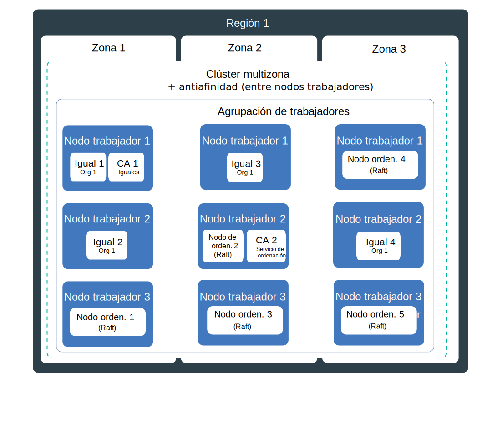
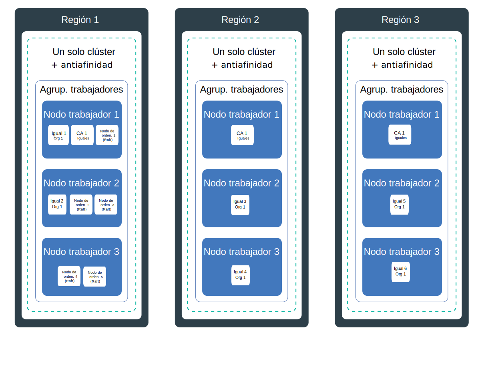

---

copyright:
  years: 2019
lastupdated: "2019-07-10"

keywords: high availability, HA, IBM Cloud, failures, zone failure, region failure, component failure, worker node failure

subcollection: blockchain

---

{:external: target="_blank" .external}
{:shortdesc: .shortdesc}
{:screen: .screen}
{:codeblock: .codeblock}
{:note: .note}
{:important: .important}
{:tip: .tip}
{:pre: .pre}

# Alta disponibilidad (HA)
{: #ibp-console-ha}

Utilice las características incorporadas de Kubernetes junto con las estrategias de despliegue de componentes de {{site.data.keyword.blockchainfull}} Platform para hacer que sus redes blockchain tengan una mayor disponibilidad y para proteger su red para evitar cualquier tiempo de inactividad cuando se produzca un error en el clúster.
{:shortdesc}

**Audiencia de destino:** este tema está diseñado para arquitectos y administradores del sistema que sean responsables de la planificación y configuración de {{site.data.keyword.blockchainfull_notm}} en {{site.data.keyword.cloud_notm}} o en {{site.data.keyword.cloud_notm}} Private.

La alta disponibilidad es una disciplina fundamental en una infraestructura de TI para mantener las apps en funcionamiento, incluso cuando se produce un error de sitio parcial o completo. El objetivo principal de la alta disponibilidad es eliminar posibles puntos de anomalía en una infraestructura de TI. Por ejemplo, puede prepararse por si falla un sistema añadiendo redundancia y estableciendo mecanismos de migración tras error.

Puede conseguir una alta disponibilidad en distintos niveles de la infraestructura de TI y dentro de diferentes capas del clúster. El nivel de disponibilidad que sea correcto dependerá de diversos factores, como los requisitos de negocio, los acuerdos de nivel de servicio que tenga con las organizaciones y el coste de la redundancia.

Antes de continuar, se recomienda que revise las directrices específicas de su plataforma en relación con la alta disponibilidad:
- Si utiliza {{site.data.keyword.cloud_notm}}, puede obtener más información sobre cómo funciona la alta disponibilidad con Kubernetes en {{site.data.keyword.cloud_notm}} en este tema sobre [Alta disponibilidad para el servicio Kubernetes de {{site.data.keyword.cloud_notm}}](/docs/containers?topic=containers-ha){: external}.
- Si utiliza {{site.data.keyword.cloud_notm}} Private, revise el contenido acerca de la [Implementación de la alta disponibilidad en {{site.data.keyword.cloud_notm}} Private](https://www.ibm.com/cloud/garage/practices/manage/high-availability-ibm-cloud-private){: external}.  

Puede utilizar este tema para obtener detalles sobre las directrices para la alta disponibilidad específicas de blockchain junto con las recomendaciones de los temas anteriores específicos de la plataforma.

## Visión general de los puntos de anomalía potenciales en {{site.data.keyword.blockchainfull_notm}} Platform for {{site.data.keyword.cloud_notm}}
{: #ibp-console-ha-points-of-failure-overview}

La arquitectura de {{site.data.keyword.blockchainfull_notm}} Platform está diseñada para garantizar la fiabilidad, una latencia de proceso baja y el máximo tiempo de actividad del servicio. Sin embargo, se pueden producir errores. {{site.data.keyword.blockchainfull_notm}} Platform proporciona varios métodos para añadir una mayor disponibilidad al clúster añadiendo políticas de redundancia y [antiafinidad](https://www.ibm.com/blogs/cloud-archive/2016/07/ibm-containers-anti-affinity/){: external}, cuando estén disponibles, para garantizar que los componentes de blockchain del mismo tipo y organización se despliegan en distintos nodos trabajadores.  Mediante la adición de redundancia en la red blockchain, puede evitar errores o periodos de inactividad.  

Para conseguir la máxima disponibilidad, se recomienda crear redundancia mediante el suministro de iguales y clasificadores en clústeres Kubernetes en varias regiones. Cuando se dispersen los componentes en regiones y el libro mayor de blockchain se distribuya a estos componentes, un error en una única región no afectará al proceso de las transacciones. Las CA son menos críticas para el proceso diario de transacciones. Una vez que todos los usuarios se hayan registrado e inscrito con la CA, ya no será necesaria hasta la siguiente vez que se necesiten dichos servicios.

### Consideraciones sobre el igual
{: #ibp-console-ha-peers}

La alta disponibilidad para los iguales implica que siempre se tengan iguales redundantes, lo que implicaría que hay al menos dos iguales disponibles para cada organización en el mismo canal para procesar solicitudes de aplicaciones cliente. Se pueden desplegar varios iguales en un único nodo trabajador, o se pueden dispersar en nodos trabajadores, en zonas (si utiliza {{site.data.keyword.cloud_notm}}), o incluso en regiones. Siempre que despliegue varios iguales y que se unan al mismo canal, los iguales actúan como pares de alta disponibilidad, ya que el canal y los datos se sincronizan automáticamente en todos los iguales del canal.  Por diseño, una red blockchain está pensada para que varias organizaciones realicen transacciones en los mismos canales.  Por lo tanto, el modelo de despliegue común es que, para cualquier canal determinado, existan iguales redundantes para cada organización distribuidos en varios clústeres de cuentas de organización que estén todos sincronizando datos entre sí.  Cada organización puede tener un igual en su propio clúster en cualquier región. 

Para conseguir una cobertura de alta disponibilidad más robusta aún, puede hacer frente a varios clústeres en varias regiones y desplegar iguales en todos ellos. No obstante, si se desea un alto rendimiento, deben tomarse precauciones al distribuir los iguales para garantizar que la latencia y el ancho de banda entre ellos sea suficiente para alcanzar sus objetivos de rendimiento.

Los **iguales de ancla** en un canal facilitan la comunicación entre organizaciones, necesaria para el funcionamiento de los datos privados, rumores (gossip) y el descubrimiento de servicios. Si solo existe un igual de ancla en un canal, y dicho igual deja de estar disponible, las organizaciones ya no estarán conectadas y los rumores entre organizaciones ya no serán posibles. Por lo tanto, al crear iguales redundantes para una organización, asegúrese de añadir también [iguales de ancla](/docs/services/blockchain?topic=blockchain-ibp-console-govern#ibp-console-govern-channels-anchor-peers) redundantes en el canal.

### Consideraciones sobre el servicio de ordenación
{: #ibp-console-ha-ordering-service}

{{site.data.keyword.blockchainfull_notm}} Platform se basa en Hyperledger Fabric v1.4.1, que incluye el servicio de ordenación Raft. Raft es un servicio de ordenación con tolerancia a errores de bloqueo (CFT) basado en una implementación del [protocolo Raft](https://raft.github.io/raft.pdf){: external}. Por diseño, los nodos de ordenación de Raft sincronizan automáticamente los datos entre ellos utilizando un consenso basado en Raft. En {{site.data.keyword.blockchainfull_notm}} Platform, un operador de red de la organización puede optar por configurar un clasificador basado en Raft de un solo nodo, sin alta disponibilidad, o cinco clasificadores en una única región que estén automáticamente configurados para la alta disponibilidad a través de Raft.

## Lista de comprobación de alta disponibilidad
{: #ibp-console-ha-checklist}

En la tabla siguiente se incluye una lista de opciones a tener en cuenta a medida que se aumente el grado de alta disponibilidad.

|  | Nodo individual | Clúster individual con varios nodos | Varias zonas (solo {{site.data.keyword.cloud_notm}}**)| Varios clústeres entre regiones |
|-----|-----|-----|-----|-----|
| Iguales redundantes |  |  |  |  |
| Iguales de ancla redundantes en un canal|  |  |  | |
| Antiafinidad*** (iguales) |  |  |  | |
|Servicio de ordenación de Raft |  |  |  | |
| Antiafinidad*** (nodos de ordenación) |  |  |  | |
|Entorno de desarrollo o pruebas |  |  | | |
| Entorno de producción | | |  |  |
{: row-headers}
{: class="comparison-table"}
{: caption="Tabla 1. Comparación de casos de ejemplo de despliegue para aumentar la alta disponibilidad de la red" caption-side="top"}
{: summary="This table has row and column headers. The row headers identify the deployment scenarios. The column headers identify available options in each scenario to increase your HA."}

*** El desplegador de {{site.data.keyword.blockchainfull_notm}} Platform no puede garantizar que los iguales o los nodos de ordenación se distribuyan en diferentes zonas. Puede utilizar las API de {{site.data.keyword.blockchainfull_notm}} Platform para desplegar nodos en zonas específicas de {{site.data.keyword.cloud_notm}} y garantizar que la red sea resistente a un error de zona. Para obtener más información, consulte [Alta disponibilidad de varias zonas](#ibp-console-ha-multi-zone).  

** La configuración predeterminada para un clúster Kubernetes estándar en {{site.data.keyword.cloud_notm}} es un clúster de 4 CPU y 16 GB RAM que incluye tres zonas con tres nodos trabajadores en cada una. Puede aumentar o reducir la escala, seleccionando una configuración menor, en función de sus necesidades.

## Puntos de anomalía potenciales
{: #ibp-console-ha-points-of-failure}

{{site.data.keyword.blockchainfull_notm}} Platform ofrece varios métodos para añadir una mayor disponibilidad en la red mediante la adición de redundancia y el uso de políticas de antiafinidad. Revise los diagramas siguientes para obtener más información sobre los puntos de anomalía potenciales y cómo eliminarlos. Puede seleccionar un modelo basado en los niveles de gravedad de su aplicación, los niveles de servicio y el coste. Como regla general, puede implementar la redundancia para cumplir los niveles de servicio. Todos estos casos de ejemplo se deben sopesar en relación con el coste de implementar una mayor resiliencia.

### Alta disponibilidad de una única región
{: #ibp-console-ha-single-region}


1. **Error de componente.**

   **Clúster de una única zona**:  

   Cada vez que despliegue un componente de blockchain, como un igual o un nodo de ordenación, se crea un nuevo pod para el componente en un nodo trabajador. Los contenedores y pods son, por diseño, efímeros y pueden fallar inesperadamente. Por ejemplo, un contenedor o pod puede bloquearse si se produce un error en el componente. Por lo tanto, para hacer que el igual tenga alta disponibilidad, debe asegurarse de tener suficientes instancias del igual para gestionar la carga de trabajo, además de instancias adicionales en caso de que se produzca un error.

   **Iguales** - ¿Cuántos iguales se necesitan? En un caso de ejemplo de producción, la recomendación es desplegar tres iguales de la misma organización en cada canal. Eso es para permitir que un igual pueda estar inactivo (por ejemplo, durante un ciclo de mantenimiento) y seguir teniendo dos iguales de alta disponibilidad. Por lo tanto, para compensar un error del igual, y para el nivel más básico de alta disponibilidad, puede obtener la redundancia de iguales simplemente desplegando tres iguales por organización en un canal en el nodo trabajador. Tenga en cuenta que necesita asegurarse de tener los recursos adecuados disponibles en el nodo para dar soporte a estos componentes.

   **Servicio de ordenación** Como se ha mencionado anteriormente, el servicio de ordenación de alta disponibilidad se basa en Raft y contiene cinco nodos de ordenación de manera predeterminada. Debido a que el sistema puede soportar la pérdida de nodos, incluyendo nodos de líder, siempre que exista una mayoría de nodos de ordenación (lo que se conoce como "quórum") restantes, se dice que Raft es "tolerante a errores de bloqueo" (CFT). En otras palabras, si tiene cinco nodos en un canal, puede perder dos nodos (dejando tres nodos restantes). Al desplegar un servicio de ordenación desde la consola, elija el servicio de cinco nodos para obtener alta disponibilidad.  

   Este caso de ejemplo utiliza iguales y clasificadores redundantes en un único nodo trabajador, lo que supone una protección frente a un error de componente, pero no frente a un error de nodo. Por lo tanto, solo es adecuado para fines de desarrollo y pruebas.

2. **Error de nodo trabajador.**  

   **Clúster de una única zona con varios nodos trabajadores y antiafinidad**:

   Un nodo trabajador es una máquina virtual que se ejecuta en hardware físico. Los errores de nodo trabajador incluyen interrupciones de hardware, como alimentación, refrigeración o redes, y los problemas de la propia máquina virtual. Puede abordar un error de un nodo trabajador configurando varios nodos trabajadores al suministrar el clúster. Cuando se distribuyen componentes de blockchain en varios nodos trabajadores, tendrá protección frente a un error de un nodo trabajador. Tenga en cuenta que el servicio Kubernetes de {{site.data.keyword.cloud_notm}} incluye la opción de tener varias zonas en un clúster. {{site.data.keyword.cloud_notm}} Private no admite zonas.

   **Iguales** La política de antiafinidad del desplegador de {{site.data.keyword.blockchainfull_notm}} Platform distribuye iguales redundantes, que son iguales de la misma organización, en los nodos trabajadores en su clúster o zona.

   **Servicio de ordenación** Siempre que despliegue un servicio de ordenación Raft, los cinco nodos de ordenación se distribuirán automáticamente en los nodos trabajadores del clúster, utilizando la política de antiafinidad y basándose en la disponibilidad de recursos de los nodos.  

   Este caso de ejemplo utiliza iguales y clasificadores redundantes en varios nodos trabajadores en un único clúster o zona, lo que protege frente a un error de nodo, pero no frente a un error de clúster o zona. Por lo tanto, no se recomienda para producción.

### Alta disponibilidad de varias zonas (solo para el servicio Kubernetes de {{site.data.keyword.cloud_notm}})
{: #ibp-console-ha-multi-zone}

_Este caso de ejemplo solo es aplicable para clientes que utilizan el servicio Kubernetes de {{site.data.keyword.cloud_notm}}._



   **Error de zona.**  

   **Clúster de varias zonas con varios nodos trabajadores y antiafinidad**:

   Piense en una zona como un centro de datos. Los errores de zona afectan a todos los hosts de cálculo físico y al almacenamiento NFS. Los errores pueden ser interrupciones de alimentación, refrigeración, red o almacenamiento, y desastres naturales, como inundaciones, terremotos y huracanes. Como protección frente a un error de zona, debe tener clústeres en al menos dos zonas distintas que tenga la carga equilibrada mediante un equilibrador de carga externo. De forma predeterminada, al desplegar un clúster Kubernetes en {{site.data.keyword.cloud_notm}}, el clúster se configura con soporte de varias zonas, incluyendo tres zonas, aunque puede elegir dos zonas.

   Una única zona es suficiente para un entorno de desarrollo y de pruebas si puede tolerar un corte en la zona. Por lo tanto, para aprovechar las ventajas de la alta disponibilidad de varias zonas, al suministrar el clúster, asegúrese de que se seleccionan varias zonas. Dos zonas son mejores que una, pero se recomiendan tres para la alta disponibilidad para aumentar la probabilidad de que las dos zonas adicionales puedan absorber la carga de trabajo en caso de error en cualquier zona individual.  Cuando los iguales de la misma organización y canal y los nodos de ordenación se dispersan en varias zonas, un error en cualquiera de las zonas no debería afectar a la capacidad de la red de procesar transacciones, ya que la carga de trabajo pasará a los nodos blockchain de las demás zonas.

   El desplegador de {{site.data.keyword.blockchainfull_notm}} Platform no puede garantizar que los componentes de blockchain se distribuyan en **zonas**. El desplegador desplegará componentes en varias zonas en función de los recursos disponibles en los nodos trabajadores, pero no colocará necesariamente dos iguales de la misma organización o los nodos de ordenación en zonas separadas. Si desea asegurarse de que determinados nodos se desplieguen en zonas distintas, puede utilizar las API de {{site.data.keyword.blockchainfull_notm}} Platform para especificar la zona donde se crea un nodo. Para obtener más información, consulte
[Creación de un nodo dentro de una zona específica](/docs/services/blockchain?topic=blockchain-ibp-v2-apis#ibp-v2-apis-zone).
   {:note}

   Este caso de ejemplo utiliza iguales y clasificadores redundantes en varios nodos trabajadores y varias zonas, lo que protege frente a un error de zona, pero no frente a un error poco probable de una región completa. Este es un caso de ejemplo recomendado para una red de producción.

### Alta disponibilidad de varias regiones
{: #ibp-console-ha-multi-region}

Este caso de ejemplo ofrece el nivel más alto posible de alta disponibilidad.



   **Error de región.**

   **Clúster de varias regiones con varios nodos trabajadores y antiafinidad**:

   La probabilidad de que se produzca un error global de región es baja. No obstante, para abordar este error, puede configurar varios clústeres en distintas regiones, donde cada clúster tenga su propia consola enlazada. Si falla una región completa, los iguales redundantes del clúster en las demás regiones pueden dar servicio a la carga de trabajo. En entornos de producción, la configuración de los **iguales** de blockchain en varias regiones proporciona la máxima cobertura de alta disponibilidad disponible.

   Este caso de ejemplo utiliza iguales redundantes en varios nodos trabajadores en varias regiones, lo que proporciona el grado más alto de alta disponibilidad. También es un caso de ejemplo recomendado para una red de producción si sus requisitos de resiliencia merecen la inversión.  

   Consulte este tema sobre la [Configuración de despliegues de alta disponibilidad de varias regiones](/docs/services/blockchain?topic=blockchain-ibp-console-hadr-mr) para ver los pasos necesarios para configurar sus iguales de {{site.data.keyword.blockchainfull_notm}} Platform en varias regiones.


## Recuperación tras desastre (DR)
{: #ibp-console-ha-dr}

En todos los casos, como protección frente a la corrupción de datos, se recomienda que realice con regularidad una copia de seguridad del almacenamiento asociado a cada componente desplegado. Debido a que el libro mayor se comparte entre todos los iguales y nodos de ordenación, la realización de copias de seguridad regulares es crítica. Por ejemplo, si el libro mayor de cualquiera de los iguales se corrompe, se extenderá a los libros mayores de los demás iguales, y se necesitará una copia de seguridad para restaurar el libro mayor en la red. Puede decidir con qué frecuencia se realizarán las copias de seguridad en función de sus necesidades de recuperación, pero una directriz general sería realizar copias de seguridad diarias.  

| Proveedor de soluciones de almacenamiento | Instrucciones |
|----------|---------|
| Solución de almacenamiento de {{site.data.keyword.cloud_notm}} | Puede aprovechar la [funcionalidad proporcionada por el servicio Kubernetes de {{site.data.keyword.cloud_notm}}](/docs/services/RegistryImages/ibm-backup-restore?topic=RegistryImages-ibmbackup_restore_starter#ibmbackup_restore_starter){: external}. No obstante, debe tener en cuenta que, sin la capacidad de tomar instantáneas, se deben [detener](#ibp-console-ha-stop-nodes) los nodos para garantizar una copia de seguridad fiable.  |
| Solución de almacenamiento de {{site.data.keyword.cloud_notm}} Private | Puede utilizar la tecnología de copia de seguridad o restauración proporcionada por su proveedor de almacenamiento. Una vez más, asegúrese de haber [detenido](#ibp-console-ha-stop-nodes) los nodos antes de realizar la copia de seguridad. |
| Portworx | Hay una [función de instantáneas](https://docs.portworx.com/portworx-install-with-kubernetes/cloud/ibm/#prerequisites){: external} disponible para realizar copias de seguridad sin detener los nodos. |
{: caption="Tabla 2. Recomendaciones de copia de seguridad para el almacenamiento" caption-side="top"}

Cuando necesite restaurar una copia de seguridad, será necesario restaurar las copias de seguridad en cada componente de la red.

### Detención de los nodos para preparar una copia de seguridad
{: #ibp-console-ha-stop-nodes}

Si no utiliza Portworx como solución de almacenamiento, puede utilizar el mandato `kubectl` siguiente para detener los nodos antes de realizar la copia de seguridad, por ejemplo:

   ```
   kubectl scale deployment my-deployment --replicas=0
   ```
   {:codeblock}

   Ejecute la copia de seguridad.
   Reinicie los nodos:

   ```
   kubectl scale deployment my-deployment --replicas=1
   ```
   {:codeblock}
