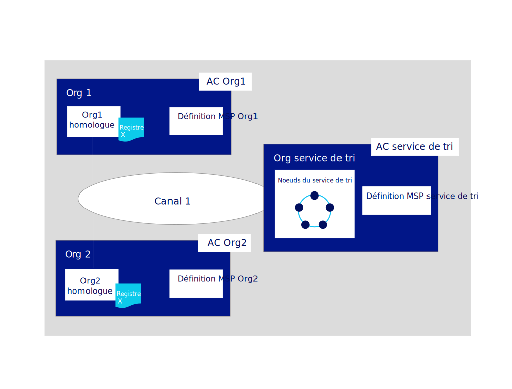
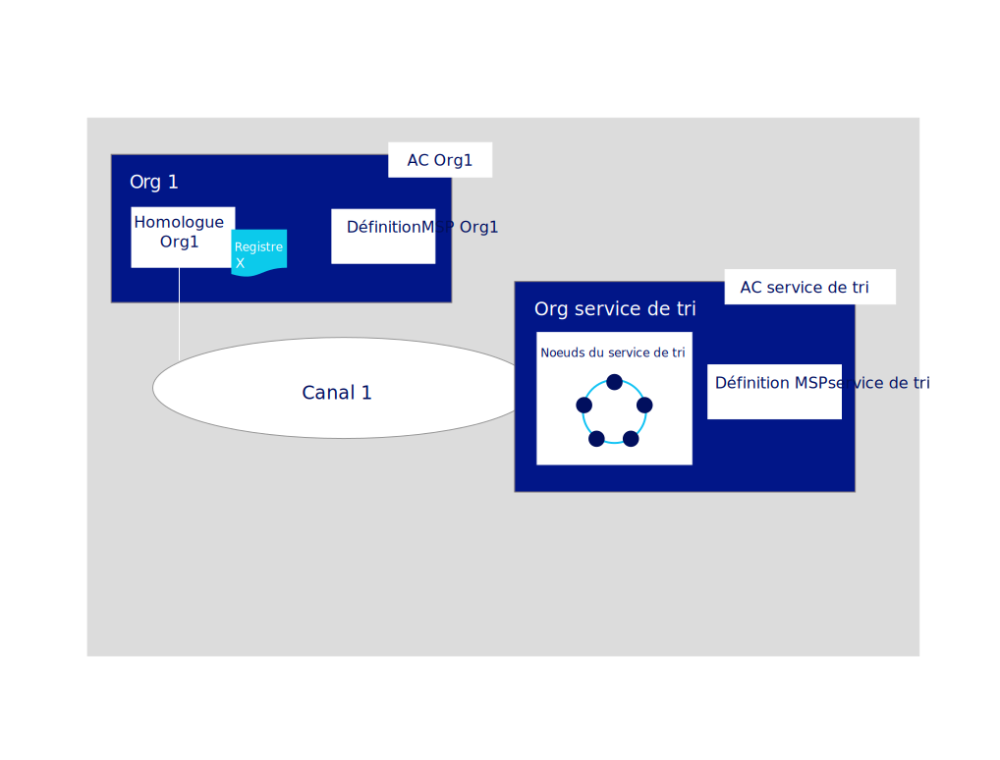

---

copyright:
  years: 2019
lastupdated: "2019-06-18"

keywords: getting started tutorials, create a CA, enroll, register, create an MSP, wallet, create a peer, create ordering service, Raft

subcollection: blockchain

---

{:external: target="_blank" .external}
{:shortdesc: .shortdesc}
{:screen: .screen}
{:codeblock: .codeblock}
{:note: .note}
{:important: .important}
{:tip: .tip}
{:pre: .pre}

# Tutoriel Générer un réseau
{: #ibp-console-build-network}

{{site.data.keyword.blockchainfull}} Platform est une offre de blockchain en tant que service qui vous permet de développer, déployer et exploiter des applications et des réseaux de blockchain. Vous pouvez en apprendre davantage sur les composants de blockchain et leur fonctionnement en consultant la section [Présentation du composant Blockchain](/docs/services/blockchain/blockchain_component_overview.html#blockchain-component-overview). Ce tutoriel est la première partie de la [série d'exemples de tutoriel réseau](/docs/services/blockchain/howto/ibp-console-build-network.html#ibp-console-build-network-sample-tutorial) ; il explique comment utiliser la console {{site.data.keyword.blockchainfull_notm}} Platform pour générer un réseau pleinement opérationnel sur un cluster Kubernetes déployé dans l'infrastructure de cloud de votre choix.
{:shortdesc}


Si vous utilisez la version d'essai bêta d'{{site.data.keyword.blockchainfull_notm}} Platform for {{site.data.keyword.cloud_notm}}, il est probable que certains panneaux sur votre console ne correspondront pas à ceux de la documentation actuelle, qui est mise à jour avec l'instance de service disponible globalement. Si vous utilisez une instance de service bêta et souhaitez bénéficier des toutes dernières fonctionnalités, nous vous encourageons à ce stade à mettre en service une instance de service disponible globalement en suivant les instructions de la section [Initiation à {{site.data.keyword.blockchainfull_notm}} Platform for {{site.data.keyword.cloud_notm}}](/docs/services/blockchain/howto/ibp-v2-deploy-iks.html#ibp-v2-deploy-iks).
{: important}

**Public cible :** Cette rubrique s'adresse aux opérateurs réseau qui sont responsables de la création, de la surveillance et de la gestion du réseau de blockchain.

Si vous n'avez pas déjà utilisé la console {{site.data.keyword.blockchainfull_notm}} Platform pour déployer des composants dans un cluster Kubernetes à l'aide d'{{site.data.keyword.cloud_notm}} Kubernetes Service, voir [Initiation à {{site.data.keyword.blockchainfull_notm}} Platform for {{site.data.keyword.cloud_notm}}](/docs/services/blockchain/howto/ibp-v2-deploy-iks.html#ibp-v2-deploy-iks), si vous utilisez un cluster {{site.data.keyword.cloud_notm}}, ou [Initiation à {{site.data.keyword.blockchainfull_notm}} Platform for Multicloud](/docs/services/blockchain/get-started-console-icp.html#get-started-console-icp), si vous utilisez {{site.data.keyword.cloud_notm}} Private pour déployer sur un fournisseur de cloud autre que {{site.data.keyword.cloud_notm}}. Notez que la console elle-même ne réside pas dans votre cluster. Il s'agit d'un outil que vous pouvez utiliser pour déployer des composants dans votre cluster.

Que vous déployiez des composants dans un cluster Kubernetes payant ou non, portez une attention particulière aux ressources à votre disposition lorsque vous choisissez de déployer des noeuds et de créer des canaux. Il est de votre responsabilité de gérer votre cluster Kubernetes et de déployer des ressources supplémentaires si nécessaire. Même si des composants peuvent être déployés dans un cluster {{site.data.keyword.cloud_notm}} gratuit, plus vous ajoutez de composants, plus lente sera leur exécution. Pour plus d'informations sur les dimensionnements de composant et sur la manière dont la console interagit avec votre cluster {{site.data.keyword.cloud_notm}} Kubernetes Service, voir [Allocation de ressources](/docs/services/blockchain/howto/ibp-console-govern.html#ibp-console-govern-iks-console-interaction).
Si vous utilisez {{site.data.keyword.cloud_notm}} Private pour le déploiement sur un fournisseur de cloud, vous devez consulter la documentation de ce fournisseur afin de savoir comment surveiller vos ressources.

## Série d'exemples de tutoriel réseau
{: #ibp-console-build-network-sample-tutorial}

Cette série de tutoriels en trois parties vous guide tout au long du processus de création et d'interconnexion d'un réseau Hyperledger Fabric à plusieurs noeuds relativement simple à l'aide de la console {{site.data.keyword.blockchainfull_notm}} Platform pour le déploiement d'un réseau dans votre cluster Kubernetes, ainsi que l'installation et l'instanciation d'un contrat intelligent. Notez que bien que ce tutoriel décrive le fonctionnement de ce processus avec un cluster {{site.data.keyword.cloud_notm}} Kubernetes payant, le même flux de base s'applique aux clusters gratuits, mais avec cependant quelques limitations (par exemple, vous ne pouvez pas dimensionner ou redimensionner des noeuds dans un cluster gratuit).

Le processus de création et de gestion des composants décrit dans ces tutoriels s'applique également aux déploiements sur d'autres fournisseurs de cloud utilisant {{site.data.keyword.cloud_notm}} Private.
{: important}

* **Générer un réseau ** : Ce tutoriel vous guide tout au long du processus d'hébergement d'un réseau par la création de deux organisations, la première pour votre homologue et la seconde pour votre service de tri, et d'un canal. Utilisez ce tutoriel si vous voulez former un consortium de blockchain en créant un noeud de service de tri et en ajoutant des organisations.
* [Rejoindre un réseau](/docs/services/blockchain/howto/ibp-console-join-network.html#ibp-console-join-network) : Ce tutoriel vous guide tout au long du processus permettant de rejoindre un réseau existant en créant un homologue et en le joignant à un canal existant. Utilisez ce tutoriel si vous ne prévoyez pas d'héberger un réseau en créant un service de tri, ou si vous voulez apprendre la procédure permettant de rejoindre d'autres réseaux.
* [Déployer un contrat intelligent sur le réseau](/docs/services/blockchain/howto/ibp-console-smart-contracts.html#ibp-console-smart-contracts) : Ce tutoriel explique comment écrire un contrat intelligent et comment le déployer sur un réseau.


### Structure de ce réseau
{: #ibp-console-build-network-structure}

Si vous effectuez toutes les étapes des tutoriels **Générer un réseau** et **Rejoindre un réseau**, votre réseau ressemblera à celui de l'illustration ci-dessous :



Cette configuration est suffisante à la fois pour les tests d'applications et de contrats intelligents et en tant que guide pour générer des composants et rejoindre des réseaux de production qui seront adaptés à votre propre cas d'utilisation. Le réseau comporte les composants suivants :

* **Deux organisations homologues** : `Org1` et `Org2`  
  La série de tutoriels décrit comment créer deux organisations homologues et deux homologues associés. Imaginez ces organisations sur un réseau de blockchain comme étant deux banques différentes qui doivent effectuer des transactions entre elles. Nous allons créer les définitions de `Org1` et `Org2`.
* **Une organisation de service de tri **: `Service de tri`  
  Comme nous générons un registre distribué, les homologues et les services de tri doivent faire partie d'organisations distinctes. Par conséquent, une organisation distincte est créée pour le service de tri. Entre autres choses, un service de tri trie les blocs de transactions qui sont envoyés aux homologues afin qu'ils puissent être écrits dans leurs registres et devenir la blockchain. Nous allons créer la définition de l'organisation `Service de tri`.
* **Trois autorités de certification**: `AC Org1, AC Org2, AC Service de tri`   
  Une AC (autorité de certification) est le noeud qui émet des certificats pour les utilisateurs et les noeuds associés à une organisation. Comme une meilleure pratique consiste à déployer une AC par organisation, nous déploierons trois AC au total : une pour chaque organisation homologue et une pour l'organisation de service de tri. Ces autorités de certification vont également créer la définition de chaque organisation, laquelle est encapsulée par un Membership Service Provider (Fournisseur de services aux membres). Une autorité de certification TLS est automatiquement déployée avec l'autorité de certification de chaque organisation et elle fournit les certificats TLS qui sont utilisés pour la communication entre les noeuds. Pour plus d'informations, voir [Utilisation de votre autorité de certification TLS](/docs/services/blockchain/howto/ibp-console-identities.html#ibp-console-identities-tlsca).
* **Un service de tri :** `Service de tri`  
  Alors que les déploiements s'exécutant sur un cluster payant ont la possibilité de déployer un service de tri à un noeud ou un service de tri tolérant aux pannes, les clusters gratuits ont comme unique possibilité d'exécuter un noeud simple. Le service de tri à cinq noeuds utilise une implémentation du protocole Raft (pour plus d'informations sur Raft, voir [The Ordering Service](https://hyperledger-fabric.readthedocs.io/en/release-1.4/orderer/ordering_service.html#raft){: external} et il s'agit de l'option de déploiement qui sera détaillée dans ce tutoriel. Actuellement, une seule organisation de service de tri par service de tri est prise en charge, quel que soit le nombre de noeuds de tri associés à cette organisation. Ce service de tri ajoutera des organisations homologues à son "consortium", qui est la liste des organisations homologues qui peuvent créer et rejoindre des canaux. Si vous voulez créer un canal dont les organisations sont déployées dans différents clusters, la plupart des réseaux de production étant structurés ainsi, l'admin de service de tri devra importer sur sa console une organisation homologue qui a été déployée sur une autre console. Cela permet à l'organisation homologue de rejoindre la canal qui est hébergé sur ce service de tri.
* **Deux homologues :** `Homologue Org1` et `Homologue Org2`  
  Le registre, `Registre x` dans l'illustration ci-dessus, est géré par des homologues distribués. Ces homologues sont déployés avec [Couch DB](https://hyperledger-fabric.readthedocs.io/en/release-1.4/couchdb_as_state_database.html){: external}) comme base de données d'état dans un conteneur distinct associé à l'homologue. Cette base de données contient la valeur actuelle de tous les "états" (représentés par des paires clé-valeur). Par exemple, supposons que `Org1` (la valeur) est le propriétaire actuel d'un actif de banque (la clé). La blockchain, liste des transactions, est stockée en local sur l'homologue.
* **Un canal **: `canal1`  
  Les canaux permettent à des groupes d'organisations d'effectuer des transactions sans exposer leurs données à des organisations qui ne sont pas membres du canal. Chaque canal a son propre registre, géré de manière collective par les homologues qui ont rejoint ce canal. Le tutoriel crée un canal rejoint par les deux organisations, et il indique comment instancier un contrat intelligent sur le canal que les organisations peuvent utiliser pour effectuer des transactions.

Cette configuration n'est pas obligatoire. {{site.data.keyword.blockchainfull_notm}} Platform est hautement personnalisable. Si des ressources sont disponibles dans votre cluster Kubernetes, vous pouvez utiliser la console pour déployer des composants dans un tableau sans fin de configurations. Ce tutoriel présente les étapes nécessaires à la génération de votre propre réseau, avec des références à des rubriques qui fournissent davantage d'informations sur {{site.data.keyword.blockchainfull_notm}} Platform et la console.

Dans ce tutoriel **Générer un réseau**, nous générons uniquement une partie du réseau ci-dessus, réseau simple qui peut être utilisé pour héberger un service de tri et une organisation homologue unique ainsi qu'un homologue sur un seul canal. L'illustration ci-après représente la partie du réseau ci-dessus que nous allons générer :


Cette configuration est utile pour une mise en route rapide et le test d'un contrat intelligent mais elle n'est pas très significative tant que vous n'avez pas ajouté d'autres organisations avec lesquelles effectuer des transactions, pour créer un réseau réellement distribué. Par conséquent, dans le tutoriel suivant intitulé [Rejoindre un réseau](/docs/services/blockchain/howto/ibp-console-join-network.html#ibp-console-join-network), nous vous montrons comment créer d'autres organisations homologues et d'autres homologues, et comment ajouter un nouvelle organisation au canal.

Tout au long de ce tutoriel, nous indiquons les **valeurs recommandées** pour les zones de la console. Les noms et les identités sont ainsi plus faciles à reconnaître dans les onglets et les listes déroulantes. Ces valeurs ne sont pas obligatoires, mais elles peuvent vous être utiles, en particulier dans la mesure où vous devrez mémoriser certaines valeurs telles que les ID et les secrets d'utilisateurs enregistrés que vous entrez dans les étapes précédentes. Comme ces valeurs ne sont pas stockées sur la console, si vous les oubliez, vous devrez enregistrer des utilisateurs supplémentaires et recommencer le processus. Nous fournissons un tableau de valeurs recommandées après chaque tâche et, si vous n'utilisez pas les valeurs recommandées, il est conseillé de bien noter vos valeurs avant de poursuivre ce tutoriel.
{:tip}

## Etape 1 : Créer une organisation homologue et un homologue
{: #ibp-console-build-network-create-peer-org1}

Pour chacune des organisations que vous voulez créer avec la console, vous devez déployer au moins une AC. Une AC est le noeud qui émet des certificats pour tous les participants du réseau (homologues, services de tri, clients, admin, et ainsi de suite). Ces certificats, qui incluent un certificat signataire et une clé privée, permettent aux participants d'un réseau de communiquer, de s'authentifier et enfin d'effectuer des transactions. Ces AC vont créer l'ensemble des identités et des certificats qui appartiennent à votre organisation, en plus de définir l'organisation elle-même. Vous pouvez ensuite utiliser ces identités pour déployer des noeuds, créer des identités admin et soumettre des transactions. Pour plus d'informations sur votre AC et les identités que vous allez devoir créer, voir [Gestion des identités](/docs/services/blockchain/howto/ibp-console-identities.html#ibp-console-identities).

Dans ce tutoriel, nous créons deux organisations, dont l'une détient un homologue et l'autre détient un service de tri. Chaque organisation a besoin d'une AC pour émettre ses certificats ; nous devons donc créer **deux AC**. Dans le cadre de ce tutoriel, **nous allons créer une seule AC à la fois**.

Regardez la [vidéo](http://ibm.biz/BlockchainPlatformSeries2){: external}ci-après pour en savoir plus sur le processus de création de l'homologue et sur l'homologue.


### Création de l'autorité de certification (AC) de votre organisation
{: #ibp-console-build-network-create-CA-org1CA}

Dans le cadre de ce tutoriel, votre AC émet les certificats et les clés privées pour les utilisateurs et les noeuds. Ces identités ne sont pas gérées par {{site.data.keyword.IBM_notm}} et les clés ne sont pas stockées sur la console. Elles sont uniquement stockées dans l'espace de stockage local de votre navigateur. Par conséquent, assurez-vous d'exporter vos identités et la définition MSP de votre organisation. Si vous essayez d'accéder à la console à partir d'une autre machine ou d'un navigateur différent, vous devez importer ces identités et définitions d'organisation.
{:important}

Pour créer l'autorité de certification qui va émettre des certificats pour votre première organisation, exécutez les étapes suivantes sur la console :

1. Accédez à l'onglet **Noeuds** sur la gauche et cliquez sur **Ajouter une autorité de certification**. Les panneaux latéraux vous permettent de personnaliser l'autorité de certification que vous voulez créer et l'organisation pour laquelle cette autorité de certification va émettre des clés.
2. Dans ce tutoriel, nous créons des noeuds ; vous devez donc vous assurer que l'option **Créer** une autorité de certification est sélectionnée. Ensuite, cliquez sur **Suivant**.
3. Utilisez le second panneau latéral pour affecter un **nom d'affichage** à votre autorité de certification. Notre valeur recommandée pour cette autorité de certification est `AC Org1`.
4. Sur le panneau suivant, affectez des données d'identification à l'admin de votre autorité de certification en indiquant l'**ID d'inscription de l'administrateur de l'autorité de certification** `admin` et le secret of `adminpw`. Encore une fois, il s'agit de **valeurs recommandées**.
5. Si vous utilisez un cluster payant, vous avez la possibilité de configurer l'allocation de ressource pour le noeud. Pour les besoins de ce tutoriel, acceptez toutes les valeurs par défaut et cliquez sur **Suivant**. Si vous souhaitez en savoir davantage sur l'allocation de ressources dans {{site.data.keyword.cloud_notm}} pour votre noeud, consultez la rubrique relative à l'[allocation de ressources](/docs/services/blockchain?topic=blockchain-ibp-console-govern#ibp-console-govern-allocate-resources). Si vous utilisez un cluster gratuit, vous voyez la page **Récapitulatif**.
6. Passez en revue la page Récapitulatif, puis cliquez sur **Ajouter une autorité de certification**.

**Tâche : Créer l'autorité de certification de l'organisation homologue**

  | **Zone** | **Nom d'affichage** | **ID d'inscription** | **Secret** |
  | ------------------------- |-----------|-----------|-----------|
  | **Créer une autorité de certification** | AC Org1  | admin | adminpw |

  *Figure 3. Création de l'autorité de certification de l'organisation homologue*

Une fois l'autorité de certification déployée, vous allez l'utiliser lors de la création de la définition MSP de votre organisation, de l'enregistrement des utilisateurs, ainsi que de vos **homologues**.

Les utilisateurs expérimentés ont peut-être déjà leur propre autorité de certification et ils ne souhaitent pas en créer une nouvelle sur la console. Si votre autorité de certification existant peut émettre des certificats au format `X.509`, vous pouvez utiliser votre propre autorité de certification externe au lieu d'en créer une nouvelle ici. Pour plus d'informations, consultez la rubrique relative à l'[utilisation de certificats d'une autorité de certification externe auprès de votre homologue ou service de tri](/docs/services/blockchain/howto/ibp-console-build-network.html#ibp-console-build-network-third-party-ca).

### Utilisation de votre autorité de certification pour enregistrer des identités
{: #ibp-console-build-network-use-CA-org1}

Chaque noeud ou application que vous souhaitez créer a besoin d'un certificat et d'une clé privée pour participer au réseau de blockchain. Vous devez également créer des identités admin pour ces noeuds et applications afin de pouvoir les gérer à partir de la console. Nous allons exécuter cette procédure deux fois, une fois pour chaque autorité de certification qui nous créons. Et pour chaque autorité de certification, vous allez créer deux identités :

* **Un admin d'organisation** : Cette identité vous permet d'exploiter des noeuds à l'aide de la console de plateforme.
* **Une identité homologue** : Il s'agit de l'identité de l'homologue lui-même. Chaque fois qu'un homologue effectue une action (par exemple, la validation d'une transaction) il se connecte à l'aide de son certificat.

Selon le type de votre cluster, le déploiement de l'autorité de certification peut prendre jusqu'à dix minutes. Lorsque l'autorité de certification est déployée pour la première fois, ou encore lorsqu'elle n'est pas disponible, la zone dans la vignette de l'autorité de certification devient grisée. Lorsque l'autorité de certification est déployée et opérationnelle, cette zone devient vert, ce qui indique qu'elle est "En cours d'exécution" et qu'elle peut être utilisée pour enregistrer des identités. Avant de passer aux étapes ci-dessous pour enregistrer des identités, vous devez attendre que l'autorité de certification passe à l'état "En cours d'exécution".
{:important}

Dès lors que l'autorité de certification est lancée, comme indiqué par la zone verte sur la vignette, générez ces certificats en procédant comme suit :

1. Cliquez sur `AC Org1` et vérifiez que l'identité `admin` que vous avez créée pour l'autorité de certification est visible dans le tableau. Ensuite, cliquez sur le bouton **Enregistrement d'utilisateur**.
2. Tout d'abord, nous enregistreront l'admin de l'organisation admin, en affectant pour cela un **ID d'inscription** `org1admin` et un **secret** `org1adminpw`. Ensuite, définissez le `Type` de cette identité sur `client` (les identités admin doivent toujours être enregistrées en tant que `client`, alors que les identités de noeud doivent toujours être enregistrées en utilisant le type `homologue`). Vous pouvez ignorer la zone **Nombre maximal d'inscriptions**. Si vous souhaitez en savoir davantage sur les inscriptions, voir [Enregistrement des identités](/docs/services/blockchain/howto/ibp-console-identities.html#ibp-console-identities-register). Cliquez sur **Suivant**.
3. Dans le cadre de ce tutoriel, nous n'avons pas à utiliser **Ajouter un attribut**. Si vous souhaitez en savoir plus sur les attributs d'identité, voir [Enregistrement des identités](/docs/services/blockchain/howto/ibp-console-identities.html#ibp-console-identities-register).
4. Une fois l'admin de l'organisation enregistré, recommencez ce même processus pour l'identité de l'homologue (en utilisant également `AC Org1`). Pour l'identité homologue, affectez l'ID d'inscription `peer1` et le secret `peer1pw`. Il s'agit d'une identité de noeud, vous devez donc sélectionner `homologue` comme **Type**. Vous pouvez ignorer la zone **Nombre maximal d'inscriptions** et, dans le panneau suivant, ne pas affecter d'**attributs**, comme préalablement.

L'enregistrement de ces identités auprès de l'autorité de certification est seulement la première étape de **création** d'une identité. Vous ne pourrez pas utiliser ces identités tant qu'elles ne sont pas **inscrites**. Pour l'partition de service de transfert the `org1admin`, cette opération a lieu lors de la création du MSP, ce que nous verrons à l'étape suivante. Dans le cas de l'homologue, cette opération a lieu lors de la création de ce dernier.
{:note}

**Tâche : Enregistrer des utilisateurs**

  |  **Zone** | **Description** | **ID d'inscription** | **Secret** |
  | ------------------------- |-----------|-----------|-----------|-----------|
  | **Enregistrer des utilisateurs** |  Admin Org1 | org1admin | org1adminpw |
  | | Identité de l'homologue |  peer1 | peer1pw |

  *Figure 4. Utilisation de votre autorité de certification pour enregistrer des utilisateurs*

### Création de la définition MSP d'une organisation homologue
{: #ibp-console-build-network-create-peers-org1}

A présent que nous avons créé l'autorité de certification de l'homologue et que nous l'avons utilisée pour **enregistrer** les identités pour l'admin `Org1` et pour l'homologue que nous allons associer à `Org1`, nous devons créer une définition formelle de l'organisation de l'homologue, laquelle est appelée MSP. Notez que de nombreux homologues peuvent appartenir à une organisation. **Vous n'êtes pas tenu de créer une nouvelle organisation chaque fois que vous créez un homologue**. Comme il s'agit de la première fois que nous déroulons ce tutoriel, nous allons créer l'ID MSP pour cette organisation. Pendant le processus de création du MSP, nous allons inscrire l'identité `org1admin` et l'ajouter à notre portefeuille.

1. Accédez à l'onglet **Organisations** dans la navigation de gauche et cliquez sur **Créer une définition de MSP**.
2. Affectez à votre MSP le nom d'affichage `Org1 MSP` et l'ID MSP `org1msp`. Si vous voulez indiquer votre propre ID MSP dans cette zone, assurez-vous de respecter les spécifications relatives aux limitations pour ce nom dans l'infobulle.
3. Sous **Détails d'autorité de certification racine**, indiquez l'autorité de certification homologue que vous avez utilisée pour enregistrer les identités à l'étape précédente. Si c'est la première fois que vous suivez ce tutoriel, vous ne devez voir qu'un seul : `AC Org1`.
4. Les zones **ID d'inscription** et **Secret d'inscription** ci-dessous sont remplies automatiquement avec l'ID d'inscription et le secret pour le premier utilisateur que vous avez créé avec votre autorité de certification : `admin` et `adminpw`. Toutefois, si cette identité est utilisée, votre organisation aurait la même identité que votre autorité de certification, ce qui n'est pas recommandé pour des raisons de sécurité. Au lieu de cela, sélectionnez l'ID d'inscription que vous avez créé pour votre administrateur d'organisation dans la liste déroulante, `org1admin`, et entrez le secret associé, `org1adminpw`. Ensuite, affectez à cette identité un nom d'affichage, `Org1 Admin`.
5. Cliquez sur le bouton **Générer** afin d'inscrire cette identité en tant qu'admin de votre organisation et exportez l'identité dans le portefeuille, où elle sera utilisée lors de la création de l'homologue et de la création de canaux.
6. Cliquez sur **Exporter** pour exporter les certificats admin sur votre système de fichiers. Comme nous l'avons dit plus haut, cette identité n'est pas stockée sur votre console ou gérée par {{site.data.keyword.IBM_notm}}. Elle est stockée uniquement dans l'espace de stockage de votre navigateur. Si vous changez de navigateur, vous devrez importer cette identité dans votre portefeuille afin de pouvoir administrer l'homologue.
7. Cliquez sur **Créer une définition de MSP**.

**Tâche : Créer la définition MSP de l'organisation homologue**

  |  | **Nom d'affichage** | **ID MSP** | **ID d'inscription**  | **Secret** |
  | ------------------------- |-----------|-----------|-----------|-----------|
  | **Créer une organisation** | MSP Org1 | org1msp |||
  | **Autorité de certification racine** | AC Org1 ||||
  | **Cert admin org** | |  | org1admin | org1adminpw |
  | **Identité** | Admin Org1 |||||

  *Figure 5. Création de la définition MSP d'une organisation homologue*

Une fois la définition MSP créée, vous devez voir l'admin de l'organisation homologue dans votre **portefeuille**, qui est accessible en cliquant sur **Portefeuille** dans la navigation de gauche.

**Tâche : Consulter le portefeuille**

  | **Zone** |  **Nom d'affichage** | **Description** |
  | ------------------------- |-----------|----------|
  | **Identité** | Admin Org1 | Identité admin Org1 |

  *Figure 6. Consultation de votre portefeuille*

Pour plus d'informations sur les définitions MSP, voir la rubrique relative à la [gestion des organisations](/docs/services/blockchain/howto/ibp-console-organizations.html#ibp-console-organizations).

L'exportation de l'identité de l'admin de votre organisation est importante car vous êtes responsable de la gestion et de la sécurisation de ces certificats. Si vous changez de navigateur, vous devrez importer cette identité, sinon vous ne pourrez pas administrer Org1.{:important}

### Création d'un homologue
{: #ibp-console-build-network-peer-create}

Une fois que vous avez [créé l'AC Org1](/docs/services/blockchain/howto/ibp-console-build-network.html#ibp-console-build-network-create-CA-org1CA), que vous l'avez utilisée pour enregistrer des identités, et que vous avez créé [Org1 MSP](/docs/services/blockchain/howto/ibp-console-build-network.html#ibp-console-build-network-create-peers-org1), vous êtes prêt(e) pour la création d'un homologue pour Org1.

#### Quel rôle jouent les homologues ?
{: #ibp-console-build-network-peer-role}

Il est important de garder à l'esprit que les organisations elles-mêmes ne gèrent pas les registres. Ce sont les homologues qui s'en chargent. Les organisations utilisent également des homologues pour signer des propositions de transaction et approuver des mises à jour de configuration de canal. Etant donné qu'avoir au moins deux homologues par organisation sur un canal les rend hautement disponibles, une meilleure pratique consiste à avoir au moins trois homologues par organisation qui ont rejoint un canal pour les implémentations de niveau production, car cela garantit une haute disponibilité même lorsqu'un homologue est arrêté à des fins de maintenance. Dans le cadre de ce tutoriel, nous allons voir uniquement le processus de création d'un seul homologue. Vous pouvez répliquer le processus afin de l'adapter à vos propres besoins métier.

Du point de vue de l'allocation de ressource, il est possible de joindre les mêmes homologues à plusieurs canaux. De par sa conception, l'homologue garantit que les données d'un canal ne peuvent pas passer dans un autre via l'homologue. Toutefois, étant donné que l'homologue va stocker un registre distinct pour chaque canal, il est nécessaire de s'assurer que l'homologue dispose de suffisamment de puissance de traitement et d'espace de stockage pour traiter la charge de transactions et de données.

#### Déploiement de votre homologue
{: #ibp-console-build-network-deploy-peer-role}

Utilisez votre console pour effectuer les étapes suivantes :

1. Sur la page **Noeuds**, cliquez sur **Ajouter un homologue**.
2. Assurez-vous que l'option **Créer** un homologue est sélectionnée. Ensuite, cliquez sur **Suivant**.
3. Affectez à votre homologue le **nom d'affichage** `Org1 homologue`. Pour les besoins de ce tutoriel, ne choisissez pas d'utiliser une autorité de certification externe pour votre homologue ; si vous souhaitez davantage d'informations, consultez la rubrique relative à l'[utilisation de certificats d'une autorité de certification externe](#ibp-console-build-network-third-party-ca). Cliquez sur **Suivant**.
4. A l'écran suivant, sélectionnez `AC Org1`, car il s'agit de l'autorité de certification que vous avez utilisée pour enregistrer l'identité de l'homologue. Sélectionnez l'**ID d'inscription** de l'identité d'homologue que vous avez créée pour votre homologue dans la liste déroulante, `peer1`, puis entrez le **secret** associé, `peer1pw`. Ensuite, sélectionnez `MSP Org1` dans la liste déroulante et cliquez sur **Suivant**.
5. Le panneau latéral suivant vous invite à entrer des informations sur l'autorité de certification TLS. Lors de la création de l'autorité de certification, une autorité de certification TLS a également été créée. Cette autorité de certification est utilisée pour créer les certificats de la couche de communication sécurisée pour les noeuds. Par conséquent, sélectionnez l'**ID d'inscription** de l'identité d'homologue que vous avez créée pour votre homologue dans la liste déroulante, `peer1`, puis entrez le **secret** associé, `peer1pw`. Le **nom d'hôte CSR TLS** est une option réservée aux utilisateurs expérimentés qui souhaitent indiquer un nom de domaine personnalisé qui peut être utilisé pour adresser le noeud final d'homologue. Les noms de domaine personnalisés ne sont pas inclus dans ce tutoriel, vous devez donc laisser à blanc la zone **Nom d'hôte CSR TLS** pour l'instant.
6. Le panneau latéral suivant vous invite à **Associer une identité** pour la définir en tant qu'admin de votre homologue. Dans le cadre de ce tutoriel, définissez votre organisation en tant qu'admin, `Admin Org1`, en tant qu'admin également de votre homologue. Il est possible d'enregistrer et d'inscrire une autre identité avec `AC Org1` et de créer l'identité de l'administrateur de votre poste, mais ce tutoriel utilise l'identité `Admin Org1`.
7. Si vous utilisez un cluster payant, sur le panneau suivant vous avez la possibilité de configurer l'allocation de ressource pour le noeud. Pour les besoins de ce tutoriel, vous pouvez accepter toutes les valeurs par défaut et cliquer sur **Suivant**. Si vous souhaitez en savoir davantage sur l'allocation de ressources dans {{site.data.keyword.cloud_notm}} pour votre noeud, consultez la rubrique relative à l'[allocation de ressources](/docs/services/blockchain?topic=blockchain-ibp-console-govern#ibp-console-govern-allocate-resources). Si vous utilisez un cluster {{site.data.keyword.cloud_notm}} gratuit, vous voyez la page **Récapitulatif**.
8. Passez en revue le récapitulatif et cliquez sur **Ajouter un homologue**.

**Tâche : Déployer un homologue**

  |  | **Nom d'affichage** | **ID MSP** | **ID d'inscription** | **Secret** |
  | ------------------------- |-----------|-----------|-----------|-----------|
  | **Créer un homologue** | Org1 homologue | org1msp |||
  | **AC** | AC Org1 ||||
  | **Identité de l'homologue** | |  | peer1 | peer1pw |
  | **Certificat d'administrateur** | org1msp ||||
  | **Autorité de certification TLS** | AC Org1 ||||
  | **ID autorité de certification TLS** | || peer1 | peer1pw |
  | **Associer une identité** | Admin Org1 |||||

  *Figure 7. Déploiement d'un homologue*

Dans un environnement de production, il est recommandé que chaque organisation déploie trois homologues pour chaque canal. Ces trois homologues peuvent être identiques qui ont joint des canaux ou des homologues différents. C'est à l'organisation de décider. Il s'agit ainsi de prévoir la mise hors service d'un homologue (par exemple, pendant un cycle de maintenance) tout en conservant une haute disponibilité des homologues. Pour déployer plusieurs homologue pour une organisation, utilisez la même autorité de certification que celle utilisée pour enregistrer votre première identité d'homologue. Dans ce tutoriel, il s'agirait de `AC Org1`. Ensuite, enregistrez une nouvelle identité d'homologue en utilisant un ID d'inscription et un secret distincts. Par exemple, `org1secondpeer` et `org1secondpeerpw`. Ensuite, lorsque vous créez l'homologue, attribuez-lui cet ID d'inscription et ce secret. Comme cet homologue est encore associé à Org1, choisissez `AC Org1`, `MSP Org1` et `Admin Org1` dans les listes déroulantes. Vous pouvez choisir d'affecter un autre admin à ce nouvel homologue, qui peut être enregistré et inscrit avec `CA Org1`, mais cela est facultatif. Cette série de tutoriel décrit uniquement le processus de création d'un seul homologue pour chaque organisation d'homologue.
{:tip}

## Etape 2 : Créer le service de tri
{: #ibp-console-build-network-create-orderer}

Dans d'autres blockchains distribuées, comme Ethereum et Bitcoin, il n'y a pas d'autorité centrale qui trie les transactions et les envoie aux homologues. Hyperledger Fabric, blockchain sur laquelle {{site.data.keyword.blockchainfull_notm}} Platform est basé, fonctionne différemment. Elle est dotée d'un noeud, ou d'un cluster de noeuds, appelé **service de tri**.

Le service de tri est un composant clé dans un réseau car il effectue quelques fonctions essentielles :

- Il **trie** littéralement les blocs de transactions qui sont envoyés aux homologues afin qu'ils puissent être écrits dans leurs registres. Ce processus est appelé "tri".
- Il gère le **canal du système de tri**, où résident le **consortium** et la liste des organisations autorisées à créer des canaux. Un consortium est essentiellement un véhicule multilocation et, de par sa conception, un seul service de tri peut héberger plusieurs consortia.
- Il **applique les règles** décidées par le consortium ou les administrateurs de canal. Ces règles dictent toutes les opérations, de la lecture ou l'écriture dans un canal, à qui peut créer ou modifier un canal. Par exemple, lorsqu'un participant du réseau demande à modifier un canal ou une règle de consortium, le service de tri traite la demande afin de déterminer si le participant a les droits d'administration appropriés pour la mise à jour de cette configuration, la valide par rapport à la configuration actuelle, génère une nouvelle configuration, puis la relaie aux homologues.

Pour plus d'informations sur les services de tri et le rôle qu'ils jouent dans les réseaux basés sur Hyperledger Fabric, voir [The Ordering Service](https://hyperledger-fabric.readthedocs.io/en/release-1.4/orderer/ordering_service.html){: external}.

Dans un cluster payant, vous avez la possibilité de créer un service de tri à un noeud (suffisant à des fins de tests) et un service de tri tolérant aux pannes doté de cinq noeuds liés à une seule organisation. Dans un cluster gratuit, vous pouvez uniquement créer un service de tri à un seul noeud. Dans le cadre de ce tutoriel, nous allons décrire le service de tri à cinq noeuds.

Toutefois, comme avec l'homologue, avant de créer un service de tri, nous devons créer une autorité de certification pour fournir les identités et les MSP de l'organisation de notre service de tri.

Regardez la [vidéo](http://ibm.biz/BlockchainPlatformSeries3){: external} suivante pour en savoir plus sur le processus de création de l'organisation du service de tri et sur le service de tri.

### Tri sur la console
{: #ibp-console-build-network-ordering-console}

Dans cette édition, les services de tri distribués, dans lesquels plusieurs organisations contribuent avec des noeuds dans un service de tri, ne sont pas pris en charge. Chaque noeud de tri du service de tri est administré par une seule organisation.

Le service de tri de niveau production disponible est un service tri tolérant aux pannes reposant sur l'implémentation du protocole Raft dans `etcd`. Le service de tri Raft suit un modèle de type “leader and follower” (principal et suiveur) dans lequel un noeud principal est choisi (par canal) et ses décisions sont répliquées par les suiveurs. Les services de tri Raft doivent être plus faciles à configurer et à gérer que les services de tri basés sur Kafka et leur conception permet à différentes organisations de contribuer avec des noeuds à un service de tri distribué. Pour plus d'informations sur le protocole Raft, voir [The Ordering Service](https://hyperledger-fabric.readthedocs.io/en/release-1.4/orderer/ordering_service.html#raft){: external}.

Actuellement, la seule configuration de noeuds de tri tolérante aux pannes disponible est celle composée de **cinq** noeuds. Bien qu'il soit possible de créer un service de tri tolérant aux pannes avec seulement trois noeuds, une telle configuration présente des risques. Si un noeud tombe en panne, par exemple pendant un cycle de maintenance, il resterait seulement deux noeuds. Si un autre noeud était perdu au cours de ce cycle **pour une raison quelconque**, il resterait un seul noeud. Dans ces conditions, avec un service de tri de noeud alors que vous aviez démarré avec trois, vous n'auriez plus une majorité de noeuds disponibles (ou "quorum"). En l'absence de quorum, aucune transaction ne peut être appliquée. Le canal cesserait de fonctionner.

Avec cinq noeuds, vous pouvez perdre deux noeuds et maintenir encore un quorum, ce qui signifie que vous pouvez supporter un cycle de maintenance tout en conservant une haute disponibilité. Par conséquent, les clusters payants offrent uniquement le choix entre un noeud et cinq noeuds. Les réseaux de production doivent choisir l'option de cinq noeuds, car un service de tri de noeud n'est pas, par définition, tolérant aux pannes.

Dans le cadre de ce tutoriel, nous allons créer un service de tri à cinq noeuds.

### Création de l'autorité de certification (AC) de l'organisation de votre service de tri
{: #ibp-console-build-network-create-orderer-ca}

Le processus de création d'une autorité de certification pour un service de tri est identique à la création pour un homologue.

1. Accédez à l'onglet **Noeuds** et cliquez sur **Ajouter une autorité de certification**.
2. Dans ce tutoriel, nous créons des noeuds ; vous devez donc vous assurer que l'option **Créer** une autorité de certification est sélectionnée. Cliquez ensuite sur **Suivant**
3. Attribuez un nom d'affichage unique à cette autorité de certification, `AC service de tri`.
4. Vous pouvez si vous le souhaitez réutiliser l'**ID d'inscription de l'administrateur de l'autorité de certification**, `admin`, et le secret `adminpw`. Comme il s'agit d'une autorité de certification différente, cette identité est distincte de l'identité admin de l'autorité de certification créée pour `Org1 CA`, même si l'ID et le secret sont identiques.
5. Si vous utilisez un cluster payant, sur le panneau suivant vous avez la possibilité de configurer l'allocation de ressource pour l'autorité de certification. Pour les besoins de ce tutoriel, acceptez toutes les valeurs par défaut et cliquez sur **Suivant**. Si vous souhaitez en savoir davantage sur l'allocation de ressources dans {{site.data.keyword.cloud_notm}} pour votre noeud, consultez la rubrique relative à l'[allocation de ressources](/docs/services/blockchain?topic=blockchain-ibp-console-govern#ibp-console-govern-allocate-resources). Si vous utilisez un cluster gratuit, vous voyez la page **Récapitulatif**.
6. Passez en revue la page Récapitulatif, puis cliquez sur **Ajouter une autorité de certification**.

Comme avec l'homologue, les utilisateurs expérimentés ont peut-être déjà leur propre autorité de certification et ils ne souhaitent pas en créer une nouvelle sur la console. Si votre autorité de certification existant peut émettre des certificats au format `X.509`, vous pouvez utiliser votre propre autorité de certification externe au lieu d'en créer une nouvelle ici. Pour plus d'informations, consultez la rubrique relative à l'[utilisation de certificats d'une autorité de certification externe auprès de votre homologue ou service de tri](/docs/services/blockchain/howto/ibp-console-build-network.html#ibp-console-build-network-third-party-ca).

### Utilisation de votre autorité de certification pour enregistrer les identités admin d'un noeud de service de tri et d'un service de tri
{: #ibp-console-build-network-use-CA-orderer}

Comme nous l'avons fait avec l'homologue, nous devons enregistrer deux identités auprès de l'autorité de certification de notre service de tri. Une fois l'autorité de certification sélectionnée, vous devrez enregistrer un admin pour l'organisation de notre service de tri, ainsi qu'une identité pour le service de tri lui-même. Comme précédemment, vous devez voir une identité sous l'onglet `CA service de tri` ; il s'agit de l'administrateur que vous avez créé pour l'autorité de certification.

Selon le type de votre cluster, le déploiement de l'autorité de certification peut prendre jusqu'à dix minutes. Lorsque l'autorité de certification est déployée pour la première fois, ou encore lorsqu'elle n'est pas disponible, la zone dans la vignette de l'autorité de certification devient grisée. Lorsque l'autorité de certification est déployée et opérationnelle, cette zone devient vert, ce qui indique qu'elle est "En cours d'exécution" et qu'elle peut être utilisée pour enregistrer des identités. Avant de passer aux étapes ci-dessous pour enregistrer des identités, vous devez attendre que l'autorité de certification passe à l'état "En cours d'exécution".
{:important}

Dès lors que l'autorité de certification est lancée, comme indiqué par la zone verte sur la vignette pour `AC Service de tri`, générez ces certificats en procédant comme suit :

1. Cliquez sur `Service de tri` dans l'onglet **Noeuds** et vérifiez que l'identité `admin` que vous avez créée pour l'autorité de certification est visible dans le tableau. Ensuite, cliquez sur le bouton **Enregistrement d'utilisateur**.
2. Tout d'abord, nous enregistreront l'admin de l'organisation admin, en affectant pour cela un **ID d'inscription** `OSadmin` et un **secret** `OSadminpw`. Ensuite, définissez le `Type` de cette identité sur `client` (les identités admin doivent toujours être enregistrées en tant que `client`, alors que les identités de noeud doivent toujours être enregistrées en utilisant le type `homologue`). Vous pouvez ignorer la zone **Nombre maximal d'inscriptions**. Si vous souhaitez en savoir davantage sur les inscriptions, voir [Enregistrement des identités](/docs/services/blockchain/howto/ibp-console-identities.html#ibp-console-identities-register). Cliquez sur **Suivant**.
3. Dans le cadre de ce tutoriel, nous n'avons pas à utiliser **Ajouter un attribut**. Si vous souhaitez en savoir plus sur les attributs d'identité, voir [Enregistrement des identités](/docs/services/blockchain/howto/ibp-console-identities.html#ibp-console-identities-register).
4. Une fois l'admin de l'organisation enregistré, recommencez ce même processus pour l'identité du service de tri (en utilisant également `AC Service de tri`). Pour les identités du noeud de service de tri, affectez l'ID d'inscription `OS1` et le secret `OS1pw`. Il s'agit d'une identité de noeud, vous devez donc sélectionner `homologue` comme **Type**. Vous pouvez ignorer la zone **Nombre maximal d'inscriptions** et, dans le panneau suivant, ne pas affecter d'**attributs**, comme préalablement.

**Tâche : Créer une autorité de certification et enregistrer des utilisateurs**

  | **Zone** | **Description** | **ID d'inscription** | **Secret** |
  | ------------------------- |-----------|-----------|-----------|-----------|
  | **Créer une autorité de certification** | AC Service de tri | admin | adminpw |
  | **Enregistrer des utilisateurs** | Admin Service de tri | OSadmin | OSadminpw |
  |  | Identité du noeud de service de tri |  OS1 | OS1pw |

*Figure 8. Création d'une autorité de certification et enregistrement des utilisateurs*

Dans le cadre de ce tutoriel, nous créons seulement une identité de noeud. Cette identité sera utilisée par les cinq noeuds que nous allons déployer pour créer le service de tri. Même si vous ne voulez pas effectuer une telle opération dans un service de tri à plusieurs organisations, cela est acceptable car tous les noeuds de tri sont détenus par la même organisation.

### Création de la définition MSP d'une organisation de service de tri
{: #ibp-console-build-network-create-orderer-org-msp}

Créez la définition MSP de votre organisation de service de tri et indiquez l'identité admin pour l'organisation. Une fois que nous avons enregistré l'admin du service de tri et les utilisateurs du service de tri, nous devons créer l'ID MSP et enregistrer l'utilisateur `OSadmin` que nous avons enregistré en tant qu'admin de votre organisation.

1. Accédez à l'onglet **Organisations** dans la navigation de gauche et cliquez sur **Créer une définition de MSP**.
2. Affectez à votre MSP le nom d'affichage `MSP Service de tri` et l'ID MSP `osmsp`. Si vous choisissez un ID MSP différent, assurez-vous de respecter les spécifications relatives aux limitations pour ce nom dans l'infobulle.
3. Sous **Détails d'autorité de certification racine**, sélectionnez l'autorité de certification `AC Service de tri` que nous avons créée.
4. Les zones **ID d'inscription** et **Secret d'inscription** ci-dessous sont remplies automatiquement avec l'ID d'inscription et le secret pour le premier utilisateur que vous avez créé avec votre autorité de certification : `admin` et `adminpw`. Toutefois, si cette identité est utilisée, votre organisation aurait la même identité que votre autorité de certification, ce qui n'est pas recommandé pour des raisons de sécurité. Au lieu de cela, sélectionnez l'ID d'inscription que vous avez créé pour votre admin d'organisation dans la liste déroulante, `OSadmin`, et entrez le secret associé, `OSadminpw`. Ensuite, affectez à cette identité un nom d'affichage, `Admin Service de tri`.
5. Cliquez sur le bouton **Générer** afin d'inscrire cette identité en tant qu'admin de votre organisation et exportez l'identité dans le portefeuille.
6. Cliquez sur **Exporter** pour exporter les certificats admin sur votre système de fichiers. Comme nous l'avons dit plus haut, cette identité n'est pas stockée sur votre console ou gérée par {{site.data.keyword.IBM_notm}}. Elle est stockée uniquement dans votre navigateur. Si vous changez de navigateur, vous devrez importer cette identité afin de pouvoir administrer le service de tri.
7. Cliquez sur **Créer une définition de MSP**.

**Tâche : Créer la définition MSP de l'organisation du service de tri**

  |  | **Nom d'affichage** | **ID MSP** | **ID d'inscription**  | **Secret** |
  | ------------------------- |-----------|-----------|-----------|-----------|
  | **Créer une organisation** | MSP Service de tri | osmsp |||
  | **Autorité de certification racine** | AC Service de tri ||||
  | **Cert admin org** | |  | OSadmin | OSadminpw |
  | **Identité** | Admin Service de tri |||||

  *Figure 9. Création de la définition MSP de l'organisation du service de tri*

Une fois la définition MSP créée, vous devez voir l'admin de l'organisation du service de tri dans votre **portefeuille**, lequel est accessible en cliquant sur **Portefeuille** dans la navigation de gauche.

**Tâche : Consulter le portefeuille**

  | **Zone** |  **Nom d'affichage** | **Description** |
  | ------------------------- |-----------|----------|
  | **Identité** | Admin Org1 | Identité admin Org1 |
  | **Identité** | Admin Service de tri | Identité admin Service de tri |

  *Figure 10. Création de la définition MSP d'une organisation de service de tri*

Pour plus d'informations sur les définitions MSP, voir la rubrique relative à la [gestion des organisations](/docs/services/blockchain/howto/ibp-console-organizations.html#ibp-console-organizations).

L'exportation de l'identité de l'admin de votre organisation est importante car vous êtes responsable de la gestion et de la sécurisation de ces certificats. Si vous exportez le noeud de service de tri et la définition de MSP du service de tri, ceux-ci peuvent être importés sur une autre console où un autre opérateur peut créer de nouveaux canaux sur le service de tri ou joindre des homologues au canal.
{:important}

### Déploiement des noeuds de service
{: #ibp-console-build-network-create-an-orderer}

Procédez comme suit depuis votre console :

1. Sur la page **Noeuds**, cliquez sur **Ajouter un service de tri**.
2. Assurez-vous que l'option **Créer** un service de tri est sélectionnée. Ensuite, cliquez sur **Suivant**.
3. Affectez à votre service de tri le **Nom d'affichage** of `Service de tri` et, si vous utilisez un cluster payant, indiquez si vous voulez que votre service de tri comporter un noeud (suffisant pour des tests) ou cinq noeuds (approprié en production). Choisissez **Cinq noeuds**. Ne choisissez pas d'utiliser une autorité de certification externe. Il s'agit d'une option avancée. Pour les besoins de ce tutoriel, ne choisissez pas d'utiliser une autorité de certification externe pour votre service de tri ; si vous souhaitez davantage d'informations, consultez la rubrique relative à l'[utilisation de certificats d'une autorité de certification externe](#ibp-console-build-network-third-party-ca). Cliquez sur **Suivant**.
4. Sur le panneau suivant, sélectionnez `AC Service de tri` comme autorité de certification. Ensuite, sélectionnez l'**ID d'inscription** de l'identité de noeud que vous avez créée pour votre service de tri dans la liste déroulante, `OS1`, puis entrez le secret associé **secret**, `OS1pw`. Ensuite, sélectionnez votre MSP, `MSP Service de tri` dans la liste déroulante.
5. Le panneau latéral suivant vous invite à entrer des informations sur l'autorité de certification TLS. Lors de la création de l'autorité de certification, une autorité de certification TLS a également été créée. Cette autorité de certification est utilisée pour créer les certificats de la couche de communication sécurisée pour les noeuds. Par conséquent, sélectionnez l'**ID d'inscription** de l'identité du service de tri que vous avez créée dans la liste déroulante, `OS1`, puis entrez le **secret** associé, `OS1pw`. Le **nom d'hôte CSR TLS** est une option réservée aux utilisateurs expérimentés qui souhaitent indiquer un nom de domaine personnalisé qui peut être utilisé pour adresser le noeud final de service de tri. Les noms de domaine personnalisés ne sont pas inclus dans ce tutoriel, vous devez donc laisser à blanc la zone **Nom d'hôte CSR TLS** pour l'instant.
6. L'étape **Associer une identité** vous permet de choisir un admin pour votre service de tri. Sélectionnez `Admin Service de tri` comme précédemment et cliquez sur **Suivant**.
7. Si vous utilisez un cluster payant, sur le panneau suivant vous avez la possibilité de configurer l'allocation de ressource pour le noeud. Pour les besoins de ce tutoriel, vous pouvez accepter toutes les valeurs par défaut et cliquer sur **Suivant**. Les sélections que vous effectuez ici s'appliquent aux cinq noeuds de tri. Si vous souhaitez en savoir davantage sur l'allocation de ressources dans {{site.data.keyword.cloud_notm}} pour votre noeud, consultez la rubrique relative à l'[allocation de ressources](/docs/services/blockchain?topic=blockchain-ibp-console-govern#ibp-console-govern-allocate-resources). 
7. Passez en revue la page Récapitulatif et cliquez sur **Ajouter un service de tri**.

**Tâche : Créer un service de tri**

  |  | **Nom d'affichage** | **ID MSP** | **ID d'inscription** | **Secret** |
  | ------------------------- |-----------|-----------|-----------|-----------|
  | **Création d'un service de tri** | Service de tri | osmsp |||
  | **AC** | AC Service de tri ||||
  | **Identité du service de tri** | |  | OS1 | OS1pw |
  | **Certificat d'administrateur** | MSP Service de tri ||||
  | **Autorité de certification TLS** | AC Service de tri ||||
  | **ID autorité de certification TLS** | || OS1 | OS1pw |
  | **Associer une identité** | Admin Service de tri |||||

  *Figure 11. Création d'un service de tri*

Une fois le service de tri créé, vous pouvez le voir dans le panneau **Noeuds**.

## Etape 3 : Joindre le consortium hébergé par le service de tri
{: #ibp-console-build-network-add-org}

Comme nous l'avons mentionné précédemment, une organisation homologue doit être connue du service de tri pour pouvoir créer ou rejoindre un canal (également appelé rejoindre un "consortium", qui est la liste des organisations connues du service de tri). Ceci est dû au fait que les canaux sont, a un niveau technique, des **chemins de messagerie** entre homologues via le service de tri. De la même manière qu'un homologue peut être joint à plusieurs canaux sans la transmission d'informations d'un canal à un autre, un service de tri peut également avoir plusieurs canaux qui s'exécutent en son sein sans que les données soient exposées à des organisations sur d'autres canaux.

Etant donné que seuls les admin de service de tri peuvent ajouter des organisations homologues au consortium, vous devrez **être** l'admin du service de tri ou vous devez **envoyer** les informations MSP à l'admin du service de tri.

Regardez la [vidéo](http://ibm.biz/BlockchainPlatformSeries4){: external} ci-après pour en savoir plus sur le processus d'ajout de l'organisation au consortium, de création du canal et sur le processus permettant de joindre votre homologue au canal.

Comme vous avez créé l'admin du service de tri à partir de la console, ce processus est relativement simple :
1. Accédez à l'onglet **Noeuds**.
2. Faites défiler jusqu'au service de tri que vous avez créé et cliquez sur ce dernier pour l'ouvrir.
3. Sous **Membres du consortium**, cliquez sur **Ajouter une organisation**.
4. Dans la liste déroulante, sélectionnez `MSP Org1`, car il s'agit du MSP qui représente l'organisation de l'homologue : `Org1`.
5. Cliquez sur **Ajouter une organisation**.

Une fois ce processus terminé, il est possible pour `Org1` de créer ou de rejoindre un canal hébergé sur votre `Service de tri`. 

Dans ce tutoriel, nous pouvons facilement accéder à `MSP Org1` car l'organisation homologue et l'organisation du service de tri ont été créés sur la même console. Dans un scénario de production, les définitions MSP d'autres organisations seraient créées par différents opérateurs réseau dans leur propre cluster à l'aide de leur propre console {{site.data.keyword.blockchainfull_notm}}. Dans ces cas, lorsque l'organisation souhaite rejoindre votre consortium, la définition MSP de l'organisation doit être envoyée à votre console dans une opération hors bande. De plus, vous devrez exporter votre service de tri et l'envoyer afin qu'il puisse être importé sur la console et joindre un homologue à un canal (ou créer un nouveau canal). Ce processus est décrit dans le tutoriel Joindre un réseau, sous [Exportation des informations de votre organisation](/docs/services/blockchain/howto/ibp-console-join-network.html#ibp-console-join-network-add-org2-remote).

## Etape 4 : Créer un canal
{: #ibp-console-build-network-create-channel}

Pour plus d'informations sur la mise à jour d'un canal, voir [Mise à jour d'une configuration de canal](/docs/services/blockchain/howto/ibp-console-govern.html#ibp-console-govern-update-channel).

Bien que les membres d'un réseau soient généralement des entités métier connexes qui souhaitent effectuer des transactions entre elles, il peut arriver que des sous-ensembles de membres souhaitent effectuer des transactions sans avoir connaissance des autres. Cela est possible en créant un **canal** sur lequel auront lieu ces transactions. Les canaux répliquent la structure d'un réseau de blockchain en ce sens qu'ils contiennent des membres, des homologues, un service de tri, un registre, des règles et des contrats intelligents. Mais en limitant l'appartenance, et même la connaissance du canal, à des sous-ensembles particuliers de l'appartenance réseau, les canaux offrent aux membres du réseau la garantie d'optimiser la structure globale du réseau tout en maintenant la confidentialité, lorsque nécessaire.

Comme indiqué précédemment, pour joindre un homologue de `Org1` à un canal, `Org1` doit d'abord être ajouté au consortium. Si l'organisation n'est pas membre du consortium au moment de la création du canal, il est possible de créer le canal et d'ajouter l'organisation ultérieurement en cliquant sur le bouton **Paramètres** sur la page du canal concerné et en passant par le flux **Mettre à jour un canal**.

Pour plus d'informations sur les canaux et leur utilisation, consultez la [documentation Hyperledger Fabric](https://hyperledger-fabric.readthedocs.io/en/release-1.4/channels.html){: external}.

Regardez la vidéo 3 ci-dessus pour en savoir plus sur le processus permettant de créer un canal et d'ajouter votre homologue au canal.


<!--
Note that even though the {{site.data.keyword.blockchainfull_notm}} Platform 2.0 uses Hyperledger Fabric v1.4 binaries, because the [gossip protocol](https://hyperledger-fabric.readthedocs.io/en/release-1.4/gossip.html){: external} is not being used with the console, Fabric functionalities that leverage gossip, such as [Private Data](https://hyperledger-fabric.readthedocs.io/en/release-1.4/private-data/private-data.html){: external} and [Service Discovery](https://hyperledger-fabric.readthedocs.io/en/release-1.4/discovery-overview.html){: external}, are not available.
-->

### Création d'un canal : `canal1`
{: #ibp-console-build-network-create-channel1}

Comme la console utilise des homologues pour collecter des informations sur les canaux auxquels appartiennent les homologues, **à moins qu'une organisation n'ait joint un homologue à un canal, elle ne peut pas interagir avec le canal**.

Lorsque vous avez créé vos autorités de certification, identités, MSP, un service de tri, un homologue, et que vous avez ajouté votre organisation homologue au consortium, accédez à l'onglet **Canaux** dans le panneau de navigation de gauche. C'est à cet endroit que peuvent être effectuées les opérations de création et de gestion de canal.

La première fois que vous accédez à cet onglet, il doit être vide sauf pour les boutons **Créer un canal** et **Joindre canal**. Ceci est dû au fait que vous n'avez pas créé un canal et encore joint un homologue à celui-ci.

#### Création du canal
{: #ibp-console-build-network-channels-create}

Procédez comme suit depuis votre console :

1. Accédez à l'onglet **Canaux**. 
2. Cliquez sur **Créer un canal**. Un panneau latéral s'ouvre.
3. Attribuez au canal un **nom**, `canal1`. Notez cette valeur car vous devrez la partager avec quiconque souhaite rejoindre ce canal.
4. Sélectionnez `Service de tri` dans la liste déroulante.
5. Choisissez les **Organisations** qui feront partie de ce canal. Comme nous n'avons créé qu'une seule organisation, il s'agira de `MSP Org1 (org1msp)`. Définissez cette organisation en tant qu'**Opérateur**. Remarque : N'utilisez pas le `MSP Service de tri` ici.
6. Choisissez une **Règle de mise à jour du canal** pour le canal. Il s'agit de la règle qui indiquera combien d'organisations doivent approuver les mises à jour de la configuration du canal. Comme ce tutoriel ne concerne que la création d'une seule organisation, cette règle doit être `1 de 1`. Lorsque vous ajoutez des organisations pour le canal, vous devez modifier cette règle pour refléter les besoins de votre cas d'utilisation. Une norme raisonnable consiste à utiliser une majorité d'organisations. Par exemple, `3 de 5`.
7. Indiquez les limitations de **contrôle d'accès** que vous voulez appliquer. Remarque : il s'agit d'une **option avancée**. Si vous définissez l'accès à une ressource à une organisation spécifique, sachez que cela restreindra l'accès à cette ressource pour tout autre organisation du canal. Par exemple, si l'accès par défaut pour une ressource particulière est `Lecteurs` de toutes les organisations, et que l'accès est défini sur `Admin` de `Org1`, alors **seul** Admin de Org1 aura accès à cette ressource. Comme l'accès à certaines ressources est essentiel au bon fonctionnement d'un canal, il est fortement recommandé de prendre des décisions de contrôle d'accès avec précaution. Si vous décidez de limiter l'accès à une ressource, assurez-vous que l'accès à cette ressource est ajouté, si nécessaire, pour chaque organisation.
8. Sélectionnez l'**Organisation qui crée le canal**. Comme la console permet que plusieurs organisations soient détenues par un seul utilisateur, il est nécessaire de spécifier l'organisation qui crée le canal. Ce tutoriel étant limité à la création d'une seule organisation, choisissez `MSP Org1` (org1msp) dans la liste déroulante. De même, choisissez `Admin Org1` comme identité créant le canal.

Lorsque vous êtes prêt(e), cliquez sur **Créer un canal**.Vous devez retourner à l'onglet **Canaux** et vous pouvez voir une vignette en attente du canal que vous venez de créer.

**Tâche : Créer un canal**

  |  **Zone** | **Nom** |
  | ------------------------- |-----------|
  | **Nom de canal** | canal1 |
  | **Service de tri** | Service de tri |
  | **Organisations** | MSP Org1 |
  | **Règle de mise à jour du canal** | 1 de 1 |
  | **Liste de contrôle d'accès** | Aucune |
  | **Organisation qui crée le canal** | MSP Org1 |
  | **Identité du portefeuille** | Admin Org1|

*Figure 12. Création d'un canal*

L'étape suivante consiste à joindre un homologue à ce canal.

## Etape 5 : Joindre votre homologue au canal
{: #ibp-console-build-network-join-peer}

Nous avons presque terminé. Joindre l'homologue au canal est la dernière étape de configuration de l'infrastructure de base pour votre réseau. Si ce n'est déjà fait, accédez à l'onglet **Canaux** dans la navigation de gauche.

Procédez comme suit depuis votre console :

1. Cliquez sur la vignette en attente pour `canal1` afin de lancer le panneau latéral.
2. Sélectionnez les homologues qui doivent rejoindre le canal. Pour les besoins de ce tutoriel, cliquez sur `Org1 homologue`.
3. Cliquez sur **Joindre un canal**.

## Etapes suivantes
{: #ibp-console-build-network-next-steps}

Une fois que vous avez créé et joint votre homologue à un canal, vous disposez d'un réseau de blockchain de base pleinement opérationnel. Utilisez les étapes suivantes pour déployer un contrat intelligent et commencer à soumettre des transactions :

- [Déployer un contra t intelligent sur votre réseau](/docs/services/blockchain/howto/ibp-console-smart-contracts.html#ibp-console-smart-contracts) à l'aide de la console.
- Une fois que vous avez installé et instancié votre contrat intelligent, vous pouvez [soumettre des transactions à l'aide de votre application client](/docs/services/blockchain/howto/ibp-console-smart-contracts.html#ibp-console-smart-contracts-connect-to-SDK).
- Utilisez [l'exemple de document commercial](/docs/services/blockchain/howto/ibp-console-create-app.html#ibp-console-app-commercial-paper) pour déployer un exemple de contrat intelligent et soumettre des transactions à l'aide d'un exemple de code d'application.

Vous pouvez également créer une autre organisation homologue à l'aide du [tutoriel Rejoindre un réseau](/docs/services/blockchain/howto/ibp-console-join-network.html#ibp-console-join-network-structure). Vous pouvez ajouter la deuxième organisation à votre canal pour simuler un réseau distribué, avec deux homologues qui partagent un seul registre de canal.

## Utilisation de certificats d'une autorité de certification externe avec votre homologue ou service de tri
{: #ibp-console-build-network-third-party-ca}

Au lieu d'utiliser une autorité de certification {{site.data.keyword.blockchainfull_notm}} Platform comme autorité de certification de votre homologue ou service de tri, vous pouvez utiliser les certificats d'une autorité de certification externe, qui n'est pas hébergée par {{site.data.keyword.IBM_notm}}, dès lors que cette autorité de certification émet des certificats au format [X.509](https://hyperledger-fabric.readthedocs.io/en/release-1.4/identity/identity.html#digital-certificates){: external}.

### Avant de commencer
{: #ibp-console-build-network-third-party-ca-prereq}

1. Vous devez collecter les informations de certificat suivantes et les sauvegarder dans des fichiers individuels qui peuvent être envoyés par téléchargement sur la console.   
**Remarque :** Les certificats figurant dans les fichiers peuvent être au format `PEM` ou `base64 encoded`.
 * **Certificat d'identité d'homologue ou de service de tri** Il s'agit du certificat signataire de votre autorité de certification externe qui sera utilisé par l'homologue ou le service de tri.
 * **Clé privée d'identité d'homologue ou de service de tri** Il s'agit de votre clé privée qui correspond au certificat signé de votre autorité de certification tierce qui sera utilisé par l'homologue ou le service de tri.
 * **Définition MSP d'organisation de l'homologue ou du service de tri** Vous devez générer manuellement ce fichier à l'aide des instructions fournies dans la section [Génération manuelle d'un fichier JSON MSP](/docs/services/blockchain/howto/ibp-console-organizations.html#console-organizations-build-msp).
 * **Certificat de l'autorité de certification** Il s'agit du certificat signataire public créé par votre autorité de certification TLS externe qui sera utilisé par cet homologue ou service de tri.
  * **Clé privée de l'autorité de certification TLS** Il s'agir de la clé privée correspondant au certificat signé de votre autorité de certification TLS qui sera utilisé par cet homologue ou service de tri pour des communications sécurisées avec d'autres membres sur le réseau.
 * **Certificat racine de l'autorité de certification TLS** (facultatif) Il s'agit du certificat racine de votre autorité de certification TLS externe. Vous devez fournir un certificat racine d'autorité de certification TLS ou un certificat de l'autorité de certification TLS intermédiaire ; vous pouvez aussi fournir les deux.
 * **Certificat TLS intermédiaire**: (facultatif) Il s'agit du certificat TLS si celui-ci est émis par une autorité de certification TLS intermédiaire. Téléchargez le certificat de l'autorité de certification TLS intermédiaire. Vous devez fournir un certificat racine d'autorité de certification TLS ou un certificat de l'autorité de certification TLS intermédiaire ; vous pouvez aussi fournir les deux.
 * **Certificat d'identité admin d'homologue ou de service de tri** Il s'agit du certificat signataire de votre autorité de certification externe qui sera utilisé par l'identité admin de cet homologue ou service de tri. Ce certificat est également appelé clé d'identité admin de votre homologue ou service de tri.
 * **Clé privée d'identité admin d'homologue ou de service de tri** Il s'agit de la clé privée correspondant au certificat signé de votre autorité de certification externe qui sera utilisé par l'identité admin de cet homologue ou service de tri.

2. Importez la définition MSP d'organisation de l'homologue généré ou du service de tri sur la console, en cliquant sur l'onglet **Organisations** suivi de **Importer une définition de MSP**.

Vous avez maintenant le choix entre créer un homologue ou un noeud de service de tri à un seul noeud, ou, si vous disposez d'un cluster payant, un service de tri à cinq noeuds.

### Option 1 : Création d'un nouvel homologue ou service de tri à l'aide de certificats d'une autorité de certification externe
{: #ibp-console-build-network-create-peer-orderer-third-party-ca-}

Vous pouvez passer à l'**Option 2** si vous voulez créer un nouveau service de tri à cinq noeuds. Les instructions suivantes concernent seulement la création d'un service de tri à un seul noeud qui utilise des certificats de votre autorité de certification externe.
{:note}

A présent que vous avez collecté l'ensemble des certificats nécessaires, vous êtes prêt pour la création d'un homologue ou service de tri qui utilise ces certificats. Suivez les instructions ci-après pour créer le noeud d'homologue ou de service de à un seul noeud avec des les certificats d'une autorité de certification externe.

1. Sous l'onglet **Noeuds**, cliquez sur **Ajouter un homologue** ou **Ajouter un service de tri**.
2. Après avoir entré un nom d'affichage pour le noeud, sélectionnez l'option relative à l'utilisation d'une autorité de certification externe.
3. Faites défiler les panneaux et téléchargez les fichiers correspondant aux informations de certificat que vous avez collectées.
4. Assurez-vous de sélectionner dans la liste déroulante la définition MSP d'organisation de l'homologue ou du service de tri que vous avez importée sur la console.
5. A la dernière étape suivante, lorsque vous êtes invité à associer une identité à votre homologue ou service de tri, vous devez cliquer sur **Nouvelle identité**.
6. Indiquez une valeur comme **Nom d'affichaqe** pour cette identité. Ce nom d'affichage sera visible dans le portefeuille après la création du noeud.
7. Dans la zone **Certificat**, téléchargez le fichier contenant le **certificat d'identité admin de l'homologue ou service de tri**.
8. Dans la zone **Clé privée**, téléchargez le fichier contenant le **clé privée d'identité admin de l'homologue ou service de tri**.
9. Passez en revue les informations de la page Récapitulatif et cliquez sur **Ajouter un homologue** ou **Ajouter un service de tri**.

### Option 2 : Création d'un service de tri à cinq noeud à l'aide de certificats d'une autorité de certification externe
{: #ibp-console-build-network-create-five-node}

Si vous utilisez un cluster {{site.data.keyword.cloud_notm}} Kubernetes Service payant, vous disposez d'une option supplémentaire pour le déploiement d'un service de tri à cinq noeuds qui utilise le protocole de consensus Raft.  Avant de déployer un service de tri à cinq noeuds, vous devez générer un fichier JSON qui contient toutes les certificats des cinq noeuds en suivant les instructions ci-après.

#### Création du fichier JSON des certificats
{: #ibp-console-build-network-create-certs-file}

Le fichier JSON des certificats requis contient un tableau de cinq entrées `msp`, chaque élément de tableau contant les certificats de l'un des noeuds de tri. Dans des circonstances normales, chaque noeud utilise exactement le même jeu de certificats. Cependant, vous avez également la possibilité de spécifier des certificats différents pour chaque noeud. Les certificats de la section `component` représentent les certificats du noeud lui-même, tandis que la section `tls` inclut les certificats émis par l'autorité de certification TLS.  

- **keystore** : clé privée de ce noeud
- **signcerts** : clé publique (également appelée certificat d'enregistrement ou certificat d'enregistrement) affectée par l'autorité de certification pour ce noeud.
- **cacerts** : certificat de l'autorité de certification racine.
- **admincerts** : certificat des utilisateurs admin du noeud. Il peut aussi s'agir de l'admin de l'organisation.
- **intermediatecerts** : si votre réseau des autorités de certification à plusieurs niveaux, collez le certificat de l'autorité de certification intermédiaire. Si vous n'avez pas utilisé de certificat intermédiaire, vous pouvez laisser cette zone vide.

A l'aide des certificats que vous avez collectés plus haut, collez le certificat correspondant dans les zones ci-dessous, au format base64.

Vous pouvez convertir le contenu de votre fichier certificat, `<cert.pem>` du format `PEM` en une chaîne base64, en exécutant la commande suivante sur votre machine locale :

```
export FLAG=$(if [ "$(uname -s)" == "Linux" ]; then echo "-w 0"; else echo "-b 0"; fi)
cat <cert.pem> | base64 $FLAG
```
{:codeblock}

```
[
    {
        "msp": {
            "component": {
                "keystore": [“<cert>“],
                "signcerts": [“<cert>“],
                "cacerts": [“<cert>“],
                "admincerts": [“<cert>“],
                "intermediatecerts": [“<cert>“]
            },
        "tls": {
                "keystore": [“<cert>“],
                "signcerts": [“<cert>“],
                "cacerts": [“<cert>“],
                "intermediatecerts": [“<cert>“]
            }
        }
    },
    {
        "msp": {
            "component": {
                "keystore": [“<cert>“],
                "signcerts": [“<cert>“],
                "cacerts": [“<cert>“],
                "admincerts": [“<cert>“],
                "intermediatecerts": [“<cert>“]
            },
        "tls": {
                "keystore": [“<cert>“],
                "signcerts": [“<cert>“],
                "cacerts": [“<cert>“],
                "intermediatecerts": [“<cert>“]
            }
        }
    },
    {
        "msp": {
            "component": {
                "keystore": [“<cert>“],
                "signcerts": [“<cert>“],
                "cacerts": [“<cert>“],
                "admincerts": [“<cert>“],
                "intermediatecerts": [“<cert>“]
            },
        "tls": {
                "keystore": [“<cert>“],
                "signcerts": [“<cert>“],
                "cacerts": [“<cert>“],
                "intermediatecerts": [“<cert>“]
            }
        }
    },
    {
        "msp": {
            "component": {
                "keystore": [“<cert>“],
                "signcerts": [“<cert>“],
                "cacerts": [“<cert>“],
                "admincerts": [“<cert>“],
                "intermediatecerts": [“<cert>“]
            },
        "tls": {
                "keystore": [“<cert>“],
                "signcerts": [“<cert>“],
                "cacerts": [“<cert>“],
                "intermediatecerts": [“<cert>“]
            }
        }
    },
    {
        "msp": {
            "component": {
                "keystore": [“<cert>“],
                "signcerts": [“<cert>“],
                "cacerts": [“<cert>“],
                "admincerts": [“<cert>“],
                "intermediatecerts": [“<cert>“]
            },
        "tls": {
                "keystore": [“<cert>“],
                "signcerts": [“<cert>“],
                "cacerts": [“<cert>“],
                "intermediatecerts": [“<cert>“]
            }
        }
    }
]
```
{:codeblock}

Sauvegardez cette définition dans un fichier `JSON`.

#### Création du service de tri et utilisation des certificats de l'autorité de certification externe pour chaque noeud de tri
{: #ibp-console-build-network-create-five-node-os}

A présent que vous avez créé un fichier JSON avec tous les certificats des noeuds de tri, vous être prêt(e) à créer le service de tri.

1. Sur l'onglet **Noeuds**, cliquez sur **Ajouter un service de tri**.
2. Entrez un seul **Nom d'affichage** pour les cinq noeuds de tri. Le nom d'affichage que vous fournissez sera le préfixe de chaque nom de noeud de tri et un chiffre lui sera ajouté.
3. Dans **Nombre de noeuds de tri**, sélectionnez **Cinq noeuds de tri**.
4. Sélectionnez **Je souhaite utiliser les certificats d'une autorité de certification externe** et cliquez sur **Suivant**.
5. Cliquez sur **Ajouter un fichier** pour télécharger le fichier JSON qui contient l'ensemble des certificats.
6. Sélectionnez la définition **MSP de l'organisation** que vous avez importée.
7. Si vous utilisez un cluster payant, sur le panneau suivant vous avez la possibilité de configurer l'allocation de ressource pour les noeuds. Les sélections que vous effectuez ici s'appliquent aux cinq noeuds de tri.  Si vous souhaitez en savoir davantage sur l'allocation de ressources à votre noeud, consultez la rubrique relative à l'[allocation de ressources](/docs/services/blockchain?topic=blockchain-ibp-console-govern#ibp-console-govern-allocate-resources).
8. Passez en revue le récapitulatif et cliquez sur **Ajouter un service de tri**.

### Etapes suivantes
{: #ibp-console-build-network-third-party-ca-next}

Vous avez collecté l'ensemble des certificats de votre homologue ou service de tri auprès de votre autorité de certification tierce, créé la définition MSP de l'organisation correspondante et créé le noeud. Si vous suivez les tutoriels, vous pouvez revenir à l'étape suivante.
- Si vous avez créé le noeud homologue, l'étape suivante consiste à [Créer le noeud qui trie les transactions](/docs/services/blockchain/howto/ibp-console-build-network.html#ibp-console-build-network-create-orderer).
- Si vous avez créé le noeud pour rejoindre un réseau existant, l'étape suivante consiste à [Ajouter votre organisation à la liste des organisations qui peuvent effectuer des transactions](/docs/services/blockchain/howto/ibp-console-join-network.html#ibp-console-join-network-add-org2).
- Si vous avez créé un service de tri, l'étape suivante consiste à [Créer un canal](/docs/services/blockchain/howto/ibp-console-build-network.html#ibp-console-build-network-create-channel).
