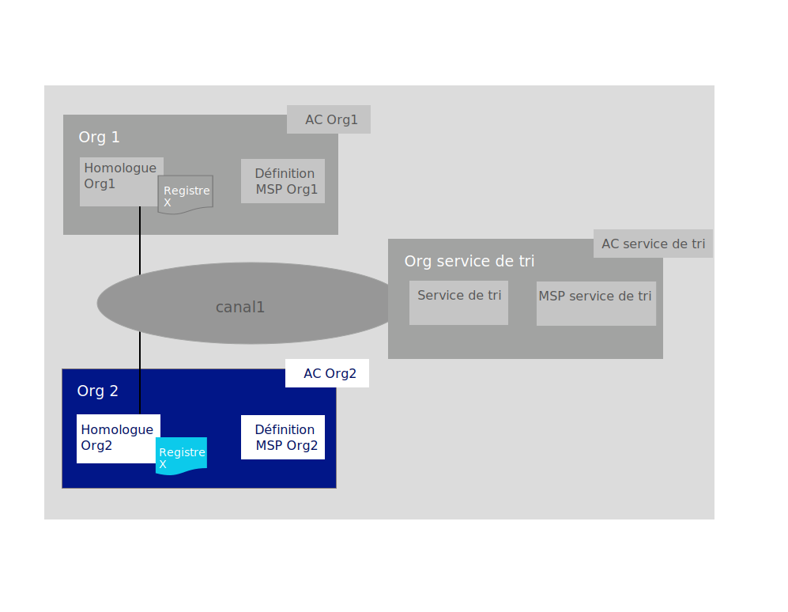

---

copyright:
  years: 2019

lastupdated: "2019-05-31"

keywords: getting started tutorials, create a CA, enroll, register, create an MSP, wallet, create a peer, create ordering service, Raft, join a network, system channel

subcollection: blockchain

---

{:external: target="_blank" .external}
{:shortdesc: .shortdesc}
{:screen: .screen}
{:codeblock: .codeblock}
{:note: .note}
{:important: .important}
{:tip: .tip}
{:pre: .pre}

# Tutoriel Rejoindre un réseau
{: #ibp-console-join-network}

{{site.data.keyword.blockchainfull}} Platform est une offre de blockchain en tant que service qui vous permet de développer, déployer et exploiter des applications et des réseaux de blockchain. Vous pouvez en apprendre davantage sur les composants de blockchain et leur fonctionnement en consultant la section [Présentation du composant Blockchain](/docs/services/blockchain/blockchain_component_overview.html#blockchain-component-overview). Ce tutoriel est la deuxième partie de la [série d'exemples de tutoriel réseau](/docs/services/blockchain/howto/ibp-console-build-network.html#ibp-console-build-network-sample-tutorial) ; il explique comment créer des noeuds sur la console {{site.data.keyword.blockchainfull_notm}} Platform et les connecter à un consortium de blockchain hébergé dans un autre cluster.
{:shortdesc}

Si vous utilisez la version d'essai bêta d'{{site.data.keyword.blockchainfull_notm}} Platform for {{site.data.keyword.cloud_notm}}, il est probable que certains panneaux sur votre console ne correspondront pas à ceux de la documentation actuelle, qui est mise à jour avec l'instance de service disponible globalement. Si vous utilisez une instance de service bêta et souhaitez bénéficier des toutes dernières fonctionnalités, nous vous encourageons à ce stade à mettre en service une instance de service disponible globalement en suivant les instructions de la section [Initiation à {{site.data.keyword.blockchainfull_notm}} Platform for {{site.data.keyword.cloud_notm}}](/docs/services/blockchain/howto/ibp-v2-deploy-iks.html#ibp-v2-deploy-iks).
{: important}

**Public cible :** Cette rubrique s'adresse aux opérateurs réseau qui sont responsables de la création, de la surveillance et de la gestion du réseau de blockchain.  

Si vous n'avez pas déjà utilisé la console {{site.data.keyword.blockchainfull_notm}} Platform pour déployer des composants dans un cluster Kubernetes à l'aide d'{{site.data.keyword.cloud_notm}} Kubernetes Service, voir [Initiation à {{site.data.keyword.blockchainfull_notm}} Platform for {{site.data.keyword.cloud_notm}}](/docs/services/blockchain/howto/ibp-v2-deploy-iks.html#ibp-v2-deploy-iks), si vous utilisez un cluster {{site.data.keyword.cloud_notm}}, ou [Initiation à {{site.data.keyword.blockchainfull_notm}} Platform for Multicloud](/docs/services/blockchain/get-started-console-icp.html#get-started-console-icp), si vous utilisez {{site.data.keyword.cloud_notm}} Private pour déployer sur un fournisseur de cloud autre que {{site.data.keyword.cloud_notm}}. Notez que la console elle-même ne réside pas dans votre cluster. Il s'agit d'un outil que vous pouvez utiliser pour déployer des composants dans votre cluster.

Que vous déployiez des composants dans un cluster Kubernetes payant ou non, portez une attention particulière aux ressources à votre disposition lorsque vous choisissez de déployer des noeuds et de créer des canaux. Il est de votre responsabilité de gérer votre cluster Kubernetes et de déployer des ressources supplémentaires si nécessaire. Même si des composants peuvent être déployés dans un cluster {{site.data.keyword.cloud_notm}} gratuit, plus vous ajoutez de composants, plus lente sera leur exécution. Pour plus d'informations sur les dimensionnements de composant et sur la manière dont la console interagit avec votre cluster {{site.data.keyword.cloud_notm}} Kubernetes Service, voir [Allocation de ressources](/docs/services/blockchain/howto/ibp-console-govern.html#ibp-console-govern-iks-console-interaction).
Si vous utilisez {{site.data.keyword.cloud_notm}} Private pour le déploiement sur un fournisseur de cloud, vous devez consulter la documentation de ce fournisseur afin de savoir comment surveiller vos ressources.

## Série d'exemples de tutoriel réseau
{: #ibp-console-join-network-structure}

Cette série de tutoriels en trois parties vous guide tout au long du processus de création et d'interconnexion d'un réseau Hyperledger Fabric à plusieurs noeuds relativement simple à l'aide de la console {{site.data.keyword.blockchainfull_notm}} Platform pour le déploiement d'un réseau dans votre cluster Kubernetes, ainsi que l'installation et l'instanciation d'un contrat intelligent. Notez que bien que ce tutoriel décrive le fonctionnement de ce processus avec un cluster {{site.data.keyword.cloud_notm}} Kubernetes payant, le même flux de base s'applique aux clusters gratuits, mais avec cependant quelques limitations (par exemple, vous ne pouvez pas dimensionner ou redimensionner des noeuds dans un cluster gratuit).

* [Générer un réseau](/docs/services/blockchain/howto/ibp-console-build-network.html#ibp-console-build-network) : Ce tutoriel vous guide tout au long du processus d'hébergement d'un réseau par la création d'un service de tri et d'un homologue.
* **Rejoindre un réseau** : Ce tutoriel vous guide tout au long du processus permettant de rejoindre un réseau existant en créant un homologue et en le joignant à un canal.
* [Déployer un contrat intelligent sur le réseau ](/docs/services/blockchain/howto/ibp-console-smart-contracts.html#ibp-console-smart-contracts): Ce tutoriel fournit des informations sur l'écriture d'un contrat intelligent et son déploiement sur votre réseau.

Vous pouvez utiliser les étapes de ces tutoriels pour générer un réseau comportant plusieurs organisations dans un cluster à des fins de développement et de test. Utilisez le tutoriel **Générer un réseau** si vous voulez former un consortium de blockchain en créant un service de tri et en ajoutant des organisations. Utilisez le tutoriel **Rejoindre un réseau** pour connecter un homologue au réseau. L'utilisation des tutoriels par différents membres de consortium vous permet de créer un réseau de blockchain réellement **distribué**.

Ce tutoriel décrit comment joindre un homologue à un réseau **existant**. Il suppose qu'un service de tri est déjà créé dans votre cluster ou dans un autre cluster {{site.data.keyword.blockchainfull_notm}} Platform. Si vous ne disposez d'aucun réseau existant à joindre, consultez le [tutoriel Générer un réseau](/docs/services/blockchain/howto/ibp-console-build-network.html#ibp-console-build-network) pour apprendre à en créer un. Le tutoriel **Rejoindre un réseau** vous guide tout au long des étapes de création des composants de blockchain `Org2` suivants, mis en évidence dans la zone bleue :
  

Effectuez les étapes du tutoriel **Rejoindre un réseau** pour créer les composants suivants et exécuter les actions ci-après :

* **Une organisation homologue ** `Org2`  
  Créez la définition MSP (Membership Services Provider) Service de tri qui définit l'organisation `Org2`.
* **Un homologue ** `Org2 homologue`   
  Le registre, `Registre x` dans l'illustration ci-dessus, est géré par des homologues distribués. L'homologue est déployé avec [Couch DB](https://hyperledger-fabric.readthedocs.io/en/release-1.4/couchdb_as_state_database.html){: external} comme base de données d'état.
* **Une autorité de certification ** `AC Org2`.
  Une AC (autorité de certification) est le noeud qui émet des certificats pour tous les admins d'une organisation ainsi que tous les noeuds associés à une organisation. Nous allons créer une AC pour l'organisation homologue `Org2`.
* **Joindre un canal**
  Ce tutoriel décrit comment joindre le canal qui a été créé par le [tutoriel Générer un réseau](/docs/services/blockchain/howto/ibp-console-build-network.html#ibp-console-build-network).

Tout au long de ce tutoriel, nous indiquons les **valeurs recommandées** pour certaines zones de la console. Les noms et les identités sont ainsi plus faciles à reconnaître dans les onglets et les listes déroulantes. Ces valeurs ne sont pas obligatoires, mais elles peuvent vous être utiles, en particulier dans la mesure où vous devrez mémoriser certaines valeurs telles que les ID et les secrets d'utilisateurs enregistrés que vous entrez dans les étapes précédentes. Si vous oubliez de ces valeurs, vous devrez enregistrer d'autres utilisateurs pour vos admin et composants. Nous fournissons un tableau de valeurs recommandées après chaque tâche et, si vous n'utilisez pas les valeurs en exemple que vous avez notées, il est conseillé de bien noter vos valeurs avant de poursuivre ce tutoriel.
{:tip}

## Etape 1 : Créer une organisation homologue et un homologue
{: #ibp-console-join-network-create-ca-org2}

Pour chacune des organisations que vous voulez créer avec la console, vous devez déployer au moins une AC. Une AC est le noeud qui émet des certificats pour tous les participants du réseau (homologues, services de tri, clients, admin, et ainsi de suite). Ces certificats, qui incluent un certificat signataire et une clé privée, permettent aux participants d'un réseau de communiquer, de s'authentifier et enfin d'effectuer des transactions. Ces AC vont créer l'ensemble des identités et des certificats qui appartiennent à votre organisation, en plus de définir l'organisation elle-même. Vous pouvez ensuite utiliser ces identités pour déployer des noeuds, créer des identités admin et soumettre des transactions. Pour plus d'informations sur votre AC et les identités que vous allez devoir créer, voir [Gestion des identités](/docs/services/blockchain/howto/ibp-console-identities.html#ibp-console-identities).

Dans le cadre de ce tutoriel, nous allons créer une organisation. Par conséquent, nous devrons créer **une autorité de certification**.

### Création de l'autorité de certification (AC) de votre organisation
{: #ibp-console-join-network-create-CA-org2CA}

Dans le cadre de ce tutoriel, votre AC émet les certificats et les clés privées pour les utilisateurs et les noeuds. Ces identités ne sont pas gérées par {{site.data.keyword.IBM_notm}} et les clés ne sont pas stockées sur la console. Elles sont uniquement stockées dans l'espace de stockage local de votre navigateur. Par conséquent, assurez-vous d'exporter vos identités et la définition MSP de votre organisation. Si vous essayez d'accéder à la console à partir d'une autre machine ou d'un navigateur différent, vous devez importer ces identités et définitions d'organisation.
{:important}

Procédez comme suit depuis votre console :  

1. Accédez à l'onglet **Noeuds** sur la gauche et cliquez sur **Ajouter une autorité de certification**. Les panneaux latéraux vous permettent de personnaliser l'autorité de certification que vous voulez créer et l'organisation pour laquelle cette autorité de certification va émettre des clés.
2. Dans ce tutoriel, nous créons des noeuds ; vous devez donc vous assurer que l'option **Créer** une autorité de certification est sélectionnée. Ensuite, cliquez sur **Suivant**.
3. Utilisez le second panneau latéral pour affecter un **nom d'affichage** à votre autorité de certification. Notre valeur recommandée pour cette autorité de certification est `AC Org2`.
4. Sur le panneau suivant, affectez des données d'identification à l'admin de votre autorité de certification en indiquant l'**ID d'inscription de l'administrateur de l'autorité de certification** `admin` et le secret of `adminpw`. Encore une fois, il s'agit de **valeurs recommandées**.
5. Si vous utilisez un cluster payant, vous avez la possibilité de configurer l'allocation de ressource pour le noeud. Pour les besoins de ce tutoriel, acceptez toutes les valeurs par défaut et cliquez sur **Suivant**. Si vous souhaitez en savoir davantage sur l'allocation de ressources dans {{site.data.keyword.cloud_notm}} pour votre noeud, consultez la rubrique relative à l'[allocation de ressources](/docs/services/blockchain?topic=blockchain-ibp-console-govern#ibp-console-govern-allocate-resources). Si vous utilisez un cluster gratuit, vous voyez la page **Récapitulatif**.
6. Passez en revue la page Récapitulatif, puis cliquez sur **Ajouter une autorité de certification**.

**Tâche : Créer l'autorité de certification de l'organisation homologue**

  | **Zone** | **Nom d'affichage** | **ID d'inscription** | **Secret** |
  | ------------------------- |-----------|-----------|-----------|
  | **Créer une autorité de certification** | AC Org2  | admin | adminpw |

*Figure 2. Création de l'autorité de certification de l'organisation homologue*  

Une fois l'autorité de certification déployée, vous allez l'utiliser lors de la création de la définition MSP de votre organisation, de l'enregistrement des utilisateurs, ainsi que pour créer votre point d'entrée sur un réseau, l'**homologue**.

Les utilisateurs expérimentés ont peut-être déjà leur propre autorité de certification et ils ne souhaitent pas en créer une nouvelle sur la console. Si votre autorité de certification existante peut émettre des certificats au format `X.509`, vous pouvez utiliser les certificats de votre propre autorité de certification tierce au lieu de créer de nouveaux certificats ici. Pour plus d'informations, consultez la rubrique relative à l'[utilisation de certificats d'une autorité de certification tierce avec votre homologue ou service de tri](/docs/services/blockchain/howto/ibp-console-build-network.html#ibp-console-identities).

### Utilisation de votre autorité de certification pour enregistrer des identités
{: #ibp-console-join-network-use-CA-org2}

Chaque noeud ou application que vous souhaitez créer a besoin certificats et de clés privées pour participer au réseau de blockchain. Vous devez également créer des identités admin pour ces noeuds et applications afin de pouvoir les gérer à partir de la console. Nous allons créer une autorité de certification et l'utiliser pour créer deux identités :

* **Un admin d'organisation** : Cette identité vous permet d'exploiter des noeuds à l'aide de la console de plateforme.
* **Une identité homologue** : Il s'agit de l'identité de l'homologue lui-même. Chaque fois qu'un homologue effectue une action (par exemple, la validation d'une transaction) il se connecte à l'aide de son certificat.

Selon le type de votre cluster, le déploiement de l'autorité de certification peut prendre jusqu'à dix minutes. Lorsque l'autorité de certification est déployée pour la première fois, ou encore lorsqu'elle n'est pas disponible, la zone dans la vignette de l'autorité de certification devient grisée. Lorsque l'autorité de certification est déployée et opérationnelle, cette zone devient vert, ce qui indique qu'elle est "En cours d'exécution" et qu'elle peut être utilisée pour enregistrer des identités. Avant de passer aux étapes ci-dessous pour enregistrer des identités, vous devez attendre que l'autorité de certification passe à l'état "En cours d'exécution".
{:important}

Dès lors que l'autorité de certification est lancée, comme indiqué par la zone verte sur la vignette, générez ces certificats en procédant comme suit :

1. Cliquez sur `AC Org2` et vérifiez que l'identité `admin` que vous avez créée pour l'autorité de certification est visible dans le tableau. Ensuite, cliquez sur le bouton **Enregistrement d'utilisateur**.
2. Tout d'abord, nous enregistreront l'admin de l'organisation admin, en affectant pour cela un **ID d'inscription** `org2admin` et un **secret** `org2adminpw`. Ensuite, définissez le `Type` de cette identité sur `client` (les identités admin doivent toujours être enregistrées en tant que `client`, alors que les identités de noeud doivent toujours être enregistrées en utilisant le type `homologue`). La zone d'affiliation est destinée aux utilisateurs expérimentés et elle n'est pas utilisée dans le cadre de ce tutoriel, vous devez donc cliquez sur la zone qui indique **Utiliser l'affiliation racine**. Si vous souhaitez en savoir davantage sur l'utilisation des affiliations par l'autorité de certification Fabric, consultez la rubrique relative à l'[enregistrement d'une nouvelle identité](https://hyperledger-fabric-ca.readthedocs.io/en/release-1.4/users-guide.html#registering-a-new-identity){: external}. Pour l'instant, sélectionnez une affiliation de la liste (par exemple `Org1`). Vous pouvez ignorer la zone **Nombre maximal d'inscriptions**. Si vous souhaitez en savoir davantage sur les inscriptions, voir [Enregistrement des identités](/docs/services/blockchain/howto/ibp-console-identities.html#ibp-console-identities-register). Cliquez sur **Suivant**.
4. Dans le cadre de ce tutoriel, nous n'avons pas à utiliser **Ajouter un attribut**. Si vous souhaitez en savoir plus sur les attributs d'identité, voir [Enregistrement des identités](/docs/services/blockchain/howto/ibp-console-identities.html#ibp-console-identities-register).
5. Une fois l'admin de l'organisation enregistré, recommencez ce même processus pour l'identité de l'homologue (en utilisant également `AC Org2`). Pour l'identité homologue, affectez l'ID d'inscription `peer2` et le secret `peer2pw`. Il s'agit d'une identité de noeud, vous devez donc sélectionner `homologue` comme **Type**. Cliquez sur la zone indiquant **Utiliser l'affiliation racine** et ignorez la zone **Nombre maximal d'inscriptions**. Ensuite, dans le panneau suivant, ne pas affecter d'**attributs**, comme préalablement.

L'enregistrement de ces identités auprès de l'autorité de certification est seulement la première étape de **création** d'une identité. Vous ne pourrez pas utiliser ces identités tant qu'elles ne sont pas **inscrites**. Pour l'partition de service de transfert the `org2admin`, cette opération a lieu lors de la création du MSP, ce que nous verrons à l'étape suivante. Dans le cas de l'homologue, cette opération a lieu lors de la création de ce dernier.
{:note}

**Tâche : Enregistrer des utilisateurs**

  |  **Zone** | **Description** | **ID d'inscription** | **Secret** |
  | ------------------------- |-----------|-----------|-----------|-----------|
  | **Enregistrer des utilisateurs** |  Admin Org2 | org2admin | org2adminpw |
  | | Identité de l'homologue |  peer2 | peer2pw |

*Figure 3. Utilisation de votre autorité de certification pour enregistrer des utilisateurs*  

### Création de la définition MSP d'une organisation homologue
{: #ibp-console-join-network-create-peers-org2}

A présent que nous avons créé l'autorité de certification de l'homologue et que nous l'avons utilisée pour **enregistrer** les identités de notre organisation, nous devons créer une définition formelle de l'organisation de l'homologue, laquelle est appelée définition MSP (Membership Services Provider). De nombreux homologues peuvent appartenir à une organisation. **Vous n'êtes pas tenu de créer une nouvelle organisation chaque fois que vous créez un homologue.** Comme il s'agit de la première fois que nous déroulons ce tutoriel, nous allons créer l'ID MSP pour cette organisation. Pendant le processus de création du MSP, nous allons générer les certificats pour l'identité `org2admin` et les ajouter à notre portefeuille.

1. Accédez à l'onglet **Organisations** dans la navigation de gauche et cliquez sur **Créer une définition de MSP**.
2. Affectez à votre MSP le nom d'affichage `Org2 MSP` et l'ID MSP `org2msp`. Si vous voulez indiquer votre propre ID MSP dans cette zone, assurez-vous de respecter les spécifications relatives aux limitations pour ce nom dans l'infobulle.
3. Sous **Détails d'autorité de certification racine**, indiquez l'autorité de certification homologue que vous avez utilisée pour enregistrer les identités à l'étape précédente. Si c'est la première fois que vous suivez ce tutoriel, vous ne devez voir qu'une seule : `AC Org2`.
4. Les zones **ID d'inscription** et **Secret d'inscription** ci-dessous sont remplies automatiquement avec l'ID d'inscription et le secret pour le premier utilisateur que vous avez créé avec votre autorité de certification : `admin` et `adminpw`. Toutefois, si cette identité est utilisée, votre organisation aurait la même identité que votre autorité de certification, ce qui n'est pas recommandé pour des raisons de sécurité. Au lieu de cela, sélectionnez l'ID d'inscription que vous avez créé pour votre administrateur d'organisation dans la liste déroulante, `org2admin`, et entrez le secret associé, `org2adminpw`. Ensuite, affectez à cette identité un nom d'affichage, `Org2 Admin`.
5. Cliquez sur le bouton **Générer** afin d'inscrire cette identité en tant qu'admin de votre organisation et exportez l'identité dans le portefeuille, où elle sera utilisée lors de la création de l'homologue et de la création de canaux.
6. Cliquez sur **Exporter** pour exporter les certificats admin sur votre système de fichiers. Comme nous l'avons dit plus haut, cette identité n'est pas stockée dans votre cluster ou gérée par {{site.data.keyword.IBM_notm}}. Elle est stockée uniquement dans l'espace de stockage de votre navigateur. Si vous changez de navigateur, vous devrez importer cette identité dans votre portefeuille afin de pouvoir administrer l'homologue.
7. Cliquez sur **Créer une définition de MSP**.

**Tâche : Créer la définition MSP de l'organisation de l'homologue**

  |  | **Nom d'affichage** | **ID MSP** | **ID d'inscription**  | **Secret** |
  | ------------------------- |-----------|-----------|-----------|-----------|
  | **Créer une organisation** | MSP Org2 | org2msp |||
  | **Autorité de certification racine** | AC Org2 ||||
  | **Cert admin org** | |  | org2admin | org2adminpw |
  | **Identité** | Admin Org2 |||||

  *Figure 4. Création de la définition MSP d'une organisation homologue*  

Une fois la définition MSP créée, vous devez voir l'admin de l'organisation homologue dans votre **portefeuille**, qui est accessible en cliquant sur **Portefeuille** dans la navigation de gauche.

**Tâche : Consulter le portefeuille**

  | **Zone** |  **Nom d'affichage** | **Description** |
  | ------------------------- |-----------|----------|
  | **Identité** | Admin Org2 | Identité Org2 |

  *Figure 5. Consultation de votre portefeuille*  

Pour plus d'informations sur les définitions MSP, voir la rubrique relative à la [gestion des organisations](/docs/services/blockchain/howto/ibp-console-organizations.html#ibp-console-organizations).

L'exportation de l'identité de l'admin de votre organisation est importante car vous êtes responsable de la gestion et de la sécurisation de ces certificats.
{:important}

### Création d'un homologue
{: #ibp-console-join-network-peer-create}

Une fois que vous avez [créé une autorité de certification](/docs/services/blockchain/howto/ibp-console-join-network.html#ibp-console-join-network-create-CA-org2CA), que vous l'avez utilisée pour enregistrer des identités, et que vous avez créé la définition [MSP de l'organisation homologue](/docs/services/blockchain/howto/ibp-console-join-network.html#ibp-console-join-network-create-peers-org2), vous êtes prêt(e) pour la création d'un homologue.

#### Quel rôle jouent les homologues ?
{: #ibp-console-join-network-peer-role}

Il est important de garder à l'esprit que les organisations elles-mêmes ne gèrent pas les registres. Ce sont les homologues qui s'en chargent. Les organisations utilisent également des homologues pour signer des propositions de transaction et approuver des mises à jour de configuration de canal. Etant donné qu'avoir au moins deux homologues sur un canal les rend hautement disponibles, une meilleure pratique consiste à avoir au moins deux homologues qui ont rejoint un canal pour les implémentations de niveau production. Dans le cadre de ce tutoriel, nous allons voir uniquement le processus de création d'un seul homologue.

Du point de vue de l'allocation de ressource, il est possible de joindre les mêmes homologues à plusieurs canaux. De par sa conception, l'homologue garantit que les données d'un canal ne peuvent pas passer dans un autre via l'homologue. Toutefois, étant donné que l'homologue va stocker un registre distinct pour chaque canal, il est nécessaire de s'assurer que l'homologue dispose de suffisamment de puissance de traitement et d'espace de stockage pour traiter la charge de transactions et de données.

#### Déploiement de votre homologue
{: #ibp-console-join-network-deploy-peer-role}

Utilisez votre console pour effectuer les étapes suivantes :

1. Sur la page **Noeuds**, cliquez sur **Ajouter un homologue**.
2. Assurez-vous que l'option **Créer** un homologue est sélectionnée. Ensuite, cliquez sur **Suivant**.
3. Affectez à votre homologue le **nom d'affichage** `Org2 homologue`.Pour les besoins de ce tutoriel, ne choisissez pas d'utiliser une autorité de certification externe pour votre homologue ; si vous souhaitez davantage d'informations, consultez la rubrique relative à l'[utilisation de certificats d'une autorité de certification externe](#ibp-console-build-network-third-party-ca). Cliquez sur **Suivant**.
4. A l'écran suivant, sélectionnez `AC Org2`, car il s'agit de l'autorité de certification que vous avez utilisée pour enregistrer l'identité de l'homologue. Sélectionnez l'**ID d'inscription** de l'identité d'homologue que vous avez créée pour votre homologue dans la liste déroulante, `peer2`, puis entrez le **secret** associé, `peer2pw`. Ensuite, sélectionnez `MSP Org2` dans la liste déroulante et cliquez sur **Suivant**.
5. Le panneau latéral suivant vous invite à entrer des informations sur l'autorité de certification TLS. Lors de la création de l'autorité de certification, une autorité de certification TLS a également été créée. Cette autorité de certification est utilisée pour créer les certificats de la couche de communication sécurisée pour les noeuds. Par conséquent, sélectionnez l'**ID d'inscription** de l'identité d'homologue que vous avez créée pour votre homologue dans la liste déroulante, `peer2`, puis entrez le **secret** associé, `peer2pw`. Le **nom d'hôte CSR TLS** est une option réservée aux utilisateurs expérimentés qui souhaitent indiquer un nom de domaine personnalisé qui peut être utilisé pour adresser le noeud final d'homologue. Les noms de domaine personnalisés ne sont pas inclus dans ce tutoriel, vous devez donc laisser à blanc la zone **Nom d'hôte CSR TLS** pour l'instant.
6. Le panneau latéral suivant vous invite à **Associer une identité** pour la définir en tant qu'admin de votre homologue. Dans le cadre de ce tutoriel, définissez votre organisation en tant qu'admin, `Admin Org2`, en tant qu'admin également de votre homologue. Il est possible d'enregistrer et d'inscrire une autre identité avec `AC Org2` et de créer l'identité de l'administrateur de votre poste, mais ce tutoriel utilise l'identité `Admin Org2`.
7. Si vous utilisez un cluster payant, sur le panneau suivant vous avez la possibilité de configurer l'allocation de ressource pour le noeud. Pour les besoins de ce tutoriel, vous pouvez accepter toutes les valeurs par défaut et cliquer sur **Suivant**. Si vous souhaitez en savoir davantage sur l'allocation de ressources dans {{site.data.keyword.cloud_notm}} pour votre noeud, consultez la rubrique relative à l'[allocation de ressources](/docs/services/blockchain?topic=blockchain-ibp-console-govern#ibp-console-govern-allocate-resources). Si vous utilisez un cluster {{site.data.keyword.cloud_notm}} gratuit, vous voyez la page **Récapitulatif**.
8. Passez en revue le récapitulatif et cliquez sur **Ajouter un homologue**.

**Tâche : Déployer un homologue**

  |  | **Nom d'affichage** | **ID MSP** | **ID d'inscription** | **Secret** |
  | ------------------------- |-----------|-----------|-----------|-----------|
  | **Créer un homologue** | Org2 homologue | org2msp |||
  | **AC** | AC Org2 ||||
  | **Identité de l'homologue** | |  | peer2 | peer2pw |
  | **Certificat d'administrateur** | org2msp ||||
  | **Autorité de certification TLS** | AC Org2 ||||
  | **ID autorité de certification TLS** | || peer2 | peer2pw |
  | **Associer une identité** | Admin Org2 |||||

  *Figure 6. Déploiement d'un homologue*  

Dans un environnement de production, il est recommandé de déployer trois homologues pour chaque canal. Il s'agit ainsi de prévoir la mise hors service d'un homologue (par exemple, pendant un cycle de maintenance) tout en conservant une haute disponibilité des homologues. Pour déployer plusieurs homologue pour une organisation, utilisez la même autorité de certification que celle utilisée pour enregistrer votre première identité d'homologue. Dans ce tutoriel, il s'agirait de `AC Org2`. Ensuite, enregistrez une nouvelle identité d'homologue en utilisant un ID d'inscription et un secret distincts. Par exemple, `org2secondpeer` et `org2secondpeerpw`. Ensuite, lorsque vous créez l'homologue, attribuez-lui cet ID d'inscription et ce secret. Comme cet homologue est encore associé à Org2, choisissez `AC Org2`, `MSP Org2` et `Admin Org2` dans les listes déroulantes. Vous pouvez choisir d'affecter un autre admin à ce nouvel homologue, qui peut être enregistré et inscrit avec `CA Org2`, mais cela est facultatif. Cette série de tutoriel décrit uniquement le processus de création d'un seul homologue pour chaque organisation d'homologue.
{:tip}

## Etape 2 : Joindre le consortium hébergé par le service de tri
{: #ibp-console-join-network-add-org2}

Comme nous l'avons mentionné précédemment, une organisation homologue doit être connue du service de tri pour pouvoir créer ou rejoindre un canal (également appelé rejoindre un "consortium", qui est la liste des organisations connues du service de tri). Ceci est dû au fait que les canaux sont, a un niveau technique, des **chemins de messagerie** entre homologues via le service de tri. De la même manière qu'un homologue peut être joint à plusieurs canaux sans la transmission d'informations d'un canal à un autre, un service de tri peut également avoir plusieurs canaux qui s'exécutent en son sein sans que les données soient exposées à des organisations sur d'autres canaux.

Etant donné que seuls les admin de service de tri peuvent ajouter des organisations homologues au consortium, vous devez :

* **Etre** l'admin du service de tri. Auquel cas, vous pouvez ajouter l'organisation homologue que vous avez créée au consortium directement.
* **Envoyer** les informations MSP à l'admin du service de tri, lequel ajoutera votre organisation à son consortium.

A l'étape suivante, nous allons voir comment ajouter votre organisation homologue à un consortium hébergé par un service de tri dans une autre instance de service {{site.data.keyword.blockchainfull_notm}} Platform. Le tutoriel suppose que vous avez créé le service de tri et que vous pouvez suivre chaque étape par vous-même. Si le service de tri a été créé par une autre personne, assurez-vous que l'admin du service de tri suit les étapes marquées d'une coche bleue en haut.

Si vous avez suivi un tutoriel Générer un réseau ou si votre console comporte déjà le service de tri, vous pouvez passer à la section [Ajout de l'organisation de l'homologue au service de tri](/docs/services/blockchain/howto/ibp-console-join-network.html#ibp-console-join-network-add-org2-local). Vous pouvez ensuite poursuivre avec [Etape 3 : ajouter l'organisation de l'homologue à un canal existant](/docs/services/blockchain/howto/ibp-console-join-network.html#ibp-console-join-network-add-channel).

### Exportation des informations de votre organisation
{: #ibp-console-join-network-add-org2-remote}

Vous devez envoyer la définition MSP de votre organisation au service de tri pour qu'il soit ajouté au consortium à l'aide des étapes ci-dessous. Pour suivre ces étapes, vous devez être l'admin de l'**organisation homologue**, ce qui signifie que vous disposez de l'identité admin de l'organisation de l'homologue dans votre portefeuille :

1. Accédez à l'onglet **Organisations**. Vous pouvez voir les organisations qui sont disponibles pour l'exportation et sont répertoriés sous **Organisations disponibles**. Cliquez sur le bouton **Télécharger** dans la vignette de l'organisation pour télécharger le fichier de configuration JSON qui représente la définition MSP de l'organisation homologue.
2. Envoyez ce fichier à l'admin du service de tri dans une opération hors bande.

### Importation de la définition d'organisation
{: #ibp-console-join-network-import-remote-msp}

Cette étape doit être exécutée par l'admin d'un service de tri.
{:tip}

L'admin du service de tri doit importer ce fichier JSON pour ajouter votre organisation à sa console :

- Accédez à l'onglet **Organisations**, cliquez sur le bouton **Importer une définition de MSP**, puis sélectionnez le fichier JSON qui représente la définition MSP de l'organisation de l'homologue. Vous pouvez laisser l'option `Je dispose d'une identité administrateur pour la définition MSP` désélectionnée car l'identité admin n'est pas requise ici.

### Ajout de l'organisation de l'homologue au service de tri
{: #ibp-console-join-network-add-org2-local}

Cette étape doit être exécutée par l'admin d'un service de tri.
{:tip}

Suivez ces étapes pour ajouter l'organisation homologue au consortium hébergé par le service de tri. Seul les admin du service de tri peuvent ajouter des organisations homologue au consortium. Vous devez disposer d'une identité admin de l'organisation du service de tri dans votre portefeuille pour effectuer cette tâche.

1. Accédez à l'onglet **Noeuds**.
2. Faites défiler jusqu'au service de tri que vous voulez utiliser et cliquez sur ce dernier pour l'ouvrir.
3. Sous **Membres du consortium**, cliquez sur **Ajouter une organisation**.
4. Dans la liste déroulante, sélectionnez `MSP Org2`, car il s'agit du MSP qui représente `Org2`.
5. Cliquez sur **Ajouter une organisation**.

Si vous avez suivi le tutoriel **Générer un réseau** ou si votre console comporte déjà le service de tri et un canal, vous pouvez passer à la section [Etape 3 : ajouter l'organisation de l'homologue à un canal existant](/docs/services/blockchain/howto/ibp-console-join-network.html#ibp-console-join-network-add-channel).

### Exportation du service de tri
{: #ibp-console-join-network-export-ordering-service}

Cette étape doit être exécutée par l'admin d'un service de tri.
{:tip}

Procédez comme suit pour **Exporter** le service de tri pour qu'il puisse être importé par l'organisation homologue :

1. Accédez au service de tri sous l'onglet **Noeuds**. Cliquez sur la flèche **Télécharger** sous le nom du service de tri afin de télécharger un fichier de configuration JSON.
2. Envoyez ce fichier à l'organisation homologue dans une opération hors bande. L'administrateur de l'organisation homologue peut ensuite utiliser le fichier de configuration pour ajouter le service de tri à la console.

### Importation du service de tri depuis un autre cluster
{: #ibp-console-join-network-import-remote-orderer}

Procédez comme suit pour **importer** le service de tri sur votre console :

1. Accédez à la page **Noeuds** et cliquez sur **Ajouter un service de tri**.
2. Cliquez sur l'option **Importer un service de tri existant**.
3. Sélectionnez l'**Emplacement de service** où le service de tri a été déployé, puis cliquez sur le bouton **Ajouter un fichier** pour sélectionner le JSON qui représente le service de tri.
4. Lorsque vous êtes invité à associer une identité, sélectionnez l'identité de l'organisation de l'homologue. Dans ce tutoriel, il s'agirait de `Admin Org2`. Cliquez sur **Ajouter un service de tri**.

Une fois ce processus terminé, il est possible pour `Org2` de créer un canal hébergé sur le `Service de tri`. Pour créer un canal, au lieu de joindre un canal existant, passez à la [création d'un canal](/docs/services/blockchain/howto/ibp-console-join-network.html#ibp-console-join-network-create-channel).

## Etape 3 : ajouter l'organisation de l'homologue à un canal existant
{: #ibp-console-join-network-add-channel}

Cette étape doit être exécutée par un admin de Org1.
{:tip}

A présent, l'admin du service de tri peut ajouter l'organisation homologue au canal :
1. Accédez à l'onglet **Canaux**, cliquez sur `canal1`.
2. Cliquez sur l'icône **Paramètres** pour mettre à jour le canal et ajouter l'organisation homologue au canal.
3. Dans la section **Organisations**, ouvrez la liste déroulante `Sélectionner un membre de canal` et sélectionnez le MSP de l'organisation homologue, `MSP Org2`.
4. Cliquez sur **Ajouter** et affectez des droits pour cette organisation. Nous vous recommandons d'affecter les droits `Opérateur` afin qu'il soit possible de mettre à jour le canal.
5. Dans la liste déroulante **ID MSP de programme de mise à jour de canal** (sous l'en-tête **Organisation qui met à jour le canal** heading), assurez-vous que `MSP Org1` est sélectionné.
6. Dans la liste déroulante **Identité**, assurez-vous que `Admin Org1` est sélectionné.
7. Lorsque vous êtes prêt(e), cliquez sur **Envoyer une proposition**.

Une fois que l'admin du service de tri a joint votre organisation homologue au canal, vous pouvez joindre les canaux de vos homologues qui sont hébergés par le service de tri.

## Etape 3 : Joindre votre homologue au canal
{: #ibp-console-join-network-join-peer-org2}

Nous avons presque terminé. Votre homologue peut désormais être joint à un canal existant. Vous devez obtenir le `nom de canal`, hors bande, auprès d'une organisation qui est membre du canal. Dans le tutoriel **Générer un réseau**, nous avons créé un canal nommé `canal1`. Si ce n'est déjà fait, accédez à l'onglet **Canaux** dans la navigation de gauche.

Procédez comme suit depuis votre console :

1. Cliquez sur le bouton **Joindre un canal** pour lancer les panneaux latéraux.
2. Sélectionnez votre service de tri nommé `Service de tri` et cliquez sur **Suivant**.
3. Entrez le nom du canal que vous voulez rejoindre, `canal1` et cliquez sur **Suivant**.
4. Sélectionnez les homologues qui doivent rejoindre le canal. Pour les besoins de ce tutoriel, cliquez sur `Org2 homologue`.
5. Cliquez sur **Joindre un canal**.

Si vous prévoyez d'optimiser les fonctions [Private Data](https://hyperledger-fabric.readthedocs.io/en/release-1.4/private-data/private-data.html){: external} ou [Service Discovery](https://hyperledger-fabric.readthedocs.io/en/release-1.4/discovery-overview.html){: external} d'Hyperledger Fabric, vous devez configurer des homologues d'ancrage dans vos organisations depuis l'onglet **Canaux**. Pour plus d'informations sur la configuration des homologues d'ancrage pour les données privées à l'aide de l'onglet **Canaux** sur la console, voir [Données privées](/docs/services/blockchain/howto/ibp-console-smart-contracts.html#ibp-console-smart-contracts-private-data).

## Création d'un canal
{: #ibp-console-join-network-create-channel}

Comme votre organisation est maintenant membre du consortium, vous avez également la possibilité de créer un canal. Tout d'abord, vous devez importer la définition MSP des autres membre de canal. Procédez comme suit pour créer un canal avec deux membres : `Org1` qui a été créé dans le [tutoriel Générer un réseau](/docs/services/blockchain/howto/ibp-console-build-network.html#ibp-console-build-network) et `Org2` qui a été créé dans les étapes ci-dessus.

### Exportation des informations de votre organisation
{: #ibp-console-join-network-add-org2-export-info}

Cette étape doit être exécutée par un administrateur de Org1.
{:tip}

`Org1` doit envoyer la définition MSP de son organisation pour que vous puissiez l'ajouter ensuite au canal. Vous devez être membre du consortium hébergé par le service de tri pour permettre l'ajout au canal. Pour suivre ces étapes, vous devez être l'admin de l'**organisation homologue**, ce qui signifie que vous disposez de l'identité admin de l'organisation de l'homologue dans votre portefeuille :

1. Accédez à l'onglet **Organisations**. Vous pouvez voir les organisations qui sont disponibles pour l'exportation et sont répertoriés sous **Organisations disponibles**. Cliquez sur le bouton **Télécharger** dans la vignette de l'organisation pour télécharger le fichier de configuration JSON qui représente la définition MSP de l'organisation homologue.
2. Envoyez ce fichier au membre de consortium qui va créer le canal dans une opération hors bande.

### Importation de la définition d'organisation
{: #ibp-console-join-network-create-channel-import-msp}

Vous devez ensuite importer la définition MSP de `Org1` sur votre console :

1. Accédez à l'onglet **Organisations**, cliquez sur le bouton **Importer une définition de MSP**, puis sélectionnez le fichier JSON qui représente la définition MSP de l'organisation de l'homologue.

#### Création du canal
{: #ibp-console-join-network-channels-create}

Procédez comme suit depuis votre console :

1. Cliquez sur **Créer un canal**. Un panneau latéral s'ouvre.
2. Attribuez au canal un **nom**, `canal2`. Notez cette valeur car vous devrez la partager avec quiconque souhaite rejoindre ce canal.
3. Sélectionnez `Service de tri` dans la liste déroulante.
4. Choisissez les **Organisations** qui feront partie de ce canal. Comme nous avons deux organisations, sélectionnez et ajoutez `MSP Org1 (org1msp)` puis `MSP Org2 (org2msp)`. Définissez au moins ces deux organisations en tant qu'**Opérateur**. Remarque : N'utilisez pas le `MSP Service de tri` ici.
5. Choisissez une **Règle de mise à jour du canal** pour le canal. Il s'agit de la règle qui indiquera combien d'organisations doivent approuver les mises à jour de la configuration du canal. Vous pouvez sélectionner `1 de 2`. Lorsque vous ajoutez des organisations pour le canal, vous devez modifier cette règle pour refléter les besoins de votre cas d'utilisation. Une norme raisonnable consiste à utiliser une majorité d'organisations. Par exemple, `3 de 5`.
6. Indiquez les limitations de **contrôle d'accès** que vous voulez appliquer. Remarque : il s'agit d'une **option avancée**. Si vous définissez l'accès à une ressource à une organisation spécifique, sachez que cela restreindra l'accès à cette ressource pour chaque organisation. Par exemple, si l'accès par défaut pour une ressource particulière est `Lecteurs` de toutes les organisations, et que l'accès est défini sur `Admin` de `Org2`, alors **seul** Admin de Org2 aura accès à cette ressource. Comme l'accès à certaines ressources est essentiel au bon fonctionnement d'un canal, il est fortement recommandé de prendre des décisions de contrôle d'accès avec précaution. Si vous décidez de limiter l'accès à une ressource, assurez-vous que l'accès à cette ressource est ajouté, si nécessaire, pour chaque organisation.
7. Sélectionnez l'**Organisation qui crée le canal**. Comme vous exécutez le tutoriel en tant que `Org2`, et que vous avez les certificats `Admin Org2` dans votre portefeuille de console, sélectionnez `MSP Org2` dans la liste déroulante. De même, choisissez `Admin Org2` comme identité créant le canal.

Lorsque vous êtes prêt(e), cliquez sur **Créer un canal**.Vous retournez alors à l'onglet Canaux et vous pouvez voir une vignette en attente du canal que vous venez de créer.

**Tâche : Créer un canal**

  |  **Zone** | **Nom** |
  | ------------------------- |-----------|
  | **Nom de canal** | canal2 |
  | **Service de tri** | Service de tri |
  | **Organisations** | MSP Org2 |
  | **Règle de mise à jour du canal** | 1 de 2 |
  | **Liste de contrôle d'accès** | Aucune |
  | **Organisation qui crée le canal** | MSP Org2 |
  | **Identité** | Admin Org2|

*Figure 7. Création d'un canal*

## Etapes suivantes
{: #ibp-console-join-network-next-steps}

Une fois que vous avez joint votre homologue à un canal, utilisez les étapes suivantes pour déployer un contrat intelligent et commencer à soumettre des transactions à la blockchain :

- [Déployez un contrat intelligent sur votre réseau](/docs/services/blockchain/howto/ibp-console-smart-contracts.html#ibp-console-smart-contracts) à l'aide de la console.
- Une fois que vous avez installé et instancié votre contrat intelligent, vous pouvez [soumettre des transactions à l'aide de votre application client](/docs/services/blockchain/howto/ibp-console-smart-contracts.html#ibp-console-smart-contracts-connect-to-SDK).
- Utilisez [l'exemple de document commercial](/docs/services/blockchain/howto/ibp-console-create-app.html#ibp-console-app-commercial-paper) pour déployer un exemple de contrat intelligent et soumettre des transactions à l'aide d'un exemple de code d'application.
