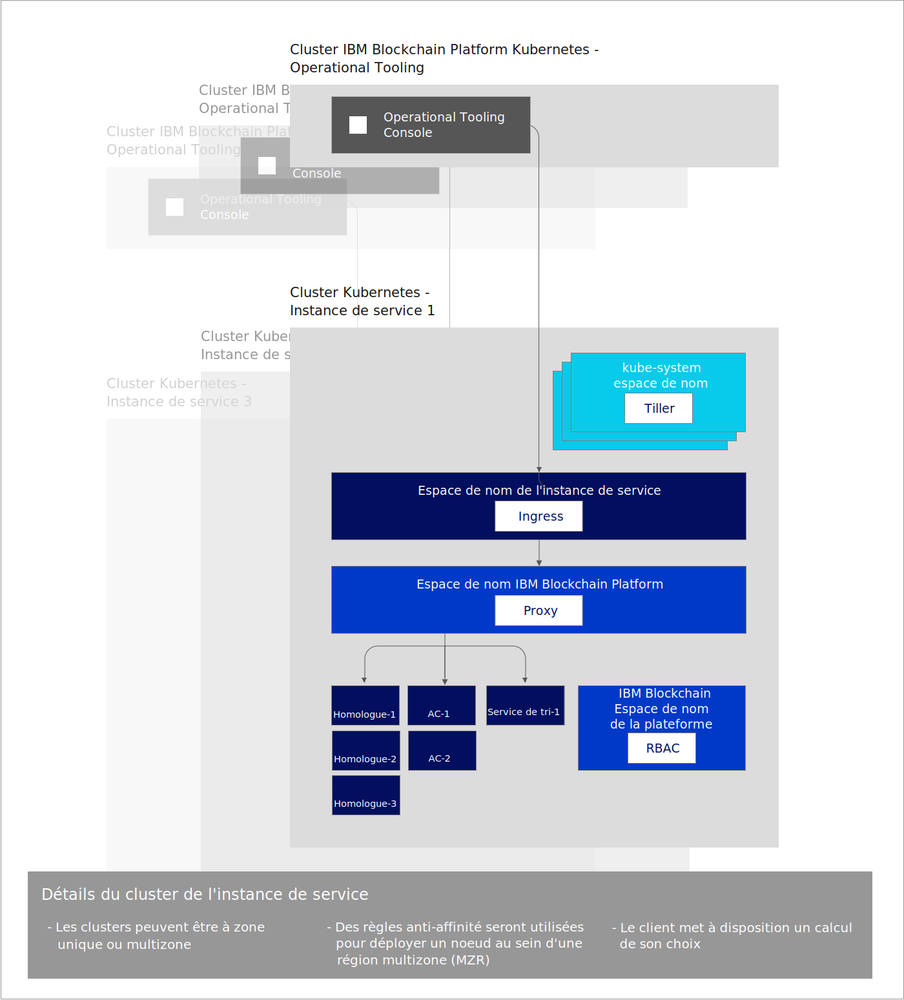

---

copyright:
  years: 2019
lastupdated: "2019-07-16"

keywords: key features, build, operate, grow, architecture, multizone clusters

subcollection: blockchain

---

{:external: target="_blank" .external}
{:shortdesc: .shortdesc}
{:screen: .screen}
{:codeblock: .codeblock}
{:note: .note}
{:important: .important}
{:tip: .tip}
{:pre: .pre}

# A propos d'{{site.data.keyword.blockchainfull_notm}} Platform for {{site.data.keyword.cloud_notm}}
{: #ibp-console-overview}

L'{{site.data.keyword.blockchainfull}} Platform for {{site.data.keyword.cloud_notm}} est la génération suivante des offres {{site.data.keyword.blockchainfull_notm}} Platform, qui vous donne un contrôle total sur vos déploiements, certificats et clés privées. Il inclut la nouvelle console {{site.data.keyword.blockchainfull_notm}} Platform, une interface utilisateur qui peut simplifier et accélérer le processus de déploiement de composants dans un service {{site.data.keyword.cloud_notm}} Kubernetes géré et contrôlé par vous. Pour plus d'informations sur Kubernetes et {{site.data.keyword.cloud_notm}} Kubernetes Service, voir [Kubernetes](/docs/services/blockchain/reference?topic=blockchain-k8s-overview).
{:shortdesc}

{{site.data.keyword.blockchainfull_notm}} Platform for {{site.data.keyword.cloud_notm}} repose sur Hyperledger Fabric 1.4.1. Pour plus d'informations sur les nouvelles fonctionnalités d'Hyperledger Fabric 1.4.1, voir [What's new in 1.4](https://hyperledger-fabric.readthedocs.io/en/release-1.4/whatsnew.html){: external}.

## Contenu de la nouvelle édition
{: #ibp-console-overview-capabilities}

Cette dernière édition est destinée aux utilisateurs {{site.data.keyword.blockchainfull_notm}} and Hyperledger Fabric expérimentés et elle leur permet d'héberger et de rejoindre des réseaux {{site.data.keyword.blockchainfull_notm}}. Si vous êtes un client de plan Starter ou Enterprise existant, au lieu de la gestion de votre réseau par {{site.data.keyword.IBM_notm}}, vous avez le contrôle total avec la possibilité de mettre à disposition, de surveiller et de gérer vos composants au sein de votre propre cluster Kubernetes.

Cette édition d'{{site.data.keyword.blockchainfull_notm}} Platform présente les caractéristiques suivantes :

**BUILD ---- Expérience de développement intégrée**
- **Codez facilement** vos contrats intelligents en Node.js, Golang ou Java, écrivez des applications client à l'aide de la nouvelle extension {{site.data.keyword.blockchainfull_notm}} VS Code, optimisez l'**intégration SDK** avec la console, et apprenez avec nos tutoriels et exemples enrichis.
- **Simplified DevOps** vous permet de passer du développement au test en production dans un environnement unique avec l'extension de vos ressources Kubernetes pour l'ajout de composants supplémentaires.
- **A jour des fonctions principales de Fabric**. Bénéficiez des fonctionnalités les plus récentes d'Hyperledger Fabric v1.4.1 :
  -  [Service de tri Raft](https://hyperledger-fabric.readthedocs.io/en/release-1.4/orderer/ordering_service.html#raft){: external}
  - [**Collectes de données** privées](/docs/services/blockchain/howto?topic=blockchain-ibp-console-smart-contracts#ibp-console-smart-contracts-private-data) qui permettent une meilleure confidentialité des données avec la garantie que les données de registre sont partagées sur des homologues autorisés uniquement via le protocole gossip.
  - [Reconnaissance de service (Service Discovery)](https://hyperledger-fabric.readthedocs.io/en/release-1.4/discovery-overview.html){: external}, qui vous permet de découvrir et de mettre à jour de manière dynamique la façon dont votre application interagit avec votre réseau.
  - [Listes de contrôle d'accès](https://hyperledger-fabric.readthedocs.io/en/release-1.4/access_control.html){: external} qui vous donnent un contrôle supplémentaire sur la gouvernance de vos canaux et contrats intelligents.
- Intégration de service {{site.data.keyword.cloud_notm}}. Optimisez les [services {{site.data.keyword.cloud_notm}}](/docs/services/blockchain/howto?topic=blockchain-ibp-v2-deploy-iks#ibp-v2-deploy-iks-integrations) intégrés, tels que {{site.data.keyword.cloud_notm}} Kubernetes Service Dashboard, {{site.data.keyword.IBM_notm}} Log Analysis with LogDNA et {{site.data.keyword.cloud_notm}} Identity and Access Management (IAM).

**OPERATE --- Contrôle total de vos déploiements**
- **Déployez uniquement les composants dont vous avez besoin**. Connectez un homologue à plusieurs canaux et réseaux, ou hébergez un service de tri auquel les partenaires commerciaux peuvent se connecter.
- **Conservez le contrôle intégral de vos identités**. Stockez et gérez les clés qui sont utilisées pour administrer vos noeuds sans stocker vos clés privées sur {{site.data.keyword.cloud_notm}}.
- **Opération centralisée**. La console {{site.data.keyword.blockchainfull_notm}} Platform vous permet de déployer et de gérer l'ensemble de vos organisations et noeuds sur **une console centrale** sans avoir à compter sur {{site.data.keyword.IBM_notm}} ou d'autres fournisseurs pour gérer vos services de tri ou votre autorité de certification. Vous pouvez aussi ajouter ou retirer des membres d'un consortium de blockchain, créer et rejoindre des canaux, puis installer et instancier des contrats intelligents depuis votre console.
- **Hébergez ou rejoignez un réseau**. Déployez des homologues hébergés dans votre cluster sur plusieurs canaux dans différents clouds, ou invitez d'autres organisations à rejoindre votre consortium ou vos canaux, pendant que les organisations gèrent leurs noeuds de manière indépendante au sein d'infrastructures.
- **Gérez l'accès** des utilisateurs qui peuvent administrer ou surveiller vos noeuds.
- **Accédez directement aux journaux** de vos noeuds depuis le service {{site.data.keyword.IBM_notm}} Kubernetes. Utilisez le service {{site.data.keyword.cloud_notm}} Log Analysis ou un service tiers pour extraire et analyser vos journaux.
- **Interagissez directement avec vos pods** à l'aide de Kubernetes Dashboard. Lancez vos pods et conteneurs pour exécuter des commandes et mettre à jour des certificats depuis la ligne de commande.
- **Collecte de signatures dynamique** qui permet un meilleur contrôle sur la gouvernance collaborative sur les configurations de canal.

**GROW --- Evolutivité et flexibilité**
- **Choisissez votre calcul**. Vous avez la flexibilité de décider de la quantité d'UC, de mémoire et de stockage que vous voulez mettre à disposition dans votre cluster Kubernetes. Pour plus d'informations, voir [Comment {{site.data.keyword.cloud_notm}} Kubernetes Service interagit avec la console](/docs/services/blockchain/howto?topic=blockchain-ibp-console-govern#ibp-console-govern-iks-console-interaction).
- **Augmentez** et réduisez le nombre de ressources dans votre cluster Kubernetes, en ne payant que ce que ce dont vous avez besoin. Pour plus d'informations, voir [Tarification](/docs/services/blockchain/howto?topic=blockchain-ibp-pricing#ibp-pricing).
- **Reprise après incident et disponibilité multi-région.** Cette option duplique votre déploiement Kubernetes entre les régions, ce qui permet la haute disponibilité (HA) de vos composants et la reprise après incident (DR).
- **Exécutez n'importe où** (instructions bientôt disponibles). Grâce au **codebase unifié** de la console {{site.data.keyword.blockchainfull_notm}} Platform, il est possible d'exécuter vos composants dans {{site.data.keyword.cloud_notm}}, {{site.data.keyword.cloud_notm}} Private et dans des clouds public tiers.

Consultez ce [blog](https://www.ibm.com/blogs/blockchain/2019/02/taking-the-next-step-towards-deploying-blockchain-anywhere){: external} pour plus de détails sur l'étape suivante relative au déploiement de blockchain pour une entreprise à un autre emplacement.

Cette offre est destinée aux utilisateurs Fabric expérimentés qui souhaitent générer et gérer leurs propres réseaux.

## Remarques
{: #ibp-console-overview-considerations}

Avant de déployer la console, tenez compte des remarques suivantes :

- Comme il y a chevauchement entre la disponibilité de la version d'essaie bêta et de la version disponible globalement de {{site.data.keyword.blockchainfull_notm}} Platform, il est important de connaître la version de {{site.data.keyword.blockchainfull_notm}} Platform que vous utilisez. Les nouvelles fonctions et les correctifs ne seront pas envoyés à la version bêta mais ils seront disponibles dans la version globalement disponible de {{site.data.keyword.blockchainfull_notm}} Platform. Par conséquent, si vous utilisez la version bêta d'{{site.data.keyword.blockchainfull_notm}} Platform, il est probable que certains panneaux sur votre console ne correspondront pas à ceux de la documentation actuelle, qui est mise à jour avec l'instance de service disponible globalement. Pour bénéficier des toutes dernières fonctionnalités, nous vous encourageons à mettre en service une nouvelle instance de service disponible globalement. Pour savoir comment procéder, voir [Initiation à {{site.data.keyword.blockchainfull_notm}} Platform for {{site.data.keyword.cloud_notm}}](/docs/services/blockchain/howto?topic=blockchain-ibp-v2-deploy-iks#ibp-v2-deploy-iks).
- Tous les homologues déployés avec cette version utilisent CouchDB comme base de données d'état.
- Vous êtes chargé de gérer la surveillance de l'intégrité, de la sécurité et de la journalisation de votre cluster Kubernetes. Consultez ces [informations](/docs/containers?topic=containers-responsibilities_iks#your-responsibilities-by-using-ibm-cloud-kubernetes-service){: external} pour plus de détails sur les éléments gérés par {{site.data.keyword.cloud_notm}} et sur ceux dont vous êtes responsable.
- Vous êtes également responsable de la surveillance de l'utilisation des ressources de votre cluster Kubernetes. Pour la surveillance de vos ressources Kubernetes, nous vous conseillons d'utiliser l'outil [{{site.data.keyword.cloud_notm}} SysDig](https://www.ibm.com/cloud/sysdig){: external} en association avec votre tableau de bord {{site.data.keyword.cloud_notm}} Kubernetes. Si vous devez accroître la capacité de stockage ou les performances de votre cluster, consultez les informations relatives à la [modification de votre volume existant](/docs/containers?topic=containers-file_storage#change_storage_configuration){: external}.
- Vous êtes responsable de la gestion et de la sécurisation de vos certificats et de vos clés privées. {{site.data.keyword.IBM_notm}} ne stocke pas vos certificats dans le cluster Kubernetes ou sur la console. Ceux-ci sont conservés uniquement dans le stockage local de votre navigateur. Si vous changez de navigateur, vous devrez importer vos identités créées dans ce navigateur.
- {{site.data.keyword.blockchainfull_notm}} Platform est disponible dans certaines régions. Pour obtenir une liste à jour, consultez la rubrique relative aux [emplacements {{site.data.keyword.blockchainfull_notm}} Platform](/docs/services/blockchain/howto?topic=blockchain-ibp-regions-locations).
- {{site.data.keyword.blockchainfull_notm}} Platform ne peut pas être déployé sur des clusters OpenShift créés à l'aide du service {{site.data.keyword.IBM_notm}} Kubernetes.
- Kubernetes doit être en version 1.11 ou une version stable suivante dans votre cluster {{site.data.keyword.cloud_notm}} Kubernetes. Utilisez ces instructions pour [mettre à niveau vos clusters nouveaux et existants](/docs/services/blockchain/howto?topic=blockchain-ibp-v2-deploy-iks#ibp-v2-deploy-iks-updating-kubernetes) vers cette version.
- Si vous ne souhaitez pas utiliser le stockage Bronze File par défaut qui est présélectionné lorsque vous mettez à disposition un cluster Kubernetes dans {{site.data.keyword.cloud_notm}}, vous pouvez mettre à disposition le stockage de votre choix. Pour plus détails, voir [Considérations relatives au stockage de persistance](/docs/services/blockchain?topic=blockchain-ibp-v2-deploy-iks#ibp-console-storage).
- Si vous décider d'inclure la prise en charge à zones multiples d'{{site.data.keyword.cloud_notm}} dans votre cluster Kubernetes, vous devez mettre à disposition votre propre stockage. Pour plus de détails, voir [Utilisation de clusters à zones multiples (MZR) avec {{site.data.keyword.blockchainfull_notm}} Platform](/docs/services/blockchain?topic=blockchain-ibp-v2-deploy-iks#ibp-console-mzr).
- Vous pouvez essayer {{site.data.keyword.blockchainfull_notm}} Platform sans frais pendant 30 jours lorsque vous liez votre i=instance de service {{site.data.keyword.blockchainfull_notm}} Platform à un cluster Kubernetes {{site.data.keyword.cloud_notm}} gratuit.  Les performances seront limitées en termes de débit, de stockage et de fonctionnalités. {{site.data.keyword.cloud_notm}} supprimera votre cluster au bout de 30 jours et vous ne pouvez pas migrer les noeuds ou les données depuis un cluster gratuit vers un cluster payant. Et comme la version d'essai bêta de {{site.data.keyword.blockchainfull_notm}} Platform est gratuite, si vous choisissez un cluster Kubernetes payant au lieu du cluster gratuit limité, des frais seront appliqués pour le service Kubernetes à votre compte {{site.data.keyword.cloud_notm}}.
- Virtual Routing and Forwarding (VRF) n'est pas pris en charge. Le service {site.data.keyword.blockchainfull_notm}} Platform n'est pas compatible avec des comptes qui sont définis pour le routage mondial automatique entre les blocs IP de sous-réseau. De même, les clusters Kubernetes qui sont configurés avec des VLAN privés ne sont pas pris en charge.

## Migration
{: #ibp-console-overview-migration}

Actuellement, la migration depuis une offre {{site.data.keyword.blockchainfull_notm}} Platform vers {{site.data.keyword.blockchainfull_notm}} Platform for {{site.data.keyword.cloud_notm}} n'est pas possible.

Les instances de service de la version d'essai bêta de {{site.data.keyword.blockchainfull_notm}} Platform ne peuvent pas être migrées vers la version globalement disponible.

## Licence et tarification
{: #ibp-console-overview-license-and-pricing}

{{site.data.keyword.blockchainfull_notm}} Platform for {{site.data.keyword.cloud_notm}} introduit un nouveau modèle de tarification horaire qui repose sur l'utilisation du coeur de processeur virtuel (VPC). Le modèle simplifié repose sur le volume d'UC (ou VPC) consomme par vos noeuds {{site.data.keyword.blockchainfull_notm}} Platform sur une base horaire, à un prix fixe de **0,29 dollars par heure VPC**, où **1 VPC = 1 UC**. Pour plus détails, voir la rubrique [Tarification](/docs/services/blockchain?topic=blockchain-ibp-saas-pricing).

## Mise en route
{: #ibp-console-overview-deploy}

Pour plus d'informations sur le déploiement de {{site.data.keyword.blockchainfull_notm}} Platform for {{site.data.keyword.cloud_notm}}, voir [Initiation à {{site.data.keyword.blockchainfull_notm}} Platform for {{site.data.keyword.cloud_notm}}](/docs/services/blockchain/howto?topic=blockchain-ibp-v2-deploy-iks#ibp-v2-deploy-iks).

Pour plus d'informations sur l'utilisation de la console pour démarrer le déploiement de noeuds et la génération de consortium, consultez le tutoriel [Génération de votre réseau](/docs/services/blockchain/howto?topic=blockchain-ibp-console-build-network#ibp-console-build-network). Ce tutoriel vous guide tout au long du processus d'utilisation de la console pour créer un exemple de réseau composé de trois organisations, une organisation de tri, deux organisations d'homologue, ainsi qu'un canal auquel sont joints deux homologues. Vous pouvez utiliser l'exemple de réseau pour des démos de validation de concept ou encore pour ajouter et développer les étapes du tutoriel pour créer votre propre configuration.

## Référence d'architecture
{: #ibp-console-overview-architecture}

L'illustration suivante présente les composants de votre réseau de blockchain et comment ils interagissent.

Notez qu'une seule instance de la console, également appelée Operational Tooling, est créée pour chaque instance de service {{site.data.keyword.blockchainfull_notm}} Platform. Lorsqu'un noeud d'homologue, de service de tri ou d'autorité de certification est déployé à l'aide de la console, il est déployé dans l'**Instance de service de cluster Kubernetes**.

| **Cluster {{site.data.keyword.blockchainfull_notm}} Platform Kubernetes** | **Description** |
| ------------------------- |-----------|
| Operational Tooling | Egalement appelée `console`, il s'agit de votre interface utilisateur centrale pour l'exploitation de tous vos composants de blockchain. A partir de cette console, vous pouvez désormais créer des noeuds d'autorité de certification, d'homologue et de service de tri, créer des canaux, installer et instancier des contrats intelligents développés avec l'extension VS Code d'Hyperledger Fabric version 1.4. La console est déployée dans un cluster appartenant à {{site.data.keyword.IBM_notm}}. Aucun frais n'est appliqué pour ces outils ou le cluster Kubernetes où ils s'exécutent.|

| **Instance de service de cluster Kubernetes** | **Description** |
| ------------------------- |-----------|-----------|-----------|
| **Tiller** | Elément de [Helm tooling](https://docs.helm.sh/glossary/#tiller){: external}, Tiller s'exécute dans le cluster Kubernetes pour gérer les installations de votre homologue, de votre autorité de certification et des chartes Helm de votre service de tri. |
| **Ingress** | Un [objet Kubernetes](https://kubernetes.io/docs/concepts/services-networking/ingress/){: external} qui permet d'accéder aux ressources de cluster depuis l'extérieur du cluster. |
| **Proxy** | Le proxy {{site.data.keyword.blockchainfull_notm}} Platform est responsable du routage du trafic vers les noeuds d'homologue, d'autorité de certification et de service de tri corrects à l'aide du routage d'en-tête d'hôte. |
| **Homologues, autorités de certification, services de tri** | Il s'agit des noeuds qui sont créés par le déploiement de chartes Helm sous-jacentes. Remarque : Ces noeuds peuvent également être importés depuis d'autres instance de service de cluster Kubernetes. Comme les clés ne sont jamais stockées par {{site.data.keyword.IBM_notm}}, chaque noeud d'homologue et de service de tri inclut un proxy Web gRPC qui permet à la console de communiquer avec chaque noeud à l'aide des clés du portefeuille de consoles. |
| **RBAC** | Contrôle d'accès à base de rôles.  {{site.data.keyword.blockchainfull_notm}} Platform configure [Kubernetes RBAC](https://kubernetes.io/docs/reference/access-authn-authz/rbac/){: external} dans le cluster qui est nécessaire pour gérer des composants de blockchain dans le cluster.

## Support
{: #ibp-console-overview-support}

Pour plus d'informations sur l'obtention d'un support sur {{site.data.keyword.blockchainfull_notm}} Platform for {{site.data.keyword.cloud_notm}}, et pour accéder à des ressources de développeur de blockchain gratuites et à des forums de support pour la résolution de problèmes, voir [Support](/docs/services/blockchain?topic=blockchain-blockchain-support#blockchain-support).

La prise en charge de la version d'essai bêta de {{site.data.keyword.blockchainfull_notm}} Platform est limitée pendant la période bêta qui se termine le 3 août 2019.
