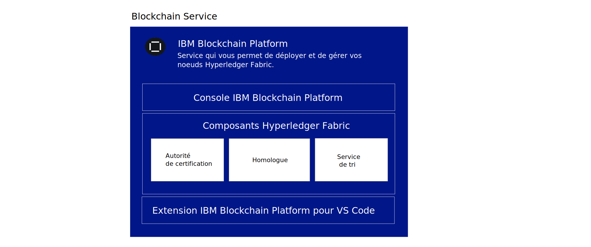
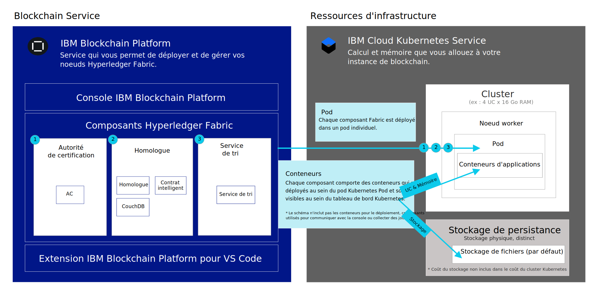

---

copyright:
  years: 2019
lastupdated: "2019-05-31"

keywords: getting started tutorials, videos, web browsers

subcollection: blockchain

---

{:external: target="_blank" .external}
{:shortdesc: .shortdesc}
{:screen: .screen}
{:codeblock: .codeblock}
{:note: .note}
{:important: .important}
{:tip: .tip}
{:pre: .pre}
{:gif: data-image-type='gif'}

# Initiation à {{site.data.keyword.blockchainfull_notm}} Platform for {{site.data.keyword.cloud_notm}}
{: #ibp-v2-deploy-iks}

{{site.data.keyword.blockchainfull}} Platform for {{site.data.keyword.cloud_notm}} comporte la console {{site.data.keyword.blockchainfull_notm}} Platform, interface graphique qui peut simplifier et accélérer vos opérations de déploiement et de gestion des composants de blockchain. Ce tutoriel explique comment s'initier à {{site.data.keyword.blockchainfull_notm}} Platform for {{site.data.keyword.cloud_notm}} et comment utiliser la console pour déployer et gérer des composants de blockchain dans votre cluster {{site.data.keyword.cloud_notm}} Kubernetes Service on {{site.data.keyword.cloud_notm}}. Pour plus d'informations sur Kubernetes et {{site.data.keyword.cloud_notm}} Kubernetes Service, voir [Kubernetes](/docs/services/blockchain/reference/k8s.html "Kubernetes").
{:shortdesc}

**Public cible :** Cette rubrique s'adresse aux administrateurs système qui sont responsables de la configuration d'un cluster Kubernetes dans {{site.data.keyword.cloud_notm}} et du déploiement d'{{site.data.keyword.blockchainfull_notm}} Platform.

Après avoir lié votre {{site.data.keyword.blockchainfull_notm}} Platform à votre cluster {{site.data.keyword.cloud_notm}} Kubernetes, vous pouvez lancer la console afin de créer et de gérer vos composants de blockchain, et profiter des avantages suivants.

- **Contrôle :** Vous contrôlez et gérez vos composants et certificats de blockchain depuis une console centrale. Vous déployez uniquement les composants nécessaires à votre activité et pouvez en ajouter davantage au fur et à mesure de votre croissance.
- **Déploiement flexible basé sur Kubernetes :** Vous pouvez bénéficier des options de calcul (UC, mémoire, stockage) pour votre cluster Kubernetes et optimiser les options HA et DR intégrées.

## Qu'est-ce que le service blockchain ?
{: #ibp-v2-deploy-iks-blockhain-service}

Le schéma suivant illustre les trois éléments d'{{site.data.keyword.blockchainfull_notm}} Platform :



- **{{site.data.keyword.blockchainfull_notm}} Console (UI)** : il s'agit de la console qui vous permet de créer et de gérer vos composants de blockchain. Après avoir mis à disposition une instance de service dans {{site.data.keyword.cloud_notm}}, vous pouvez déployer une instance de la console {{site.data.keyword.blockchainfull_notm}} et la lier à votre cluster {{site.data.keyword.cloud_notm}} Kubernetes. Vous pouvez ensuite utiliser la console pour créer et gérer vos composants de blockchain dans votre cluster Kubernetes. Aucun frais n'est appliqué pour la console.

- **Composants Hyperledger Fabric** : la console est utilisée pour créer et gérer des composants de blockchain qui reposent sur des images d'autorité de certification, d'homologue et de service de tri d'Hyperledger Fabric version 1.4.1. Ces composants sont déployés dans votre cluster Kubernetes et un espace de stockage est mis à disposition de ces derniers à l'aide de la classe de stockage `default` lors de leur déploiement.

- **Extension {{site.data.keyword.IBM_notm}} VS Code (Development Tools)** : téléchargez l'extension VS Code depuis la place de marché VS Code afin de commencer à développer, packager et tester des applications client et des contrats intelligents.

## Remarques
{: #ibp-v2-deploy-iks-considerations}

Avant de déployer la console, tenez compte des remarques suivantes :

- {{site.data.keyword.blockchainfull_notm}} Platform for {{site.data.keyword.cloud_notm}} est créé avec Hyperledger Fabric version 1.4.1.
- Tous les homologues déployés avec la console ou les API utilisent CouchDB comme base de données d'état.
- Vous avez la possibilité de lier votre instance de service {{site.data.keyword.blockchainfull_notm}} Platform à un cluster Kubernetes gratuit aux fins d'évaluation de l'offre : cependant, la capacité et les performances sont limitées, aucune de vos données ne peut être migrée, et le cluster est supprimé au bout de 30 jours.
- Même si l'offre bêta est gratuite, vous devez quand même payer pour votre cluster Kubernetes, si vous choisissez un cluster payant.
- Vous êtes chargé de gérer la surveillance de l'intégrité, de la sécurité et de la journalisation de votre cluster Kubernetes. Consultez ces [informations](/docs/containers/cs_responsibilities.html#your-responsibilities-by-using-ibm-cloud-kubernetes-service){: external} pour plus de détails sur les éléments gérés par {{site.data.keyword.cloud_notm}} et sur ceux dont vous êtes responsable.
- Vous êtes également responsable de la surveillance de l'utilisation des ressources de votre cluster Kubernetes à l'aide du tableau de bord Kubernetes. Si vous devez accroître la capacité de stockage ou les performances de votre cluster, consultez les informations relatives à la [modification de votre volume existant](/docs/containers/cs_storage_file.html#change_storage_configuration){: external}.
- Vous êtes responsable de la gestion et de la sécurisation de vos certificats et de vos clés privées. {{site.data.keyword.IBM_notm}} ne stocke pas vos certificats dans le cluster Kubernetes. 
- {{site.data.keyword.blockchainfull_notm}} Platform est disponible dans certaines régions. Pour obtenir une liste à jour, consultez la rubrique relative aux [emplacements {{site.data.keyword.blockchainfull_notm}} Platform](/docs/services/blockchain/howto?topic=blockchain-ibp-regions-locations).
- Kubernetes doit être en version 1.11 ou une version stable suivante dans votre cluster {{site.data.keyword.cloud_notm}} Kubernetes. Utilisez ces instructions pour [mettre à niveau vos clusters nouveaux et existants](/docs/services/blockchain/howto/ibp-v2-deploy-iks.html#ibp-v2-deploy-iks-updating-kubernetes) vers cette version.
- Si vous ne souhaitez pas utiliser le stockage Bronze File par défaut qui est présélectionné lorsque vous mettez à disposition un cluster Kubernetes dans {{site.data.keyword.cloud_notm}}, vous pouvez mettre à disposition le stockage de votre choix. Pour plus détails, voir [Considérations relatives au stockage de persistance](/docs/services/blockchain?topic=blockchain-ibp-v2-deploy-iks#ibp-console-storage).
- Si vous décider d'inclure la prise en charge à zones multiples d'{{site.data.keyword.cloud_notm}} dans votre cluster Kubernetes, vous devez mettre à disposition votre propre stockage. Pour plus de détails, voir [Utilisation de clusters à zones multiples (MZR) avec {{site.data.keyword.blockchainfull_notm}} Platform](/docs/services/blockchain?topic=blockchain-ibp-v2-deploy-iks#ibp-console-mzr).

## Tutoriel vidéo
{: #ibp-v2-deploy-video}

Regardez cette [série de vidéos]( http://ibm.biz/BlockchainPlatformSeries) pour vous familiariser avec {{site.data.keyword.blockchainfull_notm}} Platform et découvrir comment commencer à générer votre propre réseau.

## Avant de commencer
{: #ibp-v2-deploy-iks-prereq}

Avant de commencer :

- Assurez-vous de disposer d'un [compte payant {{site.data.keyword.cloud_notm}}](https://cloud.ibm.com/catalog/services/blockchain){: external}. Si vous n'avez pas de compte :
   1. Cliquez sur le bouton **S'inscrire**.
   2. Après que vous avez créé un compte d'essai gratuit, effectuez une mise à niveau vers un type **Paiement à la carte** en accédant à **Gérer** > **Facturation et utilisation** > **Facturation** dans la console {{site.data.keyword.cloud_notm}}, et en cliquant sur **Ajouter carte de crédit**.
   3. Assurez-vous que l'utilisateur a les rôles Administrateur et Gestionnaire pour le cluster Kubernetes qu'ils vont lier à leur instance de service blockchain. Pour plus d'informations, consultez les étapes relatives à l'[affectation de rôles d'accès Kubernetes](#ibp-v2-deploy-iks-k8x-access-roles).

Lorsque vous prévoyez d'utiliser l'instance de service dans le contexte d'une solution de niveau organisation plus large, il est recommandé que les organisations participantes utilisent une adresse e-mail fonctionnelle pour créer leur réseau. Dans ce cas, l'accès au réseau ne dépend pas de la disponibilité d'une seule personne.
{:tip}  

- Si vous prévoyez d'utiliser un cluster {{site.data.keyword.cloud_notm}} Kubernetes Service existant, vérifiez la version de Kubernetes et effectuez une mise à niveau vers la version 1.11 ou supérieure, si nécessaire. Pour plus d'informations sur la manière de déterminer la version de Kubernetes dans laquelle s'exécute votre cluster et comment effectuer une mise à niveau de la version, voir [Mise à jour de la version Kubernetes de votre cluster](/docs/services/blockchain/howto/ibp-v2-deploy-iks.html#ibp-v2-deploy-iks-updating-kubernetes).

### Navigateurs
{: #ibp-v2-deploy-iks-browsers}
La liste suivante indique la version de navigateur minimum requise pour la console {{site.data.keyword.blockchainfull_notm}} Platform :

- Chrome : version la plus récente pour votre système d'exploitation
- Firefox : versions standard les plus récentes (non ESR) pour votre système d'exploitation
- Safari : version la plus récente pour Mac
- Edge : v44.17763.1.0 ou supérieur

### Ressources obligatoires
{: #ibp-v2-deploy-iks-resources-required}

#### Recommandations relatives à la taille de cluster 
{: #ibp-v2-deploy-iks-resources-required-free}

 Lorsque vous liez votre console {{site.data.keyword.blockchainfull_notm}} Platform à un cluster {{site.data.keyword.cloud_notm}} Kubernetes Service, vous devez vous assurer que votre cluster Kubernetes comporte les ressource matérielles minimum requises :

|Type de cluster Kubernetes | Cas d'utilisation | UC | RAM | Noeuds worker |
|-----------|------|-----|-----------------------|
|Standard (recommandé) | Utilisable pour MVP | 4 (partagé) | 16 Go (partagé)|multiple|
|Gratuit** | Utilisable pour évaluation | 2 | 4 Go | 1 |  
Essai de {{site.data.keyword.blockchainfull_notm}} Platform sans frais pendant 30 jours lorsque vous liez votre instance de service {{site.data.keyword.blockchainfull_notm}} Platform à un cluster Kubernetes {{site.data.keyword.cloud_notm}} gratuit. Les performances seront limitées en termes de débit, de stockage et de fonctionnalités. {{site.data.keyword.cloud_notm}} supprimera votre cluster Kubernetes au bout de 30 jours et vous ne pouvez pas migrer les noeuds ou les données depuis un cluster gratuit vers un cluster payant.

Ces ressources sont suffisantes pour les tests et l'expérimentation. Le [tutoriel Générer un réseau](/docs/services/blockchain/howto/ibp-console-build-network.html#ibp-console-build-network), dans lequel vous créer deux homologues, deux autorités de certification et un service de tri, occupent environ 4,85 UC, dont 2,25 sont occupées par le service de tri à cinq noeuds. Par conséquent, si vous prévoyez de déployer un service de tri à cinq noeuds, vous ne devez pas déployer un cluster Kubernetes contenant un noeud worker simple à 2 UC car le service de tri ne pourra y être contenu. Nous recommandons un cluster avec les noeuds d'au moins 4 UC. Plus vous ajoutez des noeuds worker, plus il sera facile pour votre cluster de gérer vos déploiements.
{:note}

#### Clusters payants
{: #ibp-v2-deploy-iks-resources-required-paid}

Les déploiements en production de {{site.data.keyword.blockchainfull_notm}} Platform seront déployés dans un cluster payant de {{site.data.keyword.cloud_notm}} Kubernetes Service. La taille et la configuration de ce cluster dépendront des besoins de votre cas d'utilisation particulier. Les déploiements plus gris devront nécessairement être déployés dans des clusters plus grands. C'est à vous de décider de la taille de votre cluster par rapport au déploiement projeté. Il est souhaitable d'avoir au moins un peu d'espace de débordement, car cela permettra aux homologues et aux services de tri de rejoindre d'autres canaux et d'obtenir un débit plus élevé sans avoir à déployer des ressources supplémentaires dans votre cluster Kubernetes **avant** d'ajuster la taille de vos noeuds. Pour plus d'informations sur l'ajustement de ces valeurs, voir [Réallocation des ressources](/docs/services/blockchain/howto/ibp-console-govern.html#ibp-console-govern-reallocate-resources).

La création d'un déploiement initial de taille suffisante pour permettre la croissance est particulièrement importante pour les utilisateurs qui vont choisir de ne pas utiliser la fonction [Mise à l'échelle auto Kubernetes Service d'{{site.data.keyword.cloud_notm}}](/docs/containers?topic=containers-ca#ca){: external}, ce qui peut accroître la charge de déploiement de noeuds et pods supplémentaires pour l'utilisateur. 

Même s'il est plus simple de déployer suffisamment de ressources dans {{site.data.keyword.cloud_notm}} Kubernetes Service et de pouvoir étendre vos pods et noeuds worker lorsque nécessaire, sans avoir à accroître d'abord le déploiement de votre cluster Kubernetes, il est clair que plus grands seront les déploiements de cluster Kubernetes, plus ils seront onéreux. Les utilisateurs doivent évaluer soigneusement toutes les possibilités et tenir compte des compromis qu'ils doivent effectuer quelle que soit l'option choisie.

Pour vous faire une idée de la quantité de stockage et de calcul dont vous aurez besoin dans votre cluster, consultez le tableau ci-dessous, qui contient les valeurs par défaut actuelles pour l'homologue, le service de tri et l'autorité de certification :

| **Composant** (tous les conteneurs) | UC  | Mémoire (Go) | Stockage (Go) |
|--------------------------------|---------------|-----------------------|------------------------|
| **Homologue**                       | 1,2            | 2,4                  | 200 (inclut 100 Go pour l'homologue et 100 Go pour CouchDB)|
| **AC**                         | 0,1            | 0,2                  | 20                     |
| **Noeud de tri**              | 0,45           | 0,9                  | 100                    |

Si vous envisagez de déployer un service de tri Raft à cinq noeuds, notez que le déploiement de votre noeud de tri va s'accroître d'un facteur de cinq. Soit un total de 2,25 UC, 4,5 Go de mémoire et 500 Go de stockage pour les cinq noeuds Raft. Le service de tri à cinq noeuds est ainsi plus grand qu'un seul noeud worker Kubernetes à 2 UC.
{:tip}

## Etape 1 : Créer une instance de service dans {{site.data.keyword.cloud_notm}} Platform
{: #ibp-v2-deploy-iks-create-service-instance}

Procédez comme suit pour créer instance de service d'{{site.data.keyword.blockchainfull_notm}} Platform for {{site.data.keyword.cloud_notm}}.

1. Localisez le [service de blockchain](https://cloud.ibm.com/catalog/services/blockchain){: external} dans le catalogue {{site.data.keyword.cloud_notm}}, ou recherchez `Blockchain` dans votre page de catalogue {{site.data.keyword.cloud_notm}}.
2. Nous vous conseillons de renommer le **Nom de service** de votre instance afin qu'elle soit facile à reconnaître dans le futur.
3. Pour la version bêta, **Dallas** est la seule région disponible et elle ne peut pas être modifiée. Il est possible de choisir des régions supplémentaires dans un cluster payant. Pour plus d'informations, voir [Régions](/docs/services/blockchain/reference/ibp_regions.html#ibp-regions-locations).
4. Vous pouvez laisser les zones de groupes de ressources et de balises vides.
5. Choisissez le plan **Standard**.
6. Cliquez sur **Créer** pour mettre à disposition l'instance de service.

## Etape 2 : Déployer {{site.data.keyword.blockchainfull_notm}} Platform
{: #ibp-v2-deploy-iks-steps}

Vous pouvez suivre les instructions de déploiement d'{{site.data.keyword.blockchainfull_notm}} Platform juste après avoir créé l'instance de service.

1. Etape **Bienvenue & Prérequis**. Si vous disposez déjà d'un cluster {{site.data.keyword.IBM_notm}} Kubernetes Service dans la région de **Dallas** et souhaitez l'utiliser pour votre service de blockchain, sélectionnez la case à cocher. **Si vous utilisez un cluster existant, vous pouvez ignorer l'étape suivante, en vous assurant au préalable que Kubernetes est en version 1.11 ou une version supérieure stable**. Cliquez sur **Continuer**.
2. Etape **Créer un cluster**. Si vous sélectionnez la case à cocher à l'étape 1 pour utiliser un cluster Kubernetes existant, cette étape peut être omise. Sinon, cliquez sur **Créer un nouveau cluster**, ce qui lance le tableau de bord {{site.data.keyword.cloud_notm}} Kubernetes pour créer un cluster. Pour plus d'informations, voir [Initiation à {{site.data.keyword.cloud_notm}} Kubernetes Service](/docs/containers/getting-started.html){: external}. Prévoyez un peu de temps supplémentaire pour l'exécution de ce processus.
  - Pour plus d'informations sur les emplacements de votre cluster, voir [Régions](/docs/services/blockchain/reference/ibp_regions.html#ibp-regions-locations).
  - Choisissez **Cluster standard (recommandé) :** Si vous avez besoin d'une option à plus long terme qui inclut plusieurs noeuds pour la haute disponibilité. **Choisissez au minimum la version 1.11 ou une version supérieure stable.** Pour déployer un cluster payant, voir [Creating a standard cluster](/docs/containers?topic=containers-clusters#clusters_ui_standard){: external}. Notez que si vous souhaitez la haute disponibilité ou la reprise après incident, vous devrez décider de la classe de stockage à utiliser. La classe de stockage `default` sur le cluster sera utilisée par l'allocation dynamique. Ainsi, les clients peuvent définir une classe de stockage par défaut. Pour plus d'informations, voir [Deciding on the file storage configuration](/docs/containers?topic=containers-file_storage#file_predefined_storageclass){: external}.
  - Choisissez **Cluster gratuit :** Si vous prévoyez d'essayer la plateforme pendant une période inférieure à 30 jours. **Remarque ** : Il n'est pas possible de migrer depuis un cluster gratuit vers un cluster payant. Le type gratuit du cluster offre un espace de stockage et un débit de transactions limités. Pour plus de détails sur les actions à effectuer lorsque votre cluster Kubernetes arrive à expiration, voir la rubrique relative à l'[expiration de cluster Kubernetes](/docs/services/blockchain/howto/ibp-console-manage.html#ibp-console-manage-console-cluster-expiration).
  - Pour plus d'informations sur les différences entre les clusters Kubernetes gratuits et payants dans {{site.data.keyword.cloud_notm}}, voir [Comparison of free and standard clusters](https://cloud.ibm.com/docs/containers?topic=containers-cluster_types#cluster_types){: external}.  

   Vous devez revenir à cet onglet dans votre navigateur après avoir créé le cluster afin de terminer le processus de déploiement de {{site.data.keyword.blockchainfull_notm}} Platform.  
   {:important}  

  Vous devez patienter le temps que votre cluster soit correctement déployé. Ensuite, cliquez sur le bouton **Je dispose d'un cluster**.
3. La version Kubernetes qui s'exécute dans votre cluster doit être au niveau de version 1.11 ou supérieur. Suivez ces [étapes](/docs/services/blockchain/howto/ibp-v2-deploy-iks.html#ibp-v2-deploy-iks-updating-kubernetes) pour vérifier la version de votre cluster et effectuez une mise à niveau si nécessaire. Ensuite, revenez et poursuivez avec ces instructions.
4. Etape **Déployer sur le cluster**. Sélectionnez dans la liste déroulante le cluster Kubernetes sur lequel vous voulez déployer {{site.data.keyword.blockchainfull_notm}} Platform et cliquez sur **Déployer sur un cluster**.  

  Si votre cluster Kubernetes n'est pas visible dans la liste déroulante, les raisons possibles sont les suivantes :
  - Le processus de création du cluster peut durer environ 60 minutes. Si vous avez créé un cluster, patientez un peu plus jusqu'à ce qu'il affiche l'état **Normal**.
  - Les clusters situés à l'extérieur de la région **Dallas** ne sont pas visibles et ils ne peuvent pas être utilisés.
  - Vérifiez que vous n'utilisez pas la version ESR de Firefox. Si tel est le cas, utilisez un autre navigateur tel que Chrome et réessayez.

5. Etape **Lancer la console**. Une fois que {{site.data.keyword.blockchainfull_notm}} Platform a été déployé avec succès, cliquez sur **Lancer {{site.data.keyword.blockchainfull_notm}} Platform** pour ouvrir la console {{site.data.keyword.blockchainfull_notm}} Platform. Quelques minutes peuvent être nécessaires pour que le bouton soit activé le temps que la console soit mise à disposition.

L'illustration suivante montre comment les composants d'{{site.data.keyword.blockchainfull_notm}} Platform sont déployés dans le cluster Kubernetes.



- **Pod** : lorsque chaque autorité de certification, homologue ou service de tri est déployé, un nouveau pod est créé dans un noeud worker de votre cluster.
- **Conteneurs d'applications** : des conteneurs sont créés dans les pods pour chaque noeud déployé.  
- **Stockage de persistance** : le stockage de chaque noeud est mis à disposition de manière dynamique depuis la classe de stockage `default` du cluster Kubernetes chaque fois qu'un noeud est déployé.

## (Facultatif) Ajout d'utilisateurs supplémentaires à la console
{: #ibp-v2-deploy-iks-add-users}

Par défaut, la console utilise [{{site.data.keyword.cloud_notm}} Identity and Access Management (IAM)](/docs/iam?topic=iam-iamoverview#iamoverview){: external} comme fournisseur de service d'identité {{site.data.keyword.cloud_notm}}. Votre console {{site.data.keyword.blockchainfull_notm}} Platform est mise à disposition par la configuration de l'adresse e-mail du propriétaire {{site.data.keyword.IBM_notm}} en tant qu'administrateur de la console. En tant qu'administrateur, l'utilisateur est autorisé à accorder à d'autres utilisateurs l'accès à la console à l'aide de leurs adresses e-mail.  Pour plus d'informations, consultez les instructions relatives à l'[ajout et au retrait d'utilisateurs de la console](/docs/services/blockchain?topic=blockchain-ibp-console-manage-console#ibp-console-manage-console-add-remove).

## Etapes suivantes
{: #ibp-v2-deploy-iks-next-steps}

- Avant de créer des noeuds, vous devez choisir le plug-in de stockage pour votre cluster Kubernetes. Si vous démarrez et souhaitez faire des essais, vous pouvez utiliser le stockage Bronze File par défaut qui est présélectionné pour vous lors de la mise à disposition du cluster. Aucune autre action n'est requise à ce stade.  Néanmoins, lorsque vous êtes prêt à déployer un cluster à des fins de tests ou d'utilisation en production, vous devez décider du plug-in de stockage approprié à utiliser en fonction de vos besoins. Pour démarrer, voir [Remarques relatives au stockage de persistance](#ibp-console-storage).

- A présent que votre console est prête pour utilisation, vous pouvez passer au [tutoriel Générer un réseau](/docs/services/blockchain/howto/ibp-console-build-network.html#ibp-console-build-network).
Pensez à ajouter un signet pour l'URL de votre console afin de pouvoir vous y reporter ultérieurement si nécessaire. Sinon, vous pouvez suivre les étapes des [instructions de post-installation](#ibp-v2-deploy-iks-post-install) pour y revenir depuis votre navigateur.

## Mise à jour de la version Kubernetes de votre cluster
{: #ibp-v2-deploy-iks-updating-kubernetes}

Si vous utilisez un cluster {{site.data.keyword.cloud_notm}} Kubernetes Service existant, assurez-vous que Kubernetes est au niveau de version 1.11 ou supérieur.

Vous pouvez vérifier la version Kubernetes de votre cluster dans la [page des clusters Kubernetes](https://cloud.ibm.com/kubernetes/clusters){: external} on {{site.data.keyword.cloud_notm}}, qui répertorie tous vos clusters dans un tableau. 

Si Kubernetes n'est pas en version 1.11 ou supérieur, vous devez procéder comme suit pour mettre à jour la version Kubernetes de votre cluster.

1. Cliquez sur l'icône de menu déroulant dynamique en fin de ligne et sélectionnez **Mettre à jour la version**. Ce processus dure environ une heure. Si la mise à jour de version aboutit, vous pouvez voir la version mise à jour de votre cluster dans la colonne **Version de Kubernetes**.  
2. Sélectionnez la version 1.11 ou une version suivante de Kubernetes dans la liste déroulante et cliquez sur **Mettre à jour**.
3. Cliquez sur votre cluster et accédez à l'onglet **Noeuds worker**. Sélectionnez la case à cocher en regard du noeud worker que vous voulez mettre à jour et cliquez sur **Mettre à jour Kubernetes** dans la barre de menu contextuel. Si votre cluster contient plusieurs noeuds worker, ils doivent tous être mis à jour.

  Les mises à jour des noeuds worker peuvent provoquer l'indisponibilité de vos services et applications. La machine de votre noeud worker est réimagée et les données sont supprimées si elles ne sont pas [stockées en dehors du pod](https://cloud.ibm.com/docs/containers/cs_storage_planning.html#persistent_storage_overview){: external}.
  {:important}

{: gif}

Pour plus d'informations sur la mise à jour de la version Kubernetes pour un cluster {{site.data.keyword.IBM_notm}} Kubernetes Service et les noeuds worker, voir [Mise à jour des clusters, des noeuds worker et des modules complémentaires](/docs/containers?topic=containers-update#update){: external}.  

Vous devez attendre que la mise à jour soit terminée avant de [reprendre le déploiement d'{{site.data.keyword.blockchainfull_notm}} Platform](/docs/services/blockchain/howto/ibp-v2-deploy-iks.html#ibp-v2-deploy-iks-steps).

## Comment attribuer des rôles d'accès Kubernetes
{: #ibp-v2-deploy-iks-k8x-access-roles}

L'utilisateur qui lie l'instance de service blockchain au cluster Kubernetes doit avoir les rôles Administrateur et Gestionnaire dans Kubernetes.
Pour configurer cet accès, effectuez les étapes suivantes :
   1. Dans le tableau de bord {{site.data.keyword.cloud_notm}}, cliquez sur la liste déroulante **Gérer**, puis sur **Accès (IAM)**.
   2. Dans le menu de navigation de gauche, cliquez sur **Utilisateurs** et sur l'ID de l'utilisateur qui va lier l'instance de service au cluster Kubernetes.
   3. Cliquez sur **Stratégies d'accès**, puis sur **Affecter un accès**.
   4. Cliquez sur la vignette **Attribuer l'accès à des ressources**.
   5. Dans la liste déroulante **Services**, sélectionnez **Service Kubernetes**.
   6. Sélectionnez les rôles **Administrateur** et **Gestionnaire** pour cet utilisateur.
   7. Cliquez sur **Affecter**.

{: gif}

Pour plus d'informations sur le contrôle d'accès Kubernetes, voir la rubrique décrivant comment [sélectionner la règle d'accès et le rôle appropriés pour vos utilisateurs](/docs/containers?topic=containers-users#access_roles).

## Instructions de post-installation
{: #ibp-v2-deploy-iks-post-install}

Une fois la console déployée, vous pouvez cliquer sur le bouton **Lancer la console {{site.data.keyword.blockchainfull_notm}} Platform** pour afficher la console dans votre navigateur. Vous pouvez ajouter l'URL de la console en tant que signet dans votre navigateur.

### Retour sur votre console depuis {{site.data.keyword.cloud_notm}}
{: #ibp-v2-deploy-iks-rtn-to-console}

Si vous ne connaissez pas l'URL de la console, vous pouvez la trouver sur votre tableau de bord {{site.data.keyword.cloud_notm}}.

1. Dans votre navigateur, ouvrez la [liste de ressources {{site.data.keyword.cloud_notm}}](https://cloud.ibm.com/resources){: external}. Vous devez vous connecter avec votre ID {{site.data.keyword.IBM_notm}}.
2. Votre instance de service {{site.data.keyword.blockchainfull_notm}} Platform est visible sous le bouton de développement **Services**. Localisez l'instance de service {{site.data.keyword.blockchainfull_notm}} Platform que vous avez déployée et cliquez dessus.
3. Dans le panneau suivant, cliquez sur **Lancer {{site.data.keyword.blockchainfull_notm}} Platform**.

La console s'affiche dans votre navigateur.

## Considérations relatives au stockage de persistance
{: #ibp-console-storage}

{{site.data.keyword.blockchainfull_notm}} Platform a besoin de stockage de persistance pour chaque autorité de certification, homologue et noeud tri. Lorsque vous déployez un cluster Kubernetes standard dans {{site.data.keyword.cloud_notm}}, il est pré-configuré avec le plug-in [Stockage Bronze File par défaut](/docs/containers?topic=containers-file_storage#file_predefined_storageclass){: external} en tant que classe de stockage `default`. Ensuite, lorsque vous déployez un noeud de blockchain dans ce cluster à l'aide de la console ou d'API, un stockage de fichier est alloué dynamiquement pour le noeud en fonction de la quantité de stockage qui a été demandée lors du déploiement du noeud. Par conséquent, le déploiement met à disposition le stockage dans le cluster avec la classe de stockage `default`. Vous pouvez choisir parmi plusieurs [options de stockage Kubernetes](https://cloud.ibm.com/docs/containers/cs_storage_planning.html#persistent_storage_overview){: external} et décider du type de stockage qui convient le mieux à votre cas d'utilisation. Gardez à l'esprit que des frais séparés sont appliqués pour l'utilisation de votre stockage, vous devez donc tenir compte du coût des différentes options de stockage lorsque vous effectuez votre sélection.

Si vous voulez ajouter votre propre plug-in de stockage, vous devez créer une classe de stockage personnalisée. Consultez la section relative à l'[ajout d'une classe de stockage](/docs/containers/cs_storage_basics.html#storageclasses){: external} pour votre solution. Comme {{site.data.keyword.blockchainfull_notm}} Platform utilise la [mise à disposition dynamique](https://cloud.ibm.com/docs/containers/cs_storage_basics.html#dynamic_provisioning){: external} avec la classe de stockage `default`, vous devez modifier la classe de stockage par défaut pour pouvoir utiliser votre plug-in de stockage à l'aide de la commande suivante :

```
kubectl patch storageclass <storageclass> -p '{"metadata": {"annotations":{"storageclass.kubernetes.io/is-default-class":"true"}}}'
```
{:codeblock}

Remplacez ``<storageclass>`` par le nom de votre classe de stockage.

Une fois vos noeuds de blockchain installés dans votre cluster, vous ne devez pas modifier la classe de stockage par défaut du cluster Kubernetes, car vous perdriez le stockage des autorités de certification, des homologues et des noeuds de tri qui sont déjà déployés. Par conséquent, vous devez décider du plug-in de stockage à utiliser avant de déployer des noeuds de blockchain.
{: important}

### Utilisation de clusters multi-zone (MZR) avec {{site.data.keyword.blockchainfull_notm}} Platform
{: #ibp-console-mzr}

Dans les régions où il est disponible, le [support multi-zone](/docs/containers?topic=containers-regions-and-zones#regions_multizone){: external} est présélectionné par défaut lors de la création d'un cluster Kubernetes standard dans {{site.data.keyword.cloud_notm}}. Bien que non obligatoire, cette fonction fournit la haute disponibilité à vos noeuds en cas de défaillance d'une zone ou d'un centre de données.  Si votre cluster inclut le support multi-zone, vous devez fournir votre propre solution de stockage. Vous pouvez choisir parmi plusieurs [options de stockage de persistance](/docs/containers?topic=containers-storage_planning#persistent_storage_overview){: external}.

Une fois la classe de stockage créée, exécutez la commande `kubectl patch storageclass` ci-dessus pour définir la classe de stockage de la région multi-zone en tant que classe de stockage `default`.

### Informations de facturation et de tarification
{: #ibp-v2-deploy-iks-pricing-billing}

- Consultez la rubrique [Tarification](/docs/services/blockchain/howto?topic=blockchain-ibp-saas-pricing) si vous devez revoir les information de tarification {{site.data.keyword.blockchainfull_notm}} Platform.
- Les informations relatives à votre utilisation actuelle de {{site.data.keyword.cloud_notm}} sont disponibles sur votre [vignette d'utilisation](https://cloud.ibm.com/billing/){: external} du tableau de bord {{site.data.keyword.cloud_notm}} et votre facture bill est visible sous les [informations de facturation](https://cloud.ibm.com/billing/billing-items){: external}. Consultez la rubrique relative [Facturation](/docs/services/blockchain/howto?topic=blockchain-ibp-saas-pricing#ibp-saas-pricing-billing) pour plus de détails sur la facturation d'{{site.data.keyword.blockchainfull_notm}} Platform.

### Suppression d'une instance de service
{: #ibp-v2-deploy-iks-delete-service-instance}

Lorsque vous n'avez plus besoin de votre instance de service, il est possible de la supprimer de votre cluster Kubernetes afin de libérer des ressources. Vous pouvez utiliser le tableau de bord {{site.data.keyword.cloud_notm}} pour supprimer votre instance de service {{site.data.keyword.blockchainfull_notm}} Platform.

1. Dans votre navigateur, ouvrez la [liste de ressources {{site.data.keyword.cloud_notm}}](https://cloud.ibm.com/resources){: external}. Vous devez vous connecter avec votre ID {{site.data.keyword.IBM_notm}}.
2. Sous le bouton de développement **Services**, recherchez l'instance de service à supprimer et cliquez sur **Supprimer** dans le menu Actions.

**Sélectionnez cette option avec prudence.** Si vous supprimez une instance de service, le stockage associé à chaque noeud est supprimé et ne peut pas être restauré. Toutes les données de votre registre seront supprimées.
{: important}

Si la suppression de l'instance de service échoue, le cluster Kubernetes n'est peut-être pas accessible. Si cela se produit, créez un [ticket de demande de service](/docs/services/blockchain/ibmblockchain_support.html#blockchain-support-cases) afin de demander la suppression de l'instance de service.
