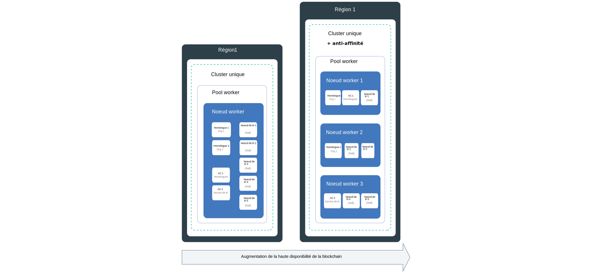
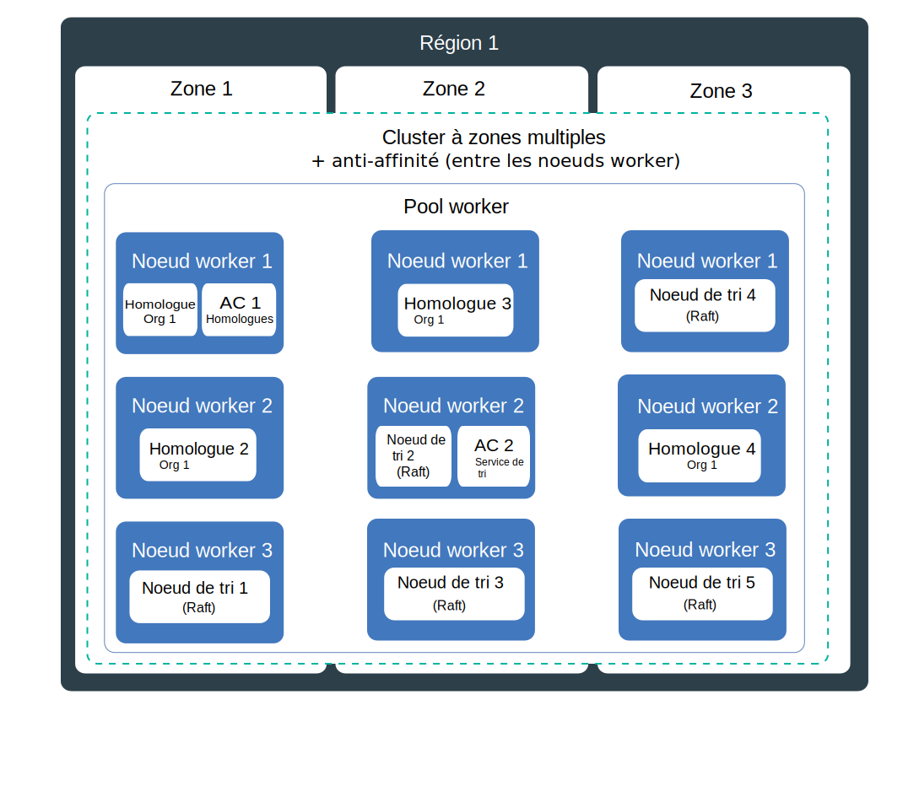
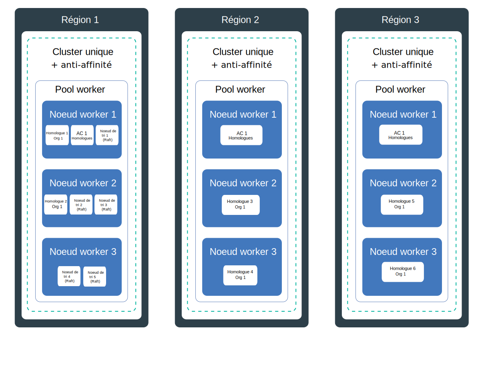

---

copyright:
  years: 2019
lastupdated: "2019-06-21"

keywords: high availability, HA, IBM Cloud, failures, zone failure, region failure, component failure, worker node failure

subcollection: blockchain

---

{:external: target="_blank" .external}
{:shortdesc: .shortdesc}
{:screen: .screen}
{:codeblock: .codeblock}
{:note: .note}
{:important: .important}
{:tip: .tip}
{:pre: .pre}

# Haute disponibilité (HA)
{: #ibp-console-ha}

Utilisez les fonctions Kubernetes intégrées ainsi que les stratégies de déploiement de composant {{site.data.keyword.blockchainfull}} Platform afin d'accroître la haute disponibilité de vos réseaux de blockchain et de protéger votre réseau contre les immobilisations en cas de panne dans votre cluster.
{:shortdesc}

**Public cible :** Cette rubrique s'adresse aux architectes et aux administrateurs système qui sont responsables de la planification et de la configuration d'{{site.data.keyword.blockchainfull_notm}} dans {{site.data.keyword.cloud_notm}} ou dans {{site.data.keyword.cloud_notm}} Private.

La haute disponibilité est une discipline fondamentale dans une infrastructure informatique pour maintenir vos applications opérationnelles même après une panne affectant une partie ou l'ensemble du site. L'objectif principal de la haute disponibilité est d'éliminer les points de défaillance potentiels au sein d'une infrastructure informatique. Par exemple, vous pouvez anticiper une panne système en ajoutant des modules de redondance et en configurant des mécanismes de basculement.

Vous pouvez atteindre la haute disponibilité sur différents niveaux dans votre infrastructure informatique et au sein de différentes couches de votre cluster. Le niveau de disponibilité qui convient dépend de plusieurs facteurs, tels que les besoins de votre entreprise, les accords sur les niveaux de licence que vous avez avec vos organisations, ainsi que le coût de la redondance.

Avant de poursuivre, nous vous recommandons de consulter les instructions spécifiques à votre plate-forme concernant la haute disponibilité :
- Si vous utilisez {{site.data.keyword.cloud_notm}}, vous pouvez en apprendre davantage sur le fonctionnement de la haute disponibilité avec Kubernetes dans {{site.data.keyword.cloud_notm}} dans la rubrique relative à la [haute disponibilité pour {{site.data.keyword.cloud_notm}} Kubernetes Service](/docs/containers?topic=containers-ha){: external}.
- Si vous utilisez {{site.data.keyword.cloud_notm}} Private, passez en revue les informations relatives à l'[implémentation de la haute disponibilité dans {{site.data.keyword.cloud_notm}} Private](https://www.ibm.com/cloud/garage/practices/manage/high-availability-ibm-cloud-private){: external}.  

Vous pouvez consulter cette rubrique pour plus détails sur les conseils spécifique à la haute disponibilité et les recommandations des rubriques ci-dessus spécifiques à la plateforme. 

## Présentation des points de défaillance possibles dans {{site.data.keyword.blockchainfull_notm}} Platform for {{site.data.keyword.cloud_notm}}
{: #ibp-console-ha-points-of-failure}

L'architecture d'{{site.data.keyword.blockchainfull_notm}} Platform est conçue pour garantir fiabilité, faible latence de traitement et disponibilité maximum du service. Cependant, il peut y avoir des incidents. {{site.data.keyword.blockchainfull_notm}} Platform propose plusieurs approches pour ajouter une plus grande disponibilité dans votre cluster par l'ajout de politiques de redondance et d'[anti-affinité](https://www.ibm.com/blogs/cloud-archive/2016/07/ibm-containers-anti-affinity/){: external}, le cas échéant, pour garantir que les composants de blockchain de même type et organisation sont déployés dans différents noeuds worker. En ajoutant de la redondance au sein de votre réseau de blockchain, vous pouvez éviter des pannes ou des immobilisations.  

Pour atteindre une haute disponibilité maximum, il est recommandé de générer de la redondance en mettant à disposition des homologues et des noeuds de tri dans des clusters Kubernetes dans plusieurs régions. Lorsque les composants sont propagés dans des régions et que le registre de blockchain est distribué au sein de ces composants, une panne dans une seule région n'aura pas d'incidence sur le traitement des transactions. Les AC sont moins critiques pour le traitement quotidien des transaction. Une fois que tous les utilisateurs sont enregistrés et inscrits auprès de l'AC, il n'est plus obligatoire jusqu'au moment où ces services sont de nouveau requis.

### Remarques relatives aux homologues
{: #ibp-console-ha-peers}

La haute disponibilité pour les homologues signifie avoir des homologues redondants, c'est-à-dire au moins deux homologues disponibles pour chaque organisation sur le même canal pour traiter les demandes des applications client. Plusieurs homologues peuvent être déployés sur un seul noeud worker, ou propagés sur plusieurs noeuds worker, zones (si vous utilisez {{site.data.keyword.cloud_notm}}), ou même des régions. Chaque fois que vous déployez plusieurs homologues et les joignez au même canal, ces homologues font office de paire HA car le canal et les données sont automatiquement synchronisés au sein de tous les homologues dans le canal. De par sa conception, un réseau de blockchain est supposé comporter plusieurs organisations qui effectuent des transactions sur les mêmes canaux.  Par conséquent, le modèle de déploiement courant est que pour un canal donné, il existe des homologues redondants pour chaque organisation qui se propagent au sein de plusieurs clusters de compte d'organisation qui synchronisent tous des données entre eux. Chaque organisation peut comporter un homologue dans son propre cluster dans une région. 

Pour une couverture de haute disponibilité encore plus robuste, vous pouvez mettre en place plusieurs clusters dans plusieurs régions et déployer des homologues dans l'ensemble de ces régions. Toutefois, si vous recherchez de hautes performances, vous devez être prudent lors de la distribution des homologues afin de garantir que la latence et la bande passante entre eux sont suffisantes pour atteindre vos objectifs de performances.

Les **homologues d'ancrage** dans un canal facilitent la communication entre organisations qui est nécessaire pour que fonctionne la reconnaissance de données privées, des échanges gossip et des service. Si un seul homologue d'ancrage existe dans un canal, et que cet homologue devient indisponible, les organisations ne sont plus connectées et la communication gossip entre organisations n'est plus possible. Par conséquent, lorsque vous créez des homologues redondants pour une organisation, veillez à ajouter des [homologues d'ancrage dans le canal](/docs/services/blockchain?topic=blockchain-ibp-console-govern#ibp-console-govern-channels-anchor-peers) également.

### Remarques relatives au service de tri 
{: #ibp-console-ha-ordering-service}

{{site.data.keyword.blockchainfull_notm}} Platform repose sur Hyperledger Fabric version 1.4.1 qui inclut le service de tri Raft. Raft est un service tri tolérant aux pannes reposant sur l'implémentation du [protocole Raft](https://raft.github.io/raft.pdf){: external}. De par leur conception, les noeuds de tri se synchronisent automatiquement entre eux à l'aide d'un consensus basé sur Raft. Dans {{site.data.keyword.blockchainfull_notm}} Platform, l'opérateur réseau d'une organisation peut choisir de mettre en place un service de tri single Raft basé sur un seul noeud, sans haute disponibilité, ou cinq services de tri dans une seule single région qui sont automatiquement configurés pour la haute disponibilité via Raft.

## Liste de contrôle HA
{: #ibp-console-ha-checklist}

Le tableau suivant contient une liste des options à prendre en compte lorsque vous planifiez divers degrés de haute disponibilité.

|  | Noeud unique | Cluster unique avec plusieurs noeuds | Multizone ({{site.data.keyword.cloud_notm}} uniquement**)| Plusieurs clusters entre régions |
|-----|-----|-----|-----|-----|
| Homologues redondants |  |  |  |  |
| Anti-affinité (homologues) |  |  |  | |
| Homologues d'ancrage redondants dans un canal|  |  |  | |
| Service de tri Raft |  |  |  | |
| Anti-affinité (noeuds de tri) |  |  |  | |
| Environnement de développement ou de test |  |  | | |
| Environnement de production | | |  |  |
{: row-headers}
{: class="comparison-table"}
{: caption="Tableau 1. Comparaison de scénarios de déploiement pour augmenter la haute disponibilité de votre réseau " caption-side="top"}
{: summary="This table has row and column headers. The row headers identify the deployment scenarios. The column headers identify available options in each scenario to increase your HA."}
** La configuration par défaut pour un cluster Kubernetes standard dans {{site.data.keyword.cloud_notm}} est de un cluster de 4 UC x 16 Go de RAM comportant trois de trois noeuds worker chacune. Vous pouvez augmenter ou réduire, en sélectionnant une configuration plus petite, selon vos besoins.

## Points de défaillance possibles
{: #ibp-console-ha-points-of-failure}

{{site.data.keyword.blockchainfull_notm}} Platform propose plusieurs approches pour ajouter davantage de disponibilité à votre réseau en ajoutant de la redondance et en utilisant des politiques anti-affinité. Consultez les diagrammes suivants pour en savoir plus sur les points de défaillance potentiels et comment les éliminer. Vous pouvez sélectionner un modèle basé sur l'importance de votre application, les niveaux de service et les coûts. En règle générale, vous pouvez implémenter la redondance pour atteindre vos niveaux de service. Tous ces scénarios doivent être pondérés par rapport aux coûts liés à l'implémentation d'une résilience accrue.

### Haute disponibilité à région unique
{: #ibp-console-ha-single-region}




1. **Défaillance de composant.**

   **Cluster à zone unique** :  

   Chaque fois que vous déployez un composant de blockchain, comme un homologue ou un noeud de tri, un nouveau pod est créé pour le composant dans un noeud worker. De par leur conception, les conteneurs ont une durée de vie brève et ne sont pas à l'abri de défaillances inattendues. Par exemple, un conteneur ou un pod peuvent tomber en panne si une erreur se produit dans le composant. Ainsi, pour rendre votre homologue hautement disponible, vous devez vous assurer que vous avez suffisamment d'instances de ce dernier pour gérer la charge de travail et d'autres instances en cas de défaillance.

   **Homologues** Combien d'homologues sont nécessaires ? Dans un environnement de production, il est recommandé de déployer trois homologues de la même organisation pour chaque canal. Il s'agit ainsi de prévoir la mise hors service d'un homologue (par exemple, pendant un cycle de maintenance) tout en conservant une haute disponibilité de deux homologues. Par conséquent, pour compenser une défaillance d'homologue, et pour le niveau de haute disponibilité le plus basique, vous pouvez obtenir une redondance homologue par simple déploiement de trois homologues par organisation dans un canal sur votre noeud worker. Notez que vous devez vous assurer que vous avez suffisamment de ressources disponibles sur votre noeud pour prendre en charge ces composants.

   **Service de tri** Comme indiqué plus haut, le service de tri HA est basé sur Raft, et il contient cinq noeuds de tri par défaut. Etant donné que le système peut supporter la perte de noeuds, notamment les noeuds principaux, dès lors qu'il reste une majorité de noeuds de tri (ce que l'on appelle un "le quorum"), Raft est dit "tolérant aux pannes" (CFT). En d'autres termes, si vous avez cinq noeuds dans un canal, vous pouvez en perdre deux (en laissant trois noeuds restants). Lorsque vous déployez un service de tri à partir de la console, sélectionnez le service à cinq noeuds pour la haute disponibilité.  

   Ce scénario utilise des homologues et des services de tri redondants sur un seul noeud worker, qui protège contre la défaillance d'un composant, mais il ne peut pas vous protéger de la défaillance d'un noeud. Par conséquent, il ne peut être utilisé qu'à des fins de développement et de tests.

2. **Défaillance de noeud worker.**  

   **Cluster à zone unique avec plusieurs noeuds worker et anti-affinité**:

   Un noeud worker est une machine virtuelle qui s'exécute sur un matériel physique. Parmi les défaillances possibles d'un noeud worker figurent des pannes matérielles, par exemple des pannes de courant, de ventilation ou de réseau ainsi que des défaillances sur la machine virtuelle même. Vous pouvez prévoir une défaillance de noeud worker en définissant plusieurs noeuds worker lors de la mise à disposition de votre cluster. Lorsque des composants de blockchain sont distribués entre plusieurs noeuds worker, vous êtes protégé d'une défaillance de noeud worker. Notez que le service {{site.data.keyword.cloud_notm}} Kubnernetes inclut la possibilité de plusieurs zones dans un cluster. {{site.data.keyword.cloud_notm}} Private ne prend pas en charge les zones.

   **Homologues** La politique anti-affinité déployeur d'{{site.data.keyword.blockchainfull_notm}} Platform distribue les homologues redondants, c'est-à-dire les homologues de la même organisation, entre les noeuds worker dans leur cluster ou zone.

   **Service de tri** Chaque fois que vous déployez un service de tri Raft, les cinq noeud de tri sont automatiquement distribués entre les noeuds worker dans votre cluster, à l'aide de la politique anti-affinité et sur la base de la disponibilité de ressource sur les noeuds.  

   Ce scénario utilise des homologues et des services de tri redondants entre plusieurs noeuds worker dans un seul cluster ou zone, qui protège contre la défaillance de noeud, mais il ne peut pas protéger de la défaillance d'un cluster ou d'une zone. Par conséquent, il n'est pas recommandé pour la production.

### Haute disponibilité multizone (service {{site.data.keyword.cloud_notm}} Kubernetes uniquement)
{: #ibp-console-ha-multi-zone}

_Ce scénario s'applique uniquement aux clients qui utilisent {{site.data.keyword.cloud_notm}} Kubernetes Service._



   **Défaillance de zone.**  

   **Cluster multizone avec plusieurs noeuds worker et anti-affinité**:

   Imaginez une zone comme un centre de données. Une défaillance de zone affecte tous les hôtes de calcul physiques et le stockage NFS. Ces défaillances peuvent être des pannes de courant, de ventilation, de réseau ou de stockage ou être dues à des catastrophes naturelles, telles que des inondations, des tremblements de terre ou des ouragans. Pour vous protéger contre les défaillances de zone, vous devez avoir au moins deux clusters dans différentes zones qui sont équilibrées par un équilibreur de charge externe. Par défaut, lorsque vous déployez un cluster Kubernetes dans {{site.data.keyword.cloud_notm}}, le cluster est configuré avec une prise en charge multizone, dont trois zones, bien que vous puissiez choisir deux zones.

   Une seule zone est suffisante pour un environnement de développement et de tests si vous pouvez tolérer une indisponibilité de zone. Par conséquent, pour optimiser les avantages de la haute disponibilité de plusieurs zones, lorsque vous mettez à disposition votre cluster, vérifiez que plusieurs zones sont sélectionnées. Deux zones valent mieux qu'une, mais trois zones sont recommandées pour la haute disponibilité afin d'augmenter la probabilité que les deux autres zones peuvent absorber la charge d'une autre zone défaillante.  Lorsque les homologues redondants de la même organisation ainsi que le canal et les noeuds de tri sont propagés sur plusieurs zones, une défaillance dans une zone ne devrait pas affecter la capacité du réseau de traiter les transactions car la charge de travail sera déplacée vers les noeuds de blockchain dans les autres zones.

   Le déployeur {{site.data.keyword.blockchainfull_notm}} Platform ne peut pas garantir que les composants de blockchain sont propagés entre les **zones**. Le déployeur va déployer des composants dans plusieurs zones en fonction des ressources disponibles sur les noeuds worker, mais il ne placera pas nécessairement deux homologues de la même organisation ou les noeuds de tri dans des zones distinctes.  {:note}

   Ce scénario utilise des homologues et des services de tri redondants entre plusieurs noeuds worker dans plusieurs zones, ce qui protège contre la défaillance de zone, mais cela ne protège pas contre une défaillance d'une zone entière. Il s'agit d'un scénario recommandé pour un réseau de production.

### Haute disponibilité multi-région
{: #ibp-console-ha-multi-region}

Ce scénario propose le niveau de haute disponibilité le plus élevé possible.



   **Défaillance de région.**

   **Cluster multi-région avec plusieurs noeuds worker et anti-affinité**:

   La probabilité d'une défaillance totale au niveau de la région est faible. Toutefois, pour prendre en compte cet incident, vous pouvez configurer plusieurs clusters dans différentes régions où chaque cluster a sa propre console liée. En cas de défaillance d'une région entière, les homologues redondants dans le cluster des autres régions peuvent traiter la charge de travail. Pour les environnements de production, la configuration des **homologues** de votre blockchain entre plusieurs régions offre la couverture de haute disponibilité maximum disponible.

   Ce scénario utilise des homologues redondants entre plusieurs noeuds worker dans plusieurs régions, ce qui fournit le plus haut degré de haute disponibilité. Il s'agit aussi d'un scénario recommandé pour un réseau de production si vos exigences en termes de résilience méritent un tel investissement.  

   Consultez la rubrique relative à la [configuration de déploiements de haute disponibilité multi-région](/docs/services/blockchain?topic=blockchain-ibp-console-hadr-mr) pour connaître les étapes de configuration de vos homologues {{site.data.keyword.blockchainfull_notm}} Platform sur plusieurs régions.


## Reprise après incident
{: #ibp-console-ha-dr}

Dans tous les cas, pour vous protéger contre l'altération de données, il est recommandé de sauvegarder régulièrement le stockage associé à chaque composant déployé. Etant donné que le registre est partagé entre tous les homologues et noeuds de tri, la réalisation régulière de sauvegardes est essentielle. Par exemple, si un registre d'homologue est endommagé, il sera propagé à tous les registres d'homologue, et une sauvegarde est ainsi nécessaire pour restaurer le registre dans le réseau. Vous pouvez décider de la fréquence à laquelle effectuer vos sauvegardes en fonction de vos exigences de reprise, mais d'une manière générale il vaux mieux effectuer des sauvegardes quotidiennes.  

| Fournisseur de solutions de stockage | Conseils |
|----------|---------|
| Solution de stockage {{site.data.keyword.cloud_notm}} | Vous pouvez optimiser la [fonction fournie par le service {{site.data.keyword.cloud_notm}} Kubernetes ](/docs/services/RegistryImages/ibm-backup-restore?topic=RegistryImages-ibmbackup_restore_starter#ibmbackup_restore_starter){: external}. Gardez néanmoins à l'esprit que sans fonction d'instantané, les noeuds doivent être [arrêtés](#ibp-console-ha-stop-nodes) afin de garantir une sauvegarde fiable.  |
| Solution de stockage {{site.data.keyword.cloud_notm}} Private | Vous pouvez utiliser la technologie de sauvegarde ou de restauration fournie par votre fournisseur de stockage. Encore une fois, vous devez vous assurer que vous avez [arrêté](#ibp-console-ha-stop-nodes) les noeuds avant d'effectuer la sauvegarde. |
| Portworx | Une [fonction d'instantané](https://docs.portworx.com/portworx-install-with-kubernetes/cloud/ibm/#prerequisites){: external} est disponible pour la réalisation de sauvegardes sans arrêter les noeuds. |
{: caption="Tableau 2. Recommandations relatives à la sauvegarde pour le stockage" caption-side="top"}

Lorsque vous devez restaurer une sauvegarde, il est nécessaire d'effectuer la restauration des sauvegardes sur chaque composant au sein de votre réseau.

### Arrêt des noeuds pour préparer une sauvegarde
{: #ibp-console-ha-stop-nodes}

Si vous n'utilisez pas Portworx comme solution de stockage, vous pouvez utiliser la commande `kubectl` suivante pour arrêter les noeuds avant d'effectuer la sauvegarde, par exemple :

   ```
   kubectl scale deployment my-deployment --replicas=0
   ```
   {:codeblock}

   Exécutez la sauvegarde.
   Redémarrez les noeuds :

   ```
   kubectl scale deployment my-deployment --replicas=1
   ```
   {:codeblock}
