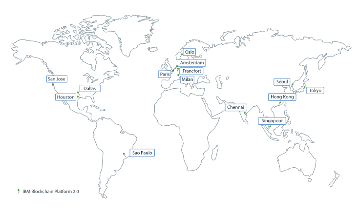
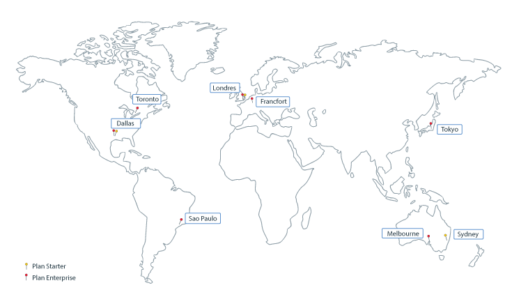

---

copyright:
  years: 2017, 2019
lastupdated: "2019-05-16"

keywords: data centers, IBM Cloud regions, available locations

subcollection: blockchain

---

{:external: target="_blank" .external}
{:shortdesc: .shortdesc}
{:screen: .screen}
{:pre: .pre}
{:table: .aria-labeledby="caption"}
{:codeblock: .codeblock}
{:tip: .tip}
{:download: .download}

# Emplacements d'{{site.data.keyword.blockchainfull_notm}} Platform
{: #ibp-regions-locations}

{{site.data.keyword.cloud}} est hébergé à différents emplacements dans le monde entier. Ces emplacements sont des centres de données au sein d'une zone géographique dont l'accès se fait par un noeud final. {{site.data.keyword.blockchainfull_notm}} Platform permet le déploiement de réseaux de blockchain au sein d'{{site.data.keyword.cloud_notm}} de manière globale dans différents emplacements. Lorsque vous créez une instance de service {{site.data.keyword.blockchainfull_notm}} Platform dans {{site.data.keyword.cloud_notm}}, votre réseau Blockchain et les ressources réseau sont créées et stockées dans l'emplacement {{site.data.keyword.cloud_notm}} où vous avez créé l'instance de service.
{:shortdesc}

Différentes offres {{site.data.keyword.blockchainfull_notm}} Platform sont disponibles dans les différents emplacements {{site.data.keyword.cloud_notm}}. Vous ne pouvez créer des réseaux de blockchain que dans les emplacements {{site.data.keyword.cloud_notm}} où les plans {{site.data.keyword.blockchainfull_notm}} Platform sont disponibles.

Le Tableau 1 et la Figure 1 présentent les emplacements {{site.data.keyword.cloud_notm}} pris en charge par {{site.data.keyword.blockchainfull_notm}} Platform {{site.data.keyword.cloud_notm}}.

Si vous voulez utiliser un cluster {{site.data.keyword.cloud_notm}} Kubernetes gratuit, ne le choisissez pas en Asie-Pacifique. Sinon, votre cluster gratuit sera créé à Melbourne en Asie-Pacifique sud et non en Asie-Pacifique nord. Les clusters d'Asie-Pacifique sud ne peuvent pas être utilisés pour déployer {{site.data.keyword.blockchainfull_notm}} Platform version 2.0 à l'heure actuelle. Choisissez les emplacements **Sud des Etats-Unis** ou **Centre de l'UE** si vous prévoyez d'utiliser un cluster gratuit.
{: note}

| Région | Emplacements {{site.data.keyword.cloud_notm}} |
|--------|--------------------|
| Sud des Etats-Unis | San Jose, Sao Paulo, Dallas, Houston |
| Asie-Pacifique nord | Tokyo, Chennai, Hong Kong, Séoul, Singapour |
| Centre de l'UE | Francfort, Amsterdam, Milan, Oslo, Paris |

_Tableau 1. Emplacements d'{{site.data.keyword.blockchainfull_notm}} Platform {{site.data.keyword.cloud_notm}}_

Le Tableau 2 et la Figure 2 présentent les emplacements {{site.data.keyword.cloud_notm}} pris en charge par le plan Starter et le plan Enterprise d'{{site.data.keyword.blockchainfull_notm}} Platform.

| Emplacement | Plan Starter | Plan Enterprise |
|--------|----------|----------|
| Dallas | O | O |
| Londres | O | O |
| Tokyo |  | O |
| Francfort |  | O |
| Sydney | O |  |
| Melbourne |  | O |
| São Paulo |  | O |
| Toronto |  | O |

_Table 2. Emplacements du plan Starter et du plan Enterprise_

