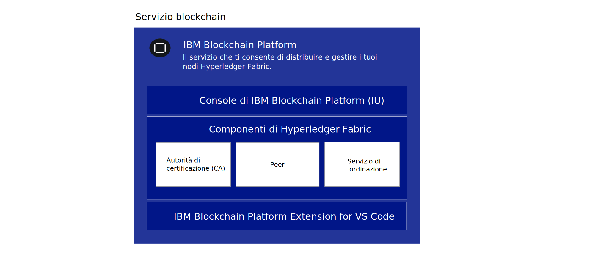
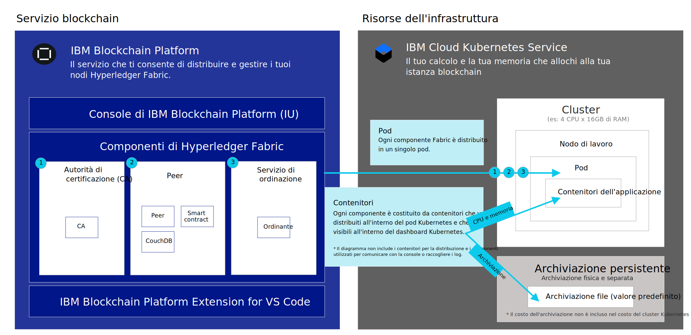

---

copyright:
  years: 2019
lastupdated: "2019-05-31"

keywords: getting started tutorials, videos, web browsers

subcollection: blockchain

---

{:external: target="_blank" .external}
{:shortdesc: .shortdesc}
{:screen: .screen}
{:codeblock: .codeblock}
{:note: .note}
{:important: .important}
{:tip: .tip}
{:pre: .pre}
{:gif: data-image-type='gif'}

# Introduzione a {{site.data.keyword.blockchainfull_notm}} Platform for {{site.data.keyword.cloud_notm}}
{: #ibp-v2-deploy-iks}

{{site.data.keyword.blockchainfull}} Platform for {{site.data.keyword.cloud_notm}} include la console {{site.data.keyword.blockchainfull_notm}} Platform, un'interfaccia utente che può semplificare e accelerare le operazioni da te eseguite per distribuire e gestire i componenti blockchain. Questa esercitazione descrive come iniziare a lavorare con {{site.data.keyword.blockchainfull_notm}} Platform for {{site.data.keyword.cloud_notm}} e utilizzare la console per distribuire e gestire i componenti blockchain nel tuo cluster {{site.data.keyword.cloud_notm}} Kubernetes Service su {{site.data.keyword.cloud_notm}}. Per ulteriori informazioni su Kubernetes e sul servizio {{site.data.keyword.cloud_notm}} Kubernetes, vedi [Kubernetes](/docs/services/blockchain/reference/k8s.html "Kubernetes").
{:shortdesc}

**Gruppi di destinatari:** questo argomento è pensato per gli amministratori del sistema che sono responsabili della configurazione di un cluster Kubernetes su {{site.data.keyword.cloud_notm}} e per la distribuzione di {{site.data.keyword.blockchainfull_notm}} Platform.

Dopo aver collegato {{site.data.keyword.blockchainfull_notm}} Platform al tuo cluster Kubernetes {{site.data.keyword.cloud_notm}}, puoi avviare la console per creare e gestire i tuoi componenti blockchain e riscontrare i seguenti importanti vantaggi:

- **Controllo:** controlli e gestisci i tuoi certificati e i tuoi componenti blockchain da una singola console centrale. Distribuisci solo i componenti necessari per la tua attività di business e ne aggiungi altri man mano che le tue esigenze aumentano.
- **Distribuzione basata su Kubernetes flessibile:** puoi avvalerti delle opzioni di calcolo (CPU, memoria, archiviazione) per il tuo cluster Kubernetes e sfruttare le opzioni HA e DR integrate.

## Che cos'è il servizio Blockchain?
{: #ibp-v2-deploy-iks-blockhain-service}

Il seguente diagramma illustra i tre elementi di {{site.data.keyword.blockchainfull_notm}} Platform:



- **Console {{site.data.keyword.blockchainfull_notm}} (IU)**: questa è la console che ti consente di creare e gestire i tuoi componenti blockchain. Dopo che hai eseguito il provisioning di un'istanza del servizio in {{site.data.keyword.cloud_notm}}, puoi distribuire un'istanza della console {{site.data.keyword.blockchainfull_notm}} e collegarla al tuo cluster {{site.data.keyword.cloud_notm}} Kubernetes. Puoi quindi utilizzare la console per creare e gestire i tuoi componenti blockchain nel tuo cluster Kubernetes. Non c'è alcun addebito per la console.

- **Componenti di Hyperledger Fabric**: la console viene utilizzata per creare e gestire i componenti blockchain che sono basati sulle immagini di servizio di ordine, peer e CA (Certificate Authority) di Hyperledger Fabric v1.4.1. Questi componenti vengono distribuiti nel tuo cluster di Kubernetes e viene eseguito il provisioning dell'archiviazione per essi utilizzando la classe di archiviazione predefinita (`default`) quando vengono distribuiti.

- **Estensione {{site.data.keyword.IBM_notm}} VS Code (Strumenti di sviluppo)**: scarica l'estensione VS Code dal marketplace VS Code per iniziare a sviluppare, impacchettare e verificare applicazioni client e smart contract.

## Considerazioni
{: #ibp-v2-deploy-iks-considerations}

Prima di distribuire la console, assicurati di aver compreso le seguenti considerazioni:

- {{site.data.keyword.blockchainfull_notm}} Platform for {{site.data.keyword.cloud_notm}} è sviluppato con Hyperledger Fabric v1.4.1.
- Tutti i peer distribuiti con la console o le API utilizzano CouchDB come loro database dello stato.
- Hai l'opzione di collegare la tua istanza del servizio {{site.data.keyword.blockchainfull_notm}} Platform a un cluster Kubernetes gratuito per la valutazione dell'offerta; tuttavia, capacità e prestazioni sono limitate, nessuno dei tuoi dati può essere migrato e il cluster viene eliminato dopo 30 giorni.
- Mentre la versione di prova beta è gratuita, dovrai ancora pagare per il tuo cluster Kubernetes, se scegli un cluster a pagamento.
- Sei responsabile della gestione del monitoraggio dell'integrità, della sicurezza e della registrazione del tuo cluster Kubernetes. Vedi queste [informazioni](/docs/containers/cs_responsibilities.html#your-responsibilities-by-using-ibm-cloud-kubernetes-service){: external} per i dettagli su quanto gestito da {{site.data.keyword.cloud_notm}} e su quanto è una tua responsabilità.
- Sei anche responsabile del monitoraggio dell'utilizzo delle risorse del tuo cluster Kubernetes utilizzando il dashboard Kubernetes. Se devi aumentare la capacità di archiviazione o le prestazioni del tuo cluster, vedi queste informazioni su come [modificare il tuo volume esistente](/docs/containers/cs_storage_file.html#change_storage_configuration){: external}.
- Sei responsabile della gestione e della protezione dei tuoi certificati e delle tue chiavi private. {{site.data.keyword.IBM_notm}} non archivia i tuoi certificati nel cluster Kubernetes.
- {{site.data.keyword.blockchainfull_notm}} Platform è disponibile in regioni selezionate. Fai riferimento a questo argomento sulle [Ubicazioni {{site.data.keyword.blockchainfull_notm}} Platform](/docs/services/blockchain/howto?topic=blockchain-ibp-regions-locations) per un elenco aggiornato.
- Kubernetes deve essere alla versione 1.11 o a una versione stabile successiva nel tuo cluster {{site.data.keyword.cloud_notm}} Kubernetes. Utilizza queste istruzioni per [eseguire un upgrade dei tuoi cluster nuovi ed esistenti](/docs/services/blockchain/howto/ibp-v2-deploy-iks.html#ibp-v2-deploy-iks-updating-kubernetes) a questa versione.
- Se non desideri utilizzare l'archiviazione file Bronze predefinita che è preselezionata per tuo conto quando esegui il provisioning di un cluster Kubernetes in {{site.data.keyword.cloud_notm}}, puoi eseguire il provisioning di archiviazione a tua scelta. Per ulteriori informazioni, vedi questo argomento sulle [Considerazioni sull'archiviazione persistente](/docs/services/blockchain?topic=blockchain-ibp-v2-deploy-iks#ibp-console-storage).
- Se decidi di includere il supporto multizona {{site.data.keyword.cloud_notm}} nel tuo cluster Kubernetes, devi eseguire il provisioning della tua archiviazione. Per ulteriori dettagli, vedi [Utilizzo dei cluster multizona (MZR) con {{site.data.keyword.blockchainfull_notm}} Platform](/docs/services/blockchain?topic=blockchain-ibp-v2-deploy-iks#ibp-console-mzr).

## Esercitazione video
{: #ibp-v2-deploy-video}

Guarda le seguenti [serie di video]( http://ibm.biz/BlockchainPlatformSeries) per ulteriori informazioni sulla console {{site.data.keyword.blockchainfull_notm}} Platform e su come puoi iniziare a distribuire {{site.data.keyword.blockchainfull_notm}} Platform for {{site.data.keyword.cloud_notm}}.

## Prima di cominciare
{: #ibp-v2-deploy-iks-prereq}

Prima di cominciare:

- Assicurati di disporre di un [account a pagamento {{site.data.keyword.cloud_notm}}](https://cloud.ibm.com/catalog/services/blockchain){: external}. Se non hai un account:
   1. Fai clic sul pulsante **Registrazione**.
   2. Dopo aver creato un account gratuito, aggiornalo a un tipo **Pagamento a consumo** andando in **Gestisci** > **Fatturazione e utilizzo** > **Fatturazione** nella console {{site.data.keyword.cloud_notm}} e facendo clic su **Aggiungi carta di credito**.
   3. Assicurati che l'utente abbia entrambi i ruoli di Amministratore e Gestore per il cluster Kubernetes a cui collegherà la sua istanza del servizio blockchain. Per ulteriori informazioni, vedi la seguente procedura su [come assegnare i ruoli di accesso Kubernetes](#ibp-v2-deploy-iks-k8x-access-roles).

Quando intendi utilizzare l'istanza del servizio nel contesto di una più ampia soluzione a livello dell'organizzazione, si consiglia che le organizzazioni partecipanti utilizzino un indirizzo email funzionale per creare la loro rete. In questo caso, l'accesso alla rete non dipende dalla disponibilità di alcun singolo utente.
{:tip}  

- Se intendi utilizzare un cluster {{site.data.keyword.cloud_notm}} Kubernetes Service esistente, controlla la versione di Kubernetes ed eseguine l'upgrade alla versione 1.11 o successiva, se necessario. Per ulteriori informazioni su come determinare quale sia la versione di Kubernetes che il tuo cluster sta eseguendo e su come eseguire un upgrade della versione, vedi [Aggiornamento della versione di Kubernetes del tuo cluster](/docs/services/blockchain/howto/ibp-v2-deploy-iks.html#ibp-v2-deploy-iks-updating-kubernetes).

### Browser
{: #ibp-v2-deploy-iks-browsers}
Il seguente elenco specifica il software browser richiesto minimo per la console {{site.data.keyword.blockchainfull_notm}} Platform.

- Chrome: la versione più recente per il tuo sistema operativo
- Firefox: le versioni regolari (non ESR) più recenti per il tuo sistema operativo
- Safari: la versione più recente per Mac
- Edge: v44.17763.1.0 o superiore

### Risorse richieste
{: #ibp-v2-deploy-iks-resources-required}

#### Consigli relativi alla dimensione del cluster
{: #ibp-v2-deploy-iks-resources-required-free}

 Quando colleghi la tua console {{site.data.keyword.blockchainfull_notm}} Platform a un cluster {{site.data.keyword.cloud_notm}} Kubernetes Service, devi assicurarti che il tuo cluster Kubernetes soddisfi i requisiti minimi relativi alle risorse hardware.

|Tipo di cluster Kubernetes | Caso di utilizzo | CPU | RAM | Nodi di lavoro |
|-----------|------|-----|-----------------------|
|Standard (consigliato) | Adatto per MVP | 4 (condivisa) | 16 GB (condivisa)|multipli|
|Gratuito** | Adatto per la valutazione | 2 | 4 GB | 1 |  
** Visualizza un'anteprima di {{site.data.keyword.blockchainfull_notm}} Platform gratuitamente per 30 giorni quando colleghi la tua istanza del servizio {{site.data.keyword.blockchainfull_notm}} Platform a un cluster gratuito {{site.data.keyword.cloud_notm}} Kubernetes. Le prestazioni saranno limitate da velocità effettiva, archiviazione e funzionalità. {{site.data.keyword.cloud_notm}} eliminerà il tuo cluster Kubernetes dopo 30 giorni e non puoi migrare i nodi o i dati da un cluster gratuito a uno a pagamento.

Queste risorse sono sufficienti per l'esecuzione di test e la sperimentazione. L'[esercitazione Crea una rete](/docs/services/blockchain/howto/ibp-console-build-network.html#ibp-console-build-network), in cui crei due peer, due CA e un servizio di ordine, richiede circa 4,85 CPU, con il servizio di ordine a cinque nodi che ne utilizza fino a 2,25 CPU. Pertanto, se intendi distribuire un servizio di ordine a cinque nodi, non devi distribuire un cluster Kubernetes con un nodo di lavoro singolo da 2 CPU al suo interno poiché non sarà sufficiente per il servizio di ordine. Consigliamo un cluster con dei nodi di almeno 4 CPU. Più nodi di lavoro aggiungi e più facilmente il tuo cluster potrà gestire le tue distribuzioni.
{:note}

#### Cluster a pagamento
{: #ibp-v2-deploy-iks-resources-required-paid}

Le distribuzioni a livello di produzione di {{site.data.keyword.blockchainfull_notm}} Platform saranno distribuite a un cluster a pagamento del servizio {{site.data.keyword.cloud_notm}} Kubernetes. La dimensione e la configurazione di questo cluster dipenderanno dalle esigenze del tuo specifico caso d'uso. Le distribuzioni più grandi dovranno necessariamente essere distribuite su cluster più grandi. Sta a te decidere di quanto il tuo cluster debba essere più grande della tua distribuzione prevista. È opportuno avere almeno un po' di margine poiché consentirà ai peer e ai nodi di ordine di essere parte di ulteriori canali e assumersi una velocità effettiva maggiore senza dover distribuire ulteriori risorse nel tuo cluster Kubernetes **prima** di regolare la dimensione dei tuoi nodi. Per ulteriori informazioni su come vengono regolati questi valori, vedi [Riallocazione di risorse](/docs/services/blockchain/howto/ibp-console-govern.html#ibp-console-govern-reallocate-resources).

La creazione di una distribuzione iniziale di dimensioni sufficienti per consentire la crescita è particolarmente importante per gli utenti che sceglieranno di non utilizzare l'[autoscaler di {{site.data.keyword.cloud_notm}} Kubernetes Service](/docs/containers?topic=containers-ca#ca){: external}, che si può assumere una parte del carico derivante dalla distribuzione di ulteriori nodi e pod per l'utente.

Se da una parte è più semplice avere abbastanza risorse distribuite al servizio {{site.data.keyword.cloud_notm}} Kubernetes e poter espandere i tuoi pod e nodi di lavoro come ritieni adatto senza dover prima aumentare la tua distribuzione cluster Kubernetes, dall'altra è vero che delle distribuzioni cluster Kubernetes più grandi costeranno di più. Gli utenti dovranno valutare con attenzione le loro opzioni e riconoscere i compromessi che stanno facendo indipendentemente dall'opzione che scelgono.

Per avere un'idea di che quantità di archiviazione e calcolo avrai bisogno nel tuo cluster, fai riferimento a questo grafico, che contiene i valori predefiniti correnti per peer, nodo di ordine e CA:

| **Componente** (tutti i contenitori) | CPU  | Memoria (GB) | Archiviazione (GB) |
|--------------------------------|---------------|-----------------------|------------------------|
| **Peer**                       | 1,2            | 2,4                  | 200 (include 100GB per peer e 100GB per CouchDB)|
| **CA**                         | 0,1            | 0,2                  | 20                     |
| **Nodo di ordine**              | 0,45           | 0,9                  | 100                    |

Se intendi distribuire un servizio di ordine Raft a cinque nodi, tieni presente che la tua distribuzione di nodi di ordine aumenterà di un fattore di cinque. Quindi un totale di 2,25 CPU, 4,5 GB di memoria e 500 GB di archiviazione per i cinque nodi Raft. Ciò rende il servizio di ordine a cinque nodi più grande di un nodo di lavoro singolo Kubernetes di 2 CPU.
{:tip}

## Fase uno: Crea un'istanza del servizio in {{site.data.keyword.cloud_notm}}
{: #ibp-v2-deploy-iks-create-service-instance}

Utilizza la seguente procedura per creare un'istanza del servizio di {{site.data.keyword.blockchainfull_notm}} Platform for {{site.data.keyword.cloud_notm}}.

1. Individua il [servizio blockchain](https://cloud.ibm.com/catalog/services/blockchain){: external} nel catalogo {{site.data.keyword.cloud_notm}} oppure cerca `Blockchain` nella tua pagina del catalogo {{site.data.keyword.cloud_notm}}.
2. Ti consigliamo di rinominare il **Nome servizio** per la tua istanza in modo che tu possa riconoscerla facilmente in futuro.
3. Per Beta, **Dallas** è la sola regione disponibile e non può essere modificata. In un cluster a pagamento è possibile scegliere delle regioni aggiuntive. Per ulteriori informazioni, vedi [Regioni](/docs/services/blockchain/reference/ibp_regions.html#ibp-regions-locations).
4. Puoi lasciare i campi relativi alle tag e ai gruppi di risorse invariate.
5. Scegli il piano **Standard** .
6. Fai clic su **Crea** per eseguire il provisioning dell'istanza del servizio.

## Passo due: Distribuisci {{site.data.keyword.blockchainfull_notm}} Platform
{: #ibp-v2-deploy-iks-steps}

Puoi attenerti alle istruzioni per distribuire {{site.data.keyword.blockchainfull_notm}} Platform immediatamente dopo che hai creato l'istanza del servizio.

1. Il passo **Benvenuti e prerequisiti**. Se già hai un cluster {{site.data.keyword.IBM_notm}} Kubernetes Service esistente nella regione **Dallas** e vuoi utilizzarlo per il tuo servizio blockchain, seleziona la casella di spunta. **Se utilizzi un cluster esistente, puoi saltare il prossimo passo; ma assicurati che la versione Kubernetes sia alla v1.11 o a una versione stabile successiva**. Fai clic su **Continua**.
2. Il passo **Crea cluster**. Se selezioni la casella di spunta nel passo 1 per utilizzare un cluster Kubernetes esistente, questo passo viene tralasciato. Altrimenti, fai clic su **Crea un nuovo cluster**, che avvia il dashboard Kubernetes {{site.data.keyword.cloud_notm}} per creare un cluster. Per ulteriori informazioni, vedi [Introduzione a {{site.data.keyword.cloud_notm}} Kubernetes Service](/docs/containers/getting-started.html){: external}. Prevedi del tempo supplementare per il completamento di questo processo.
  - Per informazioni sulle ubicazioni per il tuo cluster, vedi [Regioni](/docs/services/blockchain/reference/ibp_regions.html#ibp-regions-locations).
  - Scegli **Cluster standard (consigliato)** se hai bisogno di un'opzione a più lungo termine che include più nodi per l'alta disponibilità. **Scegli almeno la v.1.11 o una versione stabile successiva.** Per distribuire un cluster a pagamento, vedi [Creazione di un cluster standard](/docs/containers?topic=containers-clusters#clusters_ui_standard){: external}. Nota: se desideri l'alta disponibilità o il ripristino di emergenza, dovrai prendere una decisione in merito alla classe di archiviazione che stai utilizzando. La classe di archiviazione predefinita (`default`) sul cluster verrà utilizzata dal provisioning dinamico. Quindi, i clienti possono impostare qualsiasi classe di archiviazione come quella predefinita. Per ulteriori informazioni, vedi [Decisioni relative alla configurazione dell'archiviazione file](/docs/containers?topic=containers-file_storage#file_predefined_storageclass){: external}.
  - Scegli **Cluster gratuito.** se vuoi visualizzare un'anteprima della piattaforma per meno di 30 giorni. **Nota** che non è possibile eseguire la migrazione da un cluster gratuito a un cluster a pagamento. Il tipo di cluster gratuito offre un'archiviazione e una velocità effettiva delle transazioni limitate. Per istruzioni su cosa fare quando scade il tuo cluster Kubernetes, vedi questo argomento relativo alla [scadenza del cluster Kubernetes](/docs/services/blockchain/howto/ibp-console-manage.html#ibp-console-manage-console-cluster-expiration).
  - Per ulteriori informazioni sulle differenze tra i cluster Kubernetes e a pagamento su {{site.data.keyword.cloud_notm}}, vedi [Confronto tra i cluster standard e gratuito](https://cloud.ibm.com/docs/containers?topic=containers-cluster_types#cluster_types){: external}.  

   Devi ritornare a questa scheda nel tuo browser dopo che hai creato il cluster in modo da poter completare il processo di distribuzione di {{site.data.keyword.blockchainfull_notm}} Platform.  
   {:important}  

  Devi attendere fino a che il tuo cluster non sarà stata distribuito correttamente. Fai quindi clic sul pulsante **Ho un cluster**.
3. La tua versione Kubernetes in esecuzione nel tuo cluster deve essere alla versione 1.11 o successiva. Attieniti alla seguente [procedura](/docs/services/blockchain/howto/ibp-v2-deploy-iks.html#ibp-v2-deploy-iks-updating-kubernetes) per controllare la tua versione del cluster ed eseguire l'upgrade, se necessario. Torna quindi indietro e procedi con queste istruzioni.
4. Il passo **Distribuisci su cluster**. Seleziona il cluster Kubernetes in cui vuoi distribuire {{site.data.keyword.blockchainfull_notm}} Platform dall'elenco a discesa e fai clic su **Distribuisci al cluster**.  

  Se il tuo cluster Kubernetes non è visibile nell'elenco a discesa, potrebbe essere a causa di una delle seguenti condizioni:
  - Il completamento del processo di creazione del cluster può richiedere fino a 60 minuti. Se hai creato un cluster, prevedi del tempo supplementare finché lo stato del tuo cluster non diventa **Normale**.
  - I cluster che si trovano fuori dalla regione **Dallas** non sono visibili e non possono essere utilizzati.
  - Controlla per assicurati che non stai utilizzando la versione ESR di Firefox. In questo caso, passa a un altro browser, come ad esempio Chrome, e riprova.

5. Il passo **Avvia console**. Dopo che il tuo {{site.data.keyword.blockchainfull_notm}} Platform è stato distribuito correttamente, fai clic su **Avvia {{site.data.keyword.blockchainfull_notm}} Platform** per aprire la console {{site.data.keyword.blockchainfull_notm}} Platform. Ci potrebbe volere qualche minuto perché il pulsante diventi abilitato mentre viene eseguito il provisioning della console.

La seguente illustrazione mostra il modo in cui i componenti di {{site.data.keyword.blockchainfull_notm}} Platform vengono distribuiti al cluster Kubernetes.



- **Pod**: quando viene eseguita la distribuzione di ogni CA (Certificate Authority), peer o servizio di ordine, viene creato un nuovo pod in un nodo di lavoro nel tuo cluster.
- **Contenitori dell'applicazione**: i contenitori vengono creati all'interno dei pod per ciascun nodo che viene distribuito.  
- **Archiviazione persistente**: dell'archiviazione per ciascun nodo viene eseguito il provisioning dinamico dalla classe di archiviazione predefinita (`default`) del cluster Kubernetes ogni volta che viene distribuito un nodo.

## (Facoltativo) Aggiungi ulteriori utenti alla console
{: #ibp-v2-deploy-iks-add-users}

Per impostazione predefinita, la console utilizza [{{site.data.keyword.cloud_notm}} IAM (Identity and Access Management)](/docs/iam?topic=iam-iamoverview#iamoverview){: external} come provider del servizio di identità di {{site.data.keyword.cloud_notm}}. Il provisioning della tua console {{site.data.keyword.blockchainfull_notm}} Platform viene eseguito configurando l'indirizzo email del proprietario {{site.data.keyword.IBM_notm}} come amministratore della console. Come amministratore, questo utente è autorizzato a concedere ad altri utenti l'accesso alla console tramite i loro indirizzi email.  Per ulteriori informazioni, vedi queste istruzioni su come [aggiungere e rimuovere utenti dalla console](/docs/services/blockchain?topic=blockchain-ibp-console-manage-console#ibp-console-manage-console-add-remove).

## Passi successivi
{: #ibp-v2-deploy-iks-next-steps}

- Prima di creare qualsiasi nodo, devi prendere una decisione in merito al plug-in di archiviazione per il tuo cluster Kubernetes. Se stai iniziando ora a utilizzare il prodotto e ne stai provando le funzioni, è adatta l'archiviazione file Bronze predefinita che è preselezionata per tuo conto quando esegui il provisioning del cluster. Non è richiesta alcuna ulteriore azione in questo momento. Quando però sei pronto a distribuire un cluster per la verifica formale o un utilizzo di produzione, devi prendere una decisione in merito al plug-in di archiviazione appropriato per le tue esigenze. Per iniziare, vedi questo argomento sulle [Considerazioni sull'archiviazione persistente](#ibp-console-storage).

- Ora che la tua console è pronta per l'utilizzo, puoi procedere con l'[Esercitazione di creazione di una rete](/docs/services/blockchain/howto/ibp-console-build-network.html#ibp-console-build-network).
Considera di contrassegnare con un segnalibro l'URL della tua console in modo da poterci tornare in un secondo momento se necessario. Altrimenti, puoi seguire la procedura in [Istruzioni di post-installazione](#ibp-v2-deploy-iks-post-install) per ritornarci dal tuo browser.

## Aggiornamento della versione di Kubernetes del tuo cluster
{: #ibp-v2-deploy-iks-updating-kubernetes}

Se utilizzi un cluster {{site.data.keyword.cloud_notm}} Kubernetes Service esistente, assicurati che Kubernetes sia alla versione 1.11 o successiva.

Puoi controllare la versione di Kubernetes del tuo cluster nella [pagina dei cluster Kubernetes ](https://cloud.ibm.com/kubernetes/clusters){: external} su {{site.data.keyword.cloud_notm}}, che elenca tutti i tuoi cluster in una tabella.

Se la versione di Kubernetes non è alla versione 1.11 o successiva, devi completare la seguente procedura per aggiornare la versione di Kubernetes del tuo cluster.

1. Fai clic sull'icona del menu di overflow alla fine della riga e seleziona **Aggiorna versione**. Il completamento di questo processo richiede circa un'ora. Se la versione viene aggiornata correttamente, puoi vedere la versione aggiornata del tuo cluster nella colonna **Versione Kubernetes**.  
2. Seleziona una versione di 1.11 o successiva dall'elenco a discesa delle versioni di Kubernetes e fai clic su **Aggiorna**.
3. Fai clic sul tuo cluster e vai alla scheda **Nodi di lavoro**. Seleziona la casella di spunta davanti al nodo di lavoro che desideri aggiornare e fai clic su **Aggiorna Kubernetes** dalla barra dei menu a comparsa. Se il tuo cluster contiene più nodi di lavoro, devono essere aggiornati tutti.

  Gli aggiornamenti ai nodi di lavoro possono causare tempi di inattività per applicazioni e servizi. L'immagine della macchina del nodo di lavoro viene ricreata e i dati vengono eliminati se non sono [archiviati al di fuori del pod](https://cloud.ibm.com/docs/containers/cs_storage_planning.html#persistent_storage_overview){: external}.
  {:important}

{: gif}

Per ulteriori informazioni sull'aggiornamento della versione di Kubernetes per un cluster {{site.data.keyword.IBM_notm}} Kubernetes Service e i nodi di lavoro, vedi, [Aggiornamento dei cluster, dei nodi di lavoro e degli elementi aggiuntivi](/docs/containers?topic=containers-update#update){: external}.  

Devi attendere il completamento dell'aggiornamento prima di poter [riprendere la distribuzione di {{site.data.keyword.blockchainfull_notm}} Platform](/docs/services/blockchain/howto/ibp-v2-deploy-iks.html#ibp-v2-deploy-iks-steps).

## Come assegnare i ruoli di accesso Kubernetes
{: #ibp-v2-deploy-iks-k8x-access-roles}

L'utente che collega l'istanza del servizio blockchain al cluster Kubernetes deve disporre dei ruoli di Amministratore e Gestore in Kubernetes.
Per configurare questo accesso, devi completare la seguente procedura:
   1. Nel dashboard {{site.data.keyword.cloud_notm}}, fai clic sull'elenco a discesa **Gestisci** e quindi su **Accesso(IAM)**.
   2. Nel menu di navigazione di sinistra, fai clic su **Utenti** e fai clic sull'ID dell'utente che collegherà l'istanza del servizio al cluster Kubernetes.
   3. Fai clic su **Politiche di accesso** e quindi su **Assegna accesso**.
   4. Fai clic sul tile **Assegna l'accesso alle risorse**.
   5. Nell'elenco a discesa **Servizi**, seleziona **Servizio Kubernetes**.
   6. Seleziona i ruoli **Amministratore** e **Gestore** per questo utente.
   7. Fai clic su **Assegna**.

{: gif}

Per ulteriori informazioni sul controllo dell'accesso Kubernetes, vedi il documento relativo a [come scegliere la politica di accesso e il ruolo corretti per i tuoi utenti](/docs/containers?topic=containers-users#access_roles).

## Istruzioni di post-installazione
{: #ibp-v2-deploy-iks-post-install}

Dopo che hai distribuito la tua console, puoi fare clic sul pulsante **Avvia {{site.data.keyword.blockchainfull_notm}} Platform** per aprire la console nel tuo browser. Puoi aggiungere l'URL della console come un segnalibro al tuo browser.

### Ritorno alla tua console da {{site.data.keyword.cloud_notm}}
{: #ibp-v2-deploy-iks-rtn-to-console}

Se non hai l'URL della console, puoi trovarla dal tuo dashboard {{site.data.keyword.cloud_notm}}.

1. Nel tuo browser, apri l'[elenco risorse di {{site.data.keyword.cloud_notm}}](https://cloud.ibm.com/resources){: external}. Devi eseguire l'accesso con il tuo ID {{site.data.keyword.IBM_notm}}.
2. La tua istanza del servizio {{site.data.keyword.blockchainfull_notm}} Platform è visibile nella forma a triangolo **Servizi**. Individua l'istanza del servizio {{site.data.keyword.blockchainfull_notm}} Platform che hai distribuito e fai clic su di essa.
3. Nel pannello successivo, fai clic su **Gestisci** nella navigazione a sinistra e fai quindi clic su **Avvia {{site.data.keyword.blockchainfull_notm}} Platform**.

La tua console viene aperta nel tuo browser.

## Considerazioni sull'archiviazione persistente
{: #ibp-console-storage}

{{site.data.keyword.blockchainfull_notm}} Platform richiede l'archiviazione persistente per ogni CA, peer e nodo di ordine. Quando distribuisci un cluster Kubernetes standard in {{site.data.keyword.cloud_notm}}, viene fornito preconfigurato con il plug-in di [archiviazione file di livello Bronze](/docs/containers?topic=containers-file_storage#file_predefined_storageclass){: external} come classe di archiviazione predefinita (`default`). Quindi, quando distribuisci un nodo blockchain a tale cluster utilizzando la console o le API, viene dinamicamente eseguito il provisioning di una quantità di archiviazione file per il nodo basata sulla quantità di archiviazione che era stata richiesta quando era stato distribuito il nodo. Pertanto, la distribuzione esegue il provisioning dell'archiviazione nel cluster con la classe di archiviazione predefinita (`default`). Puoi scegliere da diverse [opzioni di archiviazione di Kubernetes](https://cloud.ibm.com/docs/containers/cs_storage_planning.html#persistent_storage_overview){: external} e decidere in merito al tipo di archiviazione più indicato per il tuo caso d'uso. Tieni presente che il tuo utilizzo dell'archiviazione ti viene addebitato separatamente; in questo modo, puoi tener conto del costo delle diverse opzioni di archiviazione quando operi la tua selezione.

Se vuoi aggiungere un tuo plug-in di archiviazione, devi creare una classe di archiviazione personalizzata. Leggi le informazioni relative a come
[aggiungere una classe di archiviazione](/docs/containers/cs_storage_basics.html#storageclasses){: external} per la tua soluzione. Poiché {{site.data.keyword.blockchainfull_notm}} Platform utilizza [il provisioning di volumi dinamici](https://cloud.ibm.com/docs/containers/cs_storage_basics.html#dynamic_provisioning){: external} con la classe di archiviazione predefinita (`default`), devi modificare la classe di archiviazione predefinita per utilizzare il tuo plug-in di archiviazione eseguendo questo comando:

```
kubectl patch storageclass <storageclass> -p '{"metadata": {"annotations":{"storageclass.kubernetes.io/is-default-class":"true"}}}'
```
{:codeblock}

Sostituisci ` ><storageclass>` con il nome della tua classe di archiviazione.

Dopo che hai distribuito i nodi blockchain al tuo cluster, non devi modificare la classe di archiviazione predefinita del cluster Kubernetes altrimenti perderai l'archiviazione per CA, peer e nodi di ordine che sono già stati distribuiti. Devi pertanto decidere in merito al tuo plug-in di archiviazione prima che distribuisci eventuali nodi blockchain.
{: important}

### Utilizzo di cluster multizona (MZR) con {{site.data.keyword.blockchainfull_notm}} Platform
{: #ibp-console-mzr}

Nelle regioni dove viene offerto, il [supporto multizona](/docs/containers?topic=containers-regions-and-zones#regions_multizone){: external} è preselezionato per impostazione predefinita quando crei un cluster Kubernetes standard in {{site.data.keyword.cloud_notm}}. Pur non essendo obbligatoria, questa funzionalità fornisce l'alta disponibilità dei tuoi nodi nel caso in cui diventassero inattivi una qualsiasi delle zone o uno qualsiasi dei data center. Se il tuo cluster include il supporto multizona, devi portare la tua soluzione di archiviazione. Puoi scegliere da diverse [opzioni di archiviazione persistente](/docs/containers?topic=containers-storage_planning#persistent_storage_overview){: external}.

Dopo che hai creato la classe di archiviazione, esegui il comando `kubectl patch storageclass` sopra indicato per impostare la classe di archiviazione della regione multizona sulla classe di archiviazione predefinita (`default`).

### Informazioni sui prezzi e la fatturazione
{: #ibp-v2-deploy-iks-pricing-billing}

- Vedi il documento relativo ai [prezzi](/docs/services/blockchain/howto?topic=blockchain-ibp-saas-pricing) se devi ricontrollare le informazioni sui prezzi di {{site.data.keyword.blockchainfull_notm}} Platform.
- Le tue informazioni di utilizzo {{site.data.keyword.cloud_notm}} correnti sono disponibili nel tuo [tile di utilizzo](https://cloud.ibm.com/billing/){: external} del dashboard {{site.data.keyword.cloud_notm}} e la tua fattura è visibile nelle [informazioni di fatturazione](https://cloud.ibm.com/billing/billing-items){: external}. Vedi questo argomento sulla [Fatturazione](/docs/services/blockchain/howto?topic=blockchain-ibp-saas-pricing#ibp-saas-pricing-billing) per ulteriori dettagli su come funziona la fatturazione di {{site.data.keyword.blockchainfull_notm}} Platform.

### Eliminazione di un'istanza del servizio
{: #ibp-v2-deploy-iks-delete-service-instance}

Quando non hai più bisogno della tua istanza del servizio, la puoi eliminare dal tuo cluster Kubernetes per liberare risorse. Puoi utilizzare il dashboard {{site.data.keyword.cloud_notm}} per eliminare la tua istanza del servizio {{site.data.keyword.blockchainfull_notm}} Platform.

1. Nel tuo browser, apri l'[elenco risorse di {{site.data.keyword.cloud_notm}}](https://cloud.ibm.com/resources){: external}. Devi eseguire l'accesso con il tuo ID {{site.data.keyword.IBM_notm}}.
2. Nella forma a triangolo **Servizi**, individua l'istanza del servizio che vuoi eliminare e fai clic su **Elimina** nel menu Azioni.

**Scegli questa opzione attentamente.** Se elimini un'istanza del servizio, l'archiviazione associata a ciascun nodo viene eliminata e non può essere ripristinata. Tutti i tuoi dati del libro mastro verranno eliminati.
{: important}

Se l'eliminazione della tua istanza del servizio ha esito negativo, potrebbe essere perché il cluster Kubernetes non è accessibile. Se questo si verifica, apri un [ticket di supporto](/docs/services/blockchain/ibmblockchain_support.html#blockchain-support-cases) per richiedere l'eliminazione dell'istanza del servizio.
