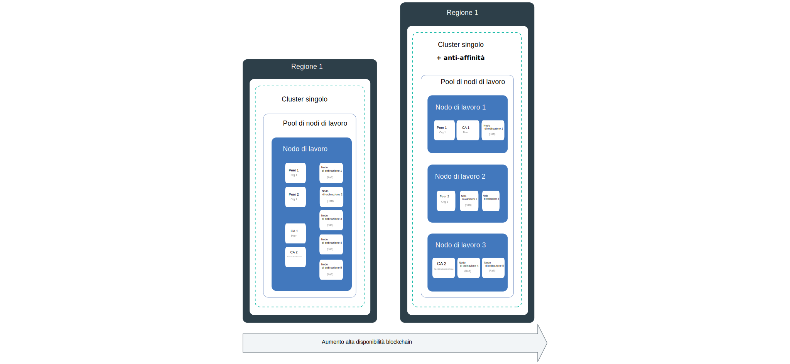
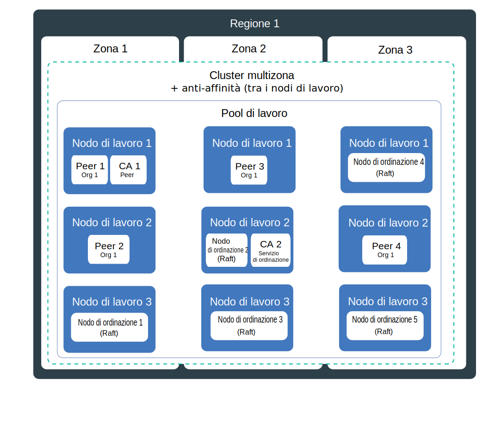
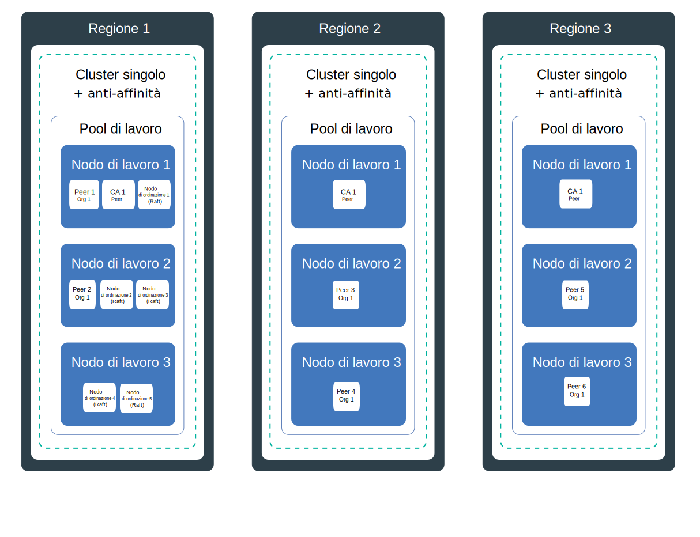

---

copyright:
  years: 2019
lastupdated: "2019-07-10"

keywords: high availability, HA, IBM Cloud, failures, zone failure, region failure, component failure, worker node failure

subcollection: blockchain

---

{:external: target="_blank" .external}
{:shortdesc: .shortdesc}
{:screen: .screen}
{:codeblock: .codeblock}
{:note: .note}
{:important: .important}
{:tip: .tip}
{:pre: .pre}

# Alta disponibilità (HA, High Availability)
{: #ibp-console-ha}

Utilizza le funzioni Kubernetes integrate insieme alle strategie di distribuzione del componente {{site.data.keyword.blockchainfull}} Platform per rendere le tue reti blockchain altamente disponibili e per proteggere la tua rete da tempi di inattività quando si verifica un errore nel tuo cluster.
{:shortdesc}

**Gruppi di destinatari:** questo argomento è pensato per gli architetti e gli amministratori di sistema che sono responsabili della pianificazione e configurazione di {{site.data.keyword.blockchainfull_notm}} su {{site.data.keyword.cloud_notm}} o su {{site.data.keyword.cloud_notm}} Private.

L'alta disponibilità è una disciplina fondamentale in un'infrastruttura IT per mantenere operative le tue applicazioni, anche dopo un'avaria parziale o totale del sito. Lo scopo principale dell'alta disponibilità è eliminare i potenziali punti di errore in un'infrastruttura IT. Ad esempio, puoi tutelarti in caso di errore di un sistema aggiungendo la ridondanza e configurando meccanismi di failover.

Puoi ottenere l'alta disponibilità su diversi livelli della tua infrastruttura IT e all'interno dei vari livelli del tuo cluster. l livello di disponibilità giusto per te dipende da diversi fattori, come i requisiti aziendali, gli SLA (Service Level Agreement) stipulati con le tue organizzazioni e il costo della ridondanza.

Prima di procedere, ti consigliamo di controllare le tue indicazioni specifiche per la piattaforma per l'HA:
- Se stai utilizzando {{site.data.keyword.cloud_notm}}, puoi trovare ulteriori informazioni su come funziona l'HA con Kubernetes in {{site.data.keyword.cloud_notm}} in questo argomento su [Alta disponibilità per {{site.data.keyword.cloud_notm}} Kubernetes Service](/docs/containers?topic=containers-ha){: external}.
- Se stai utilizzando {{site.data.keyword.cloud_notm}} Private, controlla il contenuto in [Implementing HA on {{site.data.keyword.cloud_notm}} Private](https://www.ibm.com/cloud/garage/practices/manage/high-availability-ibm-cloud-private){: external}.  

Puoi utilizzare questo argomento per i dettagli sulle indicazioni HA specifiche per blockchain con i consigli dai precedenti argomenti specifici per la piattaforma.

## Panoramica dei potenziali punti di errore in {{site.data.keyword.blockchainfull_notm}} Platform for {{site.data.keyword.cloud_notm}}
{: #ibp-console-ha-points-of-failure-overview}

L'architettura {{site.data.keyword.blockchainfull_notm}} Platform è progettata per garantire affidabilità, bassa latenza di elaborazione e una massima operatività del servizio. Tuttavia, possono verificarsi degli errori. {{site.data.keyword.blockchainfull_notm}} Platform fornisce diversi approcci per aggiungere più disponibilità al tuo cluster aggiungendo politiche di ridondanza e [anti affinità](https://www.ibm.com/blogs/cloud-archive/2016/07/ibm-containers-anti-affinity/){: external}, quando disponibili, per assicurarti che i componenti blockchain dello stesso tipo e organizzazione vengano distribuiti in nodi di lavoro diversi.  Aggiungendo la ridondanza nella tua rete blockchain, eviti errori o tempo di inattività.  

Per ottenere l'alta disponibilità massima, ti consigliamo di creare la ridondanza eseguendo il provisioning di peer e ordinanti in cluster Kubernetes in più regioni. Quando i componenti sono suddivisi tra le regioni e il libro mastro blockchain è distribuito tra tali componenti, un errore in una singola regione non influenzerà l'elaborazione delle transazioni. Le CA sono meno importanti per l'elaborazione della transazione giornaliera. Dopo che tutti gli utenti sono stati registrati ed iscritti con la CA, essa non è più necessaria fino alla volta successiva in cui sono necessari tali servizi.

### Considerazioni sui peer
{: #ibp-console-ha-peers}

L'alta disponibilità (HA) per i peer significa di disporre sempre di peer ridondanti, ossia almeno due peer disponibili per ogni organizzazione sullo stesso canale per elaborare le richieste dalle applicazioni client. Possono essere distribuiti più peer su un solo nodo di lavoro o suddivisi tra più nodi di lavoro, zone (se stai utilizzando {{site.data.keyword.cloud_notm}}) o anche regioni. Se distribuisci più peer e li unisci allo stesso canale, i peer agiscono come coppie HA perché il canale e i dati vengono automaticamente sincronizzati tra tutti i peer nel canale.  In base alla progettazione, una rete blockchain è destinata ad avere più organizzazioni che eseguono transazioni sugli stessi canali. Pertanto, il modello di distribuzione comune è che per ogni canale selezionato, esistano dei peer ridondanti per ogni organizzazione suddivisi in diversi cluster dell'account dell'organizzazione che hanno tutti i dati sincronizzati tra loro. Ogni organizzazione può avere un peer nel proprio cluster in tutte le regioni.

Per una copertura HA ancora più solida, puoi impostare più cluster in più regioni e distribuire i peer in ognuno di essi.Tuttavia, se desideri prestazioni elevate, devi prestare attenzione quando distribuisci i peer per garantire che la latenza e la larghezza di banda tra loro sia sufficiente per ottenere i tuoi obiettivi di prestazioni.

I **peer di ancoraggio** su un canale facilitano la comunicazione tra le organizzazioni necessaria per il funzionamento dei dati privati, del gossip e del rilevamento dei servizi. Se è presente solo un peer di ancoraggio su un canale e tale peer diventa indisponibile, le organizzazioni non sono più connesse e il gossip tra le organizzazioni non è più possibile. Pertanto, quando crei i peer ridondanti per un'organizzazione, assicurati di aggiungere anche dei [peer di ancoraggio sul canale](/docs/services/blockchain?topic=blockchain-ibp-console-govern#ibp-console-govern-channels-anchor-peers) ridondanti.

### Considerazioni sul servizio di ordinazione
{: #ibp-console-ha-ordering-service}

{{site.data.keyword.blockchainfull_notm}} Platform si basa su Hyperledger Fabric v1.4.1 che include il servizio di ordinazione Raft. Raft è un servizio di ordine con tolleranza di errori anomali (CFT) basato su un'implementazione del [protocollo Raft](https://raft.github.io/raft.pdf){: external}. In base alla progettazione, i nodi di ordinazione Raft sincronizzano automaticamente i dati tra loro utilizzando il consenso basato su Raft. In {{site.data.keyword.blockchainfull_notm}} Platform, un operatore di rete dell'organizzazione può scegliere di impostare un ordinante basato su Raft con un solo nodo, senza HA, oppure cinque ordinanti in una sola regione che vengono automaticamente configurati per l'HA tramite Raft.

## Elenco di controllo HA
{: #ibp-console-ha-checklist}

La seguente tabella contiene un elenco di opzioni da prendere in considerazione quando pensi di incrementare il livello di HA.

|  | Nodo singolo | Cluster singolo con più nodi | Multizona (solo {{site.data.keyword.cloud_notm}}**)| Più cluster tra le regioni |
|-----|-----|-----|-----|-----|
| Peer ridondanti |  |  |  |  |
| Peer di ancoraggio ridondanti su un canale|  |  |  | |
| Anti-affinità*** (peer) |  |  |  | |
|Servizio di ordinazione Raft |  |  |  | |
| Anti-affinità*** (nodi di ordinazione) |  |  |  | |
|Ambiente di sviluppo o test |  |  | | |
| Ambiente di produzione | | |  |  |
{: row-headers}
{: class="comparison-table"}
{: caption="Tabella 1. Confronto tra gli scenari di distribuzione per aumentare la tua HA di rete" caption-side="top"}
{: summary="This table has row and column headers. The row headers identify the deployment scenarios. The column headers identify available options in each scenario to increase your HA."}

*** Il deployer {{site.data.keyword.blockchainfull_notm}} Platform non può garantire che i nodi di ordinazione o peer siano suddivisi tra zone diverse. Puoi utilizzare le API {{site.data.keyword.blockchainfull_notm}} Platform per distribuire i nodi a zone specifiche su {{site.data.keyword.cloud_notm}} e assicurarti che la tua rete sia resiliente a un malfunzionamento di zona. Per ulteriori informazioni, vedi [HA multizona](#ibp-console-ha-multi-zone).  

** La configurazione predefinita per un cluster Kubernetes standard su {{site.data.keyword.cloud_notm}} è un cluster con 4 CPU x 16 GB di RAM che include tre zone con tre nodi di lavoro ognuna. Puoi ridimensionare in modo incrementale o decrementale, selezionando una configurazione più piccola, in base ai tuoi bisogni.

## Potenziali punti di errore
{: #ibp-console-ha-points-of-failure}

{{site.data.keyword.blockchainfull_notm}} Platform offre diversi approcci per aggiungere ulteriore disponibilità alla tua rete aggiungendo la ridondanza e utilizzando le politiche di anti-affinità. Controlla i seguenti diagrammi per ulteriori informazioni sui potenziali punti di errore e su come eliminarli. Puoi selezionare un modello basato su criticità, livelli di servizio e costi della tua applicazione. Come regola generale, puoi implementare la ridondanza per soddisfare i tuoi livelli di servizio. Tutti questi scenari devono essere confrontati con i costi di implementazione di una maggiore resilienza.

### HA a singola regione
{: #ibp-console-ha-single-region}




1. **Malfunzionamento del componente.**

   **Cluster a zona singola**:  

   Ogni volta che distribuisci un componente blockchain, ad esempio un peer o un nodo di ordinazione, viene creato un nuovo pod per il componente in un nodo di lavoro. I contenitori e i pod sono, come progettati, di breve durata e possono avere un malfunzionamento imprevisto. Ad esempio, un contenitore o un pod potrebbe arrestarsi in modo anomalo se si verifica un errore nel tuo componente. Per cui, per rendere il tuo peer altamente disponibile, devi assicurarti di disporre di sufficienti istanze di esso per gestire il carico di lavoro e le istanze aggiuntive nel caso di un errore.

   **Peer** quanti peer sono necessari? In uno scenario di produzione, ti consigliamo di distribuire tre peer dalla stessa organizzazione per ogni canale. Questo per consentire a un peer di essere inattivo (ad esempio, durante un ciclo di manutenzione) e mantenere ancora due peer altamente disponibili. Pertanto, per compensare un malfunzionamento del peer e per il livello più elementare di HA, puoi ottenere la ridondanza dei peer semplicemente distribuendo tre peer per organizzazione su un canale sul tuo nodo di lavoro. Tieni presente che devi assicurarti di disporre di risorse disponibili adeguate sul tuo nodo per supportare questi componenti.

   **Servizio di ordinazione** come menzionato precedentemente, il servizio di ordinazione HA si basa su Raft e contiene cinque nodi di ordinazione per impostazione predefinita. Poiché il sistema può sostenere la perdita dei nodi, inclusi i nodi leader, purché ci sia una maggioranza di nodi di ordinazione (nota come “quorum”) rimanenti, si dice che Raft è fornito di “tolleranza di errori anomali” (CFT). In altre parole, se hai cinque nodi in un canale, puoi perdere due nodi (lasciando tre nodi rimanenti). Quando distribuisci un servizio di ordinazione dalla console, scegli il servizio con cinque nodi per l'HA.  

   Questo scenario utilizza peer e ordinanti ridondanti su un singolo nodo di lavoro, che protegge da malfunzionamenti del componente, ma non da malfunzionamenti del nodo. Pertanto, è adatto solo per scopi di sviluppo e test.

2. **Malfunzionamento del nodo di lavoro.**  

   **Cluster a zona singola con più nodi di lavoro e l'anti-affinità**:

   Un nodo di lavoro è una VM eseguita su un hardware fisico. I malfunzionamenti dei nodi di lavoro includono interruzioni hardware, come alimentazione, raffreddamento o collegamento in rete e problemi nella VM stessa. Puoi tenere conto di un malfunzionamento del nodo di lavoro configurando più nodi di lavoro quando esegui il provisioning del tuo cluster. Quando i componenti blockchain sono distribuiti in più nodi di lavoro, sei protetto da un malfunzionamento del nodo di lavoro. Tieni presente che il servizio {{site.data.keyword.cloud_notm}} Kubnernetes include l'opzione per più zone in un cluster. {{site.data.keyword.cloud_notm}} Private non supporta le zone.

   **Peer** la politica anti-affinità del deployer {{site.data.keyword.blockchainfull_notm}} Platform distribuisce peer ridondanti, ossia peer dalla stessa organizzazione, in più nodi di lavoro nei loro cluster o nella loro zona.

   **Servizio di ordinazione** ogni volta che distribuisci un servizio di ordinazione Raft, vengono automaticamente distribuiti cinque nodi di ordinazione nei nodi di lavoro nel tuo cluster, utilizzando la politica di anti-affinità e in base alla disponibilità delle risorse sui nodi.  

   Questo scenario utilizza peer e ordinanti ridondanti in più nodi di lavoro in un singolo cluster o in una singola zona, che protegge da malfunzionamenti del nodo ma non da un malfunzionamento del cluster o della zona. Pertanto, non è consigliato per la produzione.

### HA multizona (solo servizio {{site.data.keyword.cloud_notm}} Kubernetes)
{: #ibp-console-ha-multi-zone}

_Questo scenario si applica solo ai clienti che utilizzano {{site.data.keyword.cloud_notm}} Kubernetes Service._



   **Malfunzionamento della zona.**  

   **Cluster multizona con più nodi di lavoro e l'anti-affinità**:

   Pensa a una zona come a un data center. Un malfunzionamento della zona riguarda tutti gli host di calcolo fisici e l'archiviazione NFS. I malfunzionamenti includono interruzioni di alimentazione, raffreddamento, collegamento in rete o di archiviazione e disastri naturali, come inondazioni, terremoti e uragani. Per la protezione da un malfunzionamento della zona, devi avere i cluster in almeno due zone differenti di cui viene bilanciato il carico da un programma di bilanciamento del carico esterno. Per impostazione predefinita, quando distribuisci un cluster Kubernetes in {{site.data.keyword.cloud_notm}}, il cluster viene configurato con il supporto multizona, che include tre zone, anche se puoi scegliere due zone.

   Una singola zona è sufficiente per un ambiente di sviluppo e test se puoi tollerare un'interruzione della zona. Pertanto, per utilizzare i vantaggi HA che riguardano più zone, quando esegui il provisioning del tuo cluster, assicurati che siano selezionate più zone. Due zone sono meglio di una, ma se ne consigliano tre per l'HA per incrementare la probabilità che due zone aggiuntive possano assorbire il carico di lavoro di un qualsiasi malfunzionamento di una singola zona.  Quando i peer ridondanti dalla stessa organizzazione, dallo stesso canale e dagli stessi nodi di ordinazione sono suddivisi in più zone, un malfunzionamento in una qualsiasi delle zone non dovrebbe influenzare la capacità della rete di elaborare le transazioni perché il carico di lavoro sarà spostato ai nodi blockchain nelle altre zone.

   Il deployer {{site.data.keyword.blockchainfull_notm}} Platform non può garantire che i componenti blockchain siano suddivisi nelle **zone**. Il deployer distribuirà i componenti a più zone in base alle risorse disponibili sui nodi di lavoro, ma non metterà necessariamente due peer dalla stessa organizzazione o dagli stessi nodi di ordinazione in zone separate. Se vuoi assicurarti che alcuni nodi siano distribuiti in zone diverse, puoi utilizzare le API {{site.data.keyword.blockchainfull_notm}} Platform per specificare la zona in cui viene creato un nodo. Per ulteriori informazioni, vedi [Creazione di un nodo all'interno di una zona specifica](/docs/services/blockchain?topic=blockchain-ibp-v2-apis#ibp-v2-apis-zone).
   {:note}

   Questo scenario utilizza peer e ordinanti ridondanti in più nodi di lavoro e zone, che protegge da malfunzionamenti della zona ma non da un improbabile malfunzionamento dell'intera regione. Questo è uno scenario consigliato per una rete di produzione.

### HA multiregione
{: #ibp-console-ha-multi-region}

Questo scenario offre il livello più elevato di HA possibile.



   **Malfunzionamento della regione.**

   **Cluster multiregione con più nodi di lavoro e l'anti-affinità**:

   La probabilità di un malfunzionamento a livello dell'intera regione è bassa. Tuttavia, per rendere conto di questo malfunzionamento, puoi impostare più cluster in diverse regioni in cui ogni cluster ha la propria console collegata. Se il malfunzionamento riguarda l'intera regione, i peer ridondanti nel cluster nelle altre regioni possono fornire il carico di lavoro. Per gli ambienti di produzione, la configurazione dei tuoi **peer** blockchain in più regioni fornisce la copertura HA massima disponibile.

   Questo scenario utilizza i peer ridondanti in più nodi di lavoro in più regioni, che forniscono il livello più elevato di HA. Questo è anche lo scenario consigliato per una rete di produzione se i tuoi requisiti di resilienza meritano l'investimento.  

   Vedi questo argomento sulla [Configurazione di distribuzioni HA multiregione](/docs/services/blockchain?topic=blockchain-ibp-console-hadr-mr) per la procedura per configurare i tuoi peer {{site.data.keyword.blockchainfull_notm}} Platform in più regioni.


## Ripristino di emergenza (DR, Disaster Recovery)
{: #ibp-console-ha-dr}

In tutti i casi, per la protezione dal danneggiamento dei dati, ti consigliamo di eseguire in modo regolare il backup dell'archiviazione associata ad ogni componente distribuito. Poiché il libro mastro è condiviso tra tutti i peer e i nodi di ordinazione, effettuare dei backup regolari è molto importante. Ad esempio, se uno qualsiasi dei libri mastro del peer viene danneggiato, il danneggiamento si diffonderà a tutti i libri mastri del peer ed è quindi necessario un backup per ripristinare il libro mastro nella rete. Puoi decidere quanto spesso eseguire i backup in base ai tuoi bisogni di ripristino, ma una linea guida generale sarebbe di effettuarli giornalmente.  

| Provider della soluzione di archiviazione | Guida |
|----------|---------|
| Soluzione di archiviazione {{site.data.keyword.cloud_notm}} | Puoi utilizzare la [funzionalità fornita dal servizio {{site.data.keyword.cloud_notm}} Kubernetes](/docs/services/RegistryImages/ibm-backup-restore?topic=RegistryImages-ibmbackup_restore_starter#ibmbackup_restore_starter){: external}. Ma tieni presente che senza la funzionalità di istantanea, i nodi devono essere [arrestati](#ibp-console-ha-stop-nodes) per garantire un backup affidabile.  |
| Soluzione di archiviazione {{site.data.keyword.cloud_notm}} Private | Puoi utilizzare la tecnologia di backup e ripristino fornita dal tuo provider di archiviazione. Nuovamente, assicurati di aver [arrestato](#ibp-console-ha-stop-nodes) i nodi prima di effettuare il backup. |
| Portworx | Una [funzionalità di istantanea](https://docs.portworx.com/portworx-install-with-kubernetes/cloud/ibm/#prerequisites){: external} è disponibile per effettuare i backup senza arrestare i nodi. |
{: caption="Tabella 2. Consigli sul backup per l'archiviazione" caption-side="top"}

Quando devi ripristinare un backup, i backup dovrebbero essere ripristinati su ogni componente nella tua rete.

### Arresto dei nodi per preparare un backup
{: #ibp-console-ha-stop-nodes}

Se non stai utilizzando Portworx come tua soluzione di archiviazione, puoi utilizzare il seguente comando `kubectl` per arrestare i nodi prima di effettuare il backup, ad esempio:

   ```
   kubectl scale deployment my-deployment --replicas=0
   ```
   {:codeblock}

   Esegui il backup.
   Riavvia i nodi:

   ```
   kubectl scale deployment my-deployment --replicas=1
   ```
   {:codeblock}
