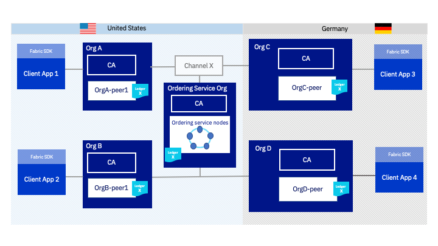
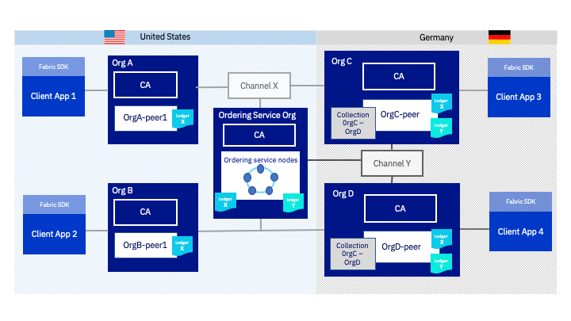
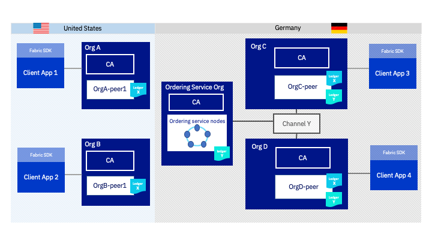

---

copyright:
  years: 2017, 2019
lastupdated: "2019-07-10"

keywords: IBM Blockchain Platform, IBM Cloud Private, AWS, Data residency, world state

subcollection: blockchain

---

{:shortdesc: .shortdesc}
{:screen: .screen}
{:codeblock: .codeblock}
{:note: .note}
{:important: .important}
{:tip: .tip}
{:pre: .pre}
{:external: target="_blank" .external}

# データ・レジデンシー
{: #console-icp-about-data-residency}

ブロックチェーン・ネットワークでは、処理されるデータのタイプが認識されないので、特定の種類のデータを保護するためには追加の対策を講じる必要がある場合があります。データ・レジデンシーに関する最も一般的な要件は、いくつかの国の法律に関するものであり、IT システムで処理および保管されるすべてのデータを特定の国の中にとどめることを義務付けるものです。同様に、政府、医療、金融サービスなど、規制の厳しい業界の企業は、データを完全にファイアウォールの内側に保管することを求められます。

ブロックチェーン・ネットワークでは、複数の組織が分散台帳を使用して、信頼できる安全な方法で取引やデータの共有を行うことができます。しかし、これはネットワークのノード間やそれらのノードが存在する地域間にデータが分散する可能性があることを意味します。データをネットワークの他の部分から分離してデータ・レジデンシーを確保する方法として、組織にはいくつかの選択肢があります。
1. [共有チャネルでのプライベート・データ・コレクション](#console-icp-about-data-residency-fabric)
2. [分離チャネルでのプライベート・データ・コレクション](#console-icp-about-data-residency-use-case)
3. [チャネルに属するすべてのノードが 1 カ国に存在する分離チャネル](#console-icp-about-data-residency-use-case-channel)

どの方法でも、データの分離と保護のレベルは向上しますが、実装して管理するために必要な労力も増えます。各選択肢でデータ・レジデンシーを確保できる理由を理解できるように、Hyperledger Fabric ネットワーク内部でデータが共有される仕組みについて大まかに説明します。その後、各選択肢でブロックチェーン・コンソーシアムの組織がデータを分離し、地域外にデータが出ることを防ぐ方法を、ユース・ケース例を示して説明します。

## {{site.data.keyword.blockchainfull_notm}} Platform ネットワーク内部でデータが共有される仕組み
{: #console-icp-about-data-residency-fabric}

{{site.data.keyword.blockchainfull_notm}} Platform の基礎である Hyperledger Fabric のアーキテクチャーは、順序付けサービス (順序付けノードで構成されます)、認証局 (CA)、ピアという 3 つの主要なコンポーネントを中核としています。さらに、組織は [Fabric SDK](https://hyperledger-fabric.readthedocs.io/en/release-1.4/getting_started.html){: external} を使用してクライアント・アプリケーションからこれらのノードにトランザクションを送信します。データ・レジデンシーについて検討する際には、これらのコンポーネントが対話してデータを保管する方法を理解することが重要です。

**ピア**は、コンソーシアムのメンバーがブロックチェーン[台帳](https://hyperledger-fabric.readthedocs.io/en/release-1.4/ledger/ledger.html){: external}を保管するために使用します。ブロックチェーン台帳は 2 つの部分から成ります。1 つ目はワールド・ステートです。台帳内のすべてのデータの最新値をキー/値のペア形式で保管します。2 つ目は、すべてのトランザクションのブロックチェーン・レコードです。ピアは順序付けサービスからステートの更新を新規ブロックの形式で受け取ります。その後、ピアはブロックとワールド・ステートを使用してトランザクションを確認 (つまりコミット) し、ワールド・ステートを更新し、ブロックチェーンのトランザクション・ログを追加します。順序付けサービスは、[コンソーシアム](/docs/services/blockchain?topic=blockchain-glossary#glossary-consortium)に属するすべてのピアについてトランザクションの順序を確立し、台帳のブロックチェーンの部分のコピーを保管します。

**チャネル**とは、ネットワーク内でデータを送信するメカニズムのことです。チャネルに参加せずにブロックチェーン・ネットワークに参加することはできません。チャネルを使用することでネットワークのメンバーはビジネス・アプリケーションを論理的に分離できます。トラフィックを制限してパフォーマンスを向上させることさえできます。コンソーシアムに属する組織の一部でチャネルを使用して、プライベートに取引を行い、データを分離することもできます。

ピアは、参加しているチャネルごとに別の台帳を維持します。チャネルのメンバーである組織だけが、ピアをチャネルに参加させ、順序付けサービスから台帳の更新を受け取ることができます。結果的に、すべてのチャネルが順序付けサービスに結び付けられ、順序付けサービスには、順序付けサービスが維持するすべてのチャネル台帳のブロックチェーンの部分が保管されます。クライアント・アプリケーションは、指定されたチャネルのピアと順序付けサービスにトランザクションを送信します。それらのトランザクションは、ブロックチェーン内のトランザクション・ログに追加され、トランザクションに含まれている [読み取り /書き込みセット](https://hyperledger-fabric.readthedocs.io/en/release-1.4/readwrite.html){: external}がワールド・ステートにキー/値のペア形式で追加されます。

国内をデータの保管場所にするという要件がある場合は、クライアント・アプリケーションに加えてピアと順序付けサービスの場所も考慮する必要があります。チャネルに参加している他の組織に属しているピアの場所も認識しておく必要があります。{{site.data.keyword.blockchainfull_notm}} Platform for {{site.data.keyword.cloud_notm}} を使用する場合は、自分やコンソーシアムのメンバーがコンポーネントをデプロイできる [{{site.data.keyword.blockchainfull_notm}} Platform の地域とロケーション](/docs/services/blockchain/reference?topic=blockchain-ibp-regions-locations#ibp-regions-locations)のリストを参照できます。

## データの常駐のユース・ケース
{: #console-icp-about-data-residency-use-case}

コンソーシアムの例を基に、{{site.data.keyword.blockchainfull_notm}} Platform でデータが分散される仕組みについて理解し、メンバーがデータ・レジデンシーを確保するためにはどうすればよいかを探っていきます。以下の図は、順序付けサービス 1 つと組織 4 つで構成されたコンソーシアムを示しています。組織ごとにピア・ノードが 1 つあります。米国に 2 つの組織 (組織 A と組織 B) と順序付けサービスがあります。他の 2 つの組織 (組織 C と組織 D) はドイツにあります。4 つの組織はすべてチャネル X のメンバーであり、このチャネルにピアを参加させています。

チャネル X に参加しているすべてのピアが、**図 1** で「台帳 X」と示されているチャネル台帳のコピーを保管します。このチャネルには米国とドイツのピアが参加しているので、チャネル台帳のデータは両方の地域に存在します。台帳のブロックチェーンの部分は、米国に存在する順序付けサービスにも保管されます。

コンソーシアムの 2 つの組織がチャネル Y という 2 つ目のチャネルを作成すると、2 つ目の台帳が作成され、チャネル・メンバーのピアに保管されます。チャネル・データのコピーは、このチャネルに参加した組織にのみ置かれます。

**図 2** では、組織 B と組織 D がチャネル Y に参加しました。組織 B と組織 D のピアは、台帳 X に加えて台帳 Y のコピーを保管するようになりました。同じ順序付けサービスを使用してチャネル X とチャネル Y を作成したので、順序付けサービスには、両方のチャネル台帳のブロックチェーンの部分のコピーが保管されるようになりました。**図 1** と**図 2** のどちらでも、ドイツのアプリケーションで作成されたデータが米国に保管されます。データ・レジデンシーが必要な場合、これは望ましくありません。

上記の例を使用して、データ・レジデンシーを確保するために組織が取れる選択肢について検討しましょう。ドイツの規制によって、組織 C と組織 D によって作成されたデータの一部をドイツ内に維持する必要があるとします。ドイツの組織は、データが米国に保管されることを防ぐために 3 つの選択肢のすべてを使用できます。

## 選択肢 1: 共有チャネルでのプライベート・データ・コレクション
{: #console-icp-about-data-residency-use-case-private-data}

組織 C と組織 D は、Hyperledger Fabric の[プライベート・データ機能](https://hyperledger-fabric.readthedocs.io/en/release-1.4/private-data/private-data.html#what-is-a-private-data-collection "What is a private data collection?"){: external}を使用して、チャネルの全組織にデータが分散することを防止できます。
プライベート・データ・コレクションを使用すると、コレクションの読み取り権限を持つ組織間でステート・データをピアツーピアで共有する (ゴシップ・プロトコルを使用) ことができます。データはピア上にある分離されたプライベート・データベースに保管されます。順序付けサービスは関与しないので、プライベート・データを認識しません。コレクションのデータのハッシュのみがチャネル台帳に追加され、他のチャネル・メンバーのピアと順序付けサービスに保管されます。そのため、トランザクションの詳細を公開できる場合には、組織はプライベート・データを検証することができます。詳しくは、Fabric 資料の[プライベート・データ](https://hyperledger-fabric.readthedocs.io/en/release-1.4/private-data/private-data.html#private-data "Private data"){: external}の概念に関する記事を参照してください。

**図 3** では、組織 C と組織 D が「組織 C - 組織 D」コレクションというプライベート・データ・コレクションを作成しました。このコレクションによって、両組織はデータを組織 A、組織 B、順序付けサービスと共有することなく取引できます。このコレクション内のキー/値形式のステート・データは、組織 C と組織 D のピアにのみ保管され、ドイツを出ることはありません。ただし、コレクション内のデータのハッシュは台帳 X に保管され、より範囲が広いチャネルで共有されます。つまり、組織 C - 組織 D のコレクション内のデータのハッシュは、米国のピアと順序付けサービスに保管されることを意味します。

プライベート・データについて検討する際には、**ハッシュされたデータ**と**暗号化されたデータ**の違いを理解することが重要です。暗号化では、元の値を隠す形式にデータを変換する一方で、元の状態に戻すこともできる双方向関数を使用します。例として、TLS で保護されているネットワークを経由してデータを送信する場合は、そのデータは TLS 証明書を使用して暗号化されます。そして、暗号テキストとしてネットワーク経由で送信された後、受信側で復号されます。暗号化されたテキストは、元のデータをすべて含んでおり、秘密鍵を使用して復号できます。一方、ハッシュは、データを使用して数字と文字から成る固有の文字列を生成する片方向関数です。ハッシュされたデータは、ハッシュを使用して元の形式に戻すことはできません。ハッシュを生成したデータを検証するには、受信側で同じハッシュ関数を使用して元のデータから新たにハッシュを作成し、ハッシュ値が一致していることを検証する必要があります。第三者は、元のデータのコピーがないとハッシュを使用できません。  

この選択肢では、組織 A と B が、実際の台帳データはハッシュされているので認識できませんが、組織 C と D が取引していることや両者の間で行われている取引量を認識できることに注意してください。

プライベート・データ・コレクション内のデータは、データを保管しているピアから消去できることも考慮してください。チャネルにはデータが永続的に保管されますが、コレクションでは、メンバーがチャネルにコミットするブロック数を指定してから、[プライベート・データを消去](https://hyperledger-fabric.readthedocs.io/en/release-1.4/private_data_tutorial.html#pd-purge){: external}することができます。データがプライベート・データ・コレクションから削除されると、そのデータを作成したトランザクションを、チャネルのハッシュを使用して検証することができなくなります。**図 3** のネットワーク例では、組織 C と組織 D が `block to live` ポリシーを使用して、永久に保持する必要のないデータを、指定された期間内にネットワーク全体から削除することができます。

## 選択肢 2: 分離チャネルでのプライベート・データ・コレクション
{: #console-icp-about-data-residency-use-case-private-data-channel}

組織 C と組織 D は、分離チャネルという状況でプライベート・データ・コレクションを使用してデータ分離を強化することもできます。新しいチャネル (この例ではチャネル Y) を作成して、プライベート・データのハッシュを、コンソーシアムの他のメンバーと共有することも他のメンバーのピアに保管することもなく、順序付けサービスとのみ共有するようにします。

**図 4** では、組織 C と組織 D が、米国のメンバーを含まない新しいチャネル Y を形成しました。その結果、組織 C - 組織 D のコレクション内のデータのハッシュは台帳 X ではなく台帳 Y に保管され、米国のピアには保管されなくなります。順序付けサービスは米国に存在するので、ドイツで生成されたデータのハッシュはやはりドイツを出ることになります。

分離チャネルを作成することで、トランザクションの詳細がコンソーシアムの他の組織に知られることを防止できます。ドイツの組織が共有チャネルを使用していた場合は、組織 A と 組織 B は、プライベート・データ・コレクションによってチャネル台帳にコミットされたトランザクション・ハッシュの数を認識できます。そのため、両組織は、組織 C と D が取引しているという事実とその組織間で生成されたトランザクション量を認識できます。ただし、新しいチャネルを形成すると、作成と更新のための追加の管理オーバーヘッドが必要になることを考慮してください。また、新しいチャネルを形成すると、組織 C と組織 D が組織 A と組織 B とデータを共有しにくくなります。

## 選択肢 3: すべてのコンポーネントが 1 カ国に存在するチャネル
{: #console-icp-about-data-residency-use-case-channel}

組織 C と組織 D は、すべてのインフラストラクチャーが同じ国に存在するチャネルを作成することもできます。そのためには、チャネルに参加するピア、アプリケーション、順序付けサービスのすべてが同じ地域内に存在する必要があります。このシナリオでは、チャネル台帳に保管されているデータが地域の外に出ることはなく、国外に保管されることもありません。

**図 5** では、組織 C と 組織 D が、ドイツを出てはいけないデータ用に新しいチャネルを作成しました。このためには、チャネル台帳の順序付けプログラム用のコピーをドイツ内に保管するために、ドイツに存在する順序付けサービスを新しく作成する必要があります。この例では、順序付けサービス、組織 C ピア、組織 D ピアがドイツに存在するので、組織 C と組織 D は、チャネルのデータを公開してもかまいません。また、すべてのトランザクション・データが順序付けサービスに保管されることを防止するために、引き続きプライベート・データ・コレクションを使用することもできます。

すべてのコンポーネントが 1 カ国に存在するチャネルを作成すると、キー/値のペア、ブロックチェーン・トランザクション・ログ、プライベート・データのハッシュを含め、あらゆるデータが 1 つの地域内に存在することが保証されます。しかし、この選択肢では、新しいチャネルを保守するためのオーバーヘッドと、順序付けサービスの保守に関連するコストが必要になります。

## 参照資料
{: #console-icp-about-data-residency-reference}

{{site.data.keyword.blockchainfull_notm}} Platform ネットワーク上のデータのフローについて詳しくは、[トランザクション・フローに関する Fabric の資料](https://hyperledger-fabric.readthedocs.io/en/release-1.4/txflow.html){: external}を参照してください。

将来的には、ゼロ知識証明によって、Hyperledger Fabric で確保できるデータ・レジデンシーがさらに向上する予定です。ゼロ知識証明 (ZKP) により、「証明者」は「検証者」に、機密事項自体を示すことなく、機密事項に関する知識があることを保証できます。 何を知っているかを示すことなく、何かを知っていることを示してステートメントを満たす方法です。

プライベート・データ・コレクションとゼロ知識証明について詳しくは、ホワイト・ペーパー「[Private and confidential transactions with Hyperledger Fabric](https://developer.ibm.com/tutorials/cl-blockchain-private-confidential-transactions-hyperledger-fabric-zero-knowledge-proof/){: external}」を参照してください。
