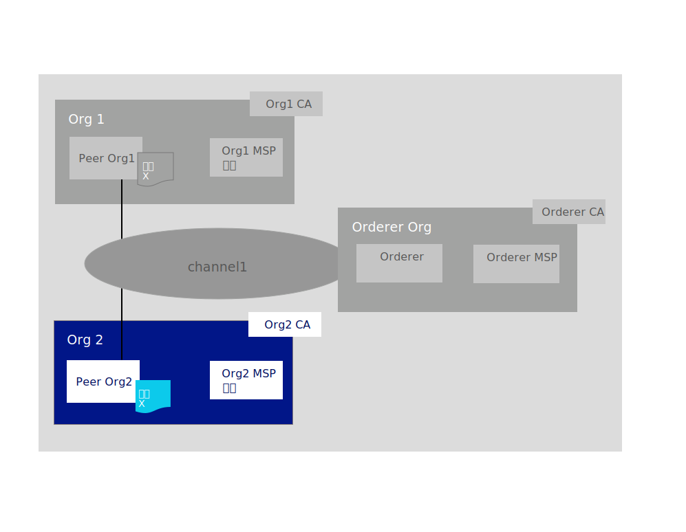

---

copyright:
  years: 2019

lastupdated: "2019-06-21"

keywords: getting started tutorials, create a CA, enroll, register, create an MSP, wallet, create a peer, create ordering service, Raft, join a network, system channel

subcollection: blockchain

---

{:external: target="_blank" .external}
{:shortdesc: .shortdesc}
{:screen: .screen}
{:codeblock: .codeblock}
{:note: .note}
{:important: .important}
{:tip: .tip}
{:pre: .pre}

# ネットワーク参加のチュートリアル
{: #ibp-console-join-network}

{{site.data.keyword.blockchainfull}} Platform は、ブロックチェーンのアプリケーションとネットワークを開発、デプロイ、運用できるようにする Blockchain as a Service オファリングです。 ブロックチェーンの各コンポーネントの概要およびコンポーネント同士の連携について詳しくは、[ブロックチェーン・コンポーネントの概要](/docs/services/blockchain?topic=blockchain-blockchain-component-overview#blockchain-component-overview)を参照してください。 このチュートリアルは、[サンプル・ネットワーク・チュートリアル・シリーズ](/docs/services/blockchain/howto?topic=blockchain-ibp-console-build-network#ibp-console-build-network-sample-tutorial)の第 2 部であり、{{site.data.keyword.blockchainfull_notm}} Platform コンソールでノードを作成して、これらを別のクラスターでホストされているブロックチェーン共同事業体に接続する方法について説明しています。
{:shortdesc}

ベータ・トライアル・バージョンの {{site.data.keyword.blockchainfull_notm}} Platform for {{site.data.keyword.cloud_notm}} を使用している場合は、コンソールの一部のパネルが、一般出荷可能 (GA) サービス・インスタンスに合わせて最新の情報が記載されている現在の文書とは異なる可能性があります。 ベータ版のサービス・インスタンスを使用していて、最新機能をすべて利用したいという場合は、この段階で [{{site.data.keyword.blockchainfull_notm}} Platform for {{site.data.keyword.cloud_notm}} の概説](/docs/services/blockchain/howto?topic=blockchain-ibp-v2-deploy-iks#ibp-v2-deploy-iks)の手順に従い、GA サービス・インスタンスをプロビジョンすることをお勧めします。
{: important}

**対象者:** このトピックは、ブロックチェーン・ネットワークの作成、モニター、管理を担当するネットワーク・オペレーターを対象に設計されています。  

まだ {{site.data.keyword.blockchainfull_notm}} Platform コンソールで {{site.data.keyword.cloud_notm}} Kubernetes Service を使用してコンポーネントを Kubernetes クラスターにデプロイしていない場合は、[{{site.data.keyword.blockchainfull_notm}} Platform for {{site.data.keyword.cloud_notm}} の概説](/docs/services/blockchain/howto?topic=blockchain-ibp-v2-deploy-iks#ibp-v2-deploy-iks) ({{site.data.keyword.cloud_notm}} クラスターを使用する場合) または [{{site.data.keyword.blockchainfull_notm}} Platform for Multicloud の概説](/docs/services/blockchain?topic=blockchain-get-started-console-icp#get-started-console-icp) ({{site.data.keyword.cloud_notm}} Private を使用して {{site.data.keyword.cloud_notm}} 以外のクラウド・プロバイダーにデプロイする場合) を参照してください。 コンソール自体はクラスター内に存在しないことに注意してください。 これは、クラスターにコンポーネントをデプロイするために使用できるツールです。

有料版または無料版のどちらの Kubernetes クラスターにコンポーネントをデプロイするかにかかわらず、ノードをデプロイしてチャネルを作成するときには、使用可能なリソースを慎重に確認してください。 Kubernetes クラスターを管理し、必要に応じて追加のリソースをデプロイする責任はユーザーにあります。 {{site.data.keyword.cloud_notm}} 無料版のクラスターにもコンポーネントは正常にデプロイできますが、追加するコンポーネントが多くなるほど、コンポーネントの実行速度は遅くなります。 コンポーネントのサイズ設定およびコンソールと {{site.data.keyword.cloud_notm}} Kubernetes Service クラスターの対話方法の詳細については、[リソースの割り振り](/docs/services/blockchain/howto?topic=blockchain-ibp-console-govern#ibp-console-govern-iks-console-interaction)を参照してください。 {{site.data.keyword.cloud_notm}} Private を使用して別のクラウド・プロバイダーにデプロイする場合は、そのプロバイダーの資料を参照し、そこでリソースをモニターする方法を確認する必要があります。

## サンプル・ネットワークのチュートリアル・シリーズ
{: #ibp-console-join-network-structure}

この 3 部構成のチュートリアル・シリーズでは、{{site.data.keyword.blockchainfull_notm}} Platform コンソールを使用し Kubernetes クラスターへのネットワークのデプロイやスマート・コントラクトのインストールとインスタンス化を行うことで、比較的にシンプルなマルチノードの Hyperledger Fabric ネットワークを作成して相互接続するプロセスを体験していきます。 このチュートリアルでは、有料の {{site.data.keyword.cloud_notm}} Kubernetes クラスターを使用した場合のこのプロセスの仕組みを示しますが、いくつかの制限 (例えば、無料クラスターではノードのサイズ設定やサイズ変更はできません) を除き、同じ基本フローが無料クラスターにも適用されます。

* [ネットワーク構築チュートリアル](/docs/services/blockchain/howto?topic=blockchain-ibp-console-build-network#ibp-console-build-network)では、順序付けサービスとピアを作成することで、ネットワークをホストするプロセスを学習します。
* **ネットワーク参加チュートリアル** (このチュートリアル) では、ピアを作成してチャネルに参加させることで、既存のネットワークに参加するプロセスを学習します。
* [ネットワークにスマート・コントラクトをデプロイする](/docs/services/blockchain/howto?topic=blockchain-ibp-console-smart-contracts#ibp-console-smart-contracts)では、スマート・コントラクトを作成してネットワークにデプロイする方法を学習します。

これらのチュートリアルの手順を使用すれば、複数の組織が参加する開発テスト用のネットワークを 1 つのクラスター内に構築できます。 順序付けサービスを作成し、組織を追加してブロックチェーン・コンソーシアムを形成する場合は、**ネットワーク構築**のチュートリアルを使用してください。 ピアをネットワークに接続するには、**ネットワーク参加**のチュートリアルを使用してください。 さまざまなコンソーシアム・メンバーと一緒にこれらのチュートリアルを進めると、実際に**分散した**ブロックチェーン・ネットワークを作成できます。

このチュートリアルの目的は、**既存の**ネットワークにピアを参加させる方法を示すことです。 自分または他のユーザーの {{site.data.keyword.blockchainfull_notm}} Platform クラスターに順序付けサービスが既に作成されていることを前提としています。 参加先となる既存のネットワークがない場合は、[ネットワーク構築チュートリアル](/docs/services/blockchain/howto?topic=blockchain-ibp-console-build-network#ibp-console-build-network)を参照してネットワークの作成方法を確認してください。 **ネットワーク参加**のチュートリアルでは、以下の図で青い四角枠で強調表示している `Org2` ブロックチェーン・コンポーネントを作成するステップを説明します。
  

**ネットワーク参加**のチュートリアルのステップを実行して、以下のコンポーネントを作成し、以下のアクションを実行してください。

* **1 つのピア組織** `Org2`  
  組織 `Org2` を定義する Org2 メンバーシップ・サービス・プロバイダー (MSP) 定義を作成します。
* **1 つのピア** `Peer Org2`   
  上の図の台帳 `Ledger x` は分散ピアによって保守されています。 ピアは [Couch DB](https://hyperledger-fabric.readthedocs.io/en/release-1.4/couchdb_as_state_database.html){: external} を状態データベースとして使用してデプロイされます。
* **1 つの認証局 (CA)** `Org2 CA`
  CA は、すべての組織管理者および組織に関連付けられているノードに証明書を発行するノードです。 ピア組織 `Org2` 用に 1 つの CA を作成します。
* **単一チャネルへの参加**
  このチュートリアルでは、[ネットワーク構築チュートリアル](/docs/services/blockchain/howto?topic=blockchain-ibp-console-build-network#ibp-console-build-network)で作成したチャネルに参加する方法を説明しています。

このチュートリアルでは、全体を通して、コンソールのフィールドの**推奨値**をいくつか記載しています。 推奨値を使用すれば、タブやドロップダウン・リストで名前や ID を見つけやすくなります。 これらの値は必須ではありませんが、使用すると便利です。特に、前のステップで入力した登録ユーザーの ID や機密事項といった特定の値を記憶しておく必要がある場合に役立ちます。 これらの値を忘れた場合は、管理者やコンポーネントの追加のユーザーを登録する必要があります。 各タスクの後に推奨値の表を示します。サンプル値を使用しない場合は、チュートリアルを進めながら、使用する値をどこかに記録することをお勧めします。
{:tip}

## 手順 1: ピア組織とピアを作成する
{: #ibp-console-join-network-create-ca-org2}

コンソールを使用して作成する組織ごとに、CA を 1 つ以上デプロイする必要があります。 CA とは、すべてのネットワーク参加者 (ピア、順序付けサービス、クライアント、管理者など) に証明書を発行するノードです。 ネットワーク参加者は、署名証明書および秘密鍵を含むこれらの証明書を使用して通信および認証することができ、最終的にトランザクションを実行できます。 これらの CA により、組織に属するすべての ID および証明書を作成し、さらに組織そのものを定義します。 その後、それらの ID を使用して、ノードのデプロイ、管理者 ID の作成、トランザクションの送信を行えます。 CA および作成する必要がある ID について詳しくは、[ID の管理](/docs/services/blockchain/howto?topic=blockchain-ibp-console-identities#ibp-console-identities)を参照してください。

このチュートリアルでは、1 つの組織を作成します。 そのため、**1 つの CA** を作成する必要があります。

### ピア組織の CA の作成
{: #ibp-console-join-network-create-CA-org2CA}

このチュートリアルでは、ユーザーおよびノードの証明書鍵と秘密鍵が CA によって発行されます。 それらの ID を、{{site.data.keyword.IBM_notm}} は管理しません。それらの鍵はコンソールにも保管されません。 これらはブラウザーのローカル・ストレージのみに保管されます。 そのため、ID および組織の MSP を必ずエクスポートしてください。 別のマシンや別のブラウザーからコンソールにアクセスする場合は、それらの ID および組織の定義をインポートする必要があります。
{:important}

コンソールから以下の手順を実行します。  

1. 左側の**「ノード」**タブにナビゲートし、**「認証局の追加 (Add Certificate Authority)」**をクリックします。 サイド・パネルを使用して、作成する CA をカスタマイズできるとともに、この CA によって鍵が発行される対象となる組織をカスタマイズできます。
2. このチュートリアルではノードを作成するので、認証局を**「作成」**するオプションが選択されていることを確認します。 次に、**「次へ」**をクリックします。
3. 2 つ目のサイド・パネルを使用して、CA に**表示名**を付けます。 この CA の推奨値は `Org2 CA` です。
4. 次のパネルで、**CA 管理者の登録 ID** として `admin` を指定し、機密事項として `adminpw` を指定して、CA 管理者に資格情報を付与します。 この場合も、これらは**推奨値**です。
5. 有料クラスターを使用している場合は、ノードのリソース割り振りを構成できます。 このチュートリアルでは、すべてのデフォルトを受け入れ、**「次へ」**をクリックします。 {{site.data.keyword.cloud_notm}} のリソースをノードに割り振る方法について詳しくは、[リソースの割り振り](/docs/services/blockchain?topic=blockchain-ibp-console-govern#ibp-console-govern-allocate-resources)で該当するトピックを参照してください。 無料クラスターを使用している場合は、**「サマリー」**ページが表示されます。
6. 「サマリー」ページを確認し、**「認証局の追加 (Add Certificate Authority)」**をクリックします。

**タスク: ピア組織の CA の作成**

  | **フィールド** | **表示名** | **登録 ID** | **機密事項** |
  | ------------------------- |-----------|-----------|-----------|
  | **認証局の作成 (Create CA)** | Org2 CA  | admin | adminpw |

*図 2. ピア組織の CA の作成*  

CA をデプロイした後に、組織 MSP の作成時やユーザーの登録時にその CA を使用するとともに、ネットワークへのエントリー・ポイント (**ピア**) を作成するためにその CA を使用します。

既に独自の CA を所有している上級ユーザーは、コンソールで CA を新規作成する必要はない可能性があります。 既存の CA が `X.509` 形式の証明書を発行できる場合は、ここで新規証明書を作成せずに、その独自のサード・パーティー CA からの証明書を使用できます。 詳しくは、[サード・パーティー CA をピアまたは順序付けサービスに使用する方法](/docs/services/blockchain/howto?topic=blockchain-ibp-console-build-network#ibp-console-identities)を参照してください。

### CA を使用して ID を登録する
{: #ibp-console-join-network-use-CA-org2}

作成するノードまたはアプリケーションごとに、ブロックチェーン・ネットワークに参加するための証明書と秘密鍵が必要です。 これらのノードとアプリケーションをコンソールから管理可能にするために、これらのための管理者 ID も作成する必要があります。 ここでは、CA を 1 つ作成し、それを使用して ID を 2 つ作成します。

* **組織管理者**: この ID により、プラットフォーム・コンソールを使用してノードを操作できます。
* **ピア ID**: これはピア自体の ID です。 ピアでは、アクション (例えば、トランザクションの承認) を実行するたびに、証明書を使用して署名します。

クラスターのタイプによっては、CA のデプロイメントに最大 10 分かかることがあります。 CA が初めてデプロイされる場合 (またはその他の理由で CA が使用可能でない場合) は、CA のタイル内のボックスはグレーのボックスになります。 CA が正常にデプロイされ、実行されると、このボックスは緑になり、CA が「実行中」であり、ID の登録に使用できることを示します。 ID を登録する下記の手順を始める前に、CA の状況が「実行中」になるまで待つ必要があります。
{:important}

CA が実行されると (タイルの緑のボックスで示されます)、以下の手順を実行してこれらの証明書が生成されます。

1. `Org2 CA` をクリックし、この CA に作成した `admin` ID が表に表示されていることを確認します。 次に、**「ユーザーの登録」**ボタンをクリックします。
2. まず、組織の管理者を登録します。これには、**「登録 ID」**に `org2admin` を指定し、**「機密事項」**に `org2adminpw` を指定します。 次に、この ID の`「タイプ」`を `client` に設定します (管理者 ID は常に `client` として登録する必要がありますが、ノード ID は常に `peer` タイプを使用して登録する必要があります)。 「アフィリエーション」フィールドは上級者向けであり、このチュートリアルでは使用しないため、**「ルート所属団体の使用 (Use root affiliation)」**と示されているボックスをクリックします。 Fabric CA によるアフィリエーションの使用方法について詳しくは、[Registering a new identity](https://hyperledger-fabric-ca.readthedocs.io/en/release-1.4/users-guide.html#registering-a-new-identity){: external} のトピックを参照してください。 ここでは、リストから任意の所属団体を選択します (例えば、`Org1`)。 また、**「最大登録回数」**フィールドは無視します。 エンロールの詳細については、[アイデンティティーの登録](/docs/services/blockchain/howto?topic=blockchain-ibp-console-identities#ibp-console-identities-register)を参照してください。 **「次へ」**をクリックします。
4. このチュートリアルでは、**「属性の追加 (Add Attribute)」**を使用する必要はありません。 ID 属性の詳細については、[アイデンティティーの登録](/docs/services/blockchain/howto?topic=blockchain-ibp-console-identities#ibp-console-identities-register)を参照してください。
5. 組織管理者を登録したら、ピアの ID に対しても同じプロセスを繰り返します (この場合も `Org2 CA` を使用します)。 ピア ID に、登録 ID として `peer2` を指定し、機密事項として `peer2pw` を指定します。 これはノード ID なので、**「タイプ」**に`ピア`を選択します。 **「ルート所属団体の使用 (Use root affiliation)」**と示されているボックスをクリックし、**「最大登録数」**は無視します。 次のパネルでは、先ほどと同様に**「属性 (Attributes)」**を割り当てないでください。

これらの ID を CA に登録することは、ID を**作成**する最初のステップにすぎません。 これらの ID は、**エンロール**されるまでは使用できません。 `org2admin` ID の場合、エンロールは MSP の作成中に行われます。これについて、次の手順で説明します。 ピアの場合は、ピアの作成中にエンロールが行われます。
{:note}

**タスク: ユーザーの登録**

  |  **フィールド** | **説明** | **登録 ID** | **機密事項** |
  | ------------------------- |-----------|-----------|-----------|-----------|
  | **ユーザーの登録** |  Org2 admin | org2admin | org2adminpw |
  | | ピア ID |  peer2 | peer2pw |

*図 3. CA を使用したユーザーの登録*  

### ピア組織 MSP の作成
{: #ibp-console-join-network-create-peers-org2}

ピアの CA を作成して、この CA を使用して組織アイデンティティーを**登録**したので、次にピアの組織の正式な定義を作成する必要があります。これはメンバーシップ・サービス・プロバイダー (MSP) 定義と呼ばれます。 複数のピアが単一の組織に属することができます。 **ピアを作成するたびに新しい組織を作成する必要はありません。** このチュートリアルを実行するのは今回が初めてであるため、この組織の MSP ID を作成します。 MSP の作成プロセスで、`org2admin` アイデンティティーの証明書を生成し、これらの証明書をウォレットに追加します。

1. 左側ナビゲーションの**「組織」**タブにナビゲートし、**「MSP 定義の作成 (Create MSP definition)」**をクリックします。
2. MSP の表示名に `Org2 MSP` および MSP ID に `org2msp` を指定します。 このフィールドで独自の MSP ID を指定する場合は、ツールチップに表示されるこの名前の制限事項に関する指定内容に従ってください。
3. **「ルート認証局の詳細 (Root Certificate Authority details)」**の下で、前の手順で ID を登録するために使用した CA を指定します。 このチュートリアルを今回初めて実行する場合は、`Org2 CA` という 1 つの CA のみが表示されます。
4. これの下の**「登録 ID」**フィールドと**「機密事項の登録」**フィールドには、CA を使用して作成した最初のユーザーの登録 ID と機密事項 (`admin` および `adminpw`) が自動的に入力されます。 ただし、この ID を使用すると、組織の ID が CA の ID と同じになります。セキュリティー上の理由から、これは推奨されません。 代わりに、組織管理者用に作成した登録 ID である `org2admin` をドロップダウン・リストから選択し、この ID に関連付けられている機密事項の `org2adminpw` を入力します。 そして、この ID に表示名 `Org2 Admin` を指定します。
5. **「生成 (Generate)」**ボタンをクリックして、このアイデンティティーを組織の管理者として登録して、このアイデンティティーをウォレットにエクスポートします。これは、ピアの作成時やチャネルの作成時に使用されます。
6. **「エクスポート」**をクリックして、管理者の証明書をファイル・システムにエクスポートします。 前述のように、この ID はクラスターに保管されることも {{site.data.keyword.IBM_notm}} によって管理されることもありません。 これはブラウザーのローカル・ストレージのみに保管されます。 ブラウザーを変更する場合は、ピアを管理できるようにするために、この ID をウォレットにインポートする必要があります。
7. **「MSP 定義の作成 (Create MSP definition)」**をクリックします。

**タスク: ピア組織 MSP 定義の作成**

  |  | **表示名** | **MSP ID** | **登録 ID**  | **機密事項** |
  | ------------------------- |-----------|-----------|-----------|-----------|
  | **組織の作成** | Org2 MSP | org2msp |||
  | **ルート CA** | Org2 CA ||||
  | **組織管理者の証明書** | |  | org2admin | org2adminpw |
  | **ID** | Org2 Admin |||||

  *図 4. ピア組織 MSP 定義の作成*  

MSP を作成すると、**「ウォレット (Wallet)」**にピア組織管理者が表示されます。ウォレットには、左側のナビゲーションの**「ウォレット (Wallet)」**をクリックしてアクセスできます。

**タスク: ウォレットの確認**

  | **フィールド** |  **表示名** | **説明** |
  | ------------------------- |-----------|----------|
  | **ID** | Org2 Admin | Org2 のアイデンティティー |

  *図 5. ウォレットの確認*  

MSP について詳しくは、[組織の管理](/docs/services/blockchain/howto?topic=blockchain-ibp-console-organizations#ibp-console-organizations)を参照してください。

これらの証明書の管理および保護はお客様が行う作業ですので、組織管理者 ID をエクスポートすることは大切です。
{:important}

### ピアの作成
{: #ibp-console-join-network-peer-create}

[CA を作成](/docs/services/blockchain/howto?topic=blockchain-ibp-console-join-network#ibp-console-join-network-create-CA-org2CA)し、この CA を使用してアイデンティティーを登録し、[ピア組織 MSP](/docs/services/blockchain/howto?topic=blockchain-ibp-console-join-network#ibp-console-join-network-create-peers-org2) を作成したら、ピアを作成する準備ができています。

#### ピアの役割
{: #ibp-console-join-network-peer-role}

重要な留意事項として、組織自体が台帳を保守することはありません。 ピアが保守します。 また組織はピアを使用して、トランザクション提案に署名して、チャネル構成の更新を承認します。 チャネル上にピアが 2 つ以上存在すると、組織の可用性が高まります。チャネルにピアを 2 つ以上参加させることが、実動レベルの実装のベスト・プラクティスです。 このチュートリアルでは、単一のピアを作成するプロセスだけを説明します。

リソース割り振りの観点からは、同じピアを複数のチャネルに参加させることが可能です。 ピアの設計上、いずれかのチャネルのデータを、ピアを介して別のチャネルに渡すことができないようになっています。 ただし、ピアにはチャネルごとに別個の台帳が保管されるため、トランザクションとデータの負荷を処理するための十分な処理能力とストレージをピアが備えていることを確認する必要があります。

#### ピアのデプロイ
{: #ibp-console-join-network-deploy-peer-role}

コンソールを使用して以下の手順を実行します。

1. **「ノード」**ページで、**「ピアの追加」**をクリックします。
2. ピアを**作成**するオプションが選択されていることを確認します。 次に、**「次へ」**をクリックします。
3. ピアの**「表示名」**に `Peer Org2` を指定します。 このチュートリアルでは、ピアの外部 CA を使用することを選択しないでください。詳細については、[外部 CA からの証明書の使用](/docs/services/blockchain?topic=blockchain-ibp-console-build-network#ibp-console-build-network-third-party-ca)を参照してください。 **「次へ」**をクリックします。
4. 次の画面で、ピア ID を登録するために使用した CA である、`Org2 CA` を選択します。 ピア用に作成したピア ID の**登録 ID** である `peer2` をドロップダウン・リストから選択し、この ID に関連付けられている**機密事項**の `peer2pw` を入力します。 そして、ドロップダウン・リストから `Org2 MSP` を選択し、**「次へ」**をクリックします。
5. 次のサイド・パネルでは、TLS CA 情報が求められます。 CA を作成したときに、TLSCA が一緒に作成されています。 この CA は、ノードのセキュア通信層の証明書を作成するために使用されます。 このため、ピア用に作成したピア ID の**登録 ID** である `peer2` をドロップダウン・リストから選択し、この ID に関連付けられている**機密事項**の `peer2pw` を入力します。 **「TLS CSR ホスト名 (TLS CSR hostname)」**は、ピアのエンドポイントのアドレス指定に使用できるカスタム・ドメイン名を指定する上級者が使用可能なオプションです。 カスタム・ドメイン名はこのチュートリアルでは扱わないため、ここでは**「TLS CSR ホスト名 (TLS CSR hostname)」**は空白のままにします。
6. 有料クラスターを使用している場合は、次のパネルで、ノードのリソース割り振りを構成できます。 このチュートリアルでは、すべてのデフォルトを受け入れ、**「次へ」**をクリックしてかまいません。 {{site.data.keyword.cloud_notm}} のリソースをノードに割り振る方法について詳しくは、[リソースの割り振り](/docs/services/blockchain?topic=blockchain-ibp-console-govern#ibp-console-govern-allocate-resources)で該当するトピックを参照してください。 無料の {{site.data.keyword.cloud_notm}} クラスターを使用している場合は、**「ID の関連付け (Associate an identity)」**パネルが表示されます。
7. 最後のサイド・パネルでは、**ID を関連付けて**、ピアの管理者にすることを要求されます。このチュートリアルでは、組織の管理者である `Org2 Admin` をピアの管理者にもします。 `Org2 CA` に異なる ID を登録およびエンロールして、その ID をピアの管理者にすることもできますが、このチュートリアルでは `Org2 Admin` ID を使用します。
8. 要約を確認し、**「ピアの追加」**をクリックします。

**タスク: ピアのデプロイ**

  |  | **表示名** | **MSP ID** | **登録 ID** | **機密事項** |
  | ------------------------- |-----------|-----------|-----------|-----------|
  | **ピアの作成** | Peer Org2 | org2msp |||
  | **CA** | Org2 CA ||||
  | **ピア ID** | |  | peer2 | peer2pw |
  | **管理者証明書** | org2msp ||||
  | **TLS CA** | Org2 CA ||||
  | **TLS CA ID** | || peer2 | peer2pw |
  | **ID の関連付け (Associate identity)** | Org2 Admin |||||

  *図 6. ピアのデプロイ*  

実動シナリオでは、各チャネルに 3 つのピアをデプロイすることが推奨されます。 これは、1 つのピアがダウンしていても (例えば、保守期間中に)、可用性の高いピアを保持できるようにするためです。 1 つの組織に複数のピアをデプロイするには、最初のピア ID を登録するために使用したものと同じ CA を使用します。 このチュートリアルでは、これは `Org2 CA` です。 次に、個別の登録 ID と機密事項を使用して新しいピア ID を登録します。 例えば、`org2secondpeer` と `org2secondpeerpw` です。 ピアの作成時に、この登録 ID と機密事項を指定します。 このピアはまだ Org2 に関連付けられているため、ドロップダウン・リストから `Org2 CA`、`Org2 MSP`、および `Org2 Admin` を選択します。 この新しいピアに異なる管理者を指定して、`Org2 CA` に登録およびエンロールすることもできますが、これはオプションです。 このチュートリアルのシリーズでは、ピア組織ごとに単一のピアを作成するプロセスのみを説明します。
{:tip}

## 手順 2: 順序付けサービスでホストされているコンソーシアムに参加する
{: #ibp-console-join-network-add-org2}

前述のとおり、ピア組織がチャネルを作成したり、チャネルに参加したりするには、ピア組織が順序付けサービスに認識されている必要があります (これを、順序付けサービスに認識されている組織のリストである「コンソーシアム」に参加するとも言います)。 技術的なレベルで言うと、チャネルは、順序付けサービスを介してピア間をつなぐ**メッセージング・パス**であるからです。 チャネル間で情報を受け渡しすることなく、単一のピアを複数のチャネルに参加させることができるのと同様に、単一の順序付けサービスは他のチャネル上の組織にデータを公開することなく、その順序付けサービスを通過する複数のチャネルを持つことができます。

順序付けサービス管理者のみがピア組織をコンソーシアムに追加できるため、次のいずれかを実行する必要があります。

* 順序付けサービス管理者に**なります**。 この場合は、作成したピア組織を自分で直接コンソーシアムに追加できます。
* 順序付けサービス管理者に、MSP 情報を**送信**します。管理者は、組織を自分のコンソーシアムに追加します。

次の手順では、別の {{site.data.keyword.blockchainfull_notm}} Platform サービス・インスタンスの順序付けサービスでホストされているコンソーシアムにピア組織を追加する方法を示します。 このチュートリアルでは、その順序付けサービスは自分が作成したものであり、すべての手順を自分で実行できることを想定しています。 順序付けサービスが別のユーザーによって作成されたものである場合は、その順序付けサービスの管理者が、上部に青いヒント・ボックスが付いた手順を実行する必要があります。

ネットワーク構築チュートリアルに従った場合、またはコンソールに既に対象の順序付けサービスが含まれている場合は、[順序付けサービスへのピアの組織の追加](/docs/services/blockchain/howto?topic=blockchain-ibp-console-join-network#ibp-console-join-network-add-org2-local)までスキップできます。 その後、[手順 3: 既存のチャネルにピア組織を追加する](/docs/services/blockchain/howto?topic=blockchain-ibp-console-join-network#ibp-console-join-network-add-channel)に進むことができます。

### 組織情報のエクスポート
{: #ibp-console-join-network-add-org2-remote}

以下のステップを実行し、組織 MSP 定義を順序付けサービス管理者に送信して、共同事業体に追加してもらう必要があります。 以下の手順を実行するには、**ピア組織**の管理者である必要があります。つまり、ピア組織の管理者 ID がウォレットに存在している必要があります。

1. **「組織」**タブにナビゲートします。 エクスポート可能な組織が**「使用可能な組織 (Available organizations)」**に一覧表示されます。 組織タイル内の**「ダウンロード」**ボタンをクリックして、ピア組織の MSP を表す JSON 構成ファイルをダウンロードします。
2. このファイルを順序付けサービス管理者にアウト・オブ・バンド操作で送信します。

### 組織定義のインポート
{: #ibp-console-join-network-import-remote-msp}

この手順は、順序付けサービス管理者が実行する必要があります。
{:tip}

順序付けサービス管理者は、この JSON ファイルをインポートして、ユーザーの組織をそのユーザーのコンソールに追加する必要があります。

- **「組織」**タブにナビゲートして、**「MSP 定義のインポート (Import MSP definition)」**ボタンをクリックして、ピア組織 MSP 定義を表す JSON ファイルを選択します。 ここでは管理者 ID は不要であるため、`「MSP 定義の管理者 ID がある (I have an administrator identity for the MSP definition)」`チェック・ボックスのチェック・マークは外したままでかまいません。

### 順序付けサービスへのピアの組織の追加
{: #ibp-console-join-network-add-org2-local}

この手順は、順序付けサービス管理者が実行する必要があります。
{:tip}

次の手順を使用して、順序付けサービスでホストされているコンソーシアムにピア組織を追加します。 ピア組織をコンソーシアムに追加できるのは、順序付けサービスの管理者のみです。 このタスクを実行するには、ウォレットに順序付けサービス組織の管理者 ID がなければなりません。

1. **「ノード」**タブにナビゲートします。
2. 使用する順序付けサービスまでスクロールダウンして、その順序付けプログラムをクリックして開きます。
3. **「コンソーシアム・メンバー (Consortium Members)」**の下の**「組織の追加 (Add Organization)」**をクリックします。
4. ドロップダウン・リストから、`Org2 MSP` を選択します。これが、`Org2` を表す MSP であるからです。
5. **「組織の追加」**をクリックします。

**ネットワーク構築**チュートリアルに従った場合、またはコンソールに既に対象の順序付けサービスとチャネルが含まれている場合には、[手順 3: 既存のチャネルにピア組織を追加する](/docs/services/blockchain/howto?topic=blockchain-ibp-console-join-network#ibp-console-join-network-add-channel)までスキップできます。

### 順序付けサービスのエクスポート
{: #ibp-console-join-network-export-ordering-service}

この手順は、順序付けサービスの管理者が実行する必要があります。
{:tip}

ピア組織に順序付けサービスをインポートするには、次の手順を実行して順序付けサービスを**エクスポート**しておく必要があります。

1. **「ノード」**タブの順序付けサービスにナビゲートします。 順序付けサービス名の下にある**「ダウンロード」**矢印をクリックして JSON 構成ファイルをダウンロードします。
2. このファイルをピア組織にアウト・オブ・バンド操作で送信します。 ピア組織の管理者は、この構成ファイルを使用して順序付けサービスをコンソールに追加できます。

### 別のクラスターからの順序付けサービスのインポート
{: #ibp-console-join-network-import-remote-orderer}

次の手順を実行して、順序付けサービスをコンソールに**インポート**します。

1. **「ノード」**ページにナビゲートして、**「順序付けサービスの追加 (Add ordering service)」**をクリックします。
2. **既存の順序付けサービスをインポートする**オプションをクリックします。
3. 順序付けサービスがデプロイされた**サービスの場所**を選択し、**「ファイルの追加 (Add file)」**ボタンをクリックして、順序付けサービスを表す JSON を選択します。
4. ID を関連付けることを求められたら、ピア組織 ID を選択します。 このチュートリアルでは、これは `Org2 Admin` です。 **「順序付けサービスの追加 (Add ordering service)」**をクリックします。

このプロセスが完了したら、`Org2` は `Ordering Service` 上でホストされるチャネルを作成できるようになります。 既存のチャネルに参加するのではなく、新規チャネルを作成するには、[チャネルの作成](/docs/services/blockchain/howto?topic=blockchain-ibp-console-join-network#ibp-console-join-network-create-channel)に進みます。

## 手順 3: 既存のチャネルにピア組織を追加する
{: #ibp-console-join-network-add-channel}

この手順は、管理者 Org1 が実行する必要があります。
{:tip}

ようやく、順序付けプログラムの管理者がピア組織をチャネルに追加することができます。
1. **「チャネル」**タブにナビゲートして、`channel1` をクリックします。
2. **「設定」**アイコンをクリックして、チャネルを更新し、ピア組織をチャネルに追加します。
3. **「組織」**セクションで`「チャネル・メンバーの選択 (Select a channel member)」`ドロップダウン・リストを開き、ピア組織 MSP である `Org2 MSP` を選択します。
4. **「追加 (Add)」**をクリックしてから、その組織の許可を割り当てます。 その組織がチャネルを更新できるようにするために、`Operator` という許可を割り当てることをお勧めします。
5. **「チャネル・アップデーター MSP ID (Channel Updater MSP ID)」**ドロップダウン・リスト (**「チャネル・アップデーター組織 (Channel updater organization)」**ヘッダーの下) で、`Org1 MSP` が選択されていることを確認します。
6. **「ID」**ドロップダウン・リストで、`Org1 Admin` が選択されていることを確認します。
7. 準備ができたら、**「提案の送信 (Send proposal)」**をクリックします。

順序付けサービスの管理者に自分のピア組織をチャネルに参加させてもらったら、順序付けサービスでホストされているチャネルに自分のピアを参加させられるようになります。

## 手順 4: チャネルにピアを参加させる
{: #ibp-console-join-network-join-peer-org2}

チュートリアルの完了までもう少しです。 この時点で、ピアを既存のチャネルに参加させることができるようになりました。 チャネルのメンバーである組織から、`channel name` をアウト・オブ・バンドで取得する必要があります。 **ネットワーク構築**のチュートリアルで、`channel1` という名前のチャネルを作成しました。 まだこの場所にアクセスしていない場合は、左側のナビゲーションで**「チャネル」**タブにナビゲートします。

コンソールから以下の手順を実行します。

1. **「チャネルへの参加 (Join channel)」**ボタンをクリックしてサイド・パネルを立ち上げます。
2. `Ordering Service` という名前の順序付けサービスを選択し、**「次へ」**をクリックします。
3. 参加するチャネルの名前 (`channel1`) を入力して、**「次へ」**をクリックします。
4. チャネルに参加させるピアを選択します。 このチュートリアルでは、`Peer Org2` をクリックします。
5. **「チャネルへの参加 (Join channel)」**をクリックします。

Hyperledger Fabric の [Private Data](https://hyperledger-fabric.readthedocs.io/en/release-1.4/private-data/private-data.html){: external} または[Service Discovery](https://hyperledger-fabric.readthedocs.io/en/release-1.4/discovery-overview.html){: external} の機能を利用する予定の場合は、組織内のアンカー・ピアを**「チャネル」**タブで構成する必要があります。 コンソールの**「チャネル」**タブを使用してプライベート・データ用のアンカー・ピアを構成する方法について詳しくは、[プライベート・データ](/docs/services/blockchain/howto?topic=blockchain-ibp-console-smart-contracts#ibp-console-smart-contracts-private-data)を参照してください。

## チャネルの作成
{: #ibp-console-join-network-create-channel}

自分の組織がコンソーシアムのメンバーになったので、新規チャネルを自分で作成することもできます。 まず、他のチャネル・メンバーの MSP 定義をインポートする必要があります。 以下の手順を使用して、[ネットワーク構築チュートリアル](/docs/services/blockchain/howto?topic=blockchain-ibp-console-build-network#ibp-console-build-network)で作成した `Org1` と、上記の手順で作成した `Org2` という 2 つのメンバーを含むチャネルを作成します。

### 組織情報のエクスポート
{: #ibp-console-join-network-add-org2-export-info}

この手順は、管理者 Org1 が実行する必要があります。
{:tip}

`Org1` をチャネルに追加するために、Org1 に組織 MSP 定義を送信してもらう必要があります。チャネルに追加するには、順序付けサービスでホストされているコンソーシアムのメンバーでなければなりません。 以下の手順を実行するには、**ピア組織**の管理者である必要があります。つまり、ピア組織の管理者 ID がウォレットに存在している必要があります。

1. **「組織」**タブにナビゲートします。 エクスポート可能な組織が**「使用可能な組織 (Available organizations)」**に一覧表示されます。 組織タイル内の**「ダウンロード」**ボタンをクリックして、ピア組織の MSP を表す JSON 構成ファイルをダウンロードします。
2. チャネルを作成するコンソーシアム・メンバーに、このファイルをアウト・オブ・バンド操作で送信します。

### 組織定義のインポート
{: #ibp-console-join-network-create-channel-import-msp}

次は、`Org1` の MSP 定義をコンソールにインポートする必要があります。

1. **「組織」**タブにナビゲートして、**「MSP 定義のインポート (Import MSP definition)」**ボタンをクリックして、ピア組織 MSP 定義を表す JSON ファイルを選択します。

#### チャネルを作成する
{: #ibp-console-join-network-channels-create}

コンソールから以下の手順を実行します。

1. **「チャネルの作成」**をクリックします。 サイド・パネルが開きます。
2. チャネルの**名前**に `channel2` を指定します。 この値は、このチャネルに参加する人と共有する必要があるため、メモしておいてください。
3. ドロップダウン・リストから `Ordering Service` を選択します。
4. このチャネルに属する**「組織」**を選択します。 2 つの組織があるので、`Org1 MSP (org1msp)` を選択して追加し、その後、`Org2 MSP (org2msp)` を追加して追加します。 少なくとも両方の組織を**「オペレーター」**にします。 注記: ここでは `Ordering Service MSP` を使用しないでください。
5. チャネルの**「チャネル更新ポリシー (Channel update policy)」**を選択します。 これは、チャネル構成の更新を承認する必要がある組織の数を指定するポリシーです。 `1 out of 2` を選択する必要があります。チャネルに組織を追加したら、ユース・ケースのニーズを反映するようにこのポリシーを変更する必要があります。 妥当な標準は、組織の大多数を使用することです。 例えば、`3 of 5` です。
6. 適用する**「アクセス制御」**の制限を指定します。 注意: これは**拡張オプション**です。 特定の組織に対してリソースへのアクセス権限を設定すると、すべての組織に対してそのリソースへのアクセスが制限されます。 例えば、すべての組織について、特定のリソースへのデフォルトのアクセス権限が `Readers` の場合に、`Org2` のこのアクセス権限を `Admin` に変更すると、Org2 の管理者**のみ**がそのリソースにアクセスできるようになります。 特定のリソースに対するアクセス権限はチャネルの円滑な操作の基本であるため、アクセス制御に関する決定は慎重に行うことを強くお勧めします。 リソースに対するアクセスを制限することを決定した場合は、必要に応じて、各組織にそのリソースへのアクセス権限が追加されていることを確認してください。
7. **「チャネル作成者の組織 (Channel creator organization)」**を選択します。 `Org2` としてチュートリアルを進めているので、コンソール・ウォレットには `Org2 Admin` 証明書があります。ドロップダウン・リストから `Org2 MSP` を選択します。 同様に、チャネルを作成する ID として `Org2 Admin` を選択します。

準備ができたら、**「チャネルの作成」**をクリックします。 「チャネル」タブに戻り、作成したチャネルの処理中のタイルが表示されます。

**タスク: チャネルの作成**

  |  **フィールド** | **名前** |
  | ------------------------- |-----------|
  | **チャネル名 (Channel name)** | channel2 |
  | **順序付けサービス (Ordering Service)** | 順序付けサービス |
  | **組織** | Org2 MSP |
  | **チャネル更新ポリシー (Channel update policy)** | 1 out of 2 |
  | **アクセス制御リスト** | なし |
  | **チャネル作成者の組織 (Channel creator organization)** | Org2 MSP |
  | **ID** | Org2 Admin|

*図 7. チャネルの作成*

## 次のステップ
{: #ibp-console-join-network-next-steps}

ピアをチャネルに参加させた後に、以下のステップを実行して、スマート・コントラクトをデプロイして、ブロックチェーンへのトランザクション送信を開始してください。

- コンソールを使用して[ネットワークにスマート・コントラクトをデプロイします](/docs/services/blockchain/howto?topic=blockchain-ibp-console-smart-contracts#ibp-console-smart-contracts)。
- スマート・コントラクトをインストールしてインスタンス化すると、[クライアント・アプリケーションを使用してトランザクションを送信](/docs/services/blockchain/howto?topic=blockchain-ibp-console-smart-contracts#ibp-console-smart-contracts-connect-to-SDK)できます。
- [コマーシャル・ペーパーのサンプル](/docs/services/blockchain/howto?topic=blockchain-ibp-console-app#ibp-console-app-commercial-paper)を使用して、サンプルのスマート・コントラクトをデプロイして、サンプル・アプリケーション・コードからトランザクションを送信します。
