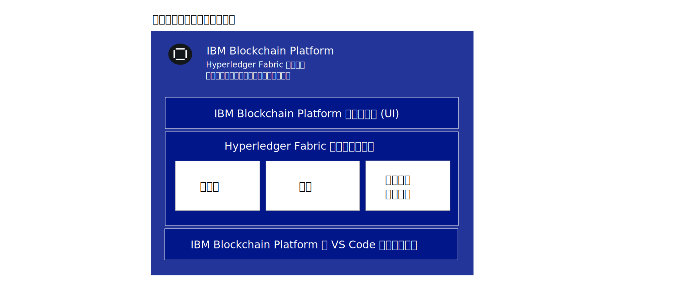
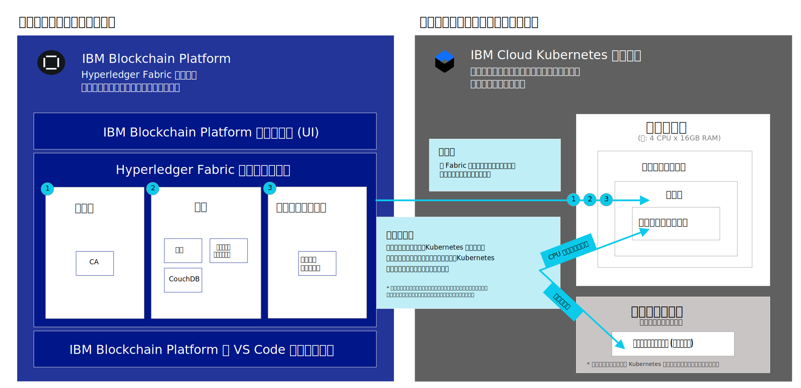

---

copyright:
  years: 2019
lastupdated: "2019-06-18"

keywords: getting started tutorials, videos, web browsers, integration

subcollection: blockchain

---

{:external: target="_blank" .external}
{:shortdesc: .shortdesc}
{:screen: .screen}
{:codeblock: .codeblock}
{:note: .note}
{:important: .important}
{:tip: .tip}
{:pre: .pre}
{:gif: data-image-type='gif'}

# {{site.data.keyword.blockchainfull_notm}} Platform for {{site.data.keyword.cloud_notm}} の概説
{: #ibp-v2-deploy-iks}

{{site.data.keyword.blockchainfull}} Platform for {{site.data.keyword.cloud_notm}} には、{{site.data.keyword.blockchainfull_notm}} Platform コンソールという、ブロックチェーン・コンポーネントをデプロイして管理するための手順を簡単に素早く行えるようにするユーザー・インターフェースが組み込まれています。 このチュートリアルでは、{{site.data.keyword.blockchainfull_notm}} Platform for {{site.data.keyword.cloud_notm}} を開始し、コンソールを使用して {{site.data.keyword.cloud_notm}} 上の {{site.data.keyword.cloud_notm}} Kubernetes サービス・クラスターにブロックチェーン・コンポーネントをデプロイして管理する方法について説明します。 Kubernetes と {{site.data.keyword.cloud_notm}} Kubernetes Service について詳しくは、[Kubernetes](/docs/services/blockchain/reference?topic=blockchain-k8s-overview "Kubernetes") を参照してください。
{:shortdesc}

**対象者:** このトピックは、{{site.data.keyword.cloud_notm}} での Kubernetes クラスターのセットアップと {{site.data.keyword.blockchainfull_notm}} Platform のデプロイを担当するシステム管理者を対象にしています。

{{site.data.keyword.blockchainfull_notm}} Platform を {{site.data.keyword.cloud_notm}} Kubernetes クラスターにリンクしたら、コンソールを起動して、ブロックチェーン・コンポーネントの作成と管理を行うことができ、以下の重要な利点が得られます。

- **制御:** 中央の単一コンソールからブロックチェーン・コンポーネントと証明書を制御および管理できます。 ビジネスに必要なコンポーネントだけをデプロイし、ニーズの拡大に応じてコンポーネントを追加できます。
- **柔軟な Kubernetes ベースのデプロイメント:** Kubernetes クラスターのコンピュート (CPU、メモリー、ストレージ) のオプションを活用し、組み込みの HA オプションと DR オプションを利用できます。

## ブロックチェーン・サービスとは?
{: #ibp-v2-deploy-iks-blockhain-service}

次の図は、{{site.data.keyword.blockchainfull_notm}} Platform の 3 つの要素を示しています。



- **{{site.data.keyword.blockchainfull_notm}} Platform コンソール (UI)**: これは、ブロックチェーン・コンポーネントを作成および管理できるコンソールです。{{site.data.keyword.cloud_notm}} でサービス・インスタンスをプロビジョンしたら、{{site.data.keyword.blockchainfull_notm}} コンソールのインスタンスをデプロイし、それを {{site.data.keyword.cloud_notm}} Kubernetes クラスターにリンクすることができます。 その後、コンソールを使用して、Kubernetes クラスター内にブロックチェーン・コンポーネントを作成し、管理することができます。コンソールに対しては課金されません。

- **Hyperledger Fabric コンポーネント**: コンソールを使用して、Hyperledger Fabric v1.4.1 の認証局、ピア、順序付けサービスのイメージをベースとするブロックチェーン・コンポーネントを作成および管理します。  これらのコンポーネントは Kubernetes クラスターにデプロイされます。コンポーネントがデプロイされるときには、コンポーネント用のストレージが`デフォルトの`ストレージ・クラスを使用してプロビジョンされます。

- **{{site.data.keyword.IBM_notm}} VS Code 拡張機能 (開発ツール)**: クライアント・アプリケーションおよびスマート・コントラクトの開発、パッケージ化、テストを開始するには、VS Code マーケットプレイスから VS Code 拡張機能をダウンロードしてください。

## 考慮事項
{: #ibp-v2-deploy-iks-considerations}

コンソールをデプロイする前に、以下の考慮事項を理解しておいてください。

- {{site.data.keyword.blockchainfull_notm}} Platform for {{site.data.keyword.cloud_notm}} は、Hyperledger Fabric v1.4.1 を使用して構築されています。
- コンソールまたは API でデプロイされるすべてのピアでは、状態データベースとして CouchDB が使用されます。
- オファリングの評価のために、{{site.data.keyword.blockchainfull_notm}} Platform サービス・インスタンスを無料の Kubernetes クラスターにリンクすることもできますが、キャパシティーとパフォーマンスには制限があり、データはマイグレーションできず、30 日後にクラスターは削除されます。
- ベータ版トライアルは無料ですが、有料のクラスターを選択した場合は、Kubernetes クラスターに対する支払いが必要になります。
- Kubernetes クラスターの正常性モニター、セキュリティー、およびロギングの管理は、お客様が行う作業です。 {{site.data.keyword.cloud_notm}} が管理する範囲と、お客様が行う作業範囲について詳しくは、こちらの[情報](/docs/containers?topic=containers-responsibilities_iks#your-responsibilities-by-using-ibm-cloud-kubernetes-service){: external}を参照してください。
- Kubernetes ダッシュボードで Kubernetes クラスターのリソース使用量をモニターすることもお客様の作業です。 クラスターのストレージ容量またはパフォーマンスを向上させる必要がある場合は、[既存のボリュームの変更方法に関するこちらの情報](/docs/containers?topic=containers-file_storage#change_storage_configuration){: external}を参照してください。
- 証明書および秘密鍵の管理および保護は、お客様が行う作業です。 {{site.data.keyword.IBM_notm}} は、お客様の証明書を Kubernetes クラスターに保管しません。
- {{site.data.keyword.blockchainfull_notm}} Platform は、特定の地域でのみ使用可能です。 最新のリストは、[{{site.data.keyword.blockchainfull_notm}} Platform のロケーション](/docs/services/blockchain/howto?topic=blockchain-ibp-regions-locations)に関するトピックを参照してください。
- {{site.data.keyword.IBM_notm}} Kubernetes サービスを使用して作成された OpenShift クラスターに {{site.data.keyword.blockchainfull_notm}} Platform をデプロイすることはできません。
- {{site.data.keyword.cloud_notm}} Kubernetes クラスターの Kubernetes は 1.11 以上の安定したバージョンでなければなりません。 [アップグレード手順](/docs/services/blockchain/howto?topic=blockchain-ibp-v2-deploy-iks#ibp-v2-deploy-iks-updating-kubernetes)に従って、新規および既存のクラスターをこのバージョンにアップグレードしてください。
- {{site.data.keyword.cloud_notm}} で Kubernetes クラスターをプロビジョンするときに事前選択されるデフォルトのブロンズ・ファイル・ストレージを使用しない場合は、任意のストレージをプロビジョンできます。 詳しくは、[永続ストレージに関する考慮事項](/docs/services/blockchain?topic=blockchain-ibp-v2-deploy-iks#ibp-console-storage)で該当するトピックを参照してください。
- {{site.data.keyword.cloud_notm}} マルチゾーン・サポートをKubernetes クラスターに組み込む場合は、独自のストレージをプロビジョンする必要があります。 詳しくは、[{{site.data.keyword.blockchainfull_notm}} Platform での複数ゾーン (MZR) クラスターの使用](/docs/services/blockchain?topic=blockchain-ibp-v2-deploy-iks#ibp-console-mzr)を参照してください。

## ビデオのチュートリアル
{: #ibp-v2-deploy-video}

{{site.data.keyword.blockchainfull_notm}} Platform コンソールの詳細や {{site.data.keyword.blockchainfull_notm}} Platform for {{site.data.keyword.cloud_notm}} のデプロイを開始する方法については、以下の[一連のビデオ]( http://ibm.biz/BlockchainPlatformSeries)をご覧ください。

## 始めに
{: #ibp-v2-deploy-iks-prereq}

開始前に、以下のことを行います。

- [{{site.data.keyword.cloud_notm}}有料アカウント](https://cloud.ibm.com/catalog/services/blockchain){: external}があることを確認します。 アカウントがない場合は、以下のようにします。
   1. **「登録」**ボタンをクリックします。
   2. 無料トライアル・アカウントを作成した後、{{site.data.keyword.cloud_notm}} コンソールで**「管理」** > **「請求および使用量」** > **「請求処理」**に移動し、**「クレジット・カードの追加」**をクリックして、**「従量課金 (PAYG)」**タイプにアップグレードします。
   3. ブロックチェーン・サービス・インスタンスにリンクする Kubernetes クラスターに対する管理者の役割とマネージャーの役割の両方がユーザーにあることを確認してください。 詳しくは、[Kubernetes のアクセス役割を割り当てる方法](#ibp-v2-deploy-iks-k8x-access-roles)の手順を参照してください。

組織規模の広範囲のソリューションとしてサービス・インスタンスを使用する場合は、ネットワークを作成する際に組織用の E メール・アドレスを使用することを参加組織にお勧めします。 そうすれば、一個人の都合によってネットワークの利用可否が左右されることがありません。
{:tip}  

- 既存の {{site.data.keyword.cloud_notm}} Kubernetes サービス・クラスターを使用する場合は、Kubernetes のバージョンを確認し、必要に応じて、1.11 以降にアップグレードします。 クラスターで実行されている Kubernetes バージョンの確認方法、およびバージョンのアップグレード方法について詳しくは、[クラスターの Kubernetes バージョンの更新](/docs/services/blockchain/howto?topic=blockchain-ibp-v2-deploy-iks#ibp-v2-deploy-iks-updating-kubernetes)を参照してください。

### ブラウザー
{: #ibp-v2-deploy-iks-browsers}
以下のリストに、{{site.data.keyword.blockchainfull_notm}} Platform コンソールに最小限必要なブラウザー・ソフトウェアを指定します。

- Chrome: ご使用のオペレーティング・システムの最新バージョン
- Firefox: ご使用のオペレーティング・システム用の最新の通常 (非 ESR) バージョン
- Safari: Mac の最新バージョン
- Edge: v44.17763.1.0 以上

### 必要なリソース
{: #ibp-v2-deploy-iks-resources-required}

#### クラスター・サイズに関する推奨事項
{: #ibp-v2-deploy-iks-resources-required-free}

 {{site.data.keyword.blockchainfull_notm}} Platform コンソールを {{site.data.keyword.cloud_notm}} Kubernetes サービス・クラスターにリンクするときには、Kubernetes クラスターがハードウェア・リソースの最小要件を満たしていることを確認する必要があります。

|Kubernetes クラスターのタイプ | ユース・ケース | CPU | RAM | ワーカー・ノード |
|-----------|------|-----|-----------------------|
|標準 (推奨) | MVP に適しています | 4 (共有) | 16 GB (共有)|複数|
|無料** | 評価に適しています | 2 | 4 GB | 1 |  
** {{site.data.keyword.blockchainfull_notm}} Platform サービス・インスタンスを無料の {{site.data.keyword.cloud_notm}} Kubernetes クラスターにリンクすると、30 日間料金なしで {{site.data.keyword.blockchainfull_notm}} Platform をプレビューできます。 スループット、ストレージ、および機能性の面でパフォーマンスが制限されます。 {{site.data.keyword.cloud_notm}} では、30 日後に Kubernetes クラスターが削除され、無料のクラスターから有料のクラスターにノードまたはデータを移行することはできません。

テストおよび試験目的には、これらのリソースで十分です。 [ネットワーク構築チュートリアル](/docs/services/blockchain/howto?topic=blockchain-ibp-console-build-network#ibp-console-build-network)では、ピアを 2 つ、CA を 2 つ、順序付けサービスを 1 つ作成し、約 4.85 CPU を消費します。5 ノードの順序付けサービスがそのうちの 2.25 CPU を消費します。 したがって、5 ノードの順序付けサービスをデプロイする場合は、順序付けサービスと合わないので、2 CPU の単一ワーカー・ノードの Kubernetes クラスターをデプロイしないでください。 4 CPU 以上のノードのクラスターをお勧めします。 追加するワーカー・ノードが多いほど、クラスターでデプロイメントを処理しやすくなります。
{:note}

#### 有料クラスター
{: #ibp-v2-deploy-iks-resources-required-paid}

{{site.data.keyword.blockchainfull_notm}} Platform の実動レベルのデプロイメントは、{{site.data.keyword.cloud_notm}} Kubernetes Service の有料クラスターにデプロイします。 このクラスターのサイズや構成は、それぞれのユース・ケースのニーズによって決まります。 大規模なデプロイメントは、必然的に大規模なクラスターにデプロイする必要があります。 計画しているデプロイメントの規模よりもクラスターの規模をどれほど大きくするかは、お客様次第です。 少なくともいくらかの余裕を持たせることが理想です。そうすれば、ノードのサイズを調整する**前に** Kubernetes クラスターに追加のリソースをデプロイしなくても、ピアや順序付けサービスを追加のチャネルに参加させ、高いスループットを実現することができます。 こうした値の調整方法の詳細については、[リソースの再割り振り](/docs/services/blockchain/howto?topic=blockchain-ibp-console-govern#ibp-console-govern-reallocate-resources)を参照してください。

{{site.data.keyword.blockchainfull_notm}} Platform をデプロイするには、Kubernetes タイプのクラスターを作成する必要があります。{{site.data.keyword.blockchainfull_notm}} Platform は、{{site.data.keyword.IBM_notm}} Kubernetes サービスを使用して作成された OpenShift クラスターをサポートしません。
{:important}

追加のノードやポッドをデプロイする作業をいくらか自動で実行する[{{site.data.keyword.cloud_notm}} Kubernetes Service 自動スケール機能](/docs/containers?topic=containers-ca#ca){: external}を使用しないお客様の場合は、拡大できる余地を残した十分なサイズの初期デプロイメントを作成することが特に重要になります。

最初から {{site.data.keyword.cloud_notm}} Kubernetes Service に十分なリソースをデプロイして、必要に応じてポッドやワーカー・ノードを拡張できるようにしておくほうが、Kubernetes クラスターのデプロイメントを大きくする手間が不要なため簡単ではありますが、Kubernetes クラスターのデプロイメントが大きくなるほど、費用が高くなります。 選択肢について慎重に検討し、どのような選択を行うにしても、生じるトレードオフを認識する必要があります。

クラスターに必要なストレージ量およびコンピュート量の目安として、このリストの後の表を参照してください。ピア、順序付けノード、CA の現在のデフォルト値を記載しています。

| **コンポーネント** (すべてのコンテナー) | CPU  | メモリー (GB) | ストレージ (GB) |
|--------------------------------|---------------|-----------------------|------------------------|
| **ピア**                       | 1.2            | 2.4                  | 200 (ピア用に 100 GB と CouchDB 用に 100 GB を含む)|
| **CA**                         | 0.1            | 0.2                  | 20                     |
| **順序付けノード**              | 0.45           | 0.9                  | 100                    |

5 ノードの Raft 順序付けサービスをデプロイする場合は、順序付けノードのデプロイメントが 5 倍に増えることに注意してください。 つまり、5 つの Raft ノードに、合計 2.25 の CPU、4.5 GB のメモリー、および 500 GB のストレージが必要になります。 その結果、5 ノードの順序付けサービスは単一の 2 CPU の Kubernetes ワーカー・ノードよりも大きくなります。
{:tip}

## 手順 1: {{site.data.keyword.cloud_notm}} でサービス・インスタンスを作成する
{: #ibp-v2-deploy-iks-create-service-instance}

以下の手順を使用して、{{site.data.keyword.blockchainfull_notm}} Platform for {{site.data.keyword.cloud_notm}} のサービス・インスタンスを作成します。

1. {{site.data.keyword.cloud_notm}} カタログで [ブロックチェーン・サービス](https://cloud.ibm.com/catalog/services/blockchain){: external}を見つけるか、自分の {{site.data.keyword.cloud_notm}} カタログ・ページで`ブロックチェーン`を検索します。
2. インスタンスの**サービス名**を、わかりやすい名前に変更することをお勧めします。
3. ベータ版では、利用可能な地域は**ダラス**のみです。これは変更できません。 有料クラスターでは、追加の地域を選択できます。 詳しくは、[地域](/docs/services/blockchain/reference?topic=blockchain-ibp-regions-locations#ibp-regions-locations)を参照してください。
4. リソース・グループとタグ・フィールドはそのままでかまいません。
5. **「標準」**プランを選択します。
6. **「作成」**をクリックして、サービス・インスタンスをプロビジョンします。

## 手順 2: {{site.data.keyword.blockchainfull_notm}} Platform をデプロイする
{: #ibp-v2-deploy-iks-steps}

サービス・インスタンスを作成した直後に、以下のガイダンスに従って {{site.data.keyword.blockchainfull_notm}} Platform をデプロイできます。

1. **「ようこそ」&「前提条件」**ステップ。 **ダラス**地域に既に {{site.data.keyword.IBM_notm}} Kubernetes サービス・クラスターがあり、ブロックチェーン・サービス用にそのクラスターを使用する場合は、該当するチェック・ボックスを選択します。 **既存のクラスターを使用する場合は、次のステップをスキップできます。ただし、Kubernetes バージョンが v1.11 以降の安定したバージョンであることを確認してください**。 **「続行 (Continue)」**をクリックします。
2. **「クラスターの作成」**ステップ。 ステップ 1 で既存の Kubernetes クラスターを使用するチェック・ボックスを選択した場合は、このステップはスキップしてください。 そうでない場合は、**「クラスターの新規作成 (Create a new cluster)」**をクリックします。クラスターを作成するための {{site.data.keyword.cloud_notm}} Kubernetes ダッシュボードが起動します。 詳しくは、[{{site.data.keyword.cloud_notm}} Kubernetes サービスの概説](/docs/containers?topic=containers-getting-started){: external}を参照してください。 このプロセスの実行時間には余裕をみておいてください。
  - クラスターの場所について詳しくは、[地域](/docs/services/blockchain/reference?topic=blockchain-ibp-regions-locations#ibp-regions-locations)を参照してください。
  - **標準クラスター (推奨):** 複数ノードで高可用性を実現できる長期用のオプションが必要な場合に選択してください。 クラスター・タイプについては、**「Kubernetes」**を選択します。**少なくとも v.1.11 以降の安定したバージョンを選択してください。** 有料クラスターをデプロイする場合は、[標準クラスターの作成](/docs/containers?topic=containers-clusters#clusters_ui_standard){: external}を参照してください。 ただし、高可用性や災害復旧が必要な場合は、使用するストレージ・クラスを決定する必要があります。 動的プロビジョニングでは、クラスターの`デフォルト`のストレージ・クラスが使用されます。 そのため、お客様はデフォルトとして任意のストレージ・クラスを設定できます。 詳しくは、[ファイル・ストレージ構成の決定](/docs/containers?topic=containers-file_storage#file_predefined_storageclass){: external}を参照してください。
  - **無料クラスター (Free cluster):** プラットフォームのプレビュー期間が 30 日未満の場合に選択してください。 無料のクラスターから有料のクラスターには移行できないので**注意してください**。 無料タイプのクラスターでは、利用できるストレージとトランザクションのスループットが限られています。 Kubernetes クラスターの有効期限が切れた場合の対応手順については、[Kubernetes クラスターの有効期限](/docs/services/blockchain/howto?topic=blockchain-ibp-console-manage-console#ibp-console-manage-console-cluster-expiration)に関するトピックを参照してください。
  - {{site.data.keyword.cloud_notm}} 上の無料と有料の Kubernetes クラスターの違いについて詳しくは、[フリー・クラスターと標準クラスターの比較](/docs/containers?topic=containers-cluster_types#cluster_types){: external}を参照してください。  

   {{site.data.keyword.blockchainfull_notm}} Platform デプロイメント・プロセスを完了できるように、クラスターを作成したら、必ず、ブラウザーでこのタブに戻ってください。  
   {:important}  

  クラスターが正常にデプロイされるまで待つ必要があります。 次に、**「クラスターがある (I Have a Cluster)」**ボタンをクリックします。
3. クラスターで実行されている Kubernetes バージョンは、バージョン 1.11 以降でなければなりません。 こちらの[手順](/docs/services/blockchain/howto?topic=blockchain-ibp-v2-deploy-iks#ibp-v2-deploy-iks-updating-kubernetes)に従って、クラスターのバージョンを確認し、必要に応じてアップグレードしてください。 その後、ここに戻り、以下の手順を進めてください。
4. **「クラスターへのデプロイ (Deploy onto cluster)」**ステップ。 {{site.data.keyword.blockchainfull_notm}} Platform をデプロイする Kubernetes クラスターをドロップダウン・リストから選択し、**「クラスターへのデプロイ (Deploy to cluster)」**をクリックします。  

  ドロップダウン・リストに Kubernetes クラスターが表示されない場合は、以下の状況が原因である可能性があります。
  - クラスターの作成プロセスが完了するのには、最大で 60 分かかることがあります。 クラスターを作成した場合は、そのクラスターの状態が**「正常」**になるまで、ある程度時間がかかることを見越しておいてください。
  - **ダラス**地域以外のクラスターは表示されないので使用できません。
  - ESR バージョンの Firefox を使用していないことを確認してください。 ESR バージョンを使用している場合は、Chrome などの別のブラウザーに変更して再試行してください。

5. **「コンソールの起動 (Launch console)」**ステップ。 {{site.data.keyword.blockchainfull_notm}} Platform が正常にデプロイされたら、**「{{site.data.keyword.blockchainfull_notm}} Platform の起動 (Launch the {{site.data.keyword.blockchainfull_notm}} Platform)」**をクリックして、{{site.data.keyword.blockchainfull_notm}} Platform コンソールを開きます。 コンソールのプロビジョン中に、ボタンが有効になるまでに数分かかる場合があります。

以下の図は、Kubernetes クラスターへの {{site.data.keyword.blockchainfull_notm}} Platform コンポーネントのデプロイを示しています。



- **ポッド**: 各認証局、ピア、または順序付けサービスをデプロイすると、新しいポッドがクラスターのワーカー・ノード内に作成されます。
- **アプリ・コンテナー**: デプロイされた各ノードのポッド内部にはコンテナーが作成されます。  
- **永続ストレージ**: ノードがデプロイされるたびに、各ノードのストレージが Kubernetes クラスターの`デフォルトの`ストレージ・クラスから動的にプロビジョンされます。

## (オプション) コンソールへのユーザーの追加
{: #ibp-v2-deploy-iks-add-users}

デフォルトでは、コンソールでは {{site.data.keyword.cloud_notm}} の ID サービス・プロバイダーとして [{{site.data.keyword.cloud_notm}} IAM (ID およびアクセス管理)](/docs/iam?topic=iam-iamoverview#iamoverview){: external} が使用されます。 {{site.data.keyword.blockchainfull_notm}} Platform コンソールは、コンソールの管理者として {{site.data.keyword.IBM_notm}} 製品所有者の E メール・アドレスを構成してプロビジョンされます。 このユーザーは、管理者として、ユーザーの E メール・アドレスを介して他のユーザーにコンソールへのアクセス権を付与できます。  詳しくは、[コンソールでのユーザーの追加と削除](/docs/services/blockchain?topic=blockchain-ibp-console-manage-console#ibp-console-manage-console-add-remove)の方法を参照してください。

## 次のステップ
{: #ibp-v2-deploy-iks-next-steps}

- ノードを作成する前に、Kubernetes クラスターのストレージ・プラグインを決める必要があります。 単に機能や概要を知ることが目的であれば、クラスターのプロビジョン時に事前選択されるデフォルトのブロンズ・ファイル・ストレージが適しています。 この段階では、これ以上のアクションは不要です。  しかし、正式なテストや実動使用のためにクラスターをデプロイする準備ができたら、ニーズに合った適切なストレージ・プラグインを決める必要があります。 まずは、[永続ストレージに関する考慮事項](#ibp-console-storage)で該当するトピックを参照してください。

- コンソールが使用できる状態になったので、[ネットワーク構築チュートリアル](/docs/services/blockchain/howto?topic=blockchain-ibp-console-build-network#ibp-console-build-network)に進むことができます。
必要に応じて後で戻ることができるように、コンソールの URL をブックマークすることを検討してください。 そうしない場合は、[インストール後の手順](#ibp-v2-deploy-iks-post-install)の手順に従って、ブラウザーから戻ることができます。

## {{site.data.keyword.cloud_notm}} およびその他のサード・パーティー・サービスとの統合
{: #ibp-v2-deploy-iks-integrations}

{{site.data.keyword.blockchainfull_notm}} Platform では、ユーザーのネットワークに対する可視性の向上や他のサービスとの統合を実現する、{{site.data.keyword.cloud_notm}} カタログで提供される一連のサービスを活用できます。

  

**アクセス制御**  
- [{{site.data.keyword.cloud_notm}} ID およびアクセス管理 (IAM)](/docs/services/Log-Analysis-with-LogDNA?topic=LogDNA-iam) を使用して、ユーザーを安全に認証し、すべてのクラウド・リソースへのアクセスを制御します。

**モニタリング**  
- [{{site.data.keyword.cloud_notm}} Activity Tracker with LogDNA](/docs/services/Log-Analysis-with-LogDNA?topic=LogDNA-getting-started#getting-started) サービスを使用して、ログをリアルタイムでトラブルシューティングし、問題を診断し、Kubernetes クラスター内の問題を特定します。

- [{{site.data.keyword.cloud_notm}} Activity Tracker with SysDig](/docs/services/Monitoring-with-Sysdig?topic=Sysdig-getting-started#getting-started) を使用して、IBM Cloud 内のサービスおよびアプリケーションのアクティビティーと正常性をモニターします。

- [LogDNA および Sysdig を使用してログを分析し、アプリケーションの正常性をモニター](/docs/tutorials?topic=solution-tutorials-application-log-analysis)する方法については、このチュートリアルを参照してください。

**ストレージ**  
- ブロックチェーン・ノードがプロビジョンされるときに、{{site.data.keyword.cloud_notm}} の[ファイル・ストレージ](/docs/infrastructure/FileStorage?topic=FileStorage-about#getting-started-with-file-storage)および[ブロック・ストレージ](/docs/infrastructure/BlockStorage?topic=BlockStorage-About#getting-started-with-block-storage)を使用します。ブロックチェーンが {{site.data.keyword.cloud_notm}} ストレージ・オプションとどのように統合されるかについて詳しくは、[永続ストレージに関する考慮事項](#ibp-console-storage)のこのトピックを参照してください。

- [Portworx](/docs/containers?topic=containers-portworx#portworx) をセットアップして、コンテナー化された複数のデータベースをまたいでローカルの永続ストレージを管理するか、複数のゾーンにまたがるポッド間でデータを共有します。

使用可能な {{site.data.keyword.cloud_notm}} サービスとその他のサード・パーティーの統合について詳しくは、[サポートされる {{site.data.keyword.cloud_notm}} とサード・パーティーの統合](/docs/containers?topic=containers-supported_integrations#supported_integrations){: external}のこのリストを参照してください。

## クラスターの Kubernetes バージョンの更新
{: #ibp-v2-deploy-iks-updating-kubernetes}

既存の {{site.data.keyword.cloud_notm}} Kubernetes サービス・クラスターを使用する場合、Kubernetes バージョンが 1.11 以降であることを確認してください。

クラスターの Kubernetes バージョンは、{{site.data.keyword.cloud_notm}} の [Kubernetes クラスター・ページ](https://cloud.ibm.com/kubernetes/clusters){: external}で確認できます。このページでは、すべてのクラスターがテーブルにリストされています。

Kubernetes のバージョンがバージョン 1.11 以降でない場合は、以下の手順を実行して、クラスターの Kubernetes バージョンを更新する必要があります。

1. 行末にあるオーバーフロー・メニュー・アイコンをクリックし、**「バージョンの更新 (Update version)」**を選択します。 このプロセスは完了までに約 1 時間かかります。 バージョンが正常に更新されると、クラスターの更新バージョンが**「Kubernetes バージョン」**列に表示されます。  
2. Kubernetes バージョンのドロップダウン・リストから v1.11 以降の Kubernetes バージョンを選択し、**「更新」**をクリックします。
3. クラスターをクリックし、**「ワーカー・ノード」**タブに移動します。 更新するワーカー・ノードの前のチェック・ボックスを選択し、ポップアップ・メニュー・バーから**「Kubernetes の更新 (Update Kubernetes)」**をクリックします。 クラスターに複数のワーカー・ノードが含まれている場合、そのすべてを更新する必要があります。

  ワーカー・ノードを更新すると、アプリとサービスにダウン時間が発生する可能性があります。 ワーカー・ノード・マシンが再イメージ化されるので、[ポッドの外部に保管](/docs/containers?topic=containers-storage_planning#persistent_storage_overview){: external}していないデータは削除されます。
  {:important}

{: gif}

{{site.data.keyword.IBM_notm}} Kubernetes サービス・クラスターおよびワーカー・ノードの Kubernetes バージョンの更新方法について詳しくは、[クラスター、ワーカー・ノード、アドオンの更新](/docs/containers?topic=containers-update#update){: external}を参照してください。  

更新が完了するのを待ってから、[{{site.data.keyword.blockchainfull_notm}} Platform のデプロイメントを再開](/docs/services/blockchain/howto?topic=blockchain-ibp-v2-deploy-iks#ibp-v2-deploy-iks-steps)できます。

## Kubernetes のアクセス役割を割り当てる方法
{: #ibp-v2-deploy-iks-k8x-access-roles}

ブロックチェーン・サービス・インスタンスを Kubernetes クラスターにリンクするユーザーには、Kubernetes の管理者とマネージャーの役割が必要です。
このアクセス権限を構成するには、以下の手順を実行します。
   1. {{site.data.keyword.cloud_notm}} ダッシュボードの**「管理」**ドロップダウン・リストをクリックし、**「アクセス (IAM) (Access (IAM))」**をクリックします。
   2. 左側のナビゲーション・メニューで**「ユーザー」**をクリックし、サービス・インスタンスを Kubernetes クラスターにリンクするユーザーの ID をクリックします。
   3. **「アクセス・ポリシー」**をクリックし、次に**「アクセス権限の割り当て」**をクリックします。
   4. **「リソースへのアクセス権限の割り当て」**タイルをクリックします。
   5. **「サービス」**ドロップダウン・リストから**「Kubernetes Service」**を選択します。
   6. このユーザーの**「管理者」**と**「マネージャー」**の役割にチェック・マークを付けます。
   7. **「割り当て」**をクリックします。

{: gif}

Kubernetes のアクセス制御の詳細については、[ユーザーに適したアクセス・ポリシーと役割を選択する方法](/docs/containers?topic=containers-users#access_roles)を参照してください。

## インストール後の手順
{: #ibp-v2-deploy-iks-post-install}

コンソールをデプロイしたら、**「{{site.data.keyword.blockchainfull_notm}} Platform の起動 (Launch the {{site.data.keyword.blockchainfull_notm}} Platform)」**ボタンをクリックして、ブラウザーでコンソールを開くことができます。 コンソール URL をブックマークとしてブラウザーに追加できます。

### {{site.data.keyword.cloud_notm}} からコンソールに戻る方法
{: #ibp-v2-deploy-iks-rtn-to-console}

コンソール URL がわからない場合は、{{site.data.keyword.cloud_notm}} ダッシュボードで確認できます。

1. ブラウザーで、[{{site.data.keyword.cloud_notm}} リソース・リスト](https://cloud.ibm.com/resources){: external}を開きます。 {{site.data.keyword.IBM_notm}} ID でログインする必要があります。
2. **「サービス」**ツイスティーの下に、{{site.data.keyword.blockchainfull_notm}} Platform サービス・インスタンスが表示されます。 デプロイした {{site.data.keyword.blockchainfull_notm}} Platform サービス・インスタンスを見つけて、クリックします。
3. 後続のパネルの左側のナビゲーションの**「管理」**をクリックしてから、**「{{site.data.keyword.blockchainfull_notm}} Platform の起動 (Launch the {{site.data.keyword.blockchainfull_notm}} Platform)」**をクリックします。

ブラウザーでコンソールが開きます。

## 永続ストレージに関する考慮事項
{: #ibp-console-storage}

{{site.data.keyword.blockchainfull_notm}} Platform では、CA、ピア、順序付けノードのそれぞれに永続ストレージが必要です。 {{site.data.keyword.cloud_notm}} で標準 Kubernetes クラスターをデプロイすると、[ブロンズ・レベルのファイル・ストレージ](/docs/containers?topic=containers-file_storage#file_predefined_storageclass){: external}のプラグインが`デフォルトの`ストレージ・クラスとして事前構成されます。 その後、コンソールまたは API を使用してブロックチェーン・ノードをそのクラスターにデプロイすると、そのノードのデプロイ時に要求したストレージ量に基づいて、特定の量のファイル・ストレージが動的にノードにプロビジョンされます。 したがって、そのデプロイでは、`デフォルトの`ストレージ・クラスのストレージがクラスターにプロビジョンされます。 いくつかの [Kubernetes ストレージ・オプション](/docs/containers?topic=containers-storage_planning#persistent_storage_overview){: external}から選択して、ユース・ケースに最適なストレージ・タイプを決定できます。 ストレージ使用量については別途課金されるので、選択する際は、さまざまなストレージ・オプションのコストを考慮に入れることができます。

独自のストレージ・プラグインを追加する場合は、カスタマイズ型のストレージ・クラスを作成する必要があります。 ソリューションに[ストレージ・クラスを追加](/docs/containers?topic=containers-kube_concepts#storageclasses){: external}する方法を参照してください。 {{site.data.keyword.blockchainfull_notm}} Platform では`デフォルト`のストレージ・クラスによる[動的ボリューム・プロビジョニング](/docs/containers?topic=containers-kube_concepts#dynamic_provisioning){: external}が行われるので、独自のストレージ・プラグインを使用するためには、次のコマンドを実行してデフォルトのストレージ・クラスを変更する必要があります。

```
kubectl patch storageclass <storageclass> -p '{"metadata": {"annotations":{"storageclass.kubernetes.io/is-default-class":"true"}}}'
```
{:codeblock}

``<storageclass>`` は、使用するストレージ・クラスの名前に置き換えてください。

クラスターにブロックチェーン・ノードをデプロイした後は、Kubernetes クラスターのデフォルトのストレージ・クラスを変更しないでください。変更すると、既にデプロイされている CA、ピア、および順序付けのノードのストレージが失われてしまうからです。 そのため、ブロックチェーン・ノードをデプロイする前に、ストレージのプラグインを決定する必要があります。
{: important}

### {{site.data.keyword.blockchainfull_notm}} Platform での複数ゾーン (MZR) クラスターの使用
{: #ibp-console-mzr}

[マルチゾーン・サポート](/docs/containers?topic=containers-regions-and-zones#regions_multizone){: external}が提供されている地域では、標準 Kubernetes クラスターを {{site.data.keyword.cloud_notm}} で作成する場合にマルチゾーン・サポートがデフォルトで事前選択されます。 この機能は必須ではありませんが、1 つのゾーンまたはデータ・センターがダウンした場合のノードの高可用性を確保できます。 クラスターにマルチゾーン・サポートを含める場合は、独自のストレージ・ソリューションを用意する必要があります。 いくつかの[永続ストレージ・オプション](/docs/containers?topic=containers-storage_planning#persistent_storage_overview){: external}から選択できます。

ストレージ・クラスを作成した後、上記の `kubectl patch storageclass` コマンドを実行して、マルチゾーン領域のストレージ・クラスを`デフォルトの`ストレージ・クラスに設定してください。

### 価格設定および請求処理の情報
{: #ibp-v2-deploy-iks-pricing-billing}

- {{site.data.keyword.blockchainfull_notm}} Platform の価格情報に再度アクセスする必要がある場合は、[料金](/docs/services/blockchain/howto?topic=blockchain-ibp-saas-pricing)を参照してください。
- 現在の {{site.data.keyword.cloud_notm}} の使用量情報が {{site.data.keyword.cloud_notm}} ダッシュボードの[使用量のタイル](https://cloud.ibm.com/billing/){: external}に表示され、料金が[請求書情報](https://cloud.ibm.com/billing/billing-items){: external}に表示されます。 {{site.data.keyword.blockchainfull_notm}} Platform の請求処理の仕組みについて詳しくは、[課金](/docs/services/blockchain/howto?topic=blockchain-ibp-saas-pricing#ibp-saas-pricing-billing)のトピックを参照してください。

### サービス・インスタンスの削除
{: #ibp-v2-deploy-iks-delete-service-instance}

サービス・インスタンスが不要になった場合は、Kubernetes クラスターから削除してリソースを解放できます。 {{site.data.keyword.cloud_notm}} ダッシュボードを使用して {{site.data.keyword.blockchainfull_notm}} Platform サービス・インスタンスを削除できます。

1. ブラウザーで、[{{site.data.keyword.cloud_notm}} リソース・リスト](https://cloud.ibm.com/resources){: external}を開きます。 {{site.data.keyword.IBM_notm}} ID でログインする必要があります。
2. **「サービス」**ツイスティーの下で、削除するサービス・インスタンスを見つけて、「アクション」メニューで**「削除」**をクリックします。

**このオプションは慎重に選択してください。** サービス・インスタンスを削除すると、各ノードに関連付けられたストレージは削除され、復元できなくなります。 台帳データはすべて削除されます。
{: important}

サービス・インスタンスの削除に失敗した場合、Kubernetes クラスターにアクセスできないことが原因である可能性があります。 その場合は、[サポート・チケット](/docs/services/blockchain?topic=blockchain-blockchain-support#blockchain-support-cases)を開いて、サービス・インスタンスの削除を要請してください。
