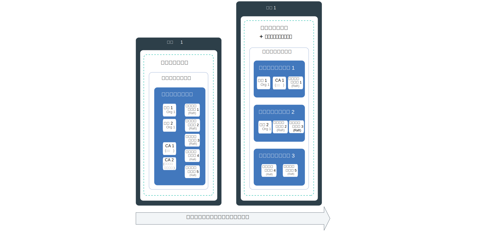
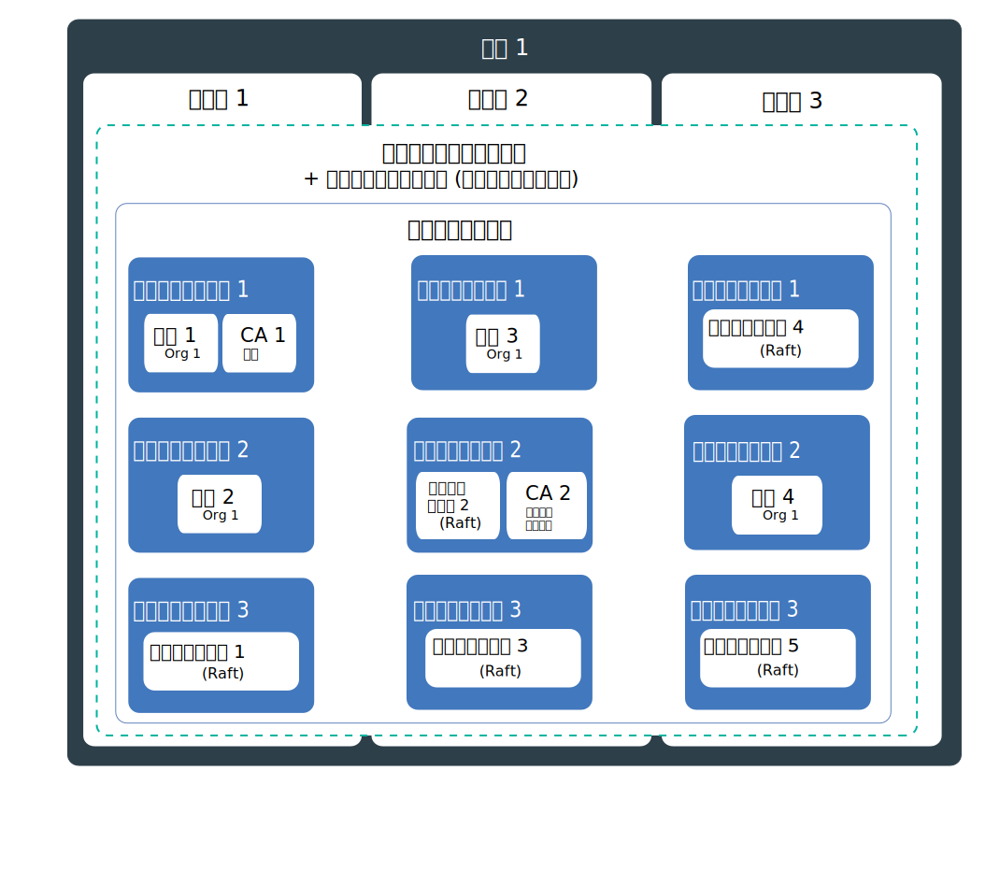
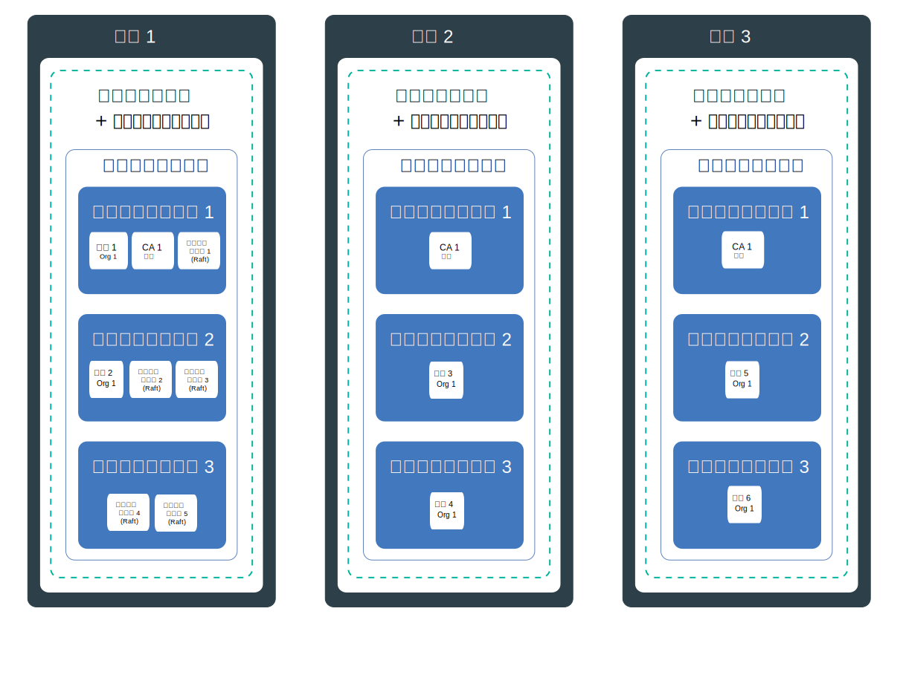

---

copyright:
  years: 2019
lastupdated: "2019-07-10"

keywords: high availability, HA, IBM Cloud, failures, zone failure, region failure, component failure, worker node failure

subcollection: blockchain

---

{:external: target="_blank" .external}
{:shortdesc: .shortdesc}
{:screen: .screen}
{:codeblock: .codeblock}
{:note: .note}
{:important: .important}
{:tip: .tip}
{:pre: .pre}

# 高可用性 (HA)
{: #ibp-console-ha}

{{site.data.keyword.blockchainfull}} Platform コンポーネントのデプロイメント戦略と共に組み込み Kubernetes 機能を使用して、ブロックチェーン・ネットワークの可用性を高め、クラスターで障害が発生した場合にダウン時間からネットワークを保護します。
{:shortdesc}

**対象者:** このトピックは、{{site.data.keyword.cloud_notm}} または {{site.data.keyword.cloud_notm}} Private での {{site.data.keyword.blockchainfull_notm}} の計画と構成を担当するアーキテクトおよびシステム管理者を対象にしています。

高可用性とは、サイトの一部または全体に障害が発生した後でもアプリを稼働状態に保つための、IT インフラストラクチャーの中核分野です。 高可用性の主な目的は、IT インフラストラクチャー内の潜在的な障害点を除去することです。 例えば、冗長性を追加してフェイルオーバー・メカニズムをセットアップすることで、1 つのシステムの障害に備えることができます。

高可用性は、IT インフラストラクチャーのさまざまなレベルで、また、クラスターのさまざまな層内で実現できます。 どのレベルの可用性が適しているかは、ビジネス要件、組織と合意したサービス・レベル・アグリーメント、冗長性のコストなど、いくつかの要因に応じて異なります。

続行する前に、HA に関するプラットフォーム固有のガイダンスを確認することをお勧めします。
- {{site.data.keyword.cloud_notm}} を使用している場合は、[{{site.data.keyword.cloud_notm}} Kubernetes Service の高可用性](/docs/containers?topic=containers-ha){: external}に関するトピックで、{{site.data.keyword.cloud_notm}} での HA による Kubernetes の処理の詳細を参照できます。
- {{site.data.keyword.cloud_notm}} Private を使用している場合は、[{{site.data.keyword.cloud_notm}} Private での HA の実装](https://www.ibm.com/cloud/garage/practices/manage/high-availability-ibm-cloud-private){: external}に関するコンテンツを参照してください。  

このトピックでは、ブロックチェーン固有の HA ガイダンス、および上記のプラットフォーム固有のトピックの推奨事項について詳しく説明します。

## {{site.data.keyword.blockchainfull_notm}} Platform for {{site.data.keyword.cloud_notm}} の潜在的な障害点の概要
{: #ibp-console-ha-points-of-failure-overview}

{{site.data.keyword.blockchainfull_notm}} Platform のアーキテクチャーは、信頼性を確保し、処理待ち時間を短く、サービスの実行可能時間を最大にするように設計されています。 ただし、障害が発生する可能性はあります。 {{site.data.keyword.blockchainfull_notm}} Platform には、冗長性および[アンチアフィニティー](https://www.ibm.com/blogs/cloud-archive/2016/07/ibm-containers-anti-affinity/){: external}・ポリシーを追加して (使用可能な場合)、クラスターに可用性を追加する方法がいくつか用意されています。これにより、同じタイプおよび組織のブロックチェーン・コンポーネントが別々のワーカー・ノードにデプロイされます。  ブロックチェーン・ネットワーク全体に冗長性を追加することで、障害やダウン時間を回避できます。  

最大の高可用性を実現するには、複数の地域内の Kubernetes クラスターでピアと順序付けプログラムをプロビジョンすることにより、冗長性を構築することをお勧めします。 コンポーネントが複数の地域に分散し、かつブロックチェーン台帳がそれらのコンポーネント間で分散されている場合は、1 つの地域で障害が発生してもトランザクションの処理に影響はありません。 CA は、日次トランザクション処理にとっては重要度が低くなります。 すべてのユーザーが登録され、CA にエンロールされると、次回それらのサービスが必要になるまでは不要になります。

### ピアに関する考慮事項
{: #ibp-console-ha-peers}

ピアの HA とは、クライアント・アプリケーションからの要求を処理するために、同じチャネル上の組織ごとに少なくとも 2 つのピアが使用可能である、冗長ピアを常に持つことを意味します。 複数のピアを単一のワーカー・ノードにデプロイすることも、ワーカー・ノード、ゾーン ({{site.data.keyword.cloud_notm}} を使用している場合)、または地域に分散させることもできます。 複数のピアをデプロイして同じチャネルに結合すると、チャネルとデータはチャネル内のすべてのピア間で自動的に同期されるため、ピアは HA ペアとして動作します。  設計上、ブロックチェーン・ネットワークは、複数の組織が同じチャネルでトランザクションを行うことを意図しています。 したがって、共通のデプロイメント・モデルでは、どのチャネルについても、相互間ですべてのデータを同期する複数の組織アカウント・クラスターに分散された、組織ごとに冗長ピアが存在します。 各組織は、任意の地域の独自のクラスターにピアを持つことができます。 

より堅固な HA 範囲を実現するために、複数の地域で複数のクラスターを構成し、それらすべてにピアをデプロイできます。 ただし、ハイパフォーマンスが求められる場合は、ピアを分散するとき、パフォーマンス・ターゲットを達成するために十分な待ち時間と帯域幅が確保されるように注意する必要があります。

チャネル上の**アンカー・ピア**は、プライベート・データ、ゴシップ、およびサービス・ディスカバリーが機能するために必要な組織間通信を容易にします。 チャネルに存在するアンカー・ピアが 1 つのみで、そのピアが使用不可になった場合、組織は接続されなくなり、組織間ゴシップを使用できなくなります。 したがって、組織の冗長ピアを作成する場合は、必ず、冗長[アンカー・ピアをチャネルに](/docs/services/blockchain?topic=blockchain-ibp-console-govern#ibp-console-govern-channels-anchor-peers)追加してください。

### 順序付けサービスの考慮事項
{: #ibp-console-ha-ordering-service}

{{site.data.keyword.blockchainfull_notm}} Platform は、Raft 順序付けサービスを含む Hyperledger Fabric v1.4.1 に基づいて構築されています。 Raft は、[Raft プロトコル](https://raft.github.io/raft.pdf){: external}の実装に基づく、クラッシュ・フォールト・トレラント (CFT) 順序付けサービスです。 設計上、Raft 順序付けノードは、Raft ベースのコンセンサスを使用して自動的にデータを同期します。 {{site.data.keyword.blockchainfull_notm}} Platform では、組織ネットワーク・オペレーターは、HA のない単一ノードの Raft ベースの順序付けプログラム、または Raft 経由で HA 用に自動的に構成される単一地域内の 5 つの順序付けプログラムのいずれかを構成することを選択できます。

## HA チェックリスト
{: #ibp-console-ha-checklist}

以下の表に、HA の度合いを上げる場合に考慮すべきオプションのリストを示します。

|  | 単一ノード | 複数ノードを含む単一クラスター | マルチゾーン ({{site.data.keyword.cloud_notm}} のみ**)| 地域間の複数のクラスター |
|-----|-----|-----|-----|-----|
| 冗長ピア |  |  |  |  |
| チャネル上の冗長アンカー・ピア|  |  |  | |
| アンチアフィニティー*** (ピア) |  |  |  | |
|Raft 順序付けサービス |  |  |  | |
| アンチアフィニティー*** (順序付けノード) |  |  |  | |
|開発環境またはテスト環境 |  |  | | |
| 実稼働環境 | | |  |  |
{: row-headers}
{: class="comparison-table"}
{: caption="表 1. ネットワーク HA を高めるためのデプロイメント・シナリオの比較" caption-side="top"}
{: summary="This table has row and column headers. The row headers identify the deployment scenarios. The column headers identify available options in each scenario to increase your HA."}

*** {{site.data.keyword.blockchainfull_notm}} Platform デプロイヤーは、ピアまたは順序付けノードを異なるゾーン間に分散することを保証できません。{{site.data.keyword.blockchainfull_notm}} Platform API を使用すれば、ノードを {{site.data.keyword.cloud_notm}} 上の特定のゾーンにデプロイして、ゾーン障害へのネットワークの耐障害性を確保できます。詳しくは、[複数ゾーン HA](#ibp-console-ha-multi-zone) を参照してください。  

** {{site.data.keyword.cloud_notm}} の標準 Kubernetes クラスターのデフォルト構成は、それぞれ 3 つのワーカー・ノードを持つ 3 つのゾーンを含む 4 CPU x 16 GB RAM クラスターです。 必要に応じて、より小さい構成を選択することにより、スケールアップまたはスケールダウンできます。

## 潜在的な障害点
{: #ibp-console-ha-points-of-failure}

{{site.data.keyword.blockchainfull_notm}} Platform には、冗長性を追加し、アンチアフィニティー・ポリシーを使用することで、ネットワークにさらに可用性を追加する方法がいくつか用意されています。 以下の図を参照して、潜在的な障害点とその除去方法を確認してください。 アプリケーションの重要度、サービス・レベル、およびコストに基づいてモデルを選択できます。 一般的には、サービス・レベルに適合するように冗長性を実装できます。 これらのシナリオはすべて、より高い回復力を実装するコストと比較する必要があります。

### 単一地域 HA
{: #ibp-console-ha-single-region}




1. **コンポーネント障害。**

   **単一ゾーン・クラスター**:  

   ピア・ノードや順序付けノードなどのブロックチェーン・コンポーネントをデプロイするたびに、ワーカー・ノード内のコンポーネント用に新しいポッドが作成されます。 設計上、コンテナーやポッドの存続期間は短く、予期せぬ障害が起こることがあります。 例えば、コンポーネントでエラーが発生した場合、コンテナーやポッドが異常終了する可能性があります。 このため、ピアの可用性を高くするには、ワークロードを処理できる十分な数のインスタンスに加えて、障害時用の追加インスタンスを用意しておく必要があります。

   **ピア** 必要なピアの数はいくつですか。 実動シナリオでは、同じ組織の 3 つのピアを各チャネルにデプロイすることをお勧めします。 これは、1 つのピアがダウンしていても (例えば、保守期間中に)、可用性の高い 2 つのピアを保持できるようにするためです。 したがって、ピアの障害を補正し、最も基本的なレベルの HA のために、ワーカー・ノード上の 1 つのチャネルで組織ごとに 3 つのピアをデプロイするだけで、ピア冗長性を実現できます。 これらのコンポーネントをサポートするのに十分なリソースがノード上にあることを確認する必要があります。

   **順序付けサービス** 前述したように、HA 順序付けサービスは Raft に基づき、デフォルトでは 5 つの順序付けノードが含まれています。 システムは、残りの順序付けノード (「クォーラム」と呼ばれる) の大半が残っている限り、リーダー・ノードを含むノードの損失を持続できるため、Raft は「クラッシュ・フォールト・トレラント」(CFT) となります。 つまり、チャネル内に 5 つのノードがある場合、2 つのノードが失われる可能性があります (残りの 3 つのノードは残ります)。 コンソールから順序付けサービスをデプロイする場合は、HA 用の 5 つのノード・サービスを選択します。  

   このシナリオでは、単一のワーカー・ノードで冗長ピアおよび順序付けプログラムを使用します。このノードは、コンポーネント障害から保護しますが、ノード障害から保護することはできません。 したがって、開発とテストの目的にのみ適しています。

2. **ワーカー・ノードの障害。**  

   **複数のワーク・ノードおよびアンチアフィニティーを持つ単一ゾーン・クラスター**:

   ワーカー・ノードは、物理ハードウェアで実行される VM です。 ワーカー・ノードの障害には、電源、冷却、ネットワーキングなどのハードウェア障害と VM 自体の問題が含まれます。 クラスターのプロビジョン時に複数のワーカー・ノードをセットアップすることで、ワーカー・ノードの障害に備えられます。 ブロックチェーン・コンポーネントが複数のワーカー・ノードに分散されている場合、ワーカー・ノードの障害から保護されます。 {{site.data.keyword.cloud_notm}} Kubnernetes サービスには、クラスター内の複数のゾーンに対するオプションが含まれていることに注意してください。 {{site.data.keyword.cloud_notm}} Private はゾーンをサポートしません。

   **ピア** {{site.data.keyword.blockchainfull_notm}} Platform デプロイヤーのアンチアフィニティー・ポリシーは、クラスターまたはゾーン内のワーカー・ノード間で、同じ組織のピアである冗長ピアを分散します。

   **順序付けサービス** Raft 順序付けサービスをデプロイすると、アンチアフィニティー・ポリシーを使用し、ノード上のリソースの可用性に基づいて、クラスター内のワーカー・ノード全体に 5 つの順序付けノードが自動的に分散されます。  

   このシナリオでは、単一のクラスターまたはゾーン内の複数のワーカー・ノードで冗長ピアおよび順序付けプログラムを使用します。これにより、ノード障害から保護されますが、クラスターまたはゾーンの障害からは保護できません。 したがって、実動にはお勧めしません。

### マルチゾーン HA ({{site.data.keyword.cloud_notm}} Kubernetes Service のみ)
{: #ibp-console-ha-multi-zone}

_このシナリオは、{{site.data.keyword.cloud_notm}} Kubernetes Service を使用するお客様にのみ適用されます。_



   **ゾーンの障害。**  

   **複数のワーク・ノードおよびアンチアフィニティーを持つマルチゾーン・クラスター**:

   ゾーンはデータ・センターと考えてください。 ゾーンの障害は、すべての物理コンピュート・ホストおよび NFS ストレージに影響します。 この障害には、電力、冷却、ネットワーキング、ストレージの故障と自然災害 (洪水、地震、ハリケーンなど) が含まれます。 ゾーンの障害から保護するには、少なくとも 2 つの異なるゾーンにクラスターを作成し、それらを外部ロード・バランサーでロード・バランシングする必要があります。 デフォルトでは、Kubernetes クラスターを {{site.data.keyword.cloud_notm}} にデプロイすると、クラスターは 3 つのゾーンを含むマルチゾーン・サポートを使用して構成されますが、2 つのゾーンを選択できます。

   ゾーンの停止を許容できる場合、開発環境とテスト環境には単一ゾーンで十分です。 したがって、複数のゾーンの HA の利点を活用するには、クラスターをプロビジョンするときに、複数のゾーンが選択されていることを確認します。 2 つのゾーンは 1 つのゾーンより優れていますが、2 つの追加ゾーンが単一ゾーン障害のワークロードを吸収できる可能性を高めるために、HA には 3 つのゾーンが推奨されます。  同じ組織およびチャネルの冗長ピアと順序付けノードが複数のゾーンに分散されている場合、いずれか 1 つのゾーンの障害がネットワークのトランザクションを処理する機能に影響を与えることはありません。これは、ワークロードが別のゾーンのブロックチェーン・ノードにシフトするためです。

   {{site.data.keyword.blockchainfull_notm}} Platform デプロイヤーは、ブロックチェーン・コンポーネントが**ゾーン**間に分散されることを保証できません。 デプロイヤーは、ワーカー・ノードの使用可能なリソースに基づいて複数のゾーンにコンポーネントをデプロイしますが、必ずしも同じ組織の 2 つのピアまたは順序付けノードを別々のゾーンに配置するわけではありません。
   確実に特定のノードを別々のゾーンにデプロイするには、{{site.data.keyword.blockchainfull_notm}} Platform API を使用して、ノードを作成するゾーンを指定します。詳しくは、[特定のゾーン内でのノードの作成](/docs/services/blockchain?topic=blockchain-ibp-v2-apis#ibp-v2-apis-zone)を参照してください。{:note}

   このシナリオでは、複数のワーカー・ノードおよび複数のゾーンで冗長ピアおよび順序付けプログラムを使用します。これにより、ゾーン障害から保護されますが、発生する可能性の少ない地域全体の障害からは保護されません。 これは実稼働ネットワークに推奨されるシナリオです。

### 複数地域 HA
{: #ibp-console-ha-multi-region}

このシナリオでは、最高レベルの HA が可能です。



   **地域の障害。**

   **複数のワーク・ノードおよびアンチアフィニティーを持つ複数地域クラスター**:

   ある地域全体で障害が発生する可能性はごくわずかです。 それでも、このような障害に備えるには、各クラスターに独自のリンクされたコンソールがある複数のクラスターを別々の地域にセットアップします。 ある地域全体で障害が発生した場合は、他の地域のクラスターの冗長ピアがワークロードを処理します。 実稼働環境の場合、複数の地域にわたってブロックチェーン・**ピア** を構成すると、最大の HA 範囲が使用可能になります。

   このシナリオでは、複数の地域内の複数のワーカー・ノード間で冗長ピアを使用します。これにより、HA の度合いが最高になります。 これは、回復力の要件に投資する価値がある場合に実稼働ネットワークにも推奨されるシナリオです。  

   複数の地域にわたって {{site.data.keyword.blockchainfull_notm}} Platform ピアを構成する手順については、[複数地域の HA デプロイメントのセットアップ](/docs/services/blockchain?topic=blockchain-ibp-console-hadr-mr)に関するトピックを参照してください。


## 災害復旧 (DR)
{: #ibp-console-ha-dr}

いずれの場合も、データ破壊から保護するために、すべてのデプロイ済みコンポーネントに関連付けられたストレージを定期的にバックアップすることをお勧めします。 台帳はすべてのピアおよび順序付けノードで共有されるため、定期的にバックアップすることが重要です。 例えば、1 つのピア台帳が破損した場合、それがすべてのピア台帳に分散されるため、ネットワークを介して台帳を復元するためにバックアップが必要になります。 リカバリーの必要性に基づいてバックアップを実行する頻度を決定できますが、一般的なガイドラインは毎日バックアップすることです。  

| ストレージ・ソリューション・プロバイダー | ガイダンス |
|----------|---------|
| {{site.data.keyword.cloud_notm}} ストレージ・ソリューション | [{{site.data.keyword.cloud_notm}} Kubernetes Service によって提供される機能](/docs/services/RegistryImages/ibm-backup-restore?topic=RegistryImages-ibmbackup_restore_starter#ibmbackup_restore_starter){: external}を活用できます。ただし、スナップショット機能がない場合、信頼性の高いバックアップを確保するためにノードを[停止](#ibp-console-ha-stop-nodes)する必要があることに注意してください。  |
| {{site.data.keyword.cloud_notm}} Private ストレージ・ソリューション | ストレージ・プロバイダーが提供するバックアップ・テクノロジーまたはリストア・テクノロジーを使用できます。 この場合も、バックアップの前にノードを[停止](#ibp-console-ha-stop-nodes)してください。 |
| Portworx | [スナップショット機能](https://docs.portworx.com/portworx-install-with-kubernetes/cloud/ibm/#prerequisites){: external}は、ノードを停止しないでバックアップするために使用できます。 |
{: caption="表 2. ストレージのバックアップ推奨事項" caption-side="top"}

バックアップを復元する必要がある場合は、ネットワーク全体のすべてのコンポーネントでバックアップを復元する必要があります。

### バックアップの準備のためのノードの停止
{: #ibp-console-ha-stop-nodes}

Portworx をストレージ・ソリューションとして使用していない場合は、以下の `kubectl` コマンドを使用して、バックアップする前にノードを停止できます。以下に例を示します。

   ```
   kubectl scale deployment my-deployment --replicas=0
   ```
   {:codeblock}

   バックアップを実行します。
   ノードを再始動します。

   ```
   kubectl scale deployment my-deployment --replicas=1
   ```
   {:codeblock}
