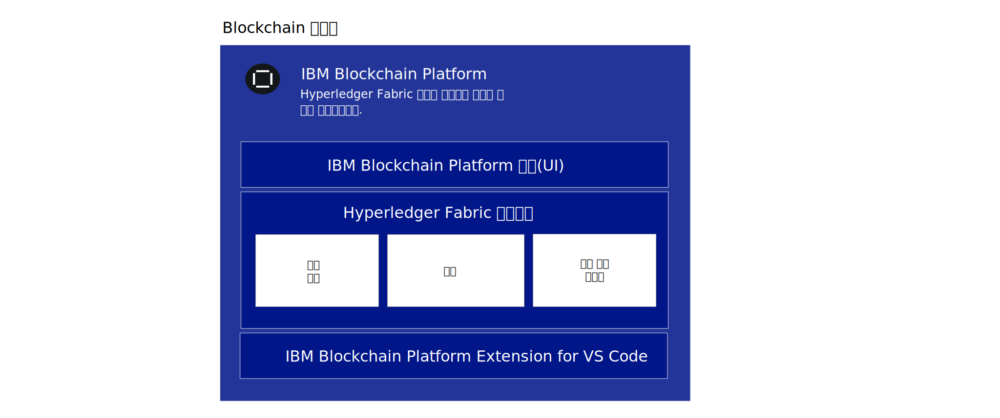
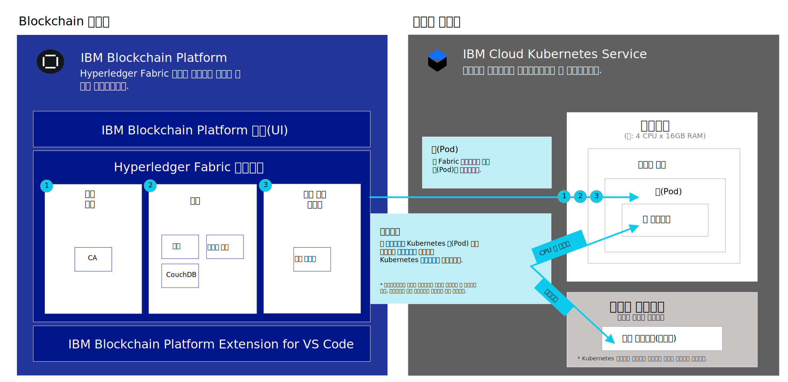

---

copyright:
  years: 2019
lastupdated: "2019-06-18"

keywords: getting started tutorials, videos, web browsers, integration

subcollection: blockchain

---

{:external: target="_blank" .external}
{:shortdesc: .shortdesc}
{:screen: .screen}
{:codeblock: .codeblock}
{:note: .note}
{:important: .important}
{:tip: .tip}
{:pre: .pre}
{:gif: data-image-type='gif'}

# {{site.data.keyword.blockchainfull_notm}} Platform for {{site.data.keyword.cloud_notm}} 시작하기
{: #ibp-v2-deploy-iks}

{{site.data.keyword.blockchainfull}} Platform for {{site.data.keyword.cloud_notm}}에는 블록체인 컴포넌트를 배치하고 관리하는 과정을 단순화하고 가속화할 수 있는 사용자 인터페이스인 {{site.data.keyword.blockchainfull_notm}} Platform 콘솔이 포함되어 있습니다. 이 튜토리얼에서는 {{site.data.keyword.blockchainfull_notm}} Platform for {{site.data.keyword.cloud_notm}}를 시작하는 방법 및 콘솔을 사용하여 {{site.data.keyword.cloud_notm}}의 {{site.data.keyword.cloud_notm}} Kubernetes Service 클러스터에 블록체인 컴포넌트를 배치하고 관리하는 방법에 대해 설명합니다. Kubernetes 및 {{site.data.keyword.cloud_notm}} Kubernetes Service에 대한 자세한 정보는 [Kubernetes](/docs/services/blockchain/reference?topic=blockchain-k8s-overview "Kubernetes")를 참조하십시오.
{:shortdesc}

**대상 독자:** 이 주제는 {{site.data.keyword.cloud_notm}}에서 Kubernetes 클러스터를 설정하고 {{site.data.keyword.blockchainfull_notm}} Platform을 배치할 책임이 있는 시스템 관리자를 위해 설계되었습니다.

{{site.data.keyword.blockchainfull_notm}} Platform을 {{site.data.keyword.cloud_notm}} Kubernetes 클러스터에 링크한 후에 콘솔을 실행하여 블록체인 컴포넌트를 작성하고 관리하며 다음과 같은 중요한 혜택을 경험할 수 있습니다.

- **제어:** 하나의 중심 콘솔에서 블록체인 컴포넌트 및 인증서를 제어 및 관리할 수 있습니다. 비즈니스에 필요한 컴포넌트만 배치하고 필요에 따라 추가하십시오.
- **유연한 Kubernetes 기반 배치:** Kubernetes 클러스터에 대한 컴퓨팅(CPU, 메모리, 스토리지) 옵션을 활용하고
기본 제공되는 HA 및 DR 옵션을 사용할 수 있습니다.

## 블록체인 서비스의 개념
{: #ibp-v2-deploy-iks-blockhain-service}

다음 다이어그램은 {{site.data.keyword.blockchainfull_notm}} Platform의 세 가지 요소를 보여줍니다.



- **{{site.data.keyword.blockchainfull_notm}} Platform 콘솔(UI)**: 블록체인 컴포넌트를 작성 및 관리할 수 있는 콘솔입니다. {{site.data.keyword.cloud_notm}}에서 서비스 인스턴스를 프로비저닝한 후에는 {{site.data.keyword.blockchainfull_notm}} 콘솔의 인스턴스를 배치하고 {{site.data.keyword.cloud_notm}} Kubernetes 클러스터에 연결할 수 있습니다. 그런 다음 콘솔을 사용하여 Kubernetes 클러스터에서 블록체인 컴포넌트를 작성 및 관리할 수 있습니다. 콘솔에 대한 비용은 없습니다.

- **Hyperledger Fabric 컴포넌트**: 이 콘솔은 Hyperledger Fabric v1.4.1 인증 기관, 피어 및 순서 지정 서비스 이미지를 기반으로 하는 블록체인 컴포넌트를 작성 및 구성하는 데 사용됩니다.  이러한 컴포넌트는 Kubernetes 클러스터에 배치되며 배치 시 `default` 스토리지 클래스를 사용하여 이 컴포넌트에 대한 스토리지가 프로비저닝됩니다.

- **{{site.data.keyword.IBM_notm}} VS Code 확장(개발 도구)**: 클라이언트 애플리케이션 및 스마트 계약의 개발, 패키징, 및 테스트를 시작하려면 VS Code 마켓플레이스에서 VS Code 확장을 다운로드하십시오.

## 고려사항
{: #ibp-v2-deploy-iks-considerations}

콘솔을 배치하기 전에 다음 고려사항을 이해해야 합니다.

- {{site.data.keyword.blockchainfull_notm}} Platform for {{site.data.keyword.cloud_notm}}는 Hyperledger Fabric v1.4.1을 사용하여 빌드됩니다.
- 콘솔 또는 API를 사용하여 배치되는 모든 피어는 CouchDB를 상태 데이터베이스로 사용합니다.
- 오퍼링을 평가하기 위해 {{site.data.keyword.blockchainfull_notm}} Platform 서비스 인스턴스를 무료 Kubernetes 클러스터에 링크하는 옵션이 있지만 용량 및 성능이 제한적이며 데이터를 마이그레이션할 수 없고 30일 후에 클러스터가 삭제됩니다.
- 베타 평가판은 무료이지만, 유료 클러스터를 선택하는 경우 Kubernetes 클러스터에 대한 비용을 지불해야 합니다.
- 사용자가 Kubernetes 클러스터의 상태 모니터링, 보안 및 로깅 관리를 책임집니다. {{site.data.keyword.cloud_notm}}에서 관리하는 항목 및 사용자의 책임에 대한 자세한 내용은 이 [정보](/docs/containers?topic=containers-responsibilities_iks#your-responsibilities-by-using-ibm-cloud-kubernetes-service){: external}를 참조하십시오.
- Kubernetes 대시보드를 사용하여 Kubernetes 클러스터의 자원 사용량을 모니터링할 책임도 있습니다. 스토리지 용량 또는 클러스터의 성능을 개선해야 하는 경우 [기존 볼륨 수정](/docs/containers?topic=containers-file_storage#change_storage_configuration){: external} 방법에 대한 정보를 참조하십시오.
- 인증서 및 개인 키에 대한 관리와 보안은 사용자의 책임입니다. {{site.data.keyword.IBM_notm}}은 사용자의 인증서를 Kubernetes 클러스터에 저장하지 않습니다.
- {{site.data.keyword.blockchainfull_notm}} Platform은 특정 지역에서만 사용할 수 있습니다. 업데이트된 목록은 [{{site.data.keyword.blockchainfull_notm}} Platform 위치](/docs/services/blockchain/howto?topic=blockchain-ibp-regions-locations)에 대한 주제를 참조하십시오.
- {{site.data.keyword.blockchainfull_notm}} Platform은 {{site.data.keyword.IBM_notm}} Kubernetes 서비스를 사용하여 작성된 OpenShift 클러스터에 배치할 수 없습니다. 
- Kubernetes는 {{site.data.keyword.cloud_notm}} Kubernetes 클러스터 내에서 버전 1.11 또는 그 이상의 안정적인 버전이어야 합니다. 이러한 지시사항에 따라 [신규 및 기존 클러스터를 해당 버전으로 업그레이드](/docs/services/blockchain/howto?topic=blockchain-ibp-v2-deploy-iks#ibp-v2-deploy-iks-updating-kubernetes)하십시오.
- {{site.data.keyword.cloud_notm}}에서 Kubernetes 클러스터를 프로비저닝할 때 사전 선택되는 기본 Bronze File 스토리지를 사용하지 않으려는 경우 원하는 스토리지를 프로비저닝할 수 있습니다. 자세히 알아보려면 [지속적 스토리지 고려사항](/docs/services/blockchain?topic=blockchain-ibp-v2-deploy-iks#ibp-console-storage)에 대한 주제를 참조하십시오.
- {{site.data.keyword.cloud_notm}} 다중 구역 지원을 Kubernetes 클러스터에 포함시키려는 경우 사용자 고유의 스토리지를 프로비저닝해야 합니다. 자세한 내용은 [{{site.data.keyword.blockchainfull_notm}} Platform에서 다중 구역(MZR) 클러스터 사용](/docs/services/blockchain?topic=blockchain-ibp-v2-deploy-iks#ibp-console-mzr)을 참조하십시오.

## 동영상 튜토리얼
{: #ibp-v2-deploy-video}

{{site.data.keyword.blockchainfull_notm}} Platform 콘솔과 {{site.data.keyword.blockchainfull_notm}} Platform for {{site.data.keyword.cloud_notm}} 배치를 시작하는 방법에 대해 자세히 알아보려면 다음 [동영상 시리즈]( http://ibm.biz/BlockchainPlatformSeries)를 시청하십시오.

## 시작하기 전에
{: #ibp-v2-deploy-iks-prereq}

시작하기 전에:

- [{{site.data.keyword.cloud_notm}}유료 계정](https://cloud.ibm.com/catalog/services/blockchain){: external}이 있는지 확인하십시오. 계정이 없는 경우 다음을 수행하십시오.
   1. **가입** 단추를 클릭하십시오.
   2. 무료 평가판 계정을 작성한 후 {{site.data.keyword.cloud_notm}} 콘솔에서 **관리** > **청구 및 사용량** > **청구**로 이동하고 **신용카드 추가**를 클릭하여 **종량과금제** 유형으로 업그레이드하십시오.
   3. Kubernetes 클러스터에서 사용자의 역할이 관리자(Administrator) 및 관리자(Manager)인지 확인하십시오. 이 역할은 블록체인 서비스 인스턴스에 연결됩니다. 자세한 정보는 [Kubernetes 액세스 역할을 지정하는 방법](#ibp-v2-deploy-iks-k8x-access-roles)의 단계를 참조하십시오.

광범위한 조직 범위의 솔루션의 컨텍스트에서 서비스 인스턴스를 사용하려는 경우,
참여하는 조직이 기능적 이메일 주소를 사용하여 해당 네트워크를 작성하는 것이 좋습니다. 이 경우, 네트워크에 대한 액세스는 단일 개인의 가용성에 의존하지 않습니다.
{:tip}  

- 기존 {{site.data.keyword.cloud_notm}} Kubernetes Service 클러스터를 사용하려는 경우,
Kubernetes 버전을 확인하고 필요에 따라 1.11 이상으로 업그레이드하십시오. 클러스터가 실행 중인
Kubernetes 버전을 확인하고 버전을 업그레이드하는 방법에 대한 자세한 정보는
[클러스터의 Kubernetes 버전 업데이트](/docs/services/blockchain/howto?topic=blockchain-ibp-v2-deploy-iks#ibp-v2-deploy-iks-updating-kubernetes)를 참조하십시오.

### 브라우저
{: #ibp-v2-deploy-iks-browsers}
다음 목록은 {{site.data.keyword.blockchainfull_notm}} Platform 콘솔에 대한 최소한의 필수 브라우저 소프트웨어를 지정합니다.

- Chrome: 운영 체제용 최신 버전
- Firefox: 운영 체제용 최신 일반(ESR 외) 버전
- Safari: Mac용 최신 버전
- Edge: v44.17763.1.0 이상

### 필수 리소스
{: #ibp-v2-deploy-iks-resources-required}

#### 클러스터 크기 권장사항
{: #ibp-v2-deploy-iks-resources-required-free}

 {{site.data.keyword.blockchainfull_notm}} Platform 콘솔을 {{site.data.keyword.cloud_notm}} Kubernetes Service 클러스터에 연결하는 경우 Kubernetes 클러스터가 최소 하드웨어 리소스 요구사항을 충족하는지 확인하십시오.

|Kubernetes 클러스터 유형 | 유스 케이스 | CPU | RAM | 작업자 노드 |
|-----------|------|-----|-----------------------|
| 표준(권장됨) | MVP에 적합 | 4(공유됨) | 16GB(공유됨)|다중|
| 무료** | 평가에 적합 |2 | 4GB |   1 |  
** {{site.data.keyword.blockchainfull_notm}} Platform 서비스 인스턴스를 {{site.data.keyword.cloud_notm}} Kubernetes 무료 클러스터에 링크하는 경우 30일 동안 무료로 {{site.data.keyword.blockchainfull_notm}} Platform을 미리 사용합니다. 성능은 처리량, 스토리지 및 기능에 따라 제한됩니다. {{site.data.keyword.cloud_notm}}가 30일 후에 Kubernetes 클러스터를 삭제하며 노드 또는 데이터를 무료 클러스터에서 유료 클러스터로 마이그레이션할 수 없습니다.

이러한 리소스는 테스트 및 실험을 수행하는 데 충분합니다. 두 개의 피어, 두 개의 CA 및 순서 지정 서비스를 작성하는 [네트워크 빌드 튜토리얼](/docs/services/blockchain/howto?topic=blockchain-ibp-console-build-network#ibp-console-build-network)은 약 4.85 CPU를 사용하는데, 5개 노드 순서 지정 서비스가 그 중 2.25 CPU를 사용합니다. 따라서 5개 노드 순서 지정 서비스를 배치하려는 경우에는 해당 순서 지정 서비스가 적합하지 않으므로 2 CPU 단일 작업 노드가 있는 Kubernetes 클러스터를 이 서비스에 배치하면 안됩니다. 최소 4 CPU 노드가 있는 클러스터를 사용하는 것이 좋습니다. 추가하는 작업자 노드가 많을수록 클러스터가 더 쉽게 배치를 처리할 수 있습니다.
{:note}

#### 유료 클러스터
{: #ibp-v2-deploy-iks-resources-required-paid}

{{site.data.keyword.blockchainfull_notm}} Platform의 프로덕션 레벨 배치는 {{site.data.keyword.cloud_notm}} Kubernetes Service의 유료 클러스터에 배치됩니다. 이 클러스터의 크기 및 구성은 특정 유스 케이스의 요구사항에 따라 달라집니다. 대형 배치는 반드시 대형 클러스터에 배치되어야 합니다. 클러스터가 예상된 배치보다 얼마나 더 큰지는 사용자에게 달려있습니다. 노드의 크기를 조정하기 **전에** Kubernetes 클러스터에 추가 리소스를 배치하지 않고도 피어 및 순서 지정 서비스는 추가 채널에 포함되고 더 많은 처리량을 처리할 수 있으므로 최소 몇 개의 헤드룸을 보유하고 있는 것이 좋습니다. 이 값을 조정하는 방법에 대한 자세한 정보는 [리소스 재할당](/docs/services/blockchain/howto?topic=blockchain-ibp-console-govern#ibp-console-govern-reallocate-resources)을 참조하십시오.

{{site.data.keyword.blockchainfull_notm}} Platform을 배치하려면 Kubernetes 유형의 클러스터를 작성해야 합니다. {{site.data.keyword.blockchainfull_notm}} Platform은 {{site.data.keyword.IBM_notm}} Kubernetes 서비스를 사용하여 작성된 OpenShift 클러스터를 지원하지 않습니다.
{:important}

확장 가능한 충분한 크기로 초기 배치를 작성하는 것은 [{{site.data.keyword.cloud_notm}} Kubernetes Service Autoscaler](/docs/containers?topic=containers-ca#ca){: external}를 사용하지 않는 사용자에게 특히 중요한데, 이 경우 사용자에 대한 노드 및 팟(Pod)을 추가로 배치해야 할 수 있습니다.

{{site.data.keyword.cloud_notm}} Kubernetes Service에 충분한 리소스를 배치하는 것이 더 쉽고 먼저 Kubernetes 클러스터 배치를 늘리지 않고도 원하는 대로 팟(Pod) 및 작업자 노드를 확장할 수 있지만, Kubernetes 클러스터의 배치가 늘어나면 비용도 증가합니다. 사용자는 이 옵션을 신중하게 고려하고 사용자가 선택하는 옵션에 관계 없이 절충안을 알고 있어야 합니다.

클러스터에 필요한 스토리지 및 컴퓨팅의 양은 이 차트를 참조하십시오. 여기에는 피어, 순서 지정 노드 및 CA에 대한 현재 기본값이 포함되어 있습니다.

| **컴포넌트**(모든 컨테이너) | CPU  | 메모리(GB) | 스토리지(GB) |
|--------------------------------|---------------|-----------------------|------------------------|
| **피어**                       | 1.2            | 2.4                  | 200(피어용 100GB 및 CouchDB용 100GB 포함)|
| **CA**                         | 0.1            | 0.2                  | 20                     |
| **순서 지정 노드**              | 0.45           | 0.9                  | 100                    |

5개 노드 Raft 순서 지정 서비스를 배치하려는 경우 순서 지정 노드 배치가 5배 증가합니다. 따라서 5개 Raft 노드에는 총 2.25CPU, 4.5GB의 메모리, 500GB의 스토리지가 있습니다. 즉, 5개 노드 순서 지정 서비스가 2 CPU Kubernetes 단일 작업자 노드보다 큽니다.
{:tip}

## 1단계: {{site.data.keyword.cloud_notm}}에서 서비스 인스턴스 작성
{: #ibp-v2-deploy-iks-create-service-instance}

{{site.data.keyword.blockchainfull_notm}} Platform for {{site.data.keyword.cloud_notm}}의 서비스 인스턴스를 작성하려면
다음 단계를 수행하십시오.

1. {{site.data.keyword.cloud_notm}} 카탈로그에서 [블록체인 서비스](https://cloud.ibm.com/catalog/services/blockchain){: external}를 찾거나, {{site.data.keyword.cloud_notm}} 카탈로그 페이지에서 `Blockchain`을 검색하십시오.
2. 나중에 쉽게 인식할 수 있도록 사용자의 인스턴스에 대한 **서비스 이름**을 바꾸는 것이 좋습니다.
3. 베타의 경우, **댈러스**가 유일하게 사용 가능한 지역이며 이는 변경할 수 없습니다. 추가 지역은 유료 클러스터에서 선택할 수 있습니다. 자세한 정보는 [지역](/docs/services/blockchain/reference?topic=blockchain-ibp-regions-locations#ibp-regions-locations)을 참조하십시오.
4. 리소스 그룹 및 태그 필드를 변경되지 않은 상태로 둘 수 있습니다.
5. **표준** 플랜을 선택하십시오.
6. **작성**을 클릭하여 서비스 인스턴스를 프로비저닝하십시오.

## 2단계: {{site.data.keyword.blockchainfull_notm}} Platform 배치
{: #ibp-v2-deploy-iks-steps}

서비스 인스턴스를 작성한 직후 지침에 따라 {{site.data.keyword.blockchainfull_notm}} Platform을 배치할 수 있습니다.

1. **시작 및 필수 소프트웨어** 단계. **댈러스** 지역에 기존 {{site.data.keyword.IBM_notm}} Kubernetes Service 클러스터가 있어서 이 클러스터를 블록체인 서비스에 사용하려면 해당 선택란을 선택하십시오. **기존 클러스터를 사용하는 경우 다음 단계를 건너뛰어도 됩니다. 단, Kubernetes 버전이 v1.11 또는 그 이상의 안정적인 버전이어야 합니다**. **계속**을 클릭하십시오.
2. **클러스터 작성** 단계. 1단계에서 선택란을 선택하여 기존 Kubernetes 클러스터를 사용하는 경우 이 단계를 건너뜁니다. 그렇지 않으면
**새 클러스터 작성**을
클릭하여 {{site.data.keyword.cloud_notm}} Kubernetes 대시보드를 시작하여 클러스터를 작성하십시오. 자세한 정보는 [{{site.data.keyword.cloud_notm}} Kubernetes Service 시작하기](/docs/containers?topic=containers-getting-started){: external}를 참조하십시오. 이 프로세스가 완료될 때까지 추가 시간이 필요할 수 있습니다.
  - 클러스터 위치 정보는 [지역](/docs/services/blockchain/reference?topic=blockchain-ibp-regions-locations#ibp-regions-locations)을 참조하십시오.
  - **표준 클러스터(권장됨)** 선택: 고가용성을 위한 다중 노드를 포함하는 장기 옵션이 필요한 경우입니다. 클러스터 유형의 경우 **Kubernetes**를 선택하십시오. **최소 v.1.11 또는 그 이상의 안정적인 버전을 선택하십시오.** 유료 클러스터를 배치하려면 [표준 클러스터 작성](/docs/containers?topic=containers-clusters#clusters_ui_standard){: external}을 참조하십시오. 고가용성 또는 재해 복구를 원하는 경우 사용 중인 스토리지 클래스를 결정해야 합니다. 클러스터의 `default` 스토리지 클래스는 동적 프로비저닝에서 사용합니다. 그러므로 고객은 모든 스토리지 클래스를 기본값으로 설정할 수 있습니다. 자세한 정보는 [파일 스토리지 구성에 대한 의사결정](/docs/containers?topic=containers-file_storage#file_predefined_storageclass){: external}을 참조하십시오.
  - **무료 클러스터** 선택: 30일 미만 동안 플랫폼을 미리 사용하려는 경우에 해당됩니다. 무료 클러스터에서
유료 클러스터로 마이그레이션할 수 없음에 **유의**하십시오. 무료 유형의 클러스터는
제한된 스토리지 및 트랜잭션 처리량을 제공합니다. Kubernetes 클러스터가 만료될 때 수행할 작업에 대한 지시사항은 [Kubernetes 클러스터 만기](/docs/services/blockchain/howto?topic=blockchain-ibp-console-manage-console#ibp-console-manage-console-cluster-expiration)를 참조하십시오.
  - {{site.data.keyword.cloud_notm}}의 무료 및 유료 Kubernetes 클러스터 간 차이점에 대한 자세한 정보는 [무료 및 표준 클러스터 비교](/docs/containers?topic=containers-cluster_types#cluster_types){: external}를 참조하십시오.  

   {{site.data.keyword.blockchainfull_notm}} Platform 배치 프로세스를 완료할 수 있도록 클러스터를 작성한 후에 브라우저에서 이 탭으로 돌아와야 합니다.  
   {:important}  

  클러스터가 배치될 때까지 대기해야 합니다. 그런 다음 **클러스터가 있음** 단추를 클릭하십시오.
3. 클러스터에서 실행 중인 Kubernetes 버전이 1.11 이상이어야 합니다. 다음 [단계](/docs/services/blockchain/howto?topic=blockchain-ibp-v2-deploy-iks#ibp-v2-deploy-iks-updating-kubernetes)에
따라 클러스터 버전을 확인하고 필요한 경우 업그레이드하십시오. 그런 다음 다시 돌아와 지시사항을 진행하십시오.
4. **클러스터에 배치** 단계. 드롭 다운 목록에서 {{site.data.keyword.blockchainfull_notm}} Platform을 배치할 Kubernetes 클러스터를 선택하고 **클러스터에 배치**를 클릭하십시오.  

  드롭 다운 목록에 Kubernetes 클러스터가 보이지 않는 경우 다음 조건이 원인일 수 있습니다.
  - 클러스터 작성 프로세스를 완료하는 데 최대 60분이 소요될 수 있습니다. 클러스터를 작성한 경우, 클러스터 상태가 **정상**이 될 때까지 추가 시간이 필요할 수 있습니다.
  - **댈러스** 지역 외부의 클러스터는 보이지 않으며 사용할 수 없습니다.
  - Firefox의 ESR 버전을 사용하고 있지 않은지 확인하십시오. 사용 중인 경우, Chrome과 같은 다른 브라우저로 전환한 후 다시 시도하십시오.

5. **콘솔 실행** 단계. {{site.data.keyword.blockchainfull_notm}} Platform이 배치된 후 **{{site.data.keyword.blockchainfull_notm}} Platform 실행**을 클릭하여 {{site.data.keyword.blockchainfull_notm}} Platform 콘솔을 여십시오. 콘솔이 프로비저닝되는 동안 단추가 활성화되는 데 몇 분 정도 걸릴 수 있습니다.

다음 그림은 {{site.data.keyword.blockchainfull_notm}} Platform 컴포넌트가 Kubernetes 클러스터에 배치되는 방식을 보여줍니다.



- **팟(Pod)**: 인증 기관, 피어 또는 순서 지정 서비스가 각각 배치되면 새 팟(Pod)이 클러스터의 작업자 노드에 작성됩니다.
- **앱 컨테이너**: 배치된 각 노드의 팟(Pod) 내에 컨테이너가 작성됩니다.  
- **지속적 스토리지**: 노드가 배치될 때마다 각 노드에 대한 스토리지가 Kubernetes 클러스터 `default` 스토리지 클래스에서 동적으로 프로비저닝됩니다.

## (선택사항) 콘솔에 추가 사용자 추가
{: #ibp-v2-deploy-iks-add-users}

기본적으로 콘솔에서는 [{{site.data.keyword.cloud_notm}} IAM(Identity and Access Management)](/docs/iam?topic=iam-iamoverview#iamoverview){: external}이 {{site.data.keyword.cloud_notm}} ID 서비스 제공자로 사용됩니다. {{site.data.keyword.blockchainfull_notm}} Platform 콘솔은
콘솔의 관리자인 {{site.data.keyword.IBM_notm}} 소유자의 이메일 주소를 구성하여
프로비저닝됩니다. 이 사용자는 관리자로서 다른 사용자에게 이메일 주소를 통해 콘솔에 대한 액세스 권한을 부여할 수 있는 권한이 부여됩니다.  [콘솔에서 사용자 추가 및 제거](/docs/services/blockchain?topic=blockchain-ibp-console-manage-console#ibp-console-manage-console-add-remove)에 대한 방법에 대한 자세한 정보는 이 지시사항을 참조하십시오.

## 다음 단계
{: #ibp-v2-deploy-iks-next-steps}

- 노드를 작성하기 전에 Kubernetes 클러스터의 스토리지 플러그인을 결정해야 합니다. 시험삼아 시작해 보려는 경우에는 클러스터를 프로비저닝할 때 사전 선택되는 기본 Bronze File 스토리지가 적합합니다. 현재는 추가 조치가 필요하지 않습니다.  그러나 정식 테스트 또는 프로덕션 용도로 클러스터를 배치할 준비가 된 경우에는 필요에 맞는 적합한 스토리지 플러그인을 결정해야 합니다. 시작하려면 [지속적 스토리지 고려사항](#ibp-console-storage)에 대한 주제를 참조하십시오.

- 이제 콘솔을 사용할 준비가 되었으므로 [네트워크 빌드 튜토리얼](/docs/services/blockchain/howto?topic=blockchain-ibp-console-build-network#ibp-console-build-network)로 진행할 수 있습니다.
필요한 경우 나중에 돌아올 수 있도록 콘솔의 URL에 책갈피를 지정하십시오. 그렇지 않으면 [설치 후 작업 지시사항](#ibp-v2-deploy-iks-post-install)의 단계에 따라 브라우저에서 되돌아갈 수 있습니다.

## {{site.data.keyword.cloud_notm}} 및 기타 서드파티 서비스와의 통합
{: #ibp-v2-deploy-iks-integrations}

{{site.data.keyword.blockchainfull_notm}} Platform은 {{site.data.keyword.cloud_notm}} 카탈로그에 제공된 서비스 제품군을 활용하여 사용자에게 보다 많은 가시성을 제공하거나 다른 서비스와 통합합니다. 

  

**액세스 제어**  
- [{{site.data.keyword.cloud_notm}} IAM(Identity and Access Management)](/docs/services/Log-Analysis-with-LogDNA?topic=LogDNA-iam)을 사용하여 사용자를 안전하게 인증하고 모든 클라우드 리소스에 대한 액세스를 제어하십시오.

**모니터링**  
- [{{site.data.keyword.cloud_notm}} Activity Tracker with LogDNA](/docs/services/Log-Analysis-with-LogDNA?topic=LogDNA-getting-started#getting-started) 서비스를 사용하여 실시간으로 로그 문제를 해결하고 문제를 진단하고 Kubernetes 클러스터에서 문제점을 식별하십시오. 

- [{{site.data.keyword.cloud_notm}} Activity Tracker with SysDig](/docs/services/Monitoring-with-Sysdig?topic=Sysdig-getting-started#getting-started)를 사용하여 IBM Cloud에서 서비스 및 애플리케이션의 활동과 상태를 모니터링하십시오.

- [LogDNA 및 Sysdig로 로그를 분석하고 애플리케이션 상태를 모니터](/docs/tutorials?topic=solution-tutorials-application-log-analysis)하는 방법에 대해 이 튜토리얼을 참조하십시오.

**스토리지**  
- 블록체인 노드가 프로비저닝될 때 {{site.data.keyword.cloud_notm}} [파일 스토리지](/docs/infrastructure/FileStorage?topic=FileStorage-about#getting-started-with-file-storage) 및 [Block Storage](/docs/infrastructure/BlockStorage?topic=BlockStorage-About#getting-started-with-block-storage)를 활용하십시오. 블록체인이 {{site.data.keyword.cloud_notm}} 스토리지 옵션과 통합하는 방법에 대해 자세히 알아보려면 [지속적 스토리지 고려사항](#ibp-console-storage)의 이 주제를 참조하십시오. 

- [Portworx](/docs/containers?topic=containers-portworx#portworx)를 설정하여 컨테이너화된 데이터베이스 간에 로컬 지속적 스토리지를 관리하거나 다중 구역에 대해 로컬 간에 데이터를 공유하십시오. 

사용 가능한 {{site.data.keyword.cloud_notm}} 서비스 및 다른 서드파티 통합에 대한 자세한 정보는 [지원되는 {{site.data.keyword.cloud_notm}} 및 서드파티 통합](/docs/containers?topic=containers-supported_integrations#supported_integrations){: external}의 이 목록을 참조하십시오.

## 클러스터의 Kubernetes 버전 업데이트
{: #ibp-v2-deploy-iks-updating-kubernetes}

기존 {{site.data.keyword.cloud_notm}} Kubernetes Service 클러스터를 사용하는 경우,
Kubernetes 버전이 1.11 이상인지 확인하십시오.

클러스터의 Kubernetes 버전은 {{site.data.keyword.cloud_notm}}의 [Kubernetes 클러스터 페이지](https://cloud.ibm.com/kubernetes/clusters){: external}에서 확인할 수 있습니다. 이 페이지에는 모든 클러스터가 표에 나열되어 있습니다.

Kubernetes 버전이 1.11 이상이 아닌 경우, 다음 단계를 완료하여 클러스터의 Kubernetes 버전을 업데이트해야 합니다.

1. 행의 끝에 있는 오버플로우 메뉴 아이콘을 클릭하고 **버전 업데이트**를 선택하십시오. 이 프로세스를 완료하는 데 약 한 시간이
소요됩니다. 버전이 업데이트되면 **Kubernetes 버전** 열에서 클러스터의 업데이트된 버전을 볼 수 있습니다.  
2. Kubernetes 버전 드롭 다운 목록에서 Kubernetes 버전 v1.11 이상을 선택하고 **업데이트**를 클릭하십시오.
3. 클러스터를 클릭하고 **작업자 노드** 탭으로 이동하십시오. 업데이트할 작업 노드 앞에 있는 선택란을 선택하고
팝업 메뉴 막대에서 **Kubernetes 업데이트**를 클릭하십시오. 클러스터에 여러 개의 작업 노드가 있는 경우 모든 노드를 업데이트해야 합니다.

  작업자 노드를 업데이트하면 앱 및 서비스에 중단 시간이 발생할 수 있습니다. 작업자 노드가 다시 이미징되고 [팟(Pod) 외부에 저장](/docs/containers?topic=containers-storage_planning#persistent_storage_overview){: external}되지 않은 경우 데이터가 삭제됩니다.
  {:important}

{: gif}

{{site.data.keyword.IBM_notm}} Kubernetes Service 클러스터 및 작업 노드의 Kubernetes 버전 업데이트에 대한 자세한 정보는 [클러스터, 작업자 노드 및 추가 기능 업데이트](/docs/containers?topic=containers-update#update){: external}를 참조하십시오.  

[{{site.data.keyword.blockchainfull_notm}} Platform 배치를 재개](/docs/services/blockchain/howto?topic=blockchain-ibp-v2-deploy-iks#ibp-v2-deploy-iks-steps)하려면 업데이트가 완료될 때까지 대기해야 합니다. 

## Kubernetes 액세스 역할을 지정하는 방법
{: #ibp-v2-deploy-iks-k8x-access-roles}

Kubernetes에서 블록체인 서비스 인스턴스를 Kubernetes 클러스터에 연결하는 사용자의 역할은 관리자(Administrator) 및 관리자(Manager)여야 합니다.
이 액세스를 구성하려면 다음 단계를 완료해야 합니다.
   1. {{site.data.keyword.cloud_notm}} 대시보드에서 **관리** 드롭 다운 목록을 클릭한 후 **액세스(IAM)**를 클릭하십시오.
   2. 왼쪽 탐색 메뉴에서 **사용자**를 클릭하고 서비스 인스턴스를 Kubernetes 클러스터에 링크하는 사용자의 ID를 클릭하십시오.
   3. **액세스 정책**을 클릭한 후 **액세스 권한 지정**을 클릭하십시오.
   4. 타일 **리소스에 대한 액세스 권한 지정**을 클릭하십시오.
   5. **서비스** 드롭 다운 목록에서 **Kubernetes Service**를 선택하십시오.
   6. 이 사용자에게 적합한 **관리자(Administrator)** 및 **관리자(Manager)** 역할을 확인하십시오.
   7. **지정**을 클릭하십시오.

{: gif}

Kubernetes 액세스 제어에 대한 자세한 정보는 [사용자에게 적합한 올바른 액세스 정책 및 역할을 선택하는 방법](/docs/containers?topic=containers-users#access_roles)을 참조하십시오.

## 설치 후 작업 지시사항
{: #ibp-v2-deploy-iks-post-install}

콘솔을 배치한 후에는 **{{site.data.keyword.blockchainfull_notm}} Platform 실행** 단추를 클릭하여 브라우저에서 콘솔을 열 수 있습니다. 콘솔 URL을 브라우저에 책갈피로 추가할 수 있습니다.

### {{site.data.keyword.cloud_notm}}에서 콘솔로 돌아가기
{: #ibp-v2-deploy-iks-rtn-to-console}

콘솔 URL이 없는 경우 {{site.data.keyword.cloud_notm}} 대시보드에서 찾을 수 있습니다.

1. 브라우저에서 [{{site.data.keyword.cloud_notm}} 리소스 목록](https://cloud.ibm.com/resources){: external}을 여십시오. {{site.data.keyword.IBM_notm}} ID로 로그인해야 합니다.
2. {{site.data.keyword.blockchainfull_notm}} Platform 서비스 인스턴스가 **서비스** 트위스티 아래에 표시됩니다. 사용자가 배치한 {{site.data.keyword.blockchainfull_notm}} Platform 서비스 인스턴스를 찾아서 클릭하십시오.
3. 후속 패널의 왼쪽 탐색 메뉴에서 **관리**를 클릭한 후 **{{site.data.keyword.blockchainfull_notm}} Platform 실행**을 클릭하십시오.

브라우저에서 콘솔이 열립니다.

## 지속적 스토리지 고려사항
{: #ibp-console-storage}

{{site.data.keyword.blockchainfull_notm}} Platform에는 CA, 피어 및 순서 지정 노드별 지속적 스토리지가 필요합니다. 표준 Kubernetes 클러스터를 {{site.data.keyword.cloud_notm}}에 배치하면 [Bronze 레벨 파일 스토리지](/docs/containers?topic=containers-file_storage#file_predefined_storageclass){: external} 플러그인을 `default` 스토리지 클래스로 사용하도록 사전 구성됩니다. 그런 다음 콘솔 또는 API를 사용하여 블록체인 노드를 해당 클러스터에 배치하면 노드 배치 시 요청된 스토리지의 양을 기준으로 노드에 대해 파일 스토리지 양이 동적으로 프로비저닝됩니다. 따라서 배치는 `default` 스토리지 클래스를 사용하여 스토리지를 클러스터에 프로비저닝합니다. 여러 [Kubernetes 스토리지 옵션](/docs/containers?topic=containers-storage_planning#persistent_storage_overview){: external} 중에서 선택하여 사용자의 유스 케이스에 가장 적합한 스토리지 유형을 결정할 수 있습니다. 스토리지 사용량에 대해서는 별도로 청구되므로, 선택할 때 다양한 스토리지 옵션의 비용을 고려할 수 있습니다.

사용자 고유의 스토리지 플러그인을 추가하려면 사용자 정의된 스토리지 클래스를 작성해야 합니다. 솔루션에 대한 [스토리지 클래스 추가](/docs/containers?topic=containers-kube_concepts#storageclasses){: external} 방법을 참조하십시오. {{site.data.keyword.blockchainfull_notm}} Platform은 `default` 스토리지 클래스로 [동적 볼륨 프로비저닝](/docs/containers?topic=containers-kube_concepts#dynamic_provisioning){: external}을 사용하므로, 다음 명령을 실행하여 자신의 스토리지 플러그인을 사용하도록 기본 스토리지 클래스를 변경해야 합니다.

```
kubectl patch storageclass <storageclass> -p '{"metadata": {"annotations":{"storageclass.kubernetes.io/is-default-class":"true"}}}'
```
{:codeblock}

``<storageclass>``를 사용자의 스토리지 클래스 이름으로 바꾸십시오.

블록체인 노드를 클러스터에 배치한 후에는 Kubernetes 클러스터의 기본 스토리지 클래스를 변경하면 안됩니다. 변경할 경우 이미 배치된 CA, 피어 및 순서 지정 노드에 대한 스토리지가 유실됩니다. 따라서 블록체인 노드를 배치하기 전에 스토리지 플러그인을 결정해야 합니다.
{: important}

### {{site.data.keyword.blockchainfull_notm}} Platform에서 다중 구역(MZR) 클러스터 사용
{: #ibp-console-mzr}

제공되는 지역에서 [다중 구역 지원](/docs/containers?topic=containers-regions-and-zones#regions_multizone){: external}은 {{site.data.keyword.cloud_notm}}에서 표준 Kubernetes 클러스터를 작성할 때 기본적으로 사전 선택됩니다. 반드시 그런 것은 아니지만, 이 기능은 하나의 구역 또는 데이터 센터가 작동 중지된 경우 노드 고가용성을 위해 제공됩니다. 클러스터가 다중 구역 지원을 포함하는 경우에는 사용자 고유의 스토리지 솔루션을 가져와야 합니다. 여러 [지속적 스토리지 옵션](/docs/containers?topic=containers-storage_planning#persistent_storage_overview){: external} 중에서 선택할 수 있습니다.

스토리지 클래스를 작성한 후에는 위의 `kubectl patch storageclass` 명령을 실행하여 다중 구역 지역의 스토리지 클래스를 `default` 스토리지 클래스로 설정하십시오.

### 가격 및 청구 정보
{: #ibp-v2-deploy-iks-pricing-billing}

- {{site.data.keyword.blockchainfull_notm}} Platform 가격 정보를 다시 방문해야 하는 경우 [가격](/docs/services/blockchain/howto?topic=blockchain-ibp-saas-pricing)을 참조하십시오.
- 현재 {{site.data.keyword.cloud_notm}} 사용량 정보는 {{site.data.keyword.cloud_notm}} 대시보드의 [사용량 타일](https://cloud.ibm.com/billing/){: external}에 제공되고, 청구서는 [청구 정보](https://cloud.ibm.com/billing/billing-items){: external} 아래에 표시됩니다. {{site.data.keyword.blockchainfull_notm}} Platform 청구 작동 방법에 대한 세부사항은 [청구](/docs/services/blockchain/howto?topic=blockchain-ibp-saas-pricing#ibp-saas-pricing-billing)에서 이 주제를 참조하십시오.

### 서비스 인스턴스 삭제
{: #ibp-v2-deploy-iks-delete-service-instance}

서비스 인스턴스가 더 이상 필요하지 않을 경우 Kubernetes 클러스터에서 해당 인스턴스를 삭제하여 리소스를 해제할 수 있습니다. {{site.data.keyword.cloud_notm}} 대시보드를 사용하여 {{site.data.keyword.blockchainfull_notm}} Platform 서비스 인스턴스를 삭제할 수 있습니다.

1. 브라우저에서 [{{site.data.keyword.cloud_notm}} 리소스 목록](https://cloud.ibm.com/resources){: external}을 여십시오. {{site.data.keyword.IBM_notm}} ID로 로그인해야 합니다.
2. **서비스** 트위스티 아래에서 삭제하려는 서비스 인스턴스를 찾고 조치 메뉴에서 **삭제**를 클릭하십시오.

**이 옵션은 신중하게 선택하십시오.** 서비스 인스턴스를 삭제하면 각 노드와 연관된 스토리지가 삭제되며 복원할 수 없습니다. 모든 원장 데이터가 삭제됩니다.
{: important}

서비스 인스턴스 삭제에 실패한다면 Kubernetes 클러스터에 액세스할 수 없기 때문일 수 있습니다. 이 경우 서비스 인스턴스 삭제를 요청하려면 [지원 티켓](/docs/services/blockchain?topic=blockchain-blockchain-support#blockchain-support-cases)을 여십시오.
