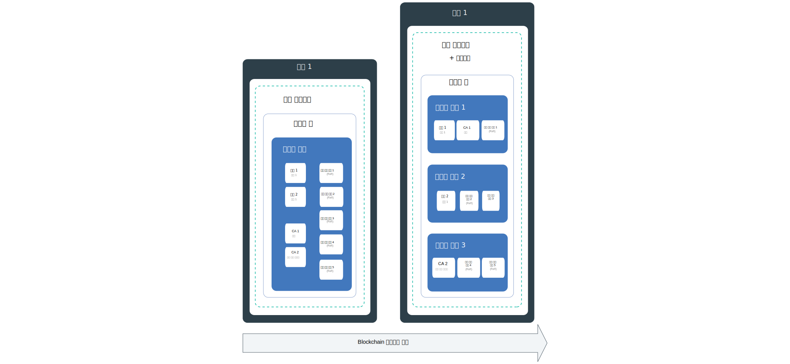
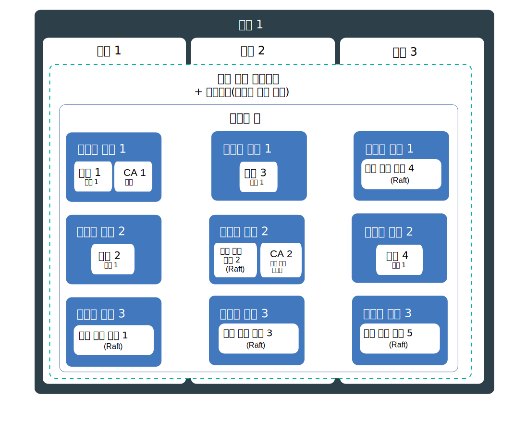
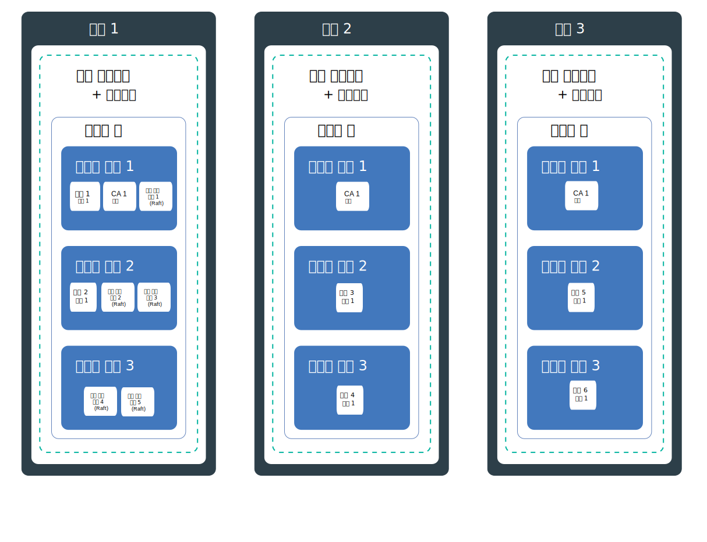

---

copyright:
  years: 2019
lastupdated: "2019-06-21"

keywords: high availability, HA, IBM Cloud, failures, zone failure, region failure, component failure, worker node failure

subcollection: blockchain

---

{:external: target="_blank" .external}
{:shortdesc: .shortdesc}
{:screen: .screen}
{:codeblock: .codeblock}
{:note: .note}
{:important: .important}
{:tip: .tip}
{:pre: .pre}

# 고가용성(HA)
{: #ibp-console-ha}

클러스터에서 실패가 발생하면 블록체인 네트워크를 더욱 사용 가능하게 만들고 네트워크가 중단되지 않도록 기본 제공 Kubernetes 기능을 {{site.data.keyword.blockchainfull}} Platform 컴포넌트 배치 전략과 함께 사용하십시오.
{:shortdesc}

**대상 독자:** 이 주제는 {{site.data.keyword.cloud_notm}} 또는 {{site.data.keyword.cloud_notm}} Private에서 {{site.data.keyword.blockchainfull_notm}}의 계획 및 구성을 담당하는 시스템 관리자 및 설계자를 위해 설계되었습니다. 

고가용성은 부분 또는 전체 실패 후에도 앱이 켜져 있고 실행되도록 하기 위한 IT 인프라의 핵심 규칙입니다. 고가용성의 주요 목적은 IT 인프라의 잠재적 실패 지점을 없애는 것입니다. 예를 들어, 중복성을 추가하고 장애 복구 메커니즘을 설정하여 시스템 하나의 실패에 대비할 수 있습니다. 

IT 인프라의 다른 레벨에서 그리고 클러스터의 다른 계층 내에서 고가용성을 달성할 수 있습니다. 사용자에게 적합한 가용성 레벨은 비즈니스 요구사항, 조직과 함께 보유한 서비스 레벨 계약 및 중복성 비용과 같은 여러 요소에 따라 다릅니다.

계속하기 전에 HA에 대해 플랫폼별 지침을 검토하는 것이 좋습니다. 
- {{site.data.keyword.cloud_notm}} 사용 시에는 HA가 Kubernetes로 {{site.data.keyword.cloud_notm}}에서 작동하는 방법에 대해 [{{site.data.keyword.cloud_notm}} Kubernetes Service에 대한 고가용성](/docs/containers?topic=containers-ha){: external}의 이 주제를 읽어보십시오. 
- {{site.data.keyword.cloud_notm}} Private을 사용하는 경우, [{{site.data.keyword.cloud_notm}} Private에서 HA 구현](https://www.ibm.com/cloud/garage/practices/manage/high-availability-ibm-cloud-private){: external}에 대한 컨텐츠를 검토하십시오.   

위의 플랫폼별 주제에 있는 권장사항에 따라 블록체인별 HA 지침의 세부사항에 대해 이 주제를 사용할 수 있습니다. 

## {{site.data.keyword.blockchainfull_notm}} Platform for {{site.data.keyword.cloud_notm}}의 잠재적 실패 지점에 대한 개요 
{: #ibp-console-ha-points-of-failure}

{{site.data.keyword.blockchainfull_notm}} Platform 아키텍처는 안정성, 낮은 처리 대기 시간, 최대 서비스 가동 시간을 보장하기 위해 설계되었습니다. 그러나 실패가 발생할 수 있습니다. {{site.data.keyword.blockchainfull_notm}} Platform은 동일한 유형 및 조직의 블록체인 컴포넌트가 다른 작업자 노드 간에 배치되도록 보장하기 위해 중복성 및 [반친화성](https://www.ibm.com/blogs/cloud-archive/2016/07/ibm-containers-anti-affinity/){: external} 정책을 추가하여 클러스터의 가용성을 높이기 위한 여러 접근법을 제공합니다. 블록체인 네트워크 전체에 중복성을 추가하여 실패 또는 중단 시간을 방지할 수 있습니다.  

최대 고가용성을 달성하려면 다중 영역에서 Kubernetes 클러스터에서 피어 및 순서 지정자를 프로비저닝하여 중복성을 빌드하는 것이 좋습니다. 컴포넌트가 여러 영역에 분산되어 블록체인 원장이 해당 컴포넌트에 분산되어 있는 경우, 단일 영역의 실패는 트랜잭션 처리에 영향을 주지 않습니다. CA는 일일 트랜잭션 처리에 덜 중요합니다. 모든 사용자가 등록되어 CA에 등록된 후에는 다음 번에 해당 서비스가 필요할 때까지 더 이상 필요하지 않습니다.

### 피어 고려사항
{: #ibp-console-ha-peers}

피어에 대한 HA는 항상 중복 피어를 가지고 있으며, 즉 클라이언트 애플리케이션의 요청을 처리하기 위해 동일한 채널의 각 조직에 대해 최소한 2개의 피어를 사용할 수 있음을 의미합니다. 다중 피어는 단일 작업자 노드에 배치되거나 작업자 노드, 구역({{site.data.keyword.cloud_notm}} 사용 시) 또는 영역 간에 분산될 수 있습니다. 다중 피어를 배치하고 이를 동일한 채널에 가입시킬 때마다 해당 채널 및 해당 데이터는 채널에 있는 모든 피어 간에 자동으로 동기화되므로 피어는 HA 쌍의 역할을 합니다. 설계상 블록체인 네트워크는 동일한 채널에서 다중 조직이 트랜잭션을 수행하도록 되어 있습니다. 따라서 공통 배치 모델은 지정된 모든 채널용이며, 서로 간에 데이터를 모두 동기화하는 여러 조직 계정 클러스터 간에 분산되는 각 조직에 대한 중복 피어가 있습니다. 각 조직은 임의의 영역에 고유 클러스터의 피어를 가질 수 있습니다. 

훨씬 더 강력한 HA 적용 범위를 위해 다중 영역에서 다중 클러스터를 구성하고 모든 영역에 피어를 배치할 수 있습니다. 그러나 고성능이 필요한 경우, 이들 간의 지연 및 대기 시간이 성능 목표를 달성하는 데 충분하도록 피어를 분배할 때 주의를 기울여야 합니다.

채널의 **앵커 피어**는 개인 데이터, gossip 및 서비스 검색이 작동하는 데 필요한 조직 간 통신을 활용합니다. 앵커 피어가 채널에 하나뿐인데 해당 피어를 사용할 수 없게 되면, 조직은 더 이상 연결되지 않으며 조직 간 gossip이 더 이상 가능하지 않습니다. 그러므로 조직에 대한 중복 피어를 작성할 경우, 중복 [앵커 피어도 채널에 추가](/docs/services/blockchain?topic=blockchain-ibp-console-govern#ibp-console-govern-channels-anchor-peers)하도록 하십시오. 

### 순서 지정 서비스 고려사항
{: #ibp-console-ha-ordering-service}

{{site.data.keyword.blockchainfull_notm}} Platform은 Raft 순서 지정 서비스가 포함된 Hyperledger Fabric v1.4.1에 빌드됩니다. Raft는 [Raft 프로토콜](https://raft.github.io/raft.pdf){: external}의 구현을 기반으로 한 CFT(Crash Fault Tolerant) 순서 지정 서비스입니다. 디자인에 따라 Raft 순서 지정 노드는 Raft 기반 합의를 사용하여 이들 간에 데이터를 자동으로 동기화합니다. {{site.data.keyword.blockchainfull_notm}} Platform에서 조직 네트워크 운영자는 Raft를 통해 HA용으로 자동 구성된 단일 영역에 단일 노드 Raft 기반 순서 지정자(HA 없이) 또는 5개의 순서 지정자 중 하나를 나타내도록 선택할 수 있습니다. 

## HA 체크리스트
{: #ibp-console-ha-checklist}

다음 표에는 HA를 높이기 위한 계획으로 고려할 옵션 목록이 포함되어 있습니다. 

|  | 단일 노드 | 다중 노드가 있는 단일 클러스터 | 다중 구역({{site.data.keyword.cloud_notm}} 전용**)| 영역에 대한 다중 클러스터 |
|-----|-----|-----|-----|-----|
| 중복 피어 |  |  |  |  |
| 반친화성(피어) |  |  |  | |
| 채널의 중복 앵커 피어 |  |  |  | |
| Raft 순서 지정 서비스 |  |  |  | |
| 반친화성(순서 지정 노드) |  |  |  | |
| 개발 또는 테스트 환경 |  |  | | |
| 프로덕션 환경 | | |  |  |
{: row-headers}
{: class="comparison-table"}
{: caption="표 1. 네트워크 HA를 늘리기 위한 배치 시나리오 비교 " caption-side="top"}
{: summary="This table has row and column headers. The row headers identify the deployment scenarios. The column headers identify available options in each scenario to increase your HA."}
** {{site.data.keyword.cloud_notm}}의 표준 Kubernetes 클러스터에 대한 기본 구성은 각각 3개의 작업자 노드를 가진 3개의 구역이 포함된 4 CPU x 16GB RAM 클러스터입니다. 사용자의 노드에 따라 더 작은 구성을 선택하여 크기를 조정할 수 있습니다. 

## 잠재적인 실패 지점
{: #ibp-console-ha-points-of-failure}

{{site.data.keyword.blockchainfull_notm}} Platform은 중복성을 추가하고 반친화성 정책을 사용하여 네트워크에 더 많은 가용성을 추가하기 위한 여러 접근법을 제공합니다. 다음 다이어그램을 검토하여 잠재적 실패 지점 및 이를 제거하는 방법에 대해 알아보십시오. 애플리케이션 중요도, 서비스 레벨 및 비용을 기반으로 모델을 선택할 수 있습니다. 일반적으로 서비스 레벨을 충족하도록 중복성을 구현할 수 있습니다. 이러한 모든 시나리오는 더 큰 복원력을 구현하는 비용을 고려해야 합니다. 

### 단일 영역 HA
{: #ibp-console-ha-single-region}




1. **컴포넌트 실패.**

   **단일 구역 클러스터**:  

   피어 또는 순서 지정 노드 같은 블록체인 컴포넌트를 배치할 때마다 작업자 노드에서 컴포넌트에 대한 새 팟(Pod)이 작성됩니다. 컨테이너 및 팟(Pod)은 설계상 수명이 짧으며, 예기치 않게 실패할 수 있습니다. 예를 들어 컴포넌트에 오류가 발생할 경우 컨테이너 또는 팟(Pod)이 충돌할 수 있습니다. 따라서 피어의 가용성을 높이려면 실패할 경우 추가 인스턴스와 함께 워크로드를 처리할 수 있도록 이에 대한 충분한 인스턴스가 있어야 합니다. 

   **피어** 필요한 피어의 수는 얼마일까요? 프로덕션 시나리오에서는 동일한 조직으로부터 3개의 피어를 각 채널에 배치하는 것이 좋습니다. 이는 하나의 피어가 작동 중지되도록 허용하고(예: 유지보수 주기 동안) 2개의 고가용성 피어를 계속 유지하기 위한 것입니다. 따라서 피어 실패를 보완하고 가장 기본적인 HA 레벨을 보완하기 위해 작업자 노드의 채널에 조직별로 3개의 피어를 배치하기만 하면 피어 중복성을 달성할 수 있습니다. 이러한 컴포넌트를 지원하기 위해 노드에서 사용할 수 있는 충분한 리소스가 있는지 확인해야 합니다. 

   **순서 지정 서비스** 위에서 설명한 것처럼 HA 순서 지정 서비스는 Raft를 기반으로 하며, 기본적으로 5개의 순서 지정 노드를 포함합니다. 시스템이 리더 노드를 포함한 노드의 손실을 감당할 수 있으므로 대부분의 순서 지정 노드("쿼럼"이라고도 함)가 남아 있는 한 Raft는 "충돌 결함 허용(CFT)"이라 합니다. 다시 말해 채널에 5개의 노드가 있는 경우 2개의 노드를 손실할 수 있습니다(나머지 3개의 노드는 남아 있음). 콘솔에서 순서 지정 서비스를 배치할 경우, HA에 대해 5개의 노드 서비스를 선택하십시오.   

   이 시나리오는 단일 작업자 노드에서 중복 피어 및 순서 지정자를 사용하며, 이는 컴포넌트 실패로부터 보호하되 노드 실패는 막을 수 없습니다. 그러므로 이는 개발 및 테스트 용도에만 적합합니다. 

2. **작업자 노드 실패.**  

   **다중 작업 노드 및 반친화성이 있는 단일 구역 클러스터**:

   작업자 노드는 실제 하드웨어에서 실행되는 VM입니다. 작업자 노드 실패에는 전원, 냉각 또는 네트워킹과 같은 하드웨어 중단 및 VM 자체에 대한 문제가 포함됩니다. 클러스터를 프로비저닝할 때 다중 작업자 노드를 설정하여 작업자 노드 실패를 고려할 수 있습니다. 블록체인 컴포넌트가 다중 작업자 노드에 분배되면 작업자 노드 실패로부터 보호됩니다. {{site.data.keyword.cloud_notm}} Kubnernetes 서비스에는 클러스터의 다중 구역에 대한 옵션이 포함되어 있음에 유의하십시오. {{site.data.keyword.cloud_notm}} Private은 구역을 지원하지 않습니다. 

   **피어** {{site.data.keyword.blockchainfull_notm}} Platform 개발자 반친화성 정책은 클러스터 또는 구역에 걸쳐 작업자 노드 간에 동일한 조직의 피어인 중복 피어를 분배합니다. 

   **순서 지정 서비스** Raft 순서 지정 서비스를 배치할 때마다 5개의 순서 지정 노드가 반친화성 정책을 사용하여 노드에서의 리소스 가용성을 기반으로 클러스터의 작업자 노드 간에 자동으로 분산됩니다.   

   이 시나리오는 단일 클러스터 또는 구역의 다중 작업자 노드에 대해 중복 피어 및 순서 지정자를 사용하며, 이는 노드 실패로부터 보호하되 클러스터 또는 구역 실패는 막을 수 없습니다. 따라서 프로덕션에 대해서는 권장되지 않습니다. 

### 다중 구역 HA({{site.data.keyword.cloud_notm}} Kubernetes 서비스 전용)
{: #ibp-console-ha-multi-zone}

_이 시나리오는 {{site.data.keyword.cloud_notm}} Kubernetes 서비스를 사용하여 고객에게만 적용됩니다._



   **구역 실패.**  

   **다중 작업 노드 및 반친화성이 있는 다중 구역 클러스터**:

   데이터 센터로서의 구역에 대해 생각해 보십시오. 구역 실패는 모든 실제 계산 호스트 및 NFS 스토리지에 영향을 줍니다. 실패에는 전원, 냉각, 네트워킹 또는 스토리지 가동 중단과 홍수, 지진, 허리케인 등의 자연 재해가 포함됩니다. 구역 실패를 방지하려면 외부 로드 밸런서에 의해 로드 균형이 조정되는 클러스터를 최소 2개의 다른 구역에 가지고 있어야 합니다. 기본적으로 {{site.data.keyword.cloud_notm}}에 Kubernetes 클러스터를 배치할 경우, 클러스터는 두 개의 구역을 선택할 수 있더라도 3개의 구역을 포함하여 다중 구역 지원으로 구성됩니다.

   단일 구역은 구역 가동 중단을 허용할 수 있는 경우 개발 및 테스트 환경에 충분합니다. 따라서 다중 구역의 HA 이점을 활용하려면 클러스터를 프로비저닝할 때 다중 구역이 선택되었는지 확인하십시오. 구역이 2개인 것은 1개인 것보다 낫지만, 2개의 추가 구역이 단일 구역 실패의 워크로드를 흡수할 수 있으므로 HA를 높이려면 3개가 권장됩니다. 동일한 조직 및 채널의 중복 피어와 순서 지정 노드가 다중 구역에 분산되면 워크로드가 다른 구역의 블록체인 노드로 옮겨가므로 한 구역에서의 실패가 트랜잭션을 처리하기 위한 네트워크의 기능에 영향을 주지 않아야 합니다. 

   {{site.data.keyword.blockchainfull_notm}} Platform 배치자는 블록체인 컴포넌트가 **구역**에 분산되도록 보장할 수는 없습니다. 배치자는 작업자 노드에서 사용 가능한 리소스를 기반으로 다중 구역에 컴포넌트를 배치하지만 동일한 조직 또는 순서 지정 노드에서 두 개의 피어를 별도의 구역에 둘 필요는 없습니다.
{:note}

   이 시나리오는 다중 작업자 노드 및 다중 구역에서 중복 피어 및 순서 지정자를 사용하며, 이는 구역 실패로부터 보호하지만 전체 영역 실패를 막지는 못합니다. 이는 프로덕션 네트워크에 대해 권장되는 시나리오입니다. 

### 다중 영역 HA
{: #ibp-console-ha-multi-region}

이 시나리오는 가능한 가장 높은 HA 레벨을 제공합니다. 



   **영역 실패.**

   **다중 작업 노드 및 반친화성이 있는 다중 영역 클러스터**:

   전체 영역 실패 가능성은 낮습니다. 그러나 이 실패에 대비하여 각 클러스터가 자체 링크된 콘솔을 가지고 있는 다른 영역에서 다중 클러스터를 설정할 수 있습니다. 전체 영역에서 실패하면 다른 영역의 클러스터에 있는 중복 피어가 워크로드를 제공할 수 있습니다. 프로덕션 환경에 대해 다중 영역에 블록체인 **피어**를 구성할 경우 사용 가능한 최대 HA 범위가 제공됩니다. 

   이 시나리오는 다중 영역의 다중 작업자 노드에 대해 중복 피어를 사용하며, 이는 높은 수준의 HA를 제공합니다. 이는 또한 복원성 요구사항이 투자를 수행하는 경우 프로덕션 네트워크에 대한 권장 시나리오입니다.   

   다중 영역에 걸쳐 {{site.data.keyword.blockchainfull_notm}} Platform 피어를 구성하기 위한 단계는 [다중 영역 HA 배치 설정](/docs/services/blockchain?topic=blockchain-ibp-console-hadr-mr)에서 이 주제를 참조하십시오. 


## 재해 복구(DR)
{: #ibp-console-ha-dr}

모든 경우에 데이터 손상을 방지하기 위해 배치된 모든 컴포넌트와 연관된 스토리지를 정기적으로 백업하는 것이 좋습니다. 원장이 모든 피어 및 순서 지정 노드 간에 공유되므로, 정규 백업을 수행하는 것이 중요합니다. 예를 들어, 하나의 피어 원장이 손상되면 모든 피어 원장에 분산되며 이에 따라 네트워크에서 원장을 복원하는 데 백업이 필요합니다. 복구의 필요성에 따라 백업을 수행하는 빈도를 결정할 수 있지만, 일반 지침은 매일 백업을 수행하는 것입니다.  

|스토리지 솔루션 제공자 | 지침 |
|----------|---------|
| {{site.data.keyword.cloud_notm}} 스토리지 솔루션 | [{{site.data.keyword.cloud_notm}} Kubernetes 서비스에서 제공하는 기능](/docs/services/RegistryImages/ibm-backup-restore?topic=RegistryImages-ibmbackup_restore_starter#ibmbackup_restore_starter){: external}을 활용할 수 있습니다. 그러나 스냅샷 기능이 없으면 신뢰할 수 있는 백업을 보장하기 위해 노드를 [중지](#ibp-console-ha-stop-nodes)되어야 함에 유의하십시오. |
| {{site.data.keyword.cloud_notm}} Private 스토리지 솔루션 | 백업을 사용하거나 스토리지 제공자에서 제공하는 기술을 복원할 수 있습니다. 다시 말해 백업을 수행하기 전에 노드가 [중지](#ibp-console-ha-stop-nodes)되었는지 확인하십시오. |
| Portworx | 노드를 중지하지 않고 백업을 수행하는 데 [스냅샷 기능](https://docs.portworx.com/portworx-install-with-kubernetes/cloud/ibm/#prerequisites){: external}을 사용할 수 있습니다. |
{: caption="표 2. 스토리지에 대한 백업 권장사항" caption-side="top"}

백업을 복원해야 하는 경우, 백업이 네트워크를 통해 모든 컴포넌트에서 복원되어야 합니다. 

### 백업 준비를 위한 노드 중지 
{: #ibp-console-ha-stop-nodes}

스토리지 솔루션으로 Portworx를 사용하지 않는 경우, 백업을 수행하기 전에 다음 `kubectl` 명령을 사용하여 노드를 중지하십시오. 예를 들면 다음과 같습니다. 

   ```
   kubectl scale deployment my-deployment --replicas=0
   ```
   {:codeblock}

   백업을 실행하십시오.
   노드를 다시 시작하십시오. 

   ```
   kubectl scale deployment my-deployment --replicas=1
   ```
   {:codeblock}
