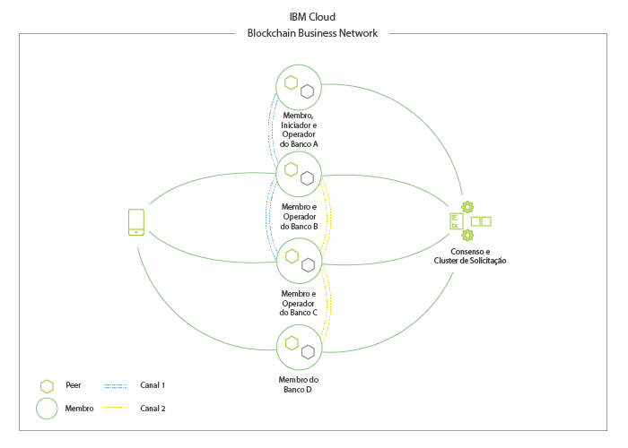

---

copyright:
  years: 2018, 2019
lastupdated: "2019-07-10"

keywords: blockchain components, ca, certificate authorities, peer, ordering service, orderer, channel, smart contract, applications

subcollection: blockchain

---

{:external: target="_blank" .external}
{:shortdesc: .shortdesc}
{:screen: .screen}
{:codeblock: .codeblock}
{:note: .note}
{:important: .important}
{:tip: .tip}
{:pre: .pre}

# Visão geral do componente do Blockchain
{: #blockchain-component-overview}

Os componentes e a estrutura do {{site.data.keyword.blockchainfull}} Platform são baseados na infraestrutura subjacente e nas ferramentas do [Hyperledger Fabric](https://hyperledger-fabric.readthedocs.io/en/release-1.4/){: external}, uma solução de blockchain permissionária de software livre para a qual a {{site.data.keyword.IBM_notm}} é uma contribuidora principal. As redes baseadas no Fabric incluem vários componentes padrão que podem ser implementados em várias configurações para suportar uma ampla variedade de casos de uso.

Para obter uma visualização mais abrangente das redes do Fabric e a inter-relação dos componentes que o compõem, veja [este documento sobre a estrutura de uma rede de blockchain](https://hyperledger-fabric.readthedocs.io/en/release-1.4/network/network.html) na documentação da comunidade do Fabric, que mostra como uma rede pode ser iniciada e expirada.

Para obter uma visão geral resumida dos componentes em uma rede baseada no Fabric, veja o vídeo abaixo:

<iframe class="embed-responsive-item" id="youtubeplayer" title="Vídeos do Starter Plan" type="text/html" width="640" height="390" src="https://www.youtube.com/embed/sJaT2L99BUo" frameborder="0" webkitallowfullscreen mozallowfullscreen allowfullscreen> </iframe>

*Embora esse vídeo foque nos componentes da perspectiva das redes Starter e Enterprise, as informações ainda são altamente relevantes para a solução gerenciada pelo cliente do {{site.data.keyword.blockchainfull_notm}} Platform for {{site.data.keyword.cloud_notm}} Private.*

Para os propósitos desta visão geral, vamos focar apenas nas autoridades de certificação (CAs), nos solicitadores, nos peers, nos contratos inteligentes e nos aplicativos. Como é possível ver no [tutorial Construindo uma rede](/docs/services/blockchain/howto?topic=blockchain-ibp-console-build-network#ibp-console-build-network), essa sequência não é arbitrária. Ela reflete a sequência na qual os componentes em uma rede com base no Fabric serão implementados.

## Autoridades de certificação
{: #blockchain-component-overview-ca}

O suporte de uma rede de blockchain baseada no Fabric são identidades e permissões. Identidades tomam a forma de certificados x.509 que uma CA emite e que são como um cartão de crédito pelo fato de que *identificam* alguém, o que pode incluir atributos sobre elas. Esses certificados são, então, vinculados a permissões por sua inclusão nas pastas do MSP no nível do componente ou do canal. Portanto, por exemplo, um MSP de peer terá uma subpasta MSP chamada **admins**. Qualquer usuário cujo certificado esteja dentro dessa pasta administrativa, é um administrador do peer, o que significa que ele tem a capacidade de executar qualquer ação que o administrador desse peer tenha permissão para executar. Um sistema de validação dentro do peer executa uma verificação sempre que um usuário, identificado por seu certificado de assinatura, tenta executar uma ação administrativa. O certificado corresponde ao que está na pasta "admin"? Em caso afirmativo, a ação poderá ser executada. Caso contrário, a solicitação para executar a ação será rejeitada.

As autoridades de certificação do {{site.data.keyword.blockchainfull_notm}} Platform são baseadas no [Hyperledger Fabric-CA](https://hyperledger-fabric-ca.readthedocs.io/en/release-1.4/){: external}, embora seja possível usar outra CA, desde que ela use um PKI com base em certificados x.509. Pode haver, e geralmente deve haver, vários níveis de autoridades de certificação. A "autoridade de certificação raiz" para uma rede normalmente não será exposta, exceto para fornecer certificados para "autoridades de certificação intermediárias", o que emitirá certificados para usuários e componentes diretamente ou para mais camadas de autoridades de certificação intermediárias. Para obter mais detalhes sobre como as autoridades de certificação são usadas para estabelecer identidade e associação, consulte a [Documentação do Hyperledger Fabric sobre identidade](https://hyperledger-fabric.readthedocs.io/en/release-1.4/identity/identity.html){: external} e sobre associação do {: external}.

## Serviços de pedido
{: #blockchain-component-overview-orderer}

Embora o serviço de pedido seja frequentemente referido como o "coração" de uma rede, sua função é realmente muito simples: pedir transações que foram validadas pelos peers em blocos e enviá-las de volta para os peers para serem gravadas em seus livros-razão. Nas versões anteriores do Fabric, essa funcionalidade era empacotada dentro do peer, mas a partir do Fabric v1.0, ela está em um componente separado para aumentar o desempenho do peer e evitar anomalias que poderiam resultar em potenciais bifurcações de estado.

Em um nível físico, essa função de pedido geralmente requer um conjunto de solicitadores que são conhecidos coletivamente como o "serviço de pedido".

Para obter mais informações sobre o serviço de pedido, consulte [O serviço de pedido](https://hyperledger-fabric.readthedocs.io/en/release-1.4/orderer/ordering_service.html){: external}.

## Peers
{: #blockchain-component-overview-peer}

Em um nível físico, uma rede de blockchain é composta principalmente por nós de peer (ou, simplesmente, peers). Peers são os elementos fundamentais da rede porque hospedam os livros-razão e os contratos inteligentes (que estão contidos em ["chaincode"](https://hyperledger-fabric.readthedocs.io/en/release-1.4/developapps/chaincodenamespace.html){: external}). Mais precisamente, o peer hospeda **instâncias** do livro-razão e **instâncias** de contratos inteligentes. Como os contratos inteligentes e os livros-razão são usados para encapsular os processos compartilhados e as informações compartilhadas em uma rede, respectivamente, esses aspectos de um peer fazem deles um bom ponto de partida para entender o que uma rede do Fabric realmente faz.

Para saber mais sobre os peers especificamente, consulte [este documento focando apenas nos peers](https://hyperledger-fabric.readthedocs.io/en/release-1.4/peers/peers.html){: external} na documentação da comunidade do Fabric.

## Canais
{: #blockchain-component-overview-channels}

Um canal é um mecanismo que fornece uma camada aberta de comunicação entre os membros na rede. Múltiplos canais podem ser criados entre os subconjuntos de membros e, assim, suportar um dos [muitos mecanismos para implementar a privacidade](https://developer.ibm.com/tutorials/cl-blockchain-private-confidential-transactions-hyperledger-fabric-zero-knowledge-proof/){: external}. Os dados na rede de blockchain são armazenados nos livros-razão do canal. Os livros-razão do canal são hospedados nos peers das organizações que se associaram ao canal. Para obter mais informações sobre os canais e como usá-los, consulte a [Documentação do Hyperledger Fabric](https://hyperledger-fabric.readthedocs.io/en/release-1.4/channels.html){: external}.

## Contratos inteligentes
{: #blockchain-component-overview-smart-contracts}

Antes de as empresas poderem transacionar entre si, é necessário chegar a um entendimento comum sobre as regras e os processos e definir um certo tipo de contrato. Em conjunto, estes contratos estabelecem o "modelo de negócio" que rege todas as interações entre parceiros de negócios.

A mesma necessidade existe em redes de blockchain, e onde o termo da indústria para esses modelos de negócios é "contratos inteligentes", o Fabric e o {{site.data.keyword.blockchainfull_notm}} Platform contêm esses contratos em uma estrutura maior conhecida como "chaincode", que inclui não apenas a lógica de negócios, mas a infraestrutura subjacente que valida as identidades dos usuários que tentam chamar o contrato inteligente.

Enquanto os contratos no mundo dos negócios são assinados e arquivados em empresas de advocacia, os contratos inteligentes são instalados em peers e "instanciados" em um canal.

## Aplicativos
{: #blockchain-component-overview-applications}

Os aplicativos clientes em uma rede baseada no Fabric como o {{site.data.keyword.blockchainfull_notm}} Platform alavancam infraestruturas subjacentes, como APIs, SDKs e contratos inteligentes para permitir interações do cliente (chamadas e consultas) em um nível mais alto de abstração.

Para dar uma olhada em como os aplicativos interagem com uma rede baseada no Fabric, consulte o tópico [Desenvolvendo aplicativos](https://hyperledger-fabric.readthedocs.io/en/release-1.4/developapps/developing_applications.html){: external} na Documentação do Hyperledger Fabric. Também é possível visitar o tópico [Criando aplicativos](/docs/services/blockchain/howto?topic=blockchain-ibp-console-app#ibp-console-app) para aprender como conectar seus aplicativos ao {{site.data.keyword.blockchainfull_notm}} Platform.

## Uma rede de exemplo
{: #blockchain-component-overview-example-network}

A **Figura 1** descreve um exemplo de uma rede de blockchain implementada que consiste em quatro membros (cada um deles possuindo dois pares), Autoridades de certificação que são responsáveis por distribuir material de identidade criptográfica e um serviço de ordenação que define políticas e participantes da rede. O canal azul contém todos os quatro membros da rede e o canal amarelo é restrito a apenas três membros: Bancos B, C e D. Também é possível ver que o Banco A desempenha a função de inicializador de rede e que o Banco D existe apenas como um membro no contexto do canal amarelo. Por último, um usuário ou aplicativo na posse de um certificado x509 devidamente assinado pode enviar chamadas para peers na rede.

