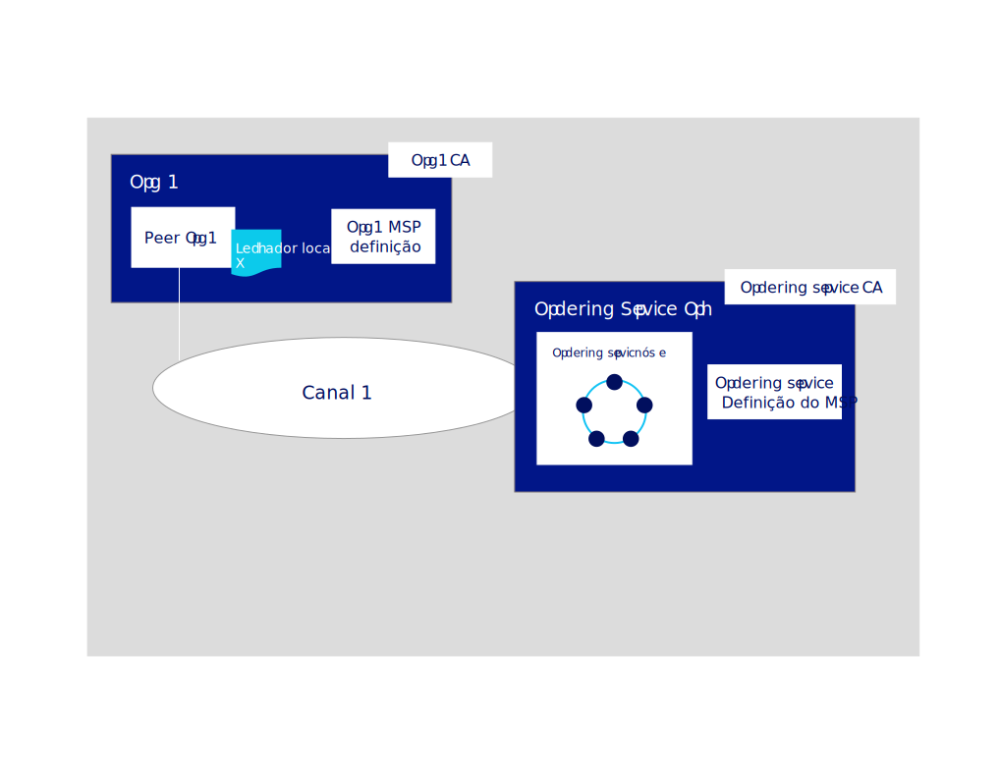

---

copyright:
  years: 2019
lastupdated: "2019-06-18"

keywords: getting started tutorials, create a CA, enroll, register, create an MSP, wallet, create a peer, create ordering service, Raft

subcollection: blockchain

---

{:external: target="_blank" .external}
{:shortdesc: .shortdesc}
{:screen: .screen}
{:codeblock: .codeblock}
{:note: .note}
{:important: .important}
{:tip: .tip}
{:pre: .pre}

# Construir um tutorial de rede
{: #ibp-console-build-network}

O {{site.data.keyword.blockchainfull}} Platform é uma oferta de blockchain-as-a-service que permite que você desenvolva, implemente e opere aplicativos e redes de blockchain. É possível obter mais informações sobre os componentes de blockchain e como eles trabalham juntos visitando a [Visão geral do componente Blockchain](/docs/services/blockchain?topic=blockchain-blockchain-component-overview#blockchain-component-overview). Este tutorial é a primeira parte na [série de tutoriais de rede de amostra](/docs/services/blockchain/howto?topic=blockchain-ibp-console-build-network#ibp-console-build-network-sample-tutorial) e descreve como usar o console do {{site.data.keyword.blockchainfull_notm}} Platform para construir uma rede totalmente funcional no cluster do Kubernetes implementado na infraestrutura em nuvem de nossa escolha.
{:shortdesc}


No caso de estar usando a versão de avaliação beta do {{site.data.keyword.blockchainfull_notm}} Platform for {{site.data.keyword.cloud_notm}}, é provável que alguns painéis em seu console não correspondam à documentação atual, que é mantida atualizada com a instância de serviço geralmente disponível (GA). Se tiver uma instância de serviço beta e desejar obter os benefícios de todas as funcionalidades mais recentes, será aconselhável neste momento provisionar uma instância de serviço GA seguindo as instruções de [Introdução ao {{site.data.keyword.blockchainfull_notm}} Platform for {{site.data.keyword.cloud_notm}}](/docs/services/blockchain/howto?topic=blockchain-ibp-v2-deploy-iks#ibp-v2-deploy-iks).
{: important}

**Público-alvo:** este tópico é projetado para operadores de rede que são responsáveis por criar, monitorar e gerenciar a rede de blockchain.

Se ainda não tiver usado o console do {{site.data.keyword.blockchainfull_notm}} Platform para implementar componentes em um cluster Kubernetes usando o serviço de Kubernetes do {{site.data.keyword.cloud_notm}}, consulte [Introdução ao {{site.data.keyword.blockchainfull_notm}} Platform for {{site.data.keyword.cloud_notm}}](/docs/services/blockchain/howto?topic=blockchain-ibp-v2-deploy-iks#ibp-v2-deploy-iks), se estiver usando um cluster do {{site.data.keyword.cloud_notm}} ou [Introdução ao {{site.data.keyword.blockchainfull_notm}} Platform for Multicloud](/docs/services/blockchain?topic=blockchain-get-started-console-icp#get-started-console-icp), se estiver usando o {{site.data.keyword.cloud_notm}} Private para implementar em um provedor em nuvem diferente do {{site.data.keyword.cloud_notm}}. Observe que o console em si não reside em seu cluster. Ele é uma ferramenta que pode ser usada para implementar componentes em seu cluster.

Independentemente de você implementar componentes em um cluster Kubernetes pago ou grátis, preste muita atenção aos recursos à sua disposição quando optar por implementar nós e criar canais. É sua responsabilidade gerenciar seu cluster Kubernetes e implementar recursos adicionais, se necessário. Embora os componentes sejam implementados com êxito em um cluster grátis do {{site.data.keyword.cloud_notm}}, quanto mais componentes forem incluídos, mais lentamente seus componentes serão executados. Para obter mais informações sobre dimensionamentos de componente e como o console interage com seu cluster do serviço de Kubernetes do {{site.data.keyword.cloud_notm}}, consulte [Alocando recursos](/docs/services/blockchain/howto?topic=blockchain-ibp-console-govern#ibp-console-govern-iks-console-interaction). Se estiver usando o {{site.data.keyword.cloud_notm}} Private para implementar em um provedor em nuvem diferente, será necessário consultar a documentação desse provedor para saber como monitorar seus recursos lá.

## Amostra de séries do tutorial de rede
{: #ibp-console-build-network-sample-tutorial}

Esta série de tutorial de três partes orienta você durante o processo de criação e interconexão de uma rede do Hyperledger Fabric relativamente simples e multinó, usando o console do {{site.data.keyword.blockchainfull_notm}} Platform para implementar uma rede em seu cluster Kubernetes e instalar e instanciar um contrato inteligente. Observe que, ao mesmo tempo que este tutorial mostrará como esse processo funciona com um cluster Kubernetes pago do {{site.data.keyword.cloud_notm}}, o mesmo fluxo básico se aplica aos clusters grátis, embora com algumas limitações (por exemplo, não é possível dimensionar ou redimensionar nós em um cluster grátis).

O processo para criar e gerenciar componentes descritos nesses tutoriais também se aplica a implementações em outros provedores em nuvem usando o {{site.data.keyword.cloud_notm}} Private.
{: important}

* **Tutorial Construir uma rede** Esse tutorial orienta você durante o processo de hospedagem de uma rede criando duas organizações, uma para seu peer e outra para o serviço de pedido e um canal. Use esse tutorial se desejar formar um consórcio de blockchain criando um serviço de pedido e incluindo organizações.
* [Tutorial Associar uma rede](/docs/services/blockchain/howto?topic=blockchain-ibp-console-join-network#ibp-console-join-network) orienta você durante o processo de associação de uma rede existente criando um peer e associando-o a um canal existente. Use esse tutorial se você não pretende hospedar uma rede criando um serviço de pedido ou deseja aprender o processo para associar outras redes.
* [Implementar um contrato inteligente na rede](/docs/services/blockchain/howto?topic=blockchain-ibp-console-smart-contracts#ibp-console-smart-contracts) mostra como gravar um contrato inteligente e implementá-lo em uma rede.


### A estrutura desta rede
{: #ibp-console-build-network-structure}

Se você concluir todas as etapas nos tutoriais **Construir uma rede** e **Associar-se a uma rede**, sua rede será semelhante àquela na ilustração abaixo:


Essa configuração é suficiente para testar aplicativos e contratos inteligentes e como um guia para construir componentes e associar redes de produção que se adéquam ao seu próprio caso de uso. A rede contém os componentes a seguir:

* ** Duas organizações de peer **:  ` Org1 `  e  ` Org2 `  
  A série do tutorial descreve como criar duas organizações de peer e dois peers associados. Considere as organizações em uma rede de blockchain como dois bancos diferentes que precisam transacionar entre si. Nós criaremos as definições de `Org1` e `Org2`.
* **Uma organização de serviço de pedido**: `Ordering Service`  
  Como estamos construindo um livro-razão distribuído, os peers e o serviço de pedido devem fazer parte de organizações separadas. Portanto, uma organização separada é criada para o serviço de pedido. Entre outras coisas, um serviço de pedido pede os blocos de transações que são enviados para os peers para serem gravados em seus livros-razão e se tornarem o blockchain. Criaremos a definição da organização `Ordering Service`.
* **Três autoridades de certificação (CAs)**: `Org1 CA, Org2 CA, Ordering Service CA`   
  Uma CA é o nó que emite certificados para os usuários e os nós associados a uma organização. Como a melhor prática é implementar uma CA por organização, implementaremos três CAs no total: uma para cada organização de peer e uma para a organização de serviço de pedido. Essas CAs também criarão a definição de cada organização, que é encapsulada por um Membership Service Provider (MSP). Uma autoridade de certificação de TLS é implementada automaticamente em conjunto com cada CA da organização e fornece os certificados TLS que são usados para comunicação entre os nós. Para obter mais informações, consulte [Usando sua CA TLS](/docs/services/blockchain/howto?topic=blockchain-ibp-console-identities#ibp-console-identities-tlsca).
* **Um serviço de pedido** `Ordering Service`  
  Embora as implementações em execução em um cluster pago tenham a opção de implementar um serviço de pedido de um nó ou um serviço de pedido de cindo nós tolerantes a falhas de travamento, os clusters grátis têm somente a opção de executar um único nó. O serviço de pedido de cinco nós usa uma implementação do protocolo Raft (para obter mais informações sobre o Raft, consulte [O serviço de pedido](https://hyperledger-fabric.readthedocs.io/en/release-1.4/orderer/ordering_service.html#raft){: external} e é a opção de implementação que este tutorial irá apresentar. Atualmente, somente uma organização de serviço de pedido por serviço de pedido é suportada, independentemente do número de nós de pedido associados a essa organização. Esse serviço de pedido incluirá organizações de peer em seu "consórcio", que é a lista de organizações de peer que podem criar e associar canais. Se você desejar criar um canal que tenha organizações implementadas em clusters diferentes, que é como a maioria das redes de produção será estruturada, o administrador do serviço de pedido precisará importar uma organização de peer que tenha sido implementada em outro console para seu console. Isso permite que a organização de peer associe o canal que está hospedado nesse serviço de pedido.
* **Dois peers:** `Peer Org1` e `Peer Org2`  
  O livro-razão, `Ledger x` na ilustração acima, é mantido pelos peers distribuídos. Esses peers são implementados usando o [Couch DB](https://hyperledger-fabric.readthedocs.io/en/release-1.4/couchdb_as_state_database.html){: external}) como o banco de dados de estado em um contêiner separado associado ao peer. Esse banco de dados retém o valor atual de todo "state" (como representado por pares chave-valor). Por exemplo, suponha que `Org1` (um valor) seja o proprietário atual de um ativo de banco (a chave). O blockchain, a lista de transações, é armazenado localmente no peer.
* ** Um canal **:  ` channel1 `  
  Os canais permitem que conjuntos de organizações transacionem em expor seus dados para organizações que não são membros do canal. Cada canal tem seu próprio livro-razão, gerenciado coletivamente pelos peers associados a esse canal. O tutorial cria um canal associado a ambas as organizações e mostra como instanciar um contrato inteligente no canal que as organizações podem usar para transacionar.

Essa configuração não é obrigatória. O {{site.data.keyword.blockchainfull_notm}} Platform é altamente customizável. Se você tiver recursos disponíveis em seu cluster Kubernetes, será possível usar o console para implementar componentes em uma matriz sem fim de configurações. Este tutorial fornece as etapas necessárias para construir sua própria rede, com referências a tópicos que fornecem um detalhamento para o {{site.data.keyword.blockchainfull_notm}} Platform e o console.

Neste tutorial **Construir uma rede**, construímos somente uma parte da rede acima, uma rede simples que pode ser usada para hospedar um serviço de pedido e uma única organização de peer e peer em um único canal. A ilustração a seguir mostra a parte da rede acima que será construída:


Essa configuração é útil para iniciar e testar rapidamente um contrato inteligente, mas não é muito significativa até que você inclua outras organizações com as quais transacionar, criando uma rede realmente distribuída. Portanto, no tutorial subsequente [Associar-se a uma rede](/docs/services/blockchain/howto?topic=blockchain-ibp-console-join-network#ibp-console-join-network), nós mostramos a você como criar peer e organizações de peer adicionais e como incluir uma nova organização no canal.

Em todo este tutorial, fornecemos os **valores recomendados** para os campos no console. Isso permite que os nomes e as identidades sejam mais fáceis de reconhecer nas guias e nas listas suspensas. Esses valores não são obrigatórios, mas você os achará úteis, especialmente porque terá que se lembrar de determinados valores como IDs e segredos de usuários registrados inseridos em etapas anteriores. Como esses valores não são armazenados no console, se você os esquecer, será necessário registrar usuários adicionais e iniciar o processo novamente. Fornecemos uma tabela dos valores recomendados após cada tarefa e recomendamos que, se você não usar os valores recomendados, registre seus valores à medida que continuar o tutorial.
{:tip}

## Etapa um: criar uma organização peer e um peer
{: #ibp-console-build-network-create-peer-org1}

Para cada organização que você deseja criar com o console, é necessário implementar pelo menos uma CA. Uma CA é o nó que emite certificados para todos os participantes da rede (peers, serviços de solicitação, clientes, administradores e assim por diante). Esses certificados, que incluem um certificado de assinatura e uma chave privada, permitem que os participantes da rede se comuniquem, se autentiquem e, por fim, transacionem. Essas CAs criarão todas as identidades e certificados pertencentes à sua organização, além de definir a própria organização. É possível, então, usar essas identidades para implementar nós, criar identidades de administrador e enviar transações. Para obter mais informações sobre sua CA e as identidades que você precisará criar, consulte [Gerenciando identidades](/docs/services/blockchain/howto?topic=blockchain-ibp-console-identities#ibp-console-identities).

Neste tutorial, criamos duas organizações, uma que possuirá um peer e outro que possuirá um serviço de pedido. Cada organização precisa de uma CA para emitir seus certificados, portanto, é necessário criar **duas CAs**. Para o propósito deste tutorial, **criaremos somente uma CA de cada vez**.

Assista ao [vídeo](http://ibm.biz/BlockchainPlatformSeries2){: external} a seguir para conhecer o processo para criar a organização do peer e o peer.


### Criando a CA de sua organização de peer
{: #ibp-console-build-network-create-CA-org1CA}

Como parte deste tutorial, sua CA emite os certificados e as chaves privadas para seus usuários e nós. Essas identidades não são gerenciadas pela {{site.data.keyword.IBM_notm}} e as chaves não são armazenadas no console. Eles são armazenados somente no armazenamento local de seu navegador. Portanto, certifique-se de exportar suas identidades e o MSP de sua organização. Se você tentar acessar o console em uma máquina ou em um navegador diferente, será necessário importar essas identidades e definições de organização.
{:important}

Para criar a CA que emitirá certificados para sua primeira organização, execute as etapas a seguir em seu console:

1. Navegue para a guia **Nós** à esquerda e clique em **Incluir Autoridade de certificação**. Os painéis laterais permitirão que você customize a CA que deseja criar e a organização para a qual ela emitirá chaves.
2. Neste tutorial, estamos criando nós, portanto, certifique-se de que a opção para **Criar** uma Autoridade de certificação esteja selecionada. Em seguida, clique em **Avançar**.
3. Use o segundo painel lateral para fornecer à sua CA um **nome de exibição**. Nosso valor recomendado para essa CA é `Org1 CA`.
4. No próximo painel, forneça suas credenciais de administrador de CA especificando um **ID de registro do administrador de CA** de `admin` e um segredo de `adminpw`. Novamente, esses são **valores recomendados**.
5. Se estiver usando um cluster pago, você terá a oportunidade de configurar a alocação de recurso para o nó. Para os propósitos deste tutorial, aceite todos os padrões e clique em **Avançar**. Se desejar aprender mais sobre como alocar recursos no {{site.data.keyword.cloud_notm}} para seu nó, consulte esse tópico em [Alocando recursos](/docs/services/blockchain?topic=blockchain-ibp-console-govern#ibp-console-govern-allocate-resources). Se estiver usando um cluster grátis, você verá a página **Resumo**.
6. Revise a página Resumo e, em seguida, clique em **Incluir autoridade de certificação**.

**Tarefa: criando a CA da organização de peer**

  | **Campo** | **Nome de exibição** | **ID de inscrição** | **Segredo** |
  | ------------------------- |-----------|-----------|-----------|
  | **Criar CA** | Org1 CA  | admin | adminpw |

  *Figura 3. Criando a CA da organização de peer*

Depois de implementar a CA, você a usará quando criar seu MSP de sua organização, registrar usuários e seu **peer**.

Os usuários avançados podem já ter sua própria CA e não desejar criar uma nova no console. Se a sua CA existente externa puder emitir certificados no formato `X.509`, será possível usá-la em vez de criar uma nova aqui. Consulte este tópico em [Usando certificados de uma CA externa com seu serviço peer ou de solicitação](/docs/services/blockchain/howto?topic=blockchain-ibp-console-build-network#ibp-console-build-network-third-party-ca) para obter mais informações.

### Usando sua CA para registrar identidades
{: #ibp-console-build-network-use-CA-org1}

Cada nó ou aplicativo que você deseja criar precisa de um certificado e uma chave privada para participar da rede de blockchain. Também é necessário criar identidades de administrador para esses nós e aplicativos para que seja possível gerenciá-los por meio do console. Vamos passar por esse processo duas vezes, uma vez para cada CA que criarmos. E para cada CA, você criará duas identidades:

* **Um administrador da organização**: essa identidade permite operar nós usando o console da plataforma.
* **Uma identidade peer**: essa é a identidade do próprio peer. Sempre que um peer executar uma ação (por exemplo, endossando uma transação), ele assinará usando seu certificado.

Dependendo de seu tipo de cluster, a implementação da CA poderá levar até dez minutos. Quando a CA for implementada pela primeira vez (ou quando estiver de outra forma indisponível), a caixa no quadro da CA ficará cinza. Quando a CA tiver sido implementada com êxito e estiver em execução, essa caixa ficará verde, indicando que está "Em execução" e pode ser usada para registrar identidades. Antes de continuar com as etapas abaixo para registrar identidades, deve-se aguardar até que o status da CA seja "Em execução".
{:important}

Depois que a CA estiver em execução, conforme indicado pela caixa verde no quadro, gere esses certificados concluindo as etapas a seguir:

1. Clique em `Org1 CA` e assegure-se de que a identidade `admin` criada para a CA esteja visível na tabela. Em seguida, clique no botão **Registrar usuário**.
2. Primeiro, registraremos o administrador da organização, que podemos fazer fornecendo um **ID de inscrição** de `org1admin` e um **segredo** de `org1adminpw`. Em seguida, configure o `Type` dessa identidade como `client` (as identidades do administrador devem sempre ser registradas como `client`, enquanto as identidades do nó devem sempre ser registradas usando o tipo `peer`). É possível ignorar o campo **Número máximo de registros**. Se desejar saber mais sobre registros, consulte [Registrando identidades](/docs/services/blockchain/howto?topic=blockchain-ibp-console-identities#ibp-console-identities-register). Clique em **Avançar**.
3. Para o propósito deste tutorial, não precisamos usar **Incluir atributo**. Se desejar saber mais sobre atributos de identidade, consulte [Registrando identidades](/docs/services/blockchain/howto?topic=blockchain-ibp-console-identities#ibp-console-identities-register).
4. Depois que o administrador da organização tiver sido registrado, repita esse mesmo processo para a identidade do peer (também usando o `Org1 CA`). Para obter a identidade do peer, forneça um ID de inscrição de `peer1` e um segredo de `peer1pw`. Essa é uma identidade de nó, portanto, selecione `peer` como o **Tipo**. É possível ignorar o campo **Número máximo de registros** e, no próximo painel, não designar nenhum **Atributo**, como antes.

Registrar essas identidades com a CA é apenas a primeira etapa na **criação** de uma identidade. Você não conseguirá usar essas identidades até que tenham sido **registradas**. Para a identidade `org1admin`, isso ocorrerá durante a criação do MSP, que será visto na próxima etapa. No caso do peer, isso acontece durante a criação do peer.
{:note}

**Tarefa: registrar usuários**

  |  **Campo** | **Descrição** | **ID de inscrição** | **Segredo** |
  | ------------------------- |-----------|-----------|-----------|-----------|
  | **Registrar usuários** |  Org1 admin | org1admin | org1adminpw |
  | | Identidade do peer |  peer1 | peer1pw |

  *Figura 4. Usando sua CA para registrar usuários*

### Criando a definição do MSP da organização de peer
{: #ibp-console-build-network-create-peers-org1}

Agora que criamos a CA do peer e a usamos para **registrar** identidades para o administrador `Org1` e para o peer que associaremos a `Org1`, precisamos criar uma definição formal da organização de peer, que é conhecida como MSP. Observe que muitos peers podem pertencer a uma organização. **Você não precisa criar uma nova organização toda vez que cria um peer**. Como essa é a primeira vez que passamos pelo tutorial, criaremos o ID do MSP para essa organização. Durante o processo de criação do MSP, nós iremos inscrever a identidade `org1admin` e incluí-la em nossa carteira eletrônica.

1. Navegue para a guia **Organizações** na navegação esquerda e clique em **Criar definição do MSP**.
2. Forneça ao seu MSP o nome de exibição `Org1 MSP` e um ID do MSP de `org1msp`. Se desejar especificar seu próprio ID do MSP nesse campo, certifique-se de seguir as especificações sobre as limitações para esse nome na dica de ferramenta.
3. Em **Detalhes da Autoridade de certificação raiz**, especifique a CA usada para registrar as identidades na etapa anterior. Se essa for sua primeira vez neste tutorial, você deverá ver somente uma: `Org1 CA`.
4. Os campos **ID de registro** e **Segredo de registro** abaixo disso serão preenchidos automaticamente com o ID e o segredo de registro do primeiro usuário criado com sua CA: `admin` e `adminpw`. No entanto, usar essa identidade daria à sua organização a mesma identidade de administrador que a sua CA, o que, por razões de segurança, não é recomendado. Em vez disso, selecione o ID de inscrição que você criou para seu administrador da organização na lista suspensa, `org1admin`, e insira seu segredo associado, `org1adminpw`. Em seguida, forneça a essa identidade um nome de exibição, `Org1 Admin`.
5. Clique no botão **Gerar** para registrar essa identidade como o administrador de sua organização e exporte a identidade para a Carteira eletrônica, na qual será usada ao criar o peer e os canais.
6. Clique em **Exportar** para exportar os certificados de administrador para o sistema de arquivos. Como dissemos acima, essa identidade não é armazenada em seu console nem gerenciada pela {{site.data.keyword.IBM_notm}}. É armazenado apenas no armazenamento do navegador local. Se mudar os navegadores, será necessário importar essa identidade para sua Carteira eletrônica para poder administrar o peer.
7. Clique em **Criar definição do MSP**.

**Tarefa: Criar o MSP da organização de peer**

  |  | **Nome de exibição** | **ID do MSP** | **ID de inscrição**  | **Segredo** |
  | ------------------------- |-----------|-----------|-----------|-----------|
  | **Criar organização** | Org1 MSP | org1msp |||
  | **CA raiz** | Org1 CA ||||
  | **Certificado do administrador da organização** | |  | org1admin | org1adminpw |
  | **Identidade** | Administrador da Org1 |||||

  *Figura 5. Criar a definição do MSP da organização de peer*

Depois de ter criado o MSP, você deverá ser capaz de ver o administrador da organização peer em sua **Carteira eletrônica**, a qual pode ser acessada clicando na **Carteira eletrônica** na navegação esquerda.

**Tarefa: verificar sua carteira eletrônica**

  | **Campo** |  **Nome de exibição** | **Descrição** |
  | ------------------------- |-----------|----------|
  | **Identidade** | Administrador da Org1 | Identidade do administrador da Org1 |

  *Figura 6. Verificar sua Carteira eletrônica*

Para obter mais informações sobre MSPs, consulte [Gerenciando organizações](/docs/services/blockchain/howto?topic=blockchain-ibp-console-organizations#ibp-console-organizations).

A exportação de sua identidade do administrador da organização é importante porque você é responsável por gerenciar e proteger esses certificados. Se você alternar navegadores, será necessário importar essa identidade do administrador, caso contrário, não será possível operar a Org1.
{:important}

### Criando um peer
{: #ibp-console-build-network-peer-create}

Depois de ter [criado a CA de Org1](/docs/services/blockchain/howto?topic=blockchain-ibp-console-build-network#ibp-console-build-network-create-CA-org1CA), de tê-la usado para registrar as identidades Org1 e criado o [MSP de Org1](/docs/services/blockchain/howto?topic=blockchain-ibp-console-build-network#ibp-console-build-network-create-peers-org1), você está pronto para criar um peer para Org1.

#### Qual função os peers executam?
{: #ibp-console-build-network-peer-role}

É importante lembrar-se de que as próprias organizações não mantêm livros-razão. Os peers executam. As organizações também usam peers para assinar propostas de transação e aprovar atualizações de configuração do canal. Como ter pelo menos dois peers por organização em um canal torna-os altamente disponíveis, ter três peers por organização associado a um canal é considerado uma melhor prática para implementações de nível de produção porque garante alta disponibilidade mesmo enquanto um peer está inativo para manutenção. Neste tutorial, no entanto, mostraremos apenas o processo para criar um único peer. É possível replicar o processo para se adequar às suas necessidades de negócios.

De uma perspectiva de alocação de recurso, é possível associar os mesmos peers a múltiplos canais. O design do peer assegura que os dados de um canal não possam passar para outro por meio do peer. No entanto, como o peer armazenará um livro-razão separado para cada canal, será necessário assegurar-se de que o peer tenha energia de processamento e armazenamento suficientes para manipular a transação e o carregamento de dados.

#### Implementando seu peer
{: #ibp-console-build-network-deploy-peer-role}

Use seu console para executar as etapas a seguir:

1. Na página **Nós**, clique em **Incluir peer**.
2. Certifique-se de que a opção para **Criar** um peer esteja selecionada. Em seguida, clique em **Avançar**.
3. Forneça a seu peer um **Nome de exibição** de `Peer Org1`. Para o propósito deste tutorial, não escolha usar uma CA externa para seu peer e, no caso de desejar obter mais informações, consulte [Usando certificados de uma CA externa](#ibp-console-build-network-third-party-ca). Clique em **Avançar**.
4. Na próxima tela, selecione `Org1 CA`, pois essa é a CA que você usou para registrar a identidade do peer. Selecione o **ID de inscrição** para a identidade de peer que você criou para seu peer na lista suspensa, `peer1`, e insira seu **segredo** associado, `peer1pw`. Em seguida, selecione `Org1 MSP` na lista suspensa e clique em **Avançar**.
5. O próximo painel lateral solicita informações de CA do TLS. Quando você criou a CA, um TLSCA foi criado junto a ela. Essa CA é usada para criar certificados para a camada de comunicação segura para os nós. Portanto, selecione o **ID de Inscrever** para a identidade de peer que você criou para seu peer por meio da lista suspensa, `peer1`e insira o **segredo**associado, `peer1pw`. O **Nome do host da solicitação de assinatura de certificado (CSR) do TLS** é uma opção disponível para usuários avançados que desejam especificar um nome de domínio customizado que pode ser usado para direcionar o terminal de peer. Os nomes de domínio customizado não fazem parte deste tutorial, portanto, deixe o **Nome do host do CSR do TLS** em branco por enquanto.
6. Se estiver usando um cluster pago, no próximo painel, você terá a oportunidade de configurar a alocação de recurso para o nó. Para os propósitos desse tutorial, é possível aceitar todos os padrões e clicar em **Avançar**. Se desejar aprender mais sobre como alocar recursos no {{site.data.keyword.cloud_notm}} para seu nó, consulte esse tópico em [Alocando recursos](/docs/services/blockchain?topic=blockchain-ibp-console-govern#ibp-console-govern-allocate-resources). Se você estiver usando um cluster do {{site.data.keyword.cloud_notm}} grátis, verá o painel **Associar uma identidade**.
7. O último painel lateral solicita que você **Associe uma identidade** para torná-la o administrador de seu peer. Para o propósito deste tutorial, torne o seu administrador da organização, `Org1 Admin`, o administrador de seu peer também. É possível registrar e inscrever uma identidade diferente com o `Org1 CA` e tornar essa identidade o administrador de seu peer, mas este tutorial usa a identidade `Org1 Admin`.
8. Revise o resumo e clique em **Incluir peer**.

**Tarefa: implementando um peer**

  |  | **Nome de exibição** | **ID do MSP** | **ID de inscrição** | **Segredo** |
  | ------------------------- |-----------|-----------|-----------|-----------|
  | **Criar peer** | Peer Org1 | org1msp |||
  | **CA** | Org1 CA ||||
  | **Identidade do peer** | |  | peer1 | peer1pw |
  | **Certificado de administrador** | org1msp ||||
  | **CA TLS** | Org1 CA ||||
  | **ID de CA TLS** | || peer1 | peer1pw |
  | **Associar identidade** | Administrador da Org1 |||||

  *Figura 7. Implementando um Período*

Em um cenário de produção, é recomendável que cada organização implemente três peers em cada canal. Esses podem ser os mesmos três peers associados a diferentes canais ou peers diferentes. Isso depende da organização. Isso é para permitir que um peer fique inativo (por exemplo, durante um ciclo de manutenção) e ainda mantenha peers altamente disponíveis. Para implementar mais de um peer para uma organização, use a mesma CA usada para registrar sua primeira identidade peer. Neste tutorial, isso seria `Org1 CA`. Em seguida, registre uma nova identidade peer usando um ID e um segredo de registro distintos. Por exemplo, `org1secondpeer` e `org1secondpeerpw`. Em seguida, ao criar o peer, forneça esse ID e segredo de registro. Como esse peer ainda está associado ao Org1, escolha `Org1 CA`, `Org1 MSP` e `Org1 Admin` nas listas suspensas. Você pode escolher fornecer a esse novo peer um administrador diferente, que pode ser registrado e inscrito com `Org1 CA`, mas isso é opcional. Esta série de tutoriais mostrará apenas o processo para criar um único peer para cada organização peer.
{:tip}

## Etapa dois: criar o serviço de pedido
{: #ibp-console-build-network-create-orderer}

Em outros blockchains distribuídos, como o Ethereum e o Bitcoin, não há autoridade central que peça transações e as envie para os peers. O Hyperledger Fabric, blockchain no qual o {{site.data.keyword.blockchainfull_notm}} Platform é baseado, funciona de forma diferente. Ele apresenta um nó, ou um cluster de nós, chamado de **serviço de pedido**.

O serviço de pedido é um componente principal em uma rede porque ele executa algumas funções essenciais:

- Eles literalmente **pedem** os blocos de transações que são enviados para os peers para serem gravados em seus livros-razão. Esse processo é chamado de "pedido".
- Eles mantêm o **canal de sistema de pedido**, o local no qual o **consórcio**, a lista de organizações de peer permitidas para criar canais, reside. Um consórcio é essencialmente um veículo de ocupação variada e um único serviço de pedido por design pode hospedar múltiplos consórcios.
- Eles **cumprem as políticas** decididas pelo consórcio ou pelos administradores do canal. Essas políticas ditam tudo, desde quem lê ou grava em um canal até quem pode criar ou modificar um canal. Por exemplo, quando um participante de rede pede para modificar uma política de canal ou de consórcio, o serviço de pedido processa a solicitação para ver se o participante tem os direitos administrativos adequados para essa atualização de configuração, valida-a com relação à configuração existente, gera uma nova configuração e retransmite-a para os peers.

Para obter mais informações sobre como pedir serviços e a função que eles desempenham em redes com base no Hyperledger Fabric, consulte o [Serviço de pedido](https://hyperledger-fabric.readthedocs.io/en/release-1.4/orderer/ordering_service.html){: external}.

Em um cluster pago, você tem a opção entre criar um serviço de pedido de um nó (suficiente para propósitos de teste) e um serviço de pedido tolerante a falhas que apresenta cinco nós ligados a uma única organização. Em um cluster grátis, você só será capaz de criar um único serviço de pedido de nó. Neste tutorial, mostraremos o serviço de pedido de cinco nós.

No entanto, assim como com o peer, antes de podermos criar um serviço de pedido, precisamos criar uma CA para fornecer as identidades e o MSP de nossa organização de serviço de pedido.

Assista ao [vídeo](http://ibm.biz/BlockchainPlatformSeries3){: external} a seguir para conhecer o processo para criar a organização do serviço de pedido e o serviço de pedido.

### Pedindo no console
{: #ibp-console-build-network-ordering-console}

Nesta liberação, os serviços de pedido distribuídos, em que múltiplas organizações contribuem com os nós para um serviço de pedido, não são suportados. Cada nó de pedido no serviço de pedido será administrado por uma única organização.

O serviço de pedido de nível de produção disponível é um serviço de pedido tolerante a falhas (CFT) baseado em uma implementação do protocolo Raft em `etcd`. O Raft segue um modelo "líder e seguidor", em que um nó líder é eleito (por canal) e suas decisões são replicadas pelos seguidores. Os serviços de pedido de Raft devem ser mais fáceis de configurar e gerenciar do que os serviços de pedido baseados em Kafka e seu design permite que organizações diferentes contribuam com os nós para um serviço de pedido distribuído. Para obter mais informações sobre o Raft, consulte o [Serviço de pedido](https://hyperledger-fabric.readthedocs.io/en/release-1.4/orderer/ordering_service.html#raft){: external}.

Atualmente, a única configuração tolerante a falhas de nós de pedido atualmente disponível é de **cinco** nós. Embora seja possível criar um serviço de pedido tolerante a falhas de travamento com o menor número de três nós, essa configuração incorre em risco. Se um nó ficar inativo, por exemplo, durante um ciclo de manutenção, restarão apenas dois nós. Se outro nó for perdido durante esse ciclo **por qualquer motivo**, restará somente um nó. Nesse estado (um serviço de pedido de um nó quando você começou com três), você não terá mais a maioria de nós disponíveis, também conhecido como um "quorum". Sem um quorum, nenhuma transação pode ser enviada por push. O canal pararia de funcionar.

Com cinco nós, é possível perder dois nós e ainda manter um quorum, o que significa que é possível passar por um ciclo de manutenção enquanto mantém a alta disponibilidade. Como resultado, os clusters pagos terão somente a opção entre um nó e cinco nós. As redes de produção devem escolher a opção de cinco nós, pois um serviço de pedido de um nó é, por definição, não tolerante a falhas.

Neste tutorial, criaremos um serviço de pedido de cinco nós.

### Criando sua CA de organização de serviço de pedido
{: #ibp-console-build-network-create-orderer-ca}

O processo de criação de uma CA para um serviço de pedido é idêntico a criá-la para um peer.

1. Navegue para a guia **Nós** e clique em **Incluir autoridade de certificação**.
2. Neste tutorial, estamos criando nós, portanto, certifique-se de que a opção para **Criar** uma Autoridade de certificação esteja selecionada. Em seguida, clique em **Avançar**
3. Dê a essa CA um nome de exibição exclusivo, `Ordering Service CA`.
4. Você é livre para reutilizar o **ID de inscrição do administrador de CA** de `admin` e um segredo de `adminpw`. Como essa é uma CA diferente, essa identidade é distinta da identidade do administrador de CA criada para o `Org1 CA`, mesmo que o ID e o segredo sejam idênticos.
5. Se você estiver usando um cluster pago, no próximo painel, você terá a oportunidade de configurar a alocação de recurso para a CA. Para os propósitos deste tutorial, aceite todos os padrões e clique em **Avançar**. Se desejar saber mais sobre como alocar recursos para o {{site.data.keyword.cloud_notm}} para seu nó, consulte este tópico em [Alocando recursos](/docs/services/blockchain?topic=blockchain-ibp-console-govern#ibp-console-govern-allocate-resources). Se estiver usando um cluster grátis, você verá a página **Resumo**.
6. Revise a página Resumo e, em seguida, clique em **Incluir autoridade de certificação**.

Assim como com o peer, os usuários avançados podem já ter sua própria CA e não desejar criar uma nova CA usando o console. Se a sua CA existente externa puder emitir certificados no formato `X.509`, será possível usá-la em vez de criar uma nova aqui. Consulte este tópico em [Usando certificados de uma CA externa com seu serviço peer ou de solicitação](/docs/services/blockchain/howto?topic=blockchain-ibp-console-build-network#ibp-console-build-network-third-party-ca) para obter mais informações.

### Usando sua CA para registrar o nó do serviço de pedido e as identidades de administrador do serviço de pedido
{: #ibp-console-build-network-use-CA-orderer}

Como fizemos com o peer, precisamos registrar duas identidades com nossa CA de serviço de pedido. Depois de selecionar sua CA, será necessário registrar um administrador para nossa organização de serviço de pedido e uma identidade para o próprio serviço de pedido. Como antes, é necessário ver uma identidade na guia `Ordering Service CA`; é o administrador que você criou para a CA.

Dependendo de seu tipo de cluster, a implementação da CA poderá levar até dez minutos. Quando a CA for implementada pela primeira vez (ou quando estiver de outra forma indisponível), a caixa no quadro da CA ficará cinza. Quando a CA tiver sido implementada com êxito e estiver em execução, essa caixa ficará verde, indicando que está "Em execução" e pode ser usada para registrar identidades. Antes de continuar com as etapas abaixo para registrar identidades, deve-se aguardar até que o status da CA seja "Em execução".
{:important}

Quando a CA estiver em execução, conforme indicado pela caixa verde no ladrilho para o `Ordering Service CA`, gere esses certificados concluindo as etapas a seguir:

1. Clique na guia `Ordering Service CA` na guia **Nós** e assegure-se de que a identidade `admin` criada para a CA esteja visível na tabela. Em seguida, clique no botão **Registrar usuário**.
2. Primeiro, registraremos o administrador da organização, que podemos fazer fornecendo um **ID de inscrição** de `OSadmin` e um **segredo** de `OSadminpw`. Em seguida, configure o `Type` dessa identidade como `client` (as identidades do administrador devem sempre ser registradas como `client`, enquanto as identidades do nó devem sempre ser registradas usando o tipo `peer`). É possível ignorar o campo **Número máximo de registros**. Se desejar saber mais sobre registros, consulte [Registrando identidades](/docs/services/blockchain/howto?topic=blockchain-ibp-console-identities#ibp-console-identities-register). Clique em **Avançar**.
3. Para o propósito deste tutorial, não precisamos usar **Incluir atributo**. Se desejar saber mais sobre atributos de identidade, consulte [Registrando identidades](/docs/services/blockchain/howto?topic=blockchain-ibp-console-identities#ibp-console-identities-register).
4. Depois que o administrador da organização tiver sido registrado, repita esse mesmo processo para a identidade do serviço de pedido (também usando o `Ordering Service CA`). Para obter as identidades do nó de serviço de pedido, forneça um ID de inscrição de `OS1` e um segredo de `OS1pw`. Essa é uma identidade de nó, portanto, selecione `peer` como o **Tipo**. É possível ignorar o campo **Número máximo de registros** e, no próximo painel, não designar nenhum **Atributo**, como antes.

**Tarefa: criar uma CA e registrar usuários**

  | **Campo** | **Descrição** | **ID de inscrição** | **Segredo** |
  | ------------------------- |-----------|-----------|-----------|-----------|
  | **Criar CA** | CA do serviço de pedido | admin | adminpw |
  | **Registrar usuários** | Administrador do serviço de pedido | OSadmin | OSadminpw |
  |  | Identidade do nó de serviço de pedido |  OS1 | OS1pw |

*Figura 8. criar uma CA e registrar usuários*

Para o propósito deste tutorial, estamos criando somente uma identidade de nó. Essa identidade será usada por todos os cinco nós que nós implementaremos para criar o serviço de pedido. Embora você não deseje fazer isso em um serviço de pedido multiorganizacional, é aceitável uma vez que todos os nós de pedido são de propriedade da mesma organização.

### Criando a definição do MSP da organização de serviço de pedido
{: #ibp-console-build-network-create-orderer-org-msp}

Crie sua definição do MSP da organização de serviço de pedido e especifique a identidade do administrador para a organização. Depois de termos registrado o administrador do serviço de pedido e os usuários do serviço de pedido, precisamos criar o ID do MSP e inscrever o usuário `OSadmin` que nós registramos como administrador de nossa organização.

1. Navegue para a guia **Organizações** na navegação esquerda e clique em **Criar definição do MSP**.
2. Forneça à sua definição do MSP o nome de exibição `Ordering Service MSP` e um ID do MSP de `osmsp`. Se você escolher um ID do MSP diferente, certifique-se de seguir as especificações sobre as limitações para esse nome por meio da dica de ferramenta.
3. Em **Detalhes da autoridade de certificação raiz**, selecione o `Ordering Service CA` que criamos.
4. Os campos **ID de registro** e **Segredo de registro** abaixo disso serão preenchidos automaticamente com o ID e o segredo de registro do primeiro usuário criado com sua CA: `admin` e `adminpw`. No entanto, o uso dessa identidade faria com que sua organização se tornasse a mesma identidade que sua identidade de CA, o que, por motivos de segurança, não é recomendado. Em vez disso, selecione o ID de inscrição que você criou para o administrador da organização na lista suspensa, `OSadmin`, e insira seu segredo associado, `OSadminpw`. Em seguida, forneça a essa identidade um nome de exibição, `Ordering Service Admin`.
5. Clique no botão **Gerar** para inscrever essa identidade como o administrador de sua organização e exportar a identidade para a Carteira eletrônica.
6. Clique em **Exportar** para exportar os certificados de administrador para o sistema de arquivos. Como dissemos acima, essa identidade não é armazenada em seu console nem gerenciada pela {{site.data.keyword.IBM_notm}}. Ela é armazenada somente em seu navegador. Se você mudar os navegadores, será necessário importar essa identidade para poder administrar o serviço de pedido.
7. Clique em **Criar definição do MSP**.

**Tarefa: criar a definição do MSP da organização de serviço de pedido**

  |  | **Nome de exibição** | **ID do MSP** | **ID de inscrição**  | **Segredo** |
  | ------------------------- |-----------|-----------|-----------|-----------|
  | **Criar organização** | MSP do serviço de pedido | osmsp |||
  | **CA raiz** | CA do serviço de pedido ||||
  | **Certificado do administrador da organização** | |  | OSadmin | OSadminpw |
  | **Identidade** | Administrador do serviço de pedido |||||

  *Figura 9. Criar a definição do MSP da organização de serviço de pedido*

Depois de ter criado o MSP, será necessário ser capaz de ver o administrador da organização de serviço de pedido em sua **Carteira eletrônica**, que pode ser acessada clicando na **Carteira eletrônica** na navegação à esquerda.

**Tarefa: verificar sua carteira eletrônica**

  | **Campo** |  **Nome de exibição** | **Descrição** |
  | ------------------------- |-----------|----------|
  | **Identidade** | Administrador da Org1 | Identidade do administrador da Org1 |
  | **Identidade** | Administrador do serviço de pedido | Identidade de administrador do serviço de pedido |

  *Figura 10. Criar a definição do MSP da organização de serviço de pedido*

Para obter mais informações sobre MSPs, consulte [Gerenciando organizações](/docs/services/blockchain/howto?topic=blockchain-ibp-console-organizations#ibp-console-organizations).

A exportação de sua identidade do administrador da organização é importante porque você é responsável por gerenciar e proteger esses certificados. Se você exportar o serviço de pedido e a definição do MSP do serviço de pedido, eles poderão ser importados para outro console no qual outro operador pode criar novos canais no serviço de pedido ou associar peers ao canal.
{:important}

### Implemente os nós de pedido
{: #ibp-console-build-network-create-an-orderer}

Execute as etapas a seguir em seu console:

1. Na página **Nós**, clique em **Incluir serviço de pedido**.
2. Certifique-se de que a opção para **Criar** um serviço de pedido esteja selecionada. Em seguida, clique em **Avançar**.
3. Dê ao seu serviço de pedido um **Nome de exibição** de `Ordering Service` e, se em um cluster pago, escolha se deseja que seu serviço de pedido tenha um nó (suficiente para teste) ou cinco nós (bom para produção). Escolha **cinco nós**. E não escolha usar uma CA externa. Essa é uma opção avançada. Para o propósito deste tutorial, não escolha usar uma CA externa para seu serviço de pedido, no entanto, se você desejar obter mais informações, consulte [Usando certificados de uma CA externa](#ibp-console-build-network-third-party-ca). Clique em **Avançar**.
4. No próximo painel, selecione `Ordering Service CA` como sua CA. Em seguida, selecione o **ID de inscrição** para a identidade do nó que você criou para seu serviço de pedido na lista suspensa, `OS1`, e insira o **segredo** associado, `OS1pw`. Em seguida, selecione seu MSP, `Ordering Service MSP` na lista suspensa.
5. O próximo painel lateral solicita informações de CA do TLS. Quando você criou a CA, uma CA TLS foi criada ao lado dela. Essa CA é usada para criar certificados para a camada de comunicação segura para os nós. Portanto, selecione o **ID de inscrição** para a identidade do serviço de pedido que você criou por meio da lista suspensa `OS1` e insira seu **segredo**associado, `OS1pw`. O **Nome do host da solicitação de assinatura de certificado (CSR) do TLS** é uma opção disponível para usuários avançados que desejam especificar um nome de domínio customizado que pode ser usado para direcionar o terminal de serviço de pedido. Os nomes de domínio customizado não fazem parte deste tutorial, portanto, deixe o **Nome do host do CSR do TLS** em branco por enquanto.
6. Se estiver usando um cluster pago, no próximo painel, você terá a oportunidade de configurar a alocação de recurso para o nó. Para os propósitos desse tutorial, é possível aceitar todos os padrões e clicar em **Avançar**. As seleções feitas aqui são aplicadas a todos os cinco nós de pedido. Se desejar aprender mais sobre como alocar recursos no {{site.data.keyword.cloud_notm}} para seu nó, consulte esse tópico em [Alocando recursos](/docs/services/blockchain?topic=blockchain-ibp-console-govern#ibp-console-govern-allocate-resources).
7. A etapa **Associar identidade** permite que você escolha um administrador para seu serviço de pedido. Selecione `Ordering Service Admin` como antes e clique em **Avançar**.
8. Revise a página Resumo e clique em **Incluir serviço de pedido**.

**Tarefa: criar um serviço de pedido**

  |  | **Nome de exibição** | **ID do MSP** | **ID de inscrição** | **Segredo** |
  | ------------------------- |-----------|-----------|-----------|-----------|
  | **Criar serviço de pedido** | Serviço de pedido | osmsp |||
  | **CA** | CA do serviço de pedido ||||
  | **Identidade do serviço de pedido** | |  | OS1 | OS1pw |
  | **Certificado de administrador** | MSP do serviço de pedido ||||
  | **CA TLS** | CA do serviço de pedido ||||
  | **ID de CA TLS** | || OS1 | OS1pw |
  | **Associar identidade** | Administrador do serviço de pedido |||||

  *Figura 11. Criar um serviço de pedido*

Depois que o serviço de pedido tiver sido criado, você será capaz de vê-lo no painel **Nós**.

## Etapa três: juntar o consórcio hospedado pelo serviço de pedido
{: #ibp-console-build-network-add-org}

Conforme observamos anteriormente, uma organização peer deve ser conhecida do serviço de pedido antes que possa criar ou se associar a um canal (isso também é conhecido como associação ao "consórcio", a lista de organizações conhecidas do serviço de pedido). Isso é porque os canais são, em um nível técnico, **caminhos de sistema de mensagens** entre peers por meio do serviço de pedido. Assim como um peer pode ser associado a vários canais sem que as informações passem de um canal para outro, um serviço de pedido também pode ter vários canais em execução por meio dele sem expor dados às organizações em outros canais.

Como somente os administradores do serviço de pedido podem incluir organizações de peer no consórcio, você precisará **ser** o administrador do serviço de pedido ou **enviar** informações do MSP para o administrador do serviço de pedido.

Assista ao [vídeo](http://ibm.biz/BlockchainPlatformSeries4){: external} a seguir para conhecer o processo para incluir a organização no consórcio, criar o canal e juntar seu peer ao canal.

Como você criou o administrador do serviço de pedido usando o console, esse processo é relativamente simples:
1. Navegue para a guia **Nós**.
2. Role para baixo até o serviço de pedido que você criou e clique nele para abri-lo.
3. Em **Membros do consórcio**, clique em **Incluir organização**.
4. Na lista suspensa, selecione `Org1 MSP`, pois esse é o MSP que representa a organização do peer: `Org1`.
5. Clique em  ** Incluir organização **.

Quando esse processo estiver concluído, será possível que `Org1` crie ou se junte a um canal hospedado em seu `Ordering Service`.

Neste tutorial, podemos acessar facilmente o `Org1 MSP` porque a organização de peer e a organização de serviço de pedido foram criadas no mesmo console. Em um cenário de produção, as definições de MSP de outra organização seriam criadas por operadores de rede diferentes em seu próprio cluster usando seu próprio console do {{site.data.keyword.blockchainfull_notm}}. Nesses casos, quando a organização desejar se associar ao seu consórcio, a definição do MSP da organização da organização precisará ser enviada para seu console em uma operação fora da banda. Além disso, será necessário exportar seu serviço de pedido e enviá-lo para eles para que possam importá-lo para seu console e associar um peer a um canal (ou criar um novo canal). Esse processo é descrito no tutorial Associar uma rede em [Exportando suas informações de organização](/docs/services/blockchain/howto?topic=blockchain-ibp-console-join-network#ibp-console-join-network-add-org2-remote).

## Etapa quatro: Criar um Canal
{: #ibp-console-build-network-create-channel}

Para obter informações sobre como atualizar um canal, consulte [Atualizando uma configuração de canal](/docs/services/blockchain/howto?topic=blockchain-ibp-console-govern#ibp-console-govern-update-channel).

Embora os membros de uma rede sejam geralmente entidades de negócios relacionadas que desejam transacionar entre si, pode haver instâncias em que os subconjuntos dos membros desejam transacionar sem o conhecimento dos outros. Isso é possível criando um **canal** no qual essas transações ocorrerão. Os canais replicam a estrutura de uma rede de blockchain em que eles contêm membros, peers, um serviço de pedido, um livro-razão, políticas e contratos inteligentes. Mas restringindo a associação, e até mesmo o conhecimento do canal, para subconjuntos específicos da associação de rede, os canais asseguram que os membros de rede possam alavancar a estrutura geral da rede enquanto mantêm a privacidade, onde necessário.

Conforme observado acima, para juntar um peer de `Org1` a um canal, `Org1` deve primeiro ser incluído no consórcio. Se a organização não for um membro do consórcio no horário de criação do canal, será possível criar o canal e incluir a organização posteriormente clicando no botão **Configurações** na página do canal relevante e passando pelo fluxo **Atualizar canal**.

Para obter mais informações sobre os canais e como usá-los, consulte a [Documentação do Hyperledger Fabric](https://hyperledger-fabric.readthedocs.io/en/release-1.4/channels.html){: external}.

Assista ao vídeo 3 para aprender sobre o processo de criar o canal e associar seu peer ao canal.


<!--
Note that even though the {{site.data.keyword.blockchainfull_notm}} Platform 2.0 uses Hyperledger Fabric v1.4 binaries, because the [gossip protocol](https://hyperledger-fabric.readthedocs.io/en/release-1.4/gossip.html){: external} is not being used with the console, Fabric functionalities that leverage gossip, such as [Private Data](https://hyperledger-fabric.readthedocs.io/en/release-1.4/private-data/private-data.html){: external} and [Service Discovery](https://hyperledger-fabric.readthedocs.io/en/release-1.4/discovery-overview.html){: external}, are not available.
-->

### Criando um canal: `channel1`
{: #ibp-console-build-network-create-channel1}

Como o console usa os peers para reunir informações sobre os canais aos quais os peers pertencem, **a menos que uma organização tenha associado um canal a um canal, ele não pode interagir com o canal**.

Quando você tiver criado suas autoridades de certificação, identidades, MSPs, serviço de pedido, um peer e ter incluído sua organização peer no consórcio, navegue para a guia **Canais** na navegação esquerda. Este é o local onde a criação e o gerenciamento de canal são manipulados.

Quando você navegar pela primeira vez para essa guia, ela estará vazia, com exceção dos botões **Criar canal** e **Associar ao canal**. Isso ocorre porque você ainda não criou um canal e associou um peer a ele.

#### Criando o canal
{: #ibp-console-build-network-channels-create}

Execute as etapas a seguir em seu console:

1. Navegue para a guia **Canais**.
2. Clique em  ** Criar canal **. Um painel lateral será aberto.
3. Forneça ao canal um  ** nome **,  ` channel1 `. Anote esse valor, pois você precisará compartilhá-lo com qualquer pessoa que desejar associar esse canal.
4. Selecione `Ordering Service` na lista suspensa.
5. Escolha as **Organizações** que serão uma parte desse canal. Como criamos somente uma organização, ela será `Org1 MSP (org1msp)`. Torne essa organização um **Operador**. Nota: não use o `Ordering Service MSP` aqui.
6. Escolha uma **Política de atualização de canal** para o canal. Essa é a política que ditará quantas organizações terão que aprovar atualizações para a configuração do canal. Como este tutorial envolve somente a criação de uma única organização, essa política deve ser `1 out f 1`. À medida que você incluir organizações no canal, será necessário mudar essa política para refletir as necessidades de seu caso de uso. Um padrão sensato consiste em usar a maioria das organizações. Por exemplo, `3 out of 5`.
7. Especifique quaisquer limitações de **Controle de acesso** que você deseja fazer. Nota: essa é uma **opção avançada**. Se você configurar o acesso a um recurso para uma organização específica, ele restringirá o acesso a esse recurso para todas as outras organizações no canal. Por exemplo, se o acesso padrão a um recurso específico for o `Readers` de todas as organizações e esse acesso for mudado para o `Admin` de `Org1`, **somente** o administrador de Org1 terá acesso a esse recurso. Como o acesso a determinados recursos é fundamental para a operação suave de um canal, é altamente recomendável tomar decisões de controle de acesso com cuidado. Se decidir limitar o acesso a um recurso, certifique-se de que o acesso a esse recurso seja incluído, conforme necessário, para cada organização.
8. Selecione a **Organização do criador de canal**. Como o console permite que múltiplas organizações sejam de propriedade de um único usuário, é necessário especificar qual organização está criando o canal. Como este tutorial é limitado à criação de uma única organização, escolha `Org1 MSP` (org1msp) na lista suspensa. Da mesma forma, escolha `Org1 Admin` como a identidade que está criando o canal.

Quando estiver pronto, clique em **Criar canal**. Você será levado de volta para a guia **Canais** e será possível ver um bloco pendente do canal que você acabou de criar.

** Tarefa: criar um canal **

  |  **Campo** | **Nome** |
  | ------------------------- |-----------|
  | **Nome de canal** | channel1 |
  | **Serviço de pedido** | Serviço de pedido |
  | **Organizações** | Org1 MSP |
  | **Política de atualização de canal** | 1 de 1 |
  | **Lista de controle de acesso** | Nenhum |
  | **Organização do criador de canal** | Org1 MSP |
  | **Identidade da carteira eletrônica** | Administrador da Org1|

*Figura 12. Criar um canal *

A próxima etapa é associar um peer a esse canal.

## Etapa cinco: associar seu peer ao canal
{: #ibp-console-build-network-join-peer}

Estamos quase acabando. A associação do peer ao canal é a última etapa na configuração da infraestrutura básica para sua rede. Se você ainda não estiver lá, navegue para a guia **Canais** na navegação esquerda.

Execute as etapas a seguir em seu console:

1. Clique no bloco pendente para `channel1` para ativar o painel lateral.
2. Selecione quais peers deseja associar ao canal. Para propósitos deste tutorial, clique em `Peer Org1`.
3. Clique em  ** Associar canal **.

## Próximas etapas
{: #ibp-console-build-network-next-steps}

Depois de ter criado e unido seu peer a um canal, você tem uma rede básica, embora totalmente funcional, de blockchain. Use as etapas a seguir para implementar um contrato inteligente e iniciar o envio de transações:

- [Implemente um contrato inteligente em sua rede](/docs/services/blockchain/howto?topic=blockchain-ibp-console-smart-contracts#ibp-console-smart-contracts) usando o console.
- Depois de ter instalado e instanciado seu contrato inteligente, será possível [enviar transações usando o aplicativo cliente](/docs/services/blockchain/howto?topic=blockchain-ibp-console-smart-contracts#ibp-console-smart-contracts-connect-to-SDK).
- Use [a amostra de papel comercial](/docs/services/blockchain/howto?topic=blockchain-ibp-console-app#ibp-console-app-commercial-paper) para implementar um contrato inteligente de exemplo e enviar transações usando o código do aplicativo de amostra.

Também é possível criar outra organização de peer usando o [tutorial Associar-se a uma rede](/docs/services/blockchain/howto?topic=blockchain-ibp-console-join-network#ibp-console-join-network-structure). É possível incluir a segunda organização em seu canal para simular uma rede distribuída, com dois peers que compartilham um único livro-razão do canal.

## Usando certificados de uma CA externa com seu peer ou serviço de pedido
{: #ibp-console-build-network-third-party-ca}

Em vez de usar uma autoridade de certificação do {{site.data.keyword.blockchainfull_notm}} Platform como seu peer ou a autoridade de certificação do serviço de pedido, é possível usar certificados de uma autoridade de certificação externa, uma que não seja hospedada pela {{site.data.keyword.IBM_notm}}, desde que a autoridade de certificação emita certificados no formato [X.509](https://hyperledger-fabric.readthedocs.io/en/release-1.4/identity/identity.html#digital-certificates){: external}.

### Antes de iniciar
{: #ibp-console-build-network-third-party-ca-prereq}

1. É necessário reunir as informações de certificado a seguir e salvá-las em arquivos individuais que possam ser transferidos por upload para o console.   
**Nota:** os certificados dentro dos arquivos podem estar no formato `PEM` ou `base64 encoded`.
 * **Certificado de identidade de peer ou de serviço de pedido**. Esse é o certificado de assinatura de sua CA externa que o peer ou o serviço de pedido usará.
 * **Chave privada de identidade de peer ou de serviço de pedido** essa é a sua chave privada correspondente ao certificado assinado de sua CA de terceiro que esse peer ou serviço de pedido usará.
 * **Definição do MSP da organização de peer ou de serviço de pedido** Deve-se gerar manualmente esse arquivo usando as instruções fornecidas em [Construindo manualmente um arquivo JSON do MSP](/docs/services/blockchain/howto?topic=blockchain-ibp-console-organizations#console-organizations-build-msp).
 * **Certificado de CA TLS** Esse é o certificado de assinatura pública criado por sua CA TLS externa que será usado por esse peer ou serviço de pedido.
  * **Chave privada de CA TLS** Essa é a chave privada correspondente ao certificado assinado de sua CA TLS que será usada por esse peer ou serviço de pedido para comunicações seguras com outros membros na rede.
 * **Certificado raiz da CA do TLS** (opcional): esse é o certificado raiz de sua CA externa do TLS. Deve-se fornecer um certificado raiz ou intermediário da CA do TLS, sendo possível fornecer ambos.
 * **Certificado intermediário do TLS** (opcional): esse é o certificado do TLS se emitido por uma CA intermediária do TLS. Faça upload do certificado de CA TLS intermediário. Deve-se fornecer um certificado raiz ou intermediário da CA do TLS, sendo possível fornecer ambos.
 * **Certificado de identidade do administrador do peer ou do serviço de pedido** Esse é o certificado de assinatura de sua CA externa que a identidade do administrador desse peer ou serviço de pedido usará. Esse certificado também é conhecido como sua chave de identidade do administrador do peer ou do serviço de pedido.
 * **Chave privada de identidade do administrador do peer ou do serviço de pedido** Essa é a chave privada correspondente ao certificado assinado de sua CA externa que a identidade do administrador desse peer ou serviço de pedido usará.

2. Importe o arquivo de definição do MSP da organização de peer ou serviço de pedido gerado no console, clicando na guia **Organizações** seguida por **Importar definição do MSP**.

Agora você tem a opção de criar um nó de peer ou de serviço de pedido de nó único ou, se tiver um cluster pago, um serviço de pedido de cinco nós.

### Opção 1: criar um novo peer ou serviço de pedido de nó único usando certificados de uma CA externa
{: #ibp-console-build-network-create-peer-orderer-third-party-ca-}

É possível ir para a **Opção 2** se desejar criar um novo serviço de pedido de cinco nós. As instruções a seguir são somente para a criação de um peer ou um serviço de pedido de nó único usando certificados de sua CA externa.
{:note}

Agora que você reuniu todos os certificados necessários, você está pronto para criar um peer ou serviço de pedido que usa esses certificados. Siga estas instruções para criar o peer ou o serviço de pedido de nó único com certificados de uma CA externa.

1. Na guia **Nós**, clique em **Incluir peer** ou **Incluir serviço de pedido**.
2. Depois de inserir um nome de exibição para o nó, selecione a opção para usar uma CA externa.
3. Passe pelos painéis e faça upload dos arquivos correspondentes às informações de certificado reunidas.
4. Assegure-se de selecionar a definição do MSP da organização de peer ou de serviço de pedido que você importou para o console na lista suspensa.
5. Na última etapa quando é solicitado que você associe uma identidade a seu peer ou serviço de pedido, é necessário clicar em **Nova identidade**.
6. Especifique qualquer valor como o **Nome de exibição** para essa identidade. O nome de exibição será visível na Carteira eletrônica após a criação do nó.
7. No campo **Certificado**, faça upload do arquivo que contém o **Certificado de identidade de administrador do peer ou do serviço de pedido**.
8. No campo **Chave privada**, faça upload do arquivo que contém a **Chave privada de identidade de administrador do peer ou do serviço de pedido**.
9. Revise as informações na página Resumo e clique em **Incluir peer** ou **Incluir serviço de pedido**.

### Opção 2: criar um serviço de pedido de cinco nós usando certificados de uma CA externa
{: #ibp-console-build-network-create-five-node}

Quando você tem um cluster do {{site.data.keyword.cloud_notm}} Kubernetes Service pago ou está usando um cluster hospedado em outro provedor em nuvem usando o {{site.data.keyword.cloud_notm}} Private, você tem a opção adicional de implementar um serviço de pedido de cinco nós que usa o protocolo de consenso Raft.  Antes de implementar um serviço de pedido de cinco nós, é necessário construir um arquivo JSON que contenha todos os certificados para os cinco nós, usando as instruções a seguir:

#### Criar o arquivo JSON de certificados
{: #ibp-console-build-network-create-certs-file}

O arquivo JSON de certificados necessário contém uma matriz de cinco entradas `msp`, em que cada elemento de matriz contém os certificados para um dos nós de pedido.  Deve-se especificar certificados exclusivos para cada nó e não reutilizar certificados nos diferentes nós de pedido. Os certificados na seção `component` representam os certificados para o próprio nó, enquanto a seção `tls` inclui os certificados emitidos pela CA TLS.  

- **keystore**: a chave privada para esse nó
- **signcerts**: a chave pública (também conhecida como um certificado de assinatura ou certificado de inscrição) designada pela CA para esse nó.
- **cacerts**: o certificado da CA raiz.
- **admincerts**: o certificado dos usuários administrativos do nó. Esse também pode ser o administrador da organização.
- **intermediatecerts**: se a sua rede incluir CAs de multinível, cole o certificado da CA intermediária. Se você não usou um certificado intermediário, esse campo em branco poderá ser deixado em branco.

Usando os certificados que você reuniu acima, cole o certificado correspondente nos campos abaixo, no formato base64.

É possível converter o conteúdo de seu arquivo de certificado, `<cert.pem>`, do formato `PEM` para uma sequência base64 ao executar o comando a seguir em sua máquina local:

```
export FLAG=$(if [ "$(uname -s)" == "Linux" ]; then echo "-w 0"; else echo "-b 0"; fi)
cat <cert.pem> | base64 $FLAG
```
{:codeblock}

```
[
    {
        "msp": {
            "component": {
                "keystore": [“<cert>“], "signcerts": [“<cert>“], "cacerts": [“<cert>“], "admincerts": [“<cert>“], "intermediatecerts": [“<cert>“]
            },
        "tls": {
                "keystore": [“<cert>“], "signcerts": [“<cert>“], "cacerts": [“<cert>“], "intermediatecerts": [“<cert>“] }
        }
    },
    {
        "msp": {
            "component": {
                "keystore": [“<cert>“], "signcerts": [“<cert>“], "cacerts": [“<cert>“], "admincerts": [“<cert>“], "intermediatecerts": [“<cert>“]
            },
        "tls": {
                "keystore": [“<cert>“], "signcerts": [“<cert>“], "cacerts": [“<cert>“], "intermediatecerts": [“<cert>“] }
        }
    },
    {
        "msp": {
            "component": {
                "keystore": [“<cert>“], "signcerts": [“<cert>“], "cacerts": [“<cert>“], "admincerts": [“<cert>“], "intermediatecerts": [“<cert>“]
            },
        "tls": {
                "keystore": [“<cert>“], "signcerts": [“<cert>“], "cacerts": [“<cert>“], "intermediatecerts": [“<cert>“] }
        }
    },
    {
        "msp": {
            "component": {
                "keystore": [“<cert>“], "signcerts": [“<cert>“], "cacerts": [“<cert>“], "admincerts": [“<cert>“], "intermediatecerts": [“<cert>“]
            },
        "tls": {
                "keystore": [“<cert>“], "signcerts": [“<cert>“], "cacerts": [“<cert>“], "intermediatecerts": [“<cert>“] }
        }
    },
    {
        "msp": {
            "component": {
                "keystore": [“<cert>“], "signcerts": [“<cert>“], "cacerts": [“<cert>“], "admincerts": [“<cert>“], "intermediatecerts": [“<cert>“]
            },
        "tls": {
                "keystore": [“<cert>“], "signcerts": [“<cert>“], "cacerts": [“<cert>“], "intermediatecerts": [“<cert>“] }
        }
    }
]
```
{:codeblock}

Salve essa definição como um arquivo `JSON`.

#### Criar o serviço de pedido e usar os certificados da CA externa para cada nó de pedido
{: #ibp-console-build-network-create-five-node-os}

Agora que você criou um arquivo JSON com todos os certificados para os nós de pedido, você está pronto para criar o serviço de pedido.

1. Na guia **Nós**, clique em **Incluir serviço de pedido**.
2. Insira um único **Nome de exibição** para os cinco nós de pedido. O nome de exibição que você fornecer será o prefixo para cada nome do nó de pedido e um número será anexado a ele.
3. Em **Número de nós de pedido**, selecione **Cinco nós de pedido**.
4. Selecione **Eu desejo usar certificados de uma Autoridade de Certificação externa** e clique em **Avançar**.
5. Clique em **Incluir arquivo** para fazer upload do arquivo JSON que contém todos os certificados.
6. Selecione a definição **MSP da organização** que você importou.
7. Como está usando um cluster pago, no próximo painel, você tem a oportunidade de configurar a alocação de recursos para os nós. As seleções feitas aqui são aplicadas a todos os cinco nós de pedido.  Se desejar saber mais sobre como alocar recursos para seu nó, consulte este tópico em [Alocando recursos](/docs/services/blockchain?topic=blockchain-ibp-console-govern#ibp-console-govern-allocate-resources).
8. Revise o resumo e clique em **Incluir serviço de pedido**.

### O que Vem Depois
{: #ibp-console-build-network-third-party-ca-next}

Você reuniu todos os certificados de peer ou de serviço de pedido de sua CA de terceiro, criou sua definição do MSP da organização correspondente e criou um peer ou serviço de pedido. Se estiver seguindo adiante nos tutoriais, será possível retornar para a próxima etapa.
- Se você tiver criado o nó de peer, a próxima etapa será [Criar o nó que solicita transações](/docs/services/blockchain/howto?topic=blockchain-ibp-console-build-network#ibp-console-build-network-create-orderer).
- Se você tiver criado o nó para se associar a uma rede existente, a próxima etapa será [Incluir sua organização na lista de organizações que podem realizar transações](/docs/services/blockchain/howto?topic=blockchain-ibp-console-join-network#ibp-console-join-network-add-org2).
- Se você tiver criado um serviço de pedido, a próxima etapa será [Criar um canal](/docs/services/blockchain/howto?topic=blockchain-ibp-console-build-network#ibp-console-build-network-create-channel).
