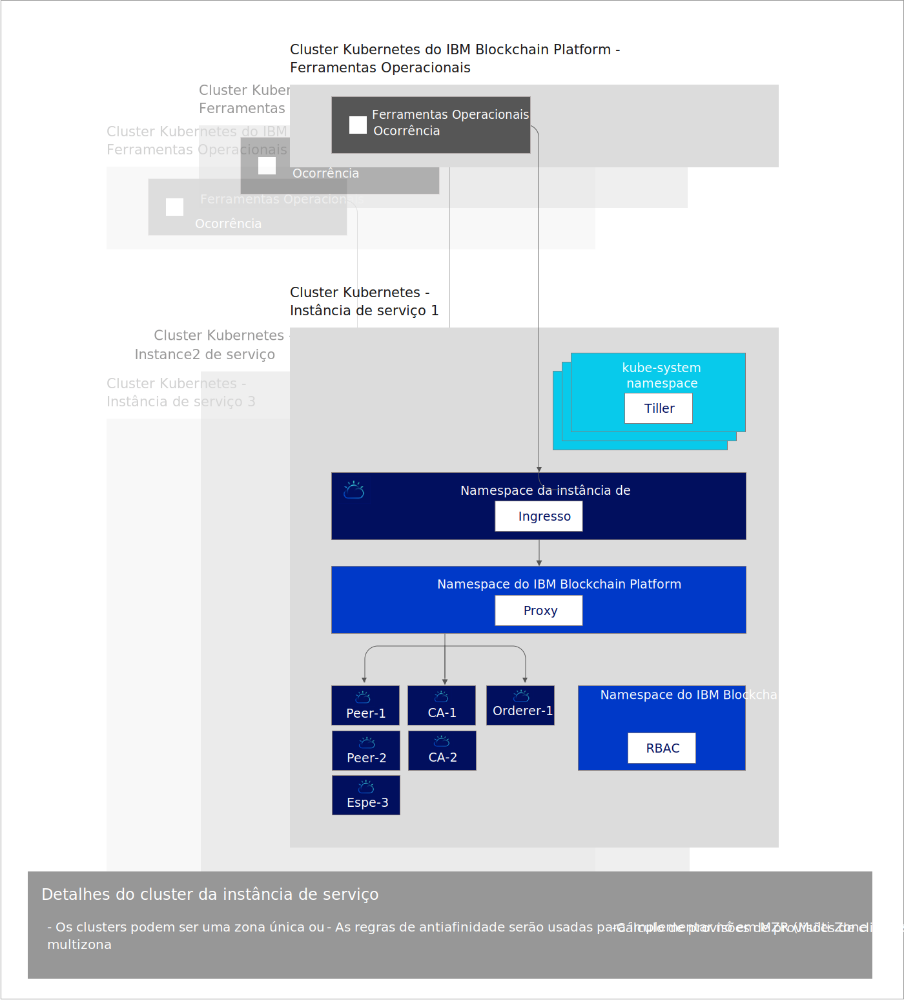

---

copyright:
  years: 2019
lastupdated: "2019-07-16"

keywords: key features, build, operate, grow, architecture, multizone clusters

subcollection: blockchain

---

{:external: target="_blank" .external}
{:shortdesc: .shortdesc}
{:screen: .screen}
{:codeblock: .codeblock}
{:note: .note}
{:important: .important}
{:tip: .tip}
{:pre: .pre}

# Sobre o {{site.data.keyword.blockchainfull_notm}} Platform for {{site.data.keyword.cloud_notm}}
{: #ibp-console-overview}

O {{site.data.keyword.blockchainfull}} Platform for {{site.data.keyword.cloud_notm}} é a próxima geração de ofertas do {{site.data.keyword.blockchainfull_notm}} Platform, que fornece controle total sobre suas implementações, certificados e chaves privadas. Ele inclui o novo console do {{site.data.keyword.blockchainfull_notm}} Platform, uma interface com o usuário que pode simplificar e acelerar o processo de implementação de componentes em um {{site.data.keyword.cloud_notm}} Kubernetes Service gerenciado e controlado por você. Para obter mais informações sobre o Kubernetes e o {{site.data.keyword.cloud_notm}} Kubernetes Service, consulte [Kubernetes](/docs/services/blockchain/reference?topic=blockchain-k8s-overview).
{:shortdesc}

O {{site.data.keyword.blockchainfull_notm}} Platform for {{site.data.keyword.cloud_notm}} é baseado no Hyperledger Fabric 1.4.1. Para obter mais informações sobre os novos recursos do Hyperledger Fabric 1.4.1, consulte [O que há de novo no 1.4](https://hyperledger-fabric.readthedocs.io/en/release-1.4/whatsnew.html){: external}.

## O que a nova liberação oferece
{: #ibp-console-overview-capabilities}

Essa liberação mais recente é customizada para usuários experientes do {{site.data.keyword.blockchainfull_notm}} e do Hyperledger Fabric e permite que eles hospedem e se associem a redes do {{site.data.keyword.blockchainfull_notm}}. Se você for um cliente do Starter ou do Enterprise Plan existente, em vez de a {{site.data.keyword.IBM_notm}} gerenciar sua rede, você terá agora o controle total com a capacidade de provisionar, monitorar e gerenciar seus componentes dentro de seu próprio cluster Kubernetes.

Essa liberação do {{site.data.keyword.blockchainfull_notm}} Platform inclui os recursos-chave a seguir:

**DESENVOLVA ---- Experiência de desenvolvedor integrada**
- **Codifique facilmente** seus contratos inteligentes em Node.js, Golang ou Java, grave aplicativos clientes usando a nova extensão {{site.data.keyword.blockchainfull_notm}} VS Code, aproveite a **integração do SDK** com o console e aprenda com nossos tutoriais e amostras valiosos.
- **DevOps simplificado** permite mover de desenvolvimento para testar para produção em um único ambiente, escalando para cima seus recursos do Kubernetes para incluir mais componentes.
- **Recursos-chave atualizados do Fabric**. Aproveite os recursos mais recentes do Hyperledger Fabric v1.4.1:
  -  [Serviço de pedido do Raft](https://hyperledger-fabric.readthedocs.io/en/release-1.4/orderer/ordering_service.html#raft){: external}
  - [Coletas de **dados privados**](/docs/services/blockchain/howto?topic=blockchain-ibp-console-smart-contracts#ibp-console-smart-contracts-private-data) que fornecem privacidade de dados aumentada, assegurando que os dados contábeis sejam compartilhados apenas com peers autorizados através do protocolo gossip.
  - [Descoberta de serviço](https://hyperledger-fabric.readthedocs.io/en/release-1.4/discovery-overview.html){: external}, permitindo que você descubra e atualize dinamicamente como seu aplicativo interage com sua rede.
  - [Listas de controle de acesso ao canal](https://hyperledger-fabric.readthedocs.io/en/release-1.4/access_control.html){: external} que permitem o controle adicional da governança de seus canais e contratos inteligentes.
- Integração do serviço {{site.data.keyword.cloud_notm}}. Aproveite os [serviços integrados do {{site.data.keyword.cloud_notm}}](/docs/services/blockchain/howto?topic=blockchain-ibp-v2-deploy-iks#ibp-v2-deploy-iks-integrations), como o {{site.data.keyword.cloud_notm}} Kubernetes Service Dashboard, o {{site.data.keyword.IBM_notm}} Log Analysis com LogDNA e o {{site.data.keyword.cloud_notm}} Identity and Access Management (IAM).

**OPERE --- Controle total de suas implementações**
- ** Implemente somente os componentes necessários **. Conectar um peer a múltiplos canais e redes ou hospede um serviço de solicitação ao qual os parceiros de negócios podem se conectar.
- ** Manter o controle completo de suas identidades **. Armazene e gerencie as chaves que são usadas para administrar seus nós sem armazenar suas chaves privadas no {{site.data.keyword.cloud_notm}}.
- **Operação centralizada**. O console do {{site.data.keyword.blockchainfull_notm}} Platform permite implementar e gerenciar todas as suas organizações e nós em **um console central** sem ter que depender da {{site.data.keyword.IBM_notm}} ou de outros fornecedores para gerenciar seus solicitadores ou Autoridades de certificação. Também é possível incluir ou remover membros de um consórcio de blockchain, criar e associar canais e instalar e instanciar contratos inteligentes por meio de seu console.
- **Hospedar ou se associar a uma rede**. Implemente peers hospedados em seu cluster para múltiplos canais em múltiplas nuvens ou convide outras organizações para associar seu consórcio ou canais enquanto as organizações gerenciam seus nós de forma independente entre as infraestruturas.
- **Gerencie o acesso** dos usuários que podem administrar ou monitorar seus nós.
- **Acesso direto aos logs** de seus nós por meio do serviço {{site.data.keyword.IBM_notm}} Kubernetes. Use o serviço {{site.data.keyword.cloud_notm}} Log Analysis ou um serviço de terceiro para extrair e analisar seus logs.
- **Interaja diretamente com seus pods** usando o Painel do Kubernetes. Use o executável em seus pods e contêineres para executar comandos e atualizar certificados por meio da linha de comandos.
- **Coleção de assinatura dinâmica** que permite melhor controle sobre a governança colaborativa em configurações de canal.

**CRESÇA --- Escalabilidade e flexibilidade**
- **Escolha seu cálculo**. Você tem a flexibilidade de decidir a quantia de CPU, de memória e de armazenamento que você deseja provisionar em seu cluster Kubernetes. Para obter mais informações, consulte [Como o {{site.data.keyword.cloud_notm}} Kubernetes Service interage com o console](/docs/services/blockchain/howto?topic=blockchain-ibp-console-govern#ibp-console-govern-iks-console-interaction).
- **Escale** para cima e para baixo os recursos em seu cluster Kubernetes, pagando somente pelo que você precisa. Para obter mais informações, consulte [Precificação](/docs/services/blockchain/howto?topic=blockchain-ibp-pricing#ibp-pricing).
- **Recuperação de desastre e alta disponibilidade de multiregion.** Essa opção duplica sua implementação do Kubernetes entre regiões, permitindo a alta disponibilidade (HA) de seus componentes e a recuperação de desastre (DR).
- **Execute em qualquer lugar** (instruções em breve). Graças ao **código base unificado** do console do {{site.data.keyword.blockchainfull_notm}} Platform, é possível executar seus componentes em nuvens públicas do {{site.data.keyword.cloud_notm}}, do {{site.data.keyword.cloud_notm}} Private e de terceiros.

Consulte este [blog](https://www.ibm.com/blogs/blockchain/2019/02/taking-the-next-step-towards-deploying-blockchain-anywhere){: external} sobre a próxima etapa para implementar o blockchain para negócios em qualquer lugar.

Essa oferta é destinada a usuários experientes do Fabric que desejam construir e gerenciar suas próprias redes.

## Considerações
{: #ibp-console-overview-considerations}

Antes de implementar o console, assegure-se de que entenda as considerações a seguir:

- Como a disponibilidade da avaliação beta e a liberação em disponibilidade geral (GA) do {{site.data.keyword.blockchainfull_notm}} Platform se sobreporão, será importante certificar-se de que você saiba qual versão do {{site.data.keyword.blockchainfull_notm}} Platform está sendo usada. Os novos recursos e correções não serão enviados por push para o beta, mas eles estarão disponíveis na versão GA do {{site.data.keyword.blockchainfull_notm}} Platform. Como resultado, se você estiver usando a versão beta do {{site.data.keyword.blockchainfull_notm}} Plataforma, provavelmente alguns painéis em seu console não corresponderão à documentação atual, que é mantida atualizada com a instância de serviço geralmente disponível. Para obter os benefícios de toda a funcionalidade mais recente, é recomendável provisionar uma nova instância de serviço GA. Para aprender a fazer isso, consulte [Introdução ao {{site.data.keyword.blockchainfull_notm}} Platform for {{site.data.keyword.cloud_notm}}](/docs/services/blockchain/howto?topic=blockchain-ibp-v2-deploy-iks#ibp-v2-deploy-iks).
- Todos os peers implementados com essa liberação usam o CouchDB como seu banco de dados de estado.
- Você é responsável pelo gerenciamento do monitoramento de funcionamento, da segurança e da criação de log do cluster Kubernetes. Consulte estas [informações](/docs/containers?topic=containers-responsibilities_iks#your-responsibilities-by-using-ibm-cloud-kubernetes-service){: external} para obter detalhes sobre o que o {{site.data.keyword.cloud_notm}} gerencia e o que é responsabilidade sua.
- Você também é responsável por monitorar o uso de recurso de seu cluster Kubernetes. Para monitorar os recursos do Kubernetes, recomendamos usar a ferramenta [{{site.data.keyword.cloud_notm}} SysDig](https://www.ibm.com/cloud/sysdig){: external} em combinação com seu painel do {{site.data.keyword.cloud_notm}} Kubernetes. Se for necessário aumentar a capacidade de armazenamento ou o desempenho de seu cluster, consulte estas informações sobre como [modificar seu volume existente](/docs/containers?topic=containers-file_storage#change_storage_configuration){: external}.
- Você é responsável por gerenciar e proteger seus certificados e chaves privadas. O {{site.data.keyword.IBM_notm}} não armazena seus certificados no cluster Kubernetes ou no console. Eles são mantidos somente no armazenamento local de seu navegador. Se você alternar navegadores, será necessário importar suas identidades criadas para esse navegador.
- O {{site.data.keyword.blockchainfull_notm}} Platform está disponível em regiões selecionadas. Consulte este tópico em [Locais do {{site.data.keyword.blockchainfull_notm}} Platform](/docs/services/blockchain/howto?topic=blockchain-ibp-regions-locations) para obter uma lista atualizada.
- O {{site.data.keyword.blockchainfull_notm}} Platform não pode ser implementado em clusters do OpenShift criados usando o serviço do {{site.data.keyword.IBM_notm}} Kubernetes.
- A versão do Kubernetes deve ser 1.11 ou uma versão estável mais alta no cluster Kubernetes do {{site.data.keyword.cloud_notm}}. Use estas instruções para [fazer upgrade de seus clusters novos e existentes](/docs/services/blockchain/howto?topic=blockchain-ibp-v2-deploy-iks#ibp-v2-deploy-iks-updating-kubernetes) para esta versão.
- Se não desejar usar o armazenamento de Arquivo bronze padrão pré-selecionado para você ao provisionar um cluster Kubernetes no {{site.data.keyword.cloud_notm}}, será possível provisionar o armazenamento de sua escolha. Consulte esse tópico em [Considerações de armazenamento persistente](/docs/services/blockchain?topic=blockchain-ibp-v2-deploy-iks#ibp-console-storage) para saber mais.
- No caso de decidir incluir o suporte de várias zonas do {{site.data.keyword.cloud_notm}} no cluster Kubernetes, deve-se provisionar seu próprio armazenamento. Consulte [Usando clusters de Várias zonas (MZR) com o {{site.data.keyword.blockchainfull_notm}} Platform](/docs/services/blockchain?topic=blockchain-ibp-v2-deploy-iks#ibp-console-mzr) para obter mais detalhes.
- É possível visualizar o {{site.data.keyword.blockchainfull_notm}} Platform sem encargos por 30 dias ao vincular sua instância de serviço do {{site.data.keyword.blockchainfull_notm}} Platform a um cluster grátis do {{site.data.keyword.cloud_notm}} Kubernetes.  O desempenho será limitado por rendimento, armazenamento e funcionalidade. O {{site.data.keyword.cloud_notm}} excluirá seu cluster após 30 dias e não será possível migrar nenhum nó ou dado de um cluster grátis para um cluster pago. E embora a avaliação beta do {{site.data.keyword.blockchainfull_notm}} Platform seja grátis, se você escolher um cluster Kubernetes pago em vez do cluster grátis limitado, encargos incorrerão para o serviço Kubernetes em sua conta do {{site.data.keyword.cloud_notm}}.
- O Virtual Routing and Forwarding (VRF) não é suportado. O serviço {site.data.keyword.blockchainfull_notm}} Platform não é compatível com as contas que são ativadas para o roteamento global automático entre os blocos de IP de sub-rede. Da mesma forma, os clusters Kubernetes que são configurados com VLANs privadas também não são suportados.

## Migração
{: #ibp-console-overview-migration}

Atualmente, a migração de qualquer oferta do {{site.data.keyword.blockchainfull_notm}} Plaftorm para o {{site.data.keyword.blockchainfull_notm}} Platform for {{site.data.keyword.cloud_notm}} não é possível.

Nenhuma das instâncias de serviço de avaliação beta da plataforma do {{site.data.keyword.blockchainfull_notm}} pode ser migrada para a liberação em disponibilidade geral (GA).

## Licença e precificação
{: #ibp-console-overview-license-and-pricing}

O{{site.data.keyword.blockchainfull_notm}} Platform for {{site.data.keyword.cloud_notm}} apresenta um novo modelo de precificação por hora com base no uso do núcleo do processador virtual (VPC). O modelo simplificado é baseado na quantia de CPU (ou VPC) que os seus nós do {{site.data.keyword.blockchainfull_notm}} Platform consomem por hora, em uma taxa fixa de **$0,29 USD/VPC-hora**, em que **1 VPC = 1 CPU**. Consulte este tópico sobre [Precificação](/docs/services/blockchain?topic=blockchain-ibp-saas-pricing) para obter mais detalhes.

## Iniciar
{: #ibp-console-overview-deploy}

Para obter informações sobre como implementar o {{site.data.keyword.blockchainfull_notm}} Platform for {{site.data.keyword.cloud_notm}}, consulte [Introdução ao {{site.data.keyword.blockchainfull_notm}} Platform for {{site.data.keyword.cloud_notm}}](/docs/services/blockchain/howto?topic=blockchain-ibp-v2-deploy-iks#ibp-v2-deploy-iks).

Para obter mais informações sobre como usar o console para começar a implementar nós e construir o consórcio, veja o tutorial [Construindo sua rede](/docs/services/blockchain/howto?topic=blockchain-ibp-console-build-network#ibp-console-build-network). Este tutorial orienta você durante o processo de uso do console para criar uma rede de amostra com três organizações, uma organização de pedido, duas organizações de peer e um canal com dois peers associados a ele. É possível usar essa rede de amostra para obter demonstrações ou provas de conceito ou ajustar e expandir as etapas no tutorial para criar sua própria configuração de blockchain customizado.

## Referência de arquitetura
{: #ibp-console-overview-architecture}

A ilustração a seguir mostra os componentes de sua rede de blockchain e como eles interagem.

Observe como uma única instância do console, conhecido como Conjunto de ferramentas operacionais, é criada para cada Instância de serviço do {{site.data.keyword.blockchainfull_notm}} Plataform. Quando um nó de peer, solicitador ou CA é implementado usando o console, ele é implementado na **Instância de serviço de cluster Kubernetes**.

| **Cluster Kubernetes do {{site.data.keyword.blockchainfull_notm}} Platform** | **Descrição** |
| ------------------------- |-----------|
| Ferramentas Operacionais | Conhecida como `console`, essa é a interface com o usuário central para operar todos os componentes de blockchain. Com esse console, agora é possível criar nós de CA, peer e solicitador, criar canais e instalar e instanciar contratos inteligentes desenvolvidos com a extensão do Código de VS do Hyperledger Fabric v1.4. O console é implementado em um cluster pertencente à {{site.data.keyword.IBM_notm}}. Não há encargos para esse conjunto de ferramentas ou o cluster Kubernetes no qual ele é executado.|

| **Instância de serviço de cluster Kubernetes** | **Descrição** |
| ------------------------- |-----------|-----------|-----------|
| **Tiller** | Parte do [conjunto de ferramentas do Helm](https://docs.helm.sh/glossary/#tiller){: external}, o Tiller é executado dentro do cluster do Kubernetes para gerenciar as instalações de seus gráficos do Helm do peer, da CA e do solicitador. |
| **Ingresso** | Um [objeto do Kubernetes](https://kubernetes.io/docs/concepts/services-networking/ingress/){: external} que permite acesso aos recursos de cluster de fora do cluster. |
| **Proxy** | O proxy do {{site.data.keyword.blockchainfull_notm}} Platform é responsável por rotear o tráfego para os nós de peer, CA e solicitador corretos usando o roteamento de cabeçalho do host. |
| **Peers, CAs, solicitadores** | Esses são os nós que são criados implementando os gráficos do Helm subjacentes. Nota: esses nós também poderiam ser importados de outras Instâncias de serviço de cluster Kubernetes. Como as chaves nunca são armazenadas pelo {{site.data.keyword.IBM_notm}}, cada nó de peer e solicitador inclui um proxy da web gRPC que permite que o console se comunique com cada nó usando as chaves na carteira eletrônica do console. |
| **RBAC** | Controle de acesso baseado na função.  O {{site.data.keyword.blockchainfull_notm}} Platform configura o [RBAC do Kubernetes](https://kubernetes.io/docs/reference/access-authn-authz/rbac/){: external} no cluster que é necessário para gerenciar os componentes de blockchain no o cluster.

## Obtendo Suporte
{: #ibp-console-overview-support}

Para obter mais informações sobre como obter suporte no {{site.data.keyword.blockchainfull_notm}} Platform for {{site.data.keyword.cloud_notm}}, bem como recursos grátis de desenvolvedor de blockchain e fóruns de suporte que possam ser usados para solucionar problemas, consulte [Obtendo suporte](/docs/services/blockchain?topic=blockchain-blockchain-support#blockchain-support).

O suporte para a avaliação beta do {{site.data.keyword.blockchainfull_notm}} Platform é limitado durante o período beta que termina em 3 de agosto de 2019.
