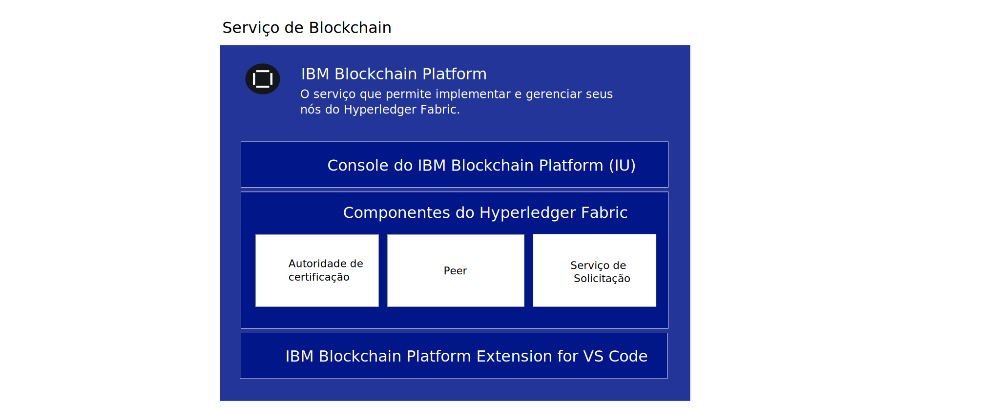
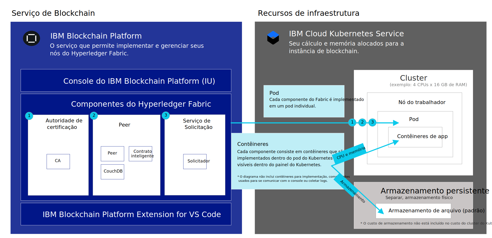

---

copyright:
  years: 2019
lastupdated: "2019-05-31"

keywords: getting started tutorials, videos, web browsers

subcollection: blockchain

---

{:external: target="_blank" .external}
{:shortdesc: .shortdesc}
{:screen: .screen}
{:codeblock: .codeblock}
{:note: .note}
{:important: .important}
{:tip: .tip}
{:pre: .pre}
{:gif: data-image-type='gif'}

# Introdução ao {{site.data.keyword.blockchainfull_notm}} Platform for {{site.data.keyword.cloud_notm}}
{: #ibp-v2-deploy-iks}

O {{site.data.keyword.blockchainfull}} Platform for {{site.data.keyword.cloud_notm}} inclui o console do {{site.data.keyword.blockchainfull_notm}} Platform, uma interface com o usuário que pode simplificar e acelerar sua jornada para implementar e gerenciar componentes de blockchain. Este tutorial descreve como começar a usar o {{site.data.keyword.blockchainfull_notm}} Platform for {{site.data.keyword.cloud_notm}} e usar o console para implementar e gerenciar componentes de blockchain em seu cluster do {{site.data.keyword.cloud_notm}} Kubernetes Service no {{site.data.keyword.cloud_notm}}. Para obter mais informações sobre o Kubernetes e o {{site.data.keyword.cloud_notm}} Kubernetes Service, consulte [Kubernetes](/docs/services/blockchain/reference/k8s.html "Kubernetes").
{:shortdesc}

**Público-alvo:** este tópico destina-se a administradores de sistema responsáveis pela configuração de um cluster Kubernetes no {{site.data.keyword.cloud_notm}} e pela implementação do {{site.data.keyword.blockchainfull_notm}} Platform.

Depois de vincular seu {{site.data.keyword.blockchainfull_notm}} Platform a seu cluster Kubernetes do {{site.data.keyword.cloud_notm}}, é possível ativar o console para criar e gerenciar os componentes de blockchain e experimentar os benefícios importantes a seguir:

- **Controle:** você controla e gerencia seus componentes e certificados de blockchain por meio de um console central. Implemente somente os componentes necessários para seus negócios e inclua mais à medida que sua necessidade aumentar.
- **Implementação flexível baseada em Kubernetes:** é possível aproveitar as opções de cálculo (CPU, memória, armazenamento) para o cluster Kubernetes e alavancar as opções de HA e DR integrados.

## O que é serviço de blockchain?
{: #ibp-v2-deploy-iks-blockhain-service}

O diagrama a seguir ilustra os três elementos do {{site.data.keyword.blockchainfull_notm}} Platform:



- **Console do {{site.data.keyword.blockchainfull_notm}} (IU)**: esse é o console que permite criar e gerenciar os componentes de blockchain. Depois de fornecer uma instância de serviço no {{site.data.keyword.cloud_notm}}, é possível implementar uma instância do console do {{site.data.keyword.blockchainfull_notm}} e vinculá-la ao seu cluster do Kubernetes do {{site.data.keyword.cloud_notm}}. Em seguida, é possível usar o console para criar um gerenciamento de componentes de blockchain em seu cluster do Kubernetes. Não há encargos para o console.

- **Componentes do Hyperledger Fabric**: o console é usado para criar e gerenciar componentes de blockchain que se baseiam nas imagens de autoridade de certificação do Hyperledger Fabric v1.4.1, do peer e do serviço de pedido.  Esses componentes são implementados em seu cluster do Kubernetes e o armazenamento é fornecido para eles usando a classe de armazenamento `default` quando eles são implementados.

- **Extensão VS Code da {{site.data.keyword.IBM_notm}} (ferramentas de desenvolvimento)**: faça download da extensão VS Code por meio do mercado do VS Code para começar a desenvolver, empacotar e testar aplicativos clientes e contratos inteligentes.

## Considerações
{: #ibp-v2-deploy-iks-considerations}

Antes de implementar o console, assegure-se de que entenda as considerações a seguir:

- O {{site.data.keyword.blockchainfull_notm}} Platform for {{site.data.keyword.cloud_notm}} é construído com o Hyperledger Fabric v1.4.1.
- Todos os peers implementados com o console ou APIs usam o CouchDB como seu banco de dados de estado.
- Você tem a opção de vincular sua instância de serviço do {{site.data.keyword.blockchainfull_notm}} Platform a um cluster Kubernetes grátis para avaliação da oferta, no entanto, a capacidade e o desempenho são limitados, nenhum de seus dados pode ser migrado e o cluster é excluído após 30 dias.
- Embora a avaliação beta seja grátis, você ainda precisará pagar pelo cluster Kubernetes, se escolher um cluster pago.
- Você é responsável pelo gerenciamento do monitoramento de funcionamento, da segurança e da criação de log do cluster Kubernetes. Consulte estas [informações](/docs/containers/cs_responsibilities.html#your-responsibilities-by-using-ibm-cloud-kubernetes-service){: external} para obter detalhes sobre o que o {{site.data.keyword.cloud_notm}} gerencia e o que é responsabilidade sua.
- Você também é responsável por monitorar o uso de recursos de seu cluster Kubernetes usando o painel do Kubernetes. Se for necessário aumentar a capacidade de armazenamento ou o desempenho de seu cluster, consulte estas informações sobre como [modificar seu volume existente](/docs/containers/cs_storage_file.html#change_storage_configuration){: external}.
- Você é responsável por gerenciar e proteger seus certificados e chaves privadas. A {{site.data.keyword.IBM_notm}} não armazena seus certificados no cluster do Kubernetes.
- O {{site.data.keyword.blockchainfull_notm}} Platform está disponível em regiões selecionadas. Consulte este tópico em [Locais do {{site.data.keyword.blockchainfull_notm}} Platform](/docs/services/blockchain/howto?topic=blockchain-ibp-regions-locations) para obter uma lista atualizada.
- A versão do Kubernetes deve ser 1.11 ou uma versão estável mais alta no cluster Kubernetes do {{site.data.keyword.cloud_notm}}. Use estas instruções para [fazer upgrade de seus clusters novos e existentes](/docs/services/blockchain/howto/ibp-v2-deploy-iks.html#ibp-v2-deploy-iks-updating-kubernetes) para esta versão.
- Se não desejar usar o armazenamento de Arquivo bronze padrão pré-selecionado para você ao provisionar um cluster Kubernetes no {{site.data.keyword.cloud_notm}}, será possível provisionar o armazenamento de sua escolha. Consulte esse tópico em [Considerações de armazenamento persistente](/docs/services/blockchain?topic=blockchain-ibp-v2-deploy-iks#ibp-console-storage) para saber mais.
- No caso de decidir incluir o suporte de várias zonas do {{site.data.keyword.cloud_notm}} no cluster Kubernetes, deve-se provisionar seu próprio armazenamento. Consulte [Usando clusters de Várias zonas (MZR) com o {{site.data.keyword.blockchainfull_notm}} Platform](/docs/services/blockchain?topic=blockchain-ibp-v2-deploy-iks#ibp-console-mzr) para obter mais detalhes.

## Tutorial de vídeo
{: #ibp-v2-deploy-video}

Assista à [série de vídeos]( http://ibm.biz/BlockchainPlatformSeries) a seguir para saber mais sobre o console do {{site.data.keyword.blockchainfull_notm}} Platform e como é possível começar a implementar o {{site.data.keyword.blockchainfull_notm}} Platform for {{site.data.keyword.cloud_notm}}.

## Antes de iniciar
{: #ibp-v2-deploy-iks-prereq}

Antes de iniciar:

- Assegure-se de que você tenha uma [{{site.data.keyword.cloud_notm}} conta paga](https://cloud.ibm.com/catalog/services/blockchain){: external}. Se você não tiver uma conta:
   1. Clique no botão  ** Inscrever-se ** .
   2. Após você criar uma conta de avaliação grátis, faça upgrade dela para um tipo **Pré-pago** acessando **Gerenciar** > **Faturamento e uso** > **Faturamento** no console do {{site.data.keyword.cloud_notm}} e clicando em **Incluir cartão de crédito**.
   3. Certifique-se de que o usuário tenha as funções Administrador e Gerenciador para o cluster Kubernetes que ele vinculará à sua instância de serviço de blockchain. Consulte essas etapas sobre [como designar as funções de acesso do Kubernetes](#ibp-v2-deploy-iks-k8x-access-roles) para obter mais informações.

Ao planejar usar a instância de serviço no contexto de uma solução mais ampla de toda a organização, recomenda-se que as organizações participantes usem um endereço de e-mail funcional para criar sua rede. Nesse caso, o acesso à rede não depende da disponibilidade de um único indivíduo.
{:tip}  

- Se você planeja usar um cluster existente do {{site.data.keyword.cloud_notm}} Kubernetes Service, verifique a versão do Kubernetes e faça upgrade dela para 1.11 ou superior, se necessário. Para obter mais informações sobre como determinar qual versão do Kubernetes seu cluster está executando e como fazer upgrade da versão, veja [Atualizando a versão do Kubernetes de seu cluster](/docs/services/blockchain/howto/ibp-v2-deploy-iks.html#ibp-v2-deploy-iks-updating-kubernetes).

### Navegadores
{: #ibp-v2-deploy-iks-browsers}
A lista a seguir especifica o software do navegador mínimo necessário para o console do {{site.data.keyword.blockchainfull_notm}} Platform:

- Chrome: versão mais recente para seu sistema operacional
- Firefox: versões mais recentes regulares (não ESR) para seu sistema operacional
- Safari: versão mais recente para Mac
- Borda: v44.17763.1.0 ou mais recente

### Recursos necessários
{: #ibp-v2-deploy-iks-resources-required}

#### Recomendações de tamanho do cluster
{: #ibp-v2-deploy-iks-resources-required-free}

 Ao vincular seu console do {{site.data.keyword.blockchainfull_notm}} Platform a um cluster do {{site.data.keyword.cloud_notm}} Kubernetes Service, é necessário assegurar-se de que seu cluster do Kubernetes atenda aos requisitos mínimos de recurso de hardware:

|Tipo de cluster do Kubernetes | Caso de uso | CPU | RAM | Nós do Trabalhador |
|-----------|------|-----|-----------------------|
|Padrão (Recomendado) | Adequado para MVPs | 4 (Compartilhado) | 16 GB (compartilhado)|múltiplos|
|Grátis** | Adequado para avaliação | 2 | 4 GB | 1 |  
** Visualize o {{site.data.keyword.blockchainfull_notm}} Platform sem encargos por 30 dias ao vincular sua instância de serviço do {{site.data.keyword.blockchainfull_notm}} Platform a um cluster grátis do {{site.data.keyword.cloud_notm}} Kubernetes. O desempenho será limitado por rendimento, armazenamento e funcionalidade. O {{site.data.keyword.cloud_notm}} excluirá seu cluster Kubernetes após 30 dias e não será possível migrar nós nem dados de um cluster grátis para um cluster pago.

Esses recursos são suficientes para teste e experimentação. O [tutorial Construir uma rede](/docs/services/blockchain/howto/ibp-console-build-network.html#ibp-console-build-network), no qual você cria dois peers, duas CAs e um serviço de pedido, ocupa aproximadamente 4,85 CPUs, com o serviço de pedido de cinco nós ocupando 2,25 CPUs disso. Portanto, se você planejar implementar um serviço de pedido de cinco nós, não será necessário implementar um cluster do Kubernetes com um nó do trabalhador único de 2 CPUs nele, pois o serviço de pedido não se ajustará. Recomendamos um cluster com nós de pelo menos 4 CPUs. Quanto mais nós do trabalhador você incluir, mais facilmente o seu cluster será capaz de manipular suas implementações.
{:note}

#### Clusters pagos
{: #ibp-v2-deploy-iks-resources-required-paid}

As implementações no nível de produção do {{site.data.keyword.blockchainfull_notm}} Platform serão realizadas em um cluster pago do serviço {{site.data.keyword.cloud_notm}} Kubernetes. O tamanho e a configuração desse cluster dependerão das necessidades de seu caso de uso específico. Implementações maiores precisarão necessariamente ser realizadas em clusters maiores. Você decide quão maior o seu cluster será do que a implementação que você projetou. Ter pelo menos alguma altura livre é desejável, pois isso permitirá que os peers e os serviços de pedido façam parte de canais adicionais e assumam maior rendimento sem precisar implementar recursos adicionais em seu cluster do Kubernetes **antes** de ajustar o tamanho de seus nós. Para obter mais informações sobre como esses valores são ajustados, consulte [Realocando recursos](/docs/services/blockchain/howto/ibp-console-govern.html#ibp-console-govern-reallocate-resources).

A criação de uma implementação inicial de tamanho suficiente para permitir o crescimento é particularmente importante para os usuários que escolherão não usar o [escalador automático do {{site.data.keyword.cloud_notm}} Kubernetes Service](/docs/containers?topic=containers-ca#ca){: external}, que pode assumir parte da carga de implementação de nós e pods adicionais para o usuário.

Embora seja mais simples ter recursos suficientes implementados no serviço {{site.data.keyword.cloud_notm}} Kubernetes e ser capaz de expandir seus pods e nós do trabalhador conforme adequado, sem ter que aumentar primeiro sua implementação do cluster Kubernetes, quanto maior a implementação no serviço Kubernetes, mais cara ela será. Os usuários precisarão considerar suas opções cuidadosamente e reconhecer as trocas que estão fazendo, independentemente da opção que escolherem.

Para ter uma ideia de quanto armazenamento e computação você precisará em seu cluster, consulte este gráfico, que contém os padrões atuais para o peer, o nó de pedido e a CA:

| **Componente** (todos os contêineres) | CPU  | Memória (GB) | Armazenamento (GB) |
|--------------------------------|---------------|-----------------------|------------------------|
| **Peer**                       | 1,2            | 2.4                  | 200 (inclui 100 GB para peer e 100 GB para CouchDB)|
| **CA**                         | 0,1            | 0,2                  | 20                     |
| **Nó de pedido**              | 0,45           | 0,9                  | 100                    |

Se você planeja implementar um serviço de solicitação de Raft de cinco nós, observe que sua implementação de nó de pedido aumentará em um fator de cinco. Portanto, um total de 2,25 de CPU, 4,5 GB de memória e 500 GB de armazenamento para os cinco nós Raft. Isso torna o serviço de solicitação de cinco nós maior que um único nó de trabalhador do Kubernetes de 2 CPUs.
{:tip}

## Etapa um: criar uma instância de serviço no {{site.data.keyword.cloud_notm}}
{: #ibp-v2-deploy-iks-create-service-instance}

Use as etapas a seguir para criar uma instância de serviço do {{site.data.keyword.blockchainfull_notm}} Platform for {{site.data.keyword.cloud_notm}}.

1. Localize o [Serviço de blockchain](https://cloud.ibm.com/catalog/services/blockchain){: external} no catálogo do {{site.data.keyword.cloud_notm}} ou procure por `Blockchain` em sua página Catálogo do {{site.data.keyword.cloud_notm}}.
2. Recomendamos que você renomeie o **Nome do serviço** da sua instância para que seja possível reconhecê-lo facilmente no futuro.
3. Para Beta, **Dallas** é a única região disponível e não pode ser mudada. Regiões adicionais podem ser escolhidas em um cluster pago. Para obter informações adicionais, consulte
[Regiões](/docs/services/blockchain/reference/ibp_regions.html#ibp-regions-locations).
4. É possível deixar os campos de grupo de recursos e de tags sem mudanças.
5. Escolha o plano **Standard**.
6. Clique em **Criar** para provisionar a instância de serviço.

## Etapa dois: Implementar o  {{site.data.keyword.blockchainfull_notm}}  Platform
{: #ibp-v2-deploy-iks-steps}

É possível seguir a orientação para implementar o {{site.data.keyword.blockchainfull_notm}} Platform imediatamente depois de criar a instância de serviço.

1. A etapa  ** Welcome & pré-ites ** . Se você já tiver um cluster do {{site.data.keyword.IBM_notm}} Kubernetes Service existente na região **Dallas** e desejar usá-lo para o seu serviço de blockchain, marque a caixa de seleção. **Se você usar um cluster existente, será possível ignorar a próxima etapa, mas certifique-se de que a versão do Kubernetes seja a v1.11 ou uma versão estável mais recente**. Clique em  ** Continuar **.
2. A etapa  ** Criar cluster ** . Se você marcar a caixa de seleção na etapa 1 para usar um cluster Kubernetes existente, essa etapa será ignorada. Caso contrário, clique em **Criar um novo cluster**, que ativa o painel do {{site.data.keyword.cloud_notm}} Kubernetes para criar um cluster. Para obter mais informações, consulte [Introdução ao {{site.data.keyword.cloud_notm}} Kubernetes Service](/docs/containers/getting-started.html){: external}. Permita tempo extra para que esse processo seja concluído.
  - Para obter informações sobre locais para seu cluster, consulte [Regiões](/docs/services/blockchain/reference/ibp_regions.html#ibp-regions-locations).
  - Escolha **Cluster padrão (recomendado):** se precisar de uma opção de prazo mais longo que inclua diversos nós para a alta disponibilidade. **Escolha pelo menos v.1.11 ou uma versão estável mais recente.** Para implementar um cluster pago, consulte [Criando um cluster padrão](/docs/containers?topic=containers-clusters#clusters_ui_standard){: external}. Observe que, se desejar a alta disponibilidade ou a recuperação de desastre, será necessário tomar uma decisão sobre a classe de armazenamento que está sendo usada. A classe de armazenamento `default` no cluster será usada pelo fornecimento dinâmico. Portanto, os clientes podem configurar qualquer classe de armazenamento como o padrão. Para obter mais informações, consulte [Decidindo sobre a configuração de armazenamento de arquivo](/docs/containers?topic=containers-file_storage#file_predefined_storageclass){: external}.
  - Escolha **Cluster grátis:** se você desejar visualizar a plataforma por menos de 30 dias. **Observe** que não é possível migrar de um cluster grátis para um cluster pago. O tipo grátis de cluster oferece armazenamento limitado e rendimento de transação. Para obter instruções sobre o que fazer quando o cluster Kubernetes expirar, consulte este tópico em [Expiração do cluster Kubernetes](/docs/services/blockchain/howto/ibp-console-manage.html#ibp-console-manage-console-cluster-expiration).
  - Para obter mais informações sobre as diferenças entre os clusters Kubernetes gratuitos e pagos no {{site.data.keyword.cloud_notm}}, consulte [Comparação de clusters grátis e padrão](https://cloud.ibm.com/docs/containers?topic=containers-cluster_types#cluster_types){: external}.  

   Deve-se retornar para essa guia em seu navegador depois de criar o cluster para que seja possível concluir o processo de implementação do {{site.data.keyword.blockchainfull_notm}} Platform.  
   {:important}  

  É necessário aguardar até que seu cluster seja implementado com êxito. Em seguida, clique no botão **Eu tenho um cluster**.
3. Sua versão do Kubernetes em execução em seu cluster deve estar na versão 1.11 ou superior. Siga estas [etapas](/docs/services/blockchain/howto/ibp-v2-deploy-iks.html#ibp-v2-deploy-iks-updating-kubernetes) para verificar sua versão do cluster e fazer upgrade dela, se necessário. Em seguida, volte e continue com estas instruções.
4. A etapa  ** Implementar no cluster ** . Selecione o cluster do Kubernetes no qual você deseja implementar o {{site.data.keyword.blockchainfull_notm}} Platform na lista suspensa e clique em **Implementar no cluster**.  

  Se o cluster Kubernetes não estiver visível na lista suspensa, isso poderá ser causado pelas condições a seguir:
  - O processo de criação do cluster pode levar até 60 minutos para ser concluído. Se você criou um cluster, permita algum tempo extra até que o estado de seu cluster se torne **Normal**.
  - Clusters que estão fora da região **Dallas** não são visíveis e não podem ser usados.
  - Certifique-se de que você não esteja usando a versão ESR do Firefox. Se estiver, alterne para outro navegador, como Chrome, e tente novamente.

5. A etapa  ** Ativar console ** . Depois que o {{site.data.keyword.blockchainfull_notm}} Platform tiver sido implementado com êxito, clique em **Ativar o {{site.data.keyword.blockchainfull_notm}} Platform** para abrir o console do {{site.data.keyword.blockchainfull_notm}} Platform. Pode demorar alguns minutos para que o botão se torne ativado enquanto o console estiver sendo fornecido.

A ilustração a seguir mostra como os componentes do {{site.data.keyword.blockchainfull_notm}} Platform são implementados no cluster do Kubernetes.



- **Pod**: quando cada autoridade de certificação, peer ou serviço de pedido é implementado, um novo pod é criado em um nó do trabalhador em seu cluster.
- **Contêineres de app**: os contêineres são criados dentro dos pods para cada nó que é implementado.  
- **Armazenamento persistente**: o armazenamento para cada nó é dinamicamente fornecido por meio da classe de armazenamento `default` do cluster do Kubernetes cada vez que um nó é implementado.

## (Opcional) Inclua usuários adicionais no console
{: #ibp-v2-deploy-iks-add-users}

Por padrão, o console usa o [{{site.data.keyword.cloud_notm}} Identity and Access Management (IAM)](/docs/iam?topic=iam-iamoverview#iamoverview){: external} como o provedor de serviços de identidade do {{site.data.keyword.cloud_notm}}. Seu console do {{site.data.keyword.blockchainfull_notm}} Platform é provisionado configurando o endereço de e-mail do proprietário do {{site.data.keyword.IBM_notm}} como Administrador do console. Como um Administrador, esse usuário está autorizado a conceder aos outros usuários acesso ao console por meio de seus endereços de e-mail.  Consulte estas instruções sobre como [incluir e remover usuários do console](/docs/services/blockchain?topic=blockchain-ibp-console-manage-console#ibp-console-manage-console-add-remove) para obter mais informações.

## Próximas etapas
{: #ibp-v2-deploy-iks-next-steps}

- Antes de criar qualquer nó, é necessário decidir sobre o plug-in de armazenamento para seu cluster do Kubernetes. Se você estiver apenas iniciando e experimentando coisas, o armazenamento de arquivos Bronze padrão pré-selecionado ao fornecer o cluster será o adequado. Nenhuma ação adicional é necessária neste momento.  Mas, quando você estiver pronto para implementar um cluster para teste formal ou uso de produção, será necessário decidir sobre o plug-in de armazenamento apropriado para suas necessidades. Consulte este tópico em [Considerações de armazenamento persistente](#ibp-console-storage) para começar.

- Agora que seu console está pronto para uso, é possível avançar para o [tutorial Construir uma rede](/docs/services/blockchain/howto/ibp-console-build-network.html#ibp-console-build-network).
Considere marcar a URL de seu console para que seja possível voltar em um momento posterior, se necessário. Caso contrário, será possível seguir as etapas nas [Instruções de pós-instalação](#ibp-v2-deploy-iks-post-install) para voltar a ela por meio de seu navegador.

## Atualizando a versão do Kubernetes de seu cluster
{: #ibp-v2-deploy-iks-updating-kubernetes}

Se você usar um cluster do {{site.data.keyword.cloud_notm}} Kubernetes Service existente, assegure-se de que a versão do Kubernetes esteja na versão 1.11 ou superior.

É possível verificar a versão do Kubernetes de seu cluster na [página de clusters do Kubernetes](https://cloud.ibm.com/kubernetes/clusters){: external} no {{site.data.keyword.cloud_notm}}, que lista todos os seus clusters em uma tabela.

Se a versão do Kubernetes não estiver na versão 1.11 ou superior, será necessário concluir as etapas a seguir para atualizar a versão do Kubernetes de seu cluster.

1. Clique no ícone de menu overflow no final da linha e selecione **Atualizar versão**. Esse processo leva cerca de uma hora para ser concluído. Se a versão for atualizada com êxito, será possível ver a versão atualizada de seu cluster na coluna **Versão do Kubernetes**.  
2. Selecione uma versão do Kubernetes v1.11 ou mais recente da lista suspensa da versão Kubernetes e clique em **Atualizar**.
3. Clique em seu cluster e acesse a guia **Nós do trabalhador**. Marque a caixa de seleção antes do nó de trabalho que você deseja atualizar e clique em **Atualizar o Kubernetes** na barra de menus pop-up. Se o seu cluster contiver múltiplos nós de trabalho, todos eles deverão ser atualizados.

  As atualizações para os nós do trabalhador podem causar tempo de inatividade para seus apps e serviços. A máquina do nó do trabalhador tem a imagem reinstalada, e os dados são excluídos se não [armazenados fora do pod](https://cloud.ibm.com/docs/containers/cs_storage_planning.html#persistent_storage_overview){: external}.
  {:important}

{: gif}

Para obter mais informações sobre como atualizar a versão do Kubernetes para um cluster e nós do trabalhador do {{site.data.keyword.IBM_notm}} Kubernetes Service, consulte [Atualizando clusters, nós do trabalhador e complementos](/docs/containers?topic=containers-update#update){: external}.  

Deve-se aguardar a conclusão da atualização antes de poder [continuar a implementação do {{site.data.keyword.blockchainfull_notm}} Platform](/docs/services/blockchain/howto/ibp-v2-deploy-iks.html#ibp-v2-deploy-iks-steps).

## Como designar funções de acesso do Kubernetes
{: #ibp-v2-deploy-iks-k8x-access-roles}

O usuário que vincula a instância de serviço de blockchain ao cluster Kubernetes deve ter as funções Administrador e Gerenciador no Kubernetes.
Para configurar esse acesso, deve-se concluir as etapas a seguir:
   1. No painel do {{site.data.keyword.cloud_notm}}, clique na lista suspensa **Gerenciar** e, em seguida, em **Acessar (IAM)**.
   2. No menu de navegação à esquerda, clique em **Usuários** e clique no ID do usuário que vinculará a instância de serviço ao cluster Kubernetes.
   3. Clique em **Políticas de acesso** e, em seguida, em **Designar acesso**.
   4. Clique no quadro **Designar acesso aos recursos**.
   5. Na lista suspensa **Serviços**, selecione **Serviço Kubernetes**.
   6. Marque as funções **Administrador** e **Gerenciador** para esse usuário.
   7. Clique em **Designar**.

{: gif}

Para obter mais informações sobre o controle de acesso do Kubernetes, consulte [como escolher a política de acesso e a função ideais para seus usuários](/docs/containers?topic=containers-users#access_roles).

## Instruções de pós-instalação
{: #ibp-v2-deploy-iks-post-install}

Depois de implementar seu console, é possível clicar no botão **Ativar o {{site.data.keyword.blockchainfull_notm}} Platform** para abrir o console em seu navegador. É possível incluir a URL do console como um marcador em seu navegador.

### Retornando ao seu console do {{site.data.keyword.cloud_notm}}
{: #ibp-v2-deploy-iks-rtn-to-console}

Se você não tiver a URL do console, será possível localizá-la no painel do {{site.data.keyword.cloud_notm}}.

1. Em seu navegador, abra [Lista de recursos do {{site.data.keyword.cloud_notm}}](https://cloud.ibm.com/resources){: external}. É necessário efetuar login com seu ID da {{site.data.keyword.IBM_notm}}.
2. Sua instância de serviço do {{site.data.keyword.blockchainfull_notm}} Platform é visível sob a seta **Serviços**. Localize a instância de serviço do {{site.data.keyword.blockchainfull_notm}} Platform que você implementou e clique nela.
3. No painel subsequente, clique em **Gerenciar** na navegação esquerda e, em seguida, clique em **Ativar o {{site.data.keyword.blockchainfull_notm}} Platform**.

Seu console é aberto em seu navegador.

## Considerações de armazenamento persistente
{: #ibp-console-storage}

O {{site.data.keyword.blockchainfull_notm}} Platform requer armazenamento persistente para cada CA, peer e nós de pedido. Ao implementar um cluster do Kubernetes padrão no {{site.data.keyword.cloud_notm}}, ele vem pré-configurado com o plug-in de [Armazenamento de arquivo de nível Bronze](/docs/containers?topic=containers-file_storage#file_predefined_storageclass){: external} como a classe de armazenamento `default`. Em seguida, quando você implementa um nó de blockchain para esse cluster usando o console ou as APIs, uma quantia de armazenamento de arquivos é dinamicamente fornecida para o nó com base na quantia de armazenamento que foi solicitada quando o nó foi implementado. Portanto, a implementação fornece o armazenamento no cluster com a classe de armazenamento `default`. É possível escolher entre várias opções de armazenamento do [Kubernetes](https://cloud.ibm.com/docs/containers/cs_storage_planning.html#persistent_storage_overview){: external} e decidir o tipo de armazenamento que melhor se ajusta ao seu caso de uso. Esteja ciente de que você é cobrado separadamente pelo uso de armazenamento, portanto, é possível fatorar o custo das várias opções de armazenamento ao fazer sua seleção.

Se você desejar incluir seu próprio plug-in de armazenamento, deverá criar uma classe de armazenamento customizada. Leia sobre como
[incluir uma classe de armazenamento](/docs/containers/cs_storage_basics.html#storageclasses){: external} para sua solução. Como o {{site.data.keyword.blockchainfull_notm}} Platform usa o [fornecimento de volume dinâmico](https://cloud.ibm.com/docs/containers/cs_storage_basics.html#dynamic_provisioning){: external} com a classe de armazenamento `default`, é necessário mudar a classe de armazenamento padrão para usar seu plug-in de armazenamento executando o comando a seguir:

```
kubectl patch storageclass <storageclass> -p '{"metadata": {"annotations":{"storageclass.kubernetes.io/is-default-class":"true"}}}'
```
{:codeblock}

Substitua ``<storageclass>`` pelo nome de sua classe de armazenamento.

Depois de implementar nós de blockchain em seu cluster, não é necessário mudar a classe de armazenamento padrão do cluster do Kubernetes porque você perderá o armazenamento para as CAs, os peers e os nós de pedido que já estão implementados. Portanto, é necessário decidir sobre o plug-in de armazenamento antes de implementar qualquer nó de blockchain.
{: important}

### Usando clusters multizona (MZR) com o {{site.data.keyword.blockchainfull_notm}} Platform
{: #ibp-console-mzr}

Nas regiões em que é oferecido, o [suporte a multizona](/docs/containers?topic=containers-regions-and-zones#regions_multizone){: external} é pré-selecionado por padrão quando você cria um cluster padrão do Kubernetes no {{site.data.keyword.cloud_notm}}. Embora não seja necessário, esse recurso fornece alta disponibilidade de seus nós no caso de qualquer zona, ou data center, ficar inativo. Se o seu cluster incluir suporte a multizona, será necessário trazer sua própria solução de armazenamento. É possível escolher entre várias [opções de armazenamento persistente](/docs/containers?topic=containers-storage_planning#persistent_storage_overview){: external}.

Depois de criar a classe de armazenamento, execute o comando `kubectl patch storageclass` acima para configurar a classe de armazenamento da região multizona para ser a classe de armazenamento `default`.

### Informações sobre precificação e faturamento
{: #ibp-v2-deploy-iks-pricing-billing}

- Consulte [Precificação](/docs/services/blockchain/howto?topic=blockchain-ibp-saas-pricing) se você precisar revisitar as informações de precificação do {{site.data.keyword.blockchainfull_notm}} Platform.
- Suas informações de uso atuais do {{site.data.keyword.cloud_notm}} estão disponíveis em seu [bloco de uso](https://cloud.ibm.com/billing/){: external} do painel do {{site.data.keyword.cloud_notm}} e sua fatura é visível em [informações de faturamento](https://cloud.ibm.com/billing/billing-items){: external}. Consulte este tópico em [Faturamento](/docs/services/blockchain/howto?topic=blockchain-ibp-saas-pricing#ibp-saas-pricing-billing) para obter mais detalhes sobre como o faturamento do {{site.data.keyword.blockchainfull_notm}} Platform funciona.

### Excluindo uma Instância de Serviço
{: #ibp-v2-deploy-iks-delete-service-instance}

Quando você não precisar mais de sua instância de serviço, ela poderá ser excluída do cluster Kubernetes para liberar recursos. É possível usar o painel do {{site.data.keyword.cloud_notm}} para excluir sua instância de serviço do {{site.data.keyword.blockchainfull_notm}} Platform.

1. Em seu navegador, abra [Lista de recursos do {{site.data.keyword.cloud_notm}}](https://cloud.ibm.com/resources){: external}. É necessário efetuar login com seu ID da {{site.data.keyword.IBM_notm}}.
2. Sob a seta **Serviços**, localize a instância de serviço que você deseja excluir e clique em **Excluir** no menu Ações.

**Escolha essa opção com cuidado.** Se você excluir uma instância de serviço, o armazenamento associado a cada nó será excluído e não poderá ser restaurado. Todos os seus dados contábeis serão excluídos.
{: important}

Se a exclusão da sua instância de serviço falhar, isso pode ser porque o cluster Kubernetes não está acessível. Se isso ocorrer, abra um [chamado de suporte](/docs/services/blockchain/ibmblockchain_support.html#blockchain-support-cases) para solicitar a exclusão da instância de serviço.
