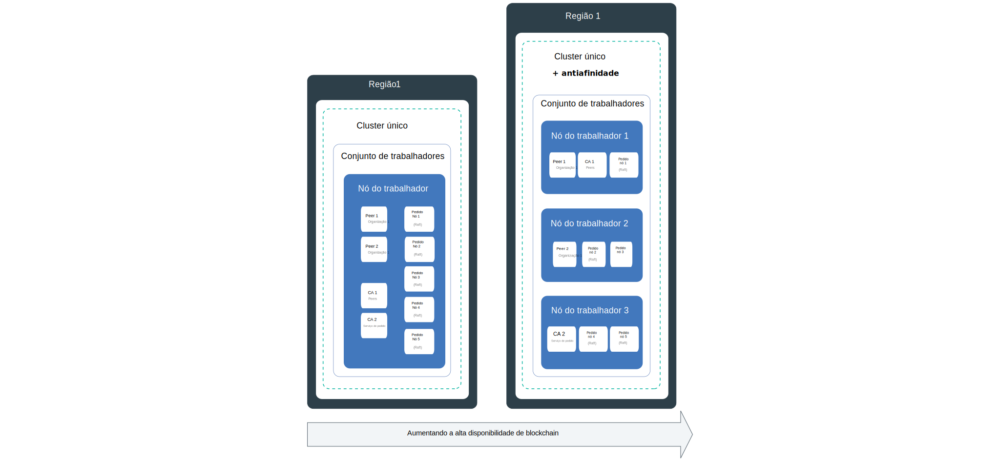
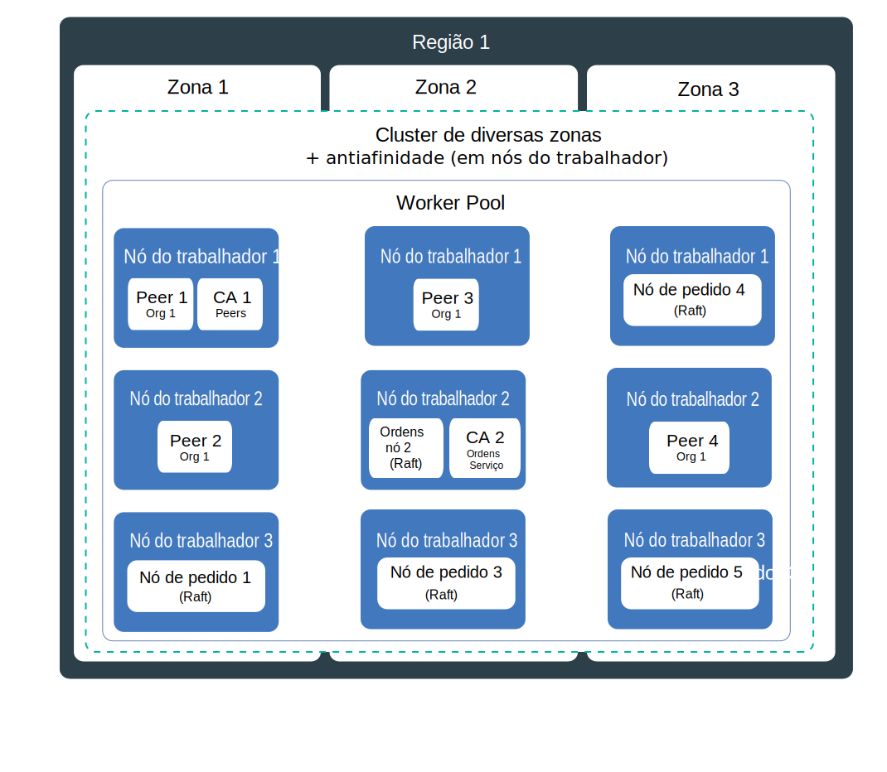
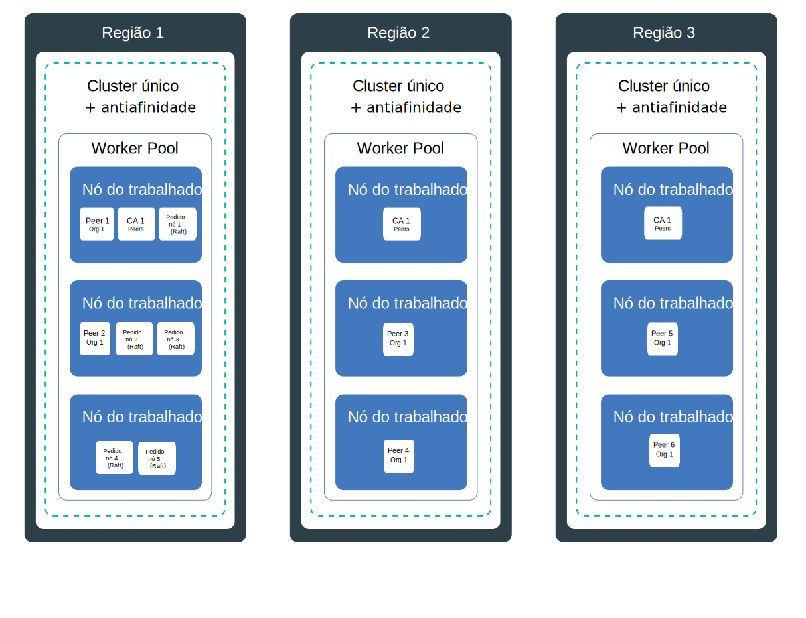

---

copyright:
  years: 2019
lastupdated: "2019-06-21"

keywords: high availability, HA, IBM Cloud, failures, zone failure, region failure, component failure, worker node failure

subcollection: blockchain

---

{:external: target="_blank" .external}
{:shortdesc: .shortdesc}
{:screen: .screen}
{:codeblock: .codeblock}
{:note: .note}
{:important: .important}
{:tip: .tip}
{:pre: .pre}

# Alta disponibilidade (HA)
{: #ibp-console-ha}

Use os recursos integrados do Kubernetes juntamente com as estratégias de implementação de componente do {{site.data.keyword.blockchainfull}} Platform para tornar suas redes de blockchain mais altamente disponíveis e protegê-las contra o tempo de inatividade quando uma falha ocorrer em seu cluster.
{:shortdesc}

**Público-alvo:** esse tópico é projetado para arquitetos e administradores de sistema que são responsáveis por planejar e configurar o {{site.data.keyword.blockchainfull_notm}} no {{site.data.keyword.cloud_notm}} ou no {{site.data.keyword.cloud_notm}} Private.

A alta disponibilidade é uma disciplina principal em uma infraestrutura de TI para manter seus apps funcionando, mesmo após uma falha de site parcial ou integral. O principal propósito de alta disponibilidade é eliminar pontos potenciais de falhas em uma infraestrutura de TI. Por exemplo, é possível se preparar para a falha de um sistema incluindo redundância e configurando mecanismos de failover.

É possível obter alta disponibilidade em diferentes níveis em sua infraestrutura de TI e dentro de diferentes camadas de seu cluster. O nível de disponibilidade correto para você depende de vários fatores, como os requisitos de negócios, os Acordos de Nível de Serviço que você tem com suas organizações e o custo de redundância.

Antes de continuar, recomendamos que você revise sua orientação específica da plataforma para HA:
- Se você estiver usando o {{site.data.keyword.cloud_notm}}, será possível ler mais sobre como a HA funciona com o Kubernetes no {{site.data.keyword.cloud_notm}} neste tópico em [Alta disponibilidade para o {{site.data.keyword.cloud_notm}} Kubernetes Service](/docs/containers?topic=containers-ha){: external}.
- Se você estiver usando o {{site.data.keyword.cloud_notm}} Private, revise o conteúdo sobre [Implementando HA no {{site.data.keyword.cloud_notm}} Private](https://www.ibm.com/cloud/garage/practices/manage/high-availability-ibm-cloud-private){: external}.  

É possível usar esse tópico para obter detalhes sobre a orientação de HA específica do blockchain juntamente com as recomendações dos tópicos específicos da plataforma acima.

## Visão geral de possíveis pontos de falha no {{site.data.keyword.blockchainfull_notm}} Platform for {{site.data.keyword.cloud_notm}}
{: #ibp-console-ha-points-of-failure}

A arquitetura do {{site.data.keyword.blockchainfull_notm}} Platform é projetada para assegurar confiabilidade, baixa latência de processamento e um tempo de atividade máximo do serviço. No entanto, falhas podem acontecer. O {{site.data.keyword.blockchainfull_notm}} Platform fornece várias abordagens para incluir mais disponibilidade em seu cluster, incluindo políticas de redundância e [antiafinidade](https://www.ibm.com/blogs/cloud-archive/2016/07/ibm-containers-anti-affinity/){: external}, quando disponíveis, para assegurar que os componentes de blockchain do mesmo tipo e organização sejam implementados em diferentes nós do trabalhador.  Ao incluir redundância em sua rede de blockchain, é possível evitar falhas ou tempo de inatividade.  

Para alcançar a alta disponibilidade máxima, é recomendável que você construa redundância fornecendo peers e solicitadores em clusters Kubernetes em múltiplas regiões. Quando os componentes são difundidos entre as regiões e o livro-razão do blockchain é distribuído entre esses componentes, uma falha em qualquer região única não afetará o processamento de transações. As CAs são menos críticas para o processamento de transação diária. Depois que todos os usuários tiverem sido registrados e cadastrados com a CA, ela não será mais necessária até a próxima vez que esses serviços forem necessários.

### Considerações sobre peer
{: #ibp-console-ha-peers}

HA para peers significa sempre ter peers redundantes, que é pelo menos dois peers disponíveis para cada organização no mesmo canal para processar solicitações de aplicativos clientes. Múltiplos peers podem ser implementados em um único nó do trabalhador ou difundidos entre os nós do trabalhador, as zonas (se você estiver usando o {{site.data.keyword.cloud_notm}}) ou até mesmo regiões. Sempre que você implementar múltiplos peers e juntá-los no mesmo canal, eles agirão como pares de HA porque o canal e os dados serão sincronizados automaticamente em todos os peers no canal.  Por design, uma rede de blockchain é destinada a ter múltiplas organizações transacionando nos mesmos canais.  Portanto, o modelo de implementação comum é ter peers redundantes sincronizando dados entre si para cada organização difundida em vários clusters de conta da organização para qualquer canal especificado.  Cada organização pode ter um peer em seu próprio cluster em qualquer região. 

Para uma cobertura de HA ainda mais robusta, é possível suportar múltiplos clusters em múltiplas regiões e implementar peers em todos eles. No entanto, se deseja alto desempenho, deve-se tomar cuidado ao distribuir peers para assegurar que a latência e a largura da banda entre eles sejam suficientes para atingir os destinos de desempenho.

**Peers âncoras** em um canal facilitam a comunicação necessária entre as organizações para que os dados privados, o gossip e a descoberta de serviço funcionem. Se apenas um peer de âncora existir em um canal e esse peer se tornar indisponível, as organizações não estarão mais conectadas e o gossip entre elas não será mais possível. Portanto, quando você criar peers redundantes para uma organização, certifique-se de incluir [peers de âncora redundantes no canal](/docs/services/blockchain?topic=blockchain-ibp-console-govern#ibp-console-govern-channels-anchor-peers) também.

### Considerações do serviço de pedido
{: #ibp-console-ha-ordering-service}

O {{site.data.keyword.blockchainfull_notm}} Platform é construído sobre o Hyperledger Fabric v1.4.1 que inclui o serviço de pedido Raft. Raft é um serviço de pedido tolerante a falhas de travamento (CFT) baseado em uma implementação do [protocolo Raft](https://raft.github.io/raft.pdf){: external}. Por design, os nós de pedido do Raft sincronizam automaticamente os dados entre eles usando o consenso baseado em Raft. No {{site.data.keyword.blockchainfull_notm}} Platform, um operador de rede da organização pode optar por suportar um solicitador baseado em Raft de nó único, sem HA, ou cinco solicitadores em uma única região configurados automaticamente para HA via Raft.

## Lista de verificação de HA
{: #ibp-console-ha-checklist}

A tabela a seguir contém uma lista de opções a serem consideradas à medida que você planejar aumentar os graus de HA.

|  | Nó único | Cluster único com múltiplos nós | Múltiplas zonas ({{site.data.keyword.cloud_notm}} somente**)| Múltiplos clusters em regiões |
|-----|-----|-----|-----|-----|
| Peers redundantes |  |  |  |  |
| Antiafinidade (peers) |  |  |  | |
| Peers de âncora redundantes em um canal|  |  |  | |
|Serviço de pedido do Raft |  |  |  | |
| Antiafinidade (nós de pedido) |  |  |  | |
|Ambiente de desenvolvimento ou teste |  |  | | |
| Ambiente de
produção | | |  |  |
{: row-headers}
{: class="comparison-table"}
{: caption="Tabela 1. Comparação de cenários de implementação para aumentar sua HA de rede" caption-side="top"}
{: summary="This table has row and column headers. The row headers identify the deployment scenarios. The column headers identify available options in each scenario to increase your HA."}
** A configuração padrão para um cluster Standard Kubernetes no {{site.data.keyword.cloud_notm}} é um cluster de 4 CPU x 16 GB de RAM que inclui três zonas com três nós do trabalhador cada. É possível aumentar ou diminuir a capacidade selecionando uma configuração menor, de acordo com suas necessidades.

## Potenciais pontos de falha
{: #ibp-console-ha-points-of-failure}

O {{site.data.keyword.blockchainfull_notm}} Platform oferece várias abordagens para incluir mais disponibilidade em sua rede, incluindo redundância e o uso de políticas de antiafinidade. Revise os diagramas a seguir para saber mais sobre os pontos potenciais de falha e como eliminá-los. É possível selecionar um modelo com base no grau de severidade, nos níveis de serviço e nos custos do aplicativo. Como regra geral, é possível implementar a redundância para atender aos níveis de serviço. Todos estes cenários devem ser considerados em relação ao custo de implementação de uma maior resiliência.

### HA de região única
{: #ibp-console-ha-single-region}




1. **Falha do componente.**

   **Cluster de zona única**:  

   Toda vez que você implementa um componente de blockchain, como um peer ou nó de pedido, um novo pod é criado para o componente em um nó do trabalhador. Os contêineres e os pods são, pelo design, de curta duração e podem falhar inesperadamente. Por exemplo, um contêiner ou pod poderá travar se um erro ocorrer em seu componente. Portanto, para tornar seu peer altamente disponível, deve-se assegurar que você tenha instâncias suficientes dele para manipular a carga de trabalho mais instâncias adicionais no caso de uma falha.

   **Peers** Quantos peers são necessários? Em um cenário de produção, a recomendação é implementar três peers da mesma organização para cada canal. Isso é para permitir que um peer fique inativo (por exemplo, durante um ciclo de manutenção) e ainda mantenha dois peers altamente disponíveis. Portanto, para compensar uma falha de peer e para o nível mais básico de HA, é possível obter redundância de peer, simplesmente implementando três peers por organização em um canal em seu nó do trabalhador. Observe que você precisa assegurar que tenha recursos adequados disponíveis em seu nó para suportar esses componentes.

   **Serviço de pedido** Conforme mencionado acima, o serviço de pedido de HA é baseado em Raft e contém cinco nós de pedido por padrão. Como o sistema pode sustentar a perda de nós, incluindo nós líderes, desde que haja uma maioria de nós de pedido (o que é conhecido como "quorum") restante, o Raft será "tolerante a falhas de travamento" (CFT). Em outras palavras, se você tiver cinco nós em um canal, será possível perder dois nós (deixando três nós restantes). Quando você implementar um serviço de pedido por meio do console, escolha o serviço de cinco nós para HA.  

   Esse cenário usa peers e solicitadores redundantes em um único nó do trabalhador, que protege contra falha do componente, mas não pode proteger de falha do nó. Portanto, ele é adequado apenas para propósitos de desenvolvimento e teste.

2. **Falha do nó do trabalhador.**  

   **Cluster de zona única com múltiplos nós de trabalho e antiafinidade**:

   Um nó do trabalhador é uma VM que é executada em um hardware físico. As falhas do nó do trabalhador incluem indisponibilidades de hardware, como energia, resfriamento ou rede, e problemas na VM em si. É possível considerar uma falha do nó do trabalhador configurando múltiplos nós do trabalhador ao provisionar seu cluster. Quando os componentes de blockchain são distribuídos em múltiplos nós do trabalhador, você é protegido de uma falha do nó do trabalhador. Observe que o {{site.data.keyword.cloud_notm}} Kubnernetes Service inclui a opção para múltiplas zonas em um cluster. O {{site.data.keyword.cloud_notm}} Private não suporta zonas.

   **Peers** A política de antiafinidade do implementador do {{site.data.keyword.blockchainfull_notm}} Platform distribui peers redundantes, que são peers da mesma organização, em todos os nós do trabalhador em seu cluster ou zona.

   **Serviço de pedido** Sempre que você implementa um serviço de pedido de Raft, os cinco nós de pedido são distribuídos automaticamente entre os nós do trabalhador em seu cluster, usando a política de antiafinidade e com base na disponibilidade de recurso nos nós.  

   Este cenário usa peers e solicitadores redundantes em vários nós do trabalhador em um único cluster ou zona, que protege contra falha do nó, mas não pode proteger de uma falha de cluster ou de zona. Portanto, não é recomendado para Produção.

### HA de múltiplas zonas (somente {{site.data.keyword.cloud_notm}} Kubernetes Service)
{: #ibp-console-ha-multi-zone}

_Este cenário se aplica apenas aos clientes que usam o {{site.data.keyword.cloud_notm}} Kubernetes Service._



   **Falha na zona.**  

   **Clusters com múltiplas zonas com diversos nós de trabalho e antiafinidade**:

   Pense em uma zona como um data center. Uma falha de zona afeta todos os hosts de cálculo físico e armazenamento NFS. As falhas incluem energia, resfriamento, rede ou indisponibilidades de armazenamento e desastres naturais, como inundações, terremotos e furacões. Para proteger contra uma falha de zona, deve-se ter clusters em pelo menos duas zonas diferentes que são carregadas balanceadas por um balanceador de carga externo. Por padrão, quando você implementa um cluster Kubernetes no {{site.data.keyword.cloud_notm}}, o cluster é configurado com o suporte de múltiplas zonas, incluindo três zonas, embora seja possível escolher duas zonas.

   Uma única zona será suficiente para um ambiente de desenvolvimento e teste se você puder tolerar uma indisponibilidade de zona. Portanto, para aproveitar os benefícios de HA de múltiplas zonas, quando você provisionar seu cluster, assegure-se de que múltiplas zonas estejam selecionadas. Duas zonas são melhores que uma, mas três são recomendadas para HA para aumentar a probabilidade de que as duas zonas adicionais possam absorver a carga de trabalho de qualquer falha de zona única.  Quando os peers redundantes da mesma organização e os nós de pedido são difundidos em múltiplas zonas, uma falha em qualquer zona não deve afetar a capacidade da rede de processar transações, pois a carga de trabalho mudará para os nós de blockchain nas outras zonas.

   O implementador do {{site.data.keyword.blockchainfull_notm}} Platform não pode garantir que os componentes de blockchain sejam difundidos pelas **zonas**. O implementador implementará componentes para múltiplas zonas com base nos recursos disponíveis nos nós do trabalhador, mas não colocará necessariamente dois peers da mesma organização ou os nós de pedido em zonas separadas.
   {:note}

   Este cenário usa peers e solicitadores redundantes em vários nós do trabalhador e múltiplas zonas, que protege contra falhas de zona, mas não protege de uma improvável falha de região inteira. Este é um cenário recomendado para uma rede de produção.

### HA de múltiplas regiões
{: #ibp-console-ha-multi-region}

Este cenário oferece o maior nível de HA possível.



   **Falha da região.**

   **Clusters de múltiplas regiões com múltiplos nós de trabalho e antiafinidade**:

   A probabilidade de uma falha regional integral é baixa. No entanto, para conta para essa falha, é possível configurar múltiplos clusters em diferentes regiões em que cada cluster tem seu próprio console vinculado. Se uma região inteira falhar, peers redundantes no cluster nas outras regiões poderão atender à carga de trabalho. Para ambientes de produção, a configuração de seus **peers** de blockchain em múltiplas regiões fornece a cobertura de HA máxima disponível.

   Esse cenário usa peers redundantes em múltiplos nós do trabalhador em múltiplas regiões, que fornece o maior grau de HA. Esse é também um cenário recomendado para uma rede de produção se os requisitos de resiliência merecem o investimento.  

   Consulte este tópico em [Configurando implementações de HA de múltiplas regiões](/docs/services/blockchain?topic=blockchain-ibp-console-hadr-mr) para obter as etapas para configurar os peers do {{site.data.keyword.blockchainfull_notm}} Platform em múltiplas regiões.


## Recuperação de desastre (DR)
{: #ibp-console-ha-dr}

Em todos os casos, para proteger contra a distorção de dados, é recomendado que você faça backup regularmente do armazenamento associado a cada componente implementado. Como o livro-razão é compartilhado entre todos os peers e os nós de pedido, fazer backups regulares é fundamental. Por exemplo, se algum livro-razão for corrompido, ele se espalhará para todos os livros-razão e um backup será então necessário para restaurar o livro-razão na rede. É possível decidir com que frequência executar os backups com base em suas necessidades de recuperação, mas uma diretriz geral seria para fazer backups diários.  

| Provedor de solução de armazenamento | Orientação |
|----------|---------|
| Solução de armazenamento do {{site.data.keyword.cloud_notm}} | É possível aproveitar o [recurso fornecido pelo {{site.data.keyword.cloud_notm}} Kubernetes Service](/docs/services/RegistryImages/ibm-backup-restore?topic=RegistryImages-ibmbackup_restore_starter#ibmbackup_restore_starter){: external}. Mas esteja ciente de que, sem recurso de captura instantânea, os nós devem ser [interrompidos](#ibp-console-ha-stop-nodes) para assegurar um backup confiável.  |
| Solução de armazenamento do {{site.data.keyword.cloud_notm}} Private | É possível usar a tecnologia de backup ou restauração fornecida por seu provedor de armazenamento. Novamente, assegure-se de que você tenha [interrompido](#ibp-console-ha-stop-nodes) os nós antes de fazer o backup. |
| Portworx | Um [recurso de captura instantânea](https://docs.portworx.com/portworx-install-with-kubernetes/cloud/ibm/#prerequisites){: external} está disponível para executar backups sem parar os nós. |
{: caption="Tabela 2. Recomendações de backup para armazenamento" caption-side="top"}

Quando você precisar restaurar um backup, os backups precisarão ser restaurados em cada componente em sua rede.

### Parando nós para se preparar para um backup
{: #ibp-console-ha-stop-nodes}

Se você não estiver usando o Portworx como sua solução de armazenamento, será possível usar o comando `kubectl` a seguir para parar os nós antes de fazer o backup, por exemplo:

   ```
   kubectl scale deployment my-deployment --replicas=0
   ```
   {:codeblock}

   Execute o backup.
   Reinicie os nós:

   ```
   kubectl scale deployment my-deployment --replicas=1
   ```
   {:codeblock}
