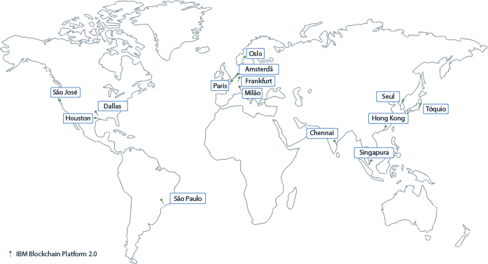
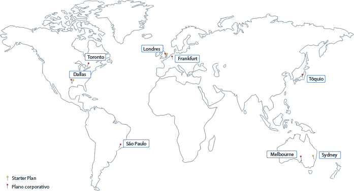

---

copyright:
  years: 2017, 2019
lastupdated: "2019-06-18"

keywords: data centers, IBM Cloud regions, available locations

subcollection: blockchain

---

{:external: target="_blank" .external}
{:shortdesc: .shortdesc}
{:screen: .screen}
{:pre: .pre}
{:table: .aria-labeledby="caption"}
{:codeblock: .codeblock}
{:tip: .tip}
{:download: .download}

# {{site.data.keyword.blockchainfull_notm}}  Locais da plataforma
{: #ibp-regions-locations}

O {{site.data.keyword.cloud}}  é hospedado em todo o mundo em vários locais. Locais são data centers em uma área geográfica que é acessada por um terminal. O {{site.data.keyword.blockchainfull_notm}} Platform implementa redes de blockchain no {{site.data.keyword.cloud_notm}} globalmente em locais diferentes. Quando você cria a instância de serviço do {{site.data.keyword.blockchainfull_notm}} Platform no {{site.data.keyword.cloud_notm}}, sua rede de blockchain e os recursos de rede são criados e armazenados no local do {{site.data.keyword.cloud_notm}} no qual você cria a instância de serviço.
{:shortdesc}

Diferentes ofertas do {{site.data.keyword.blockchainfull_notm}} Platform estão disponíveis em diferentes locais do {{site.data.keyword.cloud_notm}}. É possível criar redes de blockchain somente em locais do {{site.data.keyword.cloud_notm}} em que os planos do {{site.data.keyword.blockchainfull_notm}} Platform estão disponíveis.

A Tabela 1 e a Figura 1 mostram as regiões e as localizações do {{site.data.keyword.cloud_notm}} que o {{site.data.keyword.blockchainfull_notm}} Platform for {{site.data.keyword.cloud_notm}} suporta.

Se você desejar usar um cluster {{site.data.keyword.cloud_notm}} Kubernetes grátis, não escolha um cluster grátis na Ásia-Pacífico. Caso contrário, seu cluster grátis será criado em Melbourne no Sul da AP em vez de na Norte da AP. Os clusters do Sul da AP não podem ser usados para implementar o {{site.data.keyword.blockchainfull_notm}} Platform v2.0 agora. Escolha os locais **Sul dos EUA** ou **Central da UE** se você planeja usar um cluster grátis.
{: note}

| Região | Locais do {{site.data.keyword.cloud_notm}} |
|--------|--------------------|
| Sul dos Estados Unidos | São José, São Paulo, Dallas, Houston |
| AP Norte | Tokyo, Chennai, Hong Kong, Seul, Singapura |
| Central da UE | Frankfurt, Amsterdã, Milão, Oslo, Paris |

_Tabela 1. Localizações do {{site.data.keyword.blockchainfull_notm}} Platform for {{site.data.keyword.cloud_notm}}_

A Tabela 2 e a Figura 2 mostram as regiões e os locais {{site.data.keyword.cloud_notm}} que o {{site.data.keyword.blockchainfull_notm}} Platform Starter Plan e o Enterprise Plan suportam.

| Localização | Starter Plan | Plano corporativo |
|--------|----------|----------|
| Dallas | S | S |
| Londres | S | S |
| Tóquio |  | S |
| Frankfurt |  | S |
| Sydney | S |  |
| Melbourne |  | S |
| São Paulo |  | S |
| Toronto |  | S |

_Tabela 2. Locais do Starter Plan e do Enterprise Plan_

Localizações do 
